# Command Framework, Messages, Placeholders & Platform Services

<!-- preface:start -->
> **How to use this file.** This is a code-traced audit of *Command Framework, Messages, Placeholders & Platform Services* in Gangland Warfare, taken on
> 2026-09-02 from branch `0.8.1` (Keystone 1.7.3). It describes what the code **does today**, workflow by workflow,
> so an agent can fix a bug, tweak behaviour, plan a feature, or write tests without re-tracing the system.
>
> - **Citations are pointers, not proof.** Every `File.java:line` was checked after writing, but the code moves.
>   Before you change anything, open the cited file and grep the symbol named in the sentence; trust the class and
>   method names over the line number. A citation ending in `:line-unverified` could not be re-located.
> - **Observations are findings, not confirmed bugs.** Each row carries the tracer's confidence. Rows prefixed
>   `WITHDRAWN:` were disproved during verification and are kept only so the numbering stays stable. Reproduce a
>   High-risk row in code (or a test) before fixing it.
> - **Sections.** *Components* names the classes; *Configuration & Data* the YAML keys, tables and message keys;
>   *Workflows* (`W1`, `W2`, …) the execution paths with trigger, steps, diagram, persistence effects and guards;
>   *Cross-feature Dependencies* what breaks elsewhere if you change this; *Test Surface* what can be unit-tested
>   with plain JUnit/Mockito versus what needs Bukkit/Keystone mocks or a live server.
> - **Conventions live elsewhere.** For *how* to add or change code in this repo, follow `CLAUDE.md` at the repo
>   root (Spigot-only APIs, method-brace style, Keystone at provided scope, the SQLite test teardown rules), the
>   `command-create` and `panel-create` skills for new commands and GUI panels, and the feedback rules in the
>   project memory (YAML key style, `SoundEffect` for sounds, `ItemRefresher` per item type, `setDataSupplier`
>   for every repository, no Paper APIs).
> - **Risk stars** on the rendered page: three stars = High (a player can hit it in normal play), two = Medium
>   (situational), one = Low (cosmetic or unlikely).

Rendered page with diagrams and a table of contents: https://claude.ai/code/artifact/d2dbe24f-1d3f-46ca-9353-0c2775157df9
<!-- preface:end -->

## Overview

Gangland registers exactly one Bukkit command, `/glw` (alias `/gangland`, permission `gangland.command.main`,
`gangland-impl/src/main/resources/plugin.yml:18-23`), whose executor is
`org.luckyraven.gangland.command.CommandManager` — a thin subclass of Keystone's
`org.luckyraven.keystone.command.CommandManager`. Keystone owns classpath scanning, DI construction of
subcommands, the `Argument` tree, dispatch, the visibility-filter seam and Brigadier client completion;
Gangland's subclass re-implements `onCommand`/`show` so error lines come from the `Messages` enum, installs a
`DevCommandVisibilityFilter`, and adds a `commands.json`-backed help layer (`HelpInfo` + `InformationManager`).
Messages resolve through a static `MessageProvider` seam (`Messages.init(...)`) that Keystone's `LanguageLoader`
publishes on first load and on every reload; each value is styled by prefix type and coloured by
`GanglandChatUtil.color` (`&` codes plus a `%money_symbol%` substitution). Placeholders resolve through
`PlaceholderService`, a Keystone `CompositePlaceholderProvider` chain that runs PlaceholderAPI first (when
hooked) and the internal `GanglandPlaceholder` handler after it. Platform services in scope — sound gating via
`ResourcePackTracker`, the `UpdateNotifier` join check, and `TimeMessages` — are all Keystone types installed
from `KernelConfig`/`Gangland.onEnable` and fed by impl-side listeners.

## Components

| Class | Location | Role |
|---|---|---|
| `Gangland` | `gangland-impl/src/main/java/org/luckyraven/gangland/Gangland.java` | Plugin entry; owns `FULL_PREFIX="gangland"` (line 48), `SHORT_PREFIX="glw"` (line 49), the `UpdateNotifier`, the PAPI expansion adapter, resource-pack tracker teardown |
| `GanglandContext` | `.../bootstrap/GanglandContext.java` | Bootstrap; `runCommandPhase()` (line 180-219) installs `ArgumentMessages`, binds `InformationManager`, scans commands, wires tab completers |
| `CommandManager` | `.../command/CommandManager.java` | `/glw` dispatcher; overrides `onCommand` (52-108), `show` (110-127), private `onSubHelp` (133-153) |
| `Command` (Gangland) | `.../command/Command.java` | Subcommand base; `super(gangland, Gangland.FULL_PREFIX, label, user, alias)` (44) → permission `gangland.command.<label>`; overrides `runExecute` (54-67) for localized errors; `renderHelp` bridge (73) |
| `HelpInfo` | `.../command/HelpInfo.java` | Paged help renderer, 7 lines/page default (19), `displayHelp` (70-94) |
| `DevCommandVisibilityFilter` | `.../command/DevCommandVisibilityFilter.java` | Hides 5 dev command classes from listings unless the sender is one of two hard-coded dev UUIDs (32-33) |
| `CommandInformation` | `.../command/data/CommandInformation.java` | `record(usage, description)`; `toString()` = `usage + " - " + description` |
| `InformationManager` | `.../command/data/InformationManager.java` | Parses `/commands.json` from the jar into `Map<String, CommandInformation>` (23-33) |
| `Messages` | `.../file/configuration/Messages.java` | 526-constant enum; path + `Type` (prefix style); static `provider` seam (663), `findMissingPaths` (695-703), `toString` (706-719) |
| `Settings` | `.../file/configuration/Settings.java` | Static settings holder + `FileInitializer`; builds `settingsMap` from **field names** by reflection (790-811) and `settingsPlaceholder` from camel→snake of those names (813-822) |
| `SettingsLookupImpl` | `.../file/configuration/SettingsLookupImpl.java` | `SettingsLookup` for `@CommandHandler(condition=...)`; map lookup, fails closed |
| `GanglandChatUtil` | `.../util/GanglandChatUtil.java` | Extends Keystone `ChatUtil`; adds `%money_symbol%` replacement, prefix helpers, `commandDesign`, `setArguments` |
| `TimeMessages` | `.../util/TimeMessages.java` | `TimeMessagesProvider` singleton delegating to `Messages.SECOND…YEAR` |
| `PlaceholderService` | `.../data/placeholder/PlaceholderService.java` | KERNEL-phase resolver registry; builds a `CompositePlaceholderProvider` per `convert` call (60-75) |
| `GanglandPlaceholder` | `.../data/placeholder/worker/GanglandPlaceholder.java` | Keystone `PlaceholderHandler` resolving `user_*`, `bank_*`, `gang_*`, `unique-item_*`, settings tokens |
| `PlayerItemInitBridgeListener` | `.../listener/bridge/PlayerItemInitBridgeListener.java` | Re-fires `UserDataInitEvent` as `PlayerItemInitEvent` (MONITOR, ignoreCancelled) |
| `LoadResourcePackListener` | `.../listener/player/LoadResourcePackListener.java` | Sends the pack on join, feeds `ResourcePackTracker` |
| `KernelConfig` | `.../config/KernelConfig.java` | Produces `InformationManager` (55-59), `ResourcePackTracker` + install (67-71), `Diagnostics` (80-87), `PlaceholderService` + `%money_symbol%` resolver (90-97) |
| `WiringConfig` | `.../config/WiringConfig.java` | Produces `ListenerManager` (41-49), `CommandManager` (51-54), `GanglandPlaceholder` (56-66) |
| `DebugLoggingConfig` | `.../config/DebugLoggingConfig.java` | FILE-phase `DebugLoggingInitializer` over `org.luckyraven.gangland` |
| `Executor` | `gangland-core/.../core/feature/Executor.java` | 19-line abstract base (`plugin`, `name`, `createTimer()`, `execute(Timer)`) — **no subclasses found in the repo** |
| Keystone `CommandManager`/`Command`/`Argument`/`SubArgument`/`OptionalArgument`/`CommandTabCompleter`/`BrigadierTabRegistrar`/`ArgumentMessages`/`CommandMessages`/`CommandVisibilityFilter` | `E:/Programming/java/Keystone/keystone-command/...` | The actual framework |
| Keystone `LanguageLoader`, `YamlMessageProvider` | `keystone-persistence/.../message/`, `keystone-common/.../message/` | Message file load + primary/jar-fallback lookup |
| Keystone `ResourcePackTracker`, `SoundEffect` | `keystone-common/.../sound/` | Custom-sound gating (`SoundConfiguration` no longer exists anywhere; renamed to `SoundEffect` in Keystone 1.7.3) |

Module crossings observed: `gangland-impl` → Keystone (`keystone-command`, `keystone-bean`, `keystone-common`,
`keystone-persistence`, `keystone-hooks`); `gangland-impl` → `gangland-core` (`DownedPlayerRegistry` in
`RespawnCommand`); `gangland-impl` → `gangland-features/cops-n-crooks` (`BankTierRegistry` in
`GanglandPlaceholder`); `gangland-impl` → `gangland-infra/gangland-item` (`PlayerItemInitEvent` in the bridge).

## Configuration & Data

### YAML files and notable keys

- `gangland-impl/src/main/resources/settings.yml` — 25 top-level nodes:
  `Config_Version`, `Debug`, `Update_Checker`, `Language`, `Resource_Pack`, `Database`, `Scoreboard`,
  `Inventory`, `User`, `Bounty`, `Wanted`, `Cops`, `Detainment`, `Gang`, `Money_Symbol`, `Balance_Format`,
  `NPC_Navigation`, `Civilians`, `Loot_Chest`, `Money_Drop`, `Gadgets`, `Block_Regeneration`, `Trader`,
  `Banker`, `Turf`.
  Keys read by this area: `Debug.Enabled`/`Debug.Modules` (Settings.java:369-371 → `DebugLoggingConfig`),
  `Update_Checker.Enable`/`Notify_Privileged_Players`/`Auto_Download` (374-377), `Language` (380),
  `Resource_Pack.*`, `Money_Symbol`.
- `gangland-impl/src/main/resources/message/message_en.yml` (841 lines) and `message_es.yml` (689 lines) —
  loaded by `LanguageLoader` as `message/message_<Language>.yml`.
- `gangland-impl/src/main/resources/commands.json` — 232 entries, each `{usage, description}`. Read once in
  the KERNEL phase (`KernelConfig.informationManager()` → `InformationManager.processCommands()`), from the
  **jar resource** `/commands.json` only — never from the data folder, so admins cannot edit it and a reload
  does not re-read it.

### Database tables and repositories

None. This area owns no tables and no `@Repository` classes. It touches the DB only indirectly:
`BalanceCommand` runs ad-hoc `UserTable.selectAllTableQuery` through `DatabaseHelper`
(`BalanceCommand.java:84-145`), and Keystone's `Diagnostics` hub (installed in `KernelConfig`) persists
classified faults to `gangland_faults` via a sink added in the DATABASE phase.

### Message keys / localization

Resolution pipeline: `Messages.<CONST>.toString()` → `provider.getString(path)` where `provider` is a
`YamlMessageProvider(diskFile, jarCopy)` → `getValue(type, data)` applies the prefix for the constant's `Type`
→ `GanglandChatUtil.color` (translates `&` codes and replaces `%money_symbol%`). If both primary and fallback
miss the key, `Messages.toString` returns the literal `"<missing: " + path + ">"` (Messages.java:716).

Counts (computed from the current files):

| Metric | Value |
|---|---|
| `Messages` enum constants | 526 |
| `message_en.yml` nodes / leaves | 706 / 530 |
| `message_es.yml` nodes | 560 |
| Enum paths missing from `message_en.yml` | **0** |
| Enum paths missing from `message_es.yml` | **114** |
| Keys in EN but not ES | 146 (includes 32 intermediate section nodes) |
| Keys in ES but not EN | 0 |
| EN leaves with no `Messages` constant | 4 |

EN leaves not referenced by any enum constant (dead or read elsewhere):
`Commands.Syntax.Page_Invalid`, `Commands.Syntax.Too_Much_Arguments`, `Config_Version`,
`Normal.Entity_Drop_Money`.

The 114 enum paths absent from `message_es.yml` cluster into these feature groups (a Spanish server renders
each as `<missing: …>`):

- Banker NPC — all 31 `Commands.Banker.*` / `Errors.Banker.*` keys.
- Bank cap — `Commands.Bank.Reset_Cap.Player`, `Commands.Bank.Reset_Cap.All`.
- Gang invite/ally pending & cancel — 20 keys (`Commands.Gang.Invite.Pending.*`,
  `Commands.Gang.Invite.Cancel.*`, `Commands.Gang.Ally.Pending.*`, `…Accept_Multiple`, `…No_Request_From`,
  `Information.Gang.Invite_Already_Sent`).
- Shop — `Commands.Shop.Admin.Category_Created/Removed`, `Commands.Shop.Sell.Success`,
  `Errors.Shop.Sell.Nothing_Valued`, `Errors.Shop.Sell.Economy_Error`.
- Turf — the whole `Commands.Turf.*` / `Information.Turf.*` / `Errors.Turf.*` block (~55 keys).

Note the jar fallback does **not** rescue these: the fallback config is the jar's `message_es.yml`
(`LanguageLoader.loadJarResource`, `keystone-persistence/.../LanguageLoader.java:183-194`), i.e. the same file
that lacks the keys. There is no cross-language fallback to English.

Missing-key reporting: `LanguageLoader.validateMessageKeys()` (224-233) logs
`message_es.yml is missing 114 declared key(s):` plus one WARN line per key on every load and reload.

Colour handling: only `&` codes appear in sources — a repo-wide grep for a literal `§` in
`gangland-impl/src/main/java` and `gangland-core/src/main/java` returns **zero hits**.

Placeholder substitution inside messages is by plain `String.replace` at each call site (e.g.
`Messages.BALANCE_TARGET.toString().replace("%target%", target)`, `BalanceCommand.java:77-81`) — there is no
central token formatter for message text; only `%money_symbol%` is substituted globally by
`GanglandChatUtil.color`.

## Commands & Permissions

Master gate: `gangland.command.main` (checked twice — by Bukkit from `plugin.yml`, and again at
`gangland-impl/.../command/CommandManager.java:56-61`). Every subcommand's permission is `gangland.command.<label>`
(`keystone Command.java:50` with the prefix overload); every nested `SubArgument` inherits
`<parent permission>.<subPermission>` (`keystone SubArgument.java:33`). Permissions are auto-registered with
Bukkit's `PluginManager` on Argument construction (`keystone Argument.java:111-120`).

36 top-level subcommand classes are registered. The 6 that live directly in `command/sub/`:

| Command | Class | Permission | What it does |
|---|---|---|---|
| `/glw balance [player]` (`bal`) | `command/sub/BalanceCommand.java` | `gangland.command.balance` | Prints own balance (player-only branch); optional arg looks up an online user, else scans the whole `UserTable` and matches by `OfflinePlayer` name |
| `/glw update [download]` | `command/sub/DownloadPluginCommand.java` | `gangland.command.update` / `.download` | Reports whether a newer version exists; `download` is a `DoubleArgument` (type twice) that calls `UpdateNotifier.downloadLatestVersion()` |
| `/glw resource` (`download`) | `command/sub/DownloadResourceCommand.java` | `gangland.command.resource` | Player-only; re-sends the resource pack URL — **guarded by `Settings.isScoreboardEnabled()`**, not `isResourcePackEnabled()` |
| `/glw help [page]` (`general`, `?`) | `command/sub/HelpCommand.java` | `gangland.command.help` | Aggregated help; built at `CommandPriority.LOWEST` so every other command's `HelpInfo` is already populated |
| `/glw reload [files\|scoreboard\|inventory\|cleanup]` (`rl`) | `command/sub/ReloadCommand.java` | `gangland.command.reload` | Full or partial reload, see W4 |
| `/glw respawn` | `command/sub/RespawnCommand.java` | `gangland.command.respawn` | Player-only; triggers `CustomPlayerDeathListener.triggerManualRespawn` if the player is in `DownedPlayerRegistry` |

Debug commands (`command/sub/debug/`), all listed in `DevCommandVisibilityFilter.FILTERED` except `option`
and `nbt` is included:

| Command | Class | Permission | What it does |
|---|---|---|---|
| `/glw debug <16 sub-args>` | `debug/DebugCommand.java` | `gangland.command.debug` | Dumps `user-data`, `gang-data`, `member-data`, `rank-data`, `waypoint-data`, `multi`, `anvil`, `villager`, `perms [bukkit]`, `settings/setting [placeholder]`, `placeholder-data`, `update-data`, `inv-data [special]`, `check-perm <perm>`, `weapon`, `version`. `help()` is a no-op (line 187) |
| `/glw option click resource`, `/glw option gang rank <target> <rank>` | `debug/ComponentExecutorCommand.java` | `gangland.command.option` | Resource-pack instructions (linked from the DECLINED chat button) and a rank-setting flow. `onExecute` is empty; `help()` is a no-op |
| `/glw nbt [brief]` (`read-nbt`, `readnbt`) | `debug/ReadNBTCommand.java` | `gangland.command.nbt` | Dumps the held item's NBT as formatted JSON; `brief` lists only `WeaponTag`/`LootChestWandTag` values |
| `/glw timer <create\|delete\|mode\|start\|stop\|interval>` | `debug/TimerCommand.java` | `gangland.command.timer` | Manipulates a per-sender `SequenceTimer` held in two `HashMap<CommandSender, …>` fields |
| (support class) | `debug/VillagerDebugPanel.java` | — | A `Panel<Session>` with one emerald button, opened by `debug villager` |

`DevCommandVisibilityFilter` gates listing only (Keystone documents this explicitly at
`keystone:CommandVisibilityFilter.java:6-12`): `DebugCommand`, `ComponentExecutorCommand`, `ReadNBTCommand`,
`TimerCommand`, `DownloadPluginCommand` are hidden from help/suggestions/completion for anyone whose UUID is
not `4b2d5e4d-…` or `ad72b2bb-…`. Dispatch is unfiltered — a non-dev op with `gangland.command.debug` can
still run `/glw debug`. `ReadNBTCommand` is filtered but `ComponentExecutorCommand`'s public entry point
(`/glw option click resource`) is the target of a chat button shown to every player who declines the pack
(`LoadResourcePackListener.java:58`).

### commands.json cross-check

Method: for each of the 36 `extends Command` classes take its `super(gangland, "<label>", …)` label and its
`getCommands()…startsWith("<prefix>")` help filter, then compare with the 232 JSON keys.

- **Command classes with no `commands.json` entry keyed on their label (7):**
  `AmmunitionCommand` (`ammo`), `ComponentExecutorCommand` (`option`), `DebugCommand` (`debug`),
  `HelpCommand` (`help`), `ReadNBTCommand` (`nbt`), `TeleportCommand` (`teleport`), `TimerCommand` (`timer`).
  Four of these (`option`, `debug`, `nbt`, `timer`) are intentionally help-less (`help()` bodies are empty).
  `AmmunitionCommand` and `TeleportCommand` are *not* — they populate `HelpInfo` from a different prefix
  (`ammunition`, `waypoint`), so their pages render but under a key that does not match their label.
  `HelpCommand` pulls `general`/`general_page` explicitly.
- **`commands.json` keys with no matching command label (25):**
  `ammunition_give`, `ammunition_help`, `ammunition_info`, `ammunition_list` (consumed via the `ammunition`
  filter, so live), `general`, `general_page` (consumed by `HelpCommand`, live), and **19 genuinely dead
  entries** for commands that no longer exist:
  `dealer`, `dealer_create`, `dealer_remove`, `kit`, `kit_create`, `kit_item`, `kit_list`, `kit_remove`,
  `safe_wand`, `spawn`, `spawn_list`, `spawn_remove`, `spawn_set`, `spawn_tp`, `warp`, `warp_list`,
  `warp_remove`, `warp_set`, `warp_tp`.
- **Duplicate consumption:** `TeleportCommand` and `WaypointCommand` both filter on `"waypoint"`, so the same
  17 entries land in two `HelpInfo` lists and appear twice in `/glw help`.
- **Stale entries under a live prefix:** `reload_database` (`/glw reload data`) is loaded into
  `ReloadCommand`'s help (the filter is `startsWith("reload")`) but no `data` argument exists in
  `initializeArguments()` (`ReloadCommand.java:41-79`); conversely `inventory` and `cleanup` arguments exist
  but have no `reload_inventory`/`reload_cleanup` JSON entry, so they are undocumented in `/glw reload help`.
- **Classes under `command/sub/**` that are not top-level commands:** 161 (`SubArgument` subclasses and
  helpers such as `NameLookup`, `TurfSelectionResolver`, `VillagerDebugPanel`). These are not keyed in
  `commands.json` by class; their usage strings come in through the parent's prefix filter.

## Events

| Event | Fired by | Handled by | Purpose |
|---|---|---|---|
| `UserDataInitEvent` | `CreateAccountListener` (async DB load → main thread) | `PlayerItemInitBridgeListener.onUserDataInit` (`listener/bridge/…:19-22`) | Re-fires as `PlayerItemInitEvent` so `gangland-item` listeners react without importing impl types |
| `PlayerItemInitEvent` | `PlayerItemInitBridgeListener` | `gangland-infra/gangland-item` listeners | Item initialization after user data is ready |
| `PlayerJoinEvent` | Bukkit | `CreateAccountListener` (LOWEST, line 57) — update notification; `LoadResourcePackListener.onPlayerJoin` — sends pack | Update notice + resource pack push |
| `PlayerResourcePackStatusEvent` | Bukkit | `LoadResourcePackListener.onResourcePackStatus` (25-68) | Feeds `ResourcePackTracker`, kicks/nudges on DECLINED |
| `PlayerQuitEvent` | Bukkit | `LoadResourcePackListener.onPlayerQuit` (79-82) | `ResourcePackTracker.markUnloaded` |
| `AsyncPlayerSendCommandsEvent` (Paper only) | Server | Keystone `BrigadierPaperListener` | Per-player Brigadier tree; not used on Spigot |

No custom events are declared by this area.

## Workflows

### W1: `/glw  …` dispatch

**Trigger:** A player or console runs `/glw …` (or `/gangland …`).

**Steps:**
1. Bukkit checks `permission: gangland.command.main` from `plugin.yml:21` and invokes the executor bound in
   `GanglandContext.runCommandPhase` (`bootstrap/GanglandContext.java:204`).
2. `CommandManager.onCommand` (`gangland-impl/.../command/CommandManager.java:53`) re-checks
   `String.format("%s.command.main", fullPrefix.toLowerCase())` (56-61). Failure → `Messages.COMMAND_NO_PERM`
   and `return false` (Bukkit then also prints the command's `usage`, which is unset here).
3. `args.length == 0` → `show(sender)` (110-127): a hard-coded `&8--&6=&7&oGangland Warfare&6=&8--` banner,
   authors, version, and a "Type /glw help" hint. This bypasses Keystone's `CommandMessages.summary`.
4. Otherwise it iterates `commandView()` (Keystone's live `LinkedHashMap`) looking for
   `key.equalsIgnoreCase(args[0])` or an alias hit (70-72).
5. If **any** element of `args` equals `"help"` → `onSubHelp(...)` (W3). Otherwise
   `entry.getValue().runExecute(shortPrefix, sender, args)` (75). Note `shortPrefix` ("glw"), not the typed
   `label`, is passed as the command prefix used in "did you mean" suggestions.
6. `Command.runExecute` (`command/Command.java:54-67`) checks `sender.hasPermission(getPermission())` →
   `Messages.COMMAND_NO_PERM`; then `isUser() && !(sender instanceof Player)` → `Messages.NOT_PLAYER`; then
   `getArgument().execute(commandPrefix, sender, args)`.
7. Keystone `Argument.execute` (`keystone-command/.../Argument.java:145-168`) maps each raw token to a
   throwaway `Argument` (or `ConfirmArgument` when the token contains "confirm"), then `traverseList` walks the
   tree depth-first (259-287). At each node the node's own permission is checked
   (`!permission.isEmpty() && !sender.hasPermission(permission)` → `NO_PERMISSION`), `executeOnPass` fires, and
   the leaf reached at `index == list.length - 1` is `SUCCESS`.
8. `SUCCESS` → `executeArgument` runs the node's `TriConsumer` action, or sends
   `ArgumentMessages.notImplemented()` (localized to `Messages.ARGUMENT_NOT_IMPLEMENTED` at
   `GanglandContext.java:196-199`) when no action is attached.
9. `NO_PERMISSION` → `ArgumentMessages.noPermission()` (localized to `Messages.COMMAND_NO_PERM`).
10. `NOT_FOUND` → `Argument.notFound` (218-257): prints `ArgumentMessages.wrongArgumentsPrefix()`
    (`Messages.ARGUMENTS_WRONG`) + the offending token, then a "did you mean" line built from the last valid
    node's children via `ChatUtil.suggestCommand`.
11. Unknown first token (no registry match) → `Messages.ARGUMENTS_DONT_EXIST` styled through
    `GanglandChatUtil.setArguments`, then a suggestion built from `permissibleCommands(sender)`
    (`gangland-impl/.../command/CommandManager.java:85-97`), then `return false`.

**Exception path:** anything thrown inside an argument action is caught by `Argument.execute`'s
`catch (Throwable)` (159-167): `sender.sendMessage(throwable.getMessage())` when the message is non-null —
the long-standing "throw with a player-facing message" idiom — otherwise `ArgumentMessages.actionError()`;
the throwable also goes to `Diagnostics.active().report(t, "command.argument")`. Anything thrown above that
(e.g. inside `runExecute` or the registry loop) is caught by Gangland's own
`catch (Throwable)` (`gangland-impl/.../command/CommandManager.java:103-106`), which **only logs** — it neither reports to `Diagnostics`
nor sends the sender anything, unlike Keystone's version (`keystone CommandManager.java:227-236`).

**Diagram:**
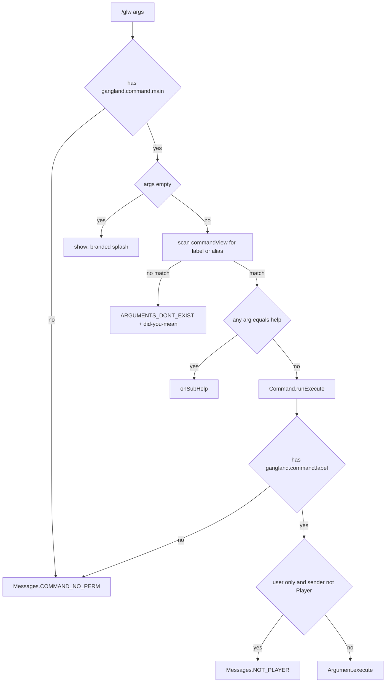

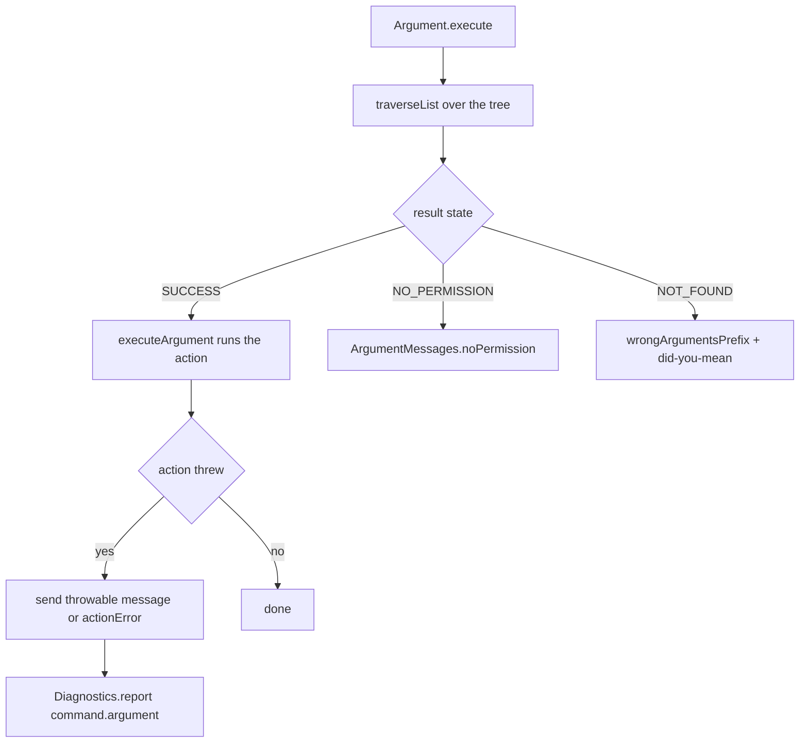

**State & persistence effects:** none by itself. `DoubleArgument` keeps a per-sender `ArgumentLock`
(`keystone .../types/DoubleArgument.java:14`) so `/glw update download` must be typed twice.

**Edge cases & guards observed:**
- Wrong argument count never produces a dedicated message; the tree simply fails to reach a leaf and the
  `NOT_FOUND` branch runs (an extra trailing token gives "Wrong arguments: <token>").
- `notFound` dereferences `args[0]` when `lastValid == null` — safe because `args.length >= 1` here.
- `Arrays.stream(args).anyMatch("help")` means any argument literally equal to `help` anywhere in the line
  routes to help (e.g. `/glw gang rename help` shows the gang help page instead of renaming).
- `sender.sendMessage(String[])` is used in several debug arguments (e.g. `DebugCommand.java:385`); an empty
  array is a no-op, but a very large permission list will spam the console/chat.

### W2: Tab completion

**Trigger:** the player presses TAB while typing `/glw …`, or the client receives the command tree at login.

**Steps:**
1. `GanglandContext.runCommandPhase` builds `new CommandTabCompleter(commandManager)` (line 209) — the
   *live-view* constructor, so late registrations and the installed visibility filter are read per keystroke.
2. `tabCompleter.setHelpSuggestionPredicate(cmd -> cmd instanceof Command g && g.getHelpInfo().size() > 0)`
   (210-211) — `help` is offered at position 2 only for subcommands that actually have help entries.
3. `command.setTabCompleter(tabCompleter)` (212), then
   `BrigadierTabRegistrar.registerIfSupported(gangland, command, commandManager)` (216). On Spigot this
   registers one shared Brigadier tree via Commodore with per-node `requires()` predicates that reflectively
   extract the Bukkit sender and call `hasPermission`; any failure is logged WARN and the server-side completer
   remains the only path.
4. Server-side path — `CommandTabCompleter.onTabComplete`
   (`keystone-command/.../CommandTabCompleter.java:67-113`):
   - `args.length == 1`: every registered command whose permission the sender holds **and** which passes
     `DevCommandVisibilityFilter`, plus the literal `help`, filtered by case-insensitive prefix and sorted.
   - deeper: resolve `args[0]` by label then alias; bail out on missing permission or hidden command; bail out
     if `args.length > handler.getArgumentTree().height()`; walk to the node at depth `args.length - 2`; collect
     each permitted child's `getArgumentString(sender)`.
   - `OptionalArgument.getArgumentString` (`keystone:.../types/OptionalArgument.java:89-106`) returns the wired
     `customStrings.apply(sender)` list when present, else the concrete literals with the `"?"` wildcard
     filtered out.
5. Results are deduplicated, prefix-filtered (`regionMatches(true, …)`) and sorted alphabetically.

**Diagram:**
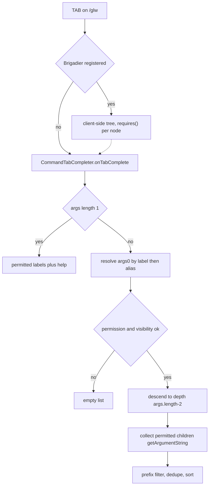

**State & persistence effects:** none intended — but some `customStrings` suppliers have side effects
(see Observations #6, #7).

**Edge cases & guards observed:**
- The `"?"` wildcard is explicitly filtered out of suggestions (`keystone:OptionalArgument.java:103-105`) and out of the
  unknown-subcommand dictionary (`gangland-impl/.../command/CommandManager.java:90`).
- `argumentMatches` refuses to let an `OptionalArgument` swallow an input that matches a concrete sibling
  literal (`keystone:CommandTabCompleter.java:175-187`).
- Suggestions are permission-filtered at every level, so an unprivileged player sees neither hidden nor
  unpermitted branches; but see Observation #12 for what still leaks.

### W3: Help rendering (paging + dev filter)

**Trigger:** `/glw help [page]`, `/glw  help [page]`, or any command line containing the token `help`.

**Steps:**
1. `CommandManager.onCommand` finds a registry entry for `args[0]`; `Arrays.stream(args).anyMatch("help")`
   → `onSubHelp(entry.getValue(), sender, args)` (`gangland-impl/.../command/CommandManager.java:74`).
   `/glw help` itself matches the registry key `help` (HelpCommand's label), so it too takes this path —
   `HelpCommand.onExecute` is effectively dead code for the `help` literal (it only fires if the sender types
   an alias, `general` or `?`, and only because `onExecute` re-checks `getAlias().contains(arg)`).
2. `onSubHelp` (133-153) scans `args[0 .. len-2]` for the token `help`, parses `args[index+1]` as the page
   number, and swallows `NumberFormatException`/`ArrayIndexOutOfBoundsException` (page stays 1).
3. `if (!(sub instanceof Command ganglandCommand)) return;` — a non-Gangland Keystone command silently
   produces nothing.
4. `ganglandCommand.renderHelp(sender, page)` → `Command.renderHelp` (`command/Command.java:73-75`) →
   the subclass's `help(...)` → `HelpInfo.displayHelp(sender, page, title)`.
5. `HelpInfo.displayHelp` (`command/HelpInfo.java:70-94`): empty list → `Messages.COMMAND_HELP_EMPTY`;
   `page < 1` or `page > maxPages` → `IllegalArgumentException` (caught in `onSubHelp` and shown via
   `GanglandChatUtil.errorMessage`); otherwise a coloured header with `page/maxPages` and up to `breaks` (7)
   `CommandInformation` lines, each styled by `GanglandChatUtil.commandDesign` (colours `/glw`, `<`, `>`, the
   ` - ` separator, and strips `[`, `]`, `,`).
6. The per-command `HelpInfo` list is built in each subcommand's **constructor** from
   `getCommands()` — the static `InformationManager` bound at `GanglandContext.java:203` before scanning —
   filtered by a hard-coded prefix and sorted by JSON key.
7. `HelpCommand`'s aggregate list is `general` + `general_page` + a `parallelStream()` flat-map over every
   registered Gangland command's `HelpInfo` (`command/sub/HelpCommand.java:22-37`); `CommandPriority.LOWEST`
   makes it the last command constructed so the manager's view is complete.
8. Dev filtering: `permissibleCommands` applies `DevCommandVisibilityFilter` — but only Keystone's
   `onHelpAll` uses it, and Gangland's `onCommand` override never calls `onHelpAll`. `HelpCommand`'s
   aggregate page is assembled once at construction from `commandView()` with **no filter and no sender**, so
   whatever the dev commands contribute to `HelpInfo` would appear for everyone (in practice all five filtered
   classes have empty `HelpInfo`, so nothing leaks today).

**Diagram:**
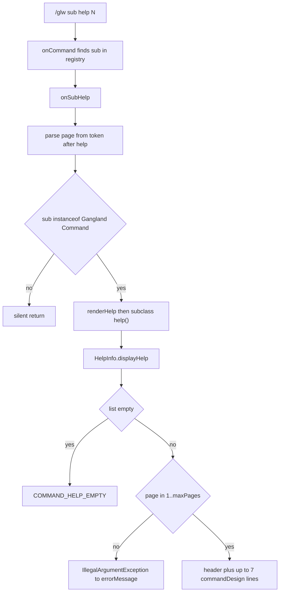

**State & persistence effects:** none.

**Edge cases & guards observed:**
- `/glw help 0` and `/glw help 99` both produce `GanglandChatUtil.errorMessage("Cannot get page less than 1"
  / "Cannot exceed maximum allowed pages")` — raw English exception text, not a `Messages` key.
- Help rendering runs **before** any subcommand permission check (see Observation #2).
- `HelpCommand` inserts `informationManager.getCommands().get("general")` and `…get("general_page")` directly
  (lines 24-25); both keys exist today, but a missing key would put `null` in the list and NPE inside
  `displayHelp`'s `list.get(index).toString()`.

### W4: `/glw reload` end-to-end

**Trigger:** `/glw reload` (full) or `/glw reload files|scoreboard|inventory|cleanup`.

**Steps:**
1. `ReloadCommand.onExecute` / one of the four sub-argument actions calls
   `reloadProcess(process, runnable, forceUpdate)` (`command/sub/ReloadCommand.java:86-106`).
2. `GanglandChatUtil.sendToOperators(getPermission(), "&bReloading&7 the plugin…")` — broadcast to everyone
   holding `gangland.command.reload` (the sender is not messaged directly; they receive it only if they hold
   the permission, which `runExecute` already proved for the sender).
3. When `forceUpdate` is true (full reload and `files`), `PeriodicalUpdates.forceUpdate(callback)` flushes all
   pending async repository upserts first, then re-enters the main thread via
   `Bukkit.getScheduler().runTask(...)` (104-105) — explicitly to stop `loadAll()` racing pending writes.
4. `runReloadBody` (108-121) runs the body inside `try/catch (Throwable)`, broadcasting
   `"&aReload has been completed."` or `"&cThere was a problem reloading the plugin!"` and logging the
   throwable.
5. Bodies:
   - full → `ReloadPlugin.reload()` → `GanglandContext.reloadBeans()` (owned by the core-lifecycle area):
     every `BeanLifecycle` bean walks `onPreClear → onClear → onInitialize(false)` in topological order.
     For this area that re-runs `LanguageLoader.onInitialize(false)` → `initialize()` → reload
     `message_<lang>.yml`, re-log missing keys, and re-publish the provider into `Messages` and
     `TimeMessages` (`config/FileConfig.java:86-100`, `keystone LanguageLoader.java:80-109`).
   - `files`/`file` → `ReloadPlugin.filesReload()`: `FileManager.onClear()` + `onInitialize(false)`.
   - `scoreboard` → `ReloadPlugin.scoreboardReload()`, itself gated on `Settings.isScoreboardEnabled()` both
     in the command action (`ReloadCommand.java:50`) and in `ReloadPlugin` (line 66).
   - `inventory` → `PeriodicalUpdates.resetCache()` + `ReloadPlugin.inventoryReload()`.
   - `cleanup` → `PeriodicalUpdates.getCleanupService().forceCleanup()`.
6. Not reloaded: `commands.json` (`InformationManager.processCommands()` runs once in the KERNEL phase and is
   not a `BeanLifecycle`), the command registry itself (Keystone's `clearCommands()`/`unregisterCommand` exist
   but are never called), and each command's `HelpInfo` (built in constructors).

**Diagram:**
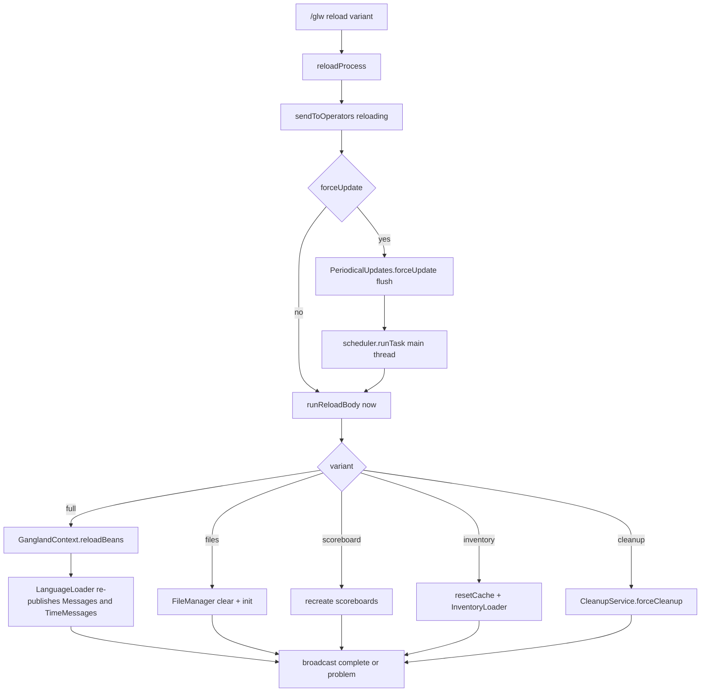

**State & persistence effects:** flushes pending repository writes before a full/files reload; wipes and
rebuilds file-backed caches, scoreboards and inventories.

**Edge cases & guards observed:**
- Errors are swallowed into a generic `&cThere was a problem reloading the plugin!` broadcast; the sender sees
  no detail (the stack trace goes to the log).
- If `PeriodicalUpdates` is absent from the container, `reloadProcess` falls back to a synchronous reload
  without the flush (96-99).
- No confirmation gate on the full reload.

### W5: Debug commands

**Trigger:** `/glw debug …`, `/glw option …`, `/glw nbt …`, `/glw timer …`.

**Steps:**
1. Dispatch is W1; the `DevCommandVisibilityFilter` only affects listing.
2. `DebugCommand.initializeArguments` (`debug/DebugCommand.java:100-184`) builds 16 first-level arguments plus
   4 nested ones (`perms bukkit`, `settings placeholder`, `inv-data special`, `check-perm <perm>`).
   `onExecute` with no argument calls `commandManager.show(sender)` (96).
3. Representative bodies:
   - `settings` dumps `Settings.getSettingsMap()` through `JsonFormatter` (403-409) — this includes the
     **MySQL host, username and password fields** because the map is built by reflection over every static
     field (`Settings.java:790-811`).
   - `settings placeholder` dumps `Settings.getSettingsPlaceholder()` — the same values under snake_case keys.
   - `placeholder-data` resolves `%player%`, `%info%`, `%user_gang-id%` through
     `GanglandPlaceholder.replacePlaceholder` for a player sender (421-432).
   - `check-perm <permission>` echoes `hasPermission`/`isPermissionSet` for an arbitrary node (477-490).
   - `update-data` triggers `PeriodicalUpdates.forceUpdate()` — a full async save (435-439).
   - `version` prints server/Bukkit/plugin/API versions and, when ViaVersion is present, the client protocol.
4. `TimerCommand` stores `SequenceTimer`s in `Map<CommandSender, SequenceTimer> timerMap` and
   `startedTimers` (`debug/TimerCommand.java:17-24`), keyed by the live `CommandSender`.
5. `ComponentExecutorCommand`'s `option click resource` sends two static instruction lines
   (`debug/ComponentExecutorCommand.java:64-81`); `option gang rank <target> <rank>` casts the sender to
   `Player` in both the action and the completion supplier (89-90, 102-103).

**Diagram:**
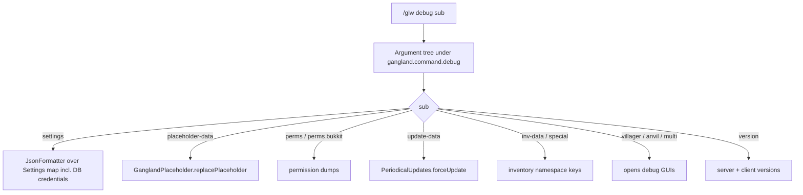

**State & persistence effects:** `update-data` forces a full save; `timer create/start` schedules real Bukkit
tasks; `debug villager/anvil/multi` open inventories.

**Edge cases & guards observed:**
- `DebugCommand` and `TimerCommand` are `user=false`, so console can run them; several bodies branch on
  `sender instanceof Player` (e.g. 421-432, 441-467) but `ComponentExecutorCommand`'s gang/rank flow does not.
- `DebugCommand.help()` and `ReadNBTCommand.help()`/`TimerCommand.help()`/`ComponentExecutorCommand.help()`
  are empty methods, so `/glw debug help` prints nothing at all (and the help suggestion is not offered
  because their `HelpInfo` is empty).

### W6: Message resolution

**Trigger:** any `Messages.X.toString()` call, or a `LanguageLoader` load/reload.

**Steps:**
1. `FileConfig.languageLoader(...)` (`config/FileConfig.java:86-100`) constructs Keystone's `LanguageLoader`
   with `Settings::getLanguagePicked`, folder/base `"message"`, `Messages::findMissingPaths`, and an
   `onLoaded` callback that runs `Messages.init(provider)` + `TimeMessages.initialize()`.
2. `LanguageLoader.initialize()` (`keystone LanguageLoader.java:86-109`): load the jar copy
   (`message/message_<lang>.yml` from the jar, in memory), load the disk file through `FileHandler` if it
   exists (falling back to the jar resource if the disk read fails), run `validateMessageKeys()`, then hand a
   fresh `YamlMessageProvider(disk, jar)` to the callback. An `IOException`/`InvalidConfigurationException`
   here **disables the plugin** after logging the available languages.
3. `Messages.toString()` (`file/configuration/Messages.java:706-719`): `provider.getStringList(path)` joined by
   `\n` when the constant is flagged `isList`, else `provider.getString(path)`; `null` → `"<missing: <path>>"`.
4. `getValue(type, data)` (729-742) prepends the type's prefix and colours:
   `PREFIX → GanglandChatUtil.prefixMessage` (`Messages.PREFIX` + text),
   `COMMAND → commandMessage` (`Messages.COMMAND_PREFIX`), `ERROR → errorMessage` (`Messages.ERROR_PREFIX`),
   `INFORMATION → informationMessage` (`Messages.INFORMATION_PREFIX`), `OTHER → color`.
   The four prefix constants are themselves `Type.OTHER`, so no recursion.
5. `GanglandChatUtil.color` (`util/GanglandChatUtil.java:15-17`) delegates to Keystone `ChatUtil.color` with a
   `Replacement("%money_symbol%", Settings.getMoneySymbol())`; `&`-code and hex translation is Keystone's.
6. Framework-emitted strings are localized separately in `GanglandContext.runCommandPhase`
   (`bootstrap/GanglandContext.java:196-199`) via the 4-slot `ArgumentMessages.install(...)` overload:
   no-permission → `COMMAND_NO_PERM`, not-implemented → `ARGUMENT_NOT_IMPLEMENTED`, wrong-arguments prefix →
   `ARGUMENTS_WRONG`, action-error → left at Keystone's default. Suppliers, so a language reload takes effect
   without re-installing.

**Diagram:**
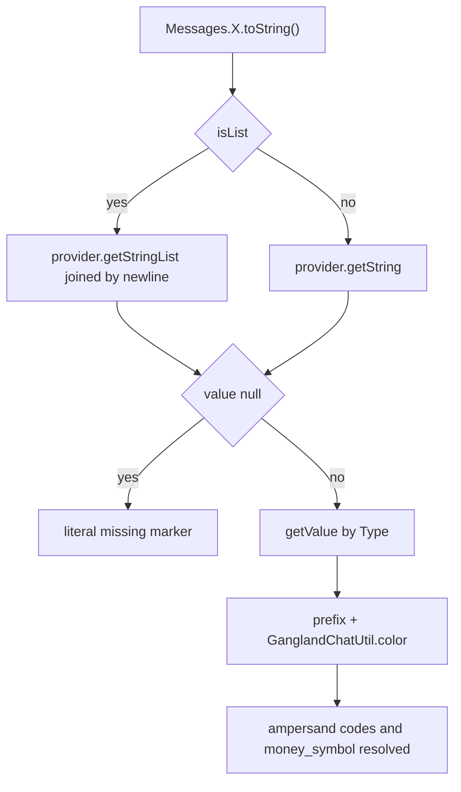

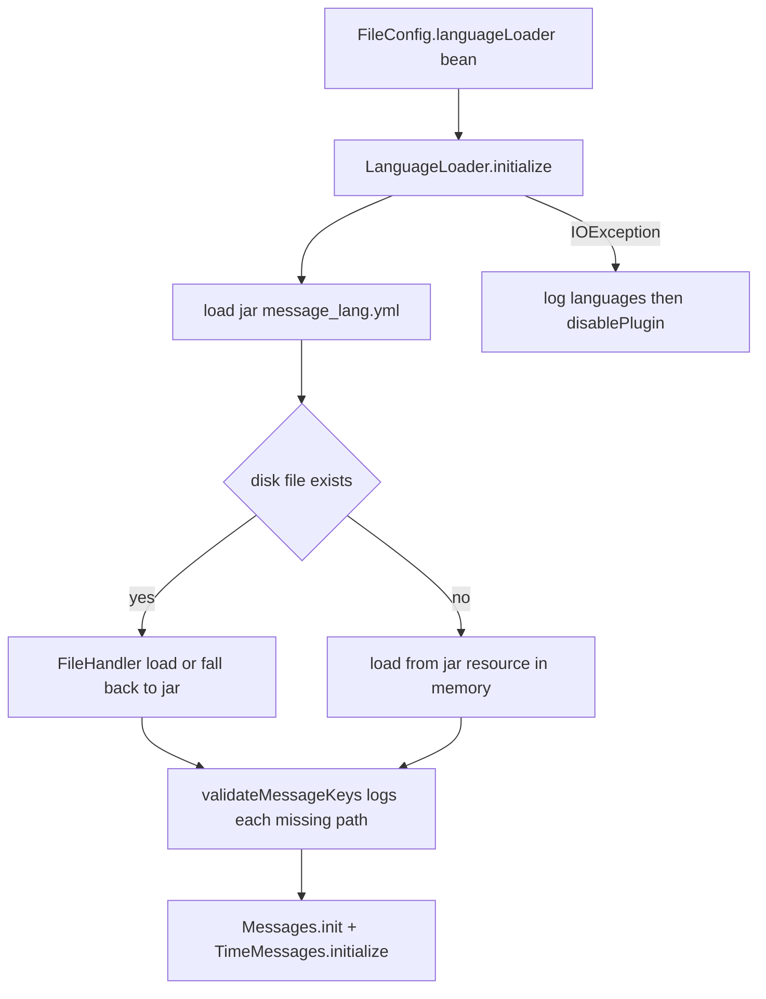

**State & persistence effects:** replaces the static `Messages.provider` reference; no disk writes for a
missing message file (jar copy is used in memory only).

**Edge cases & guards observed:**
- A key missing from disk falls back to the jar copy of the **same language**, never to English.
- `Messages.toStringList()` (721-727) calls `provider.getStringList(path)` and mutates the returned list in
  place with `replaceAll`; it does not null-check, and it applies `getValue` per line.
- Only 4 of the 9 `ArgumentMessages` slots are localized; `confirmRequired`, `confirmPrompt`, `didYouMean`,
  `selectorSyntax`, `selectorNoPlayer` stay English (`keystone ArgumentMessages.java:42-51`).
- `ArgumentMessages` and Keystone's `CommandManager.defaultInstance` are process-wide statics on a shared
  classloader — documented in Keystone as a one-consumer-per-server limitation until 2.0.0.

### W7: Placeholder resolution (internal + PlaceholderAPI)

**Trigger:** any `PlaceholderService.convert(player, text)` call (scoreboard drivers, inventory templates,
item lore, `%gangland_…%` from PlaceholderAPI).

**Steps:**
1. `KernelConfig.placeholderService()` (`config/KernelConfig.java:90-97`) creates the service and immediately
   registers a lambda resolver replacing `%money_symbol%` with `Settings.getMoneySymbol()`.
2. `WiringConfig.ganglandPlaceholder(...)` (CONFIG phase) constructs `GanglandPlaceholder` with prefix
   `"gangland"` and `Replacer.Closure.PERCENT`; its constructor self-registers into `PlaceholderService`
   (`data/placeholder/worker/GanglandPlaceholder.java:57`).
3. `PlaceholderService.convert` (`data/placeholder/PlaceholderService.java:60-75`) builds a fresh
   `ArrayList` chain **on every call**: a lazily-created `PlaceholderAPIProvider` first when
   `gangland.getPapiExpansion() != null`, then every registered resolver in registration order, wrapped so the
   original `Player` (not the composite's `OfflinePlayer`) is passed through.
4. `CompositePlaceholderProvider.resolve` (`keystone-common/.../CompositePlaceholderProvider.java:59-69`)
   feeds each provider the previous one's output — earlier providers win on overlapping tokens.
5. PAPI link: `PlaceholderAPI.setPlaceholders(player, raw)` when the text contains a `%`
   (`keystone-hooks/.../PlaceholderAPIProvider.java:26-30`).
6. `GanglandPlaceholder` link: `PlaceholderHandler.convert` → `containsPlaceholder` regex check →
   `replacePlaceholder` strips the `%gangland_` prefix down to `%` and runs `CharReplacer`
   (`keystone-common/.../replacer/CharReplacer.java:15-78`), which scans char-by-char for
   `%token%` pairs and calls `onRequest(player, token)`; an unresolved token (null) is re-emitted verbatim.
7. `GanglandPlaceholder.onRequest` (89-108): `player == null` → settings lookup or `"NA"`; conditional-flash and
   flash wrappers are checked first; otherwise `resolveInnerPlaceholder`.
8. `resolveInnerPlaceholder` (119-142) dispatches by `param.contains(...)` in order: `user_` → `getUser`,
   `bank_` → `getBank`, `gang_` → `getGang`, `unique-item_` → `getUniqueItem`, then `getSetting`, then the
   literal `"NA"`.
9. PAPI registration: `Gangland.dependencyHandler()` (`Gangland.java:186-190`) — a SOFT `Dependency` on
   `PlaceholderAPI` constructs `new PapiExpansionAdapter(this, FULL_PREFIX, placeholder)` over the
   `GanglandPlaceholder` bean and calls `register()`. `PlaceholderService` detects the hook by null-checking
   `gangland.getPapiExpansion()`.

**Placeholders exposed** (all under the `gangland` prefix; `%gangland_x%` externally, `%x%` internally):

| Family | Tokens |
|---|---|
| user (member-backed, works offline) | `user_has-gang`, `user_gang-id`, `user_gang-join-date`, `user_contribution`, `user_contributed-amount`, `user_has-rank`, `user_rank` |
| user (online only) | `user_balance`, `user_has-bank`, `user_bounty`, `user_has-bounty`, `user_kd`, `user_mob-kills`, `user_kills`, `user_deaths`, `user_wanted`, `user_wanted-level`, `user_wanted-max-level`, `user_is-wanted` |
| user level | `user_level`, `user_level-max`, `user_level-next`, `user_level-previous`, `user_experience`, `user_experience-percentage`, `user_experience-next-level`, `user_experience-previous-level`, `user_experience-current-level`, `user_experience-level-<n>` |
| bank (online only) | `bank_name`, `bank_balance`, `bank_tier`, `bank_tier_display`, `bank_tier_cap`, `bank_daily_deposit_limit`, `bank_deposited_today`, `bank_remaining_deposit`, `bank_next_reset`, `bank_interest_rate`, `bank_weekly_amount`, `bank_monthly_amount`, `bank_weekly_ready_in`, `bank_monthly_ready_in` |
| gang | `gang_id`, `gang_name`, `gang_display-name`, `gang_state`, `gang_color`, `gang_color-name`, `gang_color-code`, `gang_description`, `gang_created`, `gang_balance`, `gang_bounty`, `gang_has-bounty`, `gang_members-size`, `gang_online-members-size`, `gang_offline-members-size`, `gang_ally-list`, `gang_ally-size`, plus the same 10 level tokens with the `gang_` prefix |
| unique item | `unique-item_<key>_<name\|permission\|material\|add-on-join\|add-on-respawn\|drop-on-death\|allow-duplicates\|add-to-inventory\|lore\|inventory-slot\|overrides-slot\|movable\|droppable>` |
| settings | every static `Settings` field name in camel→snake form, e.g. `money_symbol`, `resource_pack_url`, `user_max_level` (built by `Settings.convertToPlaceholder`, 813-822) |
| framework | `%money_symbol%` (KernelConfig lambda resolver, applied to every text) |

**Diagram:**
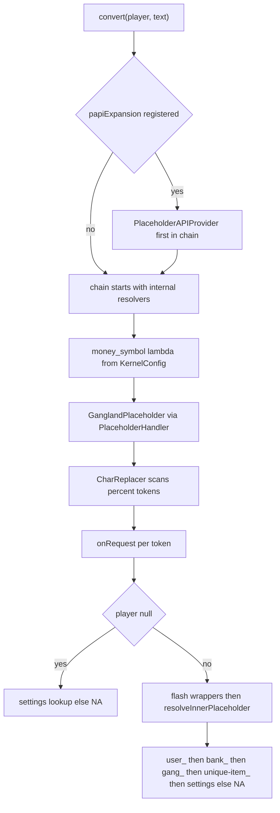

**State & persistence effects:** none.

**Edge cases & guards observed:**
- `resolveInnerPlaceholder` uses `contains`, not `startsWith`, so a token such as `my_user_thing` enters the
  `user_` branch (it then falls through because the equality checks fail).
- Unresolvable tokens end at the literal string `"NA"` (`GanglandPlaceholder.java:139`), never `null`, so a
  typo'd token silently renders `NA` rather than staying visible as `%typo%`.
- `getUser`/`getBank` return `null` for offline players before reaching the online-only tokens, so those
  tokens degrade to the settings lookup → `"NA"`.
- `getUniqueItem` splits on `_`, so a unique-item key containing an underscore mis-parses.
- `getLevelPlaceholder`'s `experience-level-<n>` branch parses the substring after the **last** `-`.

### W8: Sound playback contract

**Trigger:** any `SoundEffect.playSound(player)` / `playAtLocation(location)` call anywhere in the plugin.

**Steps:**
1. `KernelConfig.resourcePackTracker()` (`config/KernelConfig.java:67-72`) constructs a
   `ResourcePackTracker` and calls the process-wide `ResourcePackTracker.install(tracker)`.
2. `SoundEffect` (Keystone record `(SoundType type, String sound, float volume, float pitch)`) resolves
   `VANILLA` names through XSeries; for `SoundType.CUSTOM` it consults `ResourcePackTracker.active()` and skips
   the player when `hasResourcePack(player)` is false (`keystone-common/.../SoundEffect.java:83, 112`). With no
   tracker installed custom sounds play optimistically.
3. `Gangland.onDisable` (`Gangland.java:75-80`) clears the tracker and calls `install(null)` so gating does not
   outlive the plugin.

`SoundConfiguration` no longer exists in either repo — the class was renamed to
`org.luckyraven.keystone.sound.SoundEffect` in Keystone 1.7.3 (a repo-wide grep finds only `SoundEffect.java`
plus its test in `keystone-common`). The CLAUDE.md line describing `SoundConfiguration` in `gangland-core`
is stale; `gangland-core` now contains only `core/downed/**` and `core/feature/Executor.java`.

**Diagram:**
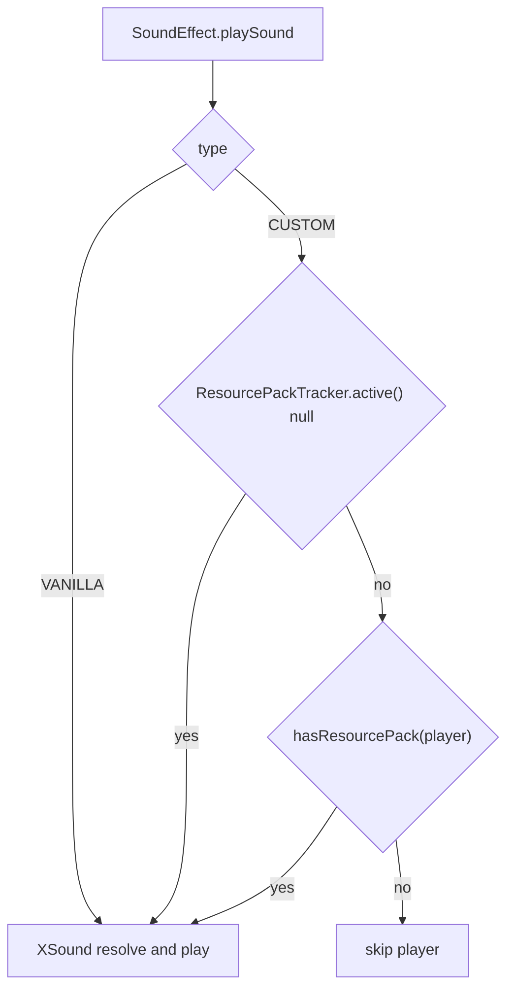

**State & persistence effects:** the tracker's `Set<UUID>` only.

**Edge cases & guards observed:** the tracker is a process-wide static — one per server.

### W9: Resource-pack tracking

**Trigger:** `PlayerJoinEvent`, `PlayerResourcePackStatusEvent`, `PlayerQuitEvent`, and `/glw resource`.

**Steps:**
1. `LoadResourcePackListener.onPlayerJoin` (`listener/player/LoadResourcePackListener.java:70-77`) — returns
   unless `Settings.isResourcePackEnabled()`, then `player.setResourcePack(Settings.getResourcePackUrl())`.
2. `onResourcePackStatus` (25-68), also gated on `isResourcePackEnabled()`:
   `ACCEPTED` → "Downloading…"; `SUCCESSFULLY_LOADED` → success message + `resourcePackTracker.markLoaded`;
   `FAILED_DOWNLOAD` → error message (**tracker is not touched**); `DECLINED` → kick when
   `Settings.isResourcePackKick()`, otherwise a clickable `TextComponent` running `/glw option click resource`.
3. `onPlayerQuit` (79-82) calls `markUnloaded` unconditionally (not gated on the setting).
4. `/glw resource` re-sends the pack — but its guard is `Settings.isScoreboardEnabled()`
   (`command/sub/DownloadResourceCommand.java:29-36`; the method body is
   `if (!Settings.isScoreboardEnabled()) return; ((Player) commandSender).setResourcePack(...)`).

**Diagram:**
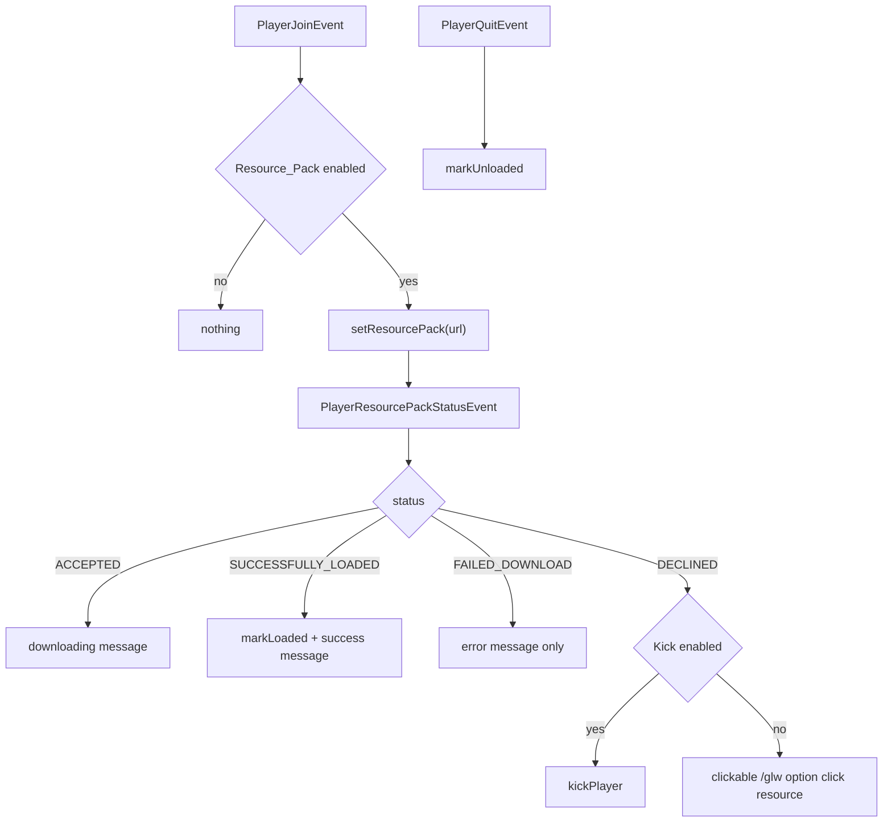

**State & persistence effects:** `ResourcePackTracker`'s in-memory UUID set only.

**Edge cases & guards observed:**
- `DECLINED` and `FAILED_DOWNLOAD` never call `markUnloaded`, so a player who loaded the pack, then reloaded
  and declined, stays marked as loaded until quit.
- The clickable fallback points at a dev-filtered command (`option`), whose permission
  (`gangland.command.option`) ordinary players do not hold.

### W10: Update-notifier check on join

**Trigger:** plugin enable (timer) and `PlayerJoinEvent`.

**Steps:**
1. `Gangland.updateCheckerInitializer()` (`Gangland.java:220-239`): **returns immediately when
   `!Settings.isUpdaterEnabled()`**, leaving the `updateChecker` field `null`. Otherwise it builds a Keystone
   `UpdateChecker(this, permissionManager, FULL_PREFIX, resourceId=131157)` wrapped in an `UpdateNotifier` with
   a 6-hour interval, `Settings::isUpdaterAutoUpdate` and `GanglandChatUtil::commandMessage`, then `start()`s it.
2. `CreateAccountListener.onPlayerJoin` (`listener/player/CreateAccountListener.java:57-66`, priority LOWEST)
   reads `gangland.getUpdateChecker()` and calls `updateChecker.getCheckPermission()` and
   `updateChecker.updateAvailable()` **without a null guard**, sending
   `GanglandChatUtil.prefixMessage(updateChecker.getUpdateMessage())` to permitted players.
3. `/glw update` compares `getLatestVersion()` with `getDescription().getVersion()`
   (`command/sub/DownloadPluginCommand.java:32-44`) and replies `UPDATE_AVAILABLE` (with `%short_prefix%`
   substituted) or `UPDATE_LATEST`.
4. `/glw update download` is a `DoubleArgument` under `gangland.command.update.download`: the first run arms
   the lock and sends `ArgumentMessages.confirmPrompt()` (English default), the second run checks
   `updateAvailable()`, then `downloadLatestVersion()` and reports `UPDATE_DOWNLOAD_SUCCESS`/`_FAILED`.

**Diagram:**
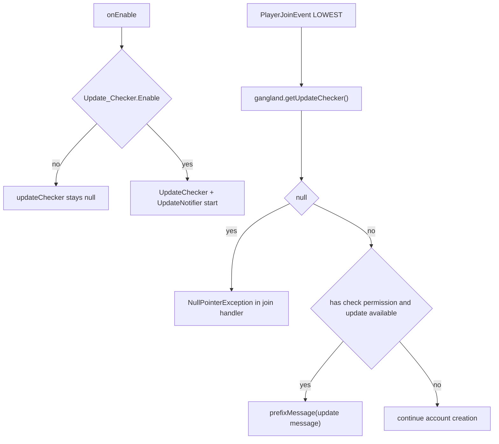

**State & persistence effects:** `downloadLatestVersion()` writes a jar into the update folder.

**Edge cases & guards observed:** see Observation #1 — with the updater disabled the join handler throws.

### W11: Time formatting

**Trigger:** any Keystone duration formatting that consults `TimeMessagesProvider`.

**Steps:**
1. `TimeMessages.initialize()` is called from the `LanguageLoader` `onLoaded` callback
   (`config/FileConfig.java:96`) on first load and every reload.
2. `initialize()` (`util/TimeMessages.java:12-16`) is a **no-op once `instance != null`** — later reloads do not
   replace the singleton, which is harmless because the six getters read `Messages.*.toString()` live.
3. `getYear/Week/Day/Hour/Minute/Second` map to `Messages.YEAR`…`Messages.SECOND`
   (`Time_Unit.Year` … `Time_Unit.Second`, all `Type.OTHER`, so they are coloured but unprefixed).
4. `getInstance()` throws `IllegalStateException("TimeMessages instance not initialized.")` if called before
   the language load.

**Diagram:**
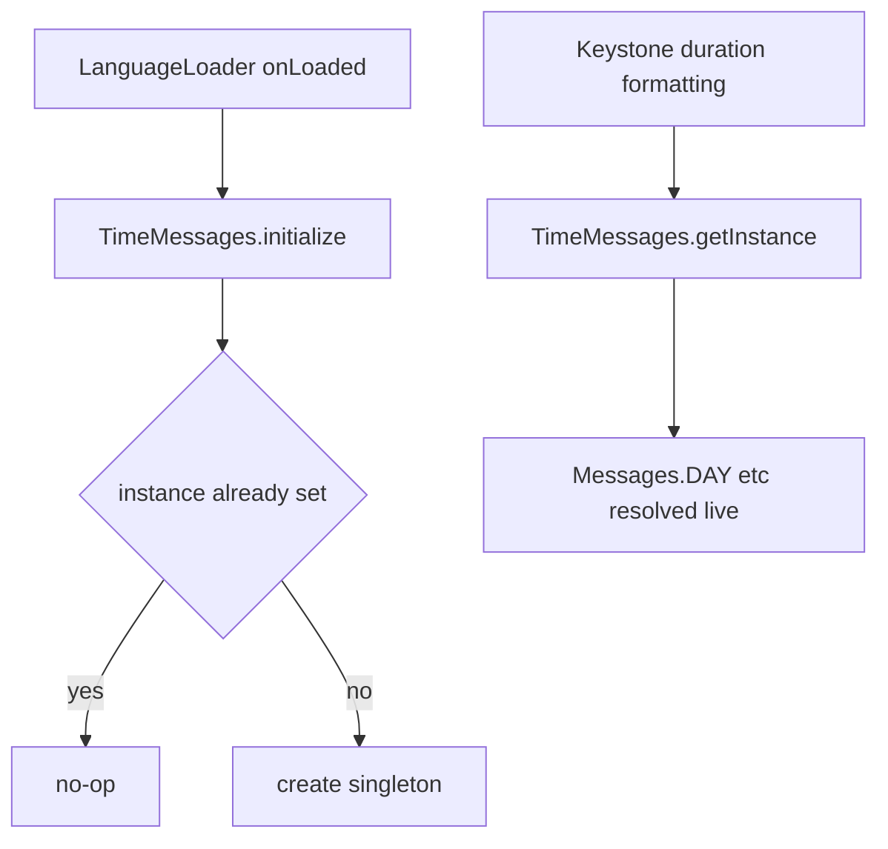

**State & persistence effects:** none.

**Edge cases & guards observed:** `TimeMessages` implements `TimeMessagesProvider` but nothing in
`gangland-impl` installs it into a Keystone seam — a repo grep finds only `TimeMessages.initialize()` in
`FileConfig`; whichever Keystone code consumes the provider must reach it another way (unverified).

### W12: Command condition evaluation (`@CommandHandler(condition=…)`)

**Trigger:** the COMMAND phase scan.

**Steps:**
1. `CommandService.scanAndRegisterCommands` (`keystone-bean/.../CommandService.java:53-91`) finds every
   `@CommandHandler` class, and for a non-empty `condition()` calls `invokeCondition(condition)`; a `false`
   result **silently skips registration** (`continue`, line 71).
2. Gangland's `CommandManager.invokeCondition` delegates to `SettingsLookupImpl.isEnabled(key)`
   (`keystone CommandManager.java:165-168` + `file/configuration/SettingsLookupImpl.java:16-29`), which does
   `Settings.getSettingsMap().get(key)` and returns `false` for anything that is not a `Boolean`/`String`.
3. `Settings.getSettingsMap()` is keyed by **Java field names** (`Settings.java:801`), e.g. `gangEnabled`.
4. The only usage in the repo is `@CommandHandler(condition = "isGangEnabled")` on
   `command/sub/gang/GangCommand.java:50` — a **getter method name**, which is how the listener side works
   (`listener/ListenerManager.java:18-27` resolves `Settings.getSetting(condition)` reflectively).
5. Entries are then sorted by `CommandPriority` descending and instantiated through
   `CommandManager.createInstance` → `dependencyContainer.createInstance(clazz)` → `initializeArguments()`.
   Any instantiation failure is caught and logged WARN (line 84-86) — the command is simply absent.

**Diagram:**
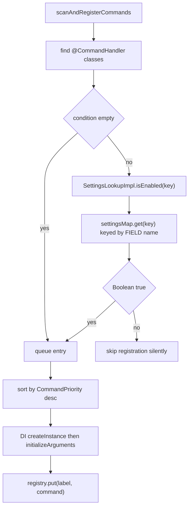

**State & persistence effects:** populates the manager's `LinkedHashMap` registry.

**Edge cases & guards observed:** the mismatch in step 3/4 is Observation #3.

## Cross-feature Dependencies

- **Depends on:**
  - Keystone `keystone-command` (Command, CommandManager, Argument/SubArgument/OptionalArgument/ConfirmArgument/
    DoubleArgument/ListArgument, CommandTabCompleter, BrigadierTabRegistrar, ArgumentMessages, CommandMessages,
    CommandVisibilityFilter), `keystone-bean` (`@CommandHandler`, `CommandService`, `DependencyContainer`,
    `SettingsLookup`), `keystone-common` (`ChatUtil`, `Placeholder`, `PlaceholderHandler`,
    `CompositePlaceholderProvider`, `SoundEffect`, `ResourcePackTracker`, `JsonFormatter`, `Tree`,
    `NumberUtil`, `MessageProvider`/`YamlMessageProvider`, `TimeMessagesProvider`), `keystone-persistence`
    (`FileManager`, `FileHandler`, `LanguageLoader`), `keystone-hooks` (`PapiExpansionAdapter`,
    `PlaceholderAPIProvider`), `keystone-update` (`UpdateChecker`, `UpdateNotifier`), `keystone-diagnostics`.
  - Gangland `Settings` (statics + the reflection-built maps), `GanglandDatabase`/`UserTable` (BalanceCommand),
    `PeriodicalUpdates` + `ReloadPlugin` + `GanglandContext` (reload), `UserManager`/`MemberManager`/
    `GangManager`/`RankManager`/`WaypointManager`/`WeaponManager`/`PermissionManager` (debug + placeholders),
    `UniqueItemAddon`, `InventoryHandler`/`InventoryRegistry`.
  - `gangland-core` `DownedPlayerRegistry` (RespawnCommand); `cops-n-crooks` `BankTierRegistry`
    (GanglandPlaceholder bank tokens); `gangland-item` `PlayerItemInitEvent` (bridge listener).
  - Third-party: Gson (commands.json), NBTAPI/AnvilGUI/ViaVersion (debug command), PlaceholderAPI (soft).
- **Depended on by:** every feature module's subcommands (they extend `org.luckyraven.gangland.command.Command`
  and read `commands.json` help entries); every user-facing string in the plugin (`Messages`); the scoreboard,
  inventory and item-lore renderers (`PlaceholderService`); all sound playback (`ResourcePackTracker` gating);
  Keystone's `Diagnostics` funnel for command faults.

## Observations & Potential Issues

| # | Location | Observation | Risk | Confidence |
|---|---|---|---|---|
| 1 | `Gangland.java:220-222` + `listener/player/CreateAccountListener.java:62-66` | `updateCheckerInitializer()` returns early when `Update_Checker.Enable: false`, leaving `updateChecker` null; the LOWEST-priority `PlayerJoinEvent` handler dereferences it unconditionally | NPE on every join with the updater disabled — thrown before `userManager.add(user)`, so the whole account-creation handler aborts and the player has no cached `User` | High |
| 2 | `gangland-impl/.../command/CommandManager.java:133-153` (and Keystone's `onHelp`, 273-288) | `onSubHelp` calls `renderHelp` directly, never `runExecute` — no `sender.hasPermission(sub.getPermission())` check | Anyone with `gangland.command.main` can read every subcommand's full help page (usage strings for admin/dev commands included) by typing `/glw  help` | High |
| 3 | `command/sub/gang/GangCommand.java:50` vs `file/configuration/SettingsLookupImpl.java:16-29` + `Settings.java:801` | `@CommandHandler(condition = "isGangEnabled")` is a getter *method* name, but the command-side lookup is a `settingsMap` lookup keyed by *field* names (`gangEnabled`); the listener side (`ListenerManager.invokeMethod`) resolves method names reflectively | `settingsMap.get("isGangEnabled")` is always null → `isEnabled` returns false → **`GangCommand` is never registered**, so `/glw gang` does not exist (dispatch falls into the "did you mean" branch). Silent — `CommandService` just `continue`s | High |
| 4 | `command/sub/DownloadResourceCommand.java` `onExecute` | The resource-pack re-send is gated on `Settings.isScoreboardEnabled()`; the resource-pack toggle is `Settings.isResourcePackEnabled()` (used correctly in `LoadResourcePackListener.java:27,74`) | `/glw resource` silently does nothing when scoreboards are off, and pushes the pack when the pack feature is off | High |
| 5 | `command/sub/BalanceCommand.java:119-147` | The `OptionalArgument` completion supplier runs `UserTable.selectAllTableQuery` and `Bukkit.getOfflinePlayer(uuid)` for **every** registered user, synchronously, on **every tab keystroke** | Main-thread DB query + N `OfflinePlayer` lookups per keypress; on a large user table this is a visible server freeze. The same scan runs again in the action body (89-118) | High |
| 6 | `command/sub/debug/ComponentExecutorCommand.java:102-121` | The completion supplier casts `(Player) sender` and calls `user.sendMessage(Messages.MUST_CREATE_GANG…)` | Console tab completion throws `ClassCastException` inside `CommandTabCompleter` (unguarded there); a gang-less player is spammed with a chat message on every TAB press | Medium |
| 7 | `command/sub/debug/ComponentExecutorCommand.java:89-90, 138-140` | `(Player) sender` casts in argument actions of a `user=false` command (`option`) | Console running `/glw option gang rank …` throws CCE; `Argument.execute` catches it and sends the sender `throwable.getMessage()` — for a CCE that message is the internal class-cast text, leaking implementation detail | Medium |
| 8 | `keystone Argument.java:159-167` | `sender.sendMessage(message != null ? message : actionError())` sends any throwable's message verbatim to the player | Internal exception text (SQL messages, class names, file paths) can reach players. Intentional per the javadoc ("throw with a player-facing message"), but it is unfiltered | Medium |
| 9 | `gangland-impl/.../command/CommandManager.java:103-106` | Gangland's `catch (Throwable)` only calls `log.error(...)`; Keystone's version also reports to `Diagnostics` and sends `CommandMessages.dispatchError()` to the sender | Dispatch-level bugs are not persisted in `gangland_faults` and the sender sees nothing at all — the command appears to do nothing | Medium |
| 10 | `commands.json` | 19 dead entries (`dealer*`, `kit*`, `safe_wand`, `spawn*`, `warp*`) for commands that no longer exist; `reload_database` documents a `/glw reload data` argument that `ReloadCommand.initializeArguments` does not create; `reload_inventory`/`reload_cleanup` are missing for arguments that do exist | `/glw reload help` advertises a non-existent `data` argument and omits `inventory`/`cleanup`. The dead entries are inert (no command filters on those prefixes) but mislead maintainers | High |
| 11 | `command/sub/teleport/TeleportCommand` and `.../waypoint/WaypointCommand` (both filter `startsWith("waypoint")`) | Two commands consume the same 17 JSON entries | `/glw help` lists all 17 waypoint lines twice; `/glw teleport help` shows waypoint usage strings | High |
| 12 | `keystone CommandTabCompleter.java:76-88` + `DevCommandVisibilityFilter` | Position-1 completion filters by permission **and** visibility, so nothing leaks there; but `CommandManager.onCommand`'s unknown-subcommand suggestion (85-97) also uses `permissibleCommands`, which is permission-gated — so no leak on that path either. However `HelpCommand`'s aggregate list is built once at construction from `commandView()` with **no sender and no filter** (`command/sub/HelpCommand.java:28-35`) | Any command that contributed `HelpInfo` entries is visible to every sender in `/glw help`, regardless of permission or the dev filter. Today all five dev-filtered classes have empty `HelpInfo`, so nothing leaks — but adding one help line to a dev command would expose it to everyone | Medium |
| 13 | `command/sub/debug/DebugCommand.java:403-409` | `/glw debug settings` dumps `Settings.getSettingsMap()`, which is built by reflection over every static field — including `mysqlHost`, `mysqlUsername`, `mysqlPassword` (`Settings.java:42`) | Anyone holding `gangland.command.debug.settings` (or an op) can print the database password to chat/console | High |
| 14 | `command/sub/debug/TimerCommand.java:17-24` | `Map<CommandSender, SequenceTimer>` keyed by the live `CommandSender` (a `Player`), never cleared on quit | Strong reference to `Player` objects — a classic Bukkit memory leak, and `SequenceTimer`s of departed players keep running | Medium |
| 15 | `message_es.yml` | 114 declared `Messages` paths are absent; the jar fallback is the same-language file, so there is no English fallback | Spanish servers render `<missing: Commands.Turf…>` for the entire turf, banker, gang-invite/ally-pending and shop-sell feature sets. `LanguageLoader` logs 114 WARN lines on every load/reload | High |
| 16 | `bootstrap/GanglandContext.java:196-199` | Only 4 of Keystone's 9 `ArgumentMessages` slots are installed | `confirmRequired`, `confirmPrompt` (seen on `/glw update download`), `didYouMean` (seen on every typo), `selectorSyntax`, `selectorNoPlayer` remain hard-coded English on a Spanish server | Medium |
| 17 | `gangland-impl/.../command/CommandManager.java:74` | `Arrays.stream(args).anyMatch("help"::equalsIgnoreCase)` matches the token anywhere in the line | Any command taking free text can be hijacked: `/glw gang rename help`, `/glw gang description … help …` render a help page instead of executing | Medium |
| 18 | `gangland-impl/.../command/CommandManager.java:75` | `runExecute(shortPrefix, …)` passes the constant `"glw"` instead of the typed `label` | A player using the `/gangland` alias gets "did you mean `/glw …`" suggestions; cosmetic drift from Keystone, which passes `label` | Low |
| 19 | `command/HelpInfo.java:77-78` | Page-range errors are raw English `IllegalArgumentException` messages surfaced through `errorMessage(...)`; `message_en.yml` has an unused `Commands.Syntax.Page_Invalid` key | Untranslated user-facing text while a suitable message key sits unused | Medium |
| 20 | `command/sub/HelpCommand.java:24-25` | `informationManager.getCommands().get("general")` / `get("general_page")` are added without a null check | A removed/renamed JSON key puts `null` in the help list → NPE inside `HelpInfo.displayHelp` (`list.get(index).toString()`), which is caught only if it is an `IllegalArgumentException` — an NPE escapes to `Argument.execute`'s Throwable catch | Medium |
| 21 | `command/sub/HelpCommand.java:30` | `parallelStream()` over `commandView()` during construction | Registry mutation during construction (LOWEST priority makes it the last command, so in practice safe) plus needless fork-join use at bootstrap | Low |
| 22 | `command/data/InformationManager.java:24-25` | `Objects.requireNonNull(Gangland.class.getResourceAsStream("/commands.json"))` with no try/catch, running in the KERNEL phase | A missing or malformed `commands.json` throws during bootstrap and takes the whole plugin down with no actionable message | Medium |
| 23 | `command/Command.java:36-37` | `InformationManager` is a `static` field on the command base | Process-wide static on a shared classloader; a second consumer or a re-bootstrap would clobber it. Documented as a deliberate trade-off in the javadoc | Low |
| 24 | `command/DevCommandVisibilityFilter.java:32-33` | Two developer UUIDs hard-coded in shipped source | Not a security hole (visibility only), but it ships personal identifiers and cannot be configured by server owners | Low |
| 25 | `listener/player/LoadResourcePackListener.java:43-66` | `FAILED_DOWNLOAD` and `DECLINED` never call `markUnloaded` | A player who had the pack, reloaded, then declined stays marked "loaded", so `SoundEffect.CUSTOM` plays silence for them | Medium |
| 26 | `listener/player/LoadResourcePackListener.java:58` | The DECLINED fallback button runs `/glw option click resource`, whose permission is `gangland.command.option` and which is dev-filtered | Ordinary players clicking the offered button get `Messages.COMMAND_NO_PERM` | Medium |
| 27 | `command/sub/DownloadPluginCommand.java:34-36` | `getUpdateChecker().getLatestVersion()` with no null guard | `/glw update` with the updater disabled → NPE → caught by `Argument.execute` → the player sees the generic action-error line | Medium |
| 28 | `data/placeholder/PlaceholderService.java:60-75` | A new `ArrayList` + N lambda wrappers + a new `CompositePlaceholderProvider` (with `List.copyOf`) are allocated on **every** `convert` call | `convert` runs per scoreboard line per tick per player and per inventory item render — measurable allocation churn on a busy server. The chain is immutable once resolvers stop registering and could be cached | Medium |
| 29 | `data/placeholder/PlaceholderService.java:71` | The resolver lambda ignores the composite's `offlinePlayer` argument and closes over the outer `player` | Correct for the current call sites (a `Player` is always passed) but means an offline-capable provider inserted into the chain would silently receive the wrong subject | Low |
| 30 | `data/placeholder/worker/GanglandPlaceholder.java:126-137` | `param.contains("user_")`/`"bank_"`/`"gang_"` instead of `startsWith` | A PAPI token such as `%someplugin_user_x%` that survived to this link enters the wrong branch (it falls through, so the effect is a wasted lookup, not a wrong value) | Low |
| 31 | `data/placeholder/worker/GanglandPlaceholder.java:139` | Unresolvable tokens return the literal `"NA"` | A typo'd placeholder renders as `NA` on scoreboards/lore instead of remaining visible as `%typo%`, making config mistakes hard to spot | Medium |
| 32 | `data/placeholder/worker/GanglandPlaceholder.java` (whole class) | Resolution touches `memberManager`, `gangManager`, `userManager` and `Bukkit` state with no thread guard | Any async caller (a PAPI expansion invoked from an async chat/scoreboard task) reads live manager collections off the main thread. No async call site was found in this area, but nothing prevents one — placeholders are also resolved from PAPI, whose callers are outside our control | Medium |
| 33 | `util/TimeMessages.java:12-16` | `initialize()` is a no-op once the singleton exists, and nothing found installs the provider into Keystone | The class may be vestigial; verify whether any Keystone seam consumes `TimeMessagesProvider` | Low (unverified) |
| 34 | `gangland-core/.../core/feature/Executor.java` | Abstract class with no subclass anywhere in the repo | Dead code in `gangland-core` | Medium |
| 35 | `keystone ArgumentMessages` + `keystone CommandManager.defaultInstance` | Process-wide statics on the shared Keystone classloader | Documented Keystone limitation until 2.0.0; a second Keystone consumer on the same server would fight over the localized strings | Low |
| 36 | `command/sub/ReloadCommand.java:112-118` | Reload success/failure text is hard-coded English built with `&` codes, not `Messages` keys | Untranslated operator-facing output | Low |

## Test Surface

- **Pure-logic candidates (plain JUnit/Mockito, no Bukkit):**
  - `HelpInfo` paging: `getMaxPages()` arithmetic, empty-list branch, `page < 1` / `page > maxPages`
    exceptions, exact slice boundaries at `breaks = 7` (needs `Messages` stubbed only for the empty branch).
  - `CommandInformation.toString()` and `GanglandChatUtil.commandDesign` string transformations (the `<`/`>`
    colouring, ` - ` split, `[`,`]`,`,` stripping).
  - `InformationManager.processCommands()` against a fixture JSON — including the missing-`usage`/`description`
    failure mode and the current unhandled null-stream path.
  - `Messages.findMissingPaths(YamlConfiguration)` against a fixture YAML — this is the guard that would have
    caught the 114 Spanish gaps; assert it reports them.
  - A **drift test** over the real resources: every `Messages` constant path exists in `message_en.yml` *and*
    `message_es.yml`; every `commands.json` key is consumed by some command's prefix filter; no two commands
    share a help prefix. All three currently fail (Observations #10, #11, #15).
  - `SettingsLookupImpl.isEnabled` truth table (Boolean, "true"/"TRUE", "yes", null, non-boolean) — and a
    regression test asserting `isEnabled("isGangEnabled")` resolves the same way the listener side does
    (Observation #3).
  - `GanglandPlaceholder`'s static helpers `formatUntil`, `formatReadyIn`, `formatDuration`, `formatPercent`,
    and `getUniqueItem` parsing (underscore-in-key case), and `getLevelPlaceholder`'s
    `experience-level-<n>` parsing.
  - `TimeMessages.getInstance()` before/after `initialize()`.
- **Needs Bukkit/Keystone mocks (MockBukkit or Mockito `CommandSender`/`Player`):**
  - `CommandManager.onCommand` matrix: no master permission; empty args; unknown sub; alias hit; `help`
    anywhere in args; per-sub permission failure; `user=true` with a console sender; an action that throws with
    and without a message.
  - `Command.runExecute` localized replies (assert the exact `Messages` constant is used).
  - `onSubHelp` page parsing (`help`, `help 2`, `help abc`, `help 0`, `help 999`) — and a test asserting a
    permission check happens (currently it would fail, Observation #2).
  - `DevCommandVisibilityFilter.isVisible` for console, a dev UUID, a non-dev player, and each filtered class.
  - `CommandTabCompleter` behaviour against a hand-built registry: permission filtering, visibility filtering,
    `help` suggestion predicate, the `"?"` wildcard never surfacing, prefix matching and sorting.
  - `PlaceholderService.convert` chain ordering with a stubbed PAPI provider and two fake resolvers; the
    "no PAPI hooked" path; the null/empty-text short circuit.
  - `LoadResourcePackListener` status matrix against a real `ResourcePackTracker`.
  - `CreateAccountListener.onPlayerJoin` with `getUpdateChecker() == null` (Observation #1).
  - `Messages.toString()` end to end with a stub `MessageProvider`: normal key, list key, missing key
    (`<missing: …>`), and each `Type` prefix.
- **Integration-only (real server):**
  - Brigadier client-tree rendering on Spigot vs Paper (`BrigadierTabRegistrar` reflection into Commodore).
  - `/glw reload` full pass: verify no double-save race, that `message_<lang>.yml` edits take effect, and that
    `commands.json`/help lists are *not* refreshed.
  - `/glw update download` against the real Spiget resource id.
  - Resource-pack accept/decline/kick flow and custom-sound gating.
  - `/glw balance <tab>` timing on a database with thousands of users (Observation #5).
- **Existing tests covering this area:** none meaningfully. Compile status was verified by running
  `mvn -o -pl gangland-impl -am test-compile` — **exit code 0, every file below compiles** against the
  Keystone-migrated sources (classes present in `gangland-impl/target/test-classes`).

  | File | What it asserts | Verdict |
  |---|---|---|
  | `gangland-impl/src/test/java/datastructure/ArgumentTester.java` | Nothing — 31 lines, the entire `main` body is commented out (it referenced the pre-Keystone `Argument`/`Tree` API) | Compiles; **asserts nothing**; dead |
  | `.../datastructure/PlaceholderTester.java` | Nothing — `main` body commented out, references a `PlaceholderManager` class that no longer exists | Compiles; **asserts nothing**; dead |
  | `.../datastructure/TreeTester.java` | Nothing — a `main` that prints `Tree`/`Node` behaviour to stdout; imports `org.luckyraven.keystone.datastructure.Tree` (current) | Compiles; no assertions |
  | `.../datastructure/JsonFormatTester.java` | Nothing — `main` printing `org.luckyraven.keystone.datastructure.JsonFormatter` output | Compiles; no assertions |
  | `.../datastructure/HashsTester.java` | Nothing — `main` exercising JDK `HashMap`/`HashSet` | Compiles; no assertions; unrelated to the plugin |
  | `.../datastructure/InfixTester.java` | Nothing — `main` exercising exp4j expression building | Compiles; no assertions |
  | `.../files/InputStreamTester.java` | Nothing — `main` reading a YAML file from a hard-coded path via `YamlConfiguration` | Compiles; no assertions; path-dependent |
  | `.../files/ResourceFolder.java` | Nothing — `main` + helpers enumerating jar entries and directory contents; imports `org.luckyraven.gangland.Gangland` | Compiles; no assertions |
  | `gangland-impl/src/test/java/GeneralTester.java` | Nothing — 11 lines printing a `java.util.Date` | Compiles; no assertions |

  None of these is a JUnit test (no `@Test`, no assertion API); they are `main()` scratch programs that Surefire
  never runs. The only real JUnit test in `gangland-impl` is
  `src/test/java/org/luckyraven/gangland/database/repositories/rank/RankRepositorySpiTest.java`, which belongs
  to the persistence area, not this one. **Effective automated coverage of the command framework, message
  pipeline, placeholders and platform services is zero.**
