# Loot Chests, Trade Signs & Waypoints

<!-- preface:start -->
> **How to use this file.** This is a code-traced audit of *Loot Chests, Trade Signs & Waypoints* in Gangland Warfare, taken on
> 2026-09-02 from branch `0.8.1` (Keystone 1.7.3). It describes what the code **does today**, workflow by workflow,
> so an agent can fix a bug, tweak behaviour, plan a feature, or write tests without re-tracing the system.
>
> - **Citations are pointers, not proof.** Every `File.java:line` was checked after writing, but the code moves.
>   Before you change anything, open the cited file and grep the symbol named in the sentence; trust the class and
>   method names over the line number. A citation ending in `:line-unverified` could not be re-located.
> - **Observations are findings, not confirmed bugs.** Each row carries the tracer's confidence. Rows prefixed
>   `WITHDRAWN:` were disproved during verification and are kept only so the numbering stays stable. Reproduce a
>   High-risk row in code (or a test) before fixing it.
> - **Sections.** *Components* names the classes; *Configuration & Data* the YAML keys, tables and message keys;
>   *Workflows* (`W1`, `W2`, …) the execution paths with trigger, steps, diagram, persistence effects and guards;
>   *Cross-feature Dependencies* what breaks elsewhere if you change this; *Test Surface* what can be unit-tested
>   with plain JUnit/Mockito versus what needs Bukkit/Keystone mocks or a live server.
> - **Conventions live elsewhere.** For *how* to add or change code in this repo, follow `CLAUDE.md` at the repo
>   root (Spigot-only APIs, method-brace style, Keystone at provided scope, the SQLite test teardown rules), the
>   `command-create` and `panel-create` skills for new commands and GUI panels, and the feedback rules in the
>   project memory (YAML key style, `SoundEffect` for sounds, `ItemRefresher` per item type, `setDataSupplier`
>   for every repository, no Paper APIs).
> - **Risk stars** on the rendered page: three stars = High (a player can hit it in normal play), two = Medium
>   (situational), one = Low (cosmetic or unlikely).

Rendered page with diagrams and a table of contents: https://claude.ai/code/artifact/65f0d8f2-4c5b-418c-97b3-23d619d82473
<!-- preface:end -->

## Overview
Three loosely-coupled world-interaction features share this report. **Loot chests** live in `gangland-ui/lootchest-api` (abstract `LootChestService` + `ChestCooldownManager` + session/cracking data classes) with the concrete `LootChestManager`, wand, repository and YAML loaders in `gangland-impl`; chests are placed with an NBT-configured wand, opened by right-click, roll a weighted loot table into a per-chest *shared* inventory, and enter a hologram-backed cooldown when closed. **Signs** live in `gangland-ui/sign-api` (registry -> validator -> parser -> aspect-chain handler) with all concrete sign types, aspects, parsers and validators in `gangland-impl/sign/**`; there is no sign persistence at all — the block itself is the record, and the sign is re-parsed on every right-click. **Waypoints** are entirely in `gangland-impl` (`data/teleportation/**` + 15 `command/sub/waypoint/**` classes), persisted through `WaypointRepository`/`WaypointTable`, and teleport via a `CountdownTimer` warm-up with move-cancellation, per-waypoint cooldown, invulnerability shield and cost.

Two whole sub-features are effectively dead in the current code: the loot-chest **safe-cracking mini-game** (no code path ever enables it or feeds it progress) and the loot-chest `Countdown_Timer` setting. The waypoint teleport command performs **no per-waypoint permission or gang check** at execution time, which is the most serious functional finding.

## Components

| Class | Location | Role |
|---|---|---|
| `LootChestService` | `gangland-ui/lootchest-api/.../lootchest/LootChestService.java` | Abstract core: chest registry (by id and by normalized `Location`), sessions, cracking sessions, shared inventories, tier/loot-table registries, handler chains, event dispatch |
| `LootChestManager` | `gangland-impl/.../lootchest/LootChestManager.java` | Concrete service + `BeanLifecycle`; loads chests from the repository after a 5 s startup grace timer, wires `setDataSupplier` |
| `ChestCooldownManager` | `gangland-ui/lootchest-api/.../lootchest/ChestCooldownManager.java` | Per-chest 20-tick cooldown tasks, hologram text, floating unlock-item icon entity |
| `LootChestData` | `.../lootchest/data/LootChestData.java` | Placed-chest state: location, tier, loot table id, respawn time, cooldown end, persistent inventory, `unlocked` flag |
| `LootChestSession` | `.../lootchest/data/LootChestSession.java` | One player's open session; populates/restores slots, syncs inventory back to `LootChestData` |
| `CrackingSession` | `.../lootchest/data/CrackingSession.java` | Mini-game timer + progress state (never driven — see W12) |
| `LootTable` / `LootItemReference` | `.../lootchest/data/LootTable.java`, `.../lootchest/item/LootItemReference.java` | Weighted + rarity-filtered roll producing `ItemStack`s via the shared `ItemParser` |
| `LootTier` | `.../lootchest/data/LootTier.java` | Record: id, display name, level, `UnlockRequirement` (NONE/LOCKPICK/KEY/PERMISSION), unlock item id/display/icon |
| `LootChestLoader` | `.../lootchest/config/LootChestLoader.java` | `FileLoader<LootChestConfig>` reading `loot_chests.yml` + `tiers.yml` |
| `LootChestListener` | `.../lootchest/listener/LootChestListener.java` | Right-click open, inventory click/close, quit, blocks pickup of icon items |
| `LootChestWand` / `LootChestWandTag` | `gangland-impl/.../lootchest/LootChestWand.java` | NBT-tagged stick: config GUI, loot-table picker/preview, tier picker, anvil input, chest creation |
| `LootChestWandListener` | `gangland-impl/.../listener/loot/LootChestWandListener.java` | Left-click = config GUI, right-click block = place chest |
| `LootChestEarnGoodsListener` | `gangland-impl/.../listener/loot/LootChestEarnGoodsListener.java` | Money/XP/commands reward on `LootChestOpenEvent`, once per chest per cycle |
| `LootChestRepository` / `LootChestTable` | `gangland-impl/.../database/{repositories,tables}/lootchest/` | `loot_chest` table CRUD |
| `SignService` / `SignTypeRegistry` | `gangland-ui/sign-api/.../sign/` | Registration of `SignTypeDefinition`s keyed by normalized typed and generated names |
| `SignInteractionService` / `SignInteraction` | `.../sign/service/` | `validateSign`, `parseSign`, `handlerInteraction` (aspect result -> messages) |
| `SignFormatterService` / `SignFormat` / `SignLineFormat` | `.../sign/service/`, `.../sign/model/` | Per-line display formatting applied at creation time |
| `AbstractSignValidator` / `AbstractSignParser` | `.../sign/validation/`, `.../sign/parser/` | Line 1 type, line 2 content, line 3 price, line 4 amount; cleaning/parsing helpers |
| `AspectBasedSignHandler` / `SignAspect` / `AspectResult` | `.../sign/handler/`, `.../sign/aspect/` | Ordered aspect chain with `canExecute` pre-gate and stop-on-failure |
| `BulkActionManager` / `PendingBulkAction` / `BulkSignHandler` | `.../sign/bulk/` | Shift-click preview -> 10 s window -> shift-click confirm |
| `SignCreation` / `PlayerSignInteract` | `.../sign/listener/` | `SignChangeEvent` and `PlayerInteractEvent` entry points |
| `SignManager` | `gangland-impl/.../sign/SignManager.java` | Builds and registers all 13 sign types + their display formats |
| `BuySign`/`SellSign` (+ ammo/weapon/car/wearable variants) | `gangland-impl/.../sign/type/trade/**` | Concrete trade signs; each also implements `BulkSignHandler` |
| `MoneyAspect` / `ItemTransferAspect` | `gangland-impl/.../sign/aspect/` | Withdraw/deposit; give/take with a pluggable similarity checker |
| `ViewInventoryAspect` / `WantedAspect` / `BountyAspect` | `gangland-impl/.../sign/aspect/` | Non-trade sign behaviours |
| `Waypoint` | `gangland-impl/.../data/teleportation/Waypoint.java` | Waypoint record: name, coords, type, gangId, timer, cooldown, shield, cost, radius, `usedId` (static counter) |
| `WaypointManager` | `.../data/teleportation/WaypointManager.java` | `BeanLifecycle`; id->waypoint map, per-player selection map, `refactorIds()` |
| `WaypointTeleport` | `.../data/teleportation/WaypointTeleport.java` | Warm-up countdown, move cancellation listener, teleport, cooldown + shield timers |
| `TeleportEvent` | `.../events/teleportation/TeleportEvent.java` | Cancellable event fired immediately before the teleport |
| `TeleportCommand` / `WaypointCommand` + 13 sub-commands | `gangland-impl/.../command/sub/waypoint/` | See the Commands table |
| `WaypointRepository` / `WaypointTable` | `gangland-impl/.../database/{repositories,tables}/waypoint/` | `waypoint` table CRUD, FK `gang_id` -> `gang.id` |

## Configuration & Data

### YAML files and notable keys
**`gangland-impl/src/main/resources/lootchests/tiers.yml`** — read by `LootChestLoader#loadTiers` / `#loadGlobalRaritySettings`:
- `Rarity.{common,uncommon,rare,epic,legendary}` -> global spawn chances (0.0-1.0), merged into every table's overrides.
- `Tiers.<id>.{Display_Name, Level, Unlock_Requirement, Unlock_Item, Unlock_Item_Display, Floating_Item_Icon}`. An unknown `Unlock_Requirement` silently degrades to `NONE` (`LootChestLoader.java:141-145`). Shipped tiers: `common`, `uncommon` (NONE), `rare` (LOCKPICK/`lockpick`), `epic` (KEY/`epic_key`), `legendary` (PERMISSION).
- If the whole `Tiers` section is missing, a synthetic `default` tier is created (`LootChestLoader.java:118-123`).

**`gangland-impl/src/main/resources/lootchests/loot_chests.yml`** — `Loot_Tables.<id>.{Display_Name, Min_Items, Max_Items, Allowed_Tiers, Rarity_Overrides, Items.<entryId>.{Item, Drop_Chance, Min_Amount, Max_Amount, Weight}}`. `Min_Items`/`Max_Items` are clamped with warnings (`LootChestLoader.java:176-186`); tables failing `LootTable#validate` are skipped. **`Allowed_Tiers` is parsed and stored but never read** — `LootTable#generateLoot(tierId, parser)` ignores its `tierId` argument entirely (`LootTable.java:41-96`). Chest *placements* are not in YAML; they come from the DB.

**`settings.yml` -> `Loot_Chest`** (loaded in `Settings.java:664-681`): `Countdown_Timer` (-> `LootChestConfig.defaultCountdownTime`, **never read anywhere**), `Sound.{Opening,Locked,Closing}`, `Allowed_Blocks`, `Rewards.Money.{Minimum,Maximum}`, `Rewards.Experience.{Minimum,Maximum}`, `Rewards.Commands`. `LootChestSettings` does **not** override `isCrackingEnabled()`/`getCrackingTime()`, so the interface defaults (`false` / `10`) apply and nothing reads them.

**Waypoint keys in `settings.yml`**: there is no `Waypoint:` configuration section. Waypoints are referenced by name from other features only — `settings.yml:234` (`Death...Teleport.Waypoint: "spawn"`, used by `CustomPlayerDeathListener.java:255`) and `settings.yml:437` (`Fallback_Exit_Waypoint: spawn` for jails). All waypoint parameters are DB-backed and edited through commands.

**Signs**: no YAML config. Sign types, keys and display formats are hard-coded in `SignManager#setupSigns` (`gangland-impl/.../sign/SignManager.java:84-211`), keyed off `Gangland.SHORT_PREFIX + "-"` (i.e. `glw-buy`, `glw-weapon-sell`, ...). Only `Settings.getMoneySymbol()` is consulted.

### Database tables and repositories
| Table | Columns | Repository | Notes |
|---|---|---|---|
| `loot_chest` | `id`(PK,String), `world`, `x`, `y`, `z`, `loot_table_id`, `tier_id`(nullable), `respawn_time`, `inventory_size`(def 27), `display_name`, `last_opened`, `is_looted` | `LootChestRepository` (`@Repository(LootChestData.class)`) | Data supplier `LootChestManager::getAllChests` wired in `LootChestManager.java:56`. **Not persisted:** `cooldownEndTime`, `currentInventory`, `currentSlotMapping`, `unlocked`, `crackingEnabled`, `crackingTimeSeconds` |
| `waypoint` | `id`(PK,int), `gang_id`(FK->`gang.id`, nullable), `name`, `world`, `x`, `y`, `z`, `yaw`(Float), `pitch`(Float), `type`, `shield`, `timer`, `cooldown`, `cost`, `radius` | `WaypointRepository` (`@Repository(Waypoint.class)`) | Data supplier `waypoints::values` wired in `WaypointManager.java:51`. `getData` writes yaw/pitch as `double`; `doLoadAll` casts them back to `(double)` (`WaypointRepository.java:45-46`) |
| — | — | — | **Signs have no table and no repository.** State lives in the sign block's text only |

Persistence for both tables is batch upsert via `RepositoryRegistry#saveAll()` driven by `PeriodicalUpdates` (`gangland-impl/.../bootstrap/PeriodicalUpdates.java:124`); neither chest creation nor waypoint creation writes to the DB synchronously. Waypoint *deletion* is the exception — it issues a direct async `QueryBuilder ... delete()` plus `WaypointManager#refactorIds()` (`WaypointDeleteCommand.java:82-87`).

### Message keys / localization
`Messages` enum entries (`gangland-impl/.../file/configuration/Messages.java`) mapping into `message/message_en.yml`:
- Loot chest: `Loot_Chest.{Cracking_Started, Already_In_Session, On_Cooldown, Requires_Lockpick, Requires_Key, No_Permission, Invalid_Loot_Table, Invalid_Chest, No_Item_Provider, Already_Looted}`, `Loot_Chest.Hologram.{Cooldown_Status, Available_Status, Available_Hint, Locked_Requires, Locked_Permission, Unlocked}`, `Loot_Chest.Time_Units.*`, `Errors.Loot_Chest.{Must_Look_At_Block, No_Chest_At_Location, Requires_Wand}`, `Commands.Loot_Chest.Removed`.
- Signs: `Signs.Created`, `Signs.Creation_Failed` (`%reason%`), `Signs.Invalid`, `Signs.Bulk.{Confirm_Expired, Confirm_Request, Expired, Cancelled}` (`%quantity% %content% %price% %money_symbol% %time%`). `Errors.Permissions.Sign` (`SIGN_NO_PERM`, `Messages.java:233`) is **declared but never used** — there is no sign permission check anywhere.
- Waypoints: `Commands.Waypoint.{Create.Created_Waypoint, Create.Confirm_Timer, Select.Selected, Select.Deselected, List.Primary, List.Secondary, Configuration.Updated, Teleportation.Sent, Teleportation.Timer, Deleted}`, `Waypoint.{Cooldown, Cancelled_Teleport, List_Header}`, `Errors.Waypoint.{Invalid, Teleport_Issue, Invalid_Type_Header}`.
- Many *loot-chest* strings are hard-coded English in `LootChestWand` and `LootChestWandListener` (e.g. `LootChestWandListener.java:76-77`, `LootChestWand.java:181, 223-228`), and all `ItemTransferAspect` / `SignInteraction` feedback (`"Your inventory is full!"`, `"Might be missing something!"`) bypasses `Messages` entirely.

## Commands & Permissions
Permission enforcement is Keystone's per-`Argument` check (`Keystone/keystone-command/.../Argument.java:271`); `Command`/`SubArgument` set `gangland.command.<path>` style nodes. `Argument#addPermission` only *registers* a node with Bukkit; it does not gate anything.

| Command | Class | Permission | What it does |
|---|---|---|---|
| `/glw lootchest` (aliases `wand`, `lootchestwand`, `chestwand`, `lcwand`) | `LootChestWandCommand` | command node (player-only) | Gives a freshly built Loot Chest Wand |
| `/glw lootchest edit` | `LootChestWandEditCommand` | command node | Opens the wand config GUI for the held wand |
| `/glw lootchest remove` | `LootChestRemoveCommand` | command node | `getTargetBlockExact(5)` -> unregister chest + `repository.delete(chestData)` |
| `/glw teleport [name]` (alias `tp`) | `TeleportCommand` | command node; registers (unused) `<node>.cooldown_bypass`; checks `gangland.command.teleport.force_rank` for cooldown bypass | Teleports to the named waypoint, or to the selected one when no arg |
| `/glw waypoint` | `WaypointCommand` | command node | Shows the selected waypoint or help |
| `/glw waypoint create <name>` + `confirm` | `WaypointCreateCommand` | command node | Creates a waypoint at the player's location after a 60 s confirm window, registers `gangland.waypoint.<name>`, auto-selects it |
| `/glw waypoint delete|remove|del <id>` + `confirm` | `WaypointDeleteCommand` | command node | Async DB delete + `refactorIds()`, removes `gangland.waypoint.<id>` (note: **id**, not name), removes from memory |
| `/glw waypoint select <id>` | `WaypointSelectCommand` | command node | Sets the caller's selected waypoint (no per-waypoint permission check) |
| `/glw waypoint deselect` | `WaypointDeselectCommand` | command node | Clears the selection |
| `/glw waypoint list` | `WaypointListCommand` | command node | Lists **all** waypoints with a click-to-run `/glw teleport <name>` component |
| `/glw waypoint info <name>` | `WaypointInfoCommand` | command node | Prints coords/type/gang/timer/cooldown/shield/cost/radius |
| `/glw waypoint type <type>` | `WaypointTypeCommand` | command node | Sets `WaypointType` on the selected waypoint |
| `/glw waypoint gangid <id>` | `WaypointGangIdCommand` | command node | Binds the selected waypoint to a gang |
| `/glw waypoint timer <sec>` | `WaypointTimerCommand` | command node | Warm-up seconds |
| `/glw waypoint cooldown <sec>` | `WaypointCooldownCommand` | command node | Post-teleport cooldown seconds |
| `/glw waypoint shield <sec>` | `WaypointShieldCommand` | command node | Post-teleport invulnerability seconds |
| `/glw waypoint cost <amount>` | `WaypointCostCommand` | command node | Teleport price |
| `/glw waypoint radius <n>` | `WaypointRadiusCommand` | command node | Radius value (stored; not consumed by any code in this area) |

Loot-chest tier permission: `gangland.lootchest.tier.<tierId>` — built in `LootChestService.java:618` from the `prefix` constructor arg, which `GameplayConfig` passes as `Gangland.FULL_PREFIX` (`"gangland"`). Waypoint permission: `gangland.waypoint.<name>` (`Waypoint.java:31`) — used only for tab-completion filtering, never enforced.

## Events

| Event | Fired by | Handled by | Purpose |
|---|---|---|---|
| `LootChestOpenEvent` | `LootChestService.callEvents` -> `sessionStartHandler` (`LootChestService.java:477-480`) | `LootChestEarnGoodsListener#onLootChestOpen` | Grant money/XP/commands once per chest per cycle |
| `LootChestCloseEvent` | `sessionCompleteHandler` (`LootChestService.java:482-485`) | none in-repo | Session end notification |
| `LootChestDuringCooldownEvent` | `chestCooldownTickHandler`, once per second per chest on cooldown | none in-repo | Cooldown tick |
| `LootChestCooldownCompleteEvent` | `chestCooldownCompleteHandler` | `LootChestEarnGoodsListener#onLootSessionEnd` | Clears the per-player "already rewarded" set for that chest |
| `LootChestCrackingStartEvent` / `DuringCrackingEvent` / `CrackingSuccessEvent` / `CrackingFailureEvent` / `CrackingEndEvent` | `LootChestService.callEvents` (cracking handlers) | none in-repo | Cracking lifecycle — unreachable in practice (W12) |
| `TeleportEvent` | `WaypointTeleport#teleport` (`WaypointTeleport.java:126-127`) | none in-repo | Cancellable pre-teleport hook |
| `SignChangeEvent` (Bukkit) | server | `SignCreation#onSignCreate` (HIGHEST) | Validate + format a newly written sign |
| `PlayerInteractEvent` (Bukkit) | server | `PlayerSignInteract` (HIGH), `LootChestWandListener` (HIGH), `LootChestListener` (HIGHEST) | Sign use / wand / chest open |
| `InventoryClickEvent`, `InventoryCloseEvent`, `PlayerQuitEvent`, `EntityPickupItemEvent` | server | `LootChestListener` | Item-taken marking, session close, session cancel, icon-pickup blocking |
| `PlayerMoveEvent` (Bukkit) | server | `WaypointTeleport#onPlayerMove` (one dummy instance registered in `WiringConfig.java:42-48`) | Cancel teleport warm-up on movement |

All loot-chest events implement `Cancellable`, but `LootChestService` never inspects `isCancelled()` after `callEvent` — cancelling any of them has no effect.

## Workflows

### W1: Loot chest startup load and registration
**Trigger:** plugin enable / reload, `LootChestManager` bean lifecycle.
**Steps:**
1. `LootChestManager.onInitialize(firstLoad)` (`gangland-impl/.../lootchest/LootChestManager.java:76-86`) — fetches `IRepository<LootChestData>` from the registry, hard-fails with `PluginException` if it is not a `LootChestRepository`.
2. `LootChestManager.initialize(repo, reload)` (`:36-57`) — `repo.setLootChestService(this)` so `doLoadAll` can resolve tier ids; on first load starts a 5 s `CountdownTimer` (`start(false)`, main thread) to wait for worlds; on reload registers immediately.
3. `registerLootChests` (`:88-94`) -> `repository.loadAll()` -> `LootChestRepository.doLoadAll` (`.../database/repositories/lootchest/LootChestRepository.java:37-84`) reads each row positionally, resolves `Bukkit.getWorld(worldName)` (may be `null`) and the tier via `lootChestService.getTier(tierId)`.
4. `LootChestService.registerChest` (`.../lootchest/LootChestService.java:166-184`) — puts into `registeredChests` and `chestsByLocation` (key = block-coordinate-normalized `Location`), then: if not on cooldown **and** not looted -> `showAvailableHologram`; if not on cooldown -> `return`; otherwise resume `startCooldown(remaining)`.
5. `repository.setDataSupplier(this::getAllChests)` (`:56`) — runs before the grace timer fires, so an autosave inside the first 5 s upserts an empty snapshot.

**Diagram:**
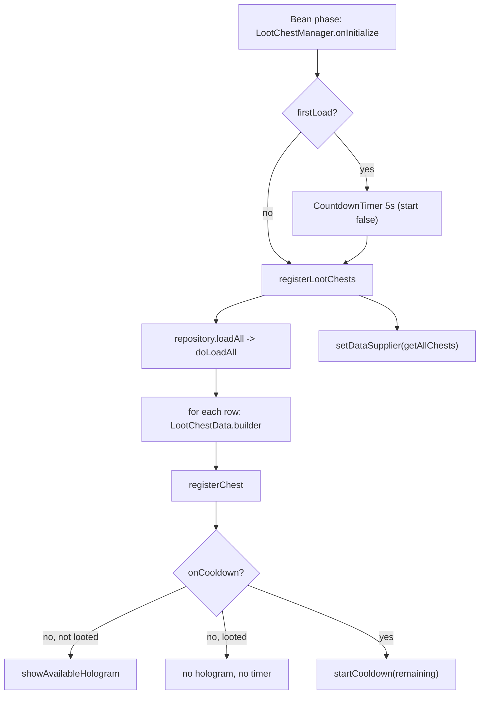
```mermaid
flowchart TD
  A["Bean phase: LootChestManager.onInitialize"] --> B{firstLoad?}
  B -->|yes| C["CountdownTimer 5s (start false)"]
  B -->|no| D[registerLootChests]
  C --> D
  D --> E["repository.loadAll -> doLoadAll"]
  E --> F["for each row: LootChestData.builder"]
  F --> G[registerChest]
  G --> H{"onCooldown?"}
  H -->|"no, not looted"| I[showAvailableHologram]
  H -->|"no, looted"| J["no hologram, no timer"]
  H -->|yes| K["startCooldown(remaining)"]
  D --> L["setDataSupplier(getAllChests)"]
```
**State & persistence effects:** fills `registeredChests` / `chestsByLocation`; spawns holograms and (for locked tiers) floating icon entities; registers the autosave data supplier.
**Edge cases & guards observed:** `Bukkit.getWorld` returning `null` produces a `Location` with a null world that is not guarded; `cooldownEndTime` is never persisted so every restart resets cooldowns to zero; a row with `is_looted = true` and no cooldown gets **no hologram at all** but is still openable (`isBlocked()` is false).

### W2: Wand acquisition and configuration
**Trigger:** `/glw lootchest` then left-click / `/glw lootchest edit`.
**Steps:**
1. `LootChestWandCommand.onExecute` (`gangland-impl/.../command/sub/lootchest/LootChestWandCommand.java:40-54`) -> `new LootChestWand(...).createWand()` -> `ItemBuilder` stick with NBT `WAND_KEY=true`, `CONFIGURED=false`, `LOOT_TABLE_ID=""`, `TIER_ID=""`, `RESPAWN_TIME=300L` (**a long tag**), `INVENTORY_SIZE=27`, `DISPLAY_NAME` (`LootChestWand.java:77-96`).
2. Left-click (any block or air) -> `LootChestWandListener.onPlayerInteract` (`.../listener/loot/LootChestWandListener.java:40-49`) cancels the event and calls `wand.openConfigInventory`.
3. `openConfigInventory` (`LootChestWand.java:98-187`) renders a 45-slot GUI: loot table (11), tier (13), display name (15, anvil), inventory size (29, plus/minus 9 clamped 9..54), respawn time (31, anvil), save (40).
4. Loot-table picker `openLootTableSelection` (`:231-267`) — left-click selects, right-click opens the paginated `openLootTablePreview` (`:419-454`) which resolves each entry through `ItemParser` and shows a `BARRIER` when the item string does not resolve.
5. Anvil input `openAnvilInput` (`:314-346`) — for `RESPAWN_TIME` parses a `long` and writes `nbt.setLong`; other keys write `nbt.setString`.
6. Save (`:178-182`) -> `updateWandLore` rewrites the lore and sets `CONFIGURED` from "loot table id non-empty".

**Diagram:**
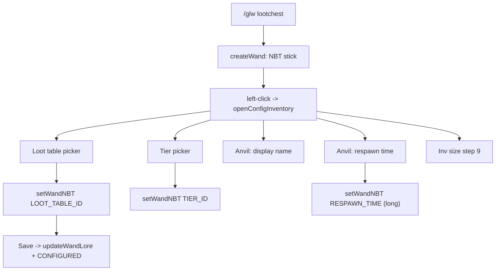
```mermaid
flowchart TD
  A["/glw lootchest"] --> B["createWand: NBT stick"]
  B --> C["left-click -> openConfigInventory"]
  C --> D[Loot table picker]
  C --> E[Tier picker]
  C --> F["Anvil: display name"]
  C --> G["Anvil: respawn time"]
  C --> H["Inv size step 9"]
  D --> I["setWandNBT LOOT_TABLE_ID"]
  E --> J["setWandNBT TIER_ID"]
  G --> K["setWandNBT RESPAWN_TIME (long)"]
  I --> L["Save -> updateWandLore + CONFIGURED"]
```
**State & persistence effects:** all state is NBT on the held item; nothing is stored server-side.
**Edge cases & guards observed:** every mutation goes through `setWandNBT`, which re-reads the **main-hand item** rather than the item that opened the GUI — swapping hands or items mid-GUI silently writes to the wrong item or no-ops. `getRespawnTimeFromWand` (`:367-374`) reads the tag with `getIntegerTagData` even though it is written as a `long`.

### W3: Loot chest placement / registration by wand
**Trigger:** right-click a block while holding a configured wand.
**Steps:**
1. `LootChestWandListener.onPlayerInteract` (`:29-101`, priority HIGH) — ignores non-wand items; if a chest already exists at the block it cancels the event and returns (letting `LootChestListener` at HIGHEST open it).
2. Allowed-block check: `Settings.getLootChestAllowedBlocks()`, falling back to a hard-coded list; the test is `block.getType().name().toUpperCase().contains(allowed.toUpperCase())` — a *substring* match.
3. Unconfigured wand -> message + open config GUI.
4. `LootChestWand.createLootChestFromWand` (`LootChestWand.java:189-229`) — builds `LootChestData` with a random `UUID`, the clicked block's `Location`, the wand's loot-table id, resolved tier (or `null`), respawn time, inventory size, display name.
5. `lootChestManager.registerChest(chestData)` -> hologram + location index. **No DB insert.**

**Diagram:**
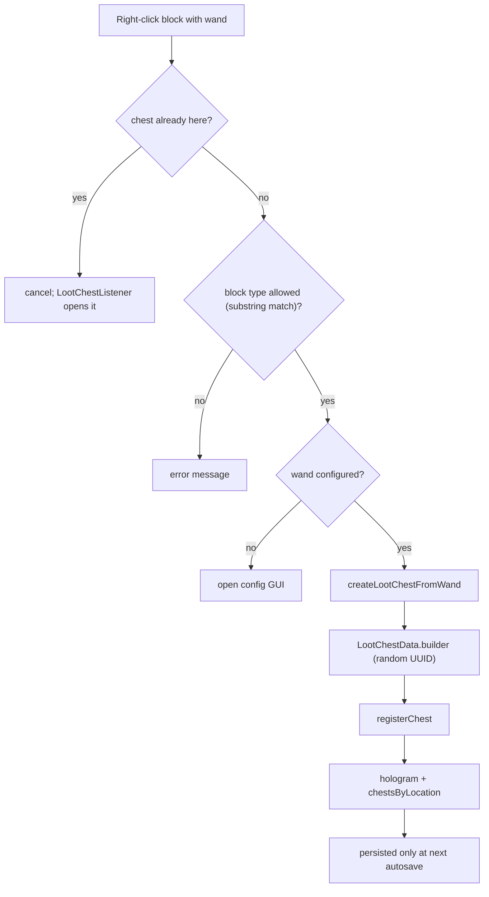
```mermaid
flowchart TD
  A["Right-click block with wand"] --> B{"chest already here?"}
  B -->|yes| C["cancel; LootChestListener opens it"]
  B -->|no| D{"block type allowed (substring match)?"}
  D -->|no| E["error message"]
  D -->|yes| F{"wand configured?"}
  F -->|no| G["open config GUI"]
  F -->|yes| H[createLootChestFromWand]
  H --> I["LootChestData.builder (random UUID)"]
  I --> J[registerChest]
  J --> K["hologram + chestsByLocation"]
  K --> L["persisted only at next autosave"]
```
**State & persistence effects:** in-memory registration immediately; row written on the next `PeriodicalUpdates` save or shutdown.
**Edge cases & guards observed:** the loot-table id is not validated at placement (an empty/nonexistent id only surfaces as `INVALID_LOOT_TABLE` on open); no check that the block is still a container later; **no `BlockBreakEvent` handler** anywhere for loot-chest blocks, so breaking the block leaves a registered ghost chest that still opens and still shows a hologram.

### W4: Opening a loot chest (direct path)
**Trigger:** right-click a registered chest block.
**Steps:**
1. `LootChestListener.onPlayerInteract` (`.../lootchest/listener/LootChestListener.java:41-70`, HIGHEST) — `RIGHT_CLICK_BLOCK` only; `getChestAt(block.getLocation())`; cancels the event; schedules `tryOpenChest` for the next tick.
2. `LootChestService.tryOpenChest` (`LootChestService.java:228-268`) — guards in order: `itemParser == null` -> `NO_ITEM_PARSER`; existing loot session or cracking session -> `ALREADY_IN_SESSION`; `chestData.isBlocked()` (empty **and** on cooldown) -> `ON_COOLDOWN`; tier unlock check (W9); missing loot table -> `INVALID_LOOT_TABLE`; `crackingEnabled && crackingTimeSeconds > 0` -> W12; otherwise `openChestDirectly`.
3. `openChestDirectly` (`:526-594`) — consumes the unlock item on the first open of the cycle (W9); reuses `sharedChestInventories.get(chestId)` if present (`isShared = true`), else reuses `chestData.getCurrentInventory()` if non-empty, else rolls fresh loot (W5) and creates a new `InventoryHandler` keyed `loot_chest_<uuid>`.
4. `new LootChestSession(player, chestData, inventory, items, isShared)`; recorded in `activeSessions` (per player) and `activeSessionsByChest`.
5. `sessionStartHandler.handle(session)` -> opening sound + `LootChestOpenEvent` (-> W10).
6. `session.open()` (`LootChestSession.java:57-65`) — populates only when not shared, then `inventory.open(player)`.
7. Result codes are turned into messages by `LootChestListener#handleOpenResult` (`:117-176`) unless an `onOpenAttempt` consumer was injected (none is, in-repo).

**Diagram:**
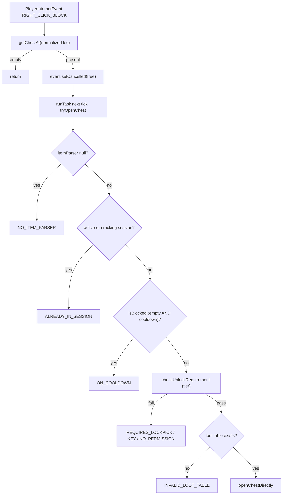
```mermaid
flowchart TD
  A["PlayerInteractEvent RIGHT_CLICK_BLOCK"] --> B["getChestAt(normalized loc)"]
  B -->|empty| Z[return]
  B -->|present| C["event.setCancelled(true)"]
  C --> D["runTask next tick: tryOpenChest"]
  D --> E{"itemParser null?"}
  E -->|yes| F[NO_ITEM_PARSER]
  E -->|no| G{"active or cracking session?"}
  G -->|yes| H[ALREADY_IN_SESSION]
  G -->|no| I{"isBlocked (empty AND cooldown)?"}
  I -->|yes| J[ON_COOLDOWN]
  I -->|no| K["checkUnlockRequirement (tier)"]
  K -->|fail| L["REQUIRES_LOCKPICK / KEY / NO_PERMISSION"]
  K -->|pass| M{"loot table exists?"}
  M -->|no| N[INVALID_LOOT_TABLE]
  M -->|yes| O[openChestDirectly]
```
**State & persistence effects:** `activeSessions`, `activeSessionsByChest`, `sharedChestInventories`, `chestData.currentInventory/currentSlotMapping`, plus the tier `unlocked` flag.
**Edge cases & guards observed:** the interact handler runs at HIGHEST **without** `ignoreCancelled`, so it still fires after another plugin cancels the click; opening is deferred one tick, so two players clicking in the same tick both reach `tryOpenChest` — the second finds the shared inventory and joins it (intended), but the *reward* listener grants goods to both (W10).

### W5: Loot table roll
**Trigger:** `openChestDirectly` with no existing inventory.
**Steps:**
1. `LootTable.generateLoot(tierId, parser)` (`.../lootchest/data/LootTable.java:41-96`) — returns empty immediately for an empty entry list.
2. `filterByRarity` (`:139-145`) — keeps entries where `random.nextDouble() <= spawnChance`; `spawnChance` comes from `rarityOverrides` (table override merged over global) else `Rarity.getSpawnMultiplier()`. If everything is filtered out, the full list is used.
3. `itemCount = random.nextInt(minItems, maxItems + 1)`.
4. Loop with `safetyGuard = itemCount * 10`: `selectWeightedRandom` over `effectiveWeight = weight * rarity.spawnMultiplier`; `createItemFromReference` parses `Item:` through `ItemParser` and clamps the rolled amount to `maxStackSize`; non-stackable ids are de-duplicated by `LootItemReference.id`.
5. If the result is still empty, `pickGuaranteedItem` walks the full list; if that fails too it logs `"Loot table '{}' produced zero items"`.
6. `LootChestSession.populateWithRandomSlots` (`:154-191`) shuffles all inventory slots, places clones, builds `slotMapping`, and stores clones + mapping on `LootChestData`.

**Diagram:**
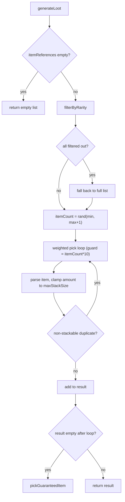
```mermaid
flowchart TD
  A[generateLoot] --> B{"itemReferences empty?"}
  B -->|yes| C["return empty list"]
  B -->|no| D[filterByRarity]
  D --> E{"all filtered out?"}
  E -->|yes| F["fall back to full list"]
  E -->|no| G["itemCount = rand(min, max+1)"]
  F --> G
  G --> H["weighted pick loop (guard = itemCount*10)"]
  H --> I["parse item, clamp amount to maxStackSize"]
  I --> J{"non-stackable duplicate?"}
  J -->|yes| H
  J -->|no| K["add to result"]
  K --> L{"result empty after loop?"}
  L -->|yes| M[pickGuaranteedItem]
  L -->|no| N["return result"]
```
**State & persistence effects:** none beyond the session/chest inventory copy.
**Edge cases & guards observed:** `selectWeightedRandom` returns the last element when the cumulative walk overshoots, so a table where every weight is `0` always yields the last entry; `tierId` is accepted and ignored, so `Allowed_Tiers` has no runtime effect; `LootItemReference.generateAmount` uses `ThreadLocalRandom` while `LootTable` uses a per-table `Random`.

### W6: Concurrent viewers / shared chest inventory
**Trigger:** a second player opens a chest already open for someone else.
**Steps:**
1. `openChestDirectly` finds `sharedChestInventories.get(chestId) != null` -> `items = chestData.getCurrentInventory()`, `isShared = true` (`LootChestService.java:557-560`).
2. The new `LootChestSession` skips `populateInventory()` (`LootChestSession.java:57-61`) and opens the *same* `InventoryHandler`, so both players see and compete for the same stacks.
3. Any click in the chest half marks `itemTaken` and schedules `syncInventoryToChestData` next tick (`LootChestListener.java:72-92`).
4. `closeSession` (`LootChestService.java:295-330`) removes the session, removes it from `activeSessionsByChest`, drops `sharedChestInventories` for the chest once the last viewer leaves, then starts the cooldown if one is not already running.

**Diagram:**
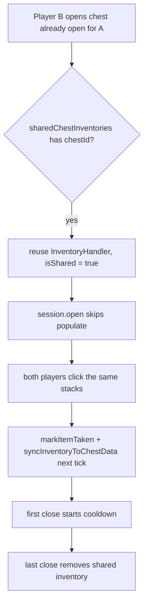
```mermaid
flowchart TD
  A["Player B opens chest already open for A"] --> B{"sharedChestInventories has chestId?"}
  B -->|yes| C["reuse InventoryHandler, isShared = true"]
  C --> D["session.open skips populate"]
  D --> E["both players click the same stacks"]
  E --> F["markItemTaken + syncInventoryToChestData next tick"]
  F --> G["first close starts cooldown"]
  G --> H["last close removes shared inventory"]
```
**State & persistence effects:** a single `InventoryHandler` shared by N players; `chestData.currentInventory` re-synced on every click.
**Edge cases & guards observed:** the shared inventory is intentional, but the *reward* path (W10) is per-player, and `closeSession` starts the cooldown on the **first** close while other viewers are still looting — those viewers keep taking items from a chest that is already "on cooldown" until `completeCooldown` force-closes them.

### W7: Session close, item-taken accounting and cooldown start
**Trigger:** `InventoryCloseEvent`, or `closeAllSessionsForChest`.
**Steps:**
1. `LootChestListener.onInventoryClose` (`:94-103`) — only acts when the session state is `LOOTING`; calls `manager.closeSession(player)`.
2. `closeSession` (`LootChestService.java:295-330`) -> `session.close()` -> `syncInventoryToChestData()` then `chestData.markAsLooted()` **only if** an item was taken (`LootChestSession.java:85-95`).
3. `sessionCompleteHandler.handle(session)` — closing sound + `LootChestCloseEvent`.
4. If `chestData.isOnCooldown()` returns, otherwise `cooldownManager.startCooldown(chestData, chestData.getRespawnTime())` when `respawnTime > 0` (the comment says the chest refreshes on *every* close, regardless of items taken).

**Diagram:**
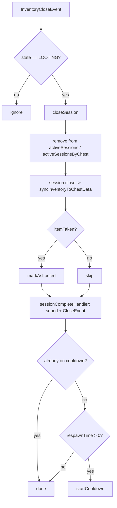
```mermaid
flowchart TD
  A[InventoryCloseEvent] --> B{"state == LOOTING?"}
  B -->|no| Z[ignore]
  B -->|yes| C[closeSession]
  C --> D["remove from activeSessions / activeSessionsByChest"]
  D --> E["session.close -> syncInventoryToChestData"]
  E --> F{itemTaken?}
  F -->|yes| G[markAsLooted]
  F -->|no| H[skip]
  G --> I["sessionCompleteHandler: sound + CloseEvent"]
  H --> I
  I --> J{"already on cooldown?"}
  J -->|yes| K[done]
  J -->|no| L{"respawnTime > 0?"}
  L -->|yes| M[startCooldown]
  L -->|no| K
```
**State & persistence effects:** `currentInventory`/`currentSlotMapping` updated; `isLooted` and `lastOpened` set; `cooldownEndTime` set by `startCooldown`.
**Edge cases & guards observed:** `respawnTime == 0` means **no cooldown ever** — the chest keeps whatever items remain and re-rolls only after it is emptied; the `getRespawnTimeFromWand` bug (W2) means the placed value is almost always 300.

### W8: Cooldown timer, hologram and refill
**Trigger:** `ChestCooldownManager.startCooldown`.
**Steps:**
1. `startCooldown` (`.../lootchest/ChestCooldownManager.java:72-100`) cancels any existing task, calls `chestData.startCooldown(seconds)` (sets `cooldownEndTime` and `isLooted = true`), then registers a 20-tick repeating task.
2. Each tick: `remaining = chestData.getRemainingCooldownSeconds()`; `<= 0` -> `completeCooldown`; otherwise `onCooldownTick` (-> `LootChestDuringCooldownEvent`) and `updateCooldownHologram` (`:125-141`) rendering `Loot_Chest.Hologram.Cooldown_Status` plus a formatted `Xm Ys` line.
3. `completeCooldown` (`:303-323`) cancels the task, `chestData.respawn()` (clears `isLooted`, `cooldownEndTime`, inventory, mapping and the `unlocked` flag), `showAvailableHologram`, then the `onCooldownComplete` callback.
4. `onCooldownComplete` (wired in `LootChestService.java:126-134`) -> `closeAllSessionsForChest(id)` (force-closes every viewer's inventory on the main thread and marks their sessions `CANCELLED`) -> `chestData.clearInventory()` -> `chestCooldownCompleteHandler` (-> `LootChestCooldownCompleteEvent`).
5. `showAvailableHologram` (`:148-167`) rebuilds the hologram lines from the tier and, for a locked LOCKPICK/KEY tier, drops a gravity-less, invulnerable, silent, non-persistent `Item` icon above the chest; `LootChestListener#onChestIconPickup` cancels player/mob pickup.

**Diagram:**
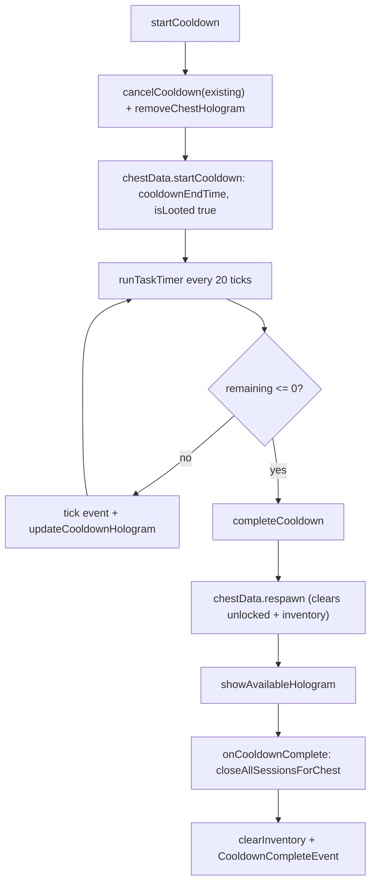
```mermaid
flowchart TD
  A[startCooldown] --> B["cancelCooldown(existing) + removeChestHologram"]
  B --> C["chestData.startCooldown: cooldownEndTime, isLooted true"]
  C --> D["runTaskTimer every 20 ticks"]
  D --> E{"remaining <= 0?"}
  E -->|no| F["tick event + updateCooldownHologram"]
  F --> D
  E -->|yes| G[completeCooldown]
  G --> H["chestData.respawn (clears unlocked + inventory)"]
  H --> I[showAvailableHologram]
  I --> J["onCooldownComplete: closeAllSessionsForChest"]
  J --> K["clearInventory + CooldownCompleteEvent"]
```
**State & persistence effects:** hologram and icon entities created/despawned; chest state reset; active viewers force-closed.
**Edge cases & guards observed:** `spawnIcon` correctly null-checks `base.getWorld()` (`:271-274`), but `updateCooldownHologram`/`showAvailableHologram` pass `chestData.getLocation().clone().add(...)` straight into `HologramService` with no world null-check — a chest loaded for a missing world (W1) reaches this path; `completeCooldown` calls `respawn()` **before** the callback closes viewer inventories, so a viewer's `syncInventoryToChestData` on close can write items back onto a just-respawned chest.

### W9: Tier unlock (lockpick / key / permission)
**Trigger:** opening a chest whose `LootChestData.tier != null`.
**Steps:**
1. `checkUnlockRequirement` (`LootChestService.java:596-623`) — if `chestData.isUnlocked()` and the requirement is LOCKPICK/KEY, pass immediately; else switch: `NONE` -> pass; `LOCKPICK`/`KEY` -> `hasRequiredItem(player, tier.unlockItemId() or "lockpick" / "key_"+id)`; `PERMISSION` -> `player.hasPermission("gangland.lootchest.tier." + tier.id())`.
2. `hasRequiredItem` (`:625-637`) scans the inventory for an `ItemBuilder` NBT tag `loot_key` equal to the item id.
3. On success `openChestDirectly` consumes one unit via `consumeRequiredItem` (`:643-662`) and sets `chestData.setUnlocked(true)` plus a hologram refresh — only for LOCKPICK/KEY, and only once per cooldown cycle.

**Diagram:**
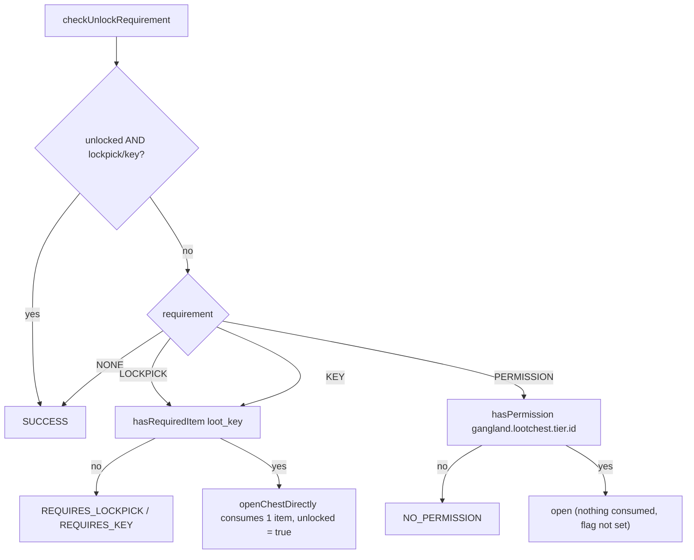
```mermaid
flowchart TD
  A[checkUnlockRequirement] --> B{"unlocked AND lockpick/key?"}
  B -->|yes| C[SUCCESS]
  B -->|no| D{requirement}
  D -->|NONE| C
  D -->|LOCKPICK| E["hasRequiredItem loot_key"]
  D -->|KEY| E
  D -->|PERMISSION| F["hasPermission gangland.lootchest.tier.id"]
  E -->|no| G["REQUIRES_LOCKPICK / REQUIRES_KEY"]
  E -->|yes| H["openChestDirectly consumes 1 item, unlocked = true"]
  F -->|no| I[NO_PERMISSION]
  F -->|yes| J["open (nothing consumed, flag not set)"]
```
**State & persistence effects:** consumes one inventory item; sets the transient `unlocked` flag (cleared on `respawn`, never persisted).
**Edge cases & guards observed:** once the first player burns a lockpick, **every other player opens the chest free for the rest of the cycle** — documented as intentional in the code comments; `consumeRequiredItem` mutates `item.setAmount(amount - 1)` on the array copy returned by `getContents()` (works because `ItemStack` is a live reference for occupied slots, but the `setItem(slot, null)` branch is the only explicit write-back).

### W10: Loot chest reward (money / XP / commands)
**Trigger:** `LootChestOpenEvent`.
**Steps:**
1. `LootChestEarnGoodsListener.onLootChestOpen` (`gangland-impl/.../listener/loot/LootChestEarnGoodsListener.java:39-83`) — resolves the `User`, returns if null.
2. Dedupe: `openedLootChests` (`Map<Player, Set<UUID>>`) — returns if the player already got this chest's reward.
3. `random.nextDouble(min, max)` for money and XP from `Settings.getLootChestReward*`; `user.getEconomy().depositAmount(Currency.of(money))`; `level.addExperience(exp, new UserLevelUpEvent(...))`.
4. Sends three chat lines and runs every non-empty `Settings.getLootChestRewardCommands()` entry via `player.performCommand`.
5. `onLootSessionEnd` (`:85-95`) clears that chest id from every player's set when the cooldown completes.

**Diagram:**
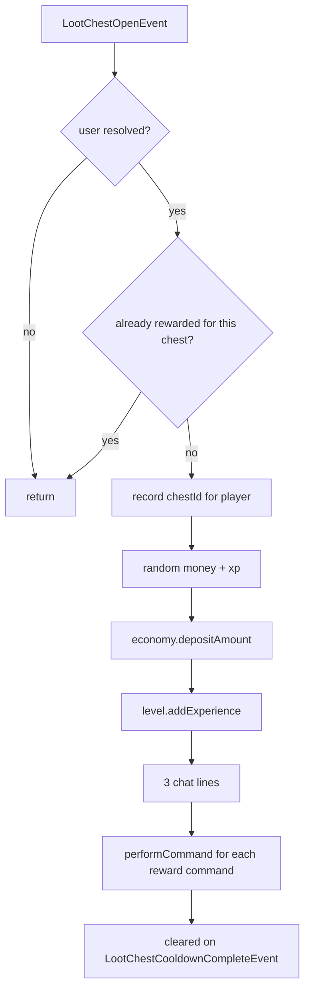
```mermaid
flowchart TD
  A[LootChestOpenEvent] --> B{"user resolved?"}
  B -->|no| Z[return]
  B -->|yes| C{"already rewarded for this chest?"}
  C -->|yes| Z
  C -->|no| D["record chestId for player"]
  D --> E["random money + xp"]
  E --> F["economy.depositAmount"]
  F --> G["level.addExperience"]
  G --> H["3 chat lines"]
  H --> I["performCommand for each reward command"]
  I --> J["cleared on LootChestCooldownCompleteEvent"]
```
**State & persistence effects:** economy deposit, XP/level mutation, arbitrary command execution as the player.
**Edge cases & guards observed:** the reward is granted on **open**, not on taking loot, so opening and immediately closing still pays; `random.nextDouble(min, max)` throws `IllegalArgumentException` when `Minimum == Maximum` or `Minimum > Maximum`; `openedLootChests` is keyed by the live `Player` object and is only pruned by chest id, never on quit.

### W11: Chest removal
**Trigger:** `/glw lootchest remove` while looking at a chest.
**Steps:**
1. `LootChestRemoveCommand.action` (`.../command/sub/lootchest/LootChestRemoveCommand.java:31-65`) — `player.getTargetBlockExact(5)`, `Messages.LOOT_CHEST_MUST_LOOK_AT_BLOCK` when null.
2. `lootChestManager.getChestAt(location)`; `Messages.LOOT_CHEST_NO_CHEST_AT_LOCATION` when absent.
3. `unregisterChest(id)` (`LootChestService.java:186-194`) — removes both maps, `cancelCooldown`, `removeChestHologram` (which also removes the icon entity).
4. `ganglandDatabase.getRepositoryRegistry().getRepository(LootChestData.class).delete(chestData)` -> `LootChestRepository#doDelete` -> `tableBackend().delete("id = ?", id)`.
5. `Messages.LOOT_CHEST_REMOVED`.

**Diagram:**
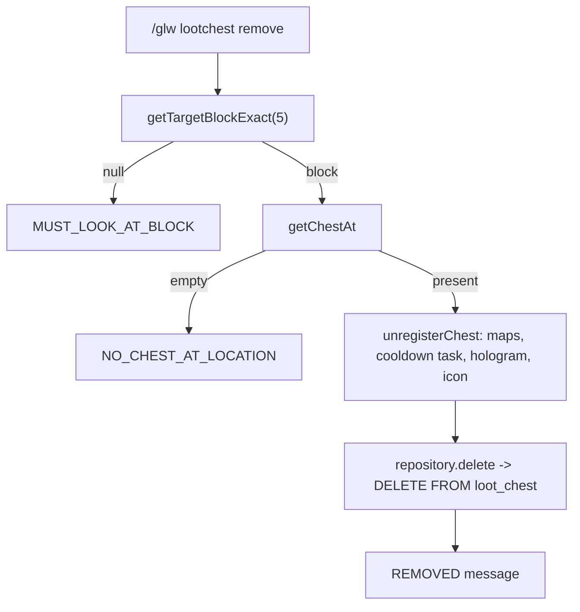
```mermaid
flowchart TD
  A["/glw lootchest remove"] --> B["getTargetBlockExact(5)"]
  B -->|null| C[MUST_LOOK_AT_BLOCK]
  B -->|block| D[getChestAt]
  D -->|empty| E[NO_CHEST_AT_LOCATION]
  D -->|present| F["unregisterChest: maps, cooldown task, hologram, icon"]
  F --> G["repository.delete -> DELETE FROM loot_chest"]
  G --> H["REMOVED message"]
```
**State & persistence effects:** immediate in-memory and DB removal.
**Edge cases & guards observed:** any active sessions for that chest are **not** closed — `activeSessions` / `sharedChestInventories` entries survive, so a player looting the removed chest keeps looting and, on close, `closeSession` calls `startCooldown` on an unregistered chest, recreating a hologram at the old location.

### W12: Safe-cracking mini-game (currently unreachable)
**Trigger:** would be `tryOpenChest` when `chestData.isCrackingEnabled() && getCrackingTimeSeconds() > 0`.
**Steps (as written):**
1. `startCrackingMinigame` (`LootChestService.java:426-453`) builds a `CrackingSession` and stores it in `crackingSessions`, then `session.start(onTick, onSuccess, onFailed)`.
2. `CrackingSession.start` (`.../data/CrackingSession.java:60-81`) — a 20-tick repeating task: if `state == COMPLETED` -> stop + `onSuccess`; if `timeRemaining <= 0` -> `FAILED` + `onFailed`; else `onTick` and decrement.
3. Success -> remove from the map, fire success/end events, then `openChestDirectly`. Failure -> remove from the map, fire failure/end events.
4. `completeCracking(player)` (`LootChestService.java:273-279`) and `CrackingSession.addProgress(int)` (`CrackingSession.java:104-109`) are the only ways to reach `COMPLETED`.
5. `cancelCracking` is reached from `cancelSession` on `PlayerQuitEvent` and from `cancelSessions()` on reload/shutdown.

**Diagram:**
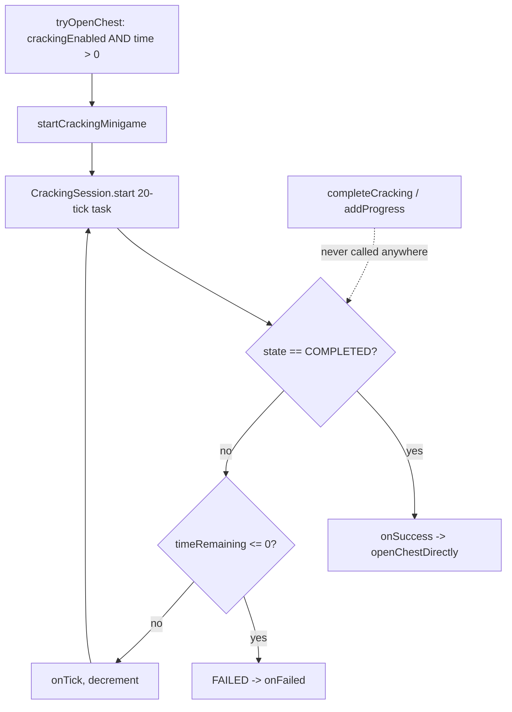
```mermaid
flowchart TD
  A["tryOpenChest: crackingEnabled AND time > 0"] --> B[startCrackingMinigame]
  B --> C["CrackingSession.start 20-tick task"]
  C --> D{"state == COMPLETED?"}
  D -->|yes| E["onSuccess -> openChestDirectly"]
  D -->|no| F{"timeRemaining <= 0?"}
  F -->|yes| G["FAILED -> onFailed"]
  F -->|no| H["onTick, decrement"]
  H --> C
  I["completeCracking / addProgress"] -.->|never called anywhere| D
```
**State & persistence effects:** none reachable today.
**Edge cases & guards observed:** grep across both repos shows **no caller** of `setCrackingEnabled`, `setCrackingTimeSeconds`, `completeCracking` or `addProgress`, and `LootChestSettings` does not override `isCrackingEnabled()`. `LootChestData.crackingEnabled` therefore stays `false` forever, so the branch is dead. Were it enabled, there is still no player-input listener, so every session would time out and fail; and the failure path leaves the chest untouched with no message beyond the (unhandled) events.

### W13: Loot chest quit / reload / shutdown cleanup
**Trigger:** `PlayerQuitEvent`, `context.reloadBeans()`, plugin disable.
**Steps:**
1. `LootChestListener.onPlayerQuit` (`:105-108`) -> `cancelSession(player)` -> removes the session, calls `session.close()` (which still syncs the inventory) and `cancelCracking(player)` (`LootChestService.java:332-340`).
2. `LootChestManager.onClear` (`LootChestManager.java:64-73`) — stops the pending 5 s startup timer, `cancelSessions()` (cancels every loot and cracking session, clears both maps), `clearChests()` (clears both chest maps, `cooldownManager.clear()` cancelling all tasks and despawning holograms/icons, `hologramService.clear()`); deliberately does **not** call `LootChestService.clear()` so the freshly reloaded tiers/tables survive.

**Diagram:**
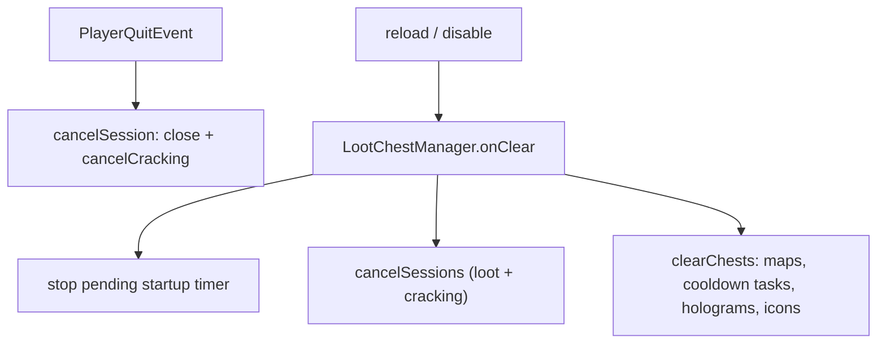
```mermaid
flowchart TD
  A[PlayerQuitEvent] --> B["cancelSession: close + cancelCracking"]
  C["reload / disable"] --> D[LootChestManager.onClear]
  D --> E["stop pending startup timer"]
  D --> F["cancelSessions (loot + cracking)"]
  D --> G["clearChests: maps, cooldown tasks, holograms, icons"]
```
**State & persistence effects:** timers cancelled, entities despawned, in-memory chest state dropped (rows survive; runtime cooldown/inventory state does not).
**Edge cases & guards observed:** `cancelSession` on quit calls `session.close()` which writes the current inventory back onto `chestData` — correct — but it never fires `sessionCompleteHandler`, so no `LootChestCloseEvent` and **no cooldown start** when a player quits with the chest open; `sharedChestInventories`/`activeSessionsByChest` entries for that chest are also not cleaned by this path.

### W14: Sign type registration at bootstrap
**Trigger:** CONFIG bean phase.
**Steps:**
1. `GameplayConfig.signManager(...)` (`gangland-impl/.../config/GameplayConfig.java:258-269`) constructs `SignManager` and calls `manager.initialize()`.
2. `SignService.initialize` (`gangland-ui/sign-api/.../SignService.java:29-35`) -> `setupSigns()` inside a try/catch that only logs `"There was a problem registering the sign type"`.
3. `SignManager.setupSigns` (`gangland-impl/.../sign/SignManager.java:84-211`) builds 13 types (`weapon-buy/sell`, `ammo-buy/sell`, `buy`, `sell`, `view`, `wanted`, `bounty`, `wearable-buy/sell`, `car-buy/sell`), registering each `SignFormat` in `SignFormatRegistry` and returning each `SignTypeDefinition`.
4. `SignTypeRegistry.register` (`.../registry/SignTypeRegistry.java:15-23`) indexes each definition under a normalized `typed` key (`glw-buy`) **and** a normalized `generated` key (`buy`); `normalize` strips colors, lowercases and removes square brackets.

**Diagram:**
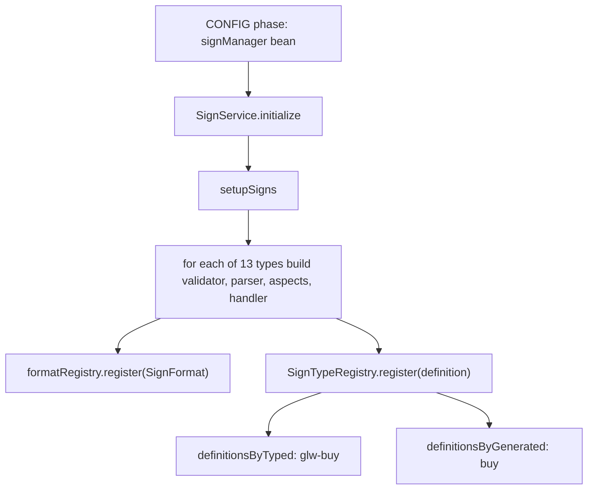
```mermaid
flowchart TD
  A["CONFIG phase: signManager bean"] --> B["SignService.initialize"]
  B --> C[setupSigns]
  C --> D["for each of 13 types build validator, parser, aspects, handler"]
  D --> E["formatRegistry.register(SignFormat)"]
  D --> F["SignTypeRegistry.register(definition)"]
  F --> G["definitionsByTyped: glw-buy"]
  F --> H["definitionsByGenerated: buy"]
```
**State & persistence effects:** two in-memory registries; nothing persisted.
**Edge cases & guards observed:** a `SignValidationException` thrown part-way through `setupSigns` aborts the *whole* list with only a vague warning and leaves the registry partially populated; `SignTypeRegistry.register` silently overwrites on key collision.

### W15: Sign creation (write -> validate -> format)
**Trigger:** `SignChangeEvent` (player finishes editing a sign).
**Steps:**
1. `SignCreation.onSignCreate` (`gangland-ui/sign-api/.../listener/SignCreation.java:21-45`, HIGHEST) — returns unless `lines[0]` starts with the service prefix (`glw-`).
2. `SignInteractionService.validateSign` (`.../service/SignInteractionService.java:29-45`) — requires 4 lines, resolves the definition by `findByLine(lines[0])`, then `def.getSignValidator().validate(lines)`.
3. `AbstractSignValidator.validate` (`.../validation/AbstractSignValidator.java:26-38`) — line 1 type (`equalsIgnoreCase` against typed **or** generated, colors stripped but brackets **not**), line 2 content via `isValidContent`, line 3 price (non-empty, parseable, `>= 0`, `<= 99999999.99`, max 8 chars), line 4 amount (non-empty, integer, `> 0`, `<= 99999999`, max 8 chars), then `performCustomValidation`. View/bounty/wanted validators override price/amount with no-ops and do their own checks.
4. On success, `formatForDisplay` (`.../service/SignFormatterService.java:19-49`) looks the format up by name then by prefix, checks required lines, and rewrites all four lines through their `SignLineFormat.format` (colors plus a money symbol prefix for the PRICE line). Failures inside the formatter fall back to the raw lines (`SignInteractionService.java:60-67`).
5. Lines are written back with `event.setLine(i, ...)` and `Signs.Created` is sent. On `SignValidationException` the player gets `Signs.Creation_Failed` with the reason and the event is cancelled.

**Diagram:**
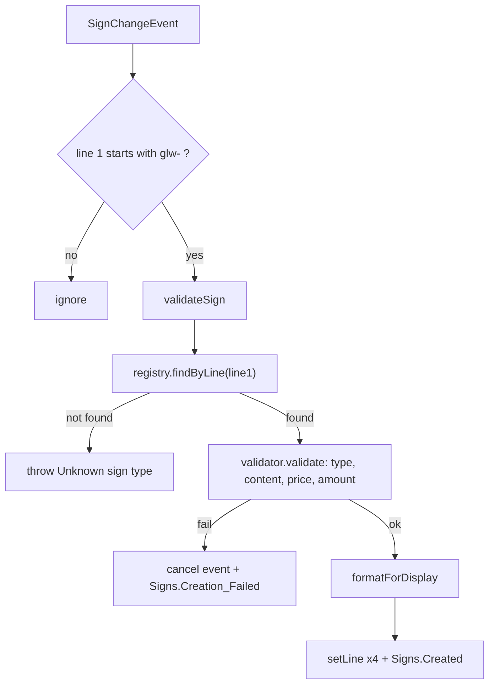
```mermaid
flowchart TD
  A[SignChangeEvent] --> B{"line 1 starts with glw- ?"}
  B -->|no| Z[ignore]
  B -->|yes| C[validateSign]
  C --> D["registry.findByLine(line1)"]
  D -->|not found| E["throw Unknown sign type"]
  D -->|found| F["validator.validate: type, content, price, amount"]
  F -->|fail| G["cancel event + Signs.Creation_Failed"]
  F -->|ok| H[formatForDisplay]
  H --> I["setLine x4 + Signs.Created"]
```
**State & persistence effects:** the sign block text is the only stored state; no registry entry, no DB row, no owner recorded.
**Edge cases & guards observed:** **no permission check** — any player who can place a sign can create a working shop sign (`Messages.SIGN_NO_PERM` exists but is unused); re-editing an already formatted sign fails because `validateSignType` compares against `[BUY]` while `SignTypeRegistry.normalize` strips the brackets; `lines[0].toLowerCase()` and `normalize` use the default locale.

### W16: Sign use — single buy
**Trigger:** right-click a `[BUY]`-style sign (not sneaking).
**Steps:**
1. `PlayerSignInteract.onSignInteract` (`gangland-ui/sign-api/.../listener/PlayerSignInteract.java:35-89`, HIGH) — `RIGHT_CLICK_BLOCK`, block state is a `Sign`, `registry.findByLine(lines[0])` must match.
2. `signService.parseSign(lines, block.getLocation())` inside a `catch (SignValidationException ignored)`; empty result -> `Signs.Invalid`. **`validateSign` is not re-run.**
3. `event.setCancelled(true)`; `signService.handlerInteraction(player, parsed)`.
4. `SignInteraction.handlerInteraction` (`.../service/SignInteraction.java:26-57`) — `handler.canHandle` requires **every** aspect's `canExecute`, else the generic `"Might be missing something!"`; then `handler.handle`.
5. `AspectBasedSignHandler.handle` (`.../handler/AspectBasedSignHandler.java:19-39`) runs aspects in **construction order**, re-checking `canExecute` before each and stopping on `!continueExecution`.
6. For `BuySign` the order is `MoneyAspect(WITHDRAW)` then `ItemTransferAspect(GIVE)` (`gangland-impl/.../sign/type/trade/BuySign.java:54-60`): money is taken first, then `item.setAmount(sign.getAmount())` and `player.getInventory().addItem(item)`.

**Diagram:**
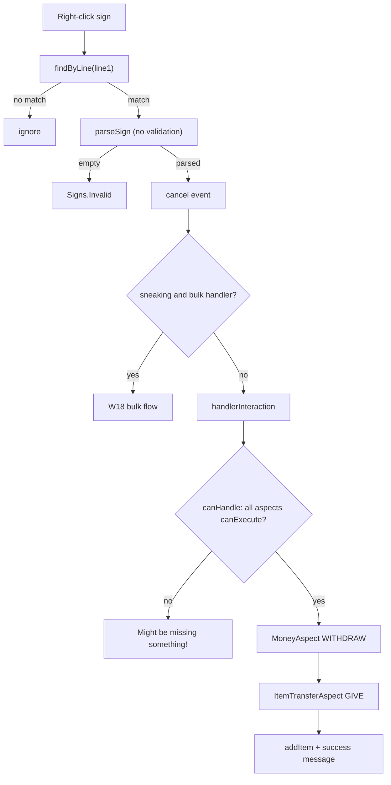
```mermaid
flowchart TD
  A["Right-click sign"] --> B["findByLine(line1)"]
  B -->|no match| Z[ignore]
  B -->|match| C["parseSign (no validation)"]
  C -->|empty| D[Signs.Invalid]
  C -->|parsed| E["cancel event"]
  E --> F{"sneaking and bulk handler?"}
  F -->|yes| G["W18 bulk flow"]
  F -->|no| H[handlerInteraction]
  H --> I{"canHandle: all aspects canExecute?"}
  I -->|no| J["Might be missing something!"]
  I -->|yes| K["MoneyAspect WITHDRAW"]
  K --> L["ItemTransferAspect GIVE"]
  L --> M["addItem + success message"]
```
**State & persistence effects:** economy withdrawal, inventory insertion. Nothing about the sign changes — stock is infinite.
**Edge cases & guards observed:** `canExecute` for GIVE only checks `firstEmpty() != -1` (one free slot), while `execute` can add far more than one stack — the leftover map from `addItem` is discarded, silently voiding items after the player has been charged; a `price` of `0` short-circuits with `Messages.FREE_TRANSACTION` and still delivers the item; interacting with a sign that was never validated (schematic, WorldEdit, other plugin) parses whatever numbers are on it — `AbstractSignParser.parsePrice` does not reject negatives.

### W17: Sign use — single sell
**Trigger:** right-click a `[SELL]`-style sign.
**Steps:** identical to W16 through step 5, but `SellSign.createDefinition` (`gangland-impl/.../sign/type/trade/SellSign.java:50-60`) builds the aspect list as `List.of(moneyAspect /* DEPOSIT */, itemAspect /* TAKE */)` — the **deposit runs before the item is removed**.
1. `MoneyAspect(DEPOSIT).execute` -> `economy.depositAmount(Currency.of(price))`, always `successContinue`.
2. `ItemTransferAspect(TAKE).execute` -> `hasEnoughItems` over `getStorageContents()` using the type's similarity checker (`a.isSimilar(b)` for generic sell, weapon/ammo comparators for the specialised signs), then `removeItems` walks storage removing whole/partial stacks and writes the array back with `setStorageContents`.

**Diagram:**
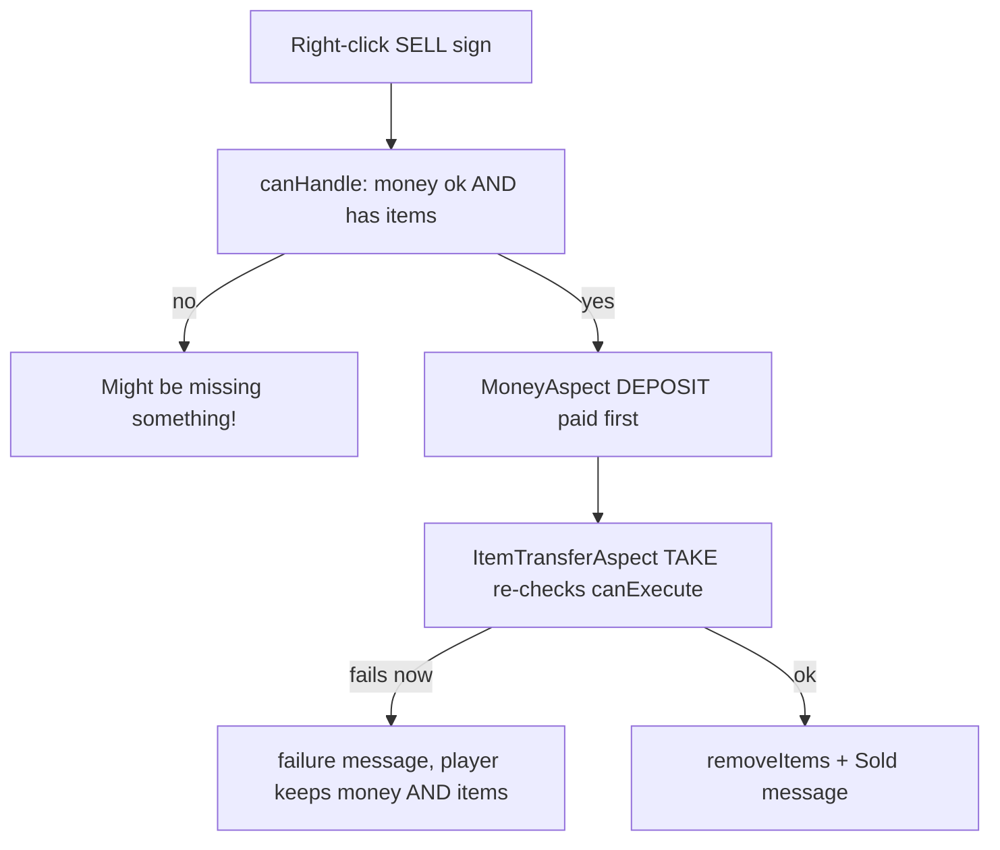
```mermaid
flowchart TD
  A["Right-click SELL sign"] --> B["canHandle: money ok AND has items"]
  B -->|no| C["Might be missing something!"]
  B -->|yes| D["MoneyAspect DEPOSIT paid first"]
  D --> E["ItemTransferAspect TAKE re-checks canExecute"]
  E -->|"fails now"| F["failure message, player keeps money AND items"]
  E -->|ok| G["removeItems + Sold message"]
```
**State & persistence effects:** economy deposit, inventory removal.
**Edge cases & guards observed:** the aspect **priorities** (`MoneyAspect` 100/-100, `ItemTransferAspect` 50) exist precisely to order deposit-after-take, but `AspectBasedSignHandler` uses raw list order and `SignTypeDefinition.getSortedAspects()` is never called anywhere in the codebase — the priority mechanism is dead; the price paid is per-*transaction*, not per-item, so a sign selling `64` for `10` pays `10` for 64 items.

### W18: Bulk sign transaction (shift-click)
**Trigger:** sneaking right-click on a sign whose definition has a `BulkSignHandler` (all buy/sell trade signs).
**Steps:**
1. `PlayerSignInteract.handleBulkInteraction` (`.../listener/PlayerSignInteract.java:91-126`).
2. First shift-click: any stale pending action is cancelled, `bulkHandler.previewBulk(parsed)` snapshots `(amount, price, content)`, `bulkActionManager.initiate` (`.../bulk/BulkActionManager.java:60-74`) stores a `PendingBulkAction` with a 10 s deadline and schedules an expiry task, and `Signs.Bulk.Confirm_Request` is sent.
3. Second shift-click on the **same sign** within the window (`PendingBulkAction.matchesSign` compares sign type and `Location`): `confirm()` removes the pending action and cancels the expiry task, then `action.getHandler().executeBulkAction(player, parsed)`.
4. `BuySign/SellSign.executeBulkAction` simply re-runs the cached aspect chain (`BuySign.java:88-95`) — i.e. exactly one more normal transaction.
5. Results are streamed to the player, stopping at the first failure.

**Diagram:**
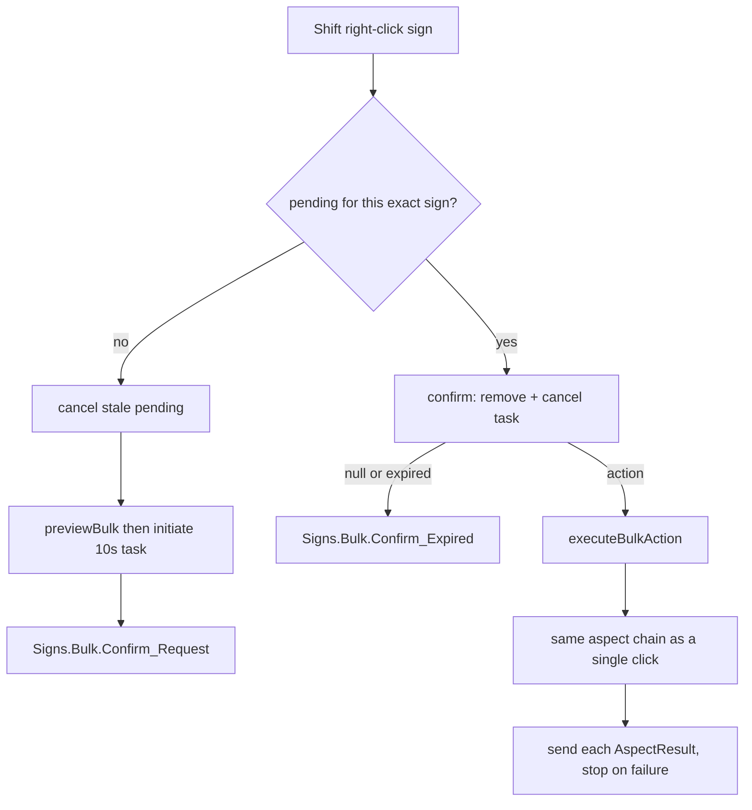
```mermaid
flowchart TD
  A["Shift right-click sign"] --> B{"pending for this exact sign?"}
  B -->|no| C["cancel stale pending"]
  C --> D["previewBulk then initiate 10s task"]
  D --> E[Signs.Bulk.Confirm_Request]
  B -->|yes| F["confirm: remove + cancel task"]
  F -->|"null or expired"| G[Signs.Bulk.Confirm_Expired]
  F -->|action| H[executeBulkAction]
  H --> I["same aspect chain as a single click"]
  I --> J["send each AspectResult, stop on failure"]
```
**State & persistence effects:** `BulkActionManager.pending` (keyed by `UUID`, good) plus one scheduled task per pending action.
**Edge cases & guards observed:** "bulk" performs the **identical** transaction as a single click — the preview promises `quantity` items for `totalPrice`, which is exactly what a normal click already does, so the feature currently adds a confirmation step and nothing else; `BulkActionManager.clear()` exists but is not called from any shutdown path in this area; a player who logs out with a pending action leaves the expiry task to fire harmlessly.

### W19: Non-trade signs (view / wanted / bounty)
**Trigger:** right-click a `[VIEW]`, `[WANTED]` or `[BOUNTY]` sign.
**Steps:**
1. Same dispatch as W16. `ViewSign` has a single `ViewInventoryAspect` that opens a browse GUI; `ViewSignValidator.isValidContent` accepts *anything* non-empty (`gangland-impl/.../sign/validation/ViewSignValidator.java:24-50`) and no-ops price/amount validation.
2. `WantedSign` chains `MoneyAspect(WITHDRAW)` then `WantedAspect` (`.../sign/type/WantedSign.java:36-41`). `WantedParser` reads line 3 as **stars** and line 4 as **price** (`.../sign/parser/WantedParser.java:16-33`), and `WantedSignValidator` overrides the base price/amount checks to match (`Integer.parseInt` on both, positive, line 4 optional).
3. `WantedAspect.execute` (`.../sign/aspect/WantedAspect.java:17-60`) — `INCREASE` adds `amount` levels, `REMOVE` decrements `amount` times, `CLEAR` resets; `canExecute` requires `wanted.getLevel() > 0` for non-increase.
4. `BountySign` has a single `BountyAspect`; `VIEW` opens a paged bounty list, `CLEAR` withdraws the player's own bounty amount and resets it.

**Diagram:**
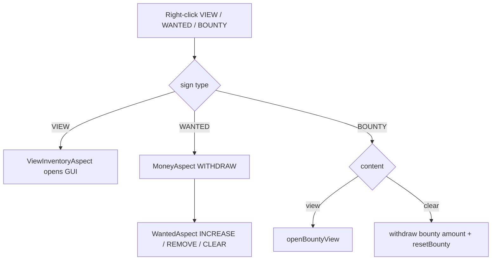
```mermaid
flowchart TD
  A["Right-click VIEW / WANTED / BOUNTY"] --> B{sign type}
  B -->|VIEW| C["ViewInventoryAspect opens GUI"]
  B -->|WANTED| D["MoneyAspect WITHDRAW"]
  D --> E["WantedAspect INCREASE / REMOVE / CLEAR"]
  B -->|BOUNTY| F{content}
  F -->|view| G[openBountyView]
  F -->|clear| H["withdraw bounty amount + resetBounty"]
```
**State & persistence effects:** wanted level, bounty record, economy.
**Edge cases & guards observed:** both `WantedAspect` and `BountyAspect` call `Enum.valueOf(sign.getContent().toUpperCase())` with no try/catch in **both** `execute` and `canExecute` — a sign whose content line was edited around the validator throws `IllegalArgumentException` straight out of the interact listener; the `WantedSignValidator` price check is `Integer.parseInt`, so decimal prices are rejected at creation while `WantedParser` reads them as `double`.

### W20: Sign break / removal
**Trigger:** breaking the sign block.
**Steps:** none — there is no `BlockBreakEvent`, `BlockPhysicsEvent` or explosion handler for signs anywhere in `sign-api` or `gangland-impl/sign/**`.
**Diagram:**
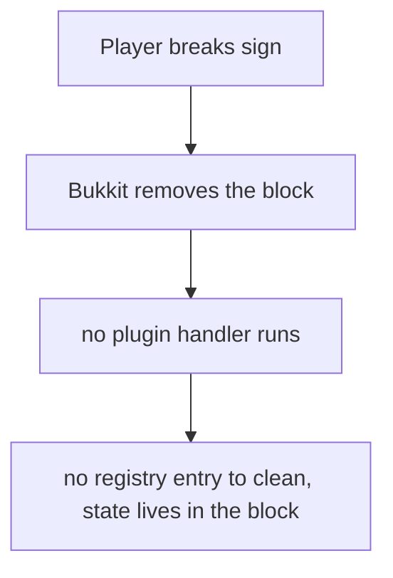
```mermaid
flowchart TD
  A["Player breaks sign"] --> B["Bukkit removes the block"]
  B --> C["no plugin handler runs"]
  C --> D["no registry entry to clean, state lives in the block"]
```
**State & persistence effects:** none.
**Edge cases & guards observed:** because there is no persistence, breaking a sign is self-cleaning — but it also means **anyone with block-break access can delete an admin shop**, and there is no ownership or protection concept at all.

### W21: Waypoint startup load
**Trigger:** `WaypointManager` bean lifecycle.
**Steps:**
1. `WaypointManager.onInitialize` -> `initialize()` (`gangland-impl/.../data/teleportation/WaypointManager.java:34-52`).
2. `repository.loadAll()` -> `WaypointRepository.doLoadAll` (`.../database/repositories/waypoint/WaypointRepository.java:32-69`) reads 15 columns positionally, `Waypoint.WaypointType.valueOf(type.toUpperCase())`, sets id/coords/type/gang/timer/cooldown/shield/cost/radius.
3. Each waypoint registers a Bukkit permission `"waypoint." + id` (note: **no plugin prefix and id-based**) and goes into the `waypoints` map.
4. `Waypoint.setID(maxId)` resets the static counter so new waypoints continue the sequence; `repository.setDataSupplier(waypoints::values)`.

**Diagram:**
```mermaid
flowchart TD
  A["WaypointManager.onInitialize"] --> B["repository.loadAll"]
  B --> C["doLoadAll: 15 columns per row"]
  C --> D["WaypointType.valueOf(type)"]
  D --> E["addPermission waypoint.id"]
  E --> F["waypoints.put(id, waypoint)"]
  F --> G["Waypoint.setID(maxId)"]
  G --> H["setDataSupplier(waypoints values)"]
```
**State & persistence effects:** in-memory waypoint map plus static id counter plus Bukkit permission nodes.
**Edge cases & guards observed:** an unrecognised `type` value aborts the whole load with `IllegalArgumentException`; yaw/pitch are declared `Float` in `WaypointTable` but read with `(double) result[...]`; `Waypoint.getLocation()` is correctly `@Nullable` and null-checks `Bukkit.getWorld`.

### W22: Waypoint create
**Trigger:** `/glw waypoint create <name>` then `/glw waypoint create confirm`.
**Steps:**
1. `WaypointCreateCommand`'s `OptionalArgument` (`.../command/sub/waypoint/WaypointCreateCommand.java:108-141`) — stores the proposed name per player, sends a confirm prompt, locks a `ConfirmArgument` and starts a 60 s `CountdownTimer` (`start(false)`) that re-prompts every 20 s and unlocks on expiry.
2. `ConfirmArgument` action (`:66-103`) — builds `new Waypoint(name, Gangland.FULL_PREFIX)` (which assigns `usedId = ++ID` and permission `gangland.waypoint.<name>`), sets coordinates from `player.getLocation()`, `waypointManager.add(waypoint)`, sends `WAYPOINT_CREATED`.
3. `permissionManager.addPermission(waypoint.getPermission())`.
4. It then synthesises `/glw waypoint select <id>` via `ArgumentUtil.getArgumentSequence` and `player.performCommand`, so the new waypoint becomes the caller's selection.

**Diagram:**
```mermaid
flowchart TD
  A["/glw waypoint create name"] --> B["store name, lock confirm, 60s timer"]
  B --> C["/glw waypoint create confirm"]
  C --> D["new Waypoint -> usedId = ++ID"]
  D --> E["setCoordinates from player location"]
  E --> F["waypointManager.add"]
  F --> G["addPermission gangland.waypoint.name"]
  G --> H["performCommand waypoint select id"]
```
**State & persistence effects:** in-memory only; the row appears at the next autosave.
**Edge cases & guards observed:** `createWaypointName.get(player).get()` is dereferenced without a null check — reaching the confirm branch without a stored name NPEs; duplicate names are allowed and `WaypointManager.get(String)` returns the first match; the created waypoint has `gangId = -1`, which `WaypointTable.getData` writes verbatim into a column carrying a foreign key to `gang.id`.

### W23: Waypoint select / deselect / configure
**Trigger:** `/glw waypoint select <id>`, `deselect`, or any setter sub-command.
**Steps:**
1. `WaypointSelectCommand` (`.../WaypointSelectCommand.java:46-80`) parses the id, resolves the waypoint, `waypointManager.playerSelect(player, waypoint)`, sends `WAYPOINT_SELECTED`. The tab-completer filters by gang membership and `player.hasPermission(waypoint.getPermission())`; **the executed action does not**.
2. `WaypointDeselectCommand` removes the mapping and reports.
3. Setters (`cost`, `timer`, `cooldown`, `shield`, `radius`, `type`, `gangid`) all follow the same shape: resolve `waypointManager.getSelected(player)`, `NOT_SELECTED_WAYPOINT` when absent, parse the numeric/enum argument (`MUST_BE_NUMBERS` on failure), mutate the `Waypoint`, send `WAYPOINT_CONFIGURATION_SUCCESS` (e.g. `WaypointCostCommand.java:46-72`).

**Diagram:**
```mermaid
flowchart TD
  A["/glw waypoint select id"] --> B["parse int"]
  B -->|fail| C[MUST_BE_NUMBERS]
  B -->|ok| D["waypointManager.get(id)"]
  D -->|null| E[INVALID_WAYPOINT]
  D -->|found| F["selectedWaypoints.put(player, wp)"]
  F --> G["setters act on the selection"]
  G --> H["cost / timer / cooldown / shield / radius / type / gangid"]
  H --> I[WAYPOINT_CONFIGURATION_SUCCESS]
```
**State & persistence effects:** `selectedWaypoints` map (keyed by the live `Player`); waypoint field mutations persisted at the next autosave.
**Edge cases & guards observed:** no bounds checks — negative cost, negative timer/cooldown/shield are all accepted; `selectedWaypoints` is a plain `HashMap<Player, Waypoint>` never cleaned on quit; select is gated only by the command permission, so anyone who can run it can select and then edit any waypoint.

### W24: Waypoint teleport — cost confirmation
**Trigger:** `/glw teleport [name]`.
**Steps:**
1. `TeleportCommand.onExecute` uses `waypointManager.getSelected(player)`; the `OptionalArgument` branch uses `waypointManager.get(args[1])` by name (`.../command/sub/waypoint/TeleportCommand.java:57-110`).
2. `teleportCost` (`:117-156`) — `INVALID_WAYPOINT` when null; if `cost != 0` and no pending confirmation, stores `reconfirm[player] = waypoint`, starts a 30 s `CountdownTimer` with `start(true)` (**async**) that removes the entry, and asks the player to retype.
3. On the second invocation (or when cost is 0) it compares `user.getEconomy().getAmount()` with the cost, sends `CANNOT_TAKE_MORE_THAN_BALANCE` if short, otherwise clears the reconfirm state and calls `teleport`.

**Diagram:**
```mermaid
flowchart TD
  A["/glw teleport name"] --> B{"waypoint resolved?"}
  B -->|no| C[INVALID_WAYPOINT]
  B -->|yes| D{"cost non-zero and no pending confirm?"}
  D -->|yes| E["store reconfirm, async 30s timer, prompt"]
  D -->|no| F{"balance >= cost?"}
  F -->|no| G[CANNOT_TAKE_MORE_THAN_BALANCE]
  F -->|yes| H["clear reconfirm, cancel timer"]
  H --> I["teleport()"]
```
**State & persistence effects:** two per-player `HashMap`s in the command object.
**Edge cases & guards observed:** the confirmation is keyed by **player only**, not by waypoint — confirming for a cheap waypoint then immediately naming an expensive one skips its confirmation; the 30 s timer uses `start(true)` (async) yet mutates a plain `HashMap` from the async thread; `reconfirm`/`reconfirmTimer` are never cleaned on quit; **no per-waypoint permission or gang check is performed anywhere on this path**.

### W25: Waypoint teleport — warm-up, move cancellation and execution
**Trigger:** `TeleportCommand#teleport` -> `Waypoint#getWaypointTeleport().teleport(...)`.
**Steps:**
1. `WaypointTeleport.teleport` (`.../data/teleportation/WaypointTeleport.java:58-76`) — throws `IllegalTeleportException` when `teleportCooldown` contains the player (the command catches it and reports `Waypoint.Cooldown` with the remaining time).
2. Builds a `CountdownTimer(plugin, interval = timer == 0 ? 0 : 1, waypoint.getTimer(), ...)`, registers it in the static `countdownTimer` map when `timer != 0`, and `start(false)` (main thread). Each tick sends `Commands.Waypoint.Teleportation.Timer`.
3. `onPlayerMove` (`:78-109`) accumulates the absolute x/y/z deltas per player in a static `totalDistance` map; once the cumulative delta exceeds `1.5` blocks it cancels the timer, clears both maps and sends `Waypoint.Cancelled_Teleport`. The very first move after the timer starts only seeds the map.
4. On completion, `teleport(plugin, user, future)` (`:111-163`) — `Bukkit.getWorld(waypoint.getWorld())` null -> completes with `success = false`; fires the cancellable `TeleportEvent`; on cancel completes `false`; otherwise `player.teleport(location)`.
5. Cooldown: when `cooldown != 0`, a `CountdownTimer` started with `start(true)` (**async**) removes the player from `teleportCooldown` when it ends. Shield: when `shield != 0`, `player.setInvulnerable(true)` and a main-thread timer clears it.
6. Back in `TeleportCommand.teleport` (`:173-199`) the `thenAccept` callback withdraws the cost **after** a successful teleport and sends `Commands.Waypoint.Teleportation.Sent` or `Errors.Waypoint.Teleport_Issue`.

**Diagram:**
```mermaid
flowchart TD
  A["teleport(user)"] --> B{"player on teleport cooldown?"}
  B -->|yes| C["IllegalTeleportException -> Waypoint.Cooldown"]
  B -->|no| D["CountdownTimer warm-up start false"]
  D --> E["tick: Teleportation.Timer message"]
  E --> F{"cumulative move over 1.5 blocks?"}
  F -->|yes| G["timer.cancel + Cancelled_Teleport"]
  F -->|no| H["timer completes"]
  H --> I{"world null?"}
  I -->|yes| J["TeleportResult false"]
  I -->|no| K["fire TeleportEvent"]
  K -->|cancelled| J
  K -->|ok| L["player.teleport(location)"]
  L --> M["cooldown timer start true async"]
  L --> N["shield setInvulnerable true + timer"]
  L --> O["TeleportResult true -> withdraw cost, send message"]
```
**State & persistence effects:** three **static** maps keyed by `Player` (`teleportCooldown`, `countdownTimer`, `totalDistance`), the player's location and invulnerability flag, and an economy withdrawal.
**Edge cases & guards observed:** the warm-up timer is **not cancelled on quit** — nothing removes the player from `countdownTimer` on `PlayerQuitEvent`, so a player who logs out mid-warm-up is teleported (or the timer errors) on completion, and the map keeps a reference to the stale `Player`; the same static maps mean cooldowns are keyed by `Player` identity, so relogging produces a new `Player` object and silently clears the cooldown; the cooldown timer's async callback mutates a `HashMap`; the shield's invulnerability is never restored if the plugin reloads mid-shield; only **one** `WaypointTeleport` instance (the `WiringConfig` dummy, `gangland-impl/.../config/WiringConfig.java:42-48`) is registered as a listener — the per-waypoint instances created in `Waypoint`'s constructor are never registered, which is fine only because the maps are static.

### W26: Waypoint delete and id refactor
**Trigger:** `/glw waypoint delete <id>` then `confirm`.
**Steps:**
1. `WaypointDeleteCommand`'s `OptionalArgument` (`.../command/sub/waypoint/WaypointDeleteCommand.java:108-149`) parses and validates the id, stores it, prompts for confirmation, locks a `ConfirmArgument` with a 60 s timer started with `start(true)` (**async**).
2. Confirm action (`:65-104`) — re-resolves the waypoint, then `helper.runQueriesAsync(...)`: `DELETE FROM waypoint WHERE id = ?` followed by `waypointManager.refactorIds()`.
3. `WaypointManager.refactorIds` (`.../data/teleportation/WaypointManager.java:90-119`) — deletes **every** row from `waypoint`, then walks the previously-selected rows re-assigning `usedId = 1..n`, re-inserting each, and resets the static counter.
4. Back on the calling thread: `WAYPOINT_DELETED`, `permissionManager.removePermission("gangland.waypoint." + usedId, true)`, `waypointManager.remove(waypoint)`.

**Diagram:**
```mermaid
flowchart TD
  A["/glw waypoint delete id"] --> B["validate id, prompt, lock confirm"]
  B --> C["/glw waypoint delete confirm"]
  C --> D["async DELETE FROM waypoint WHERE id"]
  D --> E["refactorIds deletes all rows"]
  E --> F["re-assign usedId 1..n and re-insert"]
  F --> G["Waypoint.setID(tempId - 1)"]
  C --> H[WAYPOINT_DELETED]
  H --> I["removePermission gangland.waypoint.id"]
  I --> J["waypointManager.remove"]
```
**State & persistence effects:** rows deleted and rewritten; every waypoint's `usedId` may change; the static counter is reset.
**Edge cases & guards observed:** `refactorIds` runs on an **async** thread yet mutates the `waypoints` `HashMap` (remove + put) that the main thread reads on every command and teleport; `waypoints.get(id)` can return `null` for a row that exists in the DB but not in memory, and the next line dereferences it (`waypoint.getUsedId()`); the permission removed is `gangland.waypoint.<id>` while the one created was `gangland.waypoint.<name>` and the one registered at load was `waypoint.<id>` — three different node shapes; renumbering ids invalidates any external reference to an id.

## Cross-feature Dependencies
- **Depends on:**
  - Keystone: `keystone-bean` (`@Bean`, `BeanLifecycle`, `@ListenerHandler`, `@CommandHandler`, `@Qualifier`), `keystone-persistence` (`AbstractRepository`, `RepositoryRegistry`, `Table`/`Attribute`, `FileLoader`, `FileManager`, `NodeReader`/`ConfigReport`), `keystone-command` (`Argument`, `SubArgument`, `OptionalArgument`, `ConfirmArgument`, `Tree`, `ArgumentUtil`), `keystone-timer` (`CountdownTimer`), `keystone-item` (`ItemBuilder`), `keystone-economy` (`Currency`, `EconomyHandler`), `keystone.sound.SoundEffect`, `keystone.permission.PermissionManager`, `keystone.util.{ChatUtil, TimeUtil}`, `keystone.color.Color`.
  - `gangland-ui/hologram-api` — `HologramService`/`Hologram` for chest holograms.
  - `gangland-ui/inventory-api` — `InventoryHandler`, `InventoryUtil`, `Fill` for the chest inventory, the wand GUI and the bounty/view GUIs.
  - `gangland-infra/gangland-item` — `ItemParser` (loot item strings, tier icons, wand preview) and `UniqueItemAddon`.
  - `gangland-features/gangland-weapon` — `WeaponService`, `AmmunitionManager`, `WearableService` for the weapon/ammo/wearable sign types.
  - `gangland-impl` domain: `UserManager`/`User` (economy, level, wanted, bounty, gang id), `GangManager` (waypoint gang binding), `CarManager` (car signs), `Settings`/`Messages`, `GanglandChatUtil`.
  - Third-party: NBT-API (`NBT.modify` in the wand), AnvilGUI (wand text input), XSeries (`XMaterial`).
- **Depended on by:**
  - `CustomPlayerDeathListener` (`gangland-impl/.../listener/player/CustomPlayerDeathListener.java:255`) teleports the player to the `settings.yml` respawn waypoint.
  - The jail system resolves `Fallback_Exit_Waypoint` by waypoint name (`settings.yml:437`).
  - `LootChestEarnGoodsListener` feeds the level/economy systems and fires `UserLevelUpEvent`.
  - `PeriodicalUpdates` / `RepositoryRegistry.saveAll()` drives persistence for both the loot-chest and waypoint repositories.

## Observations & Potential Issues

| # | Location | Observation | Risk | Confidence |
|---|---|---|---|---|
| 1 | `command/sub/waypoint/TeleportCommand.java:117-211`, `WaypointSelectCommand.java:46-80`, `WaypointListCommand.java:31-56` | The teleport, select and list paths perform **no** `waypoint.getPermission()` or gang check. Permission/gang filtering exists only in the tab-completers. `/glw waypoint list` prints every waypoint with a click-to-run teleport component | Any player with the command node can teleport into another gang's base or a permission-gated area, and can enumerate all of them | High |
| 2 | `lootchest/LootChestService.java:262-263`, `lootchest/data/LootChestData.java:42-47`, `file/configuration/lootchest/LootChestSettings.java` | The cracking mini-game is unreachable: `setCrackingEnabled`/`setCrackingTimeSeconds` have no callers, `LootChestSettings` does not override `isCrackingEnabled()`, and `completeCracking`/`addProgress` are never invoked. Five events, four handler chains and a full session class are dead code | Whole advertised feature is inert; if enabled it would always time out because no listener feeds progress | High |
| 3 | `sign/aspect/ItemTransferAspect.java:56-57` and `:25-34` | `canExecute` for GIVE only requires one free slot (`firstEmpty() != -1`), while `execute` does `item.setAmount(sign.getAmount())` and discards the leftover map returned by `addItem` | Buying more than fits silently voids items **after** the money has been withdrawn | High |
| 4 | `sign/type/trade/SellSign.java:50-60` vs `sign/aspect/MoneyAspect.java:74-76` plus `sign/handler/AspectBasedSignHandler.java:23` | `SellSign` lists DEPOSIT before TAKE and `AspectBasedSignHandler` runs aspects in list order; `SignTypeDefinition.getSortedAspects()` (which would apply the priorities) is never called anywhere | Money is paid before the item is removed; if TAKE fails between `canHandle` and `execute` the player keeps both | Medium |
| 5 | `lootchest/LootChestWand.java:92` (`addTag(RESPAWN_TIME, 300L)` -> `nbt.setLong`) vs `:371` (`getIntegerTagData`) | The respawn time is written as a long NBT tag and read as an integer, so the read returns 0 and falls back to the 300 s default | Admin-configured respawn times are silently ignored | Medium |
| 6 | `data/teleportation/WaypointTeleport.java:24-26` | `teleportCooldown`, `countdownTimer` and `totalDistance` are **static** `HashMap<Player, ...>` with no quit cleanup | Memory leak on stale `Player` objects; warm-up timers survive logout; cooldowns are bypassed by relogging (new `Player` identity) | High |
| 7 | `data/teleportation/WaypointManager.java:90-119` called from `WaypointDeleteCommand.java:82-87` | `refactorIds()` runs inside `runQueriesAsync` and mutates the `waypoints` `HashMap` (remove/put) plus the static id counter; `waypoints.get(id)` may return null and is dereferenced immediately | Data race with main-thread reads; `NullPointerException` when a DB row has no in-memory twin; all ids shift under external references | High |
| 8 | `WaypointCreateCommand.java:94` vs `WaypointDeleteCommand.java:92-94` vs `WaypointManager.java:45` | Three different permission node shapes for the same concept: `gangland.waypoint.<name>` (created), `gangland.waypoint.<id>` (removed), `waypoint.<id>` (registered at load) | Permissions are never actually cleaned up and never line up with what `Waypoint.getPermission()` returns | High |
| 9 | `database/tables/waypoint/WaypointTable.java:17,44,65` plus `data/teleportation/Waypoint.java:37` | `gang_id` has a foreign key to `gang.id` and is nullable, but `getData` always writes the sentinel `-1` for non-gang waypoints instead of `null` | Foreign-key violation on save wherever FKs are enforced (MySQL certainly) | Medium |
| 10 | `database/tables/waypoint/WaypointTable.java:23-24,66` vs `database/repositories/waypoint/WaypointRepository.java:45-46` | `yaw`/`pitch` are declared `Attribute<Float>` but written as `(double)` and read back with a `(double)` cast | `ClassCastException` on load if the driver returns `Float` (MySQL `FLOAT` column) | Medium |
| 11 | `lootchest/LootChestService.java:171-183` | On startup a chest loaded with `is_looted = true` and (necessarily) `cooldownEndTime = 0` gets neither an "available" hologram nor a cooldown timer, yet is fully openable | Silent hologram loss after every restart for previously looted chests | Medium |
| 12 | `lootchest/ChestCooldownManager.java:135, 152` | `chestData.getLocation().clone().add(...)` is passed to `HologramService` with no `getWorld()` null check, and `LootChestRepository.doLoadAll:58-59` can build a `Location` with a null world | NPE / hologram spawn failure for chests whose world was renamed or removed | Medium |
| 13 | `lootchest/LootChestService.java:295-330` vs `ChestCooldownManager.java:303-323` | `closeSession` starts the chest cooldown on the **first** viewer's close while others are still looting; `completeCooldown` calls `chestData.respawn()` before the callback force-closes the remaining viewers, whose `close()` then re-syncs their items onto the freshly respawned chest | Loot duplication / stale inventory restored onto a respawned chest | Medium |
| 14 | `command/sub/lootchest/LootChestRemoveCommand.java:56-61` | `unregisterChest` does not close active sessions or clear `sharedChestInventories`/`activeSessionsByChest` for the removed chest | Players keep looting a deleted chest; on close a cooldown and hologram are recreated at the deleted location | Medium |
| 15 | `lootchest/listener/LootChestListener.java:105-108` -> `LootChestService.java:332-340` | `cancelSession` on quit calls `session.close()` (syncing the inventory) but skips `sessionCompleteHandler` and the cooldown start | Quitting with a chest open leaves it permanently un-cooled-down until someone else closes it | Medium |
| 16 | `lootchest/data/LootTable.java:41,26` | `generateLoot(String tierId, ...)` never uses `tierId`; `LootTable.allowedTiers` is loaded from `Allowed_Tiers` and never read | `Allowed_Tiers` in `loot_chests.yml` is a no-op — any tier can roll any table | High |
| 17 | `listener/loot/LootChestEarnGoodsListener.java:57-61` | `random.nextDouble(min, max)` throws `IllegalArgumentException` when `Minimum >= Maximum` | A plausible config (`Minimum: 100, Maximum: 100`) makes every chest open throw inside the event handler | Medium |
| 18 | `listener/loot/LootChestEarnGoodsListener.java:31,54` | `openedLootChests` is a `Map<Player, Set<UUID>>` pruned only by chest id on cooldown completion | `Player` reference leak; and because the reward fires on `LootChestOpenEvent`, opening-and-closing without taking anything still pays out | Medium |
| 19 | `sign/listener/SignCreation.java:21-45`; `Messages.java:233` | No permission check on sign creation, and no handler at all for sign breaking. `Messages.SIGN_NO_PERM` ("Errors.Permissions.Sign") is declared but never used | Any player who can place a sign can create a functioning shop; any player who can break blocks can delete one | High |
| 20 | `sign/listener/PlayerSignInteract.java:62-72` vs `SignInteractionService.java:29-45` | The interact path calls `parseSign` only — `validateSign` is never re-run. `AbstractSignParser.parsePrice/parseAmount` accept negatives and zero | A sign created outside `SignChangeEvent` (schematic, WorldEdit, `/setblock`, another plugin) is honoured with arbitrary price/amount | Medium |
| 21 | `sign/validation/AbstractSignValidator.java:45-56` vs `sign/registry/SignTypeRegistry.java:56-58` | `validateSignType` strips colors but not brackets; `normalize` strips brackets. A player editing an already-formatted `[BUY]` sign passes registry lookup and then fails validation | Existing signs cannot be edited in place; the sign is cancelled and reverts | Medium |
| 22 | `sign/aspect/WantedAspect.java:26,70`; `sign/aspect/BountyAspect.java:45,81` | `Enum.valueOf(sign.getContent().toUpperCase())` with no try/catch in both `execute` and `canExecute` | `IllegalArgumentException` propagates out of the interact listener for any malformed content line | Medium |
| 23 | `lootchest/LootChestService.java:475-521` plus all events under `lootchest/events/**` | Every loot-chest event implements `Cancellable`, but `callEvent` results are never inspected | The cancellation contract is a lie; add-ons cannot veto opens, cooldowns or cracking | Medium |
| 24 | `command/sub/waypoint/TeleportCommand.java:107` vs `:165` | The command registers `<node>.cooldown_bypass` but the bypass check reads `gangland.command.teleport.force_rank` | The registered permission does nothing; the effective one is undiscoverable | High |
| 25 | `command/sub/waypoint/TeleportCommand.java:128-133`, `WaypointDeleteCommand.java:141-148` | `CountdownTimer.start(true)` (async) is used for callbacks that mutate plain `HashMap`s (`reconfirm`, `deleteWaypointId`, `deleteWaypointTimer`) | Violates the project's own "async timers are only for flag flips" rule; corrupt map state under concurrency | Medium |
| 26 | `command/sub/waypoint/TeleportCommand.java:125-140` | The reconfirm gate is keyed by player only, not by (player, waypoint) | Confirming a cheap teleport then naming an expensive one skips its price confirmation | Medium |
| 27 | `command/sub/waypoint/WaypointCreateCommand.java:72` | `createWaypointName.get(player).get()` with no null guard | NPE if the confirm branch is reached without a stored name | Low |
| 28 | `data/teleportation/WaypointTeleport.java:148-155` | The shield sets `player.setInvulnerable(true)` with a main-thread timer to clear it, but nothing clears it on quit or plugin reload | A player can end up permanently invulnerable across a reload | Medium |
| 29 | `lootchest/config/LootChestConfig.java:21` plus `Settings.java:671` | `LootChestConfig.defaultCountdownTime` (from `Loot_Chest.Countdown_Timer`) has no readers anywhere | Dead config key that looks authoritative to server owners | High |
| 30 | `lootchest/LootChestWand.java:522-537` | `setWandNBT` re-reads `getItemInMainHand()` rather than operating on the item that opened the GUI; the same is true of `handleInvSizeChange`, `updateWandLore` and the `getRespawnTimeFromWand(heldItem)` captured at GUI-build time | Swapping the held item mid-configuration writes to the wrong item or silently no-ops | Medium |
| 31 | `listener/loot/LootChestWandListener.java:72-73` | Allowed-block matching is `block.getType().name().contains(allowed)`, a substring test | `CHEST` matches `ENDER_CHEST` and `TRAPPED_CHEST`, and `SHULKER_BOX` matches every coloured shulker; narrowing the list has no effect | Low |
| 32 | `lootchest/data/LootTable.java:161-174` | `selectWeightedRandom` falls through to the last element when the cumulative weight walk overshoots | A table with all-zero weights always returns the same entry | Low |
| 33 | `sign/type/trade/BuySign.java:88-95`, `sign/type/trade/SellSign.java:88-95` | `executeBulkAction` re-runs the identical aspect chain a single click already runs | "Bulk" adds a confirmation prompt but no different quantity or price behaviour | Medium |
| 34 | `sign/SignService.java:29-35` | `initialize()` swallows `SignValidationException` from `setupSigns()` with a generic warning, aborting all remaining registrations | A single bad format leaves the sign system silently half-registered | Medium |

## Test Surface
- **Pure-logic candidates (unit-testable with plain JUnit/Mockito):**
  - `LootTable#generateLoot` and `#validate` — item counts within `[min,max]`, non-stackable de-duplication, the `pickGuaranteedItem` fallback, the all-filtered-by-rarity fallback, and the fact that `tierId`/`allowedTiers` are ignored (regression-lock or fix).
  - `LootItemReference#generateAmount` and `Rarity#calculateEffectiveWeight`.
  - `LootChestData` state machine — `startCooldown`/`isOnCooldown`/`isBlocked`/`canRespawn`/`respawn`/`clearInventory`/`hasItemsRemaining` (needs a clock seam or tolerance around `System.currentTimeMillis`).
  - `LootChestLoader` clamping of `Min_Items`/`Max_Items`, unknown `Unlock_Requirement` -> `NONE`, missing `Tiers` -> synthetic `default`, entries with a blank `Item:` skipped (drive `NodeReader` with an in-memory mapping node).
  - `AbstractSignValidator` matrix: 3-line arrays, empty/negative/over-max/over-8-char price and amount, bracketed vs typed vs generated line 1 (issue 21).
  - `AbstractSignParser#parsePrice/parseAmount` with money symbols, thousands separators, color codes and negatives (issue 20).
  - `SignTypeRegistry#normalize/findByLine/register` including the overwrite-on-collision behaviour.
  - `SignFormatterService#formatForDisplay` plus `SignLineFormat#format` (PRICE money-symbol prefix, missing formatter -> exception, `SignFormat.empty` fallback).
  - `AspectBasedSignHandler#handle/canHandle` with fake aspects — stop-on-failure, `continueExecution`, and a test asserting the *intended* priority order (currently failing, see issue 4).
  - `PendingBulkAction#isExpired/matchesSign`.
  - `WaypointTable#getData/searchCriteria` column ordering vs `WaypointRepository#doLoadAll` (round-trip a synthetic `Object[]`) — catches issues 9 and 10.
  - `LootChestTable#getData` column ordering vs `LootChestRepository#doLoadAll`.
- **Needs Bukkit/Keystone mocks:**
  - `LootChestService#tryOpenChest` guard ladder (all eleven `OpenResult` branches), `openChestDirectly` shared-inventory reuse, `checkUnlockRequirement`/`consumeRequiredItem` with `ItemBuilder` NBT stubs.
  - `LootChestSession#populateWithRandomSlots`/`restoreExistingInventory`/`syncInventoryToChestData` round-trip.
  - `ChestCooldownManager` tick/complete flow with a fake scheduler; assert `respawn()` ordering relative to `onCooldownComplete` (issue 13).
  - `LootChestListener` handlers with mocked `PlayerInteractEvent`/`InventoryCloseEvent`/`PlayerQuitEvent`; assert that quitting does not start a cooldown (issue 15).
  - `MoneyAspect` and `ItemTransferAspect` against a mocked `PlayerInventory` — especially the "one free slot, 640 items" case (issue 3) and `removeItems` partial-stack maths.
  - `SignInteraction#handlerInteraction` result-to-message mapping.
  - `BulkActionManager` initiate/confirm/expire/cancel with a fake scheduler.
  - `WaypointTeleport#onPlayerMove` cancellation threshold (the 1.5-block cumulative rule and the seeded first move), and the `IllegalTeleportException` cooldown path.
  - `TeleportCommand#teleportCost` confirmation branch, including the "confirm A then teleport to B" bypass (issue 26).
  - `WaypointManager#refactorIds` against a stubbed `DatabaseHelper` — assert the null-waypoint NPE (issue 7).
- **Integration-only (real server):**
  - Wand NBT round-trip through NBT-API and AnvilGUI (issue 5) — needs a real `ItemStack` with a live NBT provider.
  - Hologram and floating-icon entity lifecycle, including chests in an unloaded/missing world (issue 12).
  - Two players opening the same chest simultaneously and the resulting loot/reward outcome (issues 13, 18).
  - Sign creation/edit/break with real `SignChangeEvent` line arrays and real block states (issues 19, 21).
  - Cross-world teleports, warm-up survival across logout, shield persistence across reload (issues 6, 28).
  - MySQL vs SQLite behaviour for the `waypoint.gang_id` foreign key and the `yaw`/`pitch` float columns (issues 9, 10).
- **Existing tests covering this area:** **none.** The repository has 12 test classes total (`gangland-impl/src/test/java/**` — `ArgumentTester`, `HashsTester`, `InfixTester`, `JsonFormatTester`, `PlaceholderTester`, `TreeTester`, `InputStreamTester`, `ResourceFolder`, `GeneralTester`, `LevelTester`, `RankRepositorySpiTest`, plus `gangland-infra/gangland-item/.../ItemDslAdapterTest`); not one references loot chests, signs or waypoints.
