# Users, Levels, Economy & Banking

<!-- preface:start -->
> **How to use this file.** This is a code-traced audit of *Users, Levels, Economy & Banking* in Gangland Warfare, taken on
> 2026-09-02 from branch `0.8.1` (Keystone 1.7.3). It describes what the code **does today**, workflow by workflow,
> so an agent can fix a bug, tweak behaviour, plan a feature, or write tests without re-tracing the system.
>
> - **Citations are pointers, not proof.** Every `File.java:line` was checked after writing, but the code moves.
>   Before you change anything, open the cited file and grep the symbol named in the sentence; trust the class and
>   method names over the line number. A citation ending in `:line-unverified` could not be re-located.
> - **Observations are findings, not confirmed bugs.** Each row carries the tracer's confidence. Rows prefixed
>   `WITHDRAWN:` were disproved during verification and are kept only so the numbering stays stable. Reproduce a
>   High-risk row in code (or a test) before fixing it.
> - **Sections.** *Components* names the classes; *Configuration & Data* the YAML keys, tables and message keys;
>   *Workflows* (`W1`, `W2`, …) the execution paths with trigger, steps, diagram, persistence effects and guards;
>   *Cross-feature Dependencies* what breaks elsewhere if you change this; *Test Surface* what can be unit-tested
>   with plain JUnit/Mockito versus what needs Bukkit/Keystone mocks or a live server.
> - **Conventions live elsewhere.** For *how* to add or change code in this repo, follow `CLAUDE.md` at the repo
>   root (Spigot-only APIs, method-brace style, Keystone at provided scope, the SQLite test teardown rules), the
>   `command-create` and `panel-create` skills for new commands and GUI panels, and the feedback rules in the
>   project memory (YAML key style, `SoundEffect` for sounds, `ItemRefresher` per item type, `setDataSupplier`
>   for every repository, no Paper APIs).
> - **Risk stars** on the rendered page: three stars = High (a player can hit it in normal play), two = Medium
>   (situational), one = Low (cosmetic or unlikely).

Rendered page with diagrams and a table of contents: https://claude.ai/code/artifact/3ca10fb3-4772-4439-94c1-cec3e53af294
<!-- preface:end -->

## Overview
This area owns the per-player record (`User`) and everything hanging off it: cash balance, bank account, XP/level, kill/death counters, bounty and wanted state, plus the caches that hold those records for online and offline players. Players get a cash balance (optionally mirrored into Vault), physical cash items that drop from kills and deposit on pickup, an XP/level ladder driven by a configurable formula, and a tiered bank account they open and operate either through `/glw bank …` or through a Citizens-backed Banker NPC GUI. Admins get `/glw economy …`, `/glw level …`, `/glw bank resetcap` and `/glw banker …`.

Implementation spans five modules: `gangland-infra/gangland-domain` (`gang/user/**` — `User`, `Level`, `UserManager`, `UserFactory`; `gang/events/level/LevelUpEvent`), `gangland-impl` (join/quit listeners, `UserDataLoader`, `PlayerBootstrapService`, repositories/tables, all commands, `GanglandBankerEconomy`, `GanglandMoneyDepositService`, placeholders), `gangland-features/cops-n-crooks` (`npc/banker/**` — NPC, tier registry/loader, contracts, five GUI panels; `listener/banker/**`), `gangland-infra/gangland-item` (`money/**` + `listener/money/**`), and Keystone (`keystone.economy.*`: `EconomyHandler`, `Currency`, `Bank`; `keystone-persistence` repositories; `keystone-command` argument tree).

Main entry points: `CreateAccountListener.onPlayerJoin` (gangland-impl/src/main/java/org/luckyraven/gangland/listener/player/CreateAccountListener.java:58), `RemoveAccountListener.onPlayerLeave` (gangland-impl/src/main/java/org/luckyraven/gangland/listener/player/RemoveAccountListener.java:63), `PlayerBootstrapService.onPostInitialize` (gangland-impl/src/main/java/org/luckyraven/gangland/bootstrap/PlayerBootstrapService.java:73), `BankerFlow.start` (gangland-features/cops-n-crooks/src/main/java/org/luckyraven/gangland/copsncrooks/npc/banker/view/BankerFlow.java:29) and `GanglandBankerEconomy` (gangland-impl/src/main/java/org/luckyraven/gangland/file/configuration/copsncrooks/GanglandBankerEconomy.java).

## Components

| Class | Location | Role |
| --- | --- | --- |
| `User<T extends OfflinePlayer>` | gangland-infra/gangland-domain/src/main/java/org/luckyraven/gangland/gang/user/User.java | Per-player aggregate: economy handler, level, bounty, wanted, bank, kills/deaths/mobKills, gangId, scoreboard, permission attachment, open inventories. Implements Keystone `EconomyOwner`. |
| `Level` | gangland-infra/gangland-domain/…/gang/user/Level.java | XP store + level ladder; formula evaluated by Keystone `ScientificCalculator`; fires `LevelUpEvent` on progression. |
| `UserManager<T>` | gangland-infra/gangland-domain/…/gang/user/UserManager.java | `Map<T, User<T>>` cache (two beans: `online` keyed by `Player`, `offline` keyed by `OfflinePlayer`), wires repository data suppliers, `BeanLifecycle`. |
| `UserFactory` | gangland-infra/gangland-domain/…/gang/user/UserFactory.java | KERNEL-phase factory injecting `Placeholder` + `InventoryRegistry` into new `User`s. |
| `LevelUpEvent` / `UserLevelUpEvent` | gangland-infra/gangland-domain/…/gang/events/level/LevelUpEvent.java, gangland-impl/…/events/user/UserLevelUpEvent.java | Cancellable level-up event; abstract base in domain, concrete user variant in impl. |
| `UserDataInitEvent` | gangland-impl/…/events/user/UserDataInitEvent.java | Fired after DB hydration; drives scoreboard creation and unique-item grants. |
| `UserLookupContract` | gangland-infra/gangland-domain/…/gang/contract/UserLookupContract.java | Read-side `findByPlayer` seam used by turf / cops-n-crooks. |
| `CreateAccountListener` | gangland-impl/…/listener/player/CreateAccountListener.java | Join: construct + cache `User`, async DB load, fire init event, attach rank permissions. |
| `RemoveAccountListener` | gangland-impl/…/listener/player/RemoveAccountListener.java | Quit: stop timers, save user + bank, evict, snapshot into the offline cache, un-scope weapon. |
| `UserDataLoader` | gangland-impl/…/data/user/UserDataLoader.java | Reads `user` + `bank` rows and populates a `User`; restarts bounty/wanted timers. |
| `PlayerBootstrapService` | gangland-impl/…/bootstrap/PlayerBootstrapService.java | `BeanPostInitialize`: loads all online players and every DB user row into the offline cache. |
| `PeriodicalUpdates` | gangland-impl/…/bootstrap/PeriodicalUpdates.java | Scheduled autosave: direct table writes for users/banks, then `repositoryRegistry.saveAll()`; clears the offline cache. |
| `UserRepository` / `UserTable` | gangland-impl/…/database/repositories/player/UserRepository.java, gangland-impl/…/database/tables/player/UserTable.java | `user` table (uuid, balance, kills, deaths, mob_kills, bounty, level, experience, wanted). |
| `BankRepository` / `BankTable` | gangland-impl/…/database/repositories/player/BankRepository.java, gangland-impl/…/database/tables/player/BankTable.java | `bank` table (uuid FK→user, name, balance, tier_id, deposited_today, cap_reset_at, last_interest_at, last_weekly_loan_at, last_monthly_loan_at). |
| `BankerRepository` / `BankerTable` | gangland-impl/…/database/repositories/banker/BankerRepository.java, gangland-impl/…/database/tables/banker/BankerTable.java | `banker` table (id, world, x, y, z, yaw, pitch, display_name). |
| `Bank` (Keystone) | E:/Programming/java/Keystone/keystone-hooks/src/main/java/org/luckyraven/keystone/economy/bank/Bank.java | Bank account entity: balance, tier id, rolling deposit counter, interest accrual, loan timestamps. |
| `EconomyHandler` (Keystone) | E:/Programming/java/Keystone/keystone-hooks/…/economy/EconomyHandler.java | Canonical BigDecimal balance holder; mirrors to Vault when `vaultEconomy != null` and `useUser`. |
| `Currency` (Keystone) | E:/Programming/java/Keystone/keystone-hooks/…/economy/Currency.java | Scale-2 HALF_UP normalisation, `parse`/`ofYaml`/`plainString`. |
| `BankerEconomyContract` | gangland-features/cops-n-crooks/…/npc/banker/economy/BankerEconomyContract.java | Seam between the banker GUI and impl: snapshot / creationInfo / renameInfo / claimInfo + `try*` mutators returning a `Result` enum. |
| `GanglandBankerEconomy` | gangland-impl/…/file/configuration/copsncrooks/GanglandBankerEconomy.java | The only implementation of the contract; every path runs `maintain(bank)` first. |
| `BankerSettings` / `BankerSettingsImpl` | gangland-features/cops-n-crooks/…/npc/banker/config/BankerSettings.java, gangland-impl/…/copsncrooks/BankerSettingsImpl.java | Settings seam (head-track radius, health, invulnerable, fallback tier, reset window, create/rename fees, initial balance, filler item). |
| `BankTier` / `BankTierRegistry` / `BankTiersLoader` | gangland-features/cops-n-crooks/…/npc/banker/tier/*.java | Immutable tier record; `AtomicReference<List<BankTier>>` registry; `BeanLifecycle` loader for `npc/bank_tiers.yml`. |
| `BankerManager` / `BankerNpc` / `BankerData` | gangland-features/cops-n-crooks/…/npc/banker/*.java | Citizens NPC lifecycle, head-track + position-reset tasks, repository-backed persistence. |
| `BankerFlow` / `BankerFlowSession` + 5 panels | gangland-features/cops-n-crooks/…/npc/banker/view/*.java | `MultiPanelInventory` flow: menu, amount, upgrade, claim, create; rename is an anvil-only detour. |
| `BankerInteractListener` / `BankerDamageListener` | gangland-features/cops-n-crooks/…/listener/banker/*.java | NPC right-click opens the flow; damage guard cancels damage when `Invulnerable: true`. |
| `MoneyAddon` / `MoneyItem` / `MoneyItemFactory` / `MoneyItemUtil` / `MoneyConverter` | gangland-infra/gangland-item/…/money/*.java | `money.yml` registry, NBT-tagged cash `ItemStack` build/read, `money:<variation>{amount=N}` item-parser converter. |
| `MoneyDropListener` / `MoneyPickupListener` / `MoneyInteractListener` / `MoneyProximityPickupTask` | gangland-infra/gangland-item/…/listener/money/*.java | Drop on death, credit on pickup / right-click, and a full-inventory fallback scanner. |
| `GanglandMoneyDepositService` / `GanglandMoneyDropClassifier` | gangland-impl/…/data/economy/*.java | Impl side of the money contracts (credit balance, chat + action bar, classify cop/civilian/player/mob). |
| `GanglandPlaceholder` | gangland-impl/…/data/placeholder/worker/GanglandPlaceholder.java | `%gangland_user_*%`, `%gangland_bank_*%`, `%gangland_*level*%` resolution. |

## Configuration & Data

### YAML files and notable keys

`gangland-impl/src/main/resources/settings.yml`
- `Money_Symbol` (line 478) — truncated to 1 char via `.substring(0, 1)` (Settings.java:426).
- `Balance_Format.Enable` / `.Format` (lines 479-481).
- `User.Account.Initial_Balance` (default `0`), `User.Account.Maximum_Balance` (`10_000_000`) → `Settings.userInitialBalance` / `userMaxBalance` (Settings.java:438-439).
- `User.Bank.Initial_Balance` (`0`), `Create_Cost` (`5_000`), `Rename_Fee` (`1_000`), `Reset_Period_Seconds` (`86_400`) (Settings.java:440-443).
- `User.Level.Maximum_Level` (`100`), `Base_Amount` (`1_000`), `Formula` (`base * level ^ 1.5`) (Settings.java:444-446). `User.Level.Skill.*` is read into `userSkillUpgrade/Cost/Formula` but nothing in this area consumes it.
- `User.Death.Money.*`: `Command.Enable`, `Command.Executable`, `Lose_Money`, `Formula` (`balance * 0.15`), `Threshold` (`1_000`) (Settings.java:459-461).
- `Money_Drop.Enabled` (lines 614-615) → `MoneyAddonInitializer` calls `moneyAddon.setEnabled(...)` (MoneyAddonInitializer.java:51).
- `Banker.Head_Track_Radius` / `Max_Health` / `Invulnerable` / `Fallback_Tier_Id` (lines 683-691, Settings.java:723-726).

`gangland-impl/src/main/resources/npc/bank_tiers.yml` — four tiers (`Basic`, `Premium`, `Elite`, `Vault`) with `Display_Name`, `Max_Balance`, `Upgrade_Cost`, `Order`, `Daily_Deposit_Limit`, `Interest_Rate`, `Death_Loss_Discount`, `Weekly_Loan_Amount`, `Monthly_Loan_Amount`. Currency keys are read as raw scalar strings and parsed by `Currency.parse` (underscore separators stripped) — `BankTiersLoader.parseCurrency` (BankTiersLoader.java:46). Keystone's `NodeReader.asString` returns the verbatim scalar token (NodeReader.java:206-217), so `100_000` round-trips without precision loss. `Config_Version` is skipped by the loader (line 69) but no such key exists in the shipped file.

`gangland-impl/src/main/resources/items/money.yml` — `Money.Default_Variation`, `Money.Pickup_Chat_Message`, `Money.Pickup_Action_Bar`, `Money.Drop_Sources.<PLAYER|COP|CIVILIAN|MOB>.{Enabled, Scale_With_Balance, Balance_Fraction, Variations.<id>.weight}`, and `Variations.<id>.{Material, Custom_Model_Data, Display_Name, Lore, Min, Max, Glow, Pickup_Sound.{Sound,Volume,Pitch}}`. Parsed with raw Bukkit `ConfigurationSection` in `MoneyAddon.load` (MoneyAddon.java:51) — this is the one config in the area that does not go through Keystone's `NodeReader`.

`gangland-impl/src/main/resources/inventory/phone_banking.yml` — declarative phone screen; conditions keyed on `%gangland_user_has-bank%`, values from `%gangland_bank_name|balance|tier_display|tier_cap|remaining_deposit|interest_rate|next_reset%` and `%gangland_user_balance%`. Buttons route to `/glw bank menu` and anvil commands.

`gangland-impl/src/main/resources/inventory/user_stat.yml` — registered as an expected file (GameplayConfig.java:173) and referenced by `GangFilterRegistration.java:66`, but its content is a **Gang Members** roster (`Display_Name: "&6&lGang Members"`, `Item_Source: "gang_members"`), not user stats.

### Database tables and repositories

| Table | Columns | Repository | Data supplier |
| --- | --- | --- | --- |
| `user` | uuid (PK), balance (double), kills, deaths, mob_kills, bounty (double), level, experience (double), wanted | `UserRepository` (`@Repository(value = User.class, isGeneric = true)`) | `UserManager.initialize()` — the manager's own values (UserManager.java:51). |
| `bank` | uuid (PK, FK→user.uuid), name, balance (String), tier_id (nullable), deposited_today (double), cap_reset_at, last_interest_at, last_weekly_loan_at, last_monthly_loan_at (ISO-8601 strings, nullable) | `BankRepository` | `UserManager.initialize()` — `users.values().filter(hasBank).map(getBank)` (UserManager.java:54). |
| `banker` | id (PK), world, x, y, z, yaw, pitch, display_name (nullable) | `BankerRepository` | `BankerManager` constructor — `repository.setDataSupplier(this::snapshotData)` (BankerManager.java:42). |

Both `UserManager` beans call `initialize()`, so the second one to run **overwrites** the first supplier: whichever of `online` / `offline` is initialised last owns the `User` and `Bank` suppliers used by `repositoryRegistry.saveAll()`. `PeriodicalUpdates` sidesteps this by writing users/banks through direct table updates (PeriodicalUpdates.java:102-119).

`UserRepository.doLoadAll` reaches into the container for `UserFactory` via `((Gangland) getPlugin()).getContext().get(UserFactory.class)` (UserRepository.java:39) because `RepositoryRegistry` instantiates repositories reflectively with a fixed constructor signature.

### Message keys / localization

Enum: `gangland-impl/src/main/java/org/luckyraven/gangland/file/configuration/Messages.java`. Relevant ranges — economy 51-58, bank 61-74, banker 77-105, level 208-212 and 330-335, shared economy errors 245-250.

Verified present in `gangland-impl/src/main/resources/message/message_en.yml`: `Commands.Bank.Reset_Cap.*` (line 152), `Commands.Banker.Loan_Weekly_Success` (325), `Errors.Banker.Loan_Cap_Full` (549), `Errors.Banker.Rename_Name_Unchanged` (546), `Level.Stats` / `Level.Meter.*` / `Level.Level_Up.*` (655-669).

`gangland-impl/src/main/resources/message/message_es.yml` contains **none** of the banker / reset-cap keys (`grep -c` returned 0), so Spanish clients fall back to whatever `Messages` produces for a missing node.

Cross-feature reuse worth noting: `EntityDamageListener` announces a *cash* bounty payout with `Messages.BANK_MONEY_DEPOSIT_PLAYER` ("bank deposit") at EntityDamageListener.java:136-140.

## Commands & Permissions

Permissions derive from the argument tree: `Command` uses `gangland.command.<label>` and `SubArgument` appends `.<name>` (Keystone `keystone-command/…/argument/SubArgument.java:33`). `OptionalArgument` leaves carry an **empty** permission string (Keystone `Argument.java:50`), and `Argument.traverseList` skips the check when the permission is empty (Keystone `Argument.java:269-272) — so positional leaves are gated only by their nearest named ancestor. `plugin.yml` declares only `gangland.command.main: op` (plugin.yml:25-27); every other node is registered at runtime via `Argument.addPermission` and therefore defaults to OP unless a rank grants it.

| Command | Class | Permission | What it does |
| --- | --- | --- | --- |
| `/glw level` | `LevelCommand` (gangland-impl/…/command/sub/level/LevelCommand.java) | `gangland.command.level` | Prints level/XP/percentage + a 20-char progress bar. |
| `/glw level add <amount> [player]` | `LevelAddCommand` | `…level.add` | `Level.addLevels(n, event)` on the target. |
| `/glw level remove <amount> [player]` | `LevelRemoveCommand` | `…level.remove` | `Level.removeLevels(n)`; no event fired. |
| `/glw level next` | `LevelNextCommand` | `…level.next` | Shows XP needed for the next level. |
| `/glw level experience add <amount> [player]` | `LevelExperienceAddCommand` | `…level.experience.add` | `Level.addExperience(x, event)` (cascades level-ups). |
| `/glw level experience remove <amount> [player]` | `LevelExperienceRemoveCommand` | `…level.experience.remove` | `Level.removeExperience(x)`; floors at 0, never de-levels. |
| `/glw economy` (alias `eco`) | `EconomyCommand` | `gangland.command.economy` | Help page. |
| `/glw eco deposit\|add <amount> [player]` | `EconomyDepositCommand` | `…economy.deposit` | Adds cash, clamped at `User.Account.Maximum_Balance`. |
| `/glw eco withdraw <amount> [player]` | `EconomyWithdrawCommand` | `…economy.withdraw` | Subtracts cash, floored at 0. |
| `/glw eco set <amount> [player]` | `EconomySetCommand` | `…economy.set` | Sets cash, clamped to `[0, max]`. |
| `/glw eco reset [player]` | `EconomyResetCommand` | `…economy.reset` | Sets cash to `Currency.ZERO`. |
| `/glw bank` | `BankCommand` | `gangland.command.bank` | Prints bank name + balance, or help when no account. |
| `/glw bank create <name>` (+ `confirm`) | `BankCreateCommand` | `…bank.create` | 60 s confirm flow; charges `Create_Cost`, seeds `Initial_Balance`. |
| `/glw bank deposit <amount> [player]` | `BankDepositCommand` | `…bank.deposit` | Self: tier cap + rolling daily cap + `BYPASS_CAP_PERMISSION`. Target form: unconditional credit to another player's bank. |
| `/glw bank withdraw <amount> [player]` | `BankWithdrawCommand` | `…bank.withdraw` | Self: bank→cash. Target form: unconditional debit of another player's bank. |
| `/glw bank balance\|bal` | `BankBalanceCommand` | `…bank.balance` | Prints bank balance. |
| `/glw bank resetcap <player\|all>` | `BankResetCapCommand` | `…bank.resetcap` | Zeroes `deposited_today` and `cap_reset_at`, saves. |
| `/glw bank menu` | `BankMenuCommand` | `…bank.menu` | `BankerFlow.startFromPhone(player)` (no NPC). |
| `/glw banker` (alias `bankers`) | `BankerCommand` | `gangland.command.banker` | Help page. |
| `/glw banker create [displayName]` | `BankerCreateCommand` | `…banker.create` | Spawns + persists a banker NPC at the sender's location. |
| `/glw banker edit name <name>` | `BankerEditNameCommand` | `…banker.edit.name` | Renames the targeted banker. |
| `/glw banker remove` | `BankerRemoveCommand` | `…banker.remove` | Ray-traces ≤5 blocks, despawns + deletes. |

`BankCommand.BYPASS_CAP_PERMISSION = "gangland.bank.bypass_cap"` (BankCommand.java:33) is registered from `BankerConfig.bankerSettings` (BankerConfig.java:48).

`gangland-impl/src/main/resources/commands.json` documents `bank_menu` (line 858) and `banker_edit_name` (line 814) but has **no** entries for the `<player>` target forms of `bank deposit` / `bank withdraw`.

## Events

| Event | Fired by | Handled by | Purpose |
| --- | --- | --- | --- |
| `PlayerJoinEvent` | Bukkit | `CreateAccountListener.onPlayerJoin` (LOWEST), `LoadResourcePackListener.onPlayerJoin` | Create/cache `User`, kick off async hydration; push resource pack. |
| `PlayerQuitEvent` | Bukkit | `RemoveAccountListener.onPlayerQuit` (LOWEST) + `.onPlayerLeave` (HIGHEST), `LoadResourcePackListener.onPlayerQuit`, `CustomPlayerDeathListener.onPlayerQuit` (MONITOR) | Stop timers, save + evict, snapshot to offline cache. |
| `UserDataInitEvent` | `CreateAccountListener` (line 110, async=true), `PlayerBootstrapService` (line 113, async=false) | `PlayerScoreboardListener.onUserDataInitialize`, unique-item listeners | Signals "DB values are now in the `User`". |
| `UserLevelUpEvent` (extends `LevelUpEvent`) | `Level.handleLevelProgression` / `Level.addLevels` via `Bukkit.getPluginManager().callEvent` | `LevelUpListener.onPlayerLevelUp` | Cancellable; on pass increments the level and messages the player. |
| `GangLevelUpEvent` | gang code | `LevelUpListener.onGangLevelUp` | Broadcasts to online gang members. |
| `UserBountyEvent` / `GangBountyEvent` | `UserDataLoader`, `EntityDamageListener` | `BountyIncreaseListener` | Bounty growth notifications. |
| `EntityDeathEvent` / `PlayerDeathEvent` | Bukkit | `MoneyDropListener` (MONITOR, ignoreCancelled), `PlayerDeathListener` (LOWEST), `WantedLevelListener` | Cash drops, death money penalty, kill combo. |
| `PlayerDownedEvent` | gangland-core downed registry | `PlayerDeathListener.onPlayerDowned`, `WantedLevelListener.onPlayerDowned` | Treats a downed player as a death for economy/combo purposes. |
| `EntityPickupItemEvent` | Bukkit | `MoneyPickupListener` (HIGH, ignoreCancelled) | Cancels the pickup and credits the balance. |
| `PlayerInteractEvent` | Bukkit | `MoneyInteractListener` (HIGH, **no** ignoreCancelled — deliberate, so `RIGHT_CLICK_AIR` arrives) | Consumes one cash item and credits it. |
| `NPCRightClickEvent` (Citizens) | Citizens | `BankerInteractListener` | Opens the banker flow. |
| `EntityDamageEvent` | Bukkit | `BankerDamageListener` (LOW, ignoreCancelled) | Cancels damage to bankers when `Invulnerable: true`. |
| `PlayerResourcePackStatusEvent` | Bukkit | `LoadResourcePackListener` | Tracks pack load for custom-sound gating. |

## Workflows

### W1: Player join — account creation and async hydration
**Trigger:** `PlayerJoinEvent`.

**Steps:**
1. `CreateAccountListener.onPlayerJoin` (gangland-impl/…/listener/player/CreateAccountListener.java:58) — `@ListenerHandler(priority = ListenerPriority.LOWEST)` and `@EventHandler(priority = EventPriority.LOWEST)`.
2. `userManager.create(player)` → `UserFactory.create` → `new User<>(plugin, player, placeholder, inventoryRegistry)` (UserFactory.java:26). The constructor builds `Bounty`, `Level` (from `GangSettings.getUserMaxLevel()` / `getUserLevelBaseAmount()`), `Wanted`, and `new EconomyHandler(this)` — i.e. `useUser = true`, so the handler mirrors to Vault whenever `EconomyHandler.vaultEconomy` is set (User.java:63-68).
3. Update notice: if the player holds `updateChecker.getCheckPermission()` and an update exists, a prefixed message is sent (lines 62-66).
4. `user.getEconomy().setAmount(Settings.getUserInitialBalance())` (line 68) — **unconditional**, before any DB read. With Vault present this executes `withdrawPlayer(all)` + `depositPlayer(initial)` on the live Vault account (EconomyHandler.java:58-66).
5. Offline eviction: `offlineUserManager.getUser(player)` → `remove(...)` if found (lines 71-75). The offline map is `Map<OfflinePlayer, User<OfflinePlayer>>`; see Observation #1 for why this lookup usually misses.
6. `userManager.add(user)` caches the online user immediately (line 78).
7. Member: `memberManager.getMember(uuid)`, else `new Member(uuid)` + `memberManager.add` (lines 80-85).
8. `Bukkit.getScheduler().runTaskAsynchronously` (line 92): resolve `UserTable` / `BankTable` / `MemberTable` from `ganglandDatabase.getTables()` via `TableLookup.find`, then `userDataLoader.loadUserData(user, userTable, bankTable)`.
9. `UserDataLoader.loadUserData` (gangland-impl/…/data/user/UserDataLoader.java:71) opens a `DatabaseHelper` and selects the `user` row. Missing row + `!Settings.isAutoSave()` → insert and return (lines 80-83).
10. Row present: kills/deaths/mobKills/wanted set; `economy.setAmount(Currency.of(balance))` (line 98) — the write that replaces the step-4 initial balance; `gangId` copied from the cached `Member` (lines 101-104).
11. Bank row read (lines 106-138): all nine columns decoded, `Bank` constructed, tier id / depositedToday / capResetAt / lastInterestAt / weekly / monthly restored, `user.setBank(bank)`.
12. Level restored (`setLevelValue`, `setExperience`, lines 140-142) and bounty amount (lines 144-145).
13. Still async: if the user has a bounty, `Bounty_Timer` is enabled and the amount is below `Settings.getBountyTimerMax()`, a `BountyExecutor` timer starts with `timer.start(true)` (async). Same for the wanted timer (lines 149-165).
14. Back in the listener: when `player.isOnline()`, fire `new UserDataInitEvent(true, user)` **on the async thread** (lines 110-111), then `runTask` on the main thread for `userManager.initializeUserPermission(user, member)`, which attaches rank permissions and calls `player.updateCommands()` (UserManager.java:58-73).

**Diagram:**
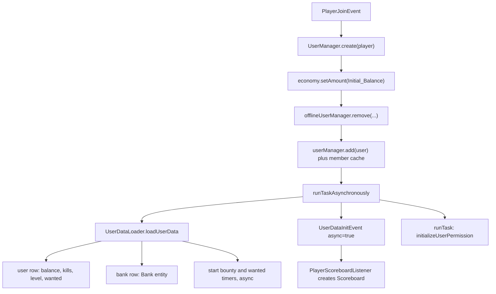
```mermaid
flowchart TD
  A["PlayerJoinEvent"] --> B["UserManager.create(player)"]
  B --> C["economy.setAmount(Initial_Balance)"]
  C --> D["offlineUserManager.remove(...)"]
  D --> E["userManager.add(user) plus member cache"]
  E --> F["runTaskAsynchronously"]
  F --> G["UserDataLoader.loadUserData"]
  G --> H["user row: balance, kills, level, wanted"]
  G --> I["bank row: Bank entity"]
  G --> J["start bounty and wanted timers, async"]
  F --> K["UserDataInitEvent async=true"]
  K --> L["PlayerScoreboardListener creates Scoreboard"]
  F --> M["runTask: initializeUserPermission"]
```

**State & persistence effects:** online `UserManager` gains an entry; `MemberManager` may gain a `Member`; a `user` row may be inserted; two Keystone `Timer`s may start; a `Scoreboard` is created via the init event; a `PermissionAttachment` is attached.

**Edge cases & guards observed:** `player.isOnline()` re-checked before the event and before the permission task; a missing `user` row is only inserted when autosave is off; `Instant.parse` failures return `null` rather than throwing (`UserDataLoader.parseInstant`, lines 62-69); `initializeUserPermission` returns early when the member has no rank.

### W2: Server start / `/glw reload` — bulk player load
**Trigger:** `BeanPostInitialize.onPostInitialize(firstLoad)` after every `BeanLifecycle.onInitialize` has run.

**Steps:**
1. `PlayerBootstrapService.onPostInitialize` (gangland-impl/…/bootstrap/PlayerBootstrapService.java:73) resolves `UserTable`, `BankTable`, `MemberTable`.
2. `loadOnlinePlayers` (line 86): for each `Bukkit.getOnlinePlayers()` not already cached — create the `User`, grant join-time unique items (`isAddOnJoin && isAddToInventory`, skipping duplicates unless `isAllowDuplicates`), `userDataLoader.loadUserData(...)` **synchronously on the main thread**, fire `new UserDataInitEvent(false, newUser)`, `userManager.add`, then either `initializeUserPermission` or create + initialise a new `Member`.
3. `loadOfflinePlayers` (line 132): `userTable.selectAllTableQuery(database)` returns every row; for each, `Bukkit.getOfflinePlayer(uuid)`, skip if online or already cached, create the `User`, hydrate it with another per-row query, and add it to the offline manager.

**Diagram:**
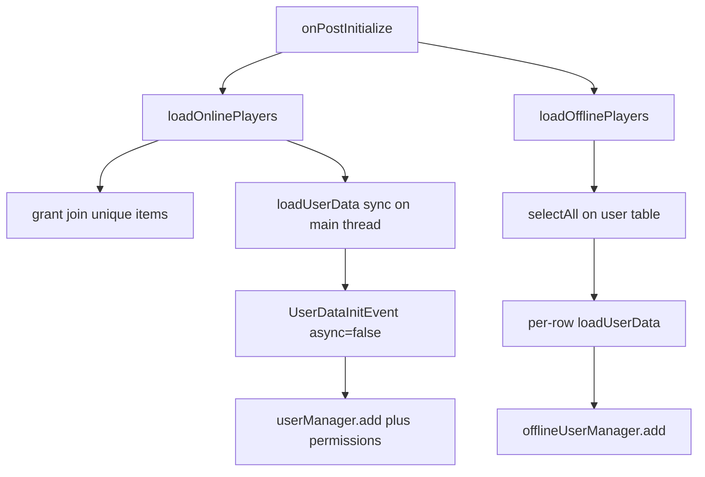
```mermaid
flowchart TD
  A["onPostInitialize"] --> B["loadOnlinePlayers"]
  B --> C["grant join unique items"]
  B --> D["loadUserData sync on main thread"]
  D --> E["UserDataInitEvent async=false"]
  E --> F["userManager.add plus permissions"]
  A --> G["loadOfflinePlayers"]
  G --> H["selectAll on user table"]
  H --> I["per-row loadUserData"]
  I --> J["offlineUserManager.add"]
```

**State & persistence effects:** both caches repopulated; on reload the managers were emptied by `UserManager.onClear()` first, and `onPreClear` stopped every wanted/bounty timer and ended scoreboards (UserManager.java:90-105).

**Edge cases & guards observed:** existing entries are skipped; online players are excluded from the offline pass. `loadOfflinePlayers` performs N+1 queries (one `selectAll` plus two `select`s per user inside `loadUserData`) on the main thread.

### W3: Player quit — save, evict, offline snapshot
**Trigger:** `PlayerQuitEvent` (two handlers on the same listener).

**Steps:**
1. `RemoveAccountListener.onPlayerQuit` (LOWEST, `synchronized`) (gangland-impl/…/listener/player/RemoveAccountListener.java:47): if a cached user exists, schedule an **async** task calling `user.clearInventories()` (which mutates `InventoryRegistry`) and stopping the wanted + bounty timers.
2. `RemoveAccountListener.onPlayerLeave` (HIGHEST) (line 63): stop both timers again, `userManager.remove(user)`.
3. Fetch `UserRepository` and `BankRepository` from `ganglandDatabase.getRepositoryRegistry()`; `userRepository.save(user)` and, when non-null, `bankRepository.save(bank)` (lines 78-87).
4. End the scoreboard if present (lines 89-92).
5. Build the offline snapshot: `offlineUserManager.create(player)` — the argument is the **`Player`**, so the map key is a `CraftPlayer` — then copy kills/deaths/mobKills/gangId/balance/wanted/level/experience/bounty and share the same `Bank` reference (`offlineUser.setBank(user.getBank())`, line 106). `offlineUserManager.add(offlineUser)`.
6. Weapon cleanup: if the main-hand item is a weapon, stop reloading and `unScope(player, true)` (lines 112-118).

**Diagram:**
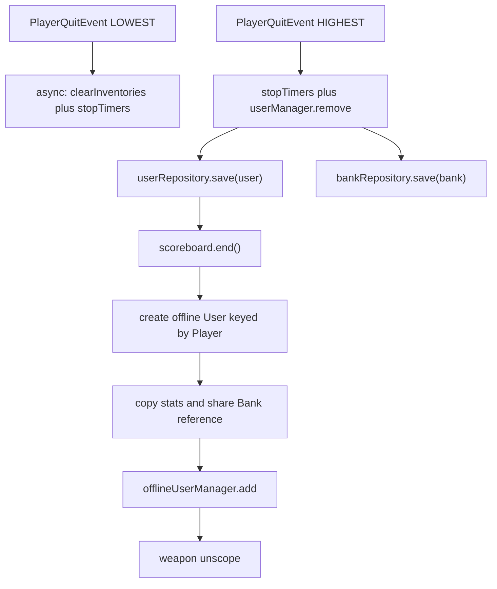
```mermaid
flowchart TD
  A["PlayerQuitEvent LOWEST"] --> B["async: clearInventories plus stopTimers"]
  C["PlayerQuitEvent HIGHEST"] --> D["stopTimers plus userManager.remove"]
  D --> E["userRepository.save(user)"]
  D --> F["bankRepository.save(bank)"]
  E --> G["scoreboard.end()"]
  G --> H["create offline User keyed by Player"]
  H --> I["copy stats and share Bank reference"]
  I --> J["offlineUserManager.add"]
  J --> K["weapon unscope"]
```

**State & persistence effects:** one `user` row and (if present) one `bank` row written; online cache entry removed; offline cache entry added keyed by a now-dead `Player` handle.

**Edge cases & guards observed:** null user short-circuits both handlers; null bank skips the bank save. The LOWEST handler's async body races the HIGHEST handler's synchronous timer stops and cache mutation.

### W4: Periodic autosave / shutdown flush
**Trigger:** `PeriodicalUpdates` scheduled task (`SchedulingConfig`), `/glw reload`, `Gangland.onDisable`.

**Steps:**
1. `PeriodicalUpdates.updatingDatabase(onComplete)` (gangland-impl/…/bootstrap/PeriodicalUpdates.java:94) adjusts plugin scan dates.
2. Resolves `UserTable` / `BankTable`, then `updateAllData(userTable, onlineUsers)` and `updateAllData(bankTable, onlineBanks)` (lines 102-111).
3. Same for the offline cache (lines 113-118), followed by `offlineUserManager.clear()` (line 120).
4. `repositoryRegistry.saveAll(onComplete)` persists every other repository (including `banker`).

**Diagram:**
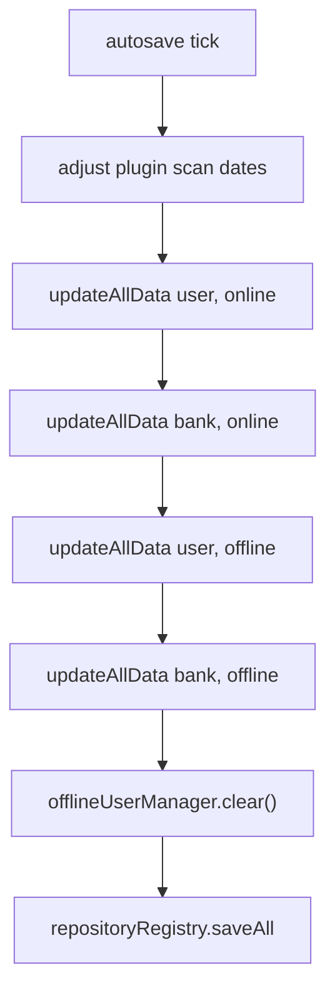
```mermaid
flowchart TD
  A["autosave tick"] --> B["adjust plugin scan dates"]
  B --> C["updateAllData user, online"]
  C --> D["updateAllData bank, online"]
  D --> E["updateAllData user, offline"]
  E --> F["updateAllData bank, offline"]
  F --> G["offlineUserManager.clear()"]
  G --> H["repositoryRegistry.saveAll"]
```

**State & persistence effects:** `user` and `bank` rows rewritten for every cached user; offline cache emptied.

**Edge cases & guards observed:** ordering is online-then-offline, so a stale offline entry for a currently-online player wins the last write for that uuid (Observation #1).

### W5: XP gain and level progression
**Trigger:** `Level.addExperience(x, event)` from `LootChestEarnGoodsListener` (gangland-impl/…/listener/loot/LootChestEarnGoodsListener.java:69-70), `CivilianDeathRewardListener` (gangland-impl/…/listener/npc/CivilianDeathRewardListener.java:42-43) or `/glw level experience add`. These four call sites are the only XP sources in the codebase — kills grant no XP.

**Steps:**
1. `Level.addExperience(double, boolean, event)` (gangland-infra/gangland-domain/…/gang/user/Level.java:37) adds the XP then calls `handleLevelProgression(event)`.
2. `handleLevelProgression` (line 116) computes `experienceCalculation(nextLevel())` and loops while `levelValue < maxLevel && experience >= nextLevelAmount`: subtract the requirement, `Bukkit.getPluginManager().callEvent(event)`, increment `levelValue` when not cancelled. When `event == null` it increments unconditionally.
3. `experienceCalculation(level)` (line 94) builds `{base, max, level, experience}` and evaluates the per-instance `formula` or `GangSettings.getUserLevelFormula()` through Keystone's `ScientificCalculator`.
4. `LevelUpListener.onPlayerLevelUp` (gangland-impl/…/listener/player/LevelUpListener.java:28) resolves the player, formats `Messages.LEVEL_UP_PLAYER` with `%level%` / `%next_level%` / `%max_level%` and sends it through `User.sendMessage` (placeholder-resolved + `ChatUtil.color`).

**Diagram:**
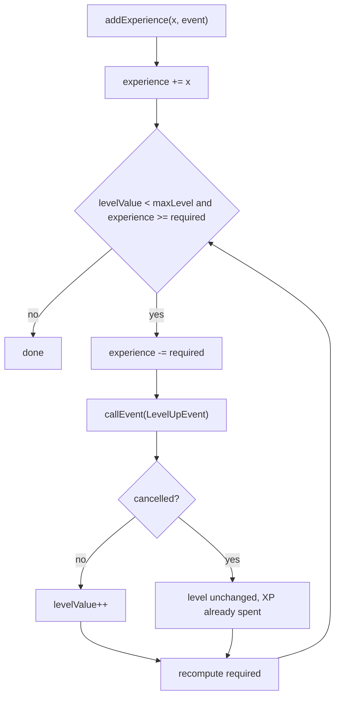
```mermaid
flowchart TD
  A["addExperience(x, event)"] --> B["experience += x"]
  B --> C{"levelValue < maxLevel and experience >= required"}
  C -- no --> Z["done"]
  C -- yes --> D["experience -= required"]
  D --> E["callEvent(LevelUpEvent)"]
  E --> F{"cancelled?"}
  F -- no --> G["levelValue++"]
  F -- yes --> H["level unchanged, XP already spent"]
  G --> I["recompute required"]
  H --> I
  I --> C
```

**State & persistence effects:** in-memory only until the next autosave/quit write of `level` + `experience`.

**Edge cases & guards observed:** progression stops at `maxLevel`; XP never goes negative on the remove path (`Math.max(..., 0)`, line 47). One event instance is reused for the whole loop, so a cancel is sticky; and a cancelled iteration still consumes the XP because line 120 subtracts before the event is fired.

### W6: Admin level / experience commands
**Trigger:** `/glw level add|remove <amount> [player]`, `/glw level experience add|remove <amount> [player]`.

**Steps:**
1. Both trees are chained `OptionalArgument`s: `<amount>` then `[player]` (LevelAddCommand.java:45-68), with the action registered on **both** leaves so the command works with and without the target token.
2. `LevelCommand.resolveTarget(sender, args, idx, userManager)` (LevelCommand.java:48) resolves either `Bukkit.getPlayer(args[idx])` or the sender; emits `PLAYER_NOT_FOUND` / `NOT_PLAYER` and returns `null`. It returns `userManager.getUser(target)`, which is `null` for an online but uncached player.
3. `applyAdd` parses the amount (`Integer.parseInt` for levels, `Double.parseDouble` for XP) and calls `Level.addLevels(n, new UserLevelUpEvent(false, target, level))` or `Level.addExperience(x, event)`.
4. `Level.addLevels` (Level.java:62) loops `levels` times: consumes the requirement when affordable, breaks when `counter >= maxLevel`, fires the event and increments on pass.
5. The confirmation goes to **the target**, not the sender.

**Diagram:**
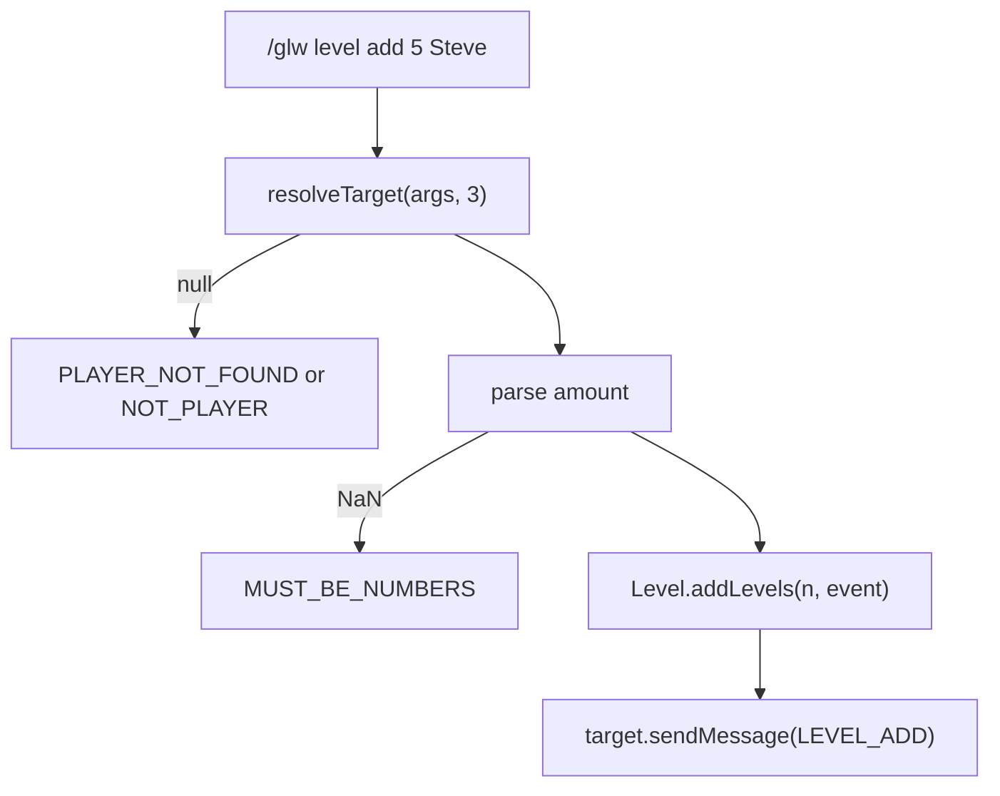
```mermaid
flowchart TD
  A["/glw level add 5 Steve"] --> B["resolveTarget(args, 3)"]
  B -- null --> Z["PLAYER_NOT_FOUND or NOT_PLAYER"]
  B --> C["parse amount"]
  C -- NaN --> Y["MUST_BE_NUMBERS"]
  C --> D["Level.addLevels(n, event)"]
  D --> E["target.sendMessage(LEVEL_ADD)"]
```

**State & persistence effects:** mutates `Level` in memory only.

**Edge cases & guards observed:** negative amounts loop zero times and report `0`. `Level.addLevels` never clamps `levelValue` to `maxLevel` — the break uses `counter`, the iteration count, not the resulting level.

### W7: Cash balance admin operations and the Vault mirror
**Trigger:** `/glw eco deposit|withdraw|set|reset`.

**Steps:**
1. `EconomyCommand.resolveTarget` (EconomyCommand.java:45) mirrors the level resolver.
2. Deposit (`EconomyDepositCommand.applyDeposit`, line 170): `Currency.parse(raw)` → `projected = current + amount` → `newValue = min(projected, Settings.getUserMaxBalance())` → `economy.setAmount(newValue)`; the reported "granted" amount is the delta actually applied.
3. Withdraw: `newValue = max(current - amount, ZERO)`; reports the actual `taken`.
4. Set: `newValue = clamp(amount, ZERO, max)`.
5. Reset: `setAmount(Currency.ZERO)`.
6. All four go through `EconomyHandler.setAmount` (Keystone EconomyHandler.java:58): the local `BigDecimal` is written, then — when Vault is registered (Gangland.java:199) and `useUser` is true — `vaultEconomy.withdrawPlayer(p, currentVaultBalance)` followed by `vaultEconomy.depositPlayer(p, newAmount)`.

**Diagram:**
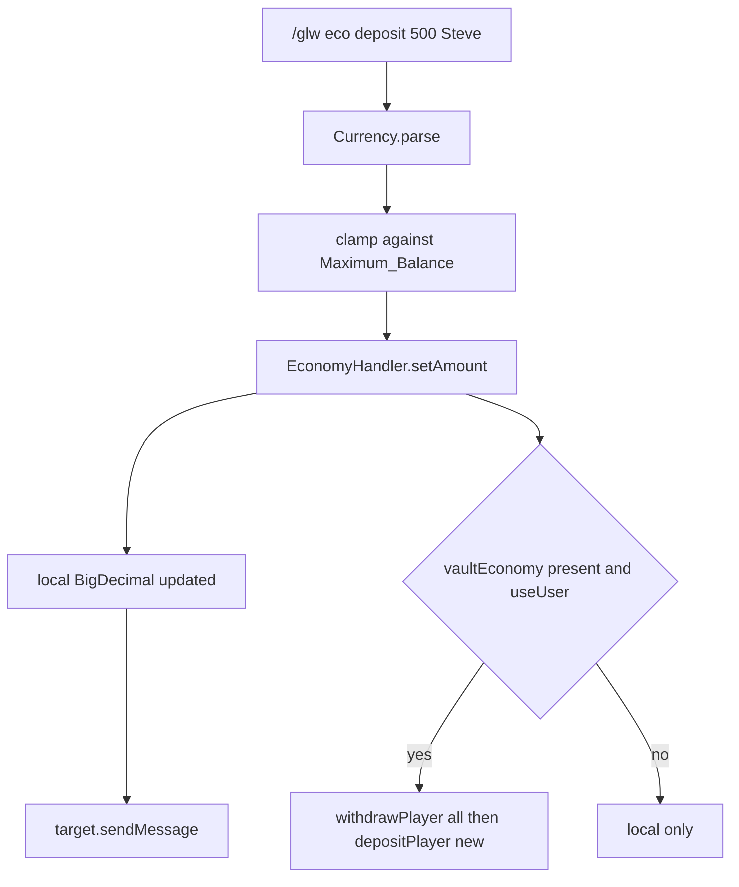
```mermaid
flowchart TD
  A["/glw eco deposit 500 Steve"] --> B["Currency.parse"]
  B --> C["clamp against Maximum_Balance"]
  C --> D["EconomyHandler.setAmount"]
  D --> E["local BigDecimal updated"]
  D --> F{"vaultEconomy present and useUser"}
  F -- yes --> G["withdrawPlayer all then depositPlayer new"]
  F -- no --> H["local only"]
  E --> I["target.sendMessage"]
```

**State & persistence effects:** in-memory balance + Vault balance; persisted at the next autosave/quit.

**Edge cases & guards observed:** `NumberFormatException` is caught and reported; the sender receives no confirmation when acting on another player. `Currency.parse` accepts a leading `-` and none of the four commands rejects it.

### W8: Cash drops on death
**Trigger:** `EntityDeathEvent` / `PlayerDeathEvent` at `EventPriority.MONITOR, ignoreCancelled = true`.

**Steps:**
1. `MoneyDropListener.onEntityDeath` (gangland-infra/gangland-item/…/listener/money/MoneyDropListener.java:41) returns when `!moneyAddon.isEnabled()` or when the event is a `PlayerDeathEvent` (handled by the sibling method at line 52).
2. `classifier.classify(entity)` → `GanglandMoneyDropClassifier` (gangland-impl/…/data/economy/GanglandMoneyDropClassifier.java:22) returns `PLAYER`, `COP` (`copManager.isCopNpc`), `CIVILIAN` (`civilianNpcRegistry.getNpc(uuid) != null`) or `MOB`.
3. `dropForContext` (line 59): look up the `DropSource`; `moneyAddon.rollVariation(context)` does a weighted pick; `rollAmount(variation)` samples `[min, max]`.
4. For player deaths with `Scale_With_Balance`, `bonus = floor(balance * Balance_Fraction)` is added and the total clamped to `variation.getMax()` (lines 68-74).
5. `MoneyItemFactory.build(variation, amount, depositService)` builds the item with NBT `gangland_money`, `gangland_money_variation`, `gangland_money_amount`, resolves `%amount%` and `%gangland_*%` placeholders in name/lore, applies custom model data and an `UNBREAKING` + `HIDE_ENCHANTS` glow.
6. `world.dropItemNaturally(location, item)`.

**Diagram:**
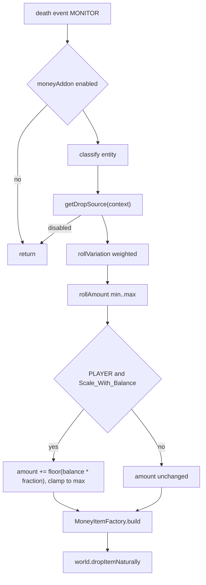
```mermaid
flowchart TD
  A["death event MONITOR"] --> B{"moneyAddon enabled"}
  B -- no --> Z["return"]
  B --> C["classify entity"]
  C --> D["getDropSource(context)"]
  D -- disabled --> Z
  D --> E["rollVariation weighted"]
  E --> F["rollAmount min..max"]
  F --> G{"PLAYER and Scale_With_Balance"}
  G -- yes --> H["amount += floor(balance * fraction), clamp to max"]
  G -- no --> I["amount unchanged"]
  H --> J["MoneyItemFactory.build"]
  I --> J
  J --> K["world.dropItemNaturally"]
```

**State & persistence effects:** spawns an `Item` entity. **No balance is debited from the dead player** — the drop is new currency.

**Edge cases & guards observed:** `amount <= 0` short-circuits; unknown `Drop_Sources` keys are logged and skipped; an invalid `Material` disables that variation with a warning.

### W9: Cash pickup — three paths
**Trigger:** walking over a cash item, right-clicking one, or standing next to one with a full inventory.

**Steps (path A — `EntityPickupItemEvent`):**
1. `MoneyPickupListener.onMoneyPickup` (gangland-infra/gangland-item/…/listener/money/MoneyPickupListener.java:33): guards on `isEnabled`, `instanceof Player`, `MoneyItemUtil.isMoneyItem(stack)`.
2. `perItem = readAmount(stack)`; when `<= 0` the event is cancelled and the item silently removed.
3. `total = perItem * stack.getAmount()` (line 49) — plain `int` arithmetic.
4. `event.setCancelled(true)`, `event.getItem().remove()`, then `depositService.deposit(player, total, variationId)` and the variation's pickup sound.

**Steps (path B — right-click):**
1. `MoneyInteractListener.onMoneyInteract` (…/listener/money/MoneyInteractListener.java:38) deliberately omits `ignoreCancelled` (documented at lines 34-36) so `RIGHT_CLICK_AIR` still arrives; filters `getHand() == EquipmentSlot.HAND` and right-click actions.
2. Reads the NBT amount of the held stack, cancels the event, `consumeOne` (main hand set to null at size 1, otherwise decrement), then deposits `amount` for the single consumed item.

**Steps (path C — proximity fallback):**
1. `MoneyProximityPickupTask` (…/listener/money/MoneyProximityPickupTask.java) runs every 10 ticks, registered in `GameplayConfig.moneyProximityPickupTask` (GameplayConfig.java:288-292) via `task.runTaskTimer(gangland, 10L, 10L)`.
2. Every 5th run it rebuilds `fullInventoryPlayers` from online players that are not spectators, not downed (`DownedPlayerRegistry.isDowned`) and have `firstEmpty() == -1`.
3. For each such player it scans `getNearbyEntities(1.5, 1.5, 1.5)` for valid money `Item`s, removes them and deposits `perItem * stack.getAmount()`.

**Common tail:** `GanglandMoneyDepositService.deposit(Player, BigDecimal, String)` (gangland-impl/…/data/economy/GanglandMoneyDepositService.java:45): reject null/non-positive, look up the online `User`, **return silently when the user is not cached**, `user.getEconomy().depositAmount(...)`, then send `Money.Pickup_Chat_Message` and `Money.Pickup_Action_Bar` through the placeholder pipeline (`ActionBarManager.send` for the bar).

**Diagram:**
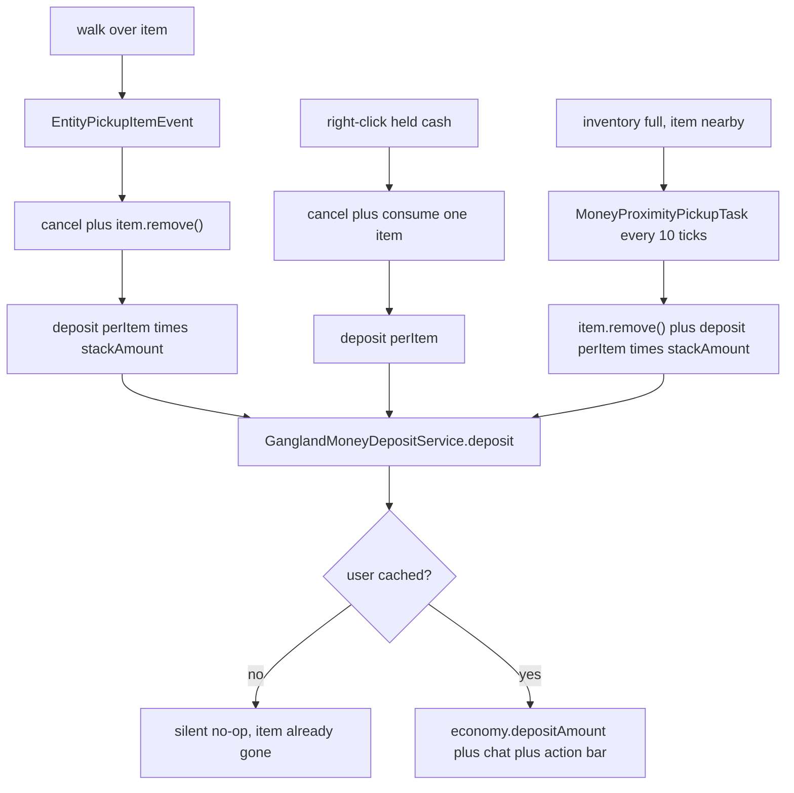
```mermaid
flowchart TD
  A["walk over item"] --> B["EntityPickupItemEvent"]
  B --> C["cancel plus item.remove()"]
  C --> D["deposit perItem times stackAmount"]
  E["right-click held cash"] --> F["cancel plus consume one item"]
  F --> G["deposit perItem"]
  H["inventory full, item nearby"] --> I["MoneyProximityPickupTask every 10 ticks"]
  I --> J["item.remove() plus deposit perItem times stackAmount"]
  D --> K["GanglandMoneyDepositService.deposit"]
  G --> K
  J --> K
  K --> L{"user cached?"}
  L -- no --> M["silent no-op, item already gone"]
  L -- yes --> N["economy.depositAmount plus chat plus action bar"]
```

**State & persistence effects:** cash balance increased (and Vault mirrored); item entity destroyed.

**Edge cases & guards observed:** corrupted tags (amount ≤ 0) are removed without credit in paths A and C, ignored in path B. No `Maximum_Balance` clamp on any of the three paths.

### W10: Bank account creation via `/glw bank create`
**Trigger:** `/glw bank create <name>` then `/glw bank create confirm`.

**Steps:**
1. `BankCreateCommand.bankCreate()` (gangland-impl/…/command/sub/bank/BankCreateCommand.java:64) builds a `ConfirmArgument` plus an `OptionalArgument` name node, and keeps two per-command maps: `HashMap<User<Player>, AtomicReference<String>> createBankName` and `HashMap<CommandSender, CountdownTimer> createBankTimer`.
2. Name step: reject when the user already has a bank (`BANK_EXIST`), reject when the confirm argument is already locked, stash the name, send `BANK_CREATE_FEE` plus a clickable confirm, then `confirmCreate.lock(sender, …)` starting a 60-second `CountdownTimer` that messages every 20 ticks and, on expiry, unlocks and drops the stashed name.
3. Confirm step: re-check `hasBank`, compare cash against `Settings.getBankCreateFee()` (`CANNOT_CREATE_BANK` when short), construct `new Bank(uuid, name)`, call `bank.getEconomy().setUser(user)` (a no-op — the bank's handler was built with `useUser = false`, Bank.java:42), withdraw the fee inside a `try` that swallows `EconomyException`, set the bank balance to `Settings.getBankInitialBalance()`, `user.setBank(bank)`, message `BANK_CREATED`, clean up the maps and cancel the timer.

**Diagram:**
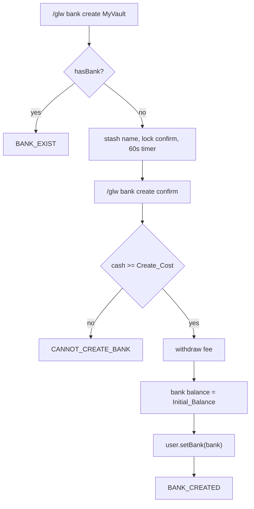
```mermaid
flowchart TD
  A["/glw bank create MyVault"] --> B{"hasBank?"}
  B -- yes --> Z["BANK_EXIST"]
  B -- no --> C["stash name, lock confirm, 60s timer"]
  C --> D["/glw bank create confirm"]
  D --> E{"cash >= Create_Cost"}
  E -- no --> Y["CANNOT_CREATE_BANK"]
  E -- yes --> F["withdraw fee"]
  F --> G["bank balance = Initial_Balance"]
  G --> H["user.setBank(bank)"]
  H --> I["BANK_CREATED"]
```

**State & persistence effects:** a `Bank` is attached to the in-memory `User`. **No `tierId`, no `lastInterestAt`, and no repository save** — unlike the banker-NPC path (W17). Persistence waits for the next autosave or quit.

**Edge cases & guards observed:** duplicate creation blocked at both steps; blank/duplicate names are not validated; the timer removes the stashed name on expiry, but a player who quits between the two steps leaves both map entries alive until the timer ends.

### W11: `/glw bank deposit` and `/glw bank withdraw`
**Trigger:** chat commands.

**Steps (deposit, self):**
1. `BankDepositCommand.bankDeposit()` (gangland-impl/…/command/sub/bank/BankDepositCommand.java:74) requires a cached user and a bank (`MUST_CREATE_BANK`), parses `args[2]` with `Currency.parse`.
2. Computes `inBank = bankBalance + amount`, resolves the tier (`tierRegistry.get(tierId)` else `first()`), rejects with `CANNOT_EXCEED_MAXIMUM` when `inBank > tier.maxBalance()`.
3. Unless the player has `gangland.bank.bypass_cap`: `bank.resetIfStale(now, Duration.ofSeconds(Settings.getBankResetPeriodSeconds()))`, then reject with `BANKER_DAILY_DEPOSIT_REACHED` when `depositedToday + amount > tier.dailyDepositLimit()` (only when the limit is positive).
4. `BankCommand.processMoney(user, bank, cashBal, amount, inBank, cashBal - amount)` (BankCommand.java:61): rejects when `check.signum() == 0` (`CANNOT_TAKE_LESS_THAN_ZERO`) or `amount > check` (`CANNOT_TAKE_MORE_THAN_BALANCE`); otherwise assigns both balances with `setAmount`.
5. `bank.recordDeposit(amount.doubleValue())` unless bypassing, `bankRepository.save(bank)` immediately, then `BANK_MONEY_DEPOSIT_PLAYER`.

**Steps (withdraw, self):** `BankWithdrawCommand.bankWithdraw()` (line 67) mirrors the above with `check = bankBalance`, `inBank = bankBalance - amount`, `inAccount = cash + amount`; no cap or tier check at all; saves the bank.

**Steps (target forms):** `bankDepositTarget` (BankDepositCommand.java:161) and `bankWithdrawTarget` (BankWithdrawCommand.java:134) resolve `args[3]` to an online player, then add/subtract on that player's bank with **no fee, no cap check, and nothing debited from the sender**. The withdraw variant floors at zero and reports the actual amount taken.

**Diagram:**
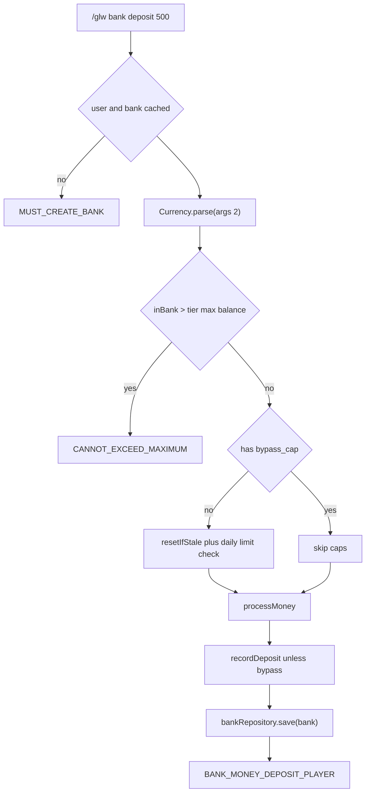
```mermaid
flowchart TD
  A["/glw bank deposit 500"] --> B{"user and bank cached"}
  B -- no --> Z["MUST_CREATE_BANK"]
  B --> C["Currency.parse(args 2)"]
  C --> D{"inBank > tier max balance"}
  D -- yes --> Y["CANNOT_EXCEED_MAXIMUM"]
  D -- no --> E{"has bypass_cap"}
  E -- no --> F["resetIfStale plus daily limit check"]
  E -- yes --> G["skip caps"]
  F --> H["processMoney"]
  G --> H
  H --> I["recordDeposit unless bypass"]
  I --> J["bankRepository.save(bank)"]
  J --> K["BANK_MONEY_DEPOSIT_PLAYER"]
```

**State & persistence effects:** cash and bank balances mutated in memory; the `bank` row written synchronously; the `user` row is *not* written here.

**Edge cases & guards observed:** the tab-completer uses `NumberUtil.getSetOfNumbers(balance)` and returns `null` when the caller has no bank. `processMoney` treats a zero *check* value (empty source) as the "less than zero" error, and never validates the sign of `amount`.

### W12: `/glw bank resetcap`
**Trigger:** `/glw bank resetcap <player|all>`.

**Steps:**
1. `BankResetCapCommand.playerArgument()` (gangland-impl/…/command/sub/bank/BankResetCapCommand.java:48). For `all`: `repo.loadAll()`, `resetCounters(bank)` (`depositedToday = 0`, `capResetAt = null`) and `repo.save(bank)` per row, counting rows; then the same reset applied to every online player's in-memory `Bank`.
2. For a single player: `Bukkit.getPlayerExact`, cached user + bank required, `resetAndSave(bank)`.

**Diagram:**
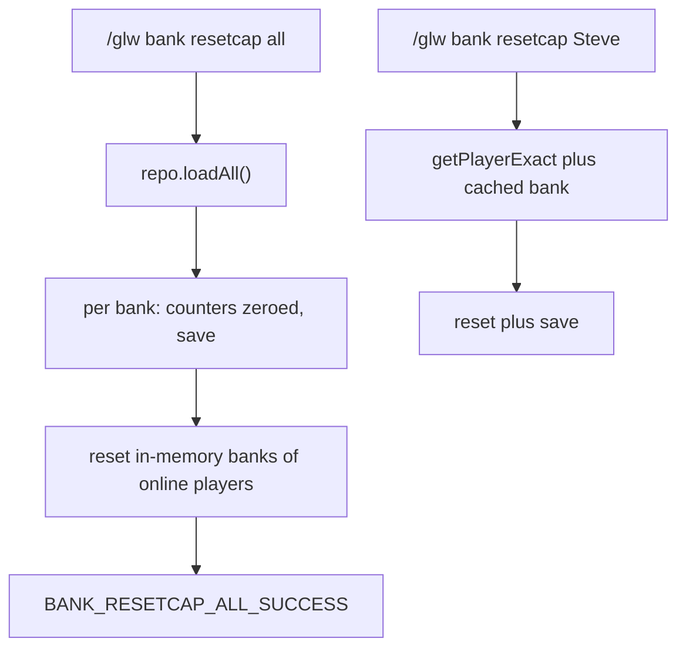
```mermaid
flowchart TD
  A["/glw bank resetcap all"] --> B["repo.loadAll()"]
  B --> C["per bank: counters zeroed, save"]
  C --> D["reset in-memory banks of online players"]
  D --> E["BANK_RESETCAP_ALL_SUCCESS"]
  F["/glw bank resetcap Steve"] --> G["getPlayerExact plus cached bank"]
  G --> H["reset plus save"]
```

**State & persistence effects:** `deposited_today` / `cap_reset_at` cleared in DB and memory. With `capResetAt == null`, the next `resetIfStale` immediately re-arms the window (Bank.java:51-56).

**Edge cases & guards observed:** offline players are only reachable through the `all` form; the in-memory reset for online players is not persisted directly and relies on the next autosave, so the DB and memory are briefly written by two separate paths.

### W13: Banker NPC lifecycle
**Trigger:** `/glw banker create`, `/glw banker remove`, `/glw banker edit name`, plugin start, `/glw reload`, shutdown.

**Steps:**
1. `BankerManager.onInitialize` (gangland-features/cops-n-crooks/…/npc/banker/BankerManager.java:52) schedules `spawnAllFromRepository` 40 ticks later and starts two repeating tasks: head-track every 2 ticks, position-reset every 20 ticks.
2. `spawnAllFromRepository` iterates `repository.loadAll()` and calls `spawn(data)`, which skips ids already alive and otherwise calls `BankerNpc.spawn`.
3. `BankerNpc.spawn` (…/BankerNpc.java:28) creates a Citizens `EntityType.PLAYER` NPC, sets `NPC.Metadata.SHOULD_SAVE = false`, stores `gangland.banker.id`, applies `setProtected(invulnerable)`, spawns at the stored location, then sets `invulnerable`, disables gravity and applies `Attribute.MAX_HEALTH` (line 45).
4. `create(data)` (line 84) saves the row first, then spawns. `remove(id)` (line 89) removes from the map, `destroy()`s the NPC, then `repository.loadAll()` → filter → `repository.delete(...)`. `rename(id, name)` mutates the data, renames the Citizens NPC and saves.
5. `tickHeadTrack` finds the closest player within `Head_Track_Radius` and calls `npc.faceLocation`. `tickPositionReset` teleports the NPC back when it drifts more than 0.25 blocks² from its spawn.
6. `onPreClear` stops the tasks and despawns; `onClear` empties the map; `onShutdown` does both.
7. `BankerDamageListener` cancels `EntityDamageEvent` for bankers while `Invulnerable: true`; `BankerInteractListener` opens `BankerFlow.start(player, banker)` on `NPCRightClickEvent`.

**Diagram:**
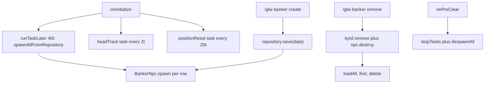
```mermaid
flowchart TD
  A["onInitialize"] --> B["runTaskLater 40t: spawnAllFromRepository"]
  A --> C["headTrack task every 2t"]
  A --> D["positionReset task every 20t"]
  B --> E["BankerNpc.spawn per row"]
  F["/glw banker create"] --> G["repository.save(data)"]
  G --> E
  H["/glw banker remove"] --> I["byId.remove plus npc.destroy"]
  I --> J["loadAll, find, delete"]
  K["onPreClear"] --> L["stopTasks plus despawnAll"]
```

**State & persistence effects:** `banker` rows; live Citizens NPCs; two repeating Bukkit tasks.

**Edge cases & guards observed:** `getByEntity` requires the Citizens metadata key and catches a malformed UUID; `despawnAll` wraps each destroy in try/catch and logs; `spawn` returns the existing NPC when one is already alive for that id.

### W14: Banker GUI — menu, amount picker, deposit/withdraw
**Trigger:** right-clicking a banker NPC, or `/glw bank menu` (phone banking, no NPC).

**Steps:**
1. `BankerFlow.startInternal` (gangland-features/cops-n-crooks/…/npc/banker/view/BankerFlow.java:37) creates a `BankerFlowSession` (holding the optional `BankerNpc`), builds a `MultiPanelInventory`, registers the five panels and opens `PANEL_MENU`.
2. `BankerMenuView.render` (…/view/BankerMenuView.java:79) calls `economy.snapshot(viewer)` on **every** render. `GanglandBankerEconomy.snapshot` (gangland-impl/…/GanglandBankerEconomy.java:58) resolves the user and, when a bank exists, runs `maintain(bank)` (W18) before building the `BankerSnapshot` (cash, bank balance, remaining daily deposit, daily limit, interest rate, cap reset instant, current + next tier).
3. No account → `renderNoAccount` shows the fee / initial-balance info and an "OPEN ACCOUNT" button gated on the pre-computed `canAfford`, switching to `PANEL_CREATE`.
4. Account → deposit / withdraw / upgrade (or a "Max Tier" barrier) / rename / rewards buttons. Deposit and withdraw set `session.amountMode`, clear `amountStaged` and `amountStepIndex`, then `host.switchTo(PANEL_AMOUNT)`.
5. `BankerAmountView.render` (…/view/BankerAmountView.java:92) recomputes `max` — for deposit `min(cash, remainingDailyDeposit, tierCap - bankBalance)`, for withdraw `bankBalance` — renders a stub when it is ≤ 0, and clamps the staged amount to `[0, max]`.
6. Adjust buttons: four green slots add `step × 1..4`, four red slots subtract `step × 4..1` (mirrored outward), all clamped in `adjust(...)`. The step ladder cycles 1 … 10,000,000.
7. The yellow slot opens an AnvilGUI: `host.suspend()`, parse with `Currency.parse`, reject negatives, clamp to `max` with an "amount capped" notice, close; `onClose` does `runTask` → `host.resume()` + `switchTo(PANEL_AMOUNT)`.
8. CONFIRM calls `economy.tryDeposit` / `tryWithdraw`; the `Result` maps to a `BankerMessageContract` line plus a sound. On `SUCCESS` the staged state is reset and `host.back()`; otherwise `host.rerender()`.
9. `GanglandBankerEconomy.tryDeposit` (line 121): reject null/non-positive; require user + bank; `maintain(bank)`; `INSUFFICIENT_CASH` when cash < amount; daily-cap check unless `bypass`; `CAP_EXCEEDED` when `bankBalance + amount > tier.maxBalance()`; `cash.withdrawAmount` in a try (`ECONOMY_ERROR` on failure); `bank.getEconomy().depositAmount`; `recordDeposit` unless bypassing; `bankRepository.save(bank)`.
10. `tryWithdraw` (line 162): `maintain`, `INSUFFICIENT_BANK_FUNDS` check, `bank.withdrawAmount`, `user.getEconomy().depositAmount`, save.

**Diagram:**
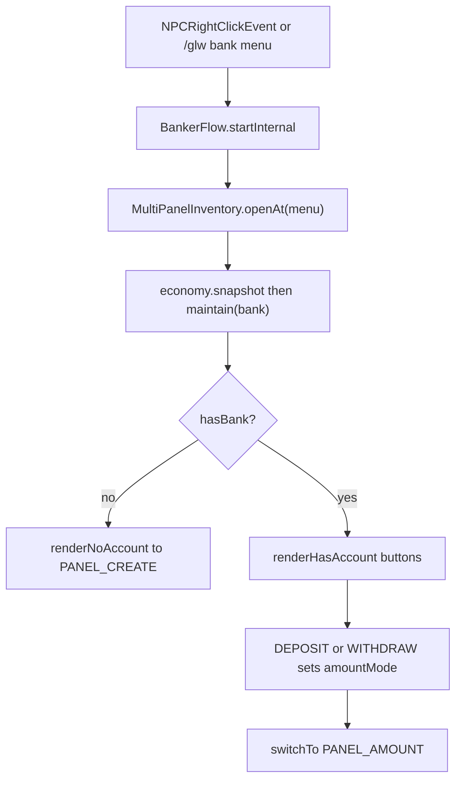
```mermaid
flowchart TD
  A["NPCRightClickEvent or /glw bank menu"] --> B["BankerFlow.startInternal"]
  B --> C["MultiPanelInventory.openAt(menu)"]
  C --> D["economy.snapshot then maintain(bank)"]
  D --> E{"hasBank?"}
  E -- no --> F["renderNoAccount to PANEL_CREATE"]
  E -- yes --> G["renderHasAccount buttons"]
  G --> H["DEPOSIT or WITHDRAW sets amountMode"]
  H --> I["switchTo PANEL_AMOUNT"]
```

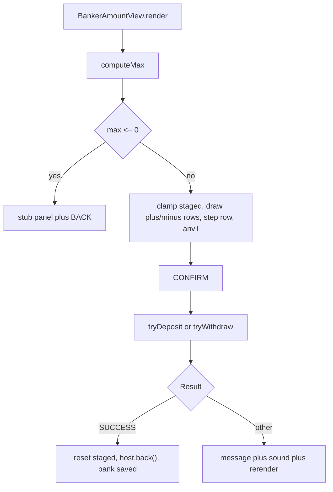
```mermaid
flowchart TD
  A["BankerAmountView.render"] --> B["computeMax"]
  B --> C{"max <= 0"}
  C -- yes --> D["stub panel plus BACK"]
  C -- no --> E["clamp staged, draw plus/minus rows, step row, anvil"]
  E --> F["CONFIRM"]
  F --> G["tryDeposit or tryWithdraw"]
  G --> H{"Result"}
  H -- SUCCESS --> I["reset staged, host.back(), bank saved"]
  H -- other --> J["message plus sound plus rerender"]
```

**State & persistence effects:** cash and bank balances mutated; `bank` row saved on every successful transaction; the `user` row (cash) is not.

**Edge cases & guards observed:** every mutator re-validates against live state rather than trusting the staged `max`; sounds are deferred one tick via `runTask`; the anvil detour survives because the staged amount lives on the flow session, not the inventory handle.

### W15: Bank tier upgrade
**Trigger:** UPGRADE button on the banker menu → `PANEL_UPGRADE` → confirm.

**Steps:**
1. `BankerUpgradeView` confirm → `economy.tryUpgrade(viewer)` (BankerUpgradeView.java:136).
2. `GanglandBankerEconomy.tryUpgrade` (line 188): require user + bank; `maintain(bank)` returns the current tier; `tierRegistry.next(currentId)` returns the tier with the smallest `order` strictly greater than the current, or the first tier when the current id is `null` (BankTierRegistry.java:40-55). `ALREADY_MAX_TIER` when null.
3. `INSUFFICIENT_BANK_FUNDS` when `bankBalance < next.upgradeCost()` — the cost comes out of the **bank** balance, not cash.
4. Withdraw the cost (when positive), `bank.setTierId(next.id())`, `bankRepository.save(bank)`.
5. Result mapped to `BANKER_UPGRADE_SUCCESS` / `BANKER_UPGRADE_MAX_TIER` / `BANKER_UPGRADE_INSUFFICIENT_FUNDS` / `BANKER_NO_ACCOUNT` / `BANKER_TIER_MISSING`; `host.back()` on success.

**Diagram:**
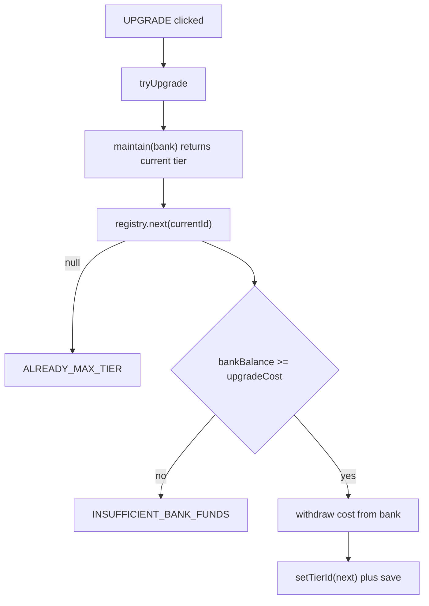
```mermaid
flowchart TD
  A["UPGRADE clicked"] --> B["tryUpgrade"]
  B --> C["maintain(bank) returns current tier"]
  C --> D["registry.next(currentId)"]
  D -- null --> E["ALREADY_MAX_TIER"]
  D --> F{"bankBalance >= upgradeCost"}
  F -- no --> G["INSUFFICIENT_BANK_FUNDS"]
  F -- yes --> H["withdraw cost from bank"]
  H --> I["setTierId(next) plus save"]
```

**State & persistence effects:** `tier_id` and `balance` written to the `bank` row.

**Edge cases & guards observed:** no downgrade path exists, and no check that the current balance fits the new tier (upgrades always raise the cap in the shipped file).

### W16: Weekly / monthly loan claims
**Trigger:** REWARDS button → `PANEL_CLAIM` → weekly or monthly claim.

**Steps:**
1. `BankerClaimView` renders from `economy.claimInfo(viewer)` (GanglandBankerEconomy.java:279): amounts from the resolved tier, `readyAt = lastClaimAt + window` (`null` = never claimed = ready now).
2. Claim → `tryClaimWeekly` / `tryClaimMonthly` → `tryClaim(player, kind)` (line 303): require user + bank; `maintain(bank)` (`TIER_MISSING` when no tier resolves); `LOAN_DISABLED` when the tier amount is ≤ 0; `LOAN_ON_COOLDOWN` when `now < lastClaim + window` (7 or 30 days).
3. `LOAN_CAP_FULL` when `bankBalance + amount > tier.maxBalance()` — the cooldown is deliberately left untouched.
4. Otherwise `bank.getEconomy().depositAmount(amount)`, stamp `lastWeeklyLoanAt` / `lastMonthlyLoanAt` with `now`, `bankRepository.save(bank)`.
5. The view always re-renders after a claim attempt.

**Diagram:**
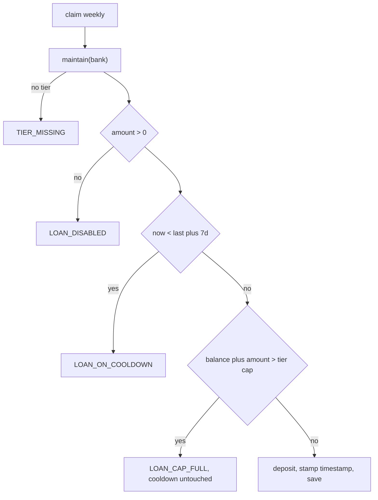
```mermaid
flowchart TD
  A["claim weekly"] --> B["maintain(bank)"]
  B -- no tier --> C["TIER_MISSING"]
  B --> D{"amount > 0"}
  D -- no --> E["LOAN_DISABLED"]
  D --> F{"now < last plus 7d"}
  F -- yes --> G["LOAN_ON_COOLDOWN"]
  F -- no --> H{"balance plus amount > tier cap"}
  H -- yes --> I["LOAN_CAP_FULL, cooldown untouched"]
  H -- no --> J["deposit, stamp timestamp, save"]
```

**State & persistence effects:** bank balance and the corresponding loan timestamp persisted.

**Edge cases & guards observed:** loans are pure currency creation by design; timestamps are per-account, so switching tiers does not reset a cooldown.

### W17: Account creation / rename through the banker anvil
**Trigger:** "OPEN ACCOUNT" (`PANEL_CREATE` → confirm → anvil) or "RENAME ACCOUNT" (anvil directly from the menu).

**Steps (create):**
1. `BankerCreateAccountView` suspends the flow and opens an anvil (BankerCreateAccountView.java:120).
2. On output click → `economy.tryCreateAccount(viewer, text)` → `GanglandBankerEconomy.tryCreateAccount` (line 216): `NAME_EMPTY` on blank; `ALREADY_HAS_ACCOUNT`; `CANNOT_AFFORD_CREATION` when cash < `Create_Cost`; build the `Bank`, withdraw the fee, set the balance to `Initial_Balance`, assign `tierRegistry.first().id()`, anchor `lastInterestAt = Instant.now()`, `user.setBank(bank)`, `bankRepository.save(bank)`.
3. `onClose` → `runTask` → `host.resume()` + `switchTo(PANEL_MENU)` regardless of outcome.

**Steps (rename):** `BankerRenameAccountView.open` suspends and opens an anvil (line 51); `tryRenameAccount` (GanglandBankerEconomy.java:250) requires a bank, runs `maintain`, rejects `NAME_UNCHANGED` on an identical trimmed name, charges `Rename_Fee` from cash (`CANNOT_AFFORD_RENAME`), sets the name and saves. The view keeps the anvil open on `NAME_EMPTY` / `NAME_UNCHANGED` and closes otherwise (lines 75-87).

**Diagram:**
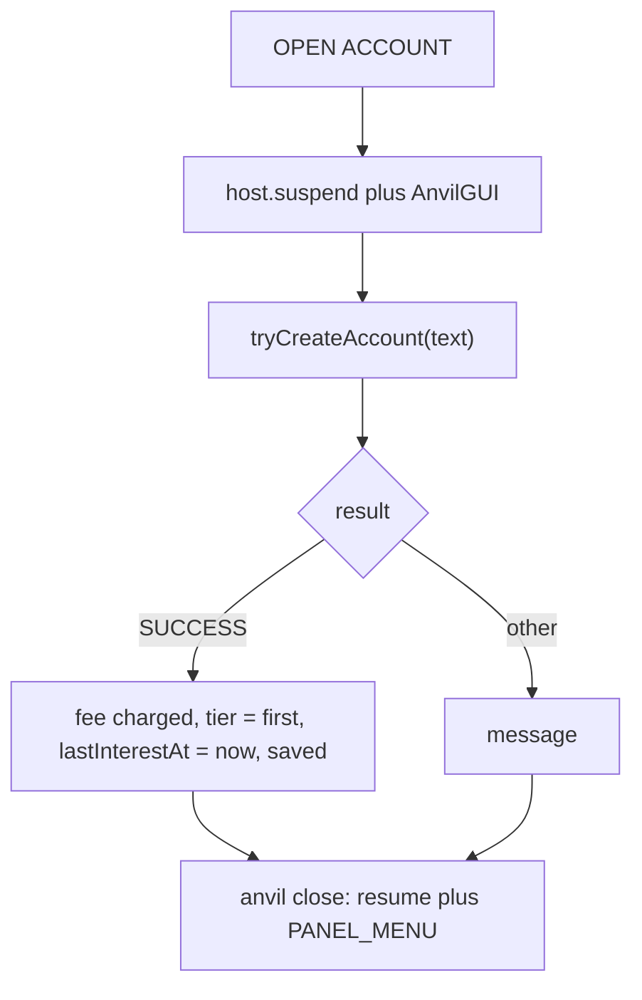
```mermaid
flowchart TD
  A["OPEN ACCOUNT"] --> B["host.suspend plus AnvilGUI"]
  B --> C["tryCreateAccount(text)"]
  C --> D{"result"}
  D -- SUCCESS --> E["fee charged, tier = first, lastInterestAt = now, saved"]
  D -- other --> F["message"]
  E --> G["anvil close: resume plus PANEL_MENU"]
  F --> G
```

**State & persistence effects:** a fully-initialised `Bank` row is written immediately — unlike the chat-command path (W10).

**Edge cases & guards observed:** blank names rejected; the fee withdraw is wrapped and maps to `ECONOMY_ERROR`; the flow always returns to the menu on anvil close.

### W18: Bank maintenance — rolling deposit window and interest
**Trigger:** any `GanglandBankerEconomy` entry point (`snapshot`, `tryDeposit`, `tryWithdraw`, `tryUpgrade`, `tryRenameAccount`, `tryClaim`), plus `bank.resetIfStale` called directly from `/glw bank deposit`.

**Steps:**
1. `maintain(bank)` (GanglandBankerEconomy.java:342): `bank.resetIfStale(Instant.now(), Duration.ofSeconds(settings.getResetPeriodSeconds()))` — when `capResetAt` is null or in the past, `depositedToday = 0` and `capResetAt = now + window` (Bank.java:51).
2. `resolveTier(bank)` (line 353): stored `tierId`, else `Banker.Fallback_Tier_Id`, else the first tier in the ladder.
3. `bank.accrueInterest(Instant.now(), tier.interestRate(), tier.maxBalance().doubleValue())` (Bank.java:67): the first call (or `lastInterestAt == null`) only anchors the clock; a non-positive rate anchors and returns 0; otherwise `interest = balance * ratePerDay * elapsedDays`, clamped so the post-credit balance does not exceed the cap, credited via `economy.depositAmount`, and `lastInterestAt = now`.

**Diagram:**
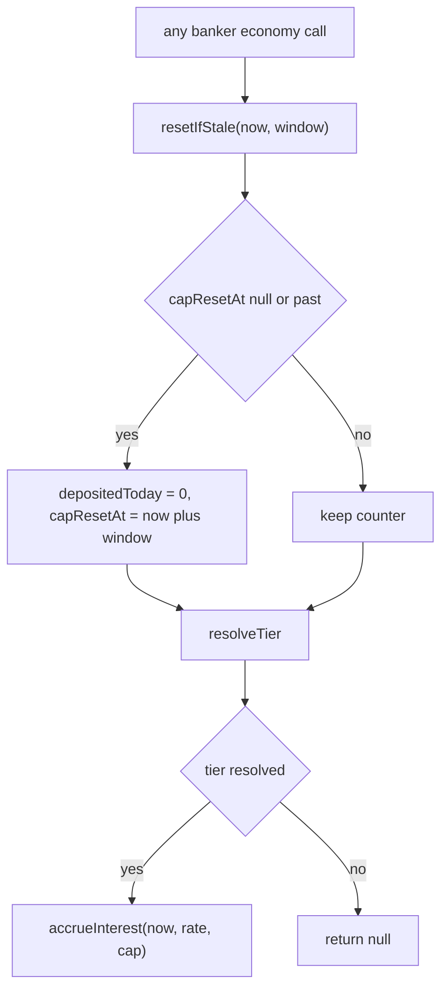
```mermaid
flowchart TD
  A["any banker economy call"] --> B["resetIfStale(now, window)"]
  B --> C{"capResetAt null or past"}
  C -- yes --> D["depositedToday = 0, capResetAt = now plus window"]
  C -- no --> E["keep counter"]
  D --> F["resolveTier"]
  E --> F
  F --> G{"tier resolved"}
  G -- yes --> H["accrueInterest(now, rate, cap)"]
  G -- no --> I["return null"]
```

**State & persistence effects:** mutates `depositedToday`, `capResetAt`, `balance` and `lastInterestAt` in memory. `snapshot()` does **not** save, so interest accrued by merely opening the menu is persisted only by a later transaction or autosave.

**Edge cases & guards observed:** `elapsedMs <= 0` returns 0 without re-anchoring; the cap clamp uses `Math.max(0, cap - balance)`; `maintain` calls `Instant.now()` twice, so the reset and interest instants differ slightly.

### W19: Death economy penalty and bank insurance
**Trigger:** `PlayerDeathEvent` (LOWEST) or `PlayerDownedEvent` (LOWEST).

**Steps:**
1. `PlayerDeathListener.onPlayerDeath` (gangland-impl/…/listener/player/PlayerDeathListener.java:60) suppresses Citizens NPC deaths, then applies a `DEATH_DEDUP_WINDOW_MS` guard keyed on the UUID in a `ConcurrentHashMap` (lines 70-80).
2. `user.setDeaths(deaths + 1)`.
3. `handleCommandExecution` (line 123): returns `true` (skipping the money path) when `balance <= Settings.getDeathThreshold()`; when `Death.Money.Command.Enable` is true it dispatches each configured executable from the console with placeholders resolved and returns `true`.
4. `handleMoney` (line 139): `amountDeduction(user)` evaluates `Death.Money.Formula` with `{balance, level, experience, bounty, wanted}` through `ScientificCalculator` (line 245). Zero → return.
5. Bank insurance: `bankInsuranceDiscount(user)` (line 170) resolves the tier for the player's bank (falling back to `tierRegistry.first()`) and returns `deathLossDiscount()`; `deduct *= (1 - discount)`.
6. `Settings.isDeathLoseMoney()` decides `economy.withdrawAmount(Currency.of(deduct))` (line 157) versus `economy.depositAmount(...)` (line 160), then a `&3Death penalty: ±$X` message.
7. `changeDeathMessage` sets a weapon-aware death message (suppressed when the killer is a Citizens NPC).

**Diagram:**
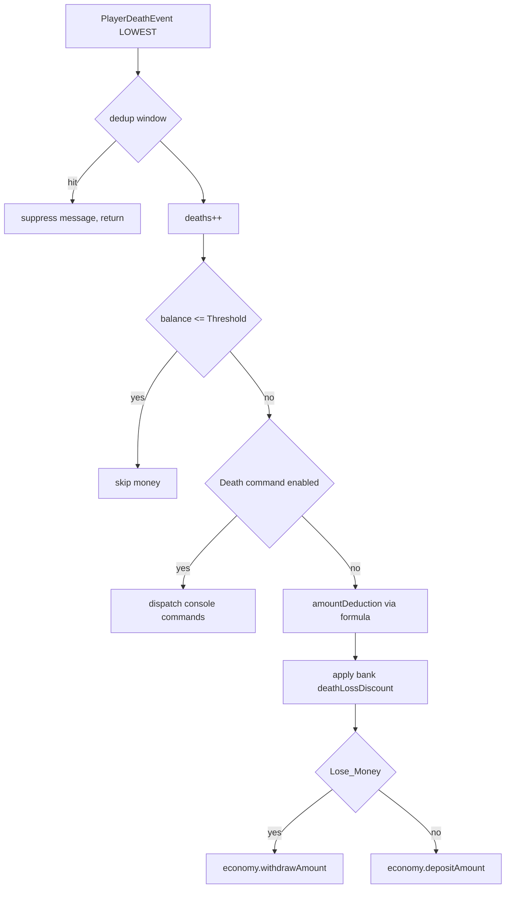
```mermaid
flowchart TD
  A["PlayerDeathEvent LOWEST"] --> B{"dedup window"}
  B -- hit --> Z["suppress message, return"]
  B --> C["deaths++"]
  C --> D{"balance <= Threshold"}
  D -- yes --> E["skip money"]
  D -- no --> F{"Death command enabled"}
  F -- yes --> G["dispatch console commands"]
  F -- no --> H["amountDeduction via formula"]
  H --> I["apply bank deathLossDiscount"]
  I --> J{"Lose_Money"}
  J -- yes --> K["economy.withdrawAmount"]
  J -- no --> L["economy.depositAmount"]
```

**State & persistence effects:** deaths counter and cash balance mutated; `MoneyDropListener` independently spawns cash items at MONITOR for the same death (W8).

**Edge cases & guards observed:** the threshold check protects poor players; the discount is clamped with `Math.max(0, 1 - discount)` and a resulting `deduct <= 0` returns early. `withdrawAmount` is **not** wrapped in a try/catch even though it throws the unchecked `EconomyException` when the amount exceeds the balance.

### W20: Bounty payout on a player kill
**Trigger:** `EntityDamageByEntityEvent` (HIGH, ignoreCancelled) that results in a player death.

**Steps:**
1. `EntityDamageListener.onPlayerEntityDeath` (gangland-impl/…/listener/player/EntityDamageListener.java:67) resolves the damager's and victim's `User`s.
2. `damagerUser.setKills(kills + 1)` (line 126).
3. If the victim has a bounty: `damagerUser.getEconomy().depositAmount(bounty.getAmount())`, `bounty.resetBounty()`, and a message built from `Messages.BANK_MONEY_DEPOSIT_PLAYER` (lines 129-140). Kill combo reset when enabled.
4. Otherwise `handleBounty(damagerUser)` (line 259) scales `Bounty_Each_Kill` by the killer's level, starts a `BountyExecutor` timer when under `Bounty_Timer_Max`, and raises the killer's own bounty up to `Bounty_Max_Kill`.
5. Wanted level handling and kill combos follow (lines 148-253).

**Diagram:**
```mermaid
flowchart TD
  A["player kill"] --> B["killer kills++"]
  B --> C{"victim has bounty"}
  C -- yes --> D["killer economy.depositAmount(bounty)"]
  D --> E["bounty.resetBounty plus combo reset"]
  C -- no --> F["handleBounty raises killer bounty"]
  F --> G["BountyExecutor timer started async"]
```

**State & persistence effects:** killer cash balance and kills; victim bounty cleared; killer bounty raised.

**Edge cases & guards observed:** the payout ignores `User.Account.Maximum_Balance`; the message key is a bank-deposit string.

### W21: Phone banking, placeholders and stat GUIs
**Trigger:** opening `phone_banking.yml` from the phone, or any placeholder-bearing text.

**Steps:**
1. `GanglandPlaceholder.getBank` (gangland-impl/…/data/placeholder/worker/GanglandPlaceholder.java:225) returns `null` when the user has no bank, so every `%gangland_bank_*%` is unresolved for account-less players; `%gangland_user_has-bank%` (line 193) drives the `Condition` blocks in the YAML.
2. Supported bank keys (lines 230-271): `name`, `balance`, `tier`, `tier_display`, `tier_cap`, `daily_deposit_limit`, `deposited_today`, `remaining_deposit`, `next_reset`, `interest_rate`, `weekly_amount`, `monthly_amount`, `weekly_ready_in`, `monthly_ready_in`. Tier resolution falls back to `tierRegistry.first()` but **not** to `Banker.Fallback_Tier_Id` (lines 233-234).
3. Level keys come from `getLevelPlaceholder` (line 323): `level`, `level-max`, `level-next`, `level-previous`; user keys include `balance` (line 192) and `wanted-level` (line 207).
4. `/glw bank menu` → `BankMenuCommand` → `BankerFlow.startFromPhone(player)`; the session's `displayName()` returns "Online Banking" when no NPC is present (BankerFlowSession.java:42-44).
5. `LevelCommand.onExecute` renders the `Level.Stats` block plus a 20-character bar built from `Level.Meter.Bar` / `Complete_Color` / `Incomplete_Color`.

**Diagram:**
```mermaid
flowchart TD
  A["phone_banking.yml render"] --> B["gangland_user_has-bank"]
  B -- true --> C["bank placeholders from live Bank"]
  B -- false --> D["no-account lore"]
  C --> E["Deposit and Withdraw buttons"]
  E --> F["/glw bank menu to BankerFlow.startFromPhone"]
```

**State & persistence effects:** read-only, except that opening the full banker flow triggers `maintain` (W18).

**Edge cases & guards observed:** placeholders read raw fields and never run `maintain`, so `deposited_today` / `next_reset` / interest shown on the phone can lag the values the banker GUI computes.

### W22: Offline user lookups
**Trigger:** any consumer of the `offline` `UserManager` bean (`GangCommand` and its sub-commands, `PeriodicalUpdates`).

**Steps:**
1. The offline cache is populated only by `PlayerBootstrapService.loadOfflinePlayers` (start/reload, keys are `CraftOfflinePlayer`) and by `RemoveAccountListener.onPlayerLeave` (quit, keys are the just-disconnected `CraftPlayer`).
2. It is emptied by `PeriodicalUpdates.updatingDatabase` on **every** autosave tick (PeriodicalUpdates.java:120) and by `UserManager.onClear()` on reload.
3. Lookups go through `UserManager.getUser(T)` → `users.get(key)`, i.e. raw `HashMap` identity via `equals`/`hashCode` of the Bukkit handle.

**Diagram:**
```mermaid
flowchart TD
  A["PlayerBootstrapService"] --> B["offline cache keyed by CraftOfflinePlayer"]
  C["RemoveAccountListener"] --> D["offline cache keyed by CraftPlayer"]
  B --> E["consumers: GangCommand, PeriodicalUpdates"]
  D --> E
  F["autosave tick"] --> G["offlineUserManager.clear()"]
  G --> H["cache empty until next reload"]
```

**State & persistence effects:** none directly; the cache is a read-through convenience that is empty for most of the server's uptime.

**Edge cases & guards observed:** no re-population path exists between autosave ticks, so offline lookups return `null` for the majority of the runtime.

## Cross-feature Dependencies

- **Depends on:**
  - Keystone `keystone-hooks` economy (`EconomyHandler`, `Currency`, `Bank`, `EconomyException`) and its Vault bridge, wired at `Gangland.java:199` and torn down at `Gangland.java:67`.
  - Keystone `keystone-persistence` (`AbstractRepository`, `RepositoryRegistry`, `Table`, `Attribute`, `DatabaseHelper`, `FileManager`, `NodeReader`/`ConfigReport`).
  - Keystone `keystone-bean` (`@Configuration`/`@Bean`, `BeanLifecycle`, `BeanPostInitialize`, `@Qualifier`, `@ListenerHandler`, `@CommandHandler`, `@AutowireTarget`).
  - Keystone `keystone-command` (`Command`, `SubArgument`, `OptionalArgument`, `ConfirmArgument`, `Tree`); `keystone-common` (`ScientificCalculator`, `NumberUtil`, `ChatUtil`, `ActionBarManager`, `TimeUtil`, `Placeholder`, `PluginException`); `keystone.sound.SoundEffect`; `keystone.update.UpdateNotifier`.
  - Citizens (`CitizensAPI`) for banker NPCs; AnvilGUI (`net.wesjd.anvilgui`) for amount / name prompts; NBTAPI through Keystone's `ItemBuilder`; XSeries (`XMaterial`, `XSound`).
  - gangland-impl inventory framework: `MultiPanelInventory`, `Panel`, `FlowSession`, `InventoryHandler`, `InventoryUtil`, `Fill`, `InventoryRegistry`.
  - `MemberManager` / `RankManager` (bean ordering and rank permission attachment), `WeaponManager` (quit cleanup), `CopManager` / `CivilianNpcRegistry` (drop classification), `DownedPlayerRegistry` (proximity pickup skip), `KillCombo` (wanted levels), `ScoreboardManager`.
- **Depended on by:**
  - `UserLookupContract` consumers: `TurfFriendlyFireListener` (cops-n-crooks), `CaptureService`, `TurfContributionTickTask`, `TurfBossBarListener` (gangland-turf).
  - `MoneyDepositService` consumers: shop / trader flows (the `BigDecimal` overloads exist for them) and the item parser's `money:` converter.
  - `BankerEconomyContract` consumers: all five banker panels plus the rename view.
  - `PlaceholderService` / PAPI expansion for `%gangland_user_*%`, `%gangland_bank_*%`, `%gangland_*level*%`.
  - `LootChestEarnGoodsListener` and `CivilianDeathRewardListener` grant XP; `PlayerDeathListener` reads bank tiers for insurance; `PeriodicalUpdates` and `ReloadPlugin` drive the caches.

## Observations & Potential Issues

| # | Location | Observation | Risk | Confidence |
| --- | --- | --- | --- | --- |
| 1 | RemoveAccountListener.java:95, CreateAccountListener.java:71, UserManager.java:28 | The offline cache is `Map<OfflinePlayer, User<OfflinePlayer>>` but quit inserts with a **`Player`** key (`offlineUserManager.create(player)`), join looks up with a fresh `Player`, and bootstrap inserts with `Bukkit.getOfflinePlayer(uuid)`. CraftBukkit's `CraftEntity.equals/hashCode` compare the *entity id*, `CraftOfflinePlayer` compares the UUID, so the key flavours never match: the join-time eviction silently misses and the stale entry survives. `PeriodicalUpdates` writes online users *then* offline users (PeriodicalUpdates.java:108-117), so on the first autosave after a rejoin the quit-time snapshot overwrites the live row for that uuid, rolling back everything earned since rejoining. | High | High |
| 2 | CreateAccountListener.java:68 | `user.getEconomy().setAmount(Settings.getUserInitialBalance())` runs unconditionally on **every** join, before the async DB read. With Vault registered, `EconomyHandler.setAmount` immediately performs `withdrawPlayer(entireBalance)` + `depositPlayer(initial)` on the real Vault account (default `Initial_Balance: 0`), zeroing a returning player's Vault money for the duration of the async round-trip — permanently if the row is missing or the query fails. | High | High |
| 3 | BankCommand.java:61-76, used by BankDepositCommand.java:126 and BankWithdrawCommand.java:97 | `processMoney` never checks the sign of `amount`. `/glw bank deposit -1000` passes both guards (`-1000 > cash` is false), setting cash to `cash + 1000` and the bank to `bank - 1000` — free cash plus a negative bank balance. `/glw bank withdraw -1000` is the mirror: it moves cash into the bank with **no** daily-cap and **no** tier-cap check, and drives cash negative when the player holds less than the amount. | High | High |
| 4 | BankDepositCommand.java:163-204, BankWithdrawCommand.java:136-178 | The `<amount> <player>` target forms credit / debit another player's bank with no fee, no cap check, no daily counter, and nothing taken from the sender — pure money creation/destruction. They are gated only by `gangland.command.bank.deposit` / `.withdraw`, the same node the self-service form uses, and are absent from `commands.json`. Granting a gang rank the deposit permission hands every member an unlimited mint. | High | High |
| 5 | PlayerDeathListener.java:157 | `economy.withdrawAmount(Currency.of(deduct))` has no try/catch. `EconomyException extends PluginException extends RuntimeException` (Keystone `keystone-common/…/exception/PluginException.java:3`), and `withdrawAmount` throws whenever the amount exceeds the balance. A `Death.Money.Formula` that can exceed the balance (e.g. `balance * 0.15 + 500` just above the threshold) throws inside the death handler, so the deduction is skipped **and** `changeDeathMessage` never runs. | High | High |
| 6 | MoneyDropListener.java:59-81 vs PlayerDeathListener.java:139 | On a player death, cash items are dropped (optionally scaled by a fraction of the dead player's balance) but nothing is debited for the drop; the separate death tax is computed from the same balance. Every player death mints currency equal to the rolled variation amount plus the balance bonus. | High | High |
| 7 | BankerNpc.java:45 | `living.getAttribute(Attribute.MAX_HEALTH)` uses the Attribute constant renamed from `GENERIC_MAX_HEALTH` to `MAX_HEALTH` in the 1.21.3 API. On the declared MC 1.16 floor this resolves to a `NoSuchFieldError` at banker spawn unless the module both compiles against and runs on the newer API. | High | Medium |
| 8 | Level.java:62-80 | `addLevels` breaks on `counter >= maxLevel` — the *iteration count*, not the resulting level — so `levelValue` is never clamped to `maxLevel`. It also reuses one `LevelUpEvent` instance for the whole loop, so a single `setCancelled(true)` sticks for every remaining level, and the XP requirement is subtracted before the event is consulted (lines 67 and 120), so a cancelled level-up still consumes the XP. | Medium | High |
| 9 | LevelCommand.java:92-93 | `completeBars = (int) (totalBars * (exp / requiredExp))`. When `experienceCalculation` returns 0 (the default formula `base * level ^ 1.5` yields 0 at level 0, the starting state) the division is `Infinity` or `NaN`, and the loop at line 96 either builds an enormous string on the main thread or renders nothing. `Level.getPercentage()` (Level.java:58) divides by the same value. Line 92 also does `Messages.LEVEL_METER_BAR.toString().charAt(0)`, which throws `StringIndexOutOfBoundsException` if an admin blanks that message. | High | Medium |
| 10 | LevelCommand.java:72, BankCommand.java:80, BankBalanceCommand.java:30, BankDepositCommand.java:60, 76 and 142, BankWithdrawCommand.java:53, 69 and 111, BankCreateCommand.java:50 | Unchecked `(Player) sender` casts. The parent `Command`s pass `user = true` to the super-constructor, which blocks console at the top level, but every `SubArgument` body repeats the cast with no guard, including the tab-completion lambdas — a console tab-complete would `ClassCastException`. | Medium | Medium |
| 11 | PeriodicalUpdates.java:120 | `offlineUserManager.clear()` on every autosave tick leaves the offline cache empty for almost the entire uptime, with nothing repopulating it until the next `/glw reload`. Any feature resolving offline users through that bean silently degrades to "not found". | Medium | High |
| 12 | UserManager.java:47-56 with DataConfig.java:72-84 | Both `UserManager` beans call `initialize()` and both register data suppliers for `User.class` and `Bank.class` on the shared `RepositoryRegistry`; whichever runs last wins and the other manager's contents are invisible to `repositoryRegistry.saveAll()`. Masked today only because `PeriodicalUpdates` writes users/banks with direct table queries. | Medium | High |
| 13 | BankCreateCommand.java:85-103 vs GanglandBankerEconomy.java:238-245 | `/glw bank create` produces a `Bank` with `tierId == null` and `lastInterestAt == null` and never calls `bankRepository.save`, while the banker-NPC path assigns the first tier, anchors the interest clock and saves immediately. A chat-created account relies on `resolveTier`'s fallback everywhere and is lost entirely if the server crashes before the next autosave. | Medium | High |
| 14 | BankCreateCommand.java:65-66 | `createBankName` (`HashMap<User<Player>, …>`) and `createBankTimer` (`HashMap<CommandSender, …>`) are captured in the sub-command constructor and never cleared on quit. A player who starts creation and disconnects leaves strong references to their `User` and `Player` until the 60-second timer fires; if the timer is cancelled another way the entries leak for the plugin's lifetime. | Low | Medium |
| 15 | MoneyPickupListener.java:49, MoneyProximityPickupTask.java:102 | `int total = perItem * stack.getAmount()` overflows for a large `Max` in `money.yml` (any `perItem > 33_554_431` in a full 64-stack), producing a negative total that `GanglandMoneyDepositService.deposit` then silently discards (`amount <= 0`) — the item is already removed, so the money vanishes. | Medium | High |
| 16 | GanglandMoneyDepositService.java:48-49 | When `userManager.getUser(player)` returns `null` the deposit returns silently *after* the caller has already removed the item entity in all three pickup paths. The cash is destroyed with no message and no log. | Medium | Medium |
| 17 | MoneyInteractListener.java:38-56 | The listener cancels `PlayerInteractEvent` unconditionally once the held item is money (line 53), so a player holding cash cannot open a chest, use a door, or place a block. It also fires in creative mode with no gamemode guard. | Medium | High |
| 18 | UserDataLoader.java:155 and 164 | Bounty and wanted timers start with `timer.start(true)` (async) from inside an already-async DB task. Per the project's own convention, async timers are only safe for flag flips; if `BountyExecutor` / `WantedExecutor` touch Bukkit entity or world APIs this is an async-API violation. (Executors not inspected — unverified.) | Medium | Low |
| 19 | CreateAccountListener.java:110 with PlayerScoreboardListener.java:34-38 | `UserDataInitEvent` is fired from the async task with `async = true`. `PlayerScoreboardListener.onUserDataInitialize` constructs a `Scoreboard` and calls `start()` directly, i.e. Bukkit scoreboard API off the main thread. | High | Medium |
| 20 | RemoveAccountListener.java:53-59 | The LOWEST quit handler schedules an async task calling `user.clearInventories()` — which mutates the shared `InventoryRegistry` — while the HIGHEST handler synchronously removes the user and saves it. Both run in the same tick with no synchronisation on the registry. | Medium | Medium |
| 21 | BankerRepository.java:51-52 | `Bukkit.getWorld(worldName)` can return `null` (world renamed, unloaded, or loaded after the plugin), producing a `Location` with a null world. `BankerNpc.spawn` then calls `npc.spawn(location)` and `BankerManager.findClosestPlayer` calls `location.getWorld().getPlayers()` (BankerManager.java:209) — an unguarded NPE on every head-track tick. | Medium | High |
| 22 | BankerManager.java:53 | Bankers respawn via `runTaskLater(..., 40L)`. On `/glw reload`, `onPreClear` despawns and `onInitialize` re-schedules; two reloads within two seconds queue two spawn passes. `spawn`'s `existing.isAlive()` guard mitigates but does not close the window while the first batch is still spawning. | Low | Medium |
| 23 | BankerManager.java:93-97 and 149 | `remove(id)` calls `repository.loadAll()` — a full table read — purely to find the row to delete, and `spawnAllFromRepository` does the same on every init. Repeated full-table I/O on the main thread. | Low | High |
| 24 | GanglandBankerEconomy.java:136 and 156 | Players with `gangland.bank.bypass_cap` skip `bank.recordDeposit`, so their `deposited_today` never advances; removing the permission later leaves a stale counter. The bypass is also asymmetric — it skips the daily cap but `CAP_EXCEEDED` (line 144) is still enforced. | Low | High |
| 25 | GanglandBankerEconomy.java:144, BankerAmountView.java:125-133 | The tier-cap check compares against `tier.maxBalance()`. A tier authored with `Max_Balance: 0` (or a missing key, which `parseCurrency` defaults to `"0"`) rejects **every** deposit with `CAP_EXCEEDED` and makes `computeMax` return 0, rendering the amount panel as the "Nothing you can deposit" stub with no diagnostic. | Medium | High |
| 26 | GanglandBankerEconomy.java:58-89 | `snapshot()` mutates state (via `maintain` → `accrueInterest`) but never saves. Interest earned by opening the menu is lost if the server crashes before the next transaction or autosave, while `lastInterestAt` was advanced in memory only — so the same window is re-accrued after a restart and interest can be paid twice for the same period. | Medium | Medium |
| 27 | GanglandBankerEconomy.java:76-78 | When a tier's `dailyDepositLimit` is 0 (uncapped) `remainingDailyDeposit` is reported as `BigDecimal.valueOf(Double.MAX_VALUE)`. `BankerMenuView.buildInfoLore` special-cases it, but `BankerAmountView.computeMax` feeds it into a `min()` chain and the anvil "capped at $…" message can render `1.7976931348623157E308`. | Low | Medium |
| 28 | GanglandBankerEconomy.java:228, BankCreateCommand.java:86 | `bank.getEconomy().setUser(user)` has no effect: `Bank`'s handler is constructed as `new EconomyHandler(Currency.ZERO, null, false)` (Bank.java:42) with `useUser` final and false. The call reads as if bank balances were Vault-backed; if `useUser` ever became true the bank balance would alias the player's cash balance. | Low | High |
| 29 | UserRepository.java:39 | `((Gangland) getPlugin()).getContext().get(UserFactory.class)` is an unchecked cast plus a service-locator reach-around from inside a repository. Any test or embedding that instantiates `UserRepository` with a non-`Gangland` plugin gets a `ClassCastException` during `doLoadAll`. | Low | High |
| 30 | EconomyDepositCommand.java:76, EconomyWithdrawCommand.java:76, EconomySetCommand.java:76 | `Currency.parse` accepts a leading `-` (Keystone Currency.java:48-55) and none of the four economy sub-commands rejects it. `/glw eco withdraw -500 Steve` *adds* 500 while the message says 500 was taken. | Medium | High |
| 31 | EconomyDepositCommand.java:91, EconomySetCommand.java:88, EconomyWithdrawCommand.java:89 | The confirmation always goes to the **target** (`target.getUser().sendMessage`), never to the sender. `Messages.*_TARGET` variants exist (Messages.java:55-58) but are never used. | Low | High |
| 32 | EntityDamageListener.java:134-140, GanglandMoneyDepositService.java:51 | The bounty payout and every money-item pickup deposit into cash with no `User.Account.Maximum_Balance` clamp; `/glw eco deposit` is the only path that honours it. The bounty payout also announces itself with `Messages.BANK_MONEY_DEPOSIT_PLAYER`, a bank-deposit string. | Medium | High |
| 33 | PlayerDeathListener.java:46-47 | `recentDeaths` (`ConcurrentHashMap<UUID, Long>`) and `downedBroadcasted` are never pruned — one entry per unique player for the plugin's lifetime. | Low | High |
| 34 | BankTiersLoader.java:79-82 | When the parsed map is empty the loader logs a warning and **keeps the previous registry**. On first load that previous state is `Collections.emptyList()`, so a malformed `bank_tiers.yml` yields a silent zero-tier registry: `resolveTier` returns `null`, `tryDeposit`'s cap check is skipped entirely (line 144 is `tier != null`), and deposits become unbounded. | Medium | High |
| 35 | gangland-impl/src/main/resources/message/message_es.yml | None of the `Commands.Banker.*`, `Errors.Banker.*` or `Commands.Bank.Reset_Cap.*` keys exist in the Spanish file (verified with `grep -c`, result 0) while they are all present in `message_en.yml`. | Low | High |
| 36 | gangland-impl/src/main/resources/inventory/user_stat.yml | The file registered as `user_stat` (GameplayConfig.java:173) contains a gang-member roster (`Display_Name: "&6&lGang Members"`, `Item_Source: "gang_members"`), not user statistics — either misnamed or the intended screen was never written. | Low | High |
| 37 | GanglandPlaceholder.java:233-234 vs GanglandBankerEconomy.java:353-358 | Placeholder tier resolution falls back to `tierRegistry.first()` and skips `Banker.Fallback_Tier_Id`. A bank whose `tier_id` points at a deleted tier shows the *first* tier on the phone and the *configured fallback* tier in the banker GUI. | Low | High |
| 38 | GanglandPlaceholder.java:225-271 | Bank placeholders read `depositedToday` / `capResetAt` / interest without calling `maintain`, so the phone screen shows a stale deposit counter and a `next_reset` instant that may already be in the past until the player opens the banker GUI. | Low | High |
| 39 | UserDataLoader.java:86-93, UserRepository.java:45-53 | The `user` row is decoded with hard-coded positional casts (`(double) userData[1]`, `(int) userData[2]`, …). Any column reorder in `UserTable`, or a backend returning `Long`/`BigDecimal` instead of `Integer`/`Double`, produces a `ClassCastException` inside the async task with no surrounding try/catch. `BankRepository` is defensive (`((Number) result[v]).doubleValue()`); `UserRepository` is not. | Medium | Medium |
| 40 | Settings.java:426 | `moneySymbol = str(root, "Money_Symbol", "$").substring(0, 1)` throws `StringIndexOutOfBoundsException` when an admin sets `Money_Symbol: ""`, and silently truncates multi-character symbols such as `"USD"`. | Low | High |
| 41 | BankerInteractListener.java:21-31 | No permission check and no distance check on the NPC right-click; `BankerFlow.start` does not verify the player is near the NPC, so anything that can fire `NPCRightClickEvent` for a banker opens a full banking session. | Low | Medium |
| 42 | LevelCommand.java:59, EconomyCommand.java:56 | `resolveTarget` returns `userManager.getUser(target)` without reporting anything when the player is online but not cached, so every caller's `if (target == null) return;` makes the command silently do nothing. | Low | High |

## Test Surface

- **Pure-logic candidates (plain JUnit/Mockito):**
  - `Level`: `experienceCalculation` against known formulas; `addExperience` cascading across several levels; `addLevels` clamping at `maxLevel` (Obs. #8); cancelled-event behaviour and XP consumption; `removeExperience` floor at 0; `getPercentage` when the requirement is 0 (Obs. #9); `nextLevel`/`previousLevel` bounds.
  - `BankTierRegistry`: `next()` with duplicate/negative `order`, `next(null)`, `next(unknownId)`, `first()` on an empty registry, `replaceAll` sorting and unmodifiability.
  - `BankTiersLoader.parseTier`: underscore-separated currency literals, missing keys defaulting to `"0"`, `Interest_Rate` min-clamp, `Death_Loss_Discount` `[0,1]` clamp, and the empty-parse "keep previous state" branch (Obs. #34).
  - Keystone `Bank`: `resetIfStale` window arithmetic; `accrueInterest` first-call anchoring, zero/negative rate, cap clamping, and double-accrual across a simulated restart (Obs. #26).
  - `BankCommand.processMoney`: the full sign matrix including negative amounts (Obs. #3) — it is `static` and takes plain values plus a `User`/`Bank`, so it mocks cleanly.
  - `MoneyAddon`: `rollVariation` weight distribution, zero/negative weights, `rollAmount` when `min >= max`, `load` with a null section, unknown drop-source keys, invalid materials.
  - `MoneyItem` constructor clamping (`min = max(0, min)`, `max = max(min, max)`), and the `perItem * stackAmount` overflow once extracted (Obs. #15).
  - `GanglandBankerEconomy` with mocked `UserManager` / `BankTierRegistry` / `BankerSettings` / `IRepository<Bank>`: the complete `Result` matrix for `tryDeposit`, `tryWithdraw`, `tryUpgrade`, `tryCreateAccount`, `tryRenameAccount` and `tryClaim*`, including the zero-`maxBalance` tier (Obs. #25) and an empty registry.
  - `GanglandMoneyDepositService.formatAmount` whole-vs-fractional rendering.
- **Needs Bukkit/Keystone mocks (MockBukkit or heavy Mockito):**
  - `CreateAccountListener.onPlayerJoin`: initial-balance write ordering against Vault (Obs. #2), the offline-eviction miss (Obs. #1), and the async event thread (Obs. #19).
  - `RemoveAccountListener`: both handlers, the offline snapshot's key type, and the shared `Bank` reference.
  - `PlayerBootstrapService`: first-load vs reload, duplicate suppression, online/offline split.
  - `PeriodicalUpdates.updatingDatabase`: online-then-offline write ordering and the `offlineUserManager.clear()` side effect (Obs. #1, #11).
  - `UserManager`: supplier collisions between the two beans (Obs. #12) and a map-key test asserting a `Player`-keyed entry is not retrievable via `Bukkit.getOfflinePlayer(uuid)`.
  - `MoneyPickupListener` / `MoneyInteractListener` / `MoneyProximityPickupTask`: NBT read paths, cancellation semantics, item removal, the interact listener's blanket cancel (Obs. #17), and the "user not cached" cash-destruction path (Obs. #16).
  - `PlayerDeathListener.handleMoney`: the `EconomyException` escape (Obs. #5), the threshold guard, and the bank insurance discount.
  - Command trees: `LevelCommand.resolveTarget` / `EconomyCommand.resolveTarget` branches; `BankDepositCommand` cap and bypass branches; the `<player>` target forms (Obs. #4); console-sender casts and tab-completion lambdas (Obs. #10).
  - `BankTiersLoader` end-to-end against a real `FileHandler` fixture, asserting parsed values match the shipped `bank_tiers.yml`.
  - `GanglandPlaceholder`: every `%gangland_bank_*%` / `%gangland_user_*%` / level key, plus the no-account `null` path and the tier-fallback divergence (Obs. #37).
- **Integration-only (real server):**
  - Citizens-backed banker spawn/despawn/rename/remove and `Attribute.MAX_HEALTH` resolution on each supported MC version (Obs. #7).
  - The full `MultiPanelInventory` banker flow: menu → amount → anvil detour → confirm → back, including `suspend`/`resume` correctness and rapid double-clicking CONFIRM.
  - Vault mirroring end-to-end with a real economy provider: join, `/glw eco set`, bank deposit, and `/balance` agreement.
  - Reload behaviour: `/glw reload` with online players — timers, scoreboards, bankers and tier reloading must each come back exactly once.
  - Cash-item lifecycle: drop on death, walk-over pickup, full-inventory proximity pickup, right-click pickup, and resource-pack custom model data.
  - Cross-backend persistence: MySQL vs SQLite round-trip of the `bank` instants and the `balance` string column.
- **Existing tests covering this area:**
  - `gangland-impl/src/test/java/LevelTester.java` is an interactive `main()` with a `Scanner` menu — no JUnit annotations, so it never executes under `mvn test`. It also calls `new User<>(any(), any(), any(), any())` (line 52), using Mockito matchers outside a stubbing context, which would throw if it were ever run as a test. Effectively **zero automated coverage** for this area.
  - Keystone carries `EconomyHandlerTest`, `CurrencyTest` and `BankTest` (E:/Programming/java/Keystone/keystone-hooks/src/test/java/org/luckyraven/keystone/economy/**), covering the `EconomyHandler` / `Currency` / `Bank` primitives but none of Gangland's wiring.
