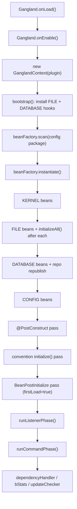
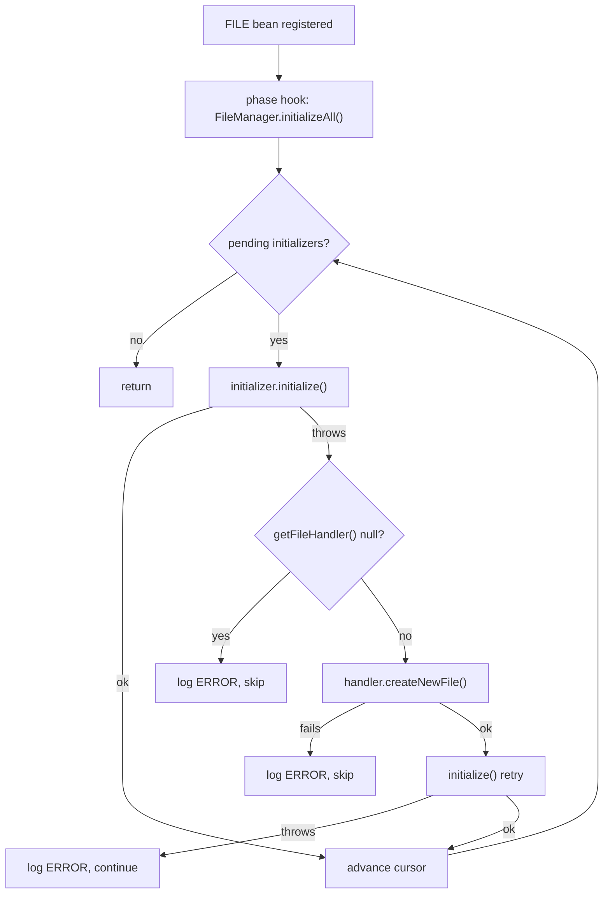
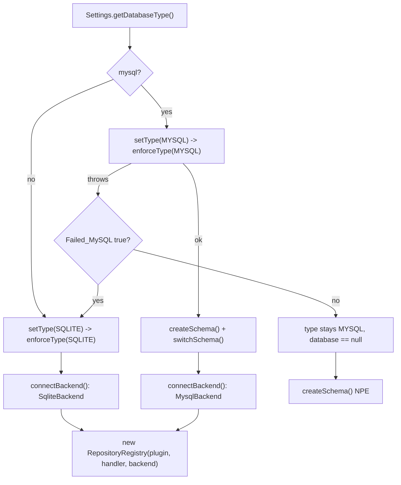
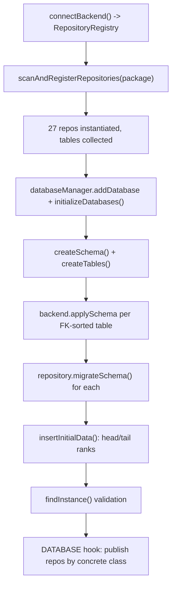
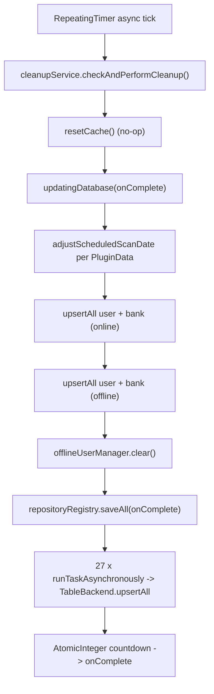
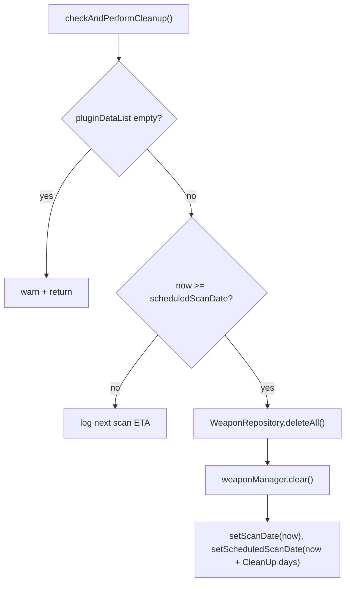
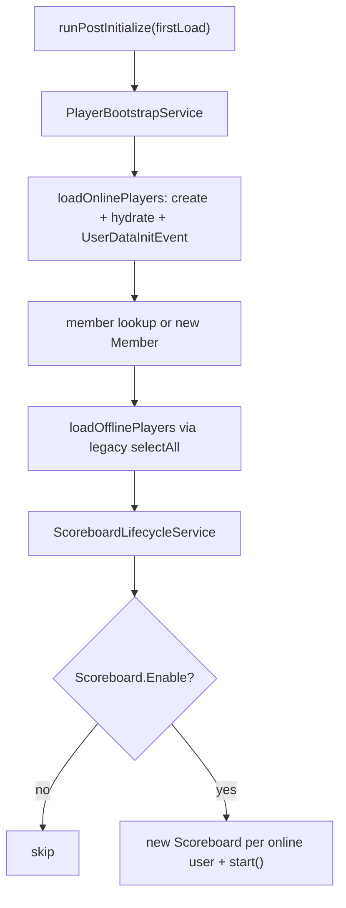
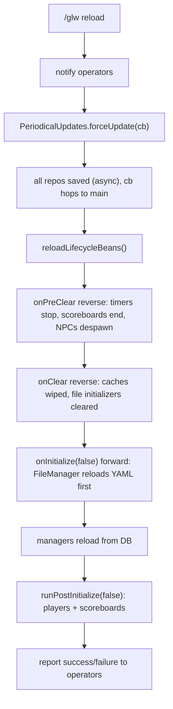
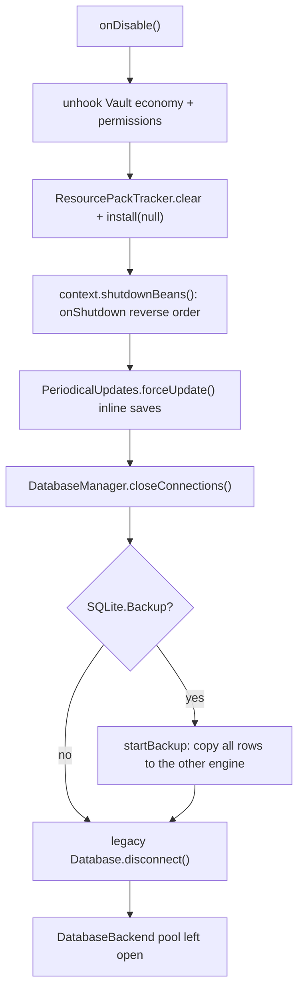
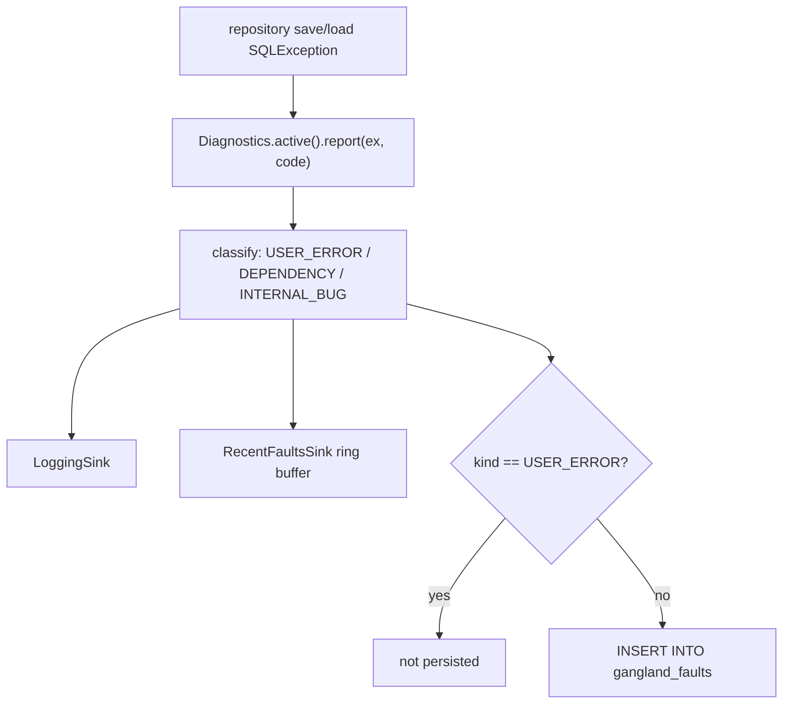

# Core Lifecycle, Bootstrap, Persistence & Scheduling

<!-- preface:start -->
> **How to use this file.** This is a code-traced audit of *Core Lifecycle, Bootstrap, Persistence & Scheduling* in Gangland Warfare, taken on
> 2026-09-02 from branch `0.8.1` (Keystone 1.7.3). It describes what the code **does today**, workflow by workflow,
> so an agent can fix a bug, tweak behaviour, plan a feature, or write tests without re-tracing the system.
>
> - **Citations are pointers, not proof.** Every `File.java:line` was checked after writing, but the code moves.
>   Before you change anything, open the cited file and grep the symbol named in the sentence; trust the class and
>   method names over the line number. A citation ending in `:line-unverified` could not be re-located.
> - **Observations are findings, not confirmed bugs.** Each row carries the tracer's confidence. Rows prefixed
>   `WITHDRAWN:` were disproved during verification and are kept only so the numbering stays stable. Reproduce a
>   High-risk row in code (or a test) before fixing it.
> - **Sections.** *Components* names the classes; *Configuration & Data* the YAML keys, tables and message keys;
>   *Workflows* (`W1`, `W2`, …) the execution paths with trigger, steps, diagram, persistence effects and guards;
>   *Cross-feature Dependencies* what breaks elsewhere if you change this; *Test Surface* what can be unit-tested
>   with plain JUnit/Mockito versus what needs Bukkit/Keystone mocks or a live server.
> - **Conventions live elsewhere.** For *how* to add or change code in this repo, follow `CLAUDE.md` at the repo
>   root (Spigot-only APIs, method-brace style, Keystone at provided scope, the SQLite test teardown rules), the
>   `command-create` and `panel-create` skills for new commands and GUI panels, and the feedback rules in the
>   project memory (YAML key style, `SoundEffect` for sounds, `ItemRefresher` per item type, `setDataSupplier`
>   for every repository, no Paper APIs).
> - **Risk stars** on the rendered page: three stars = High (a player can hit it in normal play), two = Medium
>   (situational), one = Low (cosmetic or unlikely).

Rendered page with diagrams and a table of contents: https://claude.ai/code/artifact/5726570b-bd6c-4c4e-ac33-0f86befcb011
<!-- preface:end -->

> Diagrams below are Mermaid source; the rendered version with drawn diagrams is the linked page above.

## Overview

This area is the plugin's spine: it turns a cold `JavaPlugin` into a fully wired object graph, loads every YAML file,
opens (and falls back between) two database stacks, discovers and creates 27 tables, populates every manager cache, and
then keeps that cache flushed to disk on a timer. Admins see it as: the startup log, `settings.yml`'s `Database` /
`Auto_Save` / `Clean_Up` / `Debug` sections, `/glw reload` (and its `files` / `scoreboard` / `inventory` / `cleanup`
variants), and the `gangland_faults` table. It is implemented in `gangland-impl` under
`org.luckyraven.gangland.{bootstrap,config,database,data.plugin,file.configuration,util,data.placeholder}`, and it
delegates almost all mechanics to Keystone (`keystone-bean` `BeanFactory`/`Phase`/`BeanLifecycle`/`BeanPostInitialize`,
`keystone-persistence` `FileManager`/`DatabaseHandler`/`RepositoryRegistry`/`AbstractRepository`/`DatabaseBackend`,
`keystone-diagnostics` `Diagnostics`).

Main entry points: `Gangland.onEnable()` → `GanglandContext.bootstrap()` (phased bean pipeline) →
`runListenerPhase()`/`runCommandPhase()`; `Gangland.onDisable()` → `GanglandContext.shutdownBeans()` →
`PeriodicalUpdates.forceUpdate()` → `DatabaseManager.closeConnections()`; `ReloadCommand` →
`ReloadPlugin.reload()` → `GanglandContext.reloadBeans()`; `PeriodicalUpdates.task()` on a repeating async timer.

## Components

| Class | Location | Role |
|---|---|---|
| `Gangland` | `gangland-impl` / `org.luckyraven.gangland` | `JavaPlugin` entry point. `onLoad` silences HikariCP logs, `onEnable` builds the context + bootstraps + links dependencies + bStats + update checker, `onDisable` runs bean shutdown → force save → close DB. |
| `GanglandContext` | `gangland-impl` / `.bootstrap` | Owns the single `DependencyContainer` + `BeanFactory`. Installs the FILE and DATABASE phase hooks, scans `…gangland.config`, runs `instantiate()`, then the listener and command scans. Exposes `get(Class)`, `reloadBeans()`, `shutdownBeans()`. |
| `PeriodicalUpdates` | `gangland-impl` / `.bootstrap` | `BeanLifecycle`. Owns the auto-save `RepeatingTimer`, the cleanup service, direct user/bank table upserts, and `repositoryRegistry.saveAll()`. |
| `PlayerBootstrapService` | `gangland-impl` / `.bootstrap` | `BeanPostInitialize`. Populates online + offline `UserManager`s and `MemberManager` after the whole graph is initialised. |
| `ScoreboardLifecycleService` | `gangland-impl` / `.bootstrap` | `BeanPostInitialize`. Creates and starts a `Scoreboard` per online user. |
| `ReloadPlugin` | `gangland-impl` / `.bootstrap` | Facade for full reload (`context.reloadBeans()`) and the three partial reloads (files / scoreboard / inventory). |
| `KernelConfig` | `gangland-impl` / `.config` | `Phase.KERNEL`. 13 beans: `InformationManager`, `ResourcePackTracker`, `Diagnostics`, `PlaceholderService`, `InventoryRegistry`, `VillagerInventoryRegistry`, `UserFactory`, `CompatibilityWorker`, `PermissionWorker`, `PermissionManager`, `FileManager` (registers 15 `FileHandler`s), `DatabaseSettingsProvider`, `DatabaseManager`. |
| `FileConfig` | `gangland-impl` / `.config` | `Phase.FILE`. 24 beans: `Settings`, `LanguageLoader`, settings-extension data beans, and every `FileInitializer` addon (scoreboard, ammunition, unique items, wearables, cars, money, weapons, inventory store). |
| `DebugLoggingConfig` | `gangland-impl` / `.config` | `Phase.FILE`. Produces `DebugLoggingInitializer` and flips module log levels when `Debug.Enabled`. |
| `DatabaseConfig` | `gangland-impl` / `.config` | `Phase.DATABASE`. `GanglandDatabase` (type resolution, schema, `connectBackend`, repository scan, `initializeDatabases`), `DatabaseBackend`, `DatabaseFaultSink`, `RepositoryRegistry`. |
| `DataConfig` | `gangland-impl` / `.config` | `Phase.CONFIG`. `RepositoryRegistry` (re-exposed), `UserManager` ×2 (`online`/`offline`), `UserDataLoader`, `PluginManager`, `RankManager`, `GangManager`, `MemberManager`, `WaypointManager`; `@PostConstruct` harvests `gangland.*` Bukkit permissions. |
| `SchedulingConfig` | `gangland-impl` / `.config` | `Phase.CONFIG`. `PlayerBootstrapService`, `ScoreboardLifecycleService`, `PeriodicalUpdates`. |
| `WiringConfig` | `gangland-impl` / `.config` | `Phase.CONFIG`. `ListenerManager` (+ dummy waypoint listener), `CommandManager`, `GanglandPlaceholder`. |
| `GameplayConfig`, `ItemConfig`, `ShopConfig`, `BankerConfig`, `CopsAndGadgetsConfig`, `TurfConfig`, `TurfNpcsConfig`, `MailConfig`, `GangModuleConfig`, `GangFilterRegistration` | `gangland-impl` / `.config` | `Phase.CONFIG` feature wiring (semantics covered by other agents; ordering edges relevant here). |
| `GanglandDatabase` | `gangland-impl` / `.database` | Extends Keystone `DatabaseHandler`. Adds `connectBackend()` (Mysql/Sqlite `DatabaseBackend` + `RepositoryRegistry`), `createTables()` via the registry, `insertInitialData()` (head/tail ranks), schema naming. |
| `GanglandDatabaseSettings` | `gangland-impl` / `.database` | `DatabaseSettingsProvider` reading the static `Settings` fields. |
| `TableLookup` | `gangland-impl` / `.database` | `find(Class, List<Table<?>>)`, throws `IllegalStateException` when absent. |
| `database/tables/**` (27 classes) | `gangland-impl` / `.database.tables` | `Table<T>` definitions (name + attributes + FK links). |
| `database/repositories/**` (27 classes) | `gangland-impl` / `.database.repositories` | `AbstractRepository<T>` subclasses on the `DatabaseBackend` SPI. |
| `PluginData` / `PluginManager` / `PluginDataCleanupService` | `gangland-impl` / `.data.plugin` | Scan-date bookkeeping row, its `BeanLifecycle` manager, and the periodic "reset weapons" cleanup. |
| `Settings` | `gangland-impl` / `.file.configuration` | `FileInitializer` over `settings.yml`; ~200 static fields + `settingsMap`/`settingsPlaceholder` reflection maps. |
| `Messages` | `gangland-impl` / `.file.configuration` | Message enum seam, initialised by `LanguageLoader`'s `onLoaded` callback. |
| `SettingsLookupImpl` | `gangland-impl` / `.file.configuration` | `SettingsLookup` for `@ConditionalOnSetting` (currently unused by any bean). |
| `MoneyAddonInitializer` | `gangland-impl` / `.file.configuration` | `FileInitializer` for `items/money.yml`. |
| `GadgetPhysicsConfigImpl` | `gangland-impl` / `.file.configuration` | Pure settings adapter. |
| `TimeMessages` | `gangland-impl` / `.util` | Singleton `TimeMessagesProvider` bound to `Messages`; created by `LanguageLoader`'s callback. |
| `GanglandChatUtil` | `gangland-impl` / `.util` | `ChatUtil` subclass adding `%money_symbol%` substitution + the prefix helpers used by the reload/update paths. |
| `PlaceholderService` | `gangland-impl` / `.data.placeholder` | KERNEL-phase aggregating `Placeholder`; contributors self-register; resolves via Keystone `CompositePlaceholderProvider`. |
| Keystone `BeanFactory` / `Phase` / `BeanGraph` / `BeanLifecycle` / `BeanPostInitialize` | Keystone `keystone-bean` | The phase engine, topological sort, and lifecycle contracts. |
| Keystone `FileManager` / `FileInitializer` / `FileHandler` | Keystone `keystone-persistence` | File registry, staged `initializeAll()` with regenerate-from-jar retry, `BeanLifecycle` reload. |
| Keystone `DatabaseHandler` / `DatabaseManager` / `DatabaseHelper` | Keystone `keystone-persistence` | Legacy pool, MySQL→SQLite fallback, backup-on-close. |
| Keystone `RepositoryRegistry` / `AbstractRepository` / `TableBackend` | Keystone `keystone-persistence` | Repository scan, table creation via schema diff, async upsert batching. |
| Keystone `Diagnostics` / `LoggingSink` / `RecentFaultsSink` / `DatabaseFaultSink` | Keystone `keystone-diagnostics`, `keystone-persistence` | Fault classification hub and the three sinks. |
| Keystone `UpdateChecker` / `UpdateNotifier` | Keystone `keystone-update` | 6-hourly update poll + operator notification. |

## Configuration & Data

### YAML files and notable keys

`KernelConfig.fileManager()` (`gangland-impl/src/main/java/org/luckyraven/gangland/config/KernelConfig.java:156-179`)
registers 15 `FileHandler`s, each created on disk if missing:

| File | Folder |
|---|---|
| `settings.yml`, `scoreboard.yml` | root |
| `ammunition.yml`, `unique_items.yml`, `wearables.yml`, `cars.yml`, `money.yml` | `items/` |
| `loot_chests.yml`, `tiers.yml` | `lootchests/` |
| `cops.yml`, `civilians.yml`, `trader_traits.yml`, `bank_tiers.yml` | `npc/` |
| `turf_powerups.yml`, `turf_npcs.yml` | `turf/` |

Additional files are registered outside this list by their own loaders: `WeaponLoader` adds
`weapon/{rifle,grenade,knife,flamethrower,syringe_gun}.yml` (`FileConfig.java:225-235`), the language loader owns
`message/message_<lang>.yml`, and `InventoryLoader`/`ShopRegistry` read their own folders.

`settings.yml` keys read by this area (all via `Settings.init()`,
`gangland-impl/src/main/java/org/luckyraven/gangland/file/configuration/Settings.java:364+`):

- `Debug.Enabled` (default `false`), `Debug.Modules` (list) → `DebugLoggingConfig`.
- `Update_Checker.Enable` / `.Notify_Privileged_Players` / `.Auto_Download` → `Gangland.updateCheckerInitializer()`.
- `Language` (default `en`) → `LanguageLoader`.
- `Database.Type` (`mysql`/`sqlite`, default `sqlite`), `Database.MySQL.{Host,Port,Username,Password}`,
  `Database.SQLite.Backup`, `Database.SQLite.Failed_MySQL`, `Database.Auto_Save.{Enable,Time,Debug}`,
  `Database.Clean_Up.Time`.
- `Scoreboard.Enable` / `Scoreboard.Driver`.

Every scalar read goes through `Settings.str/intVal/dbl/bool/money/strList/intList`, which fall back to a hard-coded
default when the section or key is missing, and accumulate a `ConfigReport` that is logged once at the end
(`Settings.java:784`). Missing keys therefore never abort startup.

`plugin.yml` (`gangland-impl/src/main/resources/plugin.yml`): `api-version: 1.16`, `depend: [Keystone, NBTAPI,
Citizens]`, `softdepend: [PlaceholderAPI, Vault, ViaVersion]`, one command `glw` (alias `gangland`, permission
`gangland.command.main`, default `op`), `database: true`.

`gangland-impl/src/main/resources/org/luckyraven/gangland/module.properties` contains only
`module.name=${project.name}` — the marker Keystone's `DebugLoggingInitializer` scans for module auto-discovery.

### Database tables and repositories

`GanglandDatabase.getSchema()` returns `"gangland"` on MySQL and `"database/gangland"` on SQLite, so the SQLite file is
`<dataFolder>/database/gangland.db` (`GanglandDatabase.java:128-135`, matched by `connectBackend()` at line 73).

All 27 repositories are `AbstractRepository` subclasses discovered by
`registry.scanAndRegisterRepositories("org.luckyraven.gangland.database.repositories")`
(`DatabaseConfig.java:68`). Every one declares a `(JavaPlugin, DatabaseHandler, DatabaseBackend)` constructor and
instantiates its own `Table`, so the registry's table-sharing branch never fires for Gangland.

| Repository | Entity (`@Repository` value) | Table name | `setDataSupplier` wired in |
|---|---|---|---|
| `BankerRepository` | `BankerData` | `banker` | `BankerManager.initialize` (cops-n-crooks `npc/banker/BankerManager.java:42`) |
| `ParkedCarRepository` | `ParkedCar` | `parked_car` | `CarService` (gangland-gadget `car/CarService.java:104`) |
| `CivilianSpawnerRepository` | `CivilianSpawner` | `civilian_spawner` | `EntitySpawner` (cops-n-crooks `npc/entity/EntitySpawner.java:40`) |
| `CopSpawnerRepository` | `CopSpawner` | `cop_spawner` | `EntitySpawner` (same base class, other instance) |
| `DetainmentRepository` | `DetainedPlayer` | `detainment` | `DetainmentRegistry.java:29` |
| `JailExitRepository` | `JailExit` | `jail_exit` | `JailExitService.java:26` |
| `JailRepository` | `Jail` | `jail` | `JailService.java:23` |
| `SeizedInventoryRepository` | `SeizedInventory` | `seized_inventory` | `GanglandSeizedInventoryService.java:33` |
| `GangAllianceRepository` | `GangAlliance` | `gang_ally` | `GangManager.java:42` |
| `GangRepository` | `Gang` | `gang` | `GangManager.java:41` |
| `LootChestRepository` | `LootChestData` | `loot_chest` | `LootChestManager.java:56` |
| `MailRepository` | `MailItem` | `mail` | `MailManager.java:42` |
| `BankRepository` | `Bank` | `bank` | `UserManager.java:54` |
| `MemberRepository` | `Member` | `member` | `MemberManager.java:48` |
| `UserRepository` | `User` (generic) | `user` | `UserManager.java:51` |
| `PermissionRepository` | `Permission` | `permission` | `RankManager.java:118` |
| `PluginDataRepository` | `PluginData` | `plugin_data` | `PluginManager.java:41` |
| `RankParentRepository` | `RankParent` | `rank_parent` | `RankManager.java:119` |
| `RankPermissionRepository` | `RankPermission` | `rank_permission` | `RankManager.java:120` |
| `RankRepository` | `Rank` | `rank_tree` | `RankManager.java:117` |
| `TraderRepository` | `TraderData` | `trader` | `TraderManager.java:57` |
| `ActiveTurfBuffRepository` | `ActiveTurfBuff` | `turf_active_buff` | `ActiveBuffManager.java:55` |
| `TurfGarrisonRepository` | `Garrison` | `turf_garrison` | `GarrisonManager.java:29` |
| `TurfPowerupNpcRepository` | `TurfPowerupData` | `turf_powerup_npc` | `TurfPowerupManager.java:51` |
| `TurfRepository` | `Turf` | `turf` | `TurfManager.java:61` |
| `WaypointRepository` | `Waypoint` | `waypoint` | `WaypointManager.java:51` |
| `WeaponRepository` | `Weapon` | `weapon` | `WeaponManager.java:35` |

All 27 have a supplier. Note that the supplier is wired inside each manager's `initialize()`/`onInitialize()`, so a
repository whose owning manager fails to initialise will throw `IllegalStateException: No data supplier set …` from
`AbstractRepository.saveAllFromMemory` on the first autosave tick (that exception is caught and logged per-repository by
`RepositoryRegistry.saveAll`, so one broken manager does not abort the whole save).

Plus one non-repository table: `gangland_faults`, created by `DatabaseFaultSink.onInitialize`
(`DatabaseConfig.java:96-98`, Keystone `DatabaseFaultSink.java:58-69`).

### Message keys / localization

`FileConfig.languageLoader(...)` (`FileConfig.java:85-100`) builds Keystone's `LanguageLoader` with
`Settings::getLanguagePicked`, base name `message`, a missing-path reporter (`Messages::findMissingPaths`) and an
`onLoaded` callback that re-publishes the provider into two static seams: `Messages.init(provider)` and
`TimeMessages.initialize()`. `loader.initialize()` is invoked directly inside the bean method — the loader is **not** a
`FileInitializer`, so it is not part of `FileManager.initializeAll()`; instead it is a Keystone `BeanLifecycle` whose
`onInitialize(firstLoad)` returns early on `firstLoad == true` and re-runs `initialize()` on every reload pass
(Keystone `LanguageLoader.java:80-84`). Because `FileManager` is a KERNEL-phase bean and the loader a FILE-phase bean,
forward-order reload guarantees `settings.yml` (and therefore the new `Language` value) is re-read before the loader
runs.

`TimeMessages.initialize()` is a one-shot guard (`if (instance != null) return;` —
`gangland-impl/src/main/java/org/luckyraven/gangland/util/TimeMessages.java:12-16`), which is fine because the singleton
reads `Messages.*` lazily on each call.

Keystone's own argument-tree strings are localized once, in `GanglandContext.runCommandPhase()`
(`GanglandContext.java:196-199`), via `ArgumentMessages.install(...)` with `Messages` suppliers so a language change on
reload takes effect immediately.

## Commands & Permissions

| Command | Class | Permission | What it does |
|---|---|---|---|
| `/glw reload` (alias `rl`) | `command/sub/ReloadCommand.java:37` | `gangland.command.reload` — built by Keystone `Command.java:50` as `<prefix>.command.<label>`; `plugin.yml` declares only `gangland.command.main`, so this node is undeclared and defaults to "no explicit default" | Force-saves everything, then on the main thread runs `ReloadPlugin.reload()` → `context.reloadBeans()`. |
| `/glw reload files` (alias `file`) | `ReloadCommand.java:42-46` | same | Force-save, then `FileManager.onClear()` + `onInitialize(false)` only. |
| `/glw reload scoreboard` | `ReloadCommand.java:48-54` | same | No force-save. Ends and recreates every online user's `Scoreboard` (guarded by `Settings.isScoreboardEnabled()`). |
| `/glw reload inventory` | `ReloadCommand.java:58-63` | same | No force-save. `PeriodicalUpdates.resetCache()` (currently a no-op) + `InventoryHandler.removeAllSpecialInventories()` + `InventoryLoader.clear()/initialize()`. |
| `/glw reload cleanup` | `ReloadCommand.java:65-69` | same | No force-save. `PluginDataCleanupService.forceCleanup()` — deletes every `weapon` row and clears `WeaponManager`. |
| `/glw` (root) | `Gangland.SHORT_PREFIX` bound in `GanglandContext.runCommandPhase()` | `gangland.command.main` (`plugin.yml`, default `op`) | Dispatcher. |

`DataConfig.registerGanglandPermissions()` (`DataConfig.java:136-145`) is a `@PostConstruct` that snapshots every Bukkit
permission starting with `gangland` and feeds them into Keystone's `PermissionManager`. Because it runs in the
`@PostConstruct` pass (after all bean phases but before the LISTENER/COMMAND scans in `GanglandContext`), permissions
registered later by command classes are **not** in that set.

## Events

| Event | Fired by | Handled by | Purpose |
|---|---|---|---|
| `UserDataInitEvent` | `PlayerBootstrapService.loadOnlinePlayers` (`PlayerBootstrapService.java:113-114`) | feature listeners (outside this area) | Lets features hydrate per-user state right after DB load, on both first enable and every reload. |
| `WantedStartEvent` (indirect) | `UserRepository.doLoadAll` → `user.getWanted().setLevel(...)` (`UserRepository.java:63`) and `UserDataLoader` | `CopManager` | The reason `PlayerBootstrapService` is a `BeanPostInitialize` rather than a `BeanLifecycle` — see Keystone `BeanPostInitialize` javadoc. |

No Bukkit events are consumed inside this area itself; listener registration is delegated wholesale to
`ListenerManager.scanAndRegisterListeners("org.luckyraven.gangland", gangland)` in `GanglandContext.runListenerPhase()`.

## Workflows

### W1: `onLoad` / `onEnable` — phased bootstrap

**Trigger:** server start (or `/reload`), Bukkit calls `JavaPlugin.onLoad()` then `onEnable()`.

**Steps:**

1. `Gangland.onLoad` (`Gangland.java:58-61`) — `Configurator.setLevel("com.zaxxer.hikari", ERROR)`. Nothing else; no
   context exists yet.
2. `Gangland.onEnable` (`Gangland.java:104`) — `new GanglandContext(this)`. The constructor builds the
   `DependencyContainer` and `BeanFactory(container, gangland, new SettingsLookupImpl())` and self-registers
   `GanglandContext`, `DependencyContainer`, `Gangland` (`GanglandContext.java:81-92`).
3. `GanglandContext.bootstrap()` (`GanglandContext.java:128`) installs two phase hooks: FILE →
   `FileManager.initializeAll()`, DATABASE → `publishRepositoriesFromContainer()`.
4. `beanFactory.scan("org.luckyraven.gangland.config")` — reflection scan finds the 17 `@Configuration` classes.
5. `beanFactory.instantiate()` (Keystone `BeanFactory.java:162`):
   a. Every config class is constructed first (`container.createInstance`), so a `@Configuration` constructor may only
   take `Gangland` / `GanglandContext` / `DependencyContainer`.
   b. `@Bean` methods are bucketed by the **class-level** `@Configuration(phase=…)` — there is no per-method phase.
   c. Phases run in `Phase` declaration order; inside a phase `BeanGraph.topologicalSort` (Kahn's algorithm) orders by
   `@Bean` method parameter types. Ties are broken by the order definitions were collected, which comes from
   `configClass.getDeclaredMethods()` — **JVM-unspecified**, not source order — over a `Set` of config classes. Only
   explicit parameter edges are reliable ordering.
   d. After each bean: `registerBean` (container + optional ServicesManager), then if it is a `BeanLifecycle`,
   `onInitialize(true)` is invoked **immediately** (`BeanFactory.java:218-220`), then the phase hook fires with the
   cumulative phase list.
6. **KERNEL** (`KernelConfig`): `Diagnostics.withDefaults()+LoggingSink+RecentFaultsSink` is installed process-wide;
   `ResourcePackTracker.install(...)`; `PlaceholderService` registers the `%money_symbol%` resolver;
   `InventoryHandler.setRegistry(...)`; `FileManager` is created and the 15 `FileHandler`s are created on disk;
   `DatabaseManager` is created but not connected.
7. **FILE** (`FileConfig` + `DebugLoggingConfig`): after **each** bean the FILE hook calls
   `FileManager.initializeAll()`, which runs only the initializers registered since the previous call
   (`FileManager.nextInitializerIndex`). This is what makes `Settings` fully populated before `LanguageLoader`,
   `ScoreboardAddon`, `UniqueItemAddon`, … read `Settings.getX()` in their constructors.
8. **DATABASE** (`DatabaseConfig`): see W3/W4. After each DATABASE bean the hook republishes every repository into the
   container under its concrete class, guarded by an `IdentityHashMap`-backed set.
9. **CONFIG**: the 11 CONFIG `@Configuration` classes produce ~180 beans. Ordering is purely by parameter edges; several
   parameters exist only to encode ordering (`SchedulingConfig.java:54,63`, `DataConfig.java:75,82`,
   `FileConfig.java:151`).
10. **LIFECYCLE / LISTENER / COMMAND** declare no `@Bean`s; Keystone's convention scans are not registered
    (`registerListenerScan`/`registerCommandScan` are never called), so these phases are empty and the work is done by
    `GanglandContext` after `instantiate()` returns.
11. `runPostConstruct(configs)` then `runPostConstruct(beans)` — this is where `DataConfig.registerGanglandPermissions`
    fires.
12. `runInitialize(allBeans)` — invokes any zero-arg `void initialize()` on beans that are **neither** `BeanLifecycle`
    **nor** `FileInitializer` (Keystone `BeanFactory.java:533-560`). This is how `TurfManager`, `MailManager`,
    `ActiveBuffManager`, `GarrisonManager`, `PluginManager`-style managers get their first load.
13. `runPostInitialize(true)` — `PlayerBootstrapService.onPostInitialize(true)` then
    `ScoreboardLifecycleService.onPostInitialize(true)` (W7).
14. Back in `GanglandContext.bootstrap()`: `runListenerPhase()` (pull `ListenerManager`, scan
    `org.luckyraven.gangland`, `registerEvents()`), then `runCommandPhase()` (install `ArgumentMessages`, bind
    `Command.setInformationManager`, set executor, scan `…command.sub`, install `CommandTabCompleter` +
    `BrigadierTabRegistrar`).
15. `Gangland.onEnable` continues: `new ReloadPlugin(context)`, `dependencyHandler()` (NBTAPI/Citizens required —
    `disablePlugin` if missing; PAPI/Vault/ViaVersion soft), `bStats()`, `updateCheckerInitializer()` (W10).

**Diagram:**

**State & persistence effects:** installs three process-wide statics (`Diagnostics.install`,
`ResourcePackTracker.install`, `InventoryHandler.setRegistry`), creates 15 YAML files on disk if absent, creates/migrates
28 DB tables, may INSERT the two initial ranks and the rank-parent relation, populates every manager cache from the DB,
registers ~40 listeners and ~30 commands, starts the auto-save timer and the update-check timer.

**Edge cases & guards observed:**

- Any exception in a `@Bean` method is wrapped into `IllegalStateException` and aborts `onEnable` — Bukkit logs it and
  the plugin stays half-enabled (listeners/commands never bound).
- `runListenerPhase`/`runCommandPhase` throw `IllegalStateException` if their manager bean is missing; a missing `glw`
  entry in `plugin.yml` only logs a warning and skips the bind (`GanglandContext.java:188-191`).
- Missing NBTAPI/Citizens calls `getPluginLoader().disablePlugin(...)` **after** the whole graph, listeners, commands and
  timers are already live (`Gangland.java:110`).

### W2: File initialization and regenerate-from-jar recovery

**Trigger:** every FILE-phase bean registration (bootstrap), and `FileManager.onInitialize(false)` on reload.

**Steps:**

1. `KernelConfig.fileManager()` (`KernelConfig.java:157-178`) — `fm.addFile(handler, true)`; `FileHandler.create(true)`
   copies the bundled resource out of the jar when the file is missing. Failures are logged, not thrown
   (Keystone `FileManager.java:41-46`).
2. Each FILE bean that owns a file calls `fileManager.registerInitializer(this)` inside the `@Bean` method
   (`FileConfig.java:76,153,177,192,201,210,245`).
3. The FILE phase hook then calls `FileManager.initializeAll()` (`GanglandContext.java:133-138`), which walks
   `initializers[nextInitializerIndex …]` and calls `runInitializer` on each (Keystone `FileManager.java:230-235`).
4. `runInitializer` (Keystone `FileManager.java:237-266`): try `initializer.initialize()`. On exception —
   if `getFileHandler()` is `null` (folder loaders) log at ERROR and return; otherwise log a WARN, call
   `handler.createNewFile()` to regenerate from the jar, and retry `initialize()` **once**. A second failure logs at
   ERROR and the loop continues to the next initializer.
5. `Settings.initialize()` → `init()` reads every section through `NodeReader`, applies per-key defaults, logs a single
   `ConfigReport`, then rebuilds `settingsMap` and `settingsPlaceholder` by reflection over its own static fields
   (`Settings.java:790-816`).

**Diagram:**

**State & persistence effects:** writes YAML files to the data folder; mutates the static `Settings` fields and the two
static maps; publishes the message provider into `Messages`/`TimeMessages`.

**Edge cases & guards observed:**

- `new Settings(fileManager)` throws `PluginException` if `settings.yml` is not loaded
  (`Settings.java:251-259`) — that happens before any recovery attempt, so a corrupt `settings.yml` at construction time
  aborts bootstrap rather than triggering regenerate-and-retry.
- `Settings` does not override `FileInitializer.clear()`, so a reload simply overwrites the statics; stale keys removed
  from a newer file keep their previous value only if `init()` no longer assigns them (it always does).
- `FileManager.onClear()` resets `nextInitializerIndex = 0` but does **not** call `clearInitializers()`, so the
  registration list survives a reload and every initializer re-runs — correct, because `@Bean` methods do not re-run.

### W3: Database connect, MySQL→SQLite fallback, `connectBackend`

**Trigger:** DATABASE phase, `DatabaseConfig.ganglandDatabase(...)` (`DatabaseConfig.java:42-79`).

**Steps:**

1. `type = Settings.getDatabaseType().equalsIgnoreCase("mysql") ? MYSQL : SQLITE` — anything that isn't literally
   `mysql` is SQLite.
2. `new GanglandDatabase(gangland, "gangland", settingsProvider)`.
3. `database.setType(type)` (Keystone `DatabaseHandler.java:115-129`):
   - SQLITE → `enforceType(SQLITE)` → `createSchema()` (creates `<dataFolder>/database/gangland.db` dirs) then
     `SQLite.initialize(credentials, path)`. Failure logs and rethrows a `PluginException`.
   - MYSQL → `enforceType(MYSQL)`; on any `RuntimeException` (`PluginException` wraps both `SQLException` and Hikari's
     `PoolInitializationException`) it calls `useSQLite(schema)`, which **returns silently when
     `Database.SQLite.Failed_MySQL` is false**, leaving `type == MYSQL` and `database == null`.
4. Back in the bean: if `getType() == MYSQL`, `database.createSchema()` → `getDatabase().createSchema(schema)` +
   `switchSchema(schema)`.
5. `database.connectBackend()` (`GanglandDatabase.java:56-81`) — throws if a backend already exists; builds
   `MysqlBackend` with `jdbc:mysql://host:port/<schemaName>` or `SqliteBackend` with
   `jdbc:sqlite:<dataFolder>/database/gangland.db` (the same file the legacy pool uses); `backend.connect(params)`;
   then `new RepositoryRegistry(plugin, this, backend)`.
6. `SQLException`/`IOException` from steps 4-5 are rethrown as `PluginException` (`DatabaseConfig.java:61-63`), aborting
   bootstrap.

**Diagram:**

**State & persistence effects:** creates the SQLite file / MySQL schema, opens two independent connection pools (legacy
`Database` and the new `DatabaseBackend`).

**Edge cases & guards observed:**

- The `Failed_MySQL=false` path is not defended (see Observations #1).
- `connectBackend()` is idempotency-hostile by design: a second call throws `SQLException("Backend already connected")`.
  Nothing calls it twice today.
- SQLite uses two pools over the same file. Keystone's `DatabaseHelper.runQueries` synchronises on the legacy `Database`
  object only; backend writes take no such lock.

### W4: Repository scan, `createTables`, initial data, data load order

**Trigger:** the same `ganglandDatabase(...)` bean, immediately after `connectBackend()`.

**Steps:**

1. `registry.scanAndRegisterRepositories("org.luckyraven.gangland.database.repositories")`
   (`DatabaseConfig.java:68`). Keystone reflects over the package, keeps `@Repository`-annotated `IRepository`
   implementations, sorts them (`sortRepositoriesByDependencies`), and for each picks the first constructor whose
   parameters are all resolvable from `{JavaPlugin, DatabaseHandler, DatabaseBackend, already-registered Table}`.
   Each repository's `getTable()` result is added to `registeredTables` / `tablesByName`. Instantiation failures are
   **logged and skipped**, not thrown (Keystone `RepositoryRegistry.java:99-102`).
2. `databaseManager.addDatabase(database)` then `initializeDatabases()` → `DatabaseHandler.initialize()`:
   `helper.runQueries(db -> { createSchema(); createTables(); })` and `helper.runQueries(db -> insertInitialData())`.
   Both run **synchronously on the main thread** and swallow `SQLException` inside `runQueries`.
3. `GanglandDatabase.createTables()` → `repositoryRegistry.createTables()`: tables are FK-sorted
   (`sortTablesByDependencies`) and each is applied through `backend.applySchema(TableSchemas.fromTable(table))` — the
   diff engine creates missing tables and adds missing columns. Then every repository's `migrateSchema()` runs.
4. `GanglandDatabase.insertInitialData()` (`GanglandDatabase.java:112-126`) — resolves `RankRepository` and
   `RankParentRepository`, inserts the head/tail ranks from `Settings.getGangRankHead()/Tail()` and their parent
   relation. Silently returns if either repository is missing or of the wrong type.
5. `GanglandDatabase.findInstance(databaseManager)` re-resolves the handler; `null` → `PluginException`.
6. The DATABASE phase hook (`GanglandContext.publishRepositoriesFromContainer`) then registers every repository into the
   container keyed by its concrete class, so CONFIG beans such as `TurfConfig.turfRepositoryContract(TurfRepository)`
   and `TurfNpcsConfig.turfPowerupManager(TurfPowerupNpcRepository …)` resolve by concrete type.
7. Actual **data loading** happens later, per manager: `BeanLifecycle` managers load in `onInitialize(true)` fired
   inline right after their `@Bean` registration; convention managers load in the `initialize()` pass after all phases.
   Cross-manager order is therefore the CONFIG-phase topological order — which is why `DataConfig` threads
   `MemberManager` into both `UserManager` beans purely as an ordering edge (`DataConfig.java:64-84`).

**Diagram:**

**State & persistence effects:** DDL against the live database; two rows in `rank_tree` and one in `rank_parent` on a
fresh install.

**Edge cases & guards observed:**

- A repository that fails to construct disappears silently; the first symptom is
  `IllegalStateException: No repository registered for: X` thrown later from `RepositoryRegistry.getRepository`, or a
  `TableLookup.find` `IllegalStateException`.
- `DatabaseHandler.initialize()` wraps everything in `runQueries`, which catches `Throwable` and only logs — so a failed
  `createTables()` does **not** abort startup; the plugin continues against a database with missing tables.
- `RepositoryRegistry.canRegisterRepository` has inverted table-dependency logic (Keystone
  `RepositoryRegistry.java:361-367`: it `continue`s when the table is *absent* and returns `false` when it is
  *present*). Gangland's repositories take no `Table` constructor parameters, so the branch is unreachable here.

### W5: Autosave tick

**Trigger:** `RepeatingTimer` created in `PeriodicalUpdates.onInitialize` with period `20 * 60 * Database.Auto_Save.Time`
ticks, started with `start(true)` — i.e. **asynchronous**.

**Steps:**

1. `PeriodicalUpdates.task(null)` (`PeriodicalUpdates.java:219`) — reads `Settings.isAutoSaveDebug()`.
2. `cleanupService.checkAndPerformCleanup()` inside a `try/catch (Throwable)` (W6).
3. `resetCache()` — currently an empty method (`PeriodicalUpdates.java:130`).
4. `updatingDatabase(onComplete)`:
   a. `database.getTables()` → `TableLookup.find(UserTable.class, …)` and `BankTable.class`.
   b. For each `PluginData`, `adjustScheduledScanDate(...)` recomputes the scheduled scan date if
   `Database.Clean_Up.Time` changed.
   c. `updateAllData(userTable, onlineUsers)` / `(bankTable, onlineBanks)` / the same two for offline users. Each call
   snapshots the collection and runs `helper.runQueries(legacy -> new TableBackend<>(table, backend).upsertAll(snapshot))`
   — **synchronously on the calling (async timer) thread**, holding `synchronized (legacyDatabase)`.
   d. `offlineUserManager.clear()` — the offline cache is dropped immediately after being written.
   e. `repositoryRegistry.saveAll(onComplete)` → for each of the 27 repositories,
   `AbstractRepository.saveAllFromMemory(countDown)` → `saveAll(dataSupplier.get(), countDown)` → snapshot →
   `runBackendAsync` → `Bukkit.getScheduler().runTaskAsynchronously` (plugin enabled) → `TableBackend.upsertAll`.
   f. The `AtomicInteger` countdown fires `onComplete` on whichever async thread finishes last.
5. When debug is on, the completion callback logs `Data save complete` and the elapsed time.

**Diagram:**

**State & persistence effects:** upserts every cached entity into 27 tables plus `user`/`bank`; empties the offline user
cache; may mutate `PluginData.scheduledScanDate`.

**Edge cases & guards observed:**

- The whole tick body is wrapped in `try/catch (Throwable)` per step, so a failure in one step does not stop the others;
  `onComplete` runs even on failure (`PeriodicalUpdates.java:250-254`).
- `helper.runQueries` returns immediately when the legacy `Database` is `null` — so if MySQL failed with fallback
  disabled, user/bank saves become silent no-ops while repository saves still go through the backend.
- Everything in steps 2-4d touches manager caches from an async thread (see Observations #2 and #3).

### W6: Cache-cleanup tick (`PluginDataCleanupService`)

**Trigger:** the first thing every autosave tick does; also `/glw reload cleanup` (main thread).

**Steps:**

1. `checkAndPerformCleanup()` (`data/plugin/PluginDataCleanupService.java:37`) — returns early with a WARN if
   `PluginManager.getPluginDataList()` is empty.
2. Takes the **last** element of the list, compares `System.currentTimeMillis()` with `scheduledScanDate`.
3. Not due → formats the remaining time via `TimeUtil.formatTime(..., TimeMessages.getInstance())` and logs it when
   `Auto_Save.Debug` is on. Note `TimeMessages.getInstance()` throws `IllegalStateException` if the language never
   loaded.
4. Due → `performCleanup`: `resetWeapons()` (`WeaponRepository.deleteAll()` then `weaponManager.clear()`), then
   `pluginData.setScanDate(now)` and `setScheduledScanDate(nextPlannedDate(now))` where the interval is
   `Database.Clean_Up.Time` days.
5. The mutated `PluginData` is persisted by the same tick's `repositoryRegistry.saveAll()`.

**Diagram:**

**State & persistence effects:** deletes every row of `weapon` and empties the in-memory weapon cache; rewrites the
`plugin_data` scan dates.

**Edge cases & guards observed:**

- `logDebug` is captured once in the constructor (`PluginDataCleanupService.java:21`); because the service is rebuilt in
  `PeriodicalUpdates.initializeCleanupService()` on every start/reload, it does track config changes.
- `resetWeapons` runs on the async timer thread and mutates `WeaponManager`'s map (Observations #3).

### W7: Player + scoreboard bootstrap (post-init pass)

**Trigger:** `BeanFactory.runPostInitialize(firstLoad)` — at the end of `instantiate()` and at the end of
`reloadLifecycleBeans()`.

**Steps:**

1. `PlayerBootstrapService.onPostInitialize` (`PlayerBootstrapService.java:73`) resolves `UserTable`, `BankTable`,
   `MemberTable` via `TableLookup.find`.
2. `loadOnlinePlayers`: for each `Bukkit.getOnlinePlayers()` not already cached — `userManager.create(player)`, grant
   join-time unique items, `userDataLoader.loadUserData(...)`, fire `UserDataInitEvent`, `userManager.add(...)`, then
   either `initializeUserPermission(user, member)` or create + initialise a fresh `Member`.
3. `loadOfflinePlayers`: builds a **new** `DatabaseHelper` and runs `userTable.selectAllTableQuery(database)` on the
   **legacy** stack (not the backend), creating an offline `User` for every row whose player is not online and not
   already cached.
4. `ScoreboardLifecycleService.onPostInitialize` (`ScoreboardLifecycleService.java:43`) — if `Scoreboard.Enable`, builds
   and starts a `Scoreboard` per cached online user.

**Diagram:**

**State & persistence effects:** fills both user caches and the member cache; grants items into player inventories;
starts one scoreboard task per player.

**Edge cases & guards observed:**

- Both services are idempotent per user (`getUser(...) != null → continue`), which matters because the offline load
  reads every `user` row on every reload.
- On a large database `loadOfflinePlayers` is an unbounded synchronous main-thread `SELECT *` of the `user` table.

### W8: `/glw reload` — full reload

**Trigger:** `/glw reload` (or `/glw rl`).

**Steps:**

1. `ReloadCommand.onExecute` → `reloadProcess("", () -> reloadPlugin.reload(), forceUpdate = true)`
   (`ReloadCommand.java:37`).
2. Broadcasts `&bReloading the plugin…` to operators holding the command permission.
3. `PeriodicalUpdates.forceUpdate(callback)` runs the whole autosave tick **on the command thread (main)**, including
   the cleanup check, then the callback hops back to the main thread with `Bukkit.getScheduler().runTask`.
4. `runReloadBody` → `ReloadPlugin.reload()` → `GanglandContext.reloadBeans()` →
   `BeanFactory.reloadLifecycleBeans()` (Keystone `BeanFactory.java:266-286`):
   a. `onPreClear()` on every `BeanLifecycle` in **reverse** registration order — e.g. `PeriodicalUpdates.onPreClear`
   stops the timer, `UserManager.onPreClear` ends scoreboards, NPC managers despawn.
   b. `onClear()` in reverse order — caches wiped, `FileManager.onClear()` calls `clear()` on every `FileInitializer`
   and resets the initializer cursor.
   c. `onInitialize(false)` in **forward** order — `FileManager` reloads every YAML from disk (regenerating corrupt
   files) and re-runs every initializer; then each manager reloads from the database; `PeriodicalUpdates` rebuilds and
   restarts its timer using the freshly-read `Auto_Save` values.
   d. `runPostInitialize(false)` — W7 again.
5. `&aReload has been completed.` (or `&cThere was a problem reloading the plugin!` plus a stack trace when
   `runReloadBody` catches a `Throwable`).

**Diagram:**

**State & persistence effects:** full DB flush, then every `BeanLifecycle` cache is rebuilt from disk + database.
Listeners and commands are **not** re-registered (they were never `BeanLifecycle`), so no double-registration occurs.

**Edge cases & guards observed:**

- Beans that are not `BeanLifecycle` but expose a convention `initialize()` (`TurfManager`, `MailManager`,
  `ActiveBuffManager`, `GarrisonManager`, …) are **not** cleared or re-initialised on reload — see Observations #6.
- `DebugLoggingInitializer` is a plain bean, so `Debug.Enabled`/`Debug.Modules` changes need a server restart (the YAML
  comment says as much).
- `/glw reload files`, `scoreboard`, `inventory`, `cleanup` bypass `reloadBeans()` entirely and only touch their own
  subsystem; only `files` force-saves first.

### W9: Shutdown

**Trigger:** `Gangland.onDisable()` (server stop, `/reload`, or `disablePlugin`).

**Steps:**

1. Unhook Vault economy (`EconomyHandler.setVaultEconomy(null)`) and Vault permissions
   (`VaultPermissionBridge.set(null)`).
2. `ResourcePackTracker.active()` → `clear()` + `install(null)`.
3. `context.shutdownBeans()` → `BeanFactory.shutdownLifecycleBeans()` → `onShutdown()` on every `BeanLifecycle` in
   **reverse** order. `PeriodicalUpdates.onShutdown` only stops the timer; feature beans convert live sessions into
   savable records (e.g. `CarService` active cars → parked rows) and despawn NPCs/holograms.
4. `context.get(PeriodicalUpdates.class).forceUpdate()` — because `JavaPlugin.isEnabled()` is already `false` at this
   point, `AbstractRepository.runBackendAsync` runs **inline**, so the final save completes before `onDisable` returns.
5. `DatabaseManager.closeConnections()` — for each handler, optionally runs the cross-engine backup
   (`Database.SQLite.Backup`) and then disconnects the **legacy** `Database` only.

**Diagram:**

**State & persistence effects:** final flush of every cache; optional full cross-engine backup; legacy pool closed.

**Edge cases & guards observed:**

- `context` is dereferenced without a null check (`Gangland.java:84`) — if the `GanglandContext` constructor itself
  threw, `onDisable` NPEs.
- An exception thrown by any bean's `onShutdown()` propagates out of `shutdownLifecycleBeans()` and **skips the final
  force-save and the DB close** (Observations #5).
- `Diagnostics.install(...)` is never undone, unlike `ResourcePackTracker` (Observations #9).
- The `DatabaseBackend` pool is never disconnected (Observations #4).

### W10: Fault / diagnostics flow

**Trigger:** anything calling `Diagnostics.active().report(...)` — notably
`AbstractRepository.reportBackendFailure` for every failed repository load/save, plus Keystone's guarded listener and
command dispatch.

**Steps:**

1. `KernelConfig.diagnostics()` (`KernelConfig.java:80-87`) builds the hub with `LoggingSink` + `RecentFaultsSink` and
   installs it process-wide.
2. `DatabaseConfig.databaseFaultSink(...)` (`DatabaseConfig.java:95-98`) constructs
   `new DatabaseFaultSink(backend, diagnostics, "gangland_faults")`; the constructor self-registers into the hub.
3. Because `DatabaseFaultSink` implements `BeanLifecycle`, `BeanFactory` calls `onInitialize(true)` immediately after
   registration, which applies the `gangland_faults` schema and flips `ready = true`. (The javadoc on
   `DatabaseConfig.java:92-94` says "during the LIFECYCLE pass" — that is stale; it happens inline in the DATABASE
   phase.)
4. `accept(Fault)` skips `USER_ERROR` faults and inserts everything else; write failures are logged directly and never
   re-reported (avoids recursion).
5. On reload, `onClear()` sets `ready = false` and `onInitialize(false)` re-applies the schema.

**Diagram:**

**State & persistence effects:** rows in `gangland_faults`; an in-memory recent-faults ring.

**Edge cases & guards observed:** inserts are dropped silently while `ready == false` (between `onClear` and
`onInitialize` during a reload, or if the schema apply failed).

### W11: Update notifier

**Trigger:** end of `onEnable`, only when `Update_Checker.Enable` is true.

**Steps:**

1. `Gangland.updateCheckerInitializer()` (`Gangland.java:220-239`) — early return when disabled.
2. `new UpdateChecker(this, context.get(PermissionManager.class), "gangland", 131157)`.
3. `new UpdateNotifier(this, checker, 6*60*60 s, Settings::isUpdaterAutoUpdate, GanglandChatUtil::commandMessage)` and
   `start()`.

**Edge cases & guards observed:** the field is `Gangland.updateChecker` and is never stopped in `onDisable`; the notifier
is not a bean, so a reload does not pick up a changed `Update_Checker` setting. `Settings.isNotifyPrivilegedPlayers()` is
read but not passed to the notifier here (unverified whether Keystone reads it another way).

### W12: Placeholder service registration

**Trigger:** KERNEL phase, then CONFIG phase, then `dependencyHandler()`.

**Steps:**

1. `KernelConfig.placeholderService()` creates the service and registers the `%money_symbol%` → `Settings.getMoneySymbol()`
   resolver (`KernelConfig.java:89-97`).
2. FILE/CONFIG beans constructor-inject it (`ScoreboardManager`, `AmmunitionAddon`, `UniqueItemAddon`, `WearableAddon`,
   `CarAddon`, `BooleanExpressionEvaluator`, `GanglandPlaceholder`, …). Contributors self-register from their own
   constructors.
3. `Gangland.dependencyHandler()` (`Gangland.java:185-190`) — if PlaceholderAPI is present, pulls the
   `GanglandPlaceholder` bean and registers a `PapiExpansionAdapter`.
4. `PlaceholderService.convert` builds a fresh `CompositePlaceholderProvider` chain per call: PAPI first (only once
   `gangland.getPapiExpansion() != null`), then every registered resolver in order.

**Edge cases & guards observed:** during the FILE phase the resolver list is empty, so `convert` is an identity
function — deliberate. The PAPI link only appears after `dependencyHandler()` runs, i.e. after bootstrap. Chain
construction is per-call (Observations #10).

## Cross-feature Dependencies

- **Depends on:**
  - Keystone `keystone-bean` (`BeanFactory`, `BeanGraph`, `Phase`, `BeanLifecycle`, `BeanPostInitialize`,
    `DependencyContainer`, `@Configuration`/`@Bean`/`@Qualifier`/`@PostConstruct`).
  - Keystone `keystone-persistence` (`FileManager`, `FileHandler`, `FileInitializer`, config `NodeReader`/`ConfigReport`,
    `DatabaseHandler`, `DatabaseManager`, `DatabaseHelper`, `DatabaseBackend`/`MysqlBackend`/`SqliteBackend`,
    `Table`/`TableBackend`, `RepositoryRegistry`, `AbstractRepository`, `LanguageLoader`, `DatabaseFaultSink`).
  - Keystone `keystone-diagnostics`, `keystone-permission`, `keystone-economy`, `keystone-timer` (`RepeatingTimer`),
    `keystone-update`, `keystone-command` (`ArgumentMessages`, `CommandTabCompleter`, `BrigadierTabRegistrar`),
    `keystone-sound` (`ResourcePackTracker`), `keystone-logging` (`DebugLoggingInitializer`), `keystone-papi`.
  - Bukkit/Spigot scheduler, `PluginManager`, `ServicesManager`; bStats; HikariCP; Vault, PlaceholderAPI, ViaVersion,
    NBTAPI, Citizens.
  - Gangland feature modules for the CONFIG-phase graph: `gangland-domain` (`UserManager`, `MemberManager`,
    `GangManager`, `RankManager`), `cops-n-crooks`, `gangland-turf`, `gangland-gadget`, `gangland-mail`,
    `gangland-weapon`, `gangland-ui/*`, `gangland-item`.
- **Depended on by:** effectively every other area. Concretely: every `@ListenerHandler`/`@CommandHandler` class is
  constructed by `ListenerManager`/`CommandManager` from this container; every manager's persistence goes through the
  `RepositoryRegistry` produced here; every user-facing string flows through `Messages`, seeded by `FileConfig`; every
  `Settings.getX()` static read depends on the FILE phase having run.

## Observations & Potential Issues

| # | Location | Observation | Risk | Confidence |
|---|---|---|---|---|
| 1 | Keystone `DatabaseHandler.java:137-142` + `DatabaseConfig.java:46-63` | With `Database.Type: mysql` and `Database.SQLite.Failed_MySQL: false`, a failed MySQL connect leaves `type == MYSQL` and `database == null`. The bean then calls `database.createSchema()` → `getDatabase().createSchema(...)` → **NPE**, which is not an `SQLException`/`IOException`, so it escapes the `catch` and aborts `onEnable` with a raw NPE instead of a diagnosable message. | High | High |
| 2 | `PeriodicalUpdates.java:207` (`start(true)`) with `:108-120` | The autosave task runs on an async thread and iterates `userManager.getUsers().values()` / `offlineUserManager.getUsers().values()` and then calls `offlineUserManager.clear()`. `AbstractRepository.saveAll` also copies each supplier's live `map.values()` on that thread. A player joining/leaving concurrently can produce `ConcurrentModificationException` mid-save (partial save, some repositories skipped) or a lost write. Reproduce: heavy join/leave churn at the autosave tick. | High | Medium |
| 3 | `PluginDataCleanupService.java:98-108` reached from `PeriodicalUpdates.task()` on the async timer | `resetWeapons()` deletes every `weapon` row and calls `weaponManager.clear()` from an async thread while the main thread may be reading/writing the weapon cache. Also, the very next step of the same tick saves weapons *from the now-empty cache*, so the wipe is immediately re-persisted — intended, but any weapon created between the clear and the save is lost. | High | Medium |
| 4 | `Gangland.java:92-96`; no `backend.disconnect()` anywhere in the plugin | `DatabaseManager.closeConnections()` closes only the legacy `Database`. The `DatabaseBackend` (Mysql/Sqlite Hikari pool created in `GanglandDatabase.connectBackend`) is never disconnected on disable, leaking a pool and — on SQLite/Windows — file handles across a `/reload` or plugin-manager reload. | High | High |
| 5 | `Gangland.java:84-96` | `context.shutdownBeans()` is unguarded: if any bean's `onShutdown()` throws, the final `PeriodicalUpdates.forceUpdate()` and `DatabaseManager.closeConnections()` never run — silent data loss on shutdown. | High | High |
| 6 | `BeanFactory.reloadLifecycleBeans` vs. `TurfManager.java:43`, `MailManager.java:31`, `ActiveBuffManager.java:37`, `GarrisonManager.java:24` | Managers that use the convention `public void initialize()` instead of `BeanLifecycle` are initialised once at bootstrap and are **never** cleared or re-initialised by `/glw reload`. Their caches go stale relative to reloaded YAML/DB state, and the reload is silently partial. | Medium | High |
| 7 | `Gangland.java:176-182` | Required-dependency validation (NBTAPI, Citizens) runs *after* `context.bootstrap()`, so on a server without them the plugin creates files, opens the DB, registers all listeners/commands and starts timers, and only then calls `disablePlugin`. Bootstrap may also have already crashed on a missing Citizens class. | Medium | High |
| 8 | `PeriodicalUpdates.java:178-185` and `:200-208` | `onInitialize` builds a new timer and calls `initializeCleanupService()`, then `start()` calls `initializeCleanupService()` again — the cleanup service is constructed twice per pass. Also, when `Auto_Save.Enable` is turned **off** and then a reload happens, `repeatingTimer` stays `null` and `start()` returns before `initializeCleanupService()`… but `onInitialize` already ran it, so cleanup still works. Harmless today, but the duplicated call makes the invariant fragile. | Low | High |
| 9 | `KernelConfig.java:80-87` vs. `Gangland.java:76-80` | `Diagnostics.install(hub)` is a process-wide static that is never uninstalled on disable (unlike `ResourcePackTracker`). After a plugin-manager reload the old hub — holding a `DatabaseFaultSink` over a closed backend — stays `active()` until the new `KernelConfig` overwrites it, so faults raised during the gap hit a dead backend. | Medium | Medium |
| 10 | `PlaceholderService.java:60-75` | `convert` allocates a new `ArrayList` and a new `CompositePlaceholderProvider` on **every** call, including per scoreboard line per tick. `papiProvider` is also lazily assigned without synchronisation. | Medium | High |
| 11 | `PluginManager.java:35-38` | `PluginData.setID(pluginData.getId())` sets the static id counter to the id of the **last** loaded row, and `getNewId()` returns `ID++`. With more than one `plugin_data` row (or a non-zero id), the next `new PluginData(...)` reuses an existing id → the autosave upsert overwrites an existing row. | Medium | Medium |
| 12 | `PluginDataCleanupService.java:41` / `:66` | Both entry points use `dataList.get(dataList.size() - 1)`. `getPluginDataList()` is an unmodifiable view of an `ArrayList` whose order is DB row order — "the last one" is not a well-defined "current" record if more than one row ever exists. | Low | High |
| 13 | `ReloadCommand.java:104` → `PeriodicalUpdates.forceUpdate` | `/glw reload` runs the whole save tick (including a possible weapon-table `DELETE` via `checkAndPerformCleanup`) **on the main thread**, and `PlayerBootstrapService.loadOfflinePlayers` then does a synchronous `SELECT *` over `user`. On a large database this is a visible main-thread stall. | Medium | High |
| 14 | `DataConfig.java:59-62` and `DatabaseConfig.java:104-107` | Two `@Bean` methods both named `repositoryRegistry` produce the same `RepositoryRegistry` instance in different phases. `registerBean` overwrites the CONFIG-phase entry over the DATABASE-phase one under the same name and type. Harmless because the instance is identical, but it is a latent ambiguity if either ever returns a different object. | Low | High |
| 15 | `GanglandContext.java:84` + `SettingsLookupImpl.java:16-28` | `@ConditionalOnSetting` is evaluated in `BeanFactory.instantiate()` *before* any phase runs, when `Settings.getSettingsMap()` is still empty — every conditional would fail closed. No bean uses the annotation today, so this is a trap for future code, not a live bug. | Medium | High |
| 16 | Keystone `DatabaseHandler.initialize()` via `DatabaseHelper.runQueries` | `createSchema()`/`createTables()`/`insertInitialData()` failures are caught inside `runQueries` and only logged. The plugin then runs against a database with missing tables; the first symptom is a repository `SQLException` routed to `gangland_faults` (which itself may not exist). | High | High |
| 17 | Keystone `RepositoryRegistry.java:99-102` | A repository whose constructor throws is logged at WARN and skipped. The failure surfaces much later as `IllegalStateException: No repository registered for: X` from a manager's `initialize()`, aborting bootstrap with a misleading message. | Medium | High |
| 18 | `GanglandDatabase.java:113-125` | `insertInitialData()` returns silently when the rank repositories are absent or of an unexpected type, so a fresh install can end up with no head/tail rank and no diagnostic. | Medium | High |
| 19 | `Settings.java:304-352` | The scalar helpers (`str/intVal/dbl/money/bool/strList/intList`) all silently substitute a hard-coded default when the section or key is missing, and `section()` returns `null` for an absent mapping. A typo'd or removed YAML section therefore produces working-but-wrong values with only a single aggregated `ConfigReport` line at INFO/WARN — no key-level failure. Verified correct code; the risk is operational, not a defect. | Low | High |
| 20 | Keystone `LanguageLoader.java:92-108`, reached from `FileConfig.java:85-100` | `LanguageLoader` is a `BeanLifecycle`, so `/glw reload` does re-read `Language`. But if the new value names a non-existent message file, `initialize()` logs and calls `disablePlugin(plugin)` **from inside the reload pass** — the plugin disables mid-`reloadLifecycleBeans()`, with the remaining beans' `onInitialize(false)` still to run and `onDisable()` firing against a half-cleared graph. | High | Medium |
| 21 | `PeriodicalUpdates.java:266` | `updateAllData` constructs a fresh `TableBackend<>` per call rather than reusing the repository's cached one; minor allocation, but it also bypasses any `processSave()` pre-processing that `AbstractRepository.saveAll` would apply to `User`/`Bank`. | Low | Medium |
| 22 | `PeriodicalUpdates.java:130` (`resetCache()` empty) and `ReloadCommand.java:60` | `/glw reload inventory` calls `PeriodicalUpdates.resetCache()`, which does nothing. Dead code path that reads like a real step. | Low | High |
| 23 | `UserManager.java:47-56` (gangland-domain) invoked for both beans in `DataConfig.java:72-84` | Both the `online` and `offline` `UserManager` beans call `setDataSupplier` on the **same** `UserRepository` and `BankRepository` instances, so the second one to initialise silently overwrites the first. `RepositoryRegistry.saveAll()` therefore persists only one of the two caches. Today this is masked because `PeriodicalUpdates.updatingDatabase` upserts both caches directly *and* clears the offline cache before `saveAll()` runs — but any other caller of `UserRepository.saveAllFromMemory()` (or a reorder of those two statements) silently drops one cache. | High | High |
| 24 | Keystone `BeanFactory.java:190` (`configClass.getDeclaredMethods()`) + `BeanGraph.topologicalSort` Kahn seeding by list order | Bean definitions are collected in JVM-unspecified `getDeclaredMethods()` order, and the `@Configuration` classes themselves come from an unordered `Set` out of `ReflectionUtil.findClasses`. Beans with identical dependency sets therefore have **non-deterministic** relative order across JVMs/recompiles. Combined with #23, which of the two `UserManager`s wins the shared data supplier is not stable. The codebase's documented "add a parameter to encode ordering" convention is the only defence. | High | High |
| 25 | `PeriodicalUpdates.java:120` vs `:124` | `offlineUserManager.clear()` runs **before** `repositoryRegistry.saveAll()`. Any repository whose supplier reads the offline cache (see #23) sees an empty collection at that point. Ordering-sensitive by accident, not by design. | Medium | High |

## Test Surface

- **Pure-logic candidates (plain JUnit/Mockito):**
  - `PluginData.isScanDue()`, `updateAfterScan(int)`, `createInitial(int)`, and the static-ID behaviour of
    `PluginData.getNewId()` / `setID` (drives Observation #11).
  - `PluginDataCleanupService.checkAndPerformCleanup()` / `forceCleanup()` with a mocked `PluginManager`,
    `IRepository<Weapon>` and `WeaponManager` — assert `deleteAll()` + `clear()` only fire when due, and that scan dates
    advance by `Clean_Up.Time` days.
  - `PeriodicalUpdates.adjustScheduledScanDate` (private — exercise through `updatingDatabase` with a mocked registry,
    or extract).
  - `TableLookup.find` — hit and the `IllegalStateException` miss.
  - `SettingsLookupImpl.isEnabled` for boolean / string / missing / wrong-type values.
  - Two `UserManager` instances sharing one mocked `UserRepository`: assert which cache the surviving data supplier
    reads (Observation #23).
  - `GanglandDatabase.getSchema()` / `getSchemaName()` for both types.
  - `GanglandChatUtil.commandDesign`, `confirmCommand`, `setArguments` (string shaping only).
  - `Settings` scalar helpers (`str/intVal/dbl/bool/money/strList/intList`) against a hand-built `NodeReader`, including
    the missing-section (`null` reader) path.
- **Needs Bukkit/Keystone mocks:**
  - `GanglandContext.bootstrap()` against a fake `Gangland`/`DependencyContainer` — assert phase ordering, that
    `FileManager.initializeAll()` is invoked once per FILE bean, and that the DATABASE hook is idempotent
    (`publishedRepositories`).
  - `GanglandContext.reloadBeans()` ordering: a spy set of `BeanLifecycle` beans asserting
    preClear-reverse → clear-reverse → init-forward → postInit.
  - `DatabaseConfig.ganglandDatabase(...)` with a `DatabaseHandler` stubbed to fail MySQL — covers Observation #1
    (assert a `PluginException`, not an NPE) and the `Failed_MySQL=true` fallback.
  - `PeriodicalUpdates.forceUpdate(onComplete)` with a mocked `RepositoryRegistry` — assert the callback fires exactly
    once after all 27 countdowns, and still fires when a repository throws.
  - `PlayerBootstrapService.onPostInitialize` with mocked `Bukkit.getOnlinePlayers()` — assert idempotency on a second
    call (reload) and that `UserDataInitEvent` fires once per new user.
  - `ScoreboardLifecycleService.onPostInitialize` with `Scoreboard.Enable` false/true.
  - `Gangland.onDisable()` with a bean whose `onShutdown()` throws — covers Observation #5.
  - Note the repo conventions for DB-touching tests: `@TempDir(cleanup = CleanupMode.NEVER)` plus
    `MockPluginFactory.releaseDbFiles(tempDir)` in `@AfterEach` (see root `CLAUDE.md`).
- **Integration-only (real server):**
  - MySQL→SQLite fallback with a genuinely unreachable MySQL host, both `Failed_MySQL` values.
  - Corrupt/truncate each of the 15 YAML files and confirm the regenerate-from-jar retry restores them (and that
    `settings.yml` corruption behaves acceptably given it throws from the `Settings` constructor).
  - Autosave under join/leave churn to surface Observation #2.
  - Full `/glw reload` with players online: scoreboards recreated once, no duplicate listeners, no duplicated NPCs, turf
    /mail managers' staleness (Observation #6).
  - Shutdown: verify the SQLite `.db` file is fully released on Windows after `onDisable` (Observation #4).
  - `gangland_faults` population by forcing a repository save failure.
- **Existing tests covering this area:** essentially none. The only DB-adjacent test is
  `gangland-impl/src/test/java/org/luckyraven/gangland/database/repositories/rank/RankRepositorySpiTest.java` (backend
  SPI round-trip for `RankRepository`). The remaining `gangland-impl` tests
  (`GeneralTester`, `LevelTester`, `datastructure/*`, `files/*`) are scratch harnesses, not lifecycle coverage. There
  are no tests for `GanglandContext`, `PeriodicalUpdates`, `PluginManager`, `PluginDataCleanupService`,
  `GanglandDatabase`, or any `@Configuration` class.

---

[Audit index](workflow-audit) · [Commands & Messages →](workflow-audit-02-commands-messages-platform)
