# Item Framework, Unique Items & Converters

<!-- preface:start -->
> **How to use this file.** This is a code-traced audit of *Item Framework, Unique Items & Converters* in Gangland Warfare, taken on
> 2026-09-02 from branch `0.8.1` (Keystone 1.7.3). It describes what the code **does today**, workflow by workflow,
> so an agent can fix a bug, tweak behaviour, plan a feature, or write tests without re-tracing the system.
>
> - **Citations are pointers, not proof.** Every `File.java:line` was checked after writing, but the code moves.
>   Before you change anything, open the cited file and grep the symbol named in the sentence; trust the class and
>   method names over the line number. A citation ending in `:line-unverified` could not be re-located.
> - **Observations are findings, not confirmed bugs.** Each row carries the tracer's confidence. Rows prefixed
>   `WITHDRAWN:` were disproved during verification and are kept only so the numbering stays stable. Reproduce a
>   High-risk row in code (or a test) before fixing it.
> - **Sections.** *Components* names the classes; *Configuration & Data* the YAML keys, tables and message keys;
>   *Workflows* (`W1`, `W2`, …) the execution paths with trigger, steps, diagram, persistence effects and guards;
>   *Cross-feature Dependencies* what breaks elsewhere if you change this; *Test Surface* what can be unit-tested
>   with plain JUnit/Mockito versus what needs Bukkit/Keystone mocks or a live server.
> - **Conventions live elsewhere.** For *how* to add or change code in this repo, follow `CLAUDE.md` at the repo
>   root (Spigot-only APIs, method-brace style, Keystone at provided scope, the SQLite test teardown rules), the
>   `command-create` and `panel-create` skills for new commands and GUI panels, and the feedback rules in the
>   project memory (YAML key style, `SoundEffect` for sounds, `ItemRefresher` per item type, `setDataSupplier`
>   for every repository, no Paper APIs).
> - **Risk stars** on the rendered page: three stars = High (a player can hit it in normal play), two = Medium
>   (situational), one = Low (cosmetic or unlikely).

Rendered page with diagrams and a table of contents: https://claude.ai/code/artifact/c5d60743-8bf7-4897-b357-74354f2457fb
<!-- preface:end -->

> Diagrams below are Mermaid source; the rendered version with drawn diagrams is the linked page above.

## Overview

Gangland's item framework is a string↔ItemStack pipeline defined in `gangland-infra/gangland-item` (package
`org.luckyraven.gangland.item`) whose domain-aware implementations all live in `gangland-impl` and are wired in one
CONFIG-phase `@Configuration` class, `gangland-impl/src/main/java/org/luckyraven/gangland/config/ItemConfig.java`.
Three registries carry the pipeline: `ItemConverterRegistry` (label → `ItemConverter`, string → ItemStack, fronted by
the regex `ItemParser`), `ItemSerializerRegistry` (ordered `Predicate<ItemStack>` → `ItemSerializer`, ItemStack →
canonical `kind:value` id), and `ItemRefresherRegistry` (ordered `ItemRefresher` list that rebuilds a stored stack
factory-fresh for shop/trader delivery). Unique items are a distinct data type (`item/unique/UniqueItem`) loaded from
`items/unique_items.yml` by `UniqueItemAddon`, identified at runtime purely by the NBT string tag `uniqueItem`, and
policed by three listeners in `item/listener/unique/` (join/respawn granting, movement/drop/death restriction,
right-click→inventory open). Every NBT read/write funnels through Keystone's `ItemBuilder` → `NbtBridge`, which
auto-detects NBTAPI and silently degrades to a no-op (dropping writes, returning `null`/`0` on reads) when it is
absent. Note that Keystone 1.7.3 ships its **own** parallel copy of this framework in `org.luckyraven.keystone.item`
(`ItemParser`, `ItemKind`, `ItemConverterRegistry`, `ItemSerializerRegistry`, `ItemRefresher*`,
`MaterialItemSerializer`, plus `StandardItemKind`) — Gangland imports none of it, so the two copies have already
started to drift.

## Components

| Class | Location | Role |
|---|---|---|
| `ItemParser` | `gangland-infra/gangland-item/.../item/ItemParser.java` | Regex front-end: `TYPE:modifier{k=v,…}` → converter lookup → ItemStack (returns `null` on any failure) |
| `ItemKind` | `.../item/ItemKind.java` | Canonical labels: unique, weapon, ammunition, wearable, car, money, material |
| `ItemConverter` | `.../item/ItemConverter.java` | SPI `convert(type, modifier, attributes)` |
| `ItemConverterRegistry` | `.../item/ItemConverterRegistry.java` | `Map<String(lowercased), ItemConverter>`; last registration under a key wins |
| `ItemSerializer` | `.../item/ItemSerializer.java` | SPI `kind()` + `extract(stack)` |
| `ItemSerializerRegistry` | `.../item/ItemSerializerRegistry.java` | Ordered `(predicate, serializer)` list; emits `kind.label() + ":" + value.toLowerCase()` |
| `MaterialItemSerializer` | `.../item/MaterialItemSerializer.java` | Catch-all: lowercased `Material` name, `null` for AIR |
| `ItemRefresher` | `.../item/ItemRefresher.java` | SPI `canRefresh`/`refresh`, plus a **default** `decorate` (fresh build + copied damage + copied enchants) |
| `ItemRefresherRegistry` | `.../item/ItemRefresherRegistry.java` | Ordered refresher list; falls back to `source.clone()` |
| `UniqueItem` | `.../item/unique/UniqueItem.java` | Unique-item definition, `buildItem(Player)`, slot placement, `compareTo(ItemStack)` |
| `UniqueItemKeys` | `.../item/unique/UniqueItemKeys.java` | `UNIQUE_ITEM_KEY = "uniqueItem"` |
| `UniqueItemUtil` | `.../item/unique/UniqueItemUtil.java` | `isUniqueItem`, `getUniqueItemKey`, `hasUniqueItem` |
| `UniqueItemRegistry` | `.../item/contract/UniqueItemRegistry.java` | Read-only registry contract (impl-side `UniqueItemAddon` satisfies it) |
| `UniqueItemInteractionService` | `.../item/contract/UniqueItemInteractionService.java` | Contract for "right-click a unique item → open an inventory" |
| `WearableEquipService` | `.../item/contract/WearableEquipService.java` | Contract used by the wearable listener (other agent's scope) |
| `PlayerItemInitEvent` | `.../item/event/PlayerItemInitEvent.java` | Module-local "user data ready" event |
| `LoadUniqueItem` | `.../item/listener/unique/LoadUniqueItem.java` | Join/respawn/undown granting; downed removal |
| `UniqueItemInventoryRestrict` | `.../item/listener/unique/UniqueItemInventoryRestrict.java` | `InventoryClickEvent`, `PlayerDropItemEvent`, `PlayerDeathEvent` policing |
| `UniqueItemInteract` | `.../item/listener/unique/UniqueItemInteract.java` | `PlayerInteractEvent` → interaction service |
| `ItemDslAdapter` | `.../item/dsl/ItemDslAdapter.java` | Keystone `BracketedAttrsParser` DSL → converter registry with located `ConfigIssue`s. **Only referenced from its unit test.** |
| `UniqueItemAddon` | `gangland-impl/.../item/configuration/UniqueItemAddon.java` | `FileInitializer` that loads `unique_items.yml`, registers `gangland.uniqueitem.*` permissions and `Fuel` definitions |
| `GanglandUniqueItemInteractionService` | `gangland-impl/.../item/contract/` | Impl of the interact contract over `InventoryRuntimeContext` |
| `ItemAttributes` | `gangland-impl/.../item/ItemAttributes.java` | Abstract converter base applying `name`, `lore`, `color` attributes |
| `ItemPredicates` | `gangland-impl/.../item/ItemPredicates.java` | NBT-tag predicates per `ItemKind` |
| `MaterialConverter`, `WeaponConverter`, `AmmunitionConverter`, `WearableConverter`, `CarConverter`, `UniqueConverter` | `gangland-impl/.../item/converter/` | Domain converters (all extend `ItemAttributes`) |
| `MoneyConverter` | `gangland-infra/gangland-item/.../item/money/` | Money converter (money agent's scope; registered here under `money` + `cash`) |
| `WeaponRefresher`, `WearableRefresher`, `UniqueItemRefresher`, `AmmunitionItemRefresher`, `CarItemRefresher` | `gangland-impl/.../item/refresher/` | Domain refreshers |
| `UniqueItemSerializer`, `WeaponItemSerializer`, `AmmunitionItemSerializer`, `WearableItemSerializer`, `CarItemSerializer`, `MoneyItemSerializer` | `gangland-impl/.../item/serializer/` | Domain id extractors |
| `ItemConfig` | `gangland-impl/.../config/ItemConfig.java` | CONFIG-phase wiring of every converter/serializer/refresher + the three registries + `ItemParser` |
| `PlayerItemInitBridgeListener` | `gangland-impl/.../listener/bridge/` | Re-fires `UserDataInitEvent` as `PlayerItemInitEvent` |

Keystone classes this area builds on (read for the pipeline, not modified):

| Keystone class | Location | Role |
|---|---|---|
| `ItemBuilder` | `Keystone/keystone-item/.../item/ItemBuilder.java` | Fluent builder: display name/lore (colour-translated via `ChatUtil.color`), enchants, item flags, unbreakable, custom model data, durability, `customHead` (XSkull), and custom tags via `addTag`/`hasNBTTag`/`get*TagData` |
| `NbtBridge` / `ReflectiveNbtApiAccessor` / `NoOpNbtAccessor` | `Keystone/keystone-item/.../item/nbt/` | Auto-detecting NBT backend; without NBTAPI all writes are dropped and reads return empty (one warning) |
| `BracketedAttrsParser`, `DslValue`, `StringDslParser`, `TrackingStringMap`, `ConfigReport` | `Keystone/keystone-persistence/.../config/dsl/` | Located DSL parsing used only by `ItemDslAdapter` |
| `Placeholder` | `Keystone/.../util/Placeholder.java` | Injected into `UniqueItem` so names/lore resolve `%gangland_*%` |

## Configuration & Data

### YAML files and notable keys

`gangland-impl/src/main/resources/items/unique_items.yml` — every top-level key is a unique item id. Read by
`UniqueItemAddon.registerUniqueItem` (`UniqueItemAddon.java:82-172`):

| Key | Type | Default | Notes |
|---|---|---|---|
| `Material` | String | — | **Required**; entry skipped if missing. `XMaterial.matchXMaterial(...).orElse(XMaterial.BARRIER)` (`:118-119`) |
| `Custom_Model_Data` | int | `0` | Applied only when `> 0` (`UniqueItem.java:98`) |
| `Name` | String | — | **Required**; entry skipped if missing. `&`-codes translated by `ItemBuilder.setDisplayName` |
| `Lore` | list<String> | empty | Placeholder-resolved per line |
| `Loot_Key` | String | null | Written as NBT tag `loot_key`; consumed by lootchest-api |
| `Fuel.Fuel_Key` / `Max_Fuel` / `Fuel_Per_Item` / `Fuel_Material` | String/int/int/String | `""` / `6000` / `1200` / `COAL` | Optional; builds a `Fuel` and registers it with `FuelService` |
| `Inventory` (section) | — | — | **Required**; the whole entry is skipped when absent (`:101-103`) |
| `Inventory.Add_On_Join` | bool | `false` | Grant on `PlayerItemInitEvent` |
| `Inventory.Add_On_Respawn` | bool | `false` | Grant on respawn/undown |
| `Inventory.Drop_On_Death` | bool | `false` | When false the stack is *removed from drops* (destroyed) |
| `Inventory.Allow_Duplicates` | bool | `false` | Gates the (broken, see W7) duplicate check |
| `Inventory.Slot` | int | `0` | `addToInventory = slot > -1`; `-1` means "never auto-place" |
| `Inventory.Overrides` | bool | `false` | Overwrite an occupied slot instead of scanning forward |
| `Inventory.Movable` | bool | `false` | Gates `InventoryClickEvent` cancellation **and** right-click interaction |
| `Inventory.Droppable` | bool | `false` | Gates `PlayerDropItemEvent` cancellation and downed-removal |

Shipped entries: `phone`, `lockpick`, `epic_key`, `legendary_key`, `gasoline`.

Sibling files under `items/` (`ammunition.yml`, `cars.yml`, `money.yml`, `wearables.yml`) are **not** loaded by this
area — each has its own addon. They share a convention rather than a schema: top-level id key, `Capitalized_Underscore`
field keys, a `Material`/`Name`/`Lore` display triple; but the nested sections differ per domain, and only
`unique_items.yml` has an `Inventory` section. There is no common loader or shared parse code between them.

Item-reference strings (the `ItemParser` syntax) appear in `inventory/*.yml`, `npc/cops.yml`, `npc/civilians.yml`,
`loot_chest.yml` and the shop persistence. `settings.yml` holds no item-framework keys of its own; the item pipeline
is configured purely in code (`ItemConfig`).

### Database tables and repositories

None. This area owns no repository and no table. The `ItemSerializer*` classes despite their name produce **display /
ledger ids**, not persistence blobs — their only consumers are shop valuation (`SellCategory.matchingTemplate`,
`BarterCategory.matchingTemplate`, `CategorySellValuator`, `CategoryBarterValuator` in `gangland-ui/shop-api`).

The one true ItemStack↔DB serialization in the codebase is in another area (detainment):
`gangland-impl/.../data/detainment/inventory/GanglandSeizedInventoryService.java:41-70` uses
`BukkitObjectOutputStream` + `Base64Coder` and casts every read back to `ItemStack` — that format is Bukkit's Java
serialization and is only guaranteed to survive within the same server version family.

### Message keys / localization

`gangland-impl/.../file/configuration/Messages.java:553-557` and `:38-42`:

| Enum | Key | `message_en.yml` | `message_es.yml` |
|---|---|---|---|
| `ITEM_UNIQUE_GAVE` | `Commands.Item.Unique.Gave` | line 111 | line 110 |
| `ITEM_UNIQUE_LIST_HEADER` | `Commands.Item.Unique.List_Header` | line 112 | present |
| `ITEM_UNIQUE_INVALID` | `Item.Unique.Invalid` | line 809 | present |
| `ITEM_UNIQUE_NOT_REGISTERED` | `Item.Unique.Not_Registered` | line 809 | present |
| `ITEM_UNIQUE_NOT_UNIQUE` | `Item.Unique.Not_Unique` | line 810 | present |

All unique-item message keys resolve in both locales — no missing keys found. Converter/serializer/refresher failures
produce **no** user-facing message at all (they return `null` and the caller decides).

## Commands & Permissions

Permission derivation: `gangland-impl/.../command/Command.java:44` passes `Gangland.FULL_PREFIX` to Keystone's
`Command` (`Keystone/keystone-command/.../command/Command.java:50`, `<prefix>.command.<label>`), and
`SubArgument` appends each token (`Keystone/.../argument/SubArgument.java:33`).

| Command | Class | Permission | What it does |
|---|---|---|---|
| `/glw item` | `command/sub/item/ItemCommand.java:24` | `gangland.command.item` | Prints the "Item" help page (player-only: `super(gangland, "item", true)`) |
| `/glw item unique` | `.../unique/ItemUniqueCommand.java:18` | `gangland.command.item.unique` | Prints `ARGUMENTS_MISSING <give/list/info>` |
| `/glw item unique give <name>` | `.../unique/ItemUniqueGiveCommand.java:50` | `gangland.command.item.unique.give` | Builds 1 copy for the sender; tab-completes registry keys |
| `/glw item unique give <name> <amount>` | `.../unique/ItemUniqueGiveCommand.java:71` | same | Builds `amount` copies split across max-stack-size stacks; overflow dropped at the player's feet |
| `/glw item unique info` | `.../unique/ItemUniqueInfoCommand.java:20` | `gangland.command.item.unique.info` | Reads the **main-hand** item, prints key/name/material/join/respawn/death flags |
| `/glw item unique list` | `.../unique/ItemUniqueListCommand.java:17` | `gangland.command.item.unique.list` | Comma-joined list of **display names** (not keys) |

`commands.json` carries all six entries (`item`, `item_help`, `item_unique`, `item_unique_give`, `item_unique_info`,
`item_unique_list`) plus the money/wearable siblings.

Per-item permissions: `UniqueItem.getPermission()` returns `gangland.uniqueitem.<key>` and `UniqueItemAddon:167`
registers it with the `PermissionManager` — but **nothing in this area ever checks it**; the only permission consulted
at interact time is the inventory's own `Permission:` node via `UniqueItemHandler.permission()`.

## Events

| Event | Fired by | Handled by | Purpose |
|---|---|---|---|
| `PlayerItemInitEvent` | `PlayerItemInitBridgeListener.java:21` (from `UserDataInitEvent`, MONITOR, `ignoreCancelled=true`) | `LoadUniqueItem.onJoinGiveItem` | Grant `Add_On_Join` items once user data is loaded; carries the source event's async flag |
| `PlayerDownedEvent` | `gangland-core` downed registry | `LoadUniqueItem.onPlayerDowned` | Strip droppable unique items when a player goes down |
| `PlayerUndownedEvent` | `gangland-core` downed registry | `LoadUniqueItem.onPlayerUndowned` | Re-grant `Add_On_Respawn` items |
| `PlayerRespawnEvent` | Bukkit | `LoadUniqueItem.onPlayerRespawn` | Re-grant `Add_On_Respawn` items |
| `InventoryClickEvent` | Bukkit | `UniqueItemInventoryRestrict` (LOW) | Cancel moving non-`Movable` items inside the player inventory |
| `PlayerDropItemEvent` | Bukkit | `UniqueItemInventoryRestrict` (LOW) | Cancel dropping non-`Droppable` items |
| `PlayerDeathEvent` | Bukkit | `UniqueItemInventoryRestrict` (NORMAL) | Remove non-`Drop_On_Death` items from `event.getDrops()` |
| `PlayerInteractEvent` | Bukkit | `UniqueItemInteract` | Right-click a unique item → open the mapped inventory |

No custom events are *fired* by this area apart from the bridge event.

## Workflows

### W1: `unique_items.yml` → registered `UniqueItem` definitions

**Trigger:** FILE-phase bean creation of `UniqueItemAddon` (`config/FileConfig.java:186-194`), then
`FileManager.initializeAll()` calling `FileInitializer.initialize()`; re-run on `/glw reload` (the `FileInitializer`
contract's `clear()` → `initialize()` cycle).

**Steps:**
1. `FileConfig.uniqueItemAddon` (`gangland-impl/.../config/FileConfig.java:186`) — constructs the addon with
   `PermissionManager`, `FileManager`, `FuelService`, `PlaceholderService`, then `fileManager.registerInitializer(addon)`.
2. `UniqueItemAddon.<init>` (`UniqueItemAddon.java:44-52`) — `fileManager.checkFileLoaded("unique_items")` then
   `Objects.requireNonNull(fileManager.getFile(...))`; an `IOException` is rethrown as `PluginException` (hard boot fail).
3. `UniqueItemAddon.initialize()` (`:61-63`) → `registerUniqueItem(permissionManager, fileHandler.getFileConfiguration())`.
4. For each top-level key (`:86-168`): read `Material`, `Custom_Model_Data` (default 0), `Name`, `Lore`, `Loot_Key`.
5. `getConfigurationSection("Inventory")`; **`continue` if null** (`:101-103`) — entry silently dropped.
6. Read the eight `Inventory` booleans/ints; `addToInventory = slot > -1` (`:121`).
7. `continue` when `Material` or `Name` is null (`:116`) — again silent.
8. `XMaterial.matchXMaterial(materialString).orElse(XMaterial.BARRIER)` (`:118-119`) — a typo becomes a BARRIER.
9. Optional `Fuel` section (`:125-142`): build a `Fuel` (display name = the item's `Name`) and
   `fuelService.registerFuel(fuel)` — a `Map.put`, so reloads overwrite but never remove stale fuels.
10. `UniqueItem.builder()…build()` (`:144-162`) with the shared `Placeholder`; stored in `uniqueItems` map under the
    YAML key; `permissionManager.addPermission("gangland.uniqueitem." + key)` (`:167`).
11. `log.debug` the loaded key list (`:170-171`).

**Diagram:**
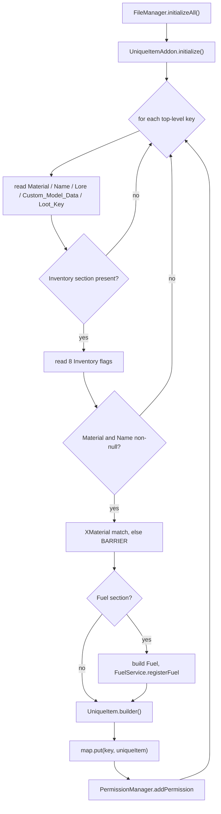

**State & persistence effects:** in-memory `Map<String, UniqueItem>` only; permissions registered with Bukkit; fuel
definitions pushed into `FuelService`. Nothing is written to disk or the database.

**Edge cases & guards observed:** three silent `continue`s (missing `Inventory`, missing `Material`, missing `Name`);
unknown material becomes `BARRIER` with no warning; `material.get()` can return `null` for a material unsupported on
the running server, which is not checked (`:146`); `clear()` (`:73-75`) empties only the item map, not `FuelService`.

---

### W2: item-reference string → `ItemStack` (the `ItemParser` path)

**Trigger:** any loader that resolves an item reference — `InventoryRuntimeContext` slot items,
`YamlCopConfigProvider.parseItem` / `YamlCiviliansConfigProvider.parseItem`, `CivilianNpc`, `LootChestManager` drops.

**Steps:**
1. `ItemParser.parse(itemString)` (`ItemParser.java:22`) — returns `null` for null/blank.
2. `ATTRIBUTE_PATTERN` `\{([^}]+)}` `.find()` (`:26-28`) — only the **first** `{…}` group is parsed.
3. `KEY_VALUE_PATTERN` `(\w+)=([^,}]+)` loops over that group, filling a `HashMap<String,String>` (`:30-37`).
   Values terminate at the first comma.
4. `matcher.replaceAll("")` strips **all** brace groups from the string (`:40`).
5. `split(":", 2)` → `type = parts[0].toUpperCase()`, `modifier = parts[1]` (case preserved) (`:43-45`).
6. `getConverter(type)` (`:55-64`): if the registry has no converter for the type, try `Material.valueOf(type)`
   (raw Bukkit enum, **not** XMaterial) and fall back to the `material` converter; otherwise
   `registry.getConverter(type)` — which returns `null` for anything unknown.
7. `converter.convert(type, modifier, attributes)` (`:51`).
8. Domain converter resolves its registry entry and calls the domain's own `buildItem()`
   (`WeaponConverter:22-30` → `weapon.clone().buildItem()`; `AmmunitionConverter:23-30`; `WearableConverter:33-37`;
   `CarConverter:34-40`; `UniqueConverter:25-31`; `MaterialConverter:16-28` via XMaterial then `Material.valueOf`).
9. `ItemAttributes.applyAttributes(itemStack, attributes)` (`ItemAttributes.java:14-44`): `name` (colour-translated by
   `GanglandChatUtil.color`), `lore` (comma-split, trimmed, colour-translated), `color` (only when the meta is
   `LeatherArmorMeta`, via Keystone `Color.valueOf(...).getBukkitColor()`, `IllegalArgumentException` swallowed).
   Returns immediately when `attributes.isEmpty()` or `meta == null`.
10. `AmmunitionConverter` then re-applies a **stale** pre-attribute meta when the base item had no lore
    (`AmmunitionConverter.java:31,35-39`), overwriting whatever step 9 set.

Actual ItemStack construction (material, name, lore, enchants, flags, custom model data, NBT, skull, colour) happens
inside each domain's `buildItem()` on top of Keystone `ItemBuilder`:
`setDisplayName`/`setLore` (both colour-translate via `ChatUtil.color`, `ItemBuilder.java:84-108`, empty name becomes
`" "`), `addEnchantment` (`:110`, unsafe-level allowed), `addItemFlags` (`:116`), `setUnbreakable` (`:120`),
`setCustomModelData` (`:124`), `setMaxStackSize` (`:135`, a **no-op below 1.20.5**, otherwise stored as the NBT tag
`max_stack_size`), `setDurability` (`:180`, casts the `Damageable` back to `ItemMeta` — safe because it came from
`getItemMeta()`), `customHead(String|UUID|OfflinePlayer)` (`:199-224`, XSkull, no-op unless the material is
`PLAYER_HEAD`), and `addTag` (`:247-280`, runtime-type dispatch, `null` stored as the literal string `"null"`).

**Diagram:**
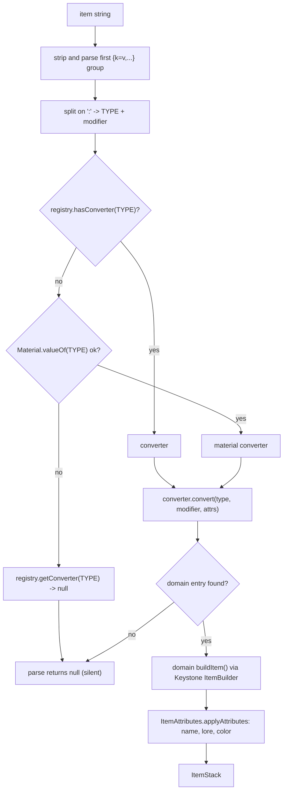

**State & persistence effects:** none — pure construction. Weapon and unique converters build a *clone* of the
registry template so the registered definition is never mutated.

**Edge cases & guards observed:** every failure path returns `null` with no log line; `{}` attributes cannot carry a
comma (so multi-line lore via `{lore=a,b}` truncates at `a`); a second `{…}` group is stripped but never parsed;
`Material.valueOf` in `getConverter` bypasses XMaterial so a legacy/renamed material name that `MaterialConverter`
*could* resolve is rejected earlier; `applyAttributes` is a no-op for items whose meta is null.

---

### W3: DSL path — `ItemDslAdapter` (currently unused in production)

**Trigger:** a loader calling `reader.get("Item").asDsl(adapter.asDslParser())`. Grep finds **no production caller** —
the only references are in `gangland-infra/gangland-item/src/test/.../dsl/ItemDslAdapterTest.java`.

**Steps:**
1. `asDslParser()` (`ItemDslAdapter.java:126-134`) → `BracketedAttrsParser.parse(raw, scalarLoc, report)` → `DslValue`.
2. `apply(value, report)` (`:83`): empty head → `ConfigIssue` `item.missing_type` at the scalar's `file:line:col`.
3. `head.split(":", 2)` → type + modifier (**case preserved**, unlike `ItemParser`).
4. `resolveConverter` (`:136-145`): registry hit, else `Material.valueOf(type.toUpperCase())` → `material` converter,
   else `null` → `item.unknown_type` ERROR.
5. Attributes flattened to `Map<String,String>` (`:43-51`) and wrapped in Keystone's `TrackingStringMap` so reads are
   recorded.
6. `converter.convert(type, modifier, attrs)`; then `reportUnknownAttributes` (`:58-72`) emits a `dsl.unknown_attr`
   WARNING for every attribute the converter never touched, with a `SpellCheckerSuggest.best(key, touched, 2)`
   "did you mean" hint.
7. A `null` result adds `item.conversion_failed` ERROR (`:114-118`).

**Diagram:**
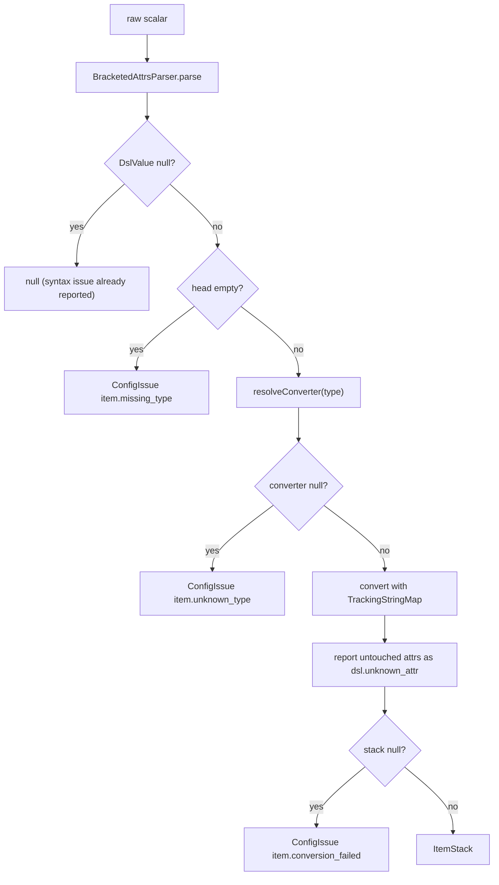

**State & persistence effects:** none; it only appends to a `ConfigReport`.

**Edge cases & guards observed:** the class javadoc advertises `DIAMOND_SWORD{custom_model_data=1021}`, but no
converter in the tree reads `custom_model_data` — `ItemAttributes` handles only `name`, `lore`, `color`, so that
example silently produces a plain diamond sword *and* now a `dsl.unknown_attr` warning. Nested attribute maps are not
tracked (documented, `:53-57`).

---

### W4: `ItemStack` → canonical `kind:value` id

**Trigger:** shop valuation and category matching — `SellCategory.matches/matchingTemplate`,
`BarterCategory.matches/matchingTemplate` (`gangland-ui/shop-api/.../shop/`), `CategorySellValuator`,
`CategoryBarterValuator`.

**Steps:**
1. `ItemSerializerRegistry.serialize(stack)` (`ItemSerializerRegistry.java:28`) — `null` stack → `null`.
2. Walk entries in registration order (`ItemConfig.java:145-151`): UNIQUE → WEAPON → AMMUNITION → WEARABLE → CAR →
   MONEY → MATERIAL.
3. Each predicate is `ItemPredicates.<KIND>` (`ItemPredicates.java:27-38`), i.e. `new ItemBuilder(stack).hasNBTTag(tag)`
   for the domain's marker tag; `MATERIAL` is `stack != null && type != AIR`.
4. First matching predicate → `serializer.extract(stack)` reads the same tag via `getStringTagData`.
5. Empty/null extraction → **continue to the next entry** (`:37-39`), so a weapon-tagged stack whose tag is empty
   degrades to `material:<type>`.
6. Result: `kind.label() + ":" + value.toLowerCase()` (`:40`).

**Diagram:**
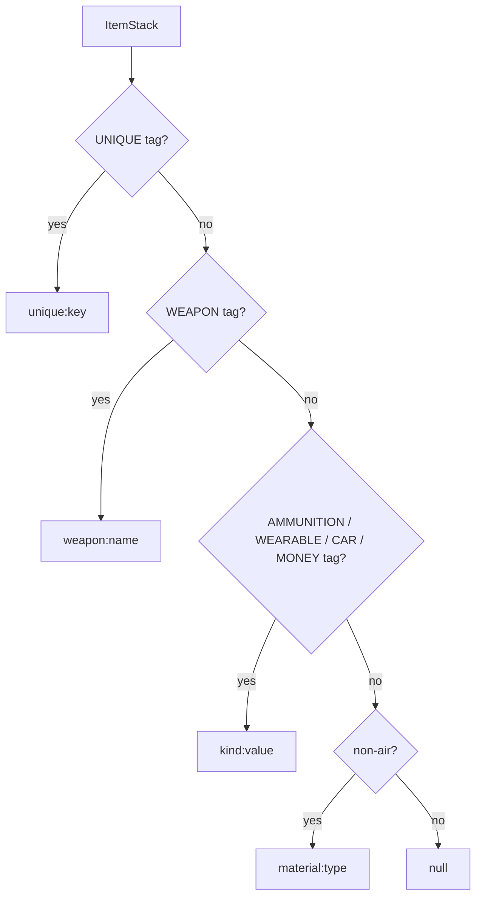

**State & persistence effects:** none; the ids are used for equality-matching against shop templates.

**Edge cases & guards observed:** `.toLowerCase()` on the extracted value means a registry key with any uppercase
character will not round-trip back through `ItemParser`; `MoneyItemSerializer` substitutes `"default"` for a
marker-tagged stack with no variation tag (`MoneyItemSerializer.java:25-27`); `ItemPredicates.hasTag` does **not**
guard AIR, so serializing an AIR stack drives six NBTAPI reads that the reflective accessor catches and `log.warn`s
(`ReflectiveNbtApiAccessor.java:120-131`).

---

### W5: refresh / decorate — factory-fresh delivery

**Trigger:** shop purchase (`ShopPurchaseService.purchase`), barter (`ShopBarterService`), trader sell/trade-in views
(`BarterView`, `SellView` in cops-n-crooks), and the shop admin editor views.

**Steps (refresh, player ← shop):**
1. `ShopPurchaseService.purchase` (`gangland-ui/shop-api/.../transaction/ShopPurchaseService.java:32`) checks balance,
   withdraws, then loops `copies` times.
2. `refresherRegistry.refresh(entry.getItem(), player)` per copy (`:49`) — each copy is rebuilt independently.
3. `ItemRefresherRegistry.refresh` (`ItemRefresherRegistry.java:28-39`): `null`/AIR → returns the **source itself**;
   otherwise walk refreshers in registration order — `WeaponRefresher`, `WearableRefresher`, `UniqueItemRefresher`,
   `AmmunitionItemRefresher`, `CarItemRefresher` (`ItemConfig.java:189-190`) — first `canRefresh` whose `refresh`
   returns non-null wins; else `source.clone()`.
4. Each refresher reads its marker tag, looks the definition up in its service, calls `buildItem(context)` (or
   `buildItem()` when `context == null`), and copies the source's `getAmount()` onto the fresh stack
   (`WeaponRefresher.java:34-45`, `WearableRefresher.java:30-40`, `UniqueItemRefresher.java:29-39`,
   `CarItemRefresher.java:30-40`). `AmmunitionItemRefresher` ignores the player entirely and calls
   `ammunition.buildItem(null, source.getAmount())` (`:38`), plus a display-name fallback match when the NBT tag is
   missing (`:53-63`).
5. Delivery: `player.getInventory().addItem(delivery)`, leftovers `dropItemNaturally` at the player's feet
   (`ShopPurchaseService.java:53-54`).

**Steps (decorate, shop ← player):**
1. `ItemRefresherRegistry.decorate` (`:45-56`) mirrors `refresh` but calls `ItemRefresher.decorate`.
2. No gangland refresher overrides `decorate`, so the **default** runs (`ItemRefresher.java:50-70`): build factory-fresh
   via `refresh`, then copy the source's `Damageable#getDamage` and re-apply `source.getEnchantments()` with
   `addUnsafeEnchantment`.

**Diagram:**
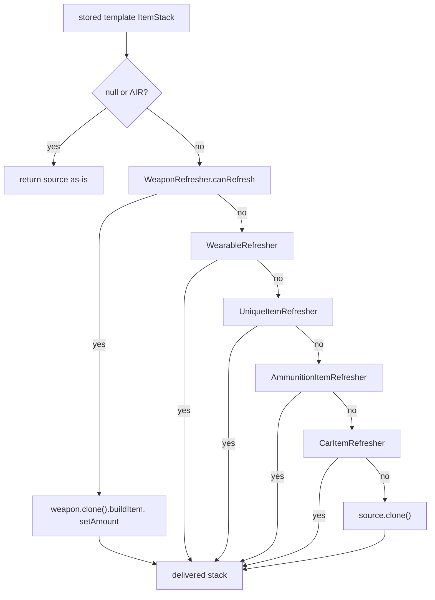

**State & persistence effects:** the delivered stack replaces whatever runtime NBT the stored template carried (ammo
counts, fuel level, car owner, durability). `decorate` restores only vanilla damage and enchantments.

**Edge cases & guards observed:** refresher order (weapon first) is the **opposite** of serializer order (unique
first) — a unique item that also carries a weapon tag is rebuilt as a plain weapon and loses its `uniqueItem` tag;
`refresh` on AIR returns the shared instance rather than a copy, contradicting the registry javadoc; a unique item
whose key was deleted from the YAML falls through to `source.clone()` (graceful).

---

### W6: unique-item identity and lookup from an `ItemStack`

**Trigger:** every listener and command that has a stack in hand.

**Steps:**
1. `UniqueItemUtil.isUniqueItem(stack)` (`UniqueItemUtil.java:11-15`) — `false` for null/AIR, otherwise
   `new ItemBuilder(stack).hasNBTTag("uniqueItem")`.
2. `UniqueItemUtil.getUniqueItemKey(stack)` (`:17-22`) — `getStringTagData("uniqueItem")`.
3. `UniqueItemRegistry.getUniqueItem(key)` → `UniqueItemAddon.getUniqueItem` → `map.get(key)` (may be `null` for a
   stack whose definition was removed).
4. The tag is written at build time by `UniqueItem.buildItem` (`UniqueItem.java:102`,
   `itemBuilder.addTag(UniqueItemKeys.UNIQUE_ITEM_KEY, uniqueItem)`), alongside the optional `loot_key` tag (`:104-106`)
   and the three fuel tags stamped by `Fuel.stampNBT` (`fuel/Fuel.java:187-191`).
5. A separate, **display-name based** identity path exists: `UniqueItem.compareTo(ItemStack)` (`:64-79`) compares the
   raw config `name` to `meta.getDisplayName()` and then the materials. It is used by `UniqueItemUtil.hasUniqueItem`
   (`:24-37`), `LoadUniqueItem.removeItem` (`:95-107`) and `UniqueItemAddon.compare` (`:78-80`).

**Diagram:**
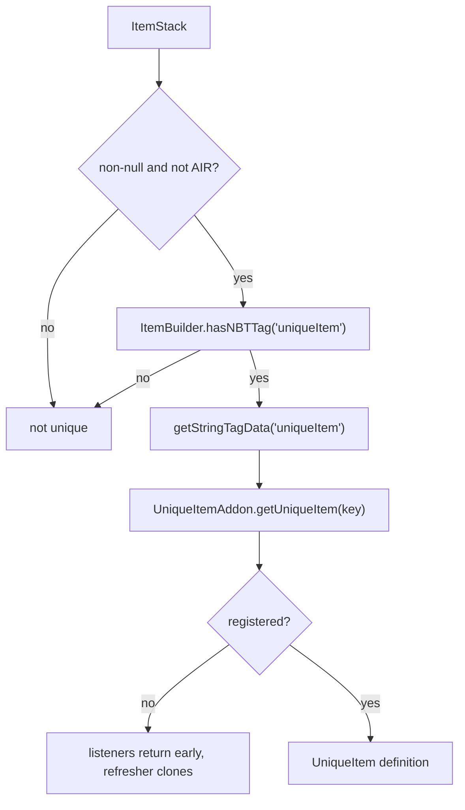

**State & persistence effects:** none.

**Edge cases & guards observed:** with NBTAPI absent every stack reads as non-unique (writes dropped, reads null), so
the whole unique-item feature silently disables; `compareTo` returns `0` both for "identical" and for "no meta / not a
unique item", and it compares an uncoloured, unresolved config `Name` against the built item's coloured,
placeholder-resolved display name, so it effectively never reports a match on a real stack.

---

### W7: granting unique items on join / respawn / undown

**Trigger:** `PlayerItemInitEvent` (bridged from `UserDataInitEvent`), `PlayerRespawnEvent`, `PlayerUndownedEvent`.

**Steps:**
1. `PlayerItemInitBridgeListener.onUserDataInit` (`:19-22`) re-fires the event preserving `isAsynchronous()`.
2. `LoadUniqueItem.onJoinGiveItem` (`LoadUniqueItem.java:34-57`) builds a `Runnable` and, when the event is async,
   hops it to the main thread with `Bukkit.getScheduler().runTask(plugin, …)`.
3. Per registered item: skip unless `isAddOnJoin()` **and** `isAddToInventory()`; skip when
   `UniqueItemUtil.hasUniqueItem(player, uniqueItem) && !isAllowDuplicates()` (`:46`).
4. `UniqueItem.addItemToInventory(player)` (`UniqueItem.java:81-84`) → `!addItem(player, inventorySlot)`.
5. `addItem` (`:129-146`): reject when `slot >= inventory.getSize() || slot > 35`; if the slot is occupied and
   `overridesSlot` → overwrite, else **recurse into slot+1**; if free → `createItem`.
6. `createItem` (`:148-152`) → `inventory.setItem(slot, buildItem(player))` (placeholders resolved for that player).
7. `onPlayerRespawn` / `onPlayerUndowned` (`:72-80`) call `giveRespawnItems`, the same loop gated on `isAddOnRespawn()`.

**Diagram:**
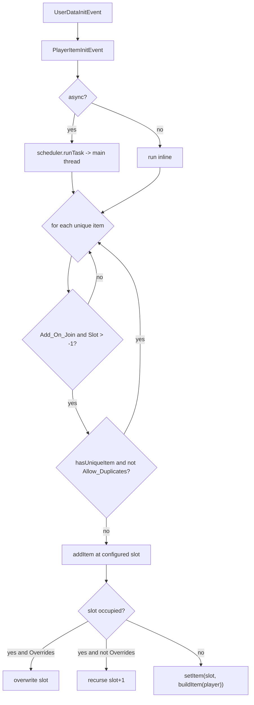

**State & persistence effects:** mutates the live player inventory. No persistence; items are re-granted every join.

**Edge cases & guards observed:** `PlayerRespawnEvent` runs at default priority, so the inventory write happens before
the respawn completes on some paths (unverified whether items survive); `addItemToInventory` returns the **negation**
of success (`UniqueItem.java:83`), though no caller reads it; the duplicate guard depends on `hasUniqueItem`, whose
loop `continue`s on a match (see Observations) so it reports the opposite of what its name implies.

---

### W8: removing unique items when a player is downed

**Trigger:** `PlayerDownedEvent` (gangland-core downed registry).

**Steps:**
1. `LoadUniqueItem.onPlayerDowned` (`:59-70`) iterates all registered items.
2. Skip unless `isDroppable()`; skip unless `UniqueItemUtil.hasUniqueItem(player, uniqueItem)`.
3. `removeItem(player, uniqueItem)` (`:95-107`) walks `inventory.getContents()`; for each non-null slot it
   `continue`s when `uniqueItem.compareTo(contents[i]) == 0`, otherwise `inventory.setItem(i, null)` and breaks unless
   `isAllowDuplicates()`.

**Diagram:**
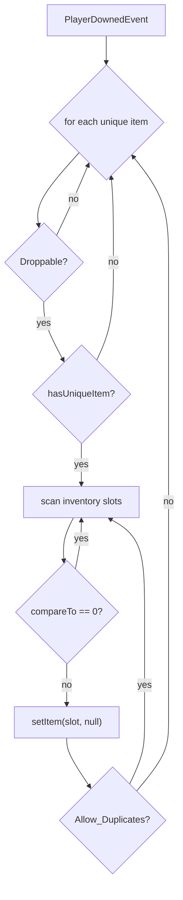

**State & persistence effects:** destructive inventory mutation — the slot is nulled, not dropped as an entity.

**Edge cases & guards observed:** the `compareTo == 0 → continue` branch means the method deletes the first slot that
does **not** match the target item; combined with `compareTo`'s colour-code mismatch (W6) it deletes an arbitrary
inventory slot. See Observations #2.

---

### W9: movement, drop and death-drop restriction

**Trigger:** `InventoryClickEvent`, `PlayerDropItemEvent`, `PlayerDeathEvent`.

**Steps (click, `UniqueItemInventoryRestrict.java:27-57`):**
1. `getClickedInventory()`; null → return.
2. `getCurrentItem()`, falling back to `getCursor()` when null.
3. Return on AIR-named types or `amount == 0`; return unless the clicked inventory `equals` the clicker's own
   inventory **and** its type is `PLAYER`.
4. `UniqueItemUtil.isUniqueItem` → read `"uniqueItem"` (a **hard-coded string literal**, not `UniqueItemKeys`) →
   registry lookup; return when unregistered or `isMovable()`; otherwise `setCancelled(true)`.

**Steps (drop, `:77-92`):** read the dropped stack, resolve the definition, cancel unless `isDroppable()`.

**Steps (death, `:59-75`):** when the world's `KEEP_INVENTORY` gamerule is true, remove **every** unique item from
`event.getDrops()`; otherwise remove only those whose definition exists and has `dropOnDeath == false`.

**Diagram:**
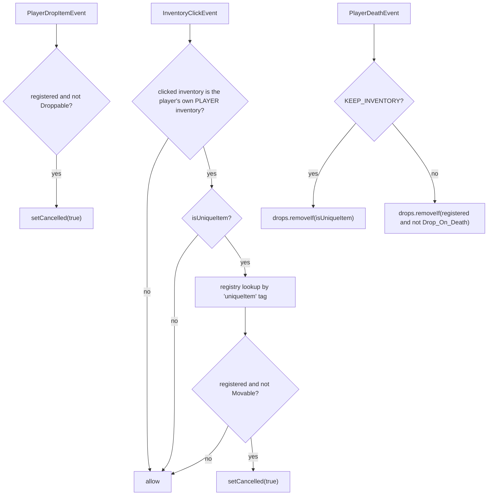

**State & persistence effects:** cancels events / mutates the death drop list. Items removed from drops are
**destroyed**, not preserved.

**Edge cases & guards observed:** `InventoryDragEvent` is never handled (the "cursor item (for drag operations)"
comment sits on a click handler); hotbar number-key swaps into an open container click the *top* inventory, so the
swapped hotbar slot is never inspected; a non-registered unique item is fully unrestricted; with `KEEP_INVENTORY` on,
even `Drop_On_Death: true` items are stripped from the drop list.

---

### W10: right-clicking a unique item opens an inventory

**Trigger:** `PlayerInteractEvent`.

**Steps:**
1. `UniqueItemInteract.onUniqueItemInteract` (`UniqueItemInteract.java:24-43`) — `event.getItem()` null → return;
   not a unique item → return. No `ignoreCancelled`, so `RIGHT_CLICK_AIR` still arrives.
2. Read the `"uniqueItem"` tag (again a literal) and look up the definition.
3. **Return when the definition exists and `!isMovable()`** (`:36-38`).
4. `interactionService.tryHandleInteract(player, key, action)`.
5. `GanglandUniqueItemInteractionService.tryHandleInteract`
   (`gangland-impl/.../item/contract/GanglandUniqueItemInteractionService.java:20-32`): blank key → false;
   `definitionStore().getUniqueItemHandler(key)` → null → false; `handler.isActionAllowed(action)` → false → false;
   `handler.permission()` non-null and not held → false; else `runtimeContext.openInventoryForPlayer(player,
   handler.inventoryName())` and return true.
6. On `true` the listener cancels the event.
7. Handlers are registered from inventory YAML: `InventoryRuntimeContext.registerUniqueItemHandler` (`:273-284`) reads
   `Open.Event` → requires an `OnItemClick` key → `UniqueItem:` key → `InventoryParser.parseActions(eventSection)`.

**Diagram:**
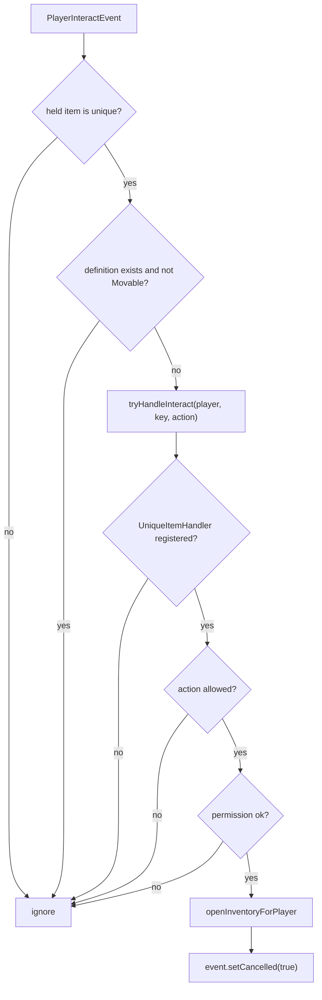

**State & persistence effects:** opens a GUI; no data change.

**Edge cases & guards observed:** gating interaction on `Movable` conflates "can be shuffled in the inventory" with
"can be used" — a locked-in-place item (`Movable: false`) can never be right-clicked; `InventoryParser.parseActions`
reads `Action` off the **`Open.Event`** section while `inventory/phone.yml:7-9` nests it under `OnItemClick`, so the
configured action is ignored and the fallback `RIGHT_CLICK_AIR + RIGHT_CLICK_BLOCK` is always used
(`InventoryParser.java:111-128`); `event.getHand()` is not checked.

---

### W11: `/glw item unique …`

**Trigger:** player command.

**Steps (give):**
1. Dispatch through Keystone `Command.runExecute` — permission then the `user` (player-only) gate
   (`Keystone/.../command/Command.java:76-87`), so the `(Player) sender` casts in the sub-arguments are safe.
2. `ItemUniqueGiveCommand.uniqueGive` (`:50-99`) chains two `OptionalArgument`s: `<name>` (tab-completes
   `uniqueItemAddon.getUniqueItems().keySet()`) → `<amount>` (completes the literal `"<amount>"`).
3. `args[3]` is the name, `args[4]` the amount; a non-numeric amount replies `MUST_BE_NUMBERS`.
4. `giveUniqueItem(player, name, amount)` (`:102-135`): registry lookup (miss → `ITEM_UNIQUE_INVALID`);
   `sampleItem.getMaxStackSize()`; `slots = ceil(amount / maxStackSize)`; build one stack per slot with
   `buildItem(player)` and `setAmount`; `inventory.addItem(items)`; leftovers `dropItemNaturally`.
5. Success → `ITEM_UNIQUE_GAVE` with `%name%`/`%amount%`.

**Steps (info):** `ItemUniqueInfoCommand` (`:36-67`) reads `getItemInMainHand`; not unique → `ITEM_UNIQUE_NOT_UNIQUE`;
key not registered → `ITEM_UNIQUE_NOT_REGISTERED` with `%key%`; else prints key/name/material/join/respawn/death
through `JsonFormatter`.

**Steps (list):** `ItemUniqueListCommand` (`:28-45`) prints `ITEM_UNIQUE_LIST_HEADER` then the comma-joined
**display names**.

**Diagram:**
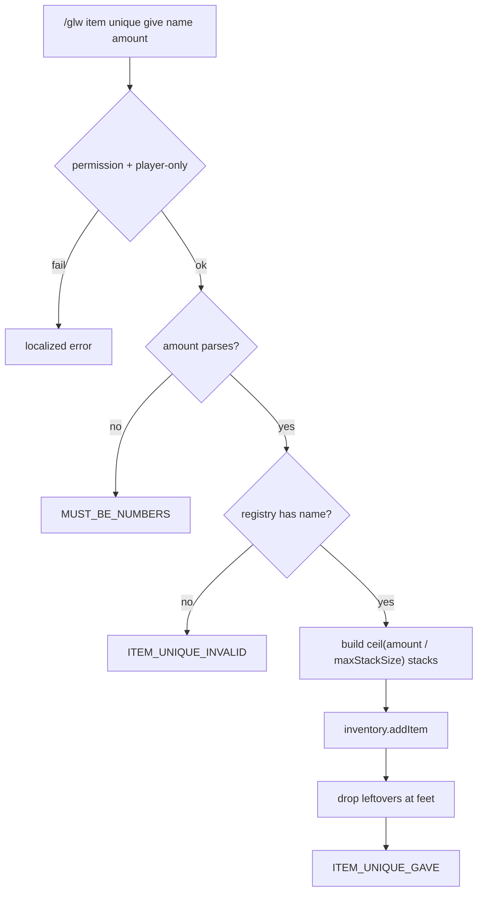

**State & persistence effects:** mutates the sender's inventory; may spawn dropped item entities.

**Edge cases & guards observed:** `give` always targets the sender — there is no player argument, contrary to what a
"give" command usually implies; `amount <= 0` produces a zero-length array, an empty `addItem`, and still reports
success; `commands.json` documents `item unique info <name>` while the implementation takes no argument and reads the
main hand; `list` prints display names, which are not valid `give` arguments (those are keys).

---

### W12: unique item as a loot-chest key (`loot_key`)

**Trigger:** a player opening a KEY/LOCKPICK-tier loot chest.

**Steps:**
1. `UniqueItem.buildItem` stamps `loot_key` when `Loot_Key` is configured (`UniqueItem.java:104-106`).
2. `LootChestService` (`gangland-ui/lootchest-api/.../LootChestService.java:631` and `:652`) scans the inventory for
   `builder.hasNBTTag("loot_key") && itemKey.equals(builder.getStringTagData("loot_key"))` and consumes one unit.
3. `LootTier.unlockItemId` supplies `itemKey` (`lootchest-api/.../data/LootTier.java:6`).

**Diagram:**
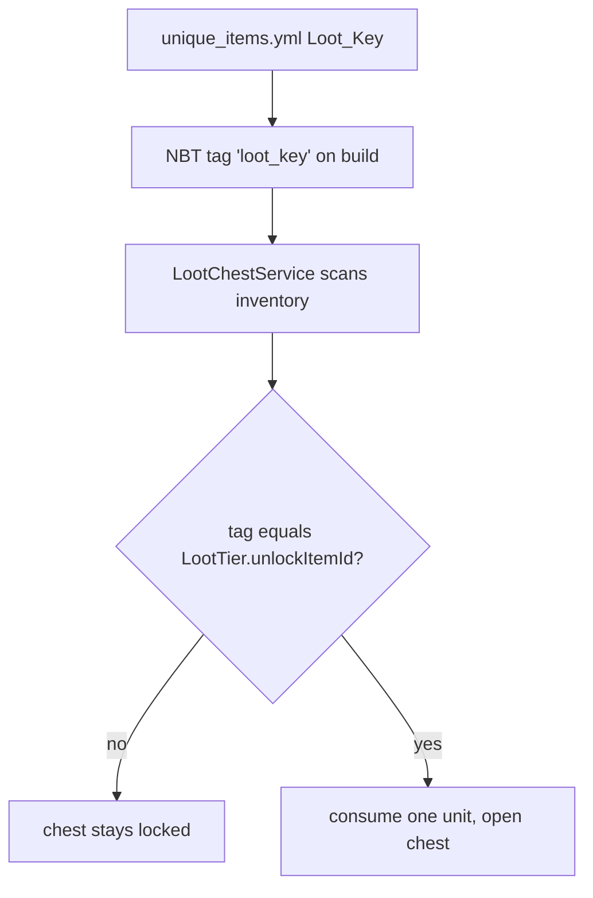

**State & persistence effects:** consumes an item from the player's inventory.

**Edge cases & guards observed:** `"loot_key"` is a bare string literal in three places (one writer, two readers) with
no shared constant; the tag is written only at build time, so a stack that predates adding `Loot_Key` to the YAML will
never match until it is re-built.

## Cross-feature Dependencies

- **Depends on:**
  - Keystone `keystone-item` (`ItemBuilder`, `NbtBridge`, `ReflectiveNbtApiAccessor`), `keystone-persistence`
    (`FileManager`, `FileHandler`, `FileInitializer`, the config DSL used by `ItemDslAdapter`), `keystone-bean`
    (`@Configuration`/`@Bean`/`@ListenerHandler`/`@AutowireTarget`), `keystone-command`, `keystone.permission`,
    `keystone.util.Placeholder`, `keystone.color.Color`, `keystone.util.ChatUtil`.
  - XSeries `XMaterial` (material resolution) and, through `ItemBuilder`, `XSkull` for skull textures.
  - NBTAPI (required plugin) — without it every custom tag silently vanishes.
  - Feature modules for converter/serializer/refresher targets: `gangland-weapon` (`WeaponService`, `WeaponTag`,
    `Ammunition`, `WearableService`), `gangland-gadget` (`CarManager`/`CarAddon`, `CarKey`, `FuelService`),
    `gangland-item.money` (`MoneyAddon`, `MoneyItemUtil`), `gangland-core` (`PlayerDownedEvent`,
    `PlayerUndownedEvent`).
  - `gangland-impl` inventory framework (`InventoryRuntimeContext`, `InventoryDefinitionStore`, `UniqueItemHandler`).
- **Depended on by:**
  - `gangland-ui/shop-api` — `ItemRefresherRegistry` (purchase, barter, admin views) and `ItemSerializerRegistry`
    (sell/barter category matching and valuation).
  - `gangland-features/cops-n-crooks` — `ItemParser` in `CopLoader`/`YamlCopConfigProvider`,
    `CiviliansLoader`/`YamlCiviliansConfigProvider`/`CivilianNpc`/`CivilianNpcFactory`,
    `CivilianDeathListener`; `ItemRefresherRegistry` in `BarterView`/`SellView`.
  - `gangland-ui/lootchest-api` — `ItemParser` for drop entries; the `loot_key` tag for unlock items.
  - `gangland-impl` inventory framework — `ItemParser` for slot items.

## Observations & Potential Issues

| # | Location | Observation | Risk | Confidence |
|---|---|---|---|---|
| 1 | `gangland-infra/gangland-item/.../item/unique/UniqueItemUtil.java:31` | `hasUniqueItem` does `if (uniqueItem.compareTo(item) == 0) continue;` — it **skips** the matching item and returns `true` only for a *different* unique item of the same material. The predicate is inverted. | The `Allow_Duplicates: false` guard in `LoadUniqueItem:46` and `:89` never fires, so a fresh copy is granted on every join, respawn and undown; with `Overrides: false` each copy lands in the next free slot, filling the inventory with phones. | High |
| 2 | `gangland-infra/gangland-item/.../item/listener/unique/LoadUniqueItem.java:101` | `removeItem` has the same inversion: `if (uniqueItem.compareTo(contents[i]) == 0) continue;` then `inventory.setItem(i, null)`. It nulls the first slot that does **not** match. | Silent destruction of an arbitrary inventory slot when a player is downed while holding a droppable unique item. | High |
| 3 | `gangland-infra/gangland-item/.../item/unique/UniqueItem.java:73` | `compareTo` compares the raw config `name` (`&`-codes, unresolved placeholders) with `meta.getDisplayName()` (§-translated, placeholders resolved by `ItemBuilder.setDisplayName` → `ChatUtil.color`). | The comparison effectively never returns 0 for a real built stack, so the two bugs above always take their wrong branch. Identity should read the `uniqueItem` NBT tag. | High |
| 4 | `gangland-impl/.../item/converter/AmmunitionConverter.java:31,35-39` | `meta` is captured **before** `applyAttributes` and written back afterwards when the original had no lore. | `ammunition:x{name=Custom}` silently loses the custom name (and any colour) for ammo whose template has no lore. | High |
| 5 | `gangland-impl/.../config/ItemConfig.java:145-151` vs `:189-190` | Serializer order puts UNIQUE first ("unique wins over the wrapped domain"), refresher order puts WEAPON/WEARABLE before UNIQUE. | A unique item that also carries a weapon/wearable tag is *identified* as unique but *rebuilt* as a plain weapon, dropping the `uniqueItem` tag on every shop delivery. | Medium |
| 6 | `gangland-infra/gangland-item/.../item/ItemRefresher.java:50-70` (default `decorate`), no overrides in `gangland-impl/.../item/refresher/` | `decorate` restores only vanilla damage and enchantments; custom NBT runtime state (weapon ammo counter, `fuel_current`, use counters, `car_owner`) is reset to factory values. | Sell / trade-in flows treat a spent item as pristine — a possible value exploit and a state-loss bug. The javadoc explicitly asks implementations to override; none do. | Medium |
| 7 | `gangland-infra/gangland-item/.../item/listener/unique/UniqueItemInventoryRestrict.java` | Only `InventoryClickEvent` is handled; `InventoryDragEvent` is absent, and a hotbar number-key swap while a container is open clicks the *top* inventory, so the swapped hotbar slot is never inspected. | Non-`Movable` unique items can be moved into containers via drag or number-key swap. | Medium |
| 8 | `.../UniqueItemInventoryRestrict.java:61-64` | With `KEEP_INVENTORY` on, **all** unique items are removed from `getDrops()` regardless of `Drop_On_Death`. Without it, items with `dropOnDeath == false` are removed from drops, which destroys them (they are not returned to the player). | An item with `Drop_On_Death: false` and `Add_On_Respawn: false` is permanently lost on death. | Medium |
| 9 | `gangland-impl/.../item/configuration/UniqueItemAddon.java:89,103,116` | Three silent `continue`s (no `Inventory` section, no `Material`, no `Name`) and `orElse(XMaterial.BARRIER)` at `:119`. Nothing is logged at WARN. | An admin typo makes an item vanish from the registry or become a BARRIER with no diagnostic. | High |
| 10 | `gangland-impl/.../item/configuration/UniqueItemAddon.java:146` | `material.get()` (XMaterial → Material) can return `null` on a server where the material does not exist; the result is passed straight into `UniqueItem.material`. | `new ItemBuilder(null)` → `new ItemStack(null)` NPE the first time the item is built. | Medium |
| 11 | `gangland-infra/gangland-item/.../item/ItemParser.java:17` | `KEY_VALUE_PATTERN` value class is `[^,}]+`, so any attribute value containing a comma truncates — including the multi-line `lore` that `ItemAttributes.java:29` splits on commas. | Multi-line lore via `{lore=a,b}` is unreachable through `ItemParser`; only the first line survives. | High |
| 12 | `gangland-infra/gangland-item/.../item/ItemParser.java:40` | `matcher.replaceAll("")` strips **every** `{…}` group, but only the first was parsed. | A second attribute group is silently discarded. | Medium |
| 13 | `gangland-infra/gangland-item/.../item/ItemParser.java:58` | `Material.valueOf(type)` (raw enum) decides the material fallback, while `MaterialConverter:17` resolves through XMaterial. | A material name XMaterial can resolve but the running `Material` enum cannot (legacy/renamed) is rejected before it reaches the converter. | Medium |
| 14 | `gangland-impl/.../item/ItemAttributes.java:14-44` | Supported attributes are only `name`, `lore`, `color`. `ItemDslAdapter`'s javadoc (`:29`) advertises `custom_model_data`, and no converter reads `amount`, enchantments, item flags, unbreakable or skull texture. | Documented DSL attributes are silently ignored (and now flagged as `dsl.unknown_attr`); NBT/model-data cannot be expressed in an item reference. | High |
| 15 | `gangland-impl/.../item/ItemAttributes.java:34-41` | `color` accepts only Keystone `Color` enum names, only on `LeatherArmorMeta`, and swallows `IllegalArgumentException`. | Hex colours and non-leather dyed items fail silently. | Medium |
| 16 | `gangland-infra/gangland-item/.../item/dsl/ItemDslAdapter.java` (whole class) | Referenced only from `ItemDslAdapterTest`; no production caller and no `@Bean` in `ItemConfig`. | The located-error path advertised in the javadoc is not actually in use — every production item reference still fails silently via `ItemParser`. | High |
| 17 | `gangland-infra/gangland-item/.../item/ItemParser.java` etc. vs `Keystone/keystone-item/.../item/` | Keystone 1.7.3 ships a parallel `ItemParser`/`ItemKind`/`ItemConverterRegistry`/`ItemSerializerRegistry`/`ItemRefresher*`/`MaterialItemSerializer` (plus `StandardItemKind`) that Gangland does not import. | Two diverging copies of the same framework; Keystone's copy has unit tests the Gangland copy lacks. Adoption is a pending migration item. | High |
| 18 | `gangland-impl/.../item/ItemPredicates.java:43-47` | `hasTag` does not guard AIR; `ItemSerializerRegistry` calls up to six predicates before the MATERIAL catch-all. | Serializing an AIR stack triggers six NBTAPI reads that `ReflectiveNbtApiAccessor:120-131` catches and `log.warn`s — potential log spam in shop matching loops. | Medium |
| 19 | `gangland-infra/gangland-item/.../item/ItemRefresherRegistry.java:29` and `:46` | `refresh`/`decorate` return the **source instance** (not a clone) for null/AIR, contradicting the class javadoc's "call-sites can always rely on getting a safe-to-deliver copy". | A shared instance can leak into a player inventory if a shop entry is AIR. | Low |
| 20 | `gangland-infra/gangland-item/.../item/ItemSerializerRegistry.java:40` | The extracted value is lowercased unconditionally. | A registry key with uppercase characters serialises to an id that `ItemParser` cannot convert back. | Medium |
| 21 | `gangland-infra/gangland-item/.../item/unique/UniqueItem.java:83` | `addItemToInventory` returns `!addItem(...)` — `false` on success. | No caller reads it today, but the inverted contract is a trap for the next caller. | High |
| 22 | `gangland-infra/gangland-item/.../item/listener/unique/UniqueItemInteract.java:36-38` | Interaction is blocked when `!isMovable()`. | Conflates inventory mobility with usability: an item pinned to a slot can never be right-clicked. | Medium |
| 23 | `.../UniqueItemInteract.java:32`, `.../UniqueItemInventoryRestrict.java:50,70,85` | The literal `"uniqueItem"` is used instead of `UniqueItemKeys.UNIQUE_ITEM_KEY` in four places. | Renaming the constant silently breaks the listeners. | High |
| 24 | `gangland-impl/.../file/configuration/inventory/InventoryParser.java:113` vs `gangland-impl/src/main/resources/inventory/phone.yml:7-9` | `parseActions` reads `Action` from the `Open.Event` section; the YAML nests it under `Open.Event.OnItemClick`. | The configured `Action:` is dead config; the fallback (`RIGHT_CLICK_AIR` + `RIGHT_CLICK_BLOCK`) always applies, so `LEFT_CLICK` handlers cannot be configured. | Medium |
| 25 | `gangland-impl/.../command/sub/item/unique/ItemUniqueGiveCommand.java:109-112` | `slots = ceil(amount / maxStackSize)`; a zero or negative amount yields a zero-length array and an empty `addItem`, yet `giveUniqueItem` still returns `true`. | `/glw item unique give phone -5` reports "Gave phone x-5". | Medium |
| 26 | `commands.json` (`item_unique_info`) vs `ItemUniqueInfoCommand.java:42` | Documented as `info <name>`; the implementation reads the main-hand item and accepts no argument. | Misleading help text. | High |
| 27 | `gangland-impl/.../item/configuration/UniqueItemAddon.java:73-75` | `clear()` empties the item map but leaves `FuelService`'s registry populated. | Fuel definitions for items deleted from the YAML survive a reload. | Medium |
| 28 | `gangland-impl/.../item/configuration/UniqueItemAddon.java:167` / `UniqueItem.java:60-62` | `gangland.uniqueitem.<key>` permissions are registered but never checked anywhere in the codebase. | Dead permission surface; admins may assume it gates the item. | High |
| 29 | `gangland-infra/gangland-item/.../item/listener/unique/LoadUniqueItem.java:73-75` | `PlayerRespawnEvent` is handled at default priority and writes to the inventory synchronously during the event. | On some server builds inventory writes during `PlayerRespawnEvent` are overwritten by the respawn itself — unverified here. | Low |
| 30 | Keystone `NbtBridge` / `NoOpNbtAccessor` | Without NBTAPI, `addTag` is dropped and `hasNBTTag` returns `false` for everything. | The entire unique-item, weapon, wearable, car and money identity layer silently disables; `plugin.yml` lists NBTAPI as a hard dependency, so this only bites if the plugin's shape changes. | Medium |
| 31 | `gangland-impl/.../item/refresher/AmmunitionItemRefresher.java:53-63` | Fallback matching by coloured display name + material when the ammo NBT tag is missing. | Two ammo types sharing a material and display name are indistinguishable; a player-renamed vanilla stack can be mistaken for ammo. | Medium |
| 32 | `gangland-impl/.../item/refresher/CarItemRefresher.java` / `UniqueItemRefresher.java` | `refresh` rebuilds fuel to max (`Fuel.stampNBT` sets `fuel_current = maxFuel`) and drops `car_owner`. Correct for purchase, wrong for the `decorate` (player→trader) direction, which has no override. | A near-empty fuel can or car valued as full on trade-in. | Medium |

## Test Surface

- **Pure-logic candidates (plain JUnit, no Bukkit):**
  - `ItemConverterRegistry` — case-insensitive keys, the `ItemKind[]`/`String[]` overloads, overwrite semantics.
  - `ItemSerializerRegistry.serialize` — priority order, empty-extraction fallthrough, lowercasing, null stack
    (predicates and serializers are trivially fakeable, as Keystone's own `ItemSerializerRegistryTest` shows).
  - `ItemRefresherRegistry.refresh/decorate` — first-claim-wins ordering, null-returning refresher fallthrough, the
    AIR/null shortcut, and the default `decorate` contract.
  - `ItemParser` attribute regex — comma truncation, multiple brace groups, `type:modifier` splitting, the
    `Material.valueOf` fallback (needs a stubbed registry only).
  - `ItemDslAdapter` — already covered; extend with the `custom_model_data` case from its own javadoc.
  - `ItemKind` label stability (a guard test that labels match the serializer/converter registration strings).
- **Needs Bukkit/Keystone mocks (MockBukkit or Mockito over `ItemStack`/`ItemMeta`, plus an installed
  `ItemNbtAccessor` via `NbtBridge.install(...)`):**
  - `UniqueItem.buildItem` — name/lore colouring, `Custom_Model_Data > 0` gate, `uniqueItem`/`loot_key`/fuel tags,
    placeholder resolution with and without a player.
  - `UniqueItem.compareTo` / `UniqueItemUtil.hasUniqueItem` / `LoadUniqueItem.removeItem` — the three inverted
    predicates (#1–#3) are the highest-value regression tests in this area; `NbtBridge` has a `reset()`/`install()`
    seam and Keystone ships a `RecordingNbtAccessor` test double.
  - `UniqueItemAddon.registerUniqueItem` — the three silent-skip branches, BARRIER fallback, fuel registration,
    `clear()` semantics (needs a `FileHandler`/`YamlConfiguration` stub).
  - Converters — `applyAttributes` name/lore/colour, `AmmunitionConverter`'s stale-meta overwrite (#4),
    null-modifier and unknown-key paths.
  - Refreshers — `canRefresh` tag matching, amount preservation, `AmmunitionItemRefresher`'s display-name fallback.
  - `UniqueItemInventoryRestrict` / `UniqueItemInteract` — event cancellation matrices with mocked events.
  - `GanglandUniqueItemInteractionService` — the four early-return conditions against a mocked
    `InventoryRuntimeContext`.
- **Integration-only (real server):**
  - NBTAPI presence/absence behaviour end to end (tags surviving a restart, item stacking across a reload).
  - Join / respawn / downed / undown granting order, including the async→main-thread hop in
    `LoadUniqueItem.onJoinGiveItem`.
  - `PlayerDeathEvent` drop filtering under both `KEEP_INVENTORY` settings.
  - Hotbar-swap and drag movement of a non-`Movable` item into a container (#7).
  - Shop purchase / sell round-trip verifying refreshed ammo, fuel and car-owner state (#6, #32).
  - Cross-version NBT survival for the `max_stack_size` tag (`ItemBuilder.setMaxStackSize` is a no-op below 1.20.5).
- **Existing tests covering this area:**
  - `gangland-infra/gangland-item/src/test/java/org/luckyraven/gangland/item/dsl/ItemDslAdapterTest.java` — 11 tests
    on the DSL bridge (registered type, material fallback, `item.unknown_type`, `item.conversion_failed`,
    `item.missing_type`, `asDslParser` round-trip and syntax-error propagation, and four `dsl.unknown_attr` cases).
    This is the **only** test in the module; there are no tests for `ItemParser`, the registries, the converters, the
    refreshers, the serializers, `UniqueItem`, `UniqueItemAddon` or any of the three unique-item listeners.
  - Keystone's parallel copies are tested (`ItemParserTest`, `ItemConverterRegistryTest`,
    `ItemSerializerRegistryTest`, `ItemRefresherRegistryTest`, `ItemRefresherDecorateTest`,
    `MaterialItemSerializerTest`, and five `ItemBuilder*Test` classes) — those tests do **not** exercise Gangland's
    copies, but they are a ready-made template if the migration in #17 goes ahead.

---

[Audit index](workflow-audit) · [← Commands & Messages](workflow-audit-02-commands-messages-platform) · [GUI & Scoreboard →](workflow-audit-04-ui-inventory-scoreboard)
