# Inventory GUI Framework, Phone, Scoreboard & Holograms

<!-- preface:start -->
> **How to use this file.** This is a code-traced audit of *Inventory GUI Framework, Phone, Scoreboard & Holograms* in Gangland Warfare, taken on
> 2026-09-02 from branch `0.8.1` (Keystone 1.7.3). It describes what the code **does today**, workflow by workflow,
> so an agent can fix a bug, tweak behaviour, plan a feature, or write tests without re-tracing the system.
>
> - **Citations are pointers, not proof.** Every `File.java:line` was checked after writing, but the code moves.
>   Before you change anything, open the cited file and grep the symbol named in the sentence; trust the class and
>   method names over the line number. A citation ending in `:line-unverified` could not be re-located.
> - **Observations are findings, not confirmed bugs.** Each row carries the tracer's confidence. Rows prefixed
>   `WITHDRAWN:` were disproved during verification and are kept only so the numbering stays stable. Reproduce a
>   High-risk row in code (or a test) before fixing it.
> - **Sections.** *Components* names the classes; *Configuration & Data* the YAML keys, tables and message keys;
>   *Workflows* (`W1`, `W2`, …) the execution paths with trigger, steps, diagram, persistence effects and guards;
>   *Cross-feature Dependencies* what breaks elsewhere if you change this; *Test Surface* what can be unit-tested
>   with plain JUnit/Mockito versus what needs Bukkit/Keystone mocks or a live server.
> - **Conventions live elsewhere.** For *how* to add or change code in this repo, follow `CLAUDE.md` at the repo
>   root (Spigot-only APIs, method-brace style, Keystone at provided scope, the SQLite test teardown rules), the
>   `command-create` and `panel-create` skills for new commands and GUI panels, and the feedback rules in the
>   project memory (YAML key style, `SoundEffect` for sounds, `ItemRefresher` per item type, `setDataSupplier`
>   for every repository, no Paper APIs).
> - **Risk stars** on the rendered page: three stars = High (a player can hit it in normal play), two = Medium
>   (situational), one = Low (cosmetic or unlikely).

Rendered page with diagrams and a table of contents: https://claude.ai/code/artifact/7ad4b853-5bb5-412c-9e96-0e3f465f9836
<!-- preface:end -->

> Diagrams below are Mermaid source; the rendered version with drawn diagrams is the linked page above.

## Overview

Three independent UI subsystems live under `gangland-ui/`: a chest-GUI framework (`inventory-api`, 58 files), a
FastBoard-backed per-player scoreboard (`scoreboard-api`, 8 files) and an armour-stand hologram service
(`hologram-api`, 3 files). `gangland-impl` owns the YAML→object parsing half (`file/configuration/inventory/**`), the
bean wiring (`config/KernelConfig`, `config/FileConfig`, `config/GameplayConfig`, `config/SchedulingConfig`), the
scoreboard lifecycle (`bootstrap/ScoreboardLifecycleService`, `listener/player/PlayerScoreboardListener`), and the
phone/stat YAML definitions under `src/main/resources/inventory/`. The GUI framework has two parallel styles: the
**declarative YAML style** (`InventoryData` → `InventoryBuilder` → `InventoryHandler`, used by the phone and stat
screens) and the **imperative panel style** (`MultiPanelInventory` + `Panel<S extends FlowSession>`, used by the
trader, banker, turf-powerup and shop-admin flows); both ultimately render into an `InventoryHandler` and are policed
by the same three global listeners. Nothing in this area is persisted to the database — all state is in-memory and
per-session. The `Line`/`Slot`/`Fill` value objects and the `filter/**` pipeline are the only genuinely
framework-independent, unit-testable code.

## Components

| Class | Location | Role |
| --- | --- | --- |
| `InventoryHandler` | `gangland-ui/inventory-api/.../inventory/InventoryHandler.java` | Wraps one Bukkit `Inventory`; owns clickable/right-click/draggable slot maps, `NamespacedKey` title, optional owner UUID; static `SPECIAL_INVENTORIES` map and the static `InventoryRegistry` seam |
| `InventoryData` | `.../inventory/InventoryData.java` | Parsed YAML model: name/displayName/type/size, slots, fill/border/lines, multi-inventory fields, static items, item template |
| `InventoryBuilder` | `.../inventory/InventoryBuilder.java` | Record `(InventoryData, permission)`; `createInventory(...)` and `createMultiInventory(...)` render `InventoryData` into a live `InventoryHandler`, resolving placeholders, colour tags, heads and click actions |
| `InventoryOpener` | `.../inventory/InventoryOpener.java` | Functional seam so `inventory-api` can request "open inventory by name" without depending on `gangland-impl` |
| `OpenInventory` / `State` | `.../inventory/OpenInventory.java`, `State.java` | Record + enum describing how an inventory may be opened (`COMMAND`, `EVENT`, `OTHER_INVENTORY`) |
| `InventoryRegistry` | `.../inventory/service/InventoryRegistry.java` | `ConcurrentHashMap<UUID, Set<InventoryHandler>>`; `findByInventory(Inventory)` is the lookup every listener uses |
| `InventoryClickHandler` | `.../inventory/listener/InventoryClickHandler.java` | `@ListenerHandler`, `LOWEST`. Dispatches clicks to slot actions and cancels non-draggable slots |
| `InventoryCloseHandler` | `.../inventory/listener/InventoryCloseHandler.java` | `@ListenerHandler`, `MONITOR`. Unregisters the closed handler from the registry |
| `InventoryDragHandler` | `.../inventory/listener/InventoryDragHandler.java` | `@ListenerHandler`, `LOWEST`. Cancels drags touching non-draggable top-inventory slots |
| `PlayerInventoryCleanup` | `.../inventory/listener/PlayerInventoryCleanup.java` | `@ListenerHandler`, `MONITOR`. Clears the registry entry for a quitting player |
| `Slot` | `.../inventory/part/Slot.java` | One configured slot: index, clickable/draggable flags, `ItemBuilder`, optional `ConditionalSlotData`, left/right click consumers |
| `ConditionalSlotResult` | `.../inventory/part/ConditionalSlotResult.java` | Resolved slot (item, flags, resolved + raw click actions) |
| `Fill` / `ButtonTags` / `PageConfig` | `.../inventory/part/` | Value records for filler material, page-nav head textures, pagination maths |
| `ConditionalSlotData` | `.../inventory/condition/ConditionalSlotData.java` | Condition + True/False `BranchData` (recursively nestable); `CommandAction`, `InventoryAction`, `AnvilAction` click actions |
| `SlotCondition` | `.../inventory/condition/SlotCondition.java` | Record holding the placeholder expression |
| `ConditionEvaluator` / `BooleanExpressionEvaluator` | `.../inventory/condition/` | Converts a placeholder string then parses it as a boolean (`true/yes/1`, `false/no/0/na`, numeric != 0, else non-empty) |
| `SlotEventHandler` + 8 impls | `.../inventory/handler/` | `ClickSlotHandler` (OnClick/OnInteract/OnInventory + right-click-only), `CloseSlotHandler`, and the `AbstractCommandSlotHandler` subclasses `DropSlotHandler`, `JoinSlotHandler`, `QuitSlotHandler`, `PlayerInteractSlotHandler`, `SwapHandSlotHandler` |
| `SlotContext` | `.../inventory/handler/SlotContext.java` | Record carrying the per-slot YAML data into a handler |
| `SlotItemFactory` | `.../inventory/handler/SlotItemFactory.java` | Builds the `ItemBuilder` from raw slot values; delegates `prefix:id` refs to the injected `itemResolver` (`ItemParser::parse`) |
| `MultiPanelInventory<S>` | `.../inventory/flow/MultiPanelInventory.java` | Multi-screen flow host: panel registry, back-stack, `switchTo`/`back`/`rerender`/`suspend`/`resume`/`end`, own `InventoryCloseEvent` listener |
| `Panel<S>` / `FlowSession` | `.../inventory/flow/` | Panel contract (`size`, `title`, `render`) and the typed session marker interface |
| `MultiInventory` | `.../inventory/multi/MultiInventory.java` | `InventoryHandler` subclass holding a Keystone `LinkedList<InventoryHandler>` of pages; `updateItems`, `nextPage`, `previousPage`, `homePage`, `addItems`, `placeStaticItems` |
| `MultiInventoryCreation` | `.../inventory/multi/MultiInventoryCreation.java` | `dynamicMultiInventory(...)` + the two `computeConfigFor*` pagination calculators |
| `MultiInventoryNavigation` | `.../inventory/multi/MultiInventoryNavigation.java` | Adds next/prev/home head buttons and renames pages to `title [n/N]` |
| `ItemSourceProvider` / `ItemSourceEntry` / `ListEntry` / `StaticSlotEntry` | `.../inventory/multi/` | Row-data provider contract and the rendered-entry records |
| `FilterApplier` | `.../inventory/filter/FilterApplier.java` | Generic predicate + sort pipeline over any collection via a `FilterAdapter<T>` |
| `SearchFilter` / `FilterValue` / `SortDescriptor` / `FilterField` / `StandardFilterField` | `.../inventory/filter/` | Immutable filter value object, sealed typed values, sort descriptor with cycle, field contract + canonical enum |
| `FilterBinding` / `FilterRegistry` / `FilterStore` | `.../inventory/filter/` | View↔filter-spec binding, global binding registry, per-`(bindingId, uuid)` filter state |
| `SearchButtonFactory` | `.../inventory/filter/SearchButtonFactory.java` | Ready-made sort/clear/cycle/text-sink click handlers (currently unused by any YAML path) |
| `InventoryUtil` | `.../inventory/util/InventoryUtil.java` | `titleRefactor`, `aroundSlot`, `fillInventory`, `horizontalLine`, `verticalLine`, `createBoarder`, `getFillItem`, `getLineItem` |
| `UniqueItemHandler` | `.../inventory/unique/UniqueItemHandler.java` | Record binding a unique-item key → inventory name + allowed `Action`s + permission |
| `VillagerInventory` / `VillagerTrade` / `VillagerInventoryRegistry` / `VillagerInventoryListener` | `.../inventory/villager/` | Thin wrapper over Bukkit's native merchant UI with an `onPurchase` callback |
| `InventoryDefinitionStore` | `gangland-impl/.../file/configuration/inventory/InventoryDefinitionStore.java` | FILE-phase data maps: registered inventories, event-name→event-class tables, unique-item handlers, event-class→`SlotEventHandler` |
| `InventoryRuntimeContext` | `gangland-impl/.../file/configuration/inventory/InventoryRuntimeContext.java` | CONFIG-phase service half: `registerInventory(FileHandler)` (YAML parse) and `openInventoryForPlayer(Player, String)` |
| `InventoryParser` | `gangland-impl/.../file/configuration/inventory/InventoryParser.java` | Package-private parsing helpers: `configureSlots`, `configureMultiInventory`, `configureItemTemplate`, `processEventItems`, `parseActions`, `getItemInfo` |
| `ConditionalSlotParser` | `gangland-impl/.../file/configuration/inventory/ConditionalSlotParser.java` | Parses `Condition` blocks into `ConditionalSlotData` (recursive) |
| `InventoryLoader` | `gangland-impl/.../file/configuration/inventory/InventoryLoader.java` | Keystone `FolderLoader` over `plugins/Gangland/inventory/` |
| `GangItemSourceProvider` | `gangland-impl/.../file/configuration/inventory/itemsource/GangItemSourceProvider.java` | Supplies `gangs`, `gang_members`, `gang_allies` rows (filtered through `FilterApplier`) |
| `InventoryOpenByCommandListener` | `gangland-impl/.../listener/inventory/InventoryOpenByCommandListener.java` | `PlayerCommandPreprocessEvent` hook that opens inventories declaring `Information.Open.Command` |
| `GanglandUniqueItemInteractionService` | `gangland-impl/.../item/contract/GanglandUniqueItemInteractionService.java` | Implements the `gangland-item` contract; resolves a unique-item key to an inventory and opens it |
| `UniqueItemInteract` | `gangland-infra/gangland-item/.../item/listener/unique/UniqueItemInteract.java` | `PlayerInteractEvent` listener that fires the unique-item→inventory path (this is the phone's trigger) |
| `Scoreboard` | `gangland-ui/scoreboard-api/.../scoreboard/Scoreboard.java` | Owns a Keystone `RepeatingTimer` (period 1 tick) that pushes `FlashPlaceholderWrapper.setCurrentTick` and calls `driver.update()` |
| `DriverHandler` | `.../scoreboard/driver/DriverHandler.java` | Abstract driver; owns the `FastBoardImpl` (ViaVersion-aware line length), the shared `List<Line>`, the title and per-line tick counters |
| `DriverV1` / `DriverV2` / `DriverV3` | `.../scoreboard/driver/version/` | Interval-cluster update strategies; V3 additionally diff-caches each rendered line |
| `Line` / `StaticLine` | `.../scoreboard/part/` | One board row: interval, rotating content list, row index; `update(...)` resolves placeholders and advances the rotation |
| `ScoreboardAddon` | `.../scoreboard/configuration/ScoreboardAddon.java` | Keystone `FileInitializer` for `scoreboard.yml`; builds the title `Line` and the row `Line`s |
| `ScoreboardManager` | `gangland-impl/.../scoreboard/ScoreboardManager.java` | Reflection-scans the driver package for names; `getDriverHandler(Player)` picks the driver by `Settings.getScoreboardDriver()` |
| `ScoreboardLifecycleService` | `gangland-impl/.../bootstrap/ScoreboardLifecycleService.java` | `BeanPostInitialize`; creates + starts a board for every already-online user |
| `PlayerScoreboardListener` | `gangland-impl/.../listener/player/PlayerScoreboardListener.java` | `@ListenerHandler(condition = "isScoreboardEnabled")`; creates the board on `UserDataInitEvent` |
| `Hologram` | `gangland-ui/hologram-api/.../hologram/Hologram.java` | N invisible marker armour stands stacked at 0.25 block spacing; `spawn`/`update`/`updateLine`/`despawn`/`teleport` |
| `HologramService` | `.../hologram/HologramService.java` | `BeanLifecycle`; id→hologram, location→hologram, id→`BukkitTask` maps; `createUpdatingHologram`, `removeHologram(At)`, `clear` |
| `HologramProtectionListener` | `.../hologram/HologramProtectionListener.java` | Cancels `PlayerArmorStandManipulateEvent` / `PlayerInteractAtEntityEvent` on hologram stands |

## Configuration & Data

### YAML files and notable keys

**Shared inventory schema** (`gangland-impl/src/main/resources/inventory/*.yml`, parsed by
`InventoryRuntimeContext.registerInventory` at `InventoryRuntimeContext.java:82-212`):

```
Information:
   Name:          optional; defaults to the file name (lower-cased). This is the lookup key.
   Display_Name:  the chest title; placeholders resolved per-open
   Size:          int, min 9, default 27 (rounded up to a multiple of 9, capped at 54)
   Type:          "inventory" / "single-inventory" (default) or "multi-inventory"
   Permission:    registered with PermissionManager; checked in openInventoryForPlayer
   Open:
      Command:      "/glw gang"  -> State.COMMAND, matched by InventoryOpenByCommandListener
      Type:         admin-facing hint only (e.g. OTHER_INVENTORY); read but never acted on
      Permission:   checked in openInventoryForPlayer / UniqueItemHandler; NOT registered with PermissionManager
      Event:
         OnItemClick:
            Action: RIGHT_CLICK           (see W7 - not a valid Bukkit Action, falls back to defaults)
         UniqueItem: phone                (key into UniqueItemRegistry)
   Configuration:
      Fill: bool         -> InventoryUtil.fillInventory
      Border: bool       -> InventoryUtil.createBoarder (takes precedence over Fill)
      Line:
         Vertical:   [2,8]   (1-9, else IllegalArgumentException)
         Horizontal: [1,6]   (1-rows, else IllegalArgumentException)
   Multi:                            (multi-inventory only)
      Item_Source: "gangs" | "gang_members" | "gang_allies"
      Per_Page: 28                   *** parsed into InventoryData.perPage but never read ***
   Item_Template:                    (multi-inventory only) Item / Name / Lore / Enchanted /
                                     Custom_Model_Data / OnClick.Command; %entry_key% substituted per row

Slots:
   <slot-index>:
      Item: MATERIAL           or   Item: { Type:, Color:, Data: }
      Name / Lore / Enchanted / Draggable / Custom_Model_Data
      Condition:
         Value: "%placeholder%"
         True:  { Name, Lore, Item, Enchanted, Draggable, OnClick, OnRightClick, Condition (nested) }
         False: { ... }
      OnClick / OnRightClick / OnInteract / OnClose / OnDrop / OnSwapHand / OnJoin / OnQuit / OnInventory:
         Command:    "/glw ..."
         Permission: checked before the action runs
         Inventory:  "phone_gang"      (scalar -> open that inventory)
                or   { Type: anvil, Title:, Text:, Success: { Command: } }

Static_Items:                        (multi-inventory only; max 6 entries)
   <slot-index>: same shape as a Slots entry
```

Registered files:

| File | Type / size | Notable |
| --- | --- | --- |
| `inventory/phone.yml` | inventory, 54 | Root phone menu. `Open.Event.OnItemClick` + `UniqueItem: phone`. `Permission: gangland.inventory.phone`. Slots 20/22/24 open `phone_gang` / `phone_bounty` / `phone_banking`; slot 40 is a passive wallet readout |
| `inventory/phone_gang.yml` | inventory, 45 | Slot 21 conditional on `%gangland_user_has-gang%` → `gang_info` or an anvil running `/glw gang create <text>`; 23 → `phone_gang_search`; 40 → back to `phone` |
| `inventory/phone_banking.yml` | inventory, 27 | Four `%gangland_user_has-bank%` conditionals (info, deposit-anvil, balance/create, withdraw-anvil), slot 17 → `/glw bank menu` (the rich `BankerFlow`), 22 → back to `phone` |
| `inventory/phone_bounty.yml` | inventory, 54 | Slots 21/23/40 are **decorative only** — no `OnClick` block at all; only slot 49 (back) works |
| `inventory/phone_gang_search.yml` | multi-inventory, 54 | `Item_Source: gangs`; 6 `Static_Items` (back, search-name anvil, search-desc anvil, clear, cycle-colour, sort) all routed through `/glw filter gangs …` |
| `inventory/gang_info.yml` | inventory, 45 | `Open.Command: "/glw gang"` + `Open.Permission: gangland.command.gang`. Colour-tagged `WOOL`/`BANNER` items driven by `%gangland_gang_color%`; opens `user_stat`, `alliance_stat`, `gang_stat` |
| `inventory/gang_stat.yml` | inventory, 54 | **Has no `Slots` block at all** — renders as an empty filled 54-slot chest |
| `inventory/alliance_stat.yml` | multi-inventory, 54 | `Item_Source: gang_allies`; no `Static_Items`; per-row `OnClick.Command: /glw gang ally info %ally_id%` |
| `inventory/user_stat.yml` | multi-inventory, 54 | `Item_Source: gang_members`; 3 `Static_Items` routed through `/glw filter gang_members …` |

`scoreboard.yml`: `Board.Title.Interval` + `Board.Title.Lines` (25-frame animated banner) and `Board.Rows.<n>.Interval`
+ `Board.Rows.<n>.Lines` for rows 1–15. `Interval: 0` produces a `StaticLine`.

`settings.yml` keys consumed here (read in `Settings.java:409-422, 530-532`):

| Key | Getter | Notes |
| --- | --- | --- |
| `Scoreboard.Enable` | `Settings.isScoreboardEnabled()` | Gates `PlayerScoreboardListener` (via `@ListenerHandler(condition=...)`), `ScoreboardLifecycleService` and `ReloadPlugin.scoreboardReload()` |
| `Scoreboard.Driver` | `Settings.getScoreboardDriver()` | Matched lower-cased against `driver_v3` / `driver_v2`, anything else falls through to `DriverV1` |
| `Inventory.Fill.Item` / `.Name` | `getInventoryFillItem/Name` | Passed as the `Fill` record to every open |
| `Inventory.Line.Item` / `.Name` | `getInventoryLineItem/Name` | ditto |
| `Inventory.Multi_Inventory.Next_Page` / `Previous_Page` | `getNextPage` / `getPreviousPage` | Base64 head textures |
| `Inventory.Multi_Inventory.Home_Page` | `getHomePage` | **Read by `Settings` but absent from the shipped `settings.yml`** — always falls back to the hard-coded default |

### Database tables and repositories

None. Every object in this area is transient. The only persistence adjacency is `User` (in `gangland-domain`) holding
a `Set<InventoryHandler>` and a `Scoreboard` field, neither of which is serialised.

### Message keys / localization

The YAML inventory framework, `MultiPanelInventory`, `InventoryUtil` and the scoreboard emit **no `Messages` keys at
all** — every user-visible string comes from the YAML files themselves or from the command the click delegates to.
Failure paths (`openInventoryForPlayer` permission denial, unknown inventory, `createMultiInventory` returning null)
are logged to console only; the player receives no feedback.

The only localized strings in scope are the loot-chest hologram lines
(`message/message_en.yml:827-835`, `Loot_Chest.Hologram.Cooldown_Status` / `Available_Status` / `Available_Hint` /
`Locked_Requires` / `Locked_Permission` / `Unlocked`), consumed by `ChestCooldownManager` through a messages-provider
contract.

## Commands & Permissions

| Command | Class | Permission | What it does |
| --- | --- | --- | --- |
| `/glw balance [player]` | `command/sub/BalanceCommand.java` | `gangland.command.balance` (via `Command` base + `gangland.*` prefix) | Prints a player's cash balance; no GUI |
| `/glw help [page]` | `command/sub/HelpCommand.java` | `gangland.command.help` | Paged help index; no GUI |
| `/glw reload [files\|scoreboard\|inventory\|…]` | `command/sub/ReloadCommand.java` | `gangland.command.reload` | Drives `ReloadPlugin`; the `scoreboard` and `inventory` sub-targets are the teardown/rebuild paths for this area (W12) |
| `/glw respawn` | `command/sub/RespawnCommand.java` | `gangland.command.respawn` | Downed-player respawn; no GUI |
| `/glw download plugin` | `command/sub/DownloadPluginCommand.java` | `gangland.command.download` + `.download` suffix | Update download; no GUI |
| `/glw download resource` | `command/sub/DownloadResourceCommand.java` | `gangland.command.download` | Resource-pack download; no GUI |
| `/glw gang` | intercepted by `InventoryOpenByCommandListener` before `GangCommand` runs | `gangland.inventory.gang_info` (`Information.Permission`) **and** `gangland.command.gang` (`Open.Permission`) | Opens `gang_info.yml` and cancels the command event |
| `/glw filter <binding> sort\|clear\|search\|set\|cycle\|next …` | `command/sub/filter/FilterCommand.java` | `gangland.command.filter` | Mutates the per-player `SearchFilter` for a binding then reopens `FilterBinding.targetInventory()` |
| `/glw bank menu` | `command/sub/bank/BankMenuCommand.java` | inherits `gangland.command.bank` | Starts `BankerFlow.startFromPhone(player)` — the `MultiPanelInventory` banker flow with a null NPC |

Permission registration: only `Information.Permission` reaches `PermissionManager.addPermission`
(`InventoryRuntimeContext.java:144`). `Open.Permission` is enforced but never registered, so it will not appear in
permission dumps and its default is whatever the permission plugin decides.

## Events

| Event | Fired by | Handled by | Purpose |
| --- | --- | --- | --- |
| `InventoryClickEvent` | Bukkit | `InventoryClickHandler` (`LOWEST`) | Dispatch slot actions; cancel unless the slot is draggable |
| `InventoryClickEvent` | Bukkit | `VillagerInventoryListener.onClick` (`MONITOR`, `ignoreCancelled`) | Detect a completed merchant trade on result slot 2 |
| `InventoryDragEvent` | Bukkit | `InventoryDragHandler` (`LOWEST`) | Cancel drags that touch non-draggable top slots |
| `InventoryCloseEvent` | Bukkit | `InventoryCloseHandler` (`MONITOR`) | Unregister the closed `InventoryHandler` |
| `InventoryCloseEvent` | Bukkit | `MultiPanelInventory.onClose` (self-registered, default priority) | End the flow when the viewer closes naturally |
| `InventoryCloseEvent` | Bukkit | `VillagerInventoryListener.onClose` (`MONITOR`) | Unregister the merchant wrapper |
| `PlayerQuitEvent` | Bukkit | `PlayerInventoryCleanup` (`MONITOR`) | `InventoryRegistry.clear(uuid)` |
| `PlayerQuitEvent` | Bukkit | `VillagerInventoryListener.onQuit` (`MONITOR`) | Unregister the merchant wrapper |
| `PlayerQuitEvent` | Bukkit | `RemoveAccountListener` (`gangland-impl`) | `scoreboard.end()` + `setScoreboard(null)` |
| `PlayerInteractEvent` | Bukkit | `UniqueItemInteract` (`gangland-item`) | Phone / unique-item → open the bound inventory |
| `PlayerCommandPreprocessEvent` | Bukkit | `InventoryOpenByCommandListener` | Open inventories declaring `Information.Open.Command` |
| `PlayerArmorStandManipulateEvent` | Bukkit | `HologramProtectionListener` (`LOWEST`, `ignoreCancelled`) | Block equipping hologram stands |
| `PlayerInteractAtEntityEvent` | Bukkit | `HologramProtectionListener` (`LOWEST`, `ignoreCancelled`) | Block interacting with hologram stands |
| `UserDataInitEvent` | `gangland-impl` user pipeline | `PlayerScoreboardListener` (`ListenerPriority.LOW`) | Create + start the player's scoreboard |

No custom events are *fired* by anything in this area.

## Workflows

### W1: Loading and registering an inventory YAML file

**Trigger:** CONFIG-phase bootstrap (`GameplayConfig.initializeInventoryLoader()`, a `@PostConstruct`) or
`/glw reload inventory`.

**Steps:**

1. `GameplayConfig.inventoryLoader(...)` (`gangland-impl/.../config/GameplayConfig.java:162`) constructs
   `InventoryLoader` but deliberately does **not** initialise it — the loader's callback needs `ItemParser`, a
   CONFIG-phase bean.
2. `GameplayConfig.initializeInventoryLoader()` (`GameplayConfig.java:350`) pulls the loader from the container and
   calls `initialize()`.
3. `InventoryLoader.initialize` (`InventoryLoader.java:19-21`) calls Keystone `FolderLoader.load(true,
   runtimeContext::registerInventory, fileManager)`.
4. `FolderLoader.loadData` (Keystone `keystone-persistence/.../FolderLoader.java:78-118`) lists
   `plugins/Gangland/inventory/`, creates missing files from the jar, then loops each `FileHandler` inside a
   `try/catch (Exception)` — **a parse failure kills one file only** and logs `FILE_LOADER_ERROR`.
5. `InventoryRuntimeContext.registerInventory` (`InventoryRuntimeContext.java:82`) reads the file twice: through
   Keystone's positional `NodeReader` (for validation + the unknown-key sweep) and through the raw Bukkit
   `FileConfiguration` (for the deep `Slots` traversal). Files carrying a `Config_Version` key are skipped as
   non-inventory (line 91-94).
6. `InventoryParser.configureSlots` (`InventoryParser.java:31-68`) iterates `i` from `0` to
   `InventoryHandler.factorOfNine(size) - 1`, reading `Slots.<i>`. Slot indices at or beyond the rounded size are
   never read.
7. For each slot: `getItemInfo` extracts `Item` (scalar or `{Type, Color, Data}`), a name is auto-generated from the
   material when absent and the ref is not `prefix:id`, and either `ConditionalSlotParser.parse` (when a `Condition`
   block exists) or `processEventItems` runs.
8. `processEventItems` (`InventoryParser.java:178-223`) walks `inventoryEvents()` then `playerEvents()` in
   `HashMap` iteration order, returning on the **first** matching event section; if none match but `OnRightClick`
   exists it builds a right-click-only slot; otherwise a non-clickable slot.
9. `SlotItemFactory.create` (`SlotItemFactory.java:33-73`) resolves `prefix:id` through `ItemParser::parse`, else
   `XMaterial.valueOf(item)`, applies colour/data NBT tags, name, lore, custom model data and the fake enchantment.
10. `configureMultiInventory` (`InventoryParser.java:70-109`) runs only for `Type: multi-inventory`; it reads
    `Multi.Item_Source`, `Multi.Per_Page`, `Information.Item_Template` and the root `Static_Items` map.
11. `registerUniqueItemHandler` (`InventoryRuntimeContext.java:273-285`) registers a `UniqueItemHandler` when
    `Open.Event` contains `OnItemClick` and a `UniqueItem` key.
12. The finished `InventoryBuilder` is stored under `Information.Name` (or the file name) in
    `definitionStore.inventories()` (`InventoryRuntimeContext.java:209`).

**Diagram:**

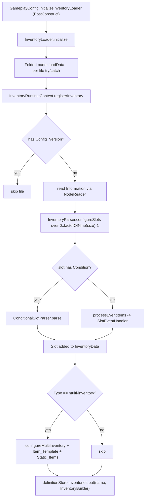

**State & persistence effects:** populates `InventoryDefinitionStore.inventories` and `.uniqueItemHandlers`; calls
`PermissionManager.addPermission` for each `Information.Permission`. `InventoryLoader.onInitialize(firstLoad)` skips
the first load (the `@PostConstruct` already did it) and re-runs on reload.

**Edge cases & guards observed:**
- A `Condition` block without `Value` throws `IllegalArgumentException` (`ConditionalSlotParser.java:28-30`) which is
  swallowed per-file by `FolderLoader`; the whole inventory is then missing at runtime.
- `XMaterial.valueOf(item)` throws `IllegalArgumentException` on an unknown material name and NPEs on a null one —
  same per-file containment.
- `Static_Items` keys go through `Integer.parseInt(key)` (`InventoryParser.java:86`) with no try/catch; a non-numeric
  key kills the file.
- Registration is keyed by `Information.Name`, which none of the shipped files set, so the file name is always the key.

---

### W2: Opening a configured inventory (YAML → parts → items → handler)

**Trigger:** `InventoryRuntimeContext.openInventoryForPlayer(player, name)` — reached from a slot's
`InventoryAction`, from `FilterCommand.reopen`, or from `GanglandUniqueItemInteractionService`.

**Steps:**

1. `openInventoryForPlayer` (`InventoryRuntimeContext.java:214`) resolves `userManager.getUser(player)`; a null user
   aborts with a warn.
2. **Cache check** — `user.getInventory(inventoryName)` (`gangland-domain/.../gang/user/User.java:189-195`) matches
   `handler.getTitle().getKey()` (i.e. `InventoryUtil.titleRefactor(displayTitle)`) against `name.toLowerCase()`.
   On a hit the *previously built* handler is reopened verbatim (line 221-225) — no re-render.
3. On a miss, the `InventoryBuilder` is looked up in the definition store; missing → warn + return.
4. `invBuilder.permission()` is checked against the player; failure → warn + return (no player-facing message).
5. `Fill`/`line` records are built from `Settings.getInventoryFill*` / `getInventoryLine*`.
6. **Single inventory path:** `InventoryBuilder.createInventory` (`InventoryBuilder.java:36-146`):
   - the title is `placeholder.convert(player, displayName)`; `new InventoryHandler(plugin, title, size, player)`
     immediately registers the handler in `InventoryRegistry` via the static seam.
   - per slot, `Slot.getConditionalResult(player, evaluator)` resolves the conditional branch (recursively via
     `BranchData.resolveFinal`).
   - `color` NBT tag → `ColorUtil.getMaterialByColor(value, MaterialType…)`; `head` NBT tag → `ItemBuilder.customHead`.
   - display name and every lore line go through `placeholder.convert`.
   - raw click actions are wrapped: `AnvilAction` → `openAnvilInventory(...)`, anything else →
     `rawAction.execute(p, inv, builder, inventoryOpener)`.
   - `handler.setItem(usedSlot, …)` writes into the Bukkit inventory and records the click consumers.
   - `verticalLine` / `horizontalLine` / `createBoarder` / `fillInventory` decorate the leftovers.
7. **Multi-inventory path:** `itemSourceProvider.getEntries(player, itemSource)` →
   `InventoryBuilder.createMultiInventory` → `MultiInventoryCreation.dynamicMultiInventory` (see W5).
8. `handler.open(player)` re-registers with the registry and calls `player.openInventory(inventory)`;
   `user.addInventory(handler)` stores it in the per-user set.

**Diagram:**

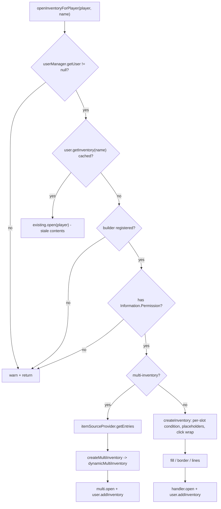

**State & persistence effects:** a new `InventoryHandler` is added to `InventoryRegistry` (global) and to
`User.inventories`. Nothing is written to disk or DB.

**Edge cases & guards observed:**
- No player-facing feedback on any denial path — three separate `log.warn` calls and a silent return.
- `user.addInventory` calls `removeInventory(String)` first, which removes from the user's set but **not** from
  `InventoryRegistry` (`User.java:172-179`) — see issue #4.
- `Configuration.Line.Vertical`/`Horizontal` values out of range throw from `Preconditions.checkArgument` inside
  `InventoryUtil` at open time (not load time); nothing catches it on this path.

---

### W3: Click handling (handler chain, conditions, cancellation)

**Trigger:** `InventoryClickEvent`.

**Steps:**

1. `InventoryClickHandler.onInventoryClick` (`InventoryClickHandler.java:23`) at `LOWEST` looks up the **top**
   inventory in `InventoryRegistry.findByInventory` — a linear stream over every registered handler of every player.
2. If no handler matches, or `getClickedInventory()` is null (click outside the window), the listener returns and
   the event is left untouched.
3. If the click landed in the **bottom** (player) inventory, only `MOVE_TO_OTHER_INVENTORY` and `COLLECT_TO_CURSOR`
   are cancelled (lines 34-43); everything else in the player's own inventory is allowed.
4. Otherwise `rawSlot` is used to look up `clickableItems`, then the right-click map when `event.isRightClick()`, then
   the left-click map (defaulting to a no-op consumer).
5. The consumer runs **first**; `event.setCancelled(!inv.getDraggableSlots().contains(rawSlot))` runs **after**
   (lines 53-54 and 62-64).
6. Conditional slots were already resolved at build time (W2 step 6), so a click never re-evaluates its condition —
   a slot whose condition flipped since the inventory was opened still runs the old branch's action.
7. `ConditionalSlotData.CommandAction.execute` calls `player.performCommand(cmd)`; `InventoryAction.execute` calls
   `opener.openInventory(player, name)` (recursing into W2); `AnvilAction` is replaced at build time by an
   `AnvilGUI.Builder(...).open(player)` call.

**Diagram:**

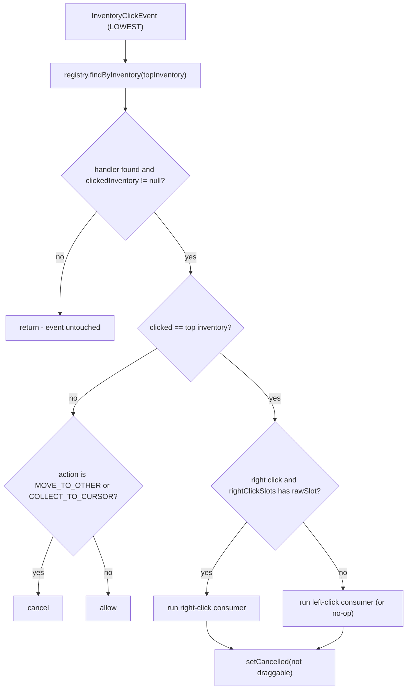

**State & persistence effects:** whatever the delegated command or inventory-open does. The click itself mutates no
framework state.

**Edge cases & guards observed:**
- Cancellation happens after the action, so an action that opens another inventory or an anvil does so while the
  original click is still being processed.
- `event.getHotbarButton()` / number-key swaps into the top inventory are covered by the blanket cancel; number-key
  swaps *within* the player inventory are not intercepted at all (correct for a normal GUI).
- Shift-clicking from the player inventory into the GUI is cancelled; shift-clicking *out of* the GUI is a top-slot
  click and is cancelled by the blanket rule unless the slot is draggable.

---

### W4: Navigation between panels (MultiPanelInventory + FlowSession)

**Trigger:** `BankerFlow.start(...)`, `TraderFlow`, `TurfPowerupFlow`, `ShopAdminFlow`, or `DebugCommand`'s villager
panel — each builds a `MultiPanelInventory<S>`, registers panels, then calls `openAt(id)`.

**Steps:**

1. `MultiPanelInventory.openAt` (`MultiPanelInventory.java:88-92`) registers the host itself as a Bukkit listener the
   first time (guarded by `current == null`), then `switchInternal(id, false)`.
2. `switchInternal` (lines 173-197) looks up the panel; unknown ids silently return. `trackHistory` pushes the
   current id onto `backStack`.
3. **Reuse path** — when the existing handler's size and display title both match the target panel, the same
   `InventoryHandler` is reused: `current.clear()` then `panel.render(...)`. `InventoryHandler.clear()` only calls
   `inventory.clear()`; the `clickableSlots` / `rightClickSlots` / `clickableItems` / `draggableSlots` maps survive.
4. **Rebuild path** — otherwise `switching = true`, a new `InventoryHandler` is constructed (auto-registering in
   `InventoryRegistry`), rendered, opened (which closes the previous window and fires `InventoryCloseEvent`), then
   `switching = false`.
5. `onClose` (lines 163-171) ignores the event while `suppressClose()` (i.e. `switching || suspended`) and otherwise
   ends the flow when the closed top inventory is the current one.
6. `back()` pops the stack, or calls `end()` when empty. `end()` sets `ended`, closes the window under the
   `switching` latch, and runs `cleanup()`.
7. `cleanup()` nulls `current`/`currentId`, clears the back-stack, `HandlerList.unregisterAll(this)` and fires the
   one-shot `onEnd` consumer with the session.
8. `suspend()` (anvil / external UI detours) nulls `current` so the imminent close event is a no-op; `resume()` +
   `switchTo(...)` re-enter on the rebuild path.
9. `rerender()` (lines 116-122) re-renders the current panel in place — same non-clearing behaviour as step 3.

**Diagram:**

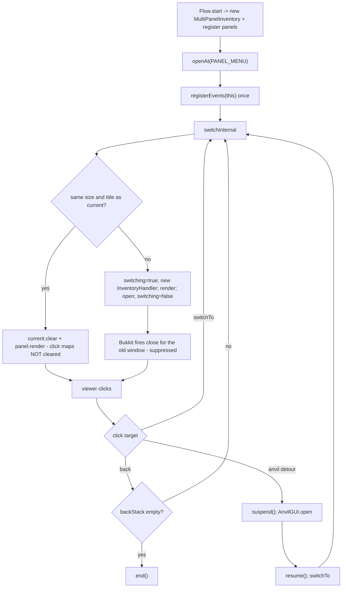

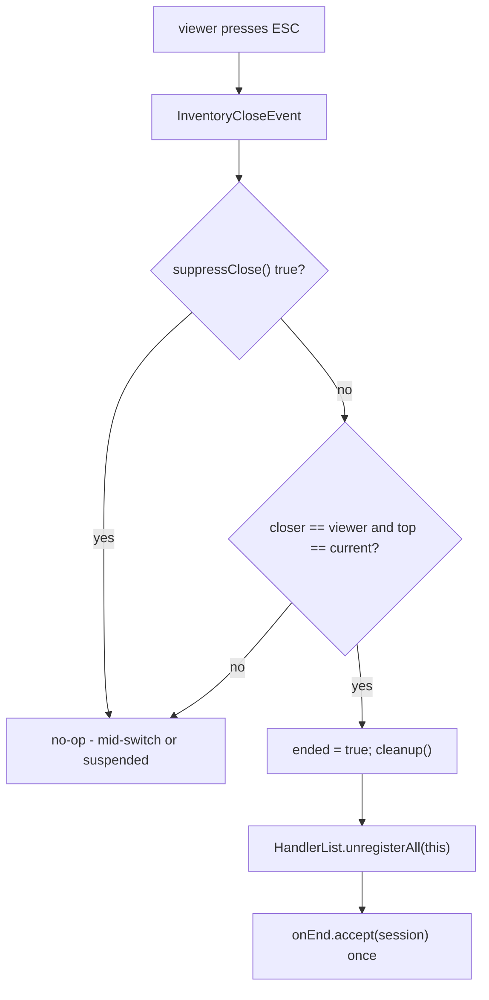

**State & persistence effects:** the `FlowSession` instance survives every panel swap; `onEnd` is the single teardown
hook (used by the trader/banker flows to return staged items and clear per-session state). Every rebuild leaves a new
`InventoryHandler` in `InventoryRegistry`.

**Edge cases & guards observed:**
- `end()` when `current == null` (i.e. after `suspend()`) skips `viewer.closeInventory()` but still runs `cleanup()`.
- If a flow is left `suspended` and the viewer quits, no `InventoryCloseEvent` for `current` can match (it is null),
  so `cleanup()` never runs and the listener stays registered holding the `Player` and the session.
- `switchInternal` pushes the back-stack *before* checking whether the panel exists is irrelevant (the null check is
  first), but it pushes even on the reuse path, so repeated `switchTo` between two same-titled panels grows the stack.

---

### W5: Multi-inventory (paged list) creation and paging

**Trigger:** `openInventoryForPlayer` on a `Type: multi-inventory` file (`phone_gang_search`, `user_stat`,
`alliance_stat`).

**Steps:**

1. `GangItemSourceProvider.getEntries` (`itemsource/GangItemSourceProvider.java:47-54`) switches on the source name
   and returns `List<ItemSourceEntry>` — each entry is just a `Map<String,String>` of per-row placeholders.
   `gangs` and `gang_members` first run the collection through `FilterApplier.apply(...)` with the player's stored
   `SearchFilter`; `gang_allies` is unfiltered.
2. `InventoryBuilder.createMultiInventory` (`InventoryBuilder.java:148-191`) builds the static-items map (keyed by the
   explicit YAML slot) and renders each row from `Information.Item_Template` via `renderListEntry`
   (`InventoryBuilder.java:206-262`) — `%key%` substitution first (`substituteEntry`), then
   `placeholder.convert`, then `customHead` from the `Data`/`head` tag. `Item_Template.OnClick.Command` becomes a
   per-row `player.performCommand(...)` consumer.
3. `MultiInventoryCreation.dynamicMultiInventory` (`MultiInventoryCreation.java:22-87`) rejects the call (returns
   `null`) when static items are enabled but the map is empty or larger than 6.
4. `computeConfigForCreation` (lines 98-119) derives rows from the explicit YAML `Size` when it is ≥18 and a multiple
   of 9, clamps to 3..6, and computes `perPage = (rows-2) * (staticItems ? 6 : 7)`. **`Multi.Per_Page` from the YAML
   is never consulted.**
5. Page 0 is the `MultiInventory` itself; pages 1..N-1 are plain `InventoryHandler`s appended via `addPage`.
   `addItems` (`MultiInventory.java:147-178`) lays rows out starting at row 2 / column 2 (or 3 with static items),
   wrapping when `column % 8 == 0`, and stops at `maxItemRow = size/9 - 1`.
6. `placeStaticItems` writes each static entry at its literal YAML slot, skipping out-of-range and already-occupied
   slots.
7. `createBoarder` + (with static items) `verticalLine(column 2)` decorate each page.
8. `MultiInventoryNavigation.addNavigationButtons` (`MultiInventoryNavigation.java:22-43`) **renames every page** to
   `"<title> &8[&b<n>&8/&3<N>&8]&r"` (which re-creates the Bukkit inventory and re-registers the handler), then adds a
   next-page head at `size-1`, and on pages >0 a home head at `size-5` and a prev head at `size-9`.
9. Clicking a nav head calls `multi.nextPage()/previousPage()/homePage()` and `open(p)` on the returned handler, plus
   a `player.playSound(..., XSound.BLOCK_WOODEN_BUTTON_CLICK_ON.get(), ...)`.

**Diagram:**

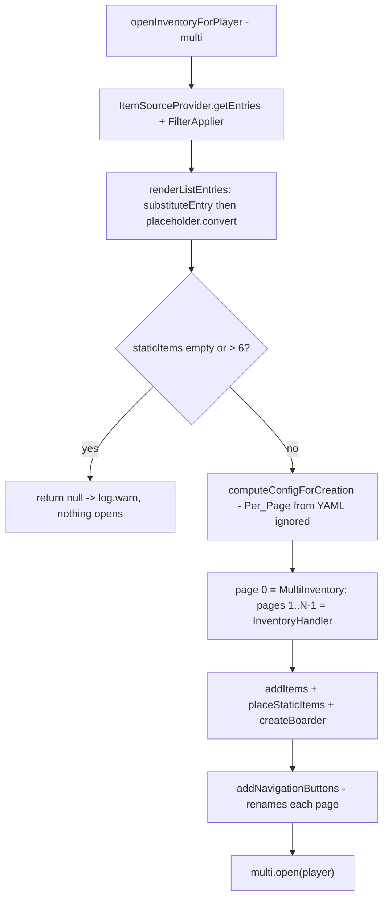

**State & persistence effects:** N+1 `InventoryHandler`s enter `InventoryRegistry` per open (each page), but only the
head `MultiInventory` is tracked in `User.inventories`.

**Edge cases & guards observed:**
- `MultiInventory.ID` is a non-synchronised static `long` used only to disambiguate `NamespacedKey`s before the rename.
- `hasNextPage()` (`MultiInventory.java:134-136`) compares `currentPage < inventories.getSize()` — off by one; it is
  currently unused.
- `removePage` (lines 98-120) has a dangling-`else`: the `else if (current == inventories.getSize() - 1)` branch binds
  to the inner `if (inventories.getSize() > 1)`, so the "last page" cleanup is unreachable.
- `updateItems` tracks `inventoryIndex` but never uses it for the first page, so the trailing
  `while (inventories.getSize() > inventoryIndex + 1) removePage(tail)` can strip a page too many/few; `updateItems`
  is currently not called from anywhere in the repo.

---

### W6: Filter / search on list views

**Trigger:** clicking a `Static_Items` button in `phone_gang_search.yml` or `user_stat.yml`, which
`performCommand`s a `/glw filter …` line (some via an anvil `Success.Command`).

**Steps:**

1. `GangFilterRegistration.register()` (`config/GangFilterRegistration.java:46-76`, a `@PostConstruct`) registers two
   `FilterBinding`s: `gangs` → target `phone_gang_search` (fields NAME, DESCRIPTION, COLOR, MEMBERS, DATE; sort cycle
   NAME asc → MEMBERS desc → DATE desc) and `gang_members` → target `user_stat` (NAME, CATEGORY, MEMBERS, DATE).
2. `FilterCommand` (`command/sub/filter/FilterCommand.java`) is a chain of three `OptionalArgument`s
   (`<binding> <action> <value> <value2>`); each level has its own handler (`handleNoValue`, `handleOneValue`,
   `handleTwoValues`).
3. `sort` advances `SortDescriptor.cycle(binding.sortCycle())`; `clear` resets to `binding.empty()`;
   `search <text…>` is shorthand for `set NAME <text…>`; `set <field> <text…>` sets a `TextValue`;
   `next <field> <csv>` advances an `EnumValue` through a comma-separated list and clears past the end;
   `cycle <field>` only clears the field (documented as intentional at lines 220-222).
4. The mutated `SearchFilter` is written to `FilterStore` keyed by `(bindingId, playerUuid)`.
5. `reopen(player, binding)` calls `inventoryRuntimeContext.openInventoryForPlayer(player, binding.targetInventory())`
   — which re-runs W2 and W5 with the new filter.
6. On the next `getEntries`, `FilterApplier.apply` (`FilterApplier.java:14-32`) chains one `stream.filter` per
   field then an optional `sorted(comparator(...))`.

**Diagram:**

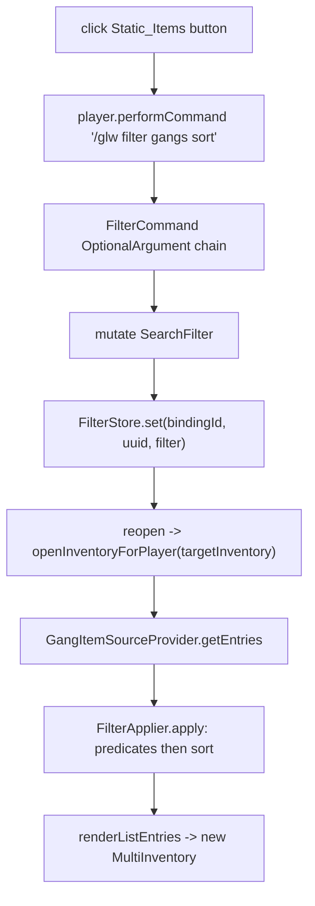

**State & persistence effects:** `FilterStore` retains the filter per player+binding indefinitely — nothing clears it
on quit (`clearAllForPlayer` exists but has no caller), and nothing clears it on reload.

**Edge cases & guards observed:**
- `FilterApplier.comparator` (lines 64-75) does an unchecked `Comparable.compareTo` guarded only by
  `b.getClass().isAssignableFrom(a.getClass())`, falling back to `toString()` comparison.
- `user_stat.yml`'s sort tooltip advertises "Name / Rank / Contribution / Joined" while the binding cycles
  NAME/CATEGORY/MEMBERS/DATE — the adapter maps them, but the naming is inconsistent.
- `SearchButtonFactory` provides in-UI equivalents of every one of these actions but is not wired to any view.

---

### W7: Unique item (phone) → inventory

**Trigger:** right-clicking the phone unique item.

**Steps:**

1. `UniqueItemInteract.onUniqueItemInteract` (`gangland-item/.../listener/unique/UniqueItemInteract.java:24`) fires on
   `PlayerInteractEvent` (no `ignoreCancelled`, so `RIGHT_CLICK_AIR` survives — matches the house rule).
2. It reads the `uniqueItem` NBT tag, looks up the `UniqueItem` in the registry and bails when the item is flagged
   non-movable.
3. `GanglandUniqueItemInteractionService.tryHandleInteract` (`item/contract/GanglandUniqueItemInteractionService.java:20`)
   resolves the `UniqueItemHandler` from `InventoryDefinitionStore`, checks `isActionAllowed(action)` and the handler
   permission, then calls `openInventoryForPlayer(player, handler.inventoryName())` (W2).
4. The listener cancels the interact event only when the service reports it handled the click.
5. Allowed actions come from `InventoryParser.parseActions` (`InventoryParser.java:111-129`). `phone.yml` declares
   `Action: RIGHT_CLICK`, which is **not** a member of Bukkit's `Action` enum; `parseAction` swallows the
   `IllegalArgumentException` and the empty list falls back to `RIGHT_CLICK_AIR` + `RIGHT_CLICK_BLOCK`.

**Diagram:**

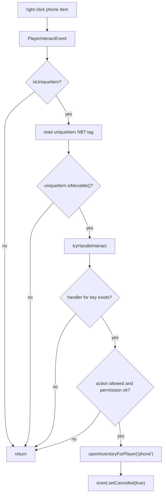

**State & persistence effects:** none beyond W2.

**Edge cases & guards observed:**
- `event.getHand()` is not checked; a player holding a phone in both hands triggers two opens per right-click.
- `Open.Permission` on `phone.yml` is absent, so only `Information.Permission`
  (`gangland.inventory.phone`, checked inside `openInventoryForPlayer`) gates the phone.

---

### W8: Phone menu tree

**Trigger:** W7, then successive `OnClick.Inventory` navigations.

**Steps:**

1. `phone` (54 slots) → slot 20 `phone_gang`, slot 22 `phone_bounty`, slot 24 `phone_banking`.
2. `phone_gang` (45) → slot 21 is conditional on `%gangland_user_has-gang%`: true opens `gang_info`, false opens an
   `AnvilGUI` titled "Create Gang" whose `Success.Command` is `/glw gang create %gangland_anvil_output%`; slot 23 →
   `phone_gang_search`; slot 40 → back to `phone`.
3. `phone_banking` (27) → four `%gangland_user_has-bank%` conditionals produce deposit/withdraw anvils and a
   `/glw bank balance` / `/glw bank create <name>` pair; slot 17 → `/glw bank menu` which starts the
   `MultiPanelInventory` `BankerFlow` (W4) with a null banker; slot 22 → back to `phone`.
4. `phone_bounty` (54) → slots 21/23/40 carry no `OnClick` at all (decorative); slot 49 → back to `phone`.
5. `phone_gang_search` (54, multi) → W5 + W6.
6. "Back" is always a fresh `openInventoryForPlayer` on the parent, never a real back-stack.

**Diagram:**

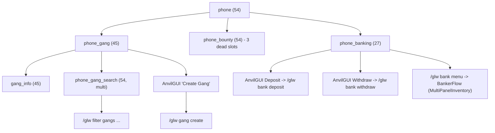

**State & persistence effects:** each hop creates a new `InventoryHandler` (except when the title-key cache in W2
step 2 matches). Anvil detours hand control to `AnvilGUI` and come back via `performCommand`.

**Edge cases & guards observed:**
- Every hop is `player.performCommand`/`openInventory` executed inside an `InventoryClickEvent` handler at `LOWEST`,
  before the event is cancelled.
- The anvil `Success.Command` substitutes `%gangland_anvil_output%` with raw player text and then runs
  `placeholder.convert` over the result (`InventoryBuilder.java:279-280`) — a player-supplied string is fed through
  the placeholder engine before being executed as a command.

---

### W9: Gang / user / alliance stat views and placeholder resolution

**Trigger:** `/glw gang` (intercepted) or a click from `gang_info`.

**Steps:**

1. `InventoryOpenByCommandListener.onInventoryCommand` (`listener/inventory/InventoryOpenByCommandListener.java:46`)
   splits the raw command and loops **every** registered inventory looking for a `State.COMMAND` entry whose
   token array matches exactly.
2. On a match it checks `builder.permission()` then `openInventory.permission()`, builds the inventory directly
   (**not** through `openInventoryForPlayer`, so the per-user cache and the multi-inventory branch are bypassed),
   opens it, and cancels the command event.
3. `gang_info` items resolve `%gangland_gang_*%` / `%money_symbol%` through `PlaceholderService`
   (`InventoryBuilder.createInventory` steps). `Item: {Type: WOOL, Color: "%gangland_gang_color%"}` is resolved by
   `SlotItemFactory.validateMaterial` → `BLACK_WOOL`, then recoloured in `InventoryBuilder.java:56-71` by matching the
   material name against `MaterialType` and calling `ColorUtil.getMaterialByColor`.
4. Slot 19 uses `Item: {Type: PLAYER_HEAD, Data: "%gangland_user_name%"}` → `ItemBuilder.customHead(value)`.
5. `user_stat` / `alliance_stat` are multi-inventories whose rows come from `GangItemSourceProvider.getGangMembers` /
   `getGangAllies`; per-row placeholders (`%member_*%`, `%ally_*%`) are plain map substitutions performed by
   `InventoryBuilder.substituteEntry` *before* the global `placeholder.convert` pass.
6. `gang_stat.yml` has no `Slots` block; it opens as a fully filled, inert 54-slot chest.

**Diagram:**

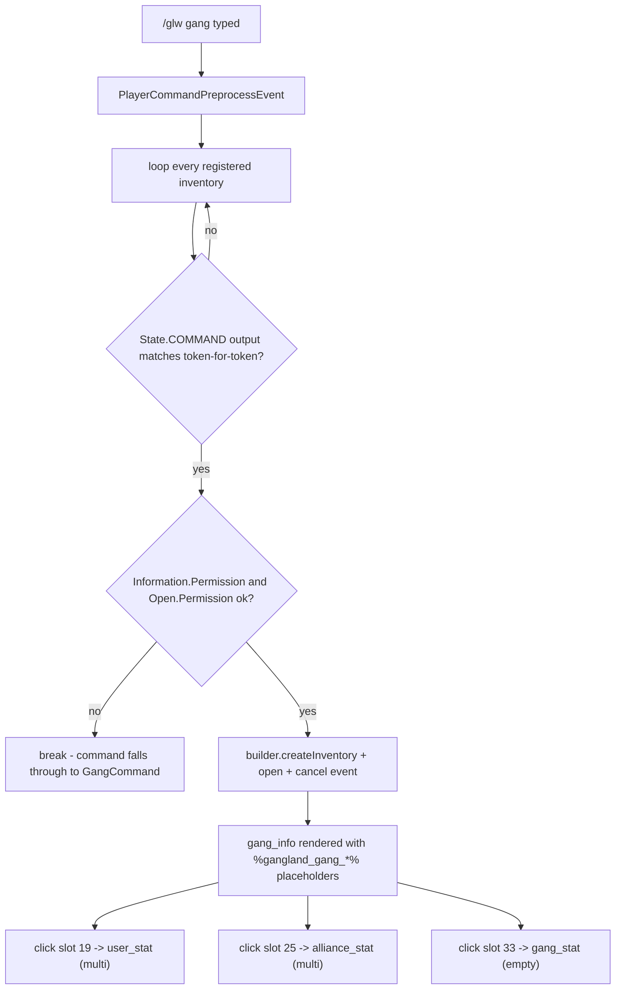

**State & persistence effects:** none persisted. `gang_info` opened this way is **not** added to `User.inventories`,
so it is never returned by the W2 cache and is only reachable from the registry.

**Edge cases & guards observed:**
- `checkCommand` returns `false` after a successful open (`break` then `return false`, lines 101-107), so the outer
  loop keeps scanning and a second inventory bound to the same command would also open.
- The `catch (Exception)` at lines 102-104 returns `true` and logs nothing — any render failure silently eats the
  command.
- A player lacking the permission gets `break` (not `continue`), which is fine here but means the loop stops early
  for that inventory only.

---

### W10: Villager-trade style inventories

**Trigger:** `new VillagerInventory(registry, title).addTrade(...).open(player)` — the only caller in the repo is
`command/sub/debug/DebugCommand.java:358`.

**Steps:**

1. `VillagerInventory.open` (`villager/VillagerInventory.java:46-65`) creates a fresh `Bukkit.createMerchant(title)`,
   converts each `VillagerTrade` to a new `MerchantRecipe` via `toRecipe()`, records the recipe→trade mapping in an
   `IdentityHashMap`, calls `player.openMerchant(merchant, true)`, then registers itself in
   `VillagerInventoryRegistry` keyed by player UUID.
2. `VillagerInventoryListener.onClick` (`villager/VillagerInventoryListener.java:58-80`) runs at `MONITOR` with
   `ignoreCancelled = true`, requires an `InventoryType.MERCHANT` top inventory, raw slot 2, a click on the top
   inventory, and one of ten "consume" actions.
3. It then looks up the wrapper for the player, reads `((MerchantInventory) top).getSelectedRecipe()`, resolves the
   `VillagerTrade` through `findTradeFor(recipe)` (identity lookup) and fires `onPurchase.accept(player)`.
4. `onClose` and `onQuit` unregister the wrapper.

**Diagram:**

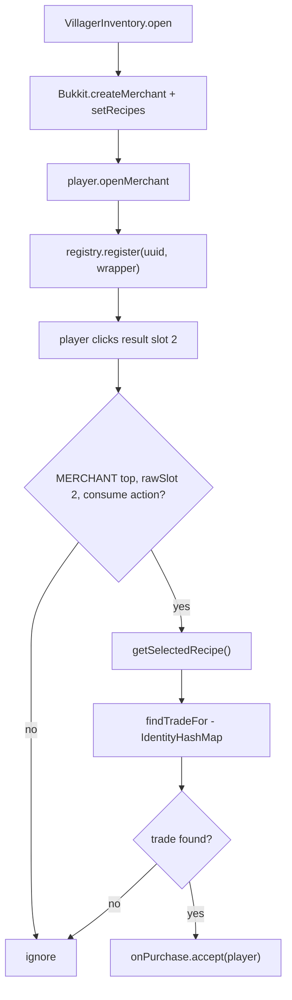

**State & persistence effects:** one wrapper per player in `VillagerInventoryRegistry`; nothing else.

**Edge cases & guards observed:**
- The wrapper map holds at most one entry per player, so opening a second merchant silently replaces the first.
- `recipeToTrade` is an `IdentityHashMap` keyed by the `MerchantRecipe` instances passed to `setRecipes`; CraftBukkit
  wraps recipes into `CraftMerchantRecipe` internally, so `getSelectedRecipe()` may not return the same instance —
  see issue #12.

---

### W11: Scoreboard creation, rendering and refresh

**Trigger:** `UserDataInitEvent` on join, or the CONFIG/post-init bootstrap for already-online players.

**Steps:**

1. `ScoreboardAddon.initialize` (`scoreboard/configuration/ScoreboardAddon.java:42-58`) clears its state, reads
   `Board.Title.Lines`/`Interval` into a `StaticLine` (1 line) or `Line` (>1), then loops `Board.Rows.1..n` until the
   first missing row, building a `StaticLine(index)` when `Interval == 0` and a `Line(interval, index)` otherwise.
2. `PlayerScoreboardListener.onUserDataInitialize` (`listener/player/PlayerScoreboardListener.java:28-39`) skips when
   the user already has a board, then calls `ScoreboardManager.getDriverHandler(player)`.
3. `ScoreboardManager.getDriverHandler` (`scoreboard/ScoreboardManager.java:55-65`) passes
   `scoreboardAddon.getLines()` — **the live shared list** — and the shared title `Line` into `DriverV1`/`V2`/`V3`
   selected by `Settings.getScoreboardDriver().toLowerCase()` (`driver_v3`, `driver_v2`, anything else → V1).
4. `DriverHandler`'s constructor (`driver/DriverHandler.java:26-41`) creates a `FastBoardImpl` (whose
   `hasLinesMaxLength()` consults ViaVersion for pre-1.13 clients), **mutates the shared list** with
   `this.lines.add(title)`, seeds `lineUpdateCounts`, and calls `updateBoard()` once so the player never sees raw
   placeholders on the first frame.
5. `new Scoreboard(plugin, driver)` (`scoreboard/Scoreboard.java:13-22`) builds a Keystone `RepeatingTimer` with
   delay 0 / period 1 tick whose body sets `FlashPlaceholderWrapper.setCurrentTick(...)` and calls `driver.update()`.
6. `Scoreboard.start()` calls `timer.start(true)` → Keystone `Timer.start(boolean)` →
   `runTaskTimerAsynchronously(plugin, 0, 1)`.
7. `DriverV3.update` (`driver/version/DriverV3.java:43-90`) first re-renders every "flash" line (any cached content
   containing `flash:` or `flashif:`), then walks its interval clusters, and for each due cluster updates the title
   and any line whose newly rendered text differs from the cache.
8. `Line.update` (`part/Line.java:42-51`) resolves the current content through `Placeholder.convert`, falls back to the
   raw string when the result is empty, and advances `index = (index + 1) % contents.size()` — this is what animates
   the 25-frame title.

**Diagram:**

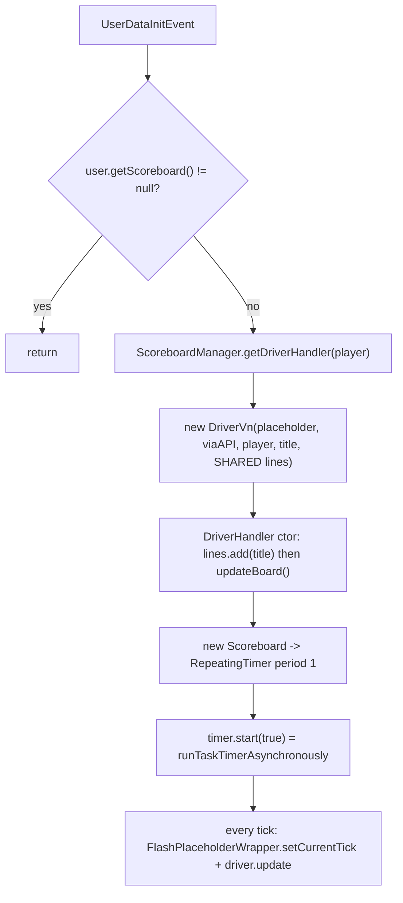

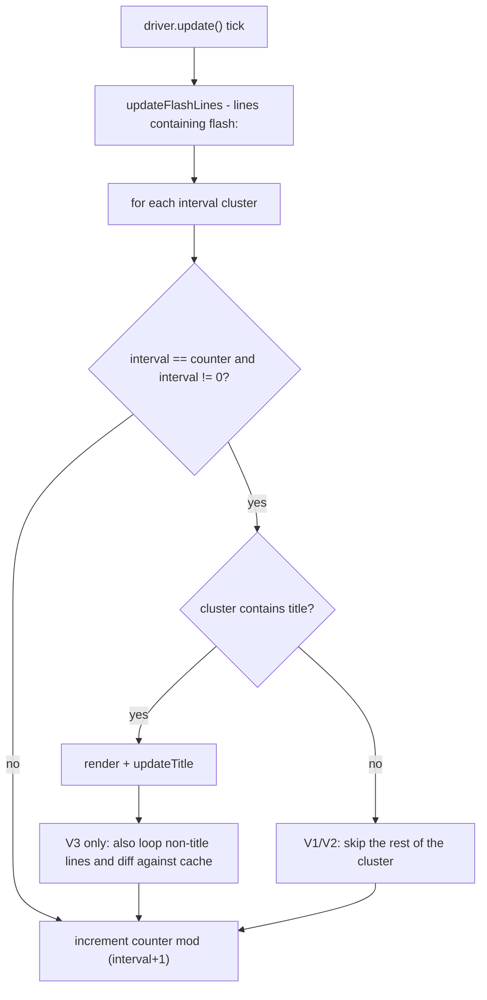

**State & persistence effects:** one `FastBoard` (packet-level scoreboard) per player; `Line` objects and their
rotation index are shared across all players.

**Edge cases & guards observed:**
- `StaticLine` / `Interval: 0` rows are never re-rendered, so any placeholder written in a zero-interval row would
  display literally. The shipped `scoreboard.yml` only uses zero-interval rows for static separators/headers.
- `Line.getCurrentContent()` (`part/Line.java:38-40`) throws `IndexOutOfBoundsException` and `Line.update` divides by
  `contents.size()` — an empty `Lines:` list in `scoreboard.yml` crashes the board every tick.
- `ScoreboardAddon.getLines` (`configuration/ScoreboardAddon.java:61-62`) NPEs via `Objects.requireNonNull` when a
  declared row has no `Lines` key.
- `Line.hashCode()` returns `(int) interval` without an `equals` override, so `lineUpdateCounts` and `DriverV3.cache`
  degenerate to a handful of hash buckets (correct, but O(n) lookups).

---

### W12: Scoreboard teardown, reload and per-player toggling

**Trigger:** player quit, `/glw reload scoreboard`, `/glw reload` (full), or plugin disable.

**Steps:**

1. **Quit** — `RemoveAccountListener` (`listener/player/RemoveAccountListener.java:89-92`) calls
   `user.getScoreboard().end()` then `setScoreboard(null)`. `Scoreboard.end()` (`scoreboard/Scoreboard.java:31-35`)
   stops the timer and calls `driver.getFastBoard().delete()`.
2. **Full reload** — `UserManager.onPreClear()` (`gangland-domain/.../gang/user/UserManager.java:95-98`) stops and
   nulls every user's board before data is cleared; `ScoreboardLifecycleService.onPostInitialize` then recreates one
   per online user.
3. **Scoreboard-only reload** — `ReloadPlugin.scoreboardReload()` (`bootstrap/ReloadPlugin.java:65-87`) returns
   immediately when `Settings.isScoreboardEnabled()` is false (so disabling in `settings.yml` and reloading leaves
   the existing boards running), otherwise ends + recreates each board.
4. **Inventory-only reload** — `ReloadPlugin.inventoryReload()` calls
   `InventoryHandler.removeAllSpecialInventories()` then re-initialises `InventoryLoader`.
5. There is **no per-player toggle command** — the only switch is the global `Scoreboard.Enable` setting, applied
   through `@ListenerHandler(condition = "isScoreboardEnabled")` on `PlayerScoreboardListener`.

**Diagram:**

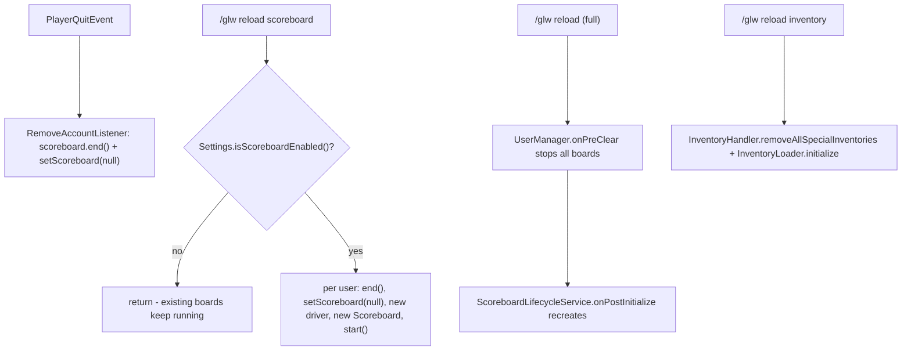

**State & persistence effects:** `FastBoard.delete()` removes the packet objective; the `Line` objects survive in
`ScoreboardAddon` and are re-parsed only on a files reload.

**Edge cases & guards observed:**
- Nothing resets `ScoreboardAddon.getLines()` between board creations, so the shared-list mutation in W11 step 4
  compounds across every join and every reload (issue #1).
- `/glw reload inventory` does **not** clear `InventoryRegistry` or `User.inventories`, so handlers built from the old
  YAML stay open and clickable.

---

### W13: Hologram create / update / remove

**Trigger:** `HologramService.createHologram(...)` / `createUpdatingHologram(...)` — the only production consumers are
the loot-chest classes (`gangland-ui/lootchest-api/.../ChestCooldownManager.java`, `LootChestService.java`) wired
through `gangland-impl/.../lootchest/LootChestManager.java`. Turf and NPC code do **not** use `hologram-api`.

**Steps:**

1. `GameplayConfig.hologramService()` (`config/GameplayConfig.java:317-319`) produces the singleton (a
   `BeanLifecycle`, so `onShutdown` → `clear()`).
2. `createHologram` (`hologram/HologramService.java:36-44`) builds a `Hologram`, calls `spawn(lines)` and records it in
   `holograms` (by UUID) and `hologramsByLocation` (by the **caller's** `Location` instance).
3. `Hologram.spawn` (`hologram/Hologram.java:42-54`) returns early when already spawned or the world is null, then
   spawns one armour stand per line, top line first, at 0.25-block spacing. Each stand is invisible, gravity-less,
   marker, invulnerable, small, silent, `setPersistent(false)`, with every equipment slot locked and no arms/base
   plate.
4. `update(String...)` re-spawns when the line count changed, otherwise sets each live stand's custom name.
   `updateLine(i, text)` targets one row.
5. `createUpdatingHologram` schedules a synchronous `runTaskTimer` that cancels itself once `isSpawned()` goes false.
6. `removeHologram(id)` removes from `holograms`, cancels the update task, removes the `hologramsByLocation` entry
   keyed by `hologram.getBaseLocation()` (a clone of the original, equal by value), and despawns.
7. `ChestCooldownManager.updateCooldownHologram` / `showAvailableHologram`
   (`lootchest-api/.../ChestCooldownManager.java:125-166`) create or refresh the per-chest hologram;
   `removeChestHologram` (lines 169-179) calls `hologram.despawn()` **directly**, bypassing `HologramService`.
8. `HologramProtectionListener` cancels manipulate/interact events by linear-scanning every hologram's line list.

**Diagram:**

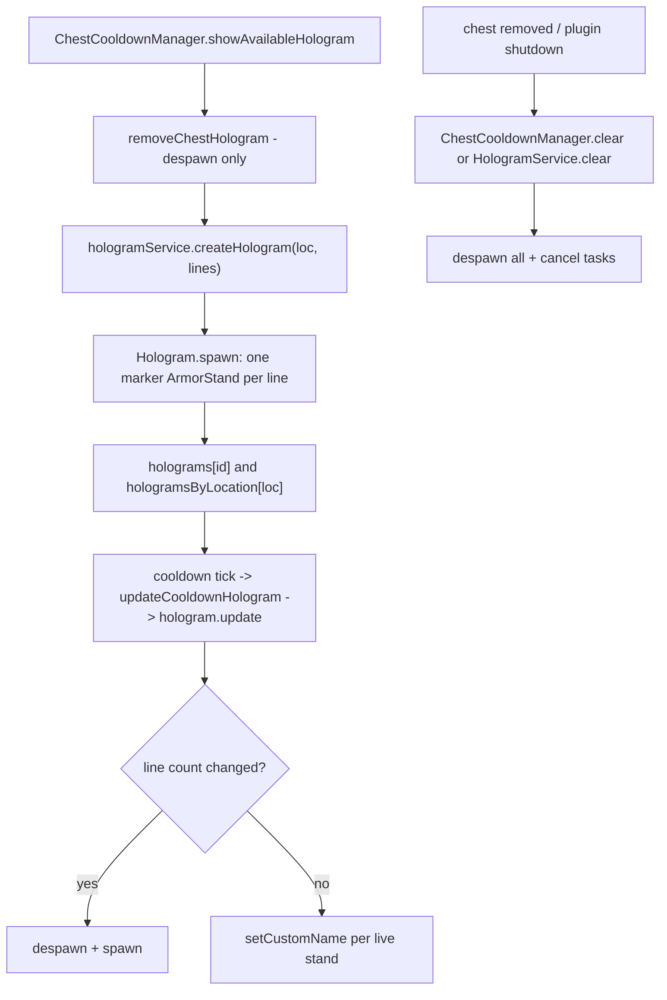

**State & persistence effects:** armour stands are `setPersistent(false)` so they never reach the world save file.
`HologramService` holds three in-memory maps; `ChestCooldownManager` holds a parallel `chestHolograms` map.

**Edge cases & guards observed:**
- `Hologram.spawn` and `createArmorStand` require a non-null world; `createArmorStand` uses
  `Objects.requireNonNull(location.getWorld())` and will throw if the world unloaded between the guard and the spawn.
- On chunk unload, non-persistent armour stands are removed; `isArmorStandDead` then makes every `update` call a
  silent no-op — the hologram never respawns on its own (issue #14).
- `HologramProtectionListener.isHologramArmorStand` is O(holograms × lines) per interact event.

## Cross-feature Dependencies

**Depends on:**
- Keystone `keystone-bean` (`@ListenerHandler`, `@Bean`, `@PostConstruct`, `BeanLifecycle`, `BeanPostInitialize`),
  `keystone-persistence` (`FileHandler`, `FileManager`, `FolderLoader`, `FileInitializer`, `NodeReader`/`ConfigReport`),
  `keystone-common` (`ItemBuilder`, `ChatUtil`, `Placeholder`, `TriConsumer`, `Pair`, `LinkedList`, `ReflectionUtil`,
  `RepeatingTimer`/`Timer`, `ColorUtil`/`MaterialType`, `PermissionManager`, `FlashPlaceholderWrapper`).
- `gangland-domain`: `User` (holds `Set<InventoryHandler>` + `Scoreboard`), `UserManager`, `Gang`, `Member`, `Rank`,
  `GangAlliance`, `GangManager`, `GangFilterAdapter`, `MemberFilterAdapter`.
- `gangland-impl`: `PlaceholderService` (the `Placeholder` implementation behind every `%…%`), `Settings`,
  `ItemParser` (the `itemResolver` for `weapon:`/`unique:` refs), `Gangland` (plugin instance, `getViaAPI()`).
- `gangland-item`: `UniqueItemRegistry`, `UniqueItemInteractionService` contract, `UniqueItemUtil`.
- Third-party: FastBoard (shaded/bundled), ViaVersion `ViaAPI` (optional, used for pre-1.13 line lengths), AnvilGUI,
  XSeries (`XMaterial`, `XEnchantment`, `XSound`).

**Depended on by:**
- `gangland-features/cops-n-crooks`: banker views (5 panels + `BankerFlow`), trader views (6 panels + `TraderFlow`,
  `BarterSessionListener`, `TraderSellSessionListener`), turf-powerup views (3 panels + `TurfPowerupFlow`).
- `gangland-ui/shop-api`: `ShopAdminFlow`, `ShopAdminView`, `PriceEditorView`, `SellCategoryItemsAdminView`,
  `BarterCategoryItemsAdminView`.
- `gangland-ui/lootchest-api`: `LootChestService`, `ChestCooldownManager` (hologram-api only).
- `gangland-impl`: `FilterCommand`, `BankMenuCommand`, `DebugCommand` (`VillagerDebugPanel`),
  `InventoryOpenByCommandListener`, `UniqueItemRefresher`.

## Observations & Potential Issues

| # | Location | Observation | Risk | Confidence |
| --- | --- | --- | --- | --- |
| 1 | `scoreboard/ScoreboardManager.java:58-63` + `scoreboard/driver/DriverHandler.java:34` | `getDriverHandler` hands the **live** `scoreboardAddon.getLines()` list to the driver, whose constructor does `this.lines.add(title)`. Every board creation (each join, each reload) appends another title reference to the one shared list, which grows without bound. The same `Line` objects are also shared by every player, so `Line.index` (the rotating-content cursor) advances once per player per tick — the animated title cycles N× faster with N players and all boards show the same frame | Unbounded list growth; animation speed scales with player count; per-player line state is not per-player | High |
| 2 | `scoreboard/Scoreboard.java:27` | `timer.start(true)` schedules `runTaskTimerAsynchronously` at period 1 tick. The task calls `driver.update()` → `Placeholder.convert(player, …)` (gang/user/bank lookups, PlaceholderAPI expansions) and `FastBoard.updateLine/updateTitle` (reflective packet sends). This violates the project's own `feedback_repeating_timer_async` rule and touches non-thread-safe APIs from an async thread, every tick, per player | Race conditions / `ConcurrentModificationException` on domain collections; PlaceholderAPI expansions invoked off-main | High |
| 3 | `inventory/flow/MultiPanelInventory.java:120-121, 184-187` + `inventory/InventoryHandler.java:196-198` | `rerender()` and the same-size/same-title `switchTo` reuse path call `current.clear()`, which only clears the Bukkit `Inventory`. `clickableSlots`, `rightClickSlots`, `clickableItems` and `draggableSlots` are never cleared, so a slot the new render leaves **empty** still fires the previous render's click action, and previously-draggable slots stay draggable | Clicking a blank slot triggers a stale action (e.g. an old confirm/deposit button); stale draggable slots let items be inserted/removed | High |
| 4 | `gangland-domain/.../gang/user/User.java:172-179` and `145-154`, `inventory/service/InventoryRegistry.java:37-44` | `removeInventory(String)` drops the handler from the user's set but never calls `inventoryRegistry.unregisterInventory`. Multi-inventories additionally register one handler per page at construction while only the head is tracked by the user. `findByInventory` streams every registered handler of every player on every click/drag/close | Registry grows on every inventory open until the player quits; O(total handlers) scan per inventory event | High |
| 5 | `file/configuration/inventory/InventoryRuntimeContext.java:221-225` + `gangland-domain/.../User.java:189-195` | The per-user cache is keyed by `titleRefactor(displayTitle)` compared against the YAML `name`. When they coincide (e.g. `phone.yml`, whose display name resolves to "Phone"), reopening serves the **previously built** handler — stale placeholder values (wallet balance) and stale condition branches. When they differ (`phone_gang`, `gang_info`, …) the cache never hits and a fresh handler is built. The behaviour is therefore accidental and inconsistent between files | Stale GUI contents on some screens only; hard-to-reproduce "my balance doesn't update" reports | Medium-High |
| 6 | `listener/inventory/InventoryOpenByCommandListener.java:100-107` | The success path does `event.setCancelled(true); break;` and then `return false`, so the caller keeps scanning other inventories; the `catch (Exception)` path does `return true` and logs nothing. The two return values are inverted relative to intent | A second inventory bound to the same command would also open; render failures silently swallow the command with no diagnostic | Medium-High |
| 7 | `inventory/multi/MultiInventory.java:104-116` | Dangling `else`: `if (current == 0) if (size > 1) {...} else if (current == size - 1) {...}` — the `else if` binds to the inner `if`, so the "removing the last page" cleanup only runs when `current == 0 && size <= 1 && current == size - 1` | The previous page's next-button is never removed when the tail page is dropped (currently latent — `removePage` has no production caller) | High |
| 8 | `inventory/listener/InventoryClickHandler.java:53, 62-64` | The click consumer runs **before** `event.setCancelled(...)`. Consumers routinely call `player.performCommand`, `opener.openInventory` or `AnvilGUI.open` — i.e. a new inventory is opened while the originating `InventoryClickEvent` is still being dispatched, and the cancel is then applied to a stale view | Client/server inventory desync; cursor-item duplication on some client versions | Medium |
| 9 | `inventory/InventoryBuilder.java:118-121` and `inventory/InventoryHandler.java:182-185` | `handler.setItem(usedSlot, …)` performs no bounds check. `InventoryParser.configureSlots` bounds the loop by `factorOfNine(size)` so YAML slots are safe today, but `InventoryUtil.horizontalLine`/`verticalLine` throw `IllegalArgumentException` from `Preconditions` at **open** time when `Configuration.Line.Vertical/Horizontal` is out of range — and `openInventoryForPlayer` has no try/catch | A bad `Line:` value in any inventory YAML throws out of a click handler / interact handler instead of failing at load | Medium |
| 10 | `inventory/InventoryHandler.java:30, 71-77, 95-101` | `SPECIAL_INVENTORIES` is a static map of handlers created with `owner == null`. Such handlers are never registered in `InventoryRegistry`, so `InventoryClickHandler`/`InventoryDragHandler` return early for them and **nothing cancels clicks** — items would be freely removable. No production code path constructs one today (only `removeAllSpecialInventories` is called, from `ReloadPlugin.inventoryReload`) | Dormant item-theft vector if a "special" inventory is ever opened | Medium |
| 11 | `inventory/flow/MultiPanelInventory.java:130-133, 152-159` | If a flow is `suspend()`ed (anvil detour) and the viewer disconnects or the anvil is abandoned without a `resume()`, `current` stays null so `onClose` can never match, `cleanup()` never runs, the host stays registered in Bukkit's `HandlerList`, and `onEnd` (which returns staged items in the trader/banker flows) never fires | Listener + `Player` + session leak; staged items/money never returned | Medium |
| 12 | `inventory/villager/VillagerInventory.java:34, 55, 67-69` | `recipeToTrade` is an `IdentityHashMap` keyed by the `MerchantRecipe` objects handed to `Merchant.setRecipes`. CraftBukkit converts them to `CraftMerchantRecipe` internally, so `MerchantInventory.getSelectedRecipe()` may return a different instance and `findTradeFor` returns null, silently skipping `onPurchase` | `onPurchase` callbacks never fire on some server versions (currently debug-only usage) | Medium |
| 13 | `lootchest-api/.../ChestCooldownManager.java:169-179` | `removeChestHologram` calls `hologram.despawn()` directly instead of `hologramService.removeHologram(id)`. The entries stay in `HologramService.holograms` and `hologramsByLocation` forever, and any `createUpdatingHologram` task for them is never cancelled through this path | Map growth proportional to chest-state transitions; `HologramProtectionListener`'s linear scan degrades | Medium-High |
| 14 | `hologram/Hologram.java:59-79, 141-143` | Armour stands are `setPersistent(false)`, so a chunk unload removes them. `isArmorStandDead` then makes every `update`/`updateLine` a silent no-op and `spawned` stays `true`, so the hologram never respawns. Only a line-count change (which calls `despawn()` + `spawn()`) recovers it | Holograms silently vanish after chunk unload/reload until something changes their line count | Medium |
| 15 | `hologram/HologramService.java:41, 91` | `hologramsByLocation` is keyed by the caller's `Location` object on insert and by `hologram.getBaseLocation()` (a clone) on removal. This works only because `Location` has value equality — a caller mutating the passed `Location` after the call would orphan the entry. Creating a second hologram at the same location silently overwrites the map entry while leaving the first hologram spawned and in `holograms` | Orphaned armour stands; leaked map entries | Medium |
| 16 | `scoreboard/driver/version/DriverV1.java:40-43`, `DriverV2.java:42-50` | When the title's interval matches a row's interval they land in the same cluster and the `if (lines.contains(getTitle())) … else …` branch updates **only** the title, skipping every other line in that cluster. `scoreboard.yml` puts the title and row 3 (`Wanted:`) both at interval 2, so `Wanted` never refreshes under V1/V2. V3 (the default) handles both | Rows silently stop updating when their interval equals the title's, on the two non-default drivers | High |
| 17 | `scoreboard/part/Line.java:38-40, 48` | `getCurrentContent()` does `contents.get(index)` and `update()` does `% contents.size()` with no empty guard; `ScoreboardAddon.getLines` uses `Objects.requireNonNull(...)` on `Board.<section>` | An empty or missing `Lines:` list in `scoreboard.yml` throws every tick (async task) or NPEs at load | Medium |
| 18 | `file/configuration/inventory/InventoryParser.java:73` + all multi YAMLs | `Multi.Per_Page` is parsed into `InventoryData.perPage` and never read — `MultiInventoryCreation.computeConfigForCreation` derives per-page purely from `Size` and the static-item count. All three multi files declare `Per_Page: 28` while the effective value is 24 (`phone_gang_search`, `user_stat`, with static items) or 28 (`alliance_stat`) | Dead config key; admin edits have no effect | High |
| 19 | `file/configuration/Settings.java:422` vs `settings.yml:147-149` | `Inventory.Multi_Inventory.Home_Page` is read by `Settings` but the shipped `settings.yml` defines only `Next_Page` and `Previous_Page` | The home-page head texture is not admin-configurable in practice | High |
| 20 | `inventory/phone.yml:8` + `file/configuration/inventory/InventoryParser.java:225-228` | `Open.Event.OnItemClick.Action: RIGHT_CLICK` is not a Bukkit `Action` constant. `parseAction` swallows the `IllegalArgumentException`, leaving the list empty, and `parseActions` then substitutes `RIGHT_CLICK_AIR` + `RIGHT_CLICK_BLOCK`. The intended behaviour happens by accident, and any genuine typo is equally silent | Misconfiguration is undetectable; the fallback masks all bad `Action` values | High |
| 21 | `inventory/phone_bounty.yml` | Slots 21 ("Active Bounties"), 23 ("Wanted List") and 40 ("Place Bounty") declare no `OnClick`/`OnRightClick` block, so `processEventItems` returns a non-clickable slot | Three advertised phone features are inert buttons | High |
| 22 | `inventory/gang_stat.yml` | The file has an `Information` block but no `Slots` block; `gang_info` slot 33 opens it | Clicking "Statistics" opens an empty filled chest | High |
| 23 | `inventory/InventoryBuilder.java:270-287` and `handler/ClickSlotHandler.java:104-117` | The anvil `Success.Command` substitutes raw player text into `%gangland_anvil_output%` and then runs `placeholder.convert` over the *result* before `performCommand`. Player-controlled text therefore passes through the placeholder engine as part of a command string | Placeholder injection into an executed command; the command still runs with the player's own permissions, so impact is bounded | Medium |
| 24 | `inventory/multi/MultiInventoryNavigation.java:89-92` | Page-turn feedback uses `player.playSound(loc, XSound.BLOCK_WOODEN_BUTTON_CLICK_ON.get(), …)` with a raw `Sound` enum, contrary to the project rule that all playback goes through Keystone `SoundEffect` | Convention violation; version-drift risk on the `Sound` constant | High |
| 25 | `inventory/multi/MultiInventory.java:25, 33` and `MultiInventoryCreation.java:47-52` | `MultiInventory.ID` is a mutable static `long` incremented with `++ID` and `MultiInventory.ID = id + 1` from two places, with no synchronisation | Duplicate `NamespacedKey`s under concurrent opens (benign today: pages are renamed immediately afterwards) | Low |
| 26 | `inventory/filter/FilterStore.java:38-40` | `clearAllForPlayer` has no caller — nothing clears a player's filters on quit or reload | Slow map growth keyed by UUID; a returning player sees their old filter | Low-Medium |
| 27 | `inventory/filter/FilterApplier.java:64-75` | The sort comparator does a raw `Comparable.compareTo` guarded only by `b.getClass().isAssignableFrom(a.getClass())`, then falls back to `toString()` | `ClassCastException` on mixed-type projections from a hand-written `FilterAdapter` | Low-Medium |
| 28 | `inventory/handler/SlotItemFactory.java:75-81` | `validateMaterial` does `Arrays.stream(MaterialType.values()).anyMatch(t -> t.name().contains(value))` — a **substring** test on the YAML value — before falling through to `XMaterial.valueOf(value)`, which throws on unknown names and NPEs on null | A short/odd `Item:` value silently becomes `BLACK_<value>`; an unknown one kills the whole file at load | Medium |
| 29 | `inventory/InventoryBuilder.java:73-121` | The rebuilt `ItemBuilder` copies type, head, name, lore and the fake enchantment but **not** the stack amount or custom model data from the parsed slot item | `Custom_Model_Data` set on a conditional slot's item survives (it is applied in `SlotItemFactory`) but stack amounts are always 1 | Medium |
| 30 | `file/configuration/inventory/InventoryRuntimeContext.java:144` vs `273-285` | Only `Information.Permission` is registered with `PermissionManager`; `Open.Permission` (used by `gang_info` and every `UniqueItemHandler`) is enforced but never registered | The permission does not appear in permission dumps; its default is undefined | Medium |
| 31 | `inventory/flow/MultiPanelInventory.java:181` | `switchInternal` pushes onto `backStack` before the reuse check, so repeatedly switching between two panels that share size+title grows the deque unboundedly for the lifetime of the flow | Minor memory growth; `back()` needs many presses to escape | Low |
| 32 | `inventory/listener/InventoryClickHandler.java:34-43` | Clicks in the **player's** inventory while a framework GUI is open are only cancelled for `MOVE_TO_OTHER_INVENTORY` and `COLLECT_TO_CURSOR`. Number-key swaps, offhand swaps (`F`) and drops from the bottom inventory are allowed | Intended for most GUIs, but flows that stage the player's items (trader sell, barter) rely on their own listeners for this | Low |
| 33 | `hologram/HologramProtectionListener.java:32-36` | `isHologramArmorStand` linear-scans `holograms.values()` × `lines` on every `PlayerInteractAtEntityEvent` and `PlayerArmorStandManipulateEvent` | O(n·m) per interaction, amplified by issue #13's leak | Low-Medium |
| 34 | `inventory/filter/SearchButtonFactory.java` | The whole class (sort/clear/cycle/text-sink click builders) has no callers — every filter action goes through `/glw filter …` `performCommand` strings in YAML instead | Dead code that duplicates `FilterCommand` logic; the two can drift | Low |
| 35 | `file/configuration/inventory/InventoryParser.java:190-212` | `processEventItems` iterates `definitionStore.inventoryEvents()` and `playerEvents()` — both plain `HashMap`s — and returns on the first match, so a slot declaring two event blocks gets a non-deterministic winner | Unpredictable behaviour for multi-event slots (none shipped today) | Low |

## Test Surface

**Pure-logic candidates (plain JUnit, no Bukkit):**
- `MultiInventoryCreation.computeConfigForCreation` / `computeConfigForUpdate` — row clamping (3..6), `maxColumns`
  6 vs 7, `perPage`, `pages`, `remainingAmount`; assert that `Multi.Per_Page` is (currently) ignored.
- `InventoryUtil.titleRefactor` — colour stripping, space→underscore, the `[^a-z0-9/._-]` filter, and the round-trip
  against `User.getInventory(name)` that drives issue #5.
- `InventoryHandler.factorOfNine` and the `Math.min(realSize, MAX_SLOTS)` clamp.
- `BooleanExpressionEvaluator.parseBoolean` via a stub `Placeholder` — `true/yes/1`, `false/no/0/na`, numeric,
  empty-string, and the "any non-empty string is true" fallback.
- `SortDescriptor.cycle` — wrap-around, unknown current descriptor, empty/null cycle list.
- `SearchFilter` immutability — `with`/`without`/`withSort`/`clearValues` return new instances and never mutate.
- `FilterApplier.apply` with a hand-written `FilterAdapter` over POJOs — each `FilterValue` variant, null projections,
  `nullsLast` ordering, DESC reversal, and the mixed-type `ClassCastException` path (issue #27).
- `FilterBinding.supports` / `findField` / `nextSort` case-insensitivity.
- `InventoryBuilder.substituteEntry` (currently private) — multi-key substitution and prefix-collision safety for
  `%gang_members-size%` vs `%gang_online-members-size%`.
- `Line.update` / `getCurrentContent` rotation and the empty-`contents` crash (issue #17).
- `MultiInventory.removePage` branch reachability (issue #7) — provable by inspection, testable with a fake
  `LinkedList`.
- `ConditionalSlotData.BranchData.resolveFinal` recursion depth with a stub `ConditionEvaluator`.

**Needs Bukkit/Keystone mocks (Mockito + a `Bukkit.createInventory` stub or MockBukkit):**
- `InventoryClickHandler` — the four dispatch branches, the cancel-after-action ordering (issue #8), the
  bottom-inventory `MOVE_TO_OTHER_INVENTORY`/`COLLECT_TO_CURSOR` rule, and the `owner == null` handler that is never
  found by `findByInventory` (issue #10).
- `InventoryDragHandler` — raw slots straddling top and bottom inventories.
- `InventoryRegistry` register/unregister/clear/`findByInventory`, plus the leak in `User.removeInventory(String)`
  (issue #4).
- `MultiPanelInventory` — `openAt`/`switchTo`/`back`/`end` state machine, the `suppressClose` latch during a rebuild,
  the reuse path leaving stale click maps (issue #3), and the suspended-flow leak (issue #11) with a fake
  `HandlerList`.
- `InventoryHandler.rename` — contents preserved, registry re-registration, `NamespacedKey` change.
- `ScoreboardManager.getDriverHandler` — assert the shared-list mutation in issue #1 by calling it twice and checking
  `scoreboardAddon.getLines().size()`.
- `DriverV1`/`V2`/`V3.update` with a fake `FastBoard` — cluster scheduling, the title-shadows-cluster bug (issue #16),
  and V3's diff cache suppressing unchanged writes.
- `ScoreboardAddon.initialize` against an in-memory `YamlConfiguration` — row enumeration stopping at the first gap,
  `Interval: 0` → `StaticLine`, and the missing-`Lines` NPE.
- `InventoryParser.configureSlots` / `ConditionalSlotParser.parse` against an in-memory `YamlConfiguration` — the
  out-of-range slot being ignored, the missing-`Value` exception, nested conditions, and `parseActions`' silent
  fallback (issue #20).
- `HologramService` create/remove/clear map bookkeeping with a mocked `World.spawnEntity` — including the
  same-location overwrite (issue #15) and the despawn-without-remove leak (issue #13).
- `VillagerInventoryListener` — the ten consume actions, non-merchant tops, wrong raw slot, and a `getSelectedRecipe`
  returning a non-identical instance (issue #12).

**Integration-only (real server):**
- Async scoreboard safety (issue #2) — needs a populated world plus PlaceholderAPI to surface the races.
- FastBoard packet behaviour across protocol versions and the ViaVersion `hasLinesMaxLength` branch.
- AnvilGUI detours from a click handler, including the `suspend()`/`resume()` handoff in `BankerAmountView`.
- Armour-stand persistence across chunk unload/reload (issue #14) and on `/reload`.
- Client-side desync from opening an inventory inside an un-cancelled `InventoryClickEvent` (issue #8).
- The `/glw gang` command interception and its interaction with the real command tree.
- `/glw reload inventory` while a player has a GUI open (stale handler still clickable).

**Existing tests covering this area:** none. The repo's entire test set is
`GeneralTester`, `LevelTester`, `datastructure/*` (5), `files/*` (2),
`org/luckyraven/gangland/database/repositories/rank/RankRepositorySpiTest` and
`org/luckyraven/gangland/item/dsl/ItemDslAdapterTest` — nothing touches inventory, scoreboard, hologram, filter,
panel or villager code.

---

[Audit index](workflow-audit) · [← Item Framework](workflow-audit-03-items-unique) · [Users & Economy →](workflow-audit-05-users-levels-economy-bank)
