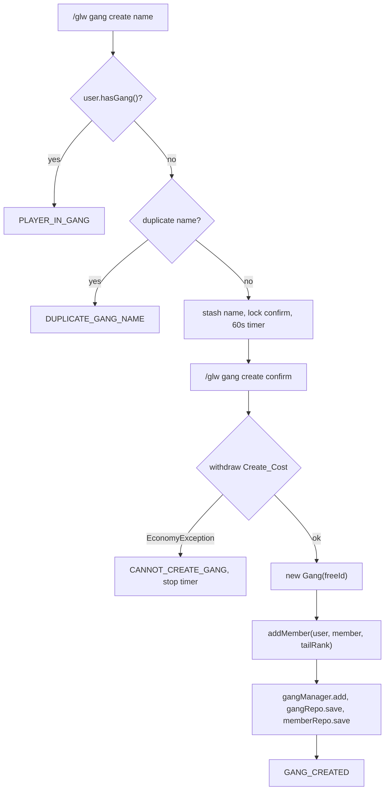
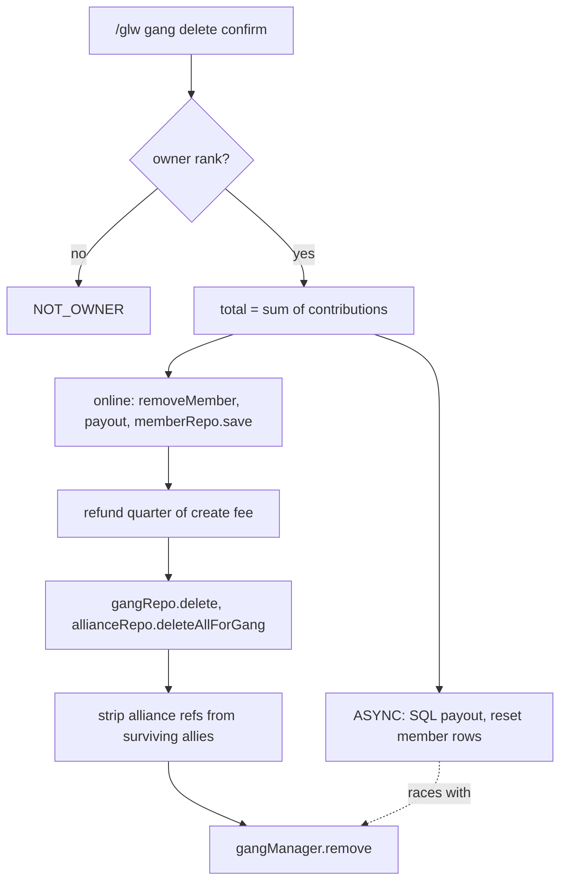
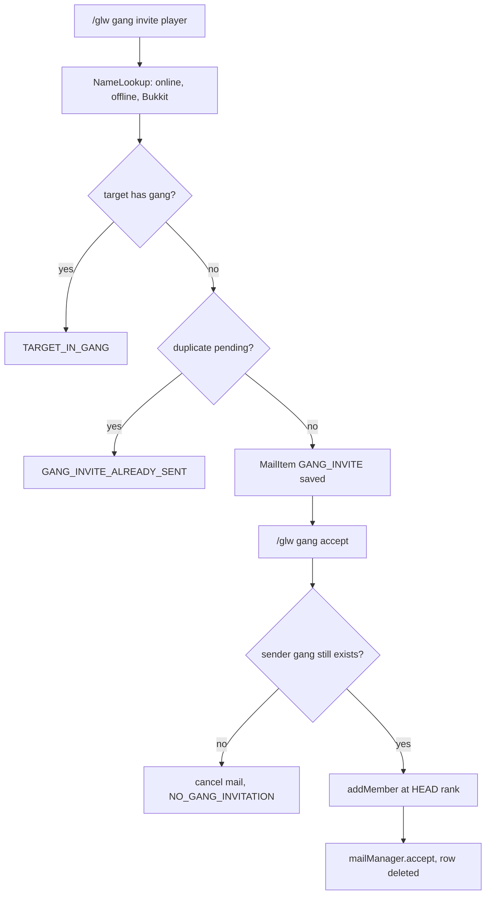
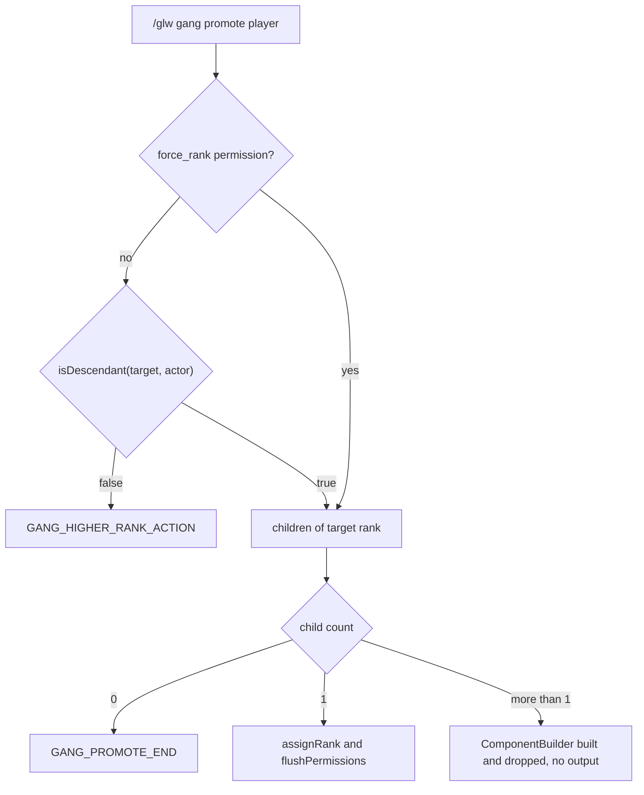
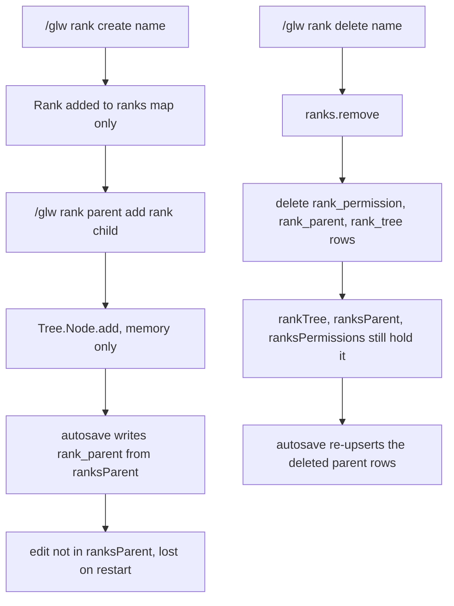
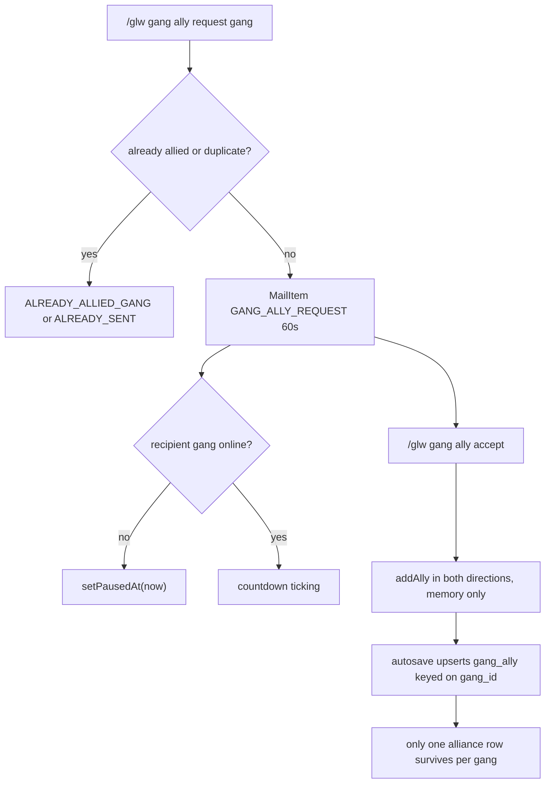
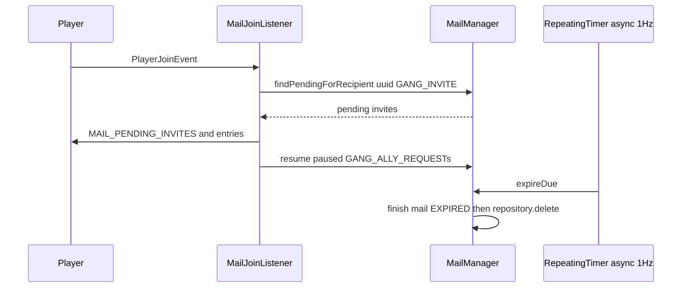
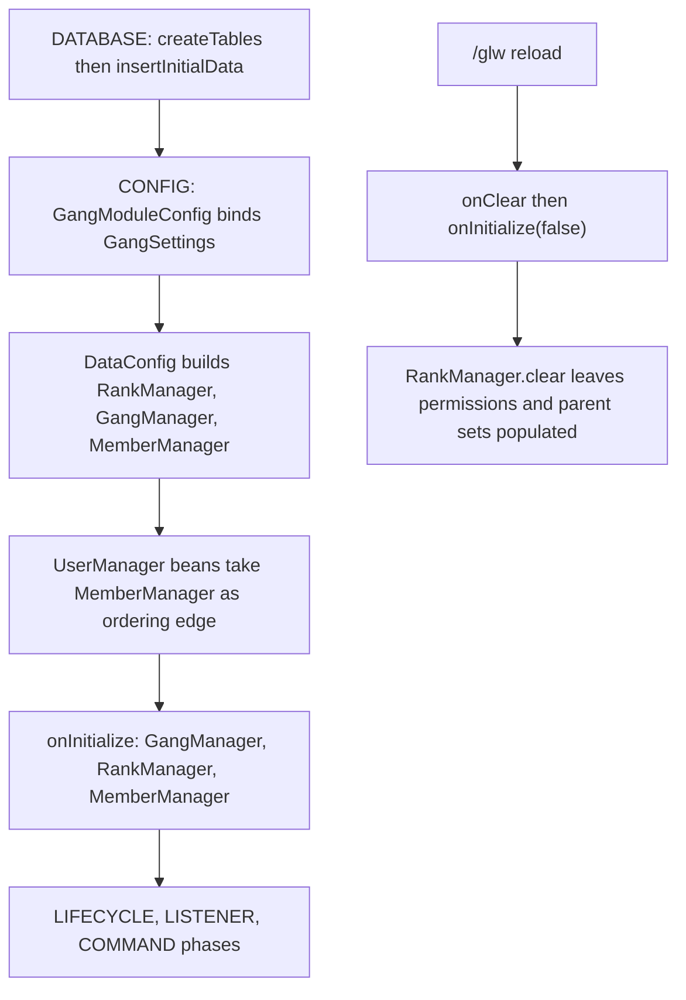

# Gangs, Members, Ranks, Permissions & Mail

<!-- preface:start -->
> **How to use this file.** This is a code-traced audit of *Gangs, Members, Ranks, Permissions & Mail* in Gangland Warfare, taken on
> 2026-09-02 from branch `0.8.1` (Keystone 1.7.3). It describes what the code **does today**, workflow by workflow,
> so an agent can fix a bug, tweak behaviour, plan a feature, or write tests without re-tracing the system.
>
> - **Citations are pointers, not proof.** Every `File.java:line` was checked after writing, but the code moves.
>   Before you change anything, open the cited file and grep the symbol named in the sentence; trust the class and
>   method names over the line number. A citation ending in `:line-unverified` could not be re-located.
> - **Observations are findings, not confirmed bugs.** Each row carries the tracer's confidence. Rows prefixed
>   `WITHDRAWN:` were disproved during verification and are kept only so the numbering stays stable. Reproduce a
>   High-risk row in code (or a test) before fixing it.
> - **Sections.** *Components* names the classes; *Configuration & Data* the YAML keys, tables and message keys;
>   *Workflows* (`W1`, `W2`, …) the execution paths with trigger, steps, diagram, persistence effects and guards;
>   *Cross-feature Dependencies* what breaks elsewhere if you change this; *Test Surface* what can be unit-tested
>   with plain JUnit/Mockito versus what needs Bukkit/Keystone mocks or a live server.
> - **Conventions live elsewhere.** For *how* to add or change code in this repo, follow `CLAUDE.md` at the repo
>   root (Spigot-only APIs, method-brace style, Keystone at provided scope, the SQLite test teardown rules), the
>   `command-create` and `panel-create` skills for new commands and GUI panels, and the feedback rules in the
>   project memory (YAML key style, `SoundEffect` for sounds, `ItemRefresher` per item type, `setDataSupplier`
>   for every repository, no Paper APIs).
> - **Risk stars** on the rendered page: three stars = High (a player can hit it in normal play), two = Medium
>   (situational), one = Low (cosmetic or unlikely).

Rendered page with diagrams and a table of contents: https://claude.ai/code/artifact/c0ae92aa-f60d-4ab4-8776-0c0f512eca2b
<!-- preface:end -->

> Diagrams below are Mermaid source; the rendered version with drawn diagrams is the linked page above.

## Overview
Gangs are player-owned organisations held entirely in RAM by three CONFIG-phase beans — `GangManager` (`Map<Integer, Gang>`), `MemberManager` (`Map<UUID, Member>`) and `RankManager` (ranks + permissions + a `Tree<Rank>`) — and flushed to SQL by `PeriodicalUpdates` → `RepositoryRegistry.saveAll()`, which is an **upsert-only** pass and never a delete pass. Membership is a *three-sided* link: `User.gangId` (player row), `Member.gangId`/`Member.rank` (member row) and `Gang.members` (the list); only `Gang.addMember` / `Gang.removeMember` keep all three in step. Ranks are **global, not per-gang**: one shared `Tree<Rank>` rooted at the `Gang.Rank.Head` name ("member") whose deepest leaf is the `Gang.Rank.Tail` ("owner"), and "actor outranks target" is expressed as `rankTree.isDescendant(targetNode, actorNode)`. There is **no per-permission gate on any gang subcommand** — authority is only rank-tree depth (kick/promote/demote), `match(tailId)` owner checks (delete/transfer/leave), or nothing at all (invite, ally, deposit, withdraw, rename, description, display, color). Cross-session requests (gang invites, alliance requests) are modelled as `MailItem` rows owned by the `gangland-mail` feature module, expired by a 1 Hz async sweep and surfaced on `PlayerJoinEvent`. There is no gang-chat feature and no chat filter in this codebase; `/glw filter` is the *inventory* list filter that backs the gang-search GUI.

## Components
| Class | Location | Role |
|---|---|---|
| `Gang` | `gangland-infra/gangland-domain/src/main/java/org/luckyraven/gangland/gang/Gang.java` | Gang aggregate: id, name/displayName/color/description, `Level`, `Bounty`, `EconomyHandler` (vault), `List<Member>`, `Set<GangAlliance>`, `State{OPEN,INVITE,CLOSE}`; owns `addMember`/`removeMember`, the only atomic membership mutators |
| `GangAlliance` | `.../gang/GangAlliance.java` | `record (Gang gang, Gang ally, long since)` |
| `GangManager` | `.../gang/GangManager.java` | `BeanLifecycle` + `GangLookupContract`; id→Gang cache, wires the alliance repo's gang lookup, sets both data suppliers in `initialize()` (:254-271) |
| `GangSettings` | `.../gang/GangSettings.java` | Static facade over `GangSettingsContract`, bound by `GangModuleConfig` during CONFIG; throws `IllegalStateException` if read too early (:82-88) |
| `GangFilterAdapter` / `MemberFilterAdapter` | `.../gang/GangFilterAdapter.java`, `.../gang/member/MemberFilterAdapter.java` | Project `Gang`/`Member` onto `StandardFilterField` axes for the list views |
| `Member` | `.../gang/member/Member.java` | Per-player gang row: `gangId` (-1 = none), `contribution`, `@Nullable Rank`, `gangJoinDateLong`; `hasPermission` = rank node OR Vault (:58-64) |
| `MemberManager` | `.../gang/member/MemberManager.java` | UUID→Member cache; `assignRank` (the Vault-safe rank setter, :249), `getMembersByRank`, `applyRankPermissionChange`, `initializeMemberData` |
| `Rank` | `.../gang/rank/Rank.java` | Name + `usedId` + `Tree.Node<Rank>` + `List<Permission>` + nullable `vaultGroup`; **static `ID` counter** |
| `Permission` / `RankParent` / `RankPermission` | `.../gang/rank/*.java` | Permission POJO with a static id counter; `record RankParent(rankId, parentId)` where **`parentId` actually holds the CHILD id** (see `RankManager:88-93`); `record RankPermission(rankId, permissionId)` |
| `RankManager` | `.../gang/rank/RankManager.java` | Ranks, permissions, rank↔parent set, rank↔permission set and the `Tree<Rank>`; `addPermission`/`removePermission` persist immediately |
| `VaultPermissionBridge` | `.../gang/vault/permission/VaultPermissionBridge.java` | Static facade over Keystone `OfflinePermissionService`: `onRankTransition`, `applyPermissionChange`, group add/remove, safe no-op without Vault |
| Contracts | `.../gang/contract/*.java` | `GangLookupContract`, `RankLookupContract`, `UserLookupContract`, `MemberRepositoryContract`, `GangAllianceRepositoryContract`, `PermissionRegistryContract`, `GangSettingsContract`, `GangMessageContract`, `GangPermissionBridgeContract` |
| `MailItem` / `MailType` / `MailStatus` | `gangland-features/gangland-mail/src/main/java/org/luckyraven/gangland/mail/*.java` | Persistent request record; types `GANG_INVITE`, `GANG_ALLY_REQUEST`, `GENERIC_MESSAGE`; `expiresAt`, `pausedAt`, `read`, `subject` |
| `MailManager` | `gangland-features/gangland-mail/.../mail/MailManager.java` | `ConcurrentHashMap<Long, MailItem>` cache, client-side `AtomicLong` id allocation, lookup helpers, `accept/reject/cancel/expireDue` → `finish()` = status + cache remove + `repository.delete` |
| `MailConfig` | `gangland-impl/src/main/java/org/luckyraven/gangland/config/MailConfig.java` | Dispenses `MailRepositoryContract` + `MailManager`, starts the 1 Hz **async** expiry `RepeatingTimer` |
| `GangModuleConfig` | `gangland-impl/.../config/GangModuleConfig.java` | Binds every gang contract to its impl-side adapter |
| `GangFilterRegistration` | `gangland-impl/.../config/GangFilterRegistration.java` | Registers the `gangs` and `gang_members` filter bindings |
| `GangCommand` + 16 subs | `gangland-impl/.../command/sub/gang/**` | `/glw gang …` tree |
| `RankCommand` + 10 subs | `gangland-impl/.../command/sub/rank/**` | `/glw rank …` tree |
| `PermissionsCommand` + 2 subs | `gangland-impl/.../command/sub/permissions/**` | Permission-registry introspection |
| `FilterCommand` | `gangland-impl/.../command/sub/filter/FilterCommand.java` | Generic list-view filter mutation, used by the gang-search GUI |
| `ComponentExecutorCommand` | `gangland-impl/.../command/sub/debug/ComponentExecutorCommand.java` | `/glw option gang rank <player> <rank>` — the intended multi-child promote target; nominally out of scope but load-bearing for promote |
| `GangItemSourceProvider` | `gangland-impl/.../file/configuration/inventory/itemsource/GangItemSourceProvider.java` | Backs the `gang_members`, `gang_allies`, `gangs` item sources for the YAML GUIs |
| `MailJoinListener` / `MailQuitListener` | `gangland-impl/.../listener/mail/**` | Surface pending mail on join; pause ally-request expiry when the recipient gang goes fully offline |
| `GangMembersDamageListener` | `gangland-impl/.../listener/gang/GangMembersDamageListener.java` | Cancels PvP between same-gang / allied players (Bukkit + weapon-raytrace paths) |
| Repositories | `gangland-impl/.../database/repositories/{gang,rank,mail}/**` | `GangRepository`, `GangAllianceRepository`, `RankRepository`, `RankParentRepository`, `RankPermissionRepository`, `MailRepository` |

## Configuration & Data

### YAML files and notable keys
`gangland-impl/src/main/resources/settings.yml`, block `Gang:` at line 447, parsed in `file/configuration/Settings.java:514-527`:

| Key | Field | Default | Consumer |
|---|---|---|---|
| `Gang.Enable` | `gangEnabled` | `true` | `@CommandHandler(condition="isGangEnabled")` on `GangCommand`; `@ListenerHandler(condition=…)` on `GangMembersDamageListener` |
| `Gang.Name_Duplicates` | `gangNameDuplicates` | `false` | `GangCreateCommand:157`, `GangRenameCommand:72` |
| `Gang.Display_Name_Char` | `gangDisplayNameChar` | `'*'` | `Gang.getDisplayNameString()`; read as `str(...).substring(0, 1)` (`Settings.java:523`) |
| `Gang.Rank.Head` | `gangRankHead` | `"member"` | tree root name (`RankManager:97-103`); rank granted to a joining member (`GangInviteAcceptCommand:169`) |
| `Gang.Rank.Tail` | `gangRankTail` | `"owner"` | owner rank; granted to the founder (`GangCreateCommand:117`); checked by delete/leave/transfer |
| `Gang.Account.Initial_Balance` | `gangInitialBalance` | `0` | `GangCreateCommand:119` |
| `Gang.Account.Create_Cost` | `gangCreateFee` | `100_000` | withdrawn on create; **¼ refunded to the disbanding owner** (`GangDeleteCommand:288`) |
| `Gang.Account.Maximum_Balance` | `gangMaxBalance` | `100_000_000_000` | deposit cap; also drives the balance icon material in `GangCommand.itemToBalance` |
| `Gang.Account.Contribution_Rate` | `gangContributionRate` | `1_000` | money↔contribution conversion in deposit/withdraw |

Inventory YAMLs (`gangland-impl/src/main/resources/inventory/`, declared in `config/GameplayConfig.java:165-172`):
- `gang_info.yml` (45 slots) — gang overview; buttons run `/glw gang`, `/glw gang desc`, `/glw gang color`.
- `gang_stat.yml` — **8 lines: only `Information.Size: 54`; no `Slots`, no content.**
- `alliance_stat.yml` (54 slots) — `Item_Source: "gang_allies"`; entry click runs **`/glw gang ally info %ally_id%`, a command that does not exist** (Obs. #16).
- `phone_gang.yml` (45 slots) — anvil "Create Gang" → `/glw gang create %gangland_anvil_output%`.
- `phone_gang_search.yml` (54 slots) — `Item_Source: "gangs"`; buttons run `/glw filter gangs search|set DESCRIPTION|next COLOR …|clear|sort`.

### Database tables and repositories
| Table | Columns (PK in bold) | Repository | Delete path |
|---|---|---|---|
| `gang` | **id**, name, display_name, description, color, balance, level, experience, bounty, created, last_member_online_at, state | `GangRepository` | `delete("id = ?")` on disband |
| `gang_ally` | **gang_id**, ally_id, since | `GangAllianceRepository` | `deleteAllForGang` (async, both directions); `doDelete` on `(gang_id, ally_id)` — **never invoked by `/glw gang ally abandon`** |
| `member` | **uuid**, gang_id, contribution, rank_id, join_date | `MemberRepository` (`database/repositories/player`) | reset in place, never deleted |
| `rank_tree` | **id**, name, vault_group | `RankRepository` (+ `insertInitialRanks`) | `delete("id = ?")` |
| `rank_parent` | **id**, parent_id | `RankParentRepository` (+ `insertInitialRelation`) | `delete("id = ?")` — parent side only |
| `rank_permission` | **rank_id**, **permission_id** (composite; `migrateSchema` upgrades the legacy single-PK layout) | `RankPermissionRepository` (+ `deleteAllForRank`) | `delete("rank_id = ? AND permission_id = ?")` |
| `permission` | **id**, name | `PermissionRepository` | via `RankManager.removePermission` when the last link is dropped |
| `mail` | **id**, type, status, sender_uuid, sender_gang_id, recipient_uuid, recipient_gang_id, subject, created_at, expires_at, paused_at, read_flag | `MailRepository` | `delete("id = ?")` from `MailManager.finish` |

Initial data: `database/GanglandDatabase.java:112-126` (`insertInitialData`) inserts the tail rank first (id `COUNT(*)+1` = 1) then the head (id 2), then `RankParent(headId, tailId)` — so the tree root is the head and its single child is the tail.

Data suppliers (required by `AbstractRepository.saveAllFromMemory`, else autosave throws `No data supplier set`): `GangManager.initialize()` (gang, gang_ally), `MemberManager.initialize()` (member), `RankManager.initialize()` (rank, permission, rank_parent, rank_permission), `MailManager.initialize()` (mail). All four are wired.

### Message keys / localization
All 116 `Messages.*` constants referenced from `command/sub/gang`, `command/sub/rank`, `command/sub/permissions` and `listener/mail` are declared in `file/configuration/Messages.java`, and **every one of those declared paths resolves to a real key in `resources/message/message_en.yml`** (verified by parsing both files — 0 missing). Key families: `Commands.Gang.*` (create/remove/invite/ally/transfer/promote/demote/kick/leave/rename/description/display/color/economy), `Commands.Rank.*` (create/remove/parent/permission/info/VaultGroup), `Commands.Permissions.*`, `Information.Mail.Pending_Invites.*`, `Information.Mail.Pending_Ally_Requests.*`.

`commands.json` carries 44 gang/rank/permission help entries but **has no entry for `gang_ally_accept`, `gang_ally_reject`, `gang_ally_abandon` (only `gang_ally_remove`), or a rank-vaultgroup "show" form**.

## Commands & Permissions
Permission nodes are derived by Keystone as `gangland.command.<root-label>` (`Keystone Command.java:50`) and registered with Bukkit at `Argument` construction (`Keystone Argument.java:111-119, 211`) with **`PermissionDefault.OP`**. Sub-arguments inherit the root node — **there is no per-subcommand permission anywhere in this area**. `plugin.yml` declares only `gangland.command.main: op`.

| Command | Class | Permission | What it does |
|---|---|---|---|
| `/glw gang` | `GangCommand` | `gangland.command.gang` | shows help when the sender has no gang; otherwise no-op |
| `/glw gang create <name>` → `confirm` | `GangCreateCommand` | ↑ | duplicate-name check, 60 s confirm, charges `Create_Cost`, creates the gang, saves gang+member immediately |
| `/glw gang delete\|remove\|del` → `confirm` | `GangDeleteCommand` | ↑ (**owner rank required**) | disbands: splits the vault by contribution, resets all members (sync online / async offline SQL), deletes gang + alliance rows, refunds ¼ of the fee |
| `/glw gang invite` / `invite <player>` / `invite cancel [player]` | `GangInviteCommand`, `GangInviteCancelCommand` | ↑ (**no rank check**) | lists outgoing invites / sends a `GANG_INVITE` mail (60 s expiry online, no expiry offline) / cancels |
| `/glw gang accept [gang]` | `GangInviteAcceptCommand` | ↑ | accepts the oldest or a named pending invite; joins at the **head** rank |
| `/glw gang kick <player>` | `GangKickCommand` | ↑ (**rank-tree descendant check**) | removes a member; hydrates an offline `User` when needed |
| `/glw gang leave` (typed twice within 60 s) | `GangLeaveCommand` | ↑ (**blocked for the owner**) | leaves, forfeits contribution, broadcasts |
| `/glw gang promote <player>` | `GangPromoteCommand` | ↑ + optional `gangland.command.gang.force_rank` | walks one child node down the tree; **silently does nothing when the node has >1 child** |
| `/glw gang demote <player>` | `GangDemoteCommand` | ↑ + `…force_rank` | walks to `node.getParent()` |
| `/glw gang transfer <player>` → `confirm` | `GangTransferCommand` | ↑ (**owner only**) | old owner → tail's parent rank, target → tail |
| `/glw gang deposit <amount>` | `GangDepositCommand` | ↑ (**no rank check**) | player→vault, adds contribution, enforces `Maximum_Balance` |
| `/glw gang withdraw <amount>` | `GangWithdrawCommand` | ↑ (**no rank check — any member can empty the vault**) | vault→player, subtracts contribution (may go negative) |
| `/glw gang balance\|bal` | `GangBalanceCommand` | ↑ | prints the vault balance |
| `/glw gang members\|list` | `GangMembersCommand` | ↑ | chat roster with rank + online status |
| `/glw gang rename <name>` | `GangRenameCommand` | ↑ (**no rank check**) | duplicate-checked rename + broadcast |
| `/glw gang desc\|description` | `GangDescriptionCommand` | ↑ (**no rank check**) | AnvilGUI description editor |
| `/glw gang display <name>` / `display remove` | `GangDisplayCommand` | ↑ (**no rank check**) | sets/clears the coloured display name |
| `/glw gang color` | `GangColorCommand` | ↑ (**no rank check**) | wool-palette GUI + confirm screen |
| `/glw gang ally request <gang>` | `GangAllyRequestCommand` | ↑ (**no rank check**) | sends a `GANG_ALLY_REQUEST` mail (60 s, paused if the target gang is fully offline) |
| `/glw gang ally accept [gang]` | `GangAllyAcceptCommand` | ↑ | adds the alliance **on both sides** in memory |
| `/glw gang ally reject [gang]` | `GangAllyRejectCommand` | ↑ | rejects and notifies both gangs |
| `/glw gang ally abandon <gang>` | `GangAllyAbandonCommand` | ↑ | removes the alliance from both in-memory sets (**no DB delete**) |
| `/glw gang ally pending` / `pending cancel [gang]` | `GangAllyPendingCommand`, `GangAllyPendingCancelCommand` | ↑ | lists / cancels outgoing ally requests |
| `/glw rank` | `RankCommand` | `gangland.command.rank` (console-allowed) | help |
| `/glw rank create <name>` → `confirm` | `RankCreateCommand` | ↑ | creates a rank **not attached to the tree** |
| `/glw rank delete\|remove\|del <name>` → `confirm` | `RankDeleteCommand` | ↑ | removes from the map and purges `rank_permission` / `rank_parent` / `rank_tree` rows |
| `/glw rank list` | `RankListCommand` | ↑ | lists ranks |
| `/glw rank info <name>` | `RankInfoCommand` | ↑ | id, children, vault group, permissions |
| `/glw rank traverse` | `RankTraverseCommand` | ↑ | prints `rankTree.getAllNodes()` in order |
| `/glw rank parent add\|remove <rank> <child>` | `RankParentAddCommand`, `RankParentRemoveCommand` | ↑ | mutates the in-memory tree **only** |
| `/glw rank permission add\|remove <rank> <perm>` | `RankPermissionAddCommand`, `RankPermissionRemoveCommand` | ↑ | mutates the rank's list, persists immediately, mirrors into Vault |
| `/glw rank vaultgroup\|vgroup <rank> [group\|clear]` | `RankVaultGroupCommand` | ↑ | shows/sets/clears the Vault group and re-syncs every wearer |
| `/glw permissions\|perms\|perm [query] [page]` | `PermissionsCommand` | `gangland.command.permissions` | paged permission search |
| `/glw permissions categories` / `check <perm>` | `PermissionsCategoriesSubArgument`, `PermissionsCheckSubArgument` | ↑ | category counts / Bukkit-vs-tracked drift report |
| `/glw filter <binding> sort\|clear\|search\|set\|cycle\|next …` | `FilterCommand` | `gangland.command.filter` | mutates the per-player `SearchFilter` for the `gangs` / `gang_members` bindings and reopens the view |
| `/glw option gang rank <player> <rank>` | `ComponentExecutorCommand` | `gangland.command.option` | **sets any gang member to any rank with no hierarchy check** |

## Events
| Event | Fired by | Handled by | Purpose |
|---|---|---|---|
| `PlayerJoinEvent` | Bukkit | `MailJoinListener.onJoin` (MONITOR) | surfaces pending gang invites; resumes paused ally-request timers |
| `PlayerQuitEvent` | Bukkit | `MailQuitListener.onQuit` (MONITOR) | pauses ally-request expiry when the quitter was the gang's last online member |
| `EntityDamageByEntityEvent` | Bukkit | `GangMembersDamageListener.onGangMemberHitMembers` (LOWEST) | cancels same-gang / ally PvP |
| `WeaponRaytraceImpactEvent` | `gangland-weapon` | `GangMembersDamageListener.onGangMemberWeaponImpact` (LOWEST) | same, for weapon paths that bypass Bukkit damage |
| `GangBountyEvent` | **nobody — never constructed** | `listener/player/BountyIncreaseListener:43` | intended gang-bounty hook |
| `GangLevelUpEvent` | **nobody — never constructed** | `listener/player/LevelUpListener:44` | intended gang-level hook |

## Workflows

### W1: Create a gang
**Trigger:** `/glw gang create <name>` then `/glw gang create confirm` (or the anvil in `phone_gang.yml`).

**Steps:**
1. `GangCreateCommand.gangCreate()` name `OptionalArgument` (`gangland-impl/src/main/java/org/luckyraven/gangland/command/sub/gang/GangCreateCommand.java:142`) — resolves `User<Player>`, aborts if `user.hasGang()`, aborts if `confirmCreate.isLocked(sender)`.
2. Duplicate check (:157-161): when `Settings.isGangNameDuplicates()` is false, scans `gangManager.getGangs().values()` with `equalsIgnoreCase`. **No length, charset, colour-code or blank-name validation.**
3. Stashes the name in `createGangName` (keyed by `User<Player>`), prints the fee and the confirm hint, and `confirmCreate.lock(sender, …)` starts a 60 s `CountdownTimer` with `start(false)` (sync) that reminds each second and, on finish, unlocks and clears both maps (:172-189).
4. Confirm branch (`ConfirmArgument`, :82): re-resolves user/member, re-checks `hasGang()`, then `user.getEconomy().withdrawAmount(Settings.getGangCreateFee())`; an `EconomyException` stops the timer and sends `CANNOT_CREATE_GANG` (:95-106).
5. Generates a free id by rejection sampling on `Gang.generateId()` (`Random.nextInt(Integer.MAX_VALUE)`) (:108-112).
6. `member.setGangJoinDateLong(now)`; `gang.addMember(user, member, rankManager.get(Settings.getGangRankTail()))` — sets `user.gangId`, `member.gangId`, `member.rank` and fires `VaultPermissionBridge.onRankTransition` (:116-117).
7. `gang.setName(createGangName.get(user).get())`, `gang.getEconomy().setAmount(Settings.getGangInitialBalance())`, `gangManager.add(gang)` (:118-121).
8. Immediate persistence: `gangRepository.save(gang)` + `memberRepository.save(member)` (:124-127).
9. `GANG_CREATED` message; clears `createGangName`, stops and removes the timer (:129-137).

**Diagram:**

**State & persistence effects:** a new `gang` row and the updated `member` row are written synchronously; the `user` row (gangId, balance) waits for autosave. Defaults on the fresh `Gang`: `created = now`, `state = OPEN`, `color = LIGHT_BLUE`, `description = "Conquering the hood"`, `displayName = ""`.

**Edge cases & guards observed:** `memberManager.getMember(uuid)` is dereferenced without a null check (:116) — Obs. #1. `rankManager.get(tail)` may return `null`, producing a rankless founder who can then never disband or transfer. If the player disconnects during the 60 s window the timer still ticks and cleans up; `ConfirmArgument` lock state is keyed by `CommandSender`.

### W2: Disband a gang
**Trigger:** `/glw gang delete` then `/glw gang delete confirm` (owner only).

**Steps:**
1. `GangDeleteCommand.action()` (`command/sub/gang/GangDeleteCommand.java:80`): requires `user.hasGang()`, `member.getRank() != null` and `member.getRank().match(tail.getUsedId())`, else `NOT_OWNER`. If `gangManager.getGang(user.getGangId())` is null it self-heals user+member and bails (:108-116).
2. Stashes the gang name, prints the confirm hint, locks `confirmDelete` with a 60 s timer.
3. Confirm branch (:142) repeats every check, then computes `total = Σ member.contribution` over `gang.getMembers()` (:183).
4. **Online members (sync, :201-225):** capture `freq`, compute `amount = balance × freq/total` (`Currency.ZERO` when `Math.round(total) == 0`), `gang.removeMember(gangUser, mem)` (resets user + member + Vault), `gang.getEconomy().withdrawAmount(amount)`, `gangUser.getEconomy().depositAmount(amount)`, `memberRepository.save(mem)`, then three messages (`KICKED_FROM_GANG`, `GANG_REMOVED`, `DEPOSIT_MONEY_PLAYER`).
5. **Offline members (async, :230-285):** `helper.runQueriesAsync` selects `uuid, contribution` from `member` where `gang_id = ?`, skips the online UUIDs, reads the offline `balance` from `user`, computes the same share, calls `gang.getEconomy().withdrawAmount(amount)` **from the async thread**, updates `user.balance`, resets the member row (`gang_id = -1, contribution = 0, rank_id = -1`) and, when cached, `memberManager.assignRank(mem, null)`.
6. Refunds ¼ of `Create_Cost` to the disbanding owner (:288-292).
7. `gangRepository.delete(gang)`; `GangAllianceRepository.deleteAllForGang(gang)` (itself async, deletes both `gang_id = ?` and `ally_id = ?`) (:294-301).
8. Removes the deleted gang from every surviving ally's in-memory `allies` set (:305-308), then `gangManager.remove(gang)` and cancels the timer.

**Diagram:**

**State & persistence effects:** the `gang` row is deleted; `gang_ally` rows are deleted asynchronously; online members' `member` rows are saved synchronously while their `user` balances wait for autosave; offline members' `member` and `user` rows are updated by raw SQL. Ranks are global, so a disband orphans no rank rows.

**Edge cases & guards observed:** the async block mutates `Gang.economy` and calls `MemberManager.assignRank` (→ `Bukkit.getOfflinePlayer` → Vault) off the main thread while steps 7-8 concurrently delete the gang (Obs. #2). `member` is dereferenced at :95 / :155 with no null guard. `deleteGangName.get(user).get()` at :222 NPEs if the timer already cleared the entry. `(double) row[1]` and `(double) userRow[0]` are unchecked casts on JDBC values.

### W3: Invite, accept and cancel
**Trigger:** `/glw gang invite <player>`, `/glw gang accept [gang]`, `/glw gang invite cancel [player]`.

**Steps (send):**
1. `GangInviteCommand.invitePlayerArgument()` (`command/sub/gang/invite/GangInviteCommand.java:112`): requires a gang; **no rank or permission check**.
2. `NameLookup.findByName` (`command/sub/gang/invite/NameLookup.java:23-50`) searches the online cache, then the offline cache, then `Bukkit.getOfflinePlayers()` — creating and caching a `User<OfflinePlayer>` on demand.
3. Rejects targets that already have a gang (`TARGET_IN_GANG`) and duplicate pending invites from the same gang (`GANG_INVITE_ALREADY_SENT`, :141).
4. Builds `MailItem(allocateId(), GANG_INVITE, null, senderGangId, targetUuid, NO_GANG, null, now, expiresAt, PENDING, false)` with `expiresAt = now + 60_000` when the target is online and `0` (never expires) when offline (:153-157), then `mailManager.send(mail)` → cache put + `repository.save`.
5. Messages the sender and, if online, the target.

**Steps (accept):**
1. Bare `/glw gang accept` takes `pending.get(0)` (`GangInviteAcceptCommand.java:71-92`); the `OptionalArgument` branch resolves a gang id through `getActualValue` over the disambiguated `name[:id]` completion map (:99-165).
2. If the sender gang no longer exists the mail is cancelled and `NO_GANG_INVITATION` is sent.
3. `doAccept` (:167-184): broadcasts `GANG_PLAYER_JOINED` to online members, sets `gangJoinDateLong`, `gang.addMember(user, member, rankManager.get(Settings.getGangRankHead()))`, messages the joiner, `mailManager.accept(mail)` (status ACCEPTED, cache remove, row delete).

**Steps (cancel):** `GangInviteCancelCommand` resolves the oldest or a named outgoing invite and calls `mailManager.cancel`, notifying the target if online (`:311-321`).

**Diagram:**

**State & persistence effects:** one `mail` row per invite, deleted on accept/cancel/expiry. Membership changes are in-memory only (no immediate `memberRepository.save`), so an accept lost to a crash before autosave is lost.

**Edge cases & guards observed:** there is **no `/glw gang invite deny|reject`** — a recipient can only ignore an invite (online invites self-expire after 60 s; offline invites never expire). Accepting one invite leaves the player's other pending invites alive and `PENDING` against a player who now has a gang. `member` at `doAccept:168` is dereferenced unguarded and `gang` (`GangInviteCommand:138`) is used at :166 without a null check.

### W4: Kick a member
**Trigger:** `/glw gang kick <player>`.

**Steps:**
1. `GangKickCommand.gangKick()` (`command/sub/gang/GangKickCommand.java:140`): requires a gang; resolves the target by scanning `gang.getMembers()` and comparing `Bukkit.getOfflinePlayer(uuid).getName()` case-insensitively (:157-165).
2. Self-kick is rejected (`GANG_CANNOT_ACT_SELF`, :173).
3. Hierarchy gate (:189): `rankManager.getRankTree().isDescendant(targetNode, playerNode)` — the actor's node must be a descendant of the target's (head-rooted tree ⇒ deeper = higher rank).
4. Target user resolution (:194-214): online → `userManager.getUser`; offline → `offlineUserManager.create(offlinePlayer)`, `userDataLoader.loadUserData(offlineUser, userTable, bankTable)`, `offlineUserManager.add(...)`.
5. `gang.removeMember(targetUser, targetMember)` → `user.flushPermissions(null)`, `user.resetGang()`, member reset to `gangId = -1, contribution = 0, rank = null`, `VaultPermissionBridge.onRankTransition(uuid, oldRank, null)`, list removal.
6. Messages the target (if online) and the kicker.

**State & persistence effects:** purely in-memory; both the `member` and `user` rows wait for the next autosave. No mail involvement.

**Edge cases & guards observed:** `userMember` (:146) is dereferenced at :178 with no null check. Tab-completion (`getDescendantRanks`, :66-119) inserts an empty string when nothing matches. Members whose `OfflinePlayer.getName()` is null cannot be kicked by name.

### W5: Leave a gang
**Trigger:** `/glw gang leave` typed twice within 60 s.

**Steps:**
1. `GangLeaveCommand.executeArgument` (`command/sub/gang/GangLeaveCommand.java:57`) overrides dispatch: `preChecks` → if the sender is not locked, print `ARGUMENT_CONFIRM_HINT`, `lock.lock(sender)` and schedule a `runTaskLater` unlock after `20*60` ticks; otherwise unlock, cancel the task and fall through to `action()`.
2. `preChecks` and `action()` both re-verify membership, self-heal when the gang id dangles (:93-100), and refuse when `member.getRank().match(tail.getUsedId())` — the owner must transfer first (`GANG_TRANSFER_OWNERSHIP`).
3. `gang.removeMember(user, member)` (contribution forfeited), `GANG_LEAVE` to the leaver, then `GANG_PLAYER_LEFT` broadcast to `gang.getOnlineMembers(...)` — which no longer includes the leaver because `resetGang()` already ran (:346-354).

**State & persistence effects:** in-memory only; autosave persists.

**Edge cases & guards observed:** `member` is dereferenced at :328 / :371 after a null-free `getMember`. `autoUnlock` is a `HashMap<CommandSender, BukkitTask>` whose entries the task removes itself, so a quit inside the window leaves at most one entry for 60 s. Ownership is correctly re-verified between hint and confirm.

### W6: Promote, demote and force-set rank
**Trigger:** `/glw gang promote <player>`, `/glw gang demote <player>`, `/glw option gang rank <player> <rank>`.

**Steps (promote):**
1. `GangPromoteCommand.gangPromote()` (`command/sub/gang/GangPromoteCommand.java:72`): `force = player.hasPermission("gangland.command.gang.force_rank")` (that node is registered in `GangCommand:124`).
2. Target resolution by offline name over `gang.getMembers()`; self-action rejected (:108).
3. Unless `force`: same rank rejected (`GANG_SAME_RANK_ACTION`, :122), then `isDescendant(targetNode, userNode)` must hold (:133).
4. `nextRanks = Objects.requireNonNull(rankTree.find(currentRank)).getNode().getChildren()` (:140).
5. Empty → `GANG_PROMOTE_END`. **Exactly one child → apply** (:165-186): message the target if online, `onlineUser.flushPermissions(first)`, message the promoter, `memberManager.assignRank(targetMember, first)`.
6. **More than one child (:152-164): a `ComponentBuilder` of clickable rank options is built and then discarded — never sent.** The promotion silently does nothing.
7. The intended click target is `/glw option gang rank <player> <rank>` (`command/sub/debug/ComponentExecutorCommand.java:133-212`), which checks only "target rank ≠ my rank" and then `memberManager.assignRank(targetMember, rankManager.get(rankStr))` — **no tree-hierarchy check, so any rank including `owner` can be handed out**.

**Steps (demote):** identical shape (`GangDemoteCommand.java:67-153`); `previousRankNode = currentRank.getNode().getParent()`; null → `GANG_DEMOTE_END`; otherwise `flushPermissions(previousRank)` and `memberManager.assignRank(targetMember, previousRank)`.

**Diagram:**

**State & persistence effects:** `Member.rank` changes in memory; `VaultPermissionBridge.onRankTransition` revokes the old rank's nodes/group and grants the new one's; `member.rank_id` waits for autosave.

**Edge cases & guards observed:** `Objects.requireNonNull(rankTree.find(currentRank))` throws when the member's rank is not attached to the tree — which is the state of every rank made with `/glw rank create` until a `parent add` runs, and that attachment is itself never persisted (W8). Neither command re-checks the *resulting* rank against the actor's rank, so a promoter can raise a subordinate above themselves in one step.

### W7: Transfer leadership
**Trigger:** `/glw gang transfer <player>` then `/glw gang transfer confirm`.

**Steps:**
1. `transferTargetArgument` (`command/sub/gang/GangTransferCommand.java:74-124`): owner check via `match(tailId)`, target must be a gang member and not self, and `tail.getNode().getParent()` must exist (`GANG_TRANSFER_NO_PARENT`).
2. Stores `pendingTargets.put(user, new AtomicReference<>(targetUuid))`, sends the request and confirm hint, and calls `confirmTransfer.lock(sender)` — **with no timer and therefore no automatic unlock**.
3. Confirm (:127-195): pops the pending target, re-verifies gang + owner rank + tail parent, re-resolves `targetMember` and checks `targetMember.getGangId() == gang.getId()`.
4. `memberManager.assignRank(userMember, tailParent)` then `memberManager.assignRank(targetMember, tail)`; refreshes `PermissionAttachment`s for both sides when online; messages both parties.

**State & persistence effects:** two `Member.rank` mutations plus two Vault transitions; persisted at the next autosave.

**Edge cases & guards observed:** the confirm lock is never released on timeout or disconnect and `pendingTargets` (keyed by `User<Player>`) is only cleared on confirm — an abandoned transfer leaves both entries until restart (Obs. #10). All owner checks are correctly repeated after the confirm.

### W8: Rank creation, parenting and deletion
**Trigger:** `/glw rank create <name>` + `confirm`, `/glw rank parent add|remove <rank> <child>`, `/glw rank delete <name>` + `confirm`.

**Steps (create):** duplicate name → `RANK_EXIST`; else stash the name, lock the confirm and start a 60 s timer; on confirm `new Rank(name, Rank.getNewId())` and `rankManager.add(rank)` (`command/sub/rank/RankCreateCommand.java:52-57`). The rank is **not** inserted into `rankTree` and **not** saved immediately — it reaches SQL at the next autosave via `rankRepo.setDataSupplier(ranks::values)`.

**Steps (parent):** `RankParentAddCommand` (`command/sub/rank/parent/RankParentAddCommand.java:58-88`) validates both ranks, rejects self-parenting and duplicates, then calls `rank.getNode().add(childRank.getNode())` — **and nothing else**. `RankParentRemoveCommand` mirrors it with `node.remove`. Neither touches `RankManager.ranksParent`, the collection the `rank_parent` data supplier serialises, so the edit is lost on restart (Obs. #4). There is also no cycle detection.

**Steps (delete):** on confirm (`command/sub/rank/RankDeleteCommand.java:60-95`) `rankManager.remove(rank)`, then `RankPermissionRepository.deleteAllForRank(id)`, `rankParentRepository.delete(new RankParent(id, 0))` (deletes by `id = rankId` only), then `rankRepository.delete(rank)`.

**Diagram:**

**State & persistence effects:** `rank_tree` / `rank_parent` / `rank_permission` rows removed; the in-memory `rankTree`, `ranksParent` and `ranksPermissions` are *not* pruned, and `RankManager.clear()` (`gang/rank/RankManager.java:223-227`) clears only `ranks` and `rankTree`.

**Edge cases & guards observed:** nothing prevents deleting the configured head or tail rank (deleting `tail` makes every gang undisbandable, since `GangDeleteCommand:99` returns silently on a null tail); members still wearing the deleted rank keep the stale `Rank` object and a dangling `rank_id`; `RankRepository.resolveOrInsertRank` (`database/repositories/rank/RankRepository.java:56`) derives new ids from `COUNT(*) + 1`, which collides after deletions.

### W9: Rank permissions and Vault group mapping
**Trigger:** `/glw rank permission add|remove <rank> <perm>`, `/glw rank vaultgroup <rank> [group|clear]`.

**Steps (add):** `command/sub/rank/permission/RankPermissionAddCommand.java:70-84` rejects an existing node, then `rankManager.addPermission(rank, permString)` followed by `memberManager.applyRankPermissionChange(rank, permString, true)`. `RankManager.addPermission` (`gang/rank/RankManager.java:165-193`) reuses an existing `Permission` by case-insensitive string or mints one with `Permission.getNewId()`, adds the `RankPermission` link and the `Permission` to the rank's list, and **persists both immediately** (`permissionRepo.save`, `rankPermissionRepo.save`).

**Steps (remove):** `applyRankPermissionChange(..., false)` runs *before* `rankManager.removePermission`, which deletes the link row and, when no other rank references the permission, deletes the `permission` row too (`RankManager.java:195-216`).

**Steps (vault group):** `command/sub/rank/RankVaultGroupCommand.java:76-120` requires `VaultPermissionBridge.isEnabled()`, validates the group name against `VaultPermissionBridge.getGroups()` unless the token is `clear`, sets `rank.vaultGroup`, then for every `memberManager.getMembersByRank(rank)` removes the old group, adds the new one and re-grants the rank's nodes.

**What a permission gates:** nothing inside this feature area. `Member.hasPermission(node)` (`gang/member/Member.java:58`) is the only consumer of `Rank.permissions` in the gang domain and is not called by any gang subcommand — gang authority is rank-tree depth, not permission nodes. Rank permissions exist purely to be mirrored into Vault/Bukkit for other features.

**State & persistence effects:** immediate `permission` / `rank_permission` writes; `rank_tree.vault_group` at autosave; Vault grants/revokes dispatched through Keystone's `OfflinePermissionService`.

**Edge cases & guards observed:** an arbitrary string can be added — `RankManager.permissionExists` is never consulted by the add command (tab-completion draws from `PermissionManager`, but free text is accepted). Online players' Bukkit `PermissionAttachment` is not refreshed (only Vault is), so a newly added node does not take effect in-session unless a rank change also triggers `flushPermissions`.

### W10: Gang vault (deposit / withdraw / balance) and contribution
**Trigger:** `/glw gang deposit <amount>`, `/glw gang withdraw <amount>`, `/glw gang balance`.

**Steps (deposit):** `command/sub/gang/GangDepositCommand.java:66-113` parses `Currency.parse(args[2])`, computes `contribution = round(amount / Contribution_Rate × 10^(len-1)) / 10^(len-1)`, refuses when the player's balance is short (`CANNOT_TAKE_MORE_THAN_BALANCE`) or when `vault + amount > Maximum_Balance` (`CANNOT_EXCEED_MAXIMUM`), then `user.withdrawAmount` → `gang.depositAmount` → `member.increaseContribution` and broadcasts `GANG_MONEY_DEPOSIT` to online members.

**Steps (withdraw):** `command/sub/gang/GangWithdrawCommand.java:67-110` refuses only when the vault is short, then `user.depositAmount` → `gang.withdrawAmount` → `member.decreaseContribution` (the comment at :101 acknowledges contribution can go negative) and broadcasts `GANG_MONEY_WITHDRAW`.

**Permission checks:** **none on either command** beyond `gangland.command.gang` and gang membership.

**State & persistence effects:** `gang.balance`, `user.balance` and `member.contribution` all change in memory and are flushed at autosave.

**Edge cases & guards observed:** withdraw has no rank gate at all (Obs. #3); negative-amount handling depends on `Currency.parse`, which was not inspected (unverified); `member` is dereferenced without a null check in both commands; `gangManager.getGang(user.getGangId())` is not null-checked before `.getEconomy()`.

### W11: Alliances (request / accept / reject / abandon / pending)
**Trigger:** `/glw gang ally request|accept|reject|abandon|pending …`.

**Steps (request):** `command/sub/gang/ally/GangAllyRequestCommand.java:104-176` parses the gang id from the disambiguated completion map, rejects unknown gangs (`GANG_DOESNT_EXIST`), existing alliances (`receiving.isAlly(sending)`) and duplicates (`findPendingBetweenGangs`), broadcasts to both gangs' online members, then creates a `GANG_ALLY_REQUEST` `MailItem` with a 60 s expiry that is **paused immediately (`setPausedAt(now)`) when the recipient gang has nobody online**.

**Steps (accept):** `GangAllyAcceptCommand.doAccept` (`command/sub/gang/ally/GangAllyAcceptCommand.java:160-190`) short-circuits when already allied, else `userGang.addAlly(sending)` **and** `sending.addAlly(userGang)` (two `GangAlliance` records, one per direction), broadcasts to both gangs, then `mailManager.accept(mail)`.

**Steps (reject):** `GangAllyRejectCommand.doReject` (:159-176) broadcasts `GANG_ALLY_REJECT` to both gangs and calls `mailManager.reject(mail)`.

**Steps (abandon):** `GangAllyAbandonCommand.buildAllyId()` (:93-146) broadcasts to both gangs then `sending.removeAlly(receiving)` + `receiving.removeAlly(sending)` — **with no repository delete and no check that the two gangs were actually allied**.

**Steps (pending / pending cancel):** `GangAllyPendingCommand` lists outgoing requests; `GangAllyPendingCancelCommand` resolves the matching mail, `mailManager.cancel`s it and notifies the target gang.

**Diagram:**

**State & persistence effects:** alliances live only in `Gang.allies` until autosave calls `GangManager.buildAllAlliances()` and upserts. The `gang_ally` table's primary key is **`gang_id` alone**, so a gang with several allies keeps only the last-written row. Abandoning never deletes, so a removed alliance returns on the next `loadAll`.

**Edge cases & guards observed:** three commands stream `Bukkit.getOnlinePlayers()` and call `memberManager.getMember(uuid).getGangId()` unguarded (`GangAllyRequestCommand:150,159`; `GangAllyAcceptCommand:173,180`; `GangAllyAbandonCommand:124,133`). No rank or permission gate on any ally subcommand. `GangAllianceRepository.doLoadAll` does drop and delete orphan rows whose gang or ally no longer exists (`database/repositories/gang/GangAllianceRepository.java:71-76`).

### W12: Mail lifecycle (send → deliver on join → expiry → pause/resume)
**Trigger:** any `mailManager.send`, `PlayerJoinEvent`, `PlayerQuitEvent`, and a 1 Hz timer.

**Steps:**
1. `MailConfig.mailManager` (`config/MailConfig.java:48-53`) constructs and immediately `initialize()`s the manager during CONFIG: `loadAll()` hydrates the cache, `nextId = max(id) + 1`, `repository.setDataSupplier(mailById::values)`.
2. `MailConfig.startExpirySweep` (:55-61) starts `new RepeatingTimer(gangland, 20L, t -> manager.expireDue()).start(true)` — **asynchronous**.
3. `MailManager.expireDue` (`gangland-features/gangland-mail/.../MailManager.java:175-188`) collects `PENDING && isExpired()` items and `finish(mail, EXPIRED)` → status set, cache removed, `repository.delete(mail)`.
4. `MailJoinListener.onJoin` (MONITOR) lists pending `GANG_INVITE`s by inviting gang, then for the joiner's gang resumes every paused `GANG_ALLY_REQUEST` with `expiresAt += now - pausedAt; pausedAt = 0` and lists them.
5. `MailQuitListener.onQuit` (MONITOR) pauses those requests when `gang.hasAnyMemberOnlineExcluding(quitter)` is false.

**Diagram:**

**State & persistence effects:** every mail state change deletes the row — nothing is archived. `MailStatus.READ`, `MailItem.read` and `MailItem.subject` are persisted and loaded but never set by any code path; `MailType.GENERIC_MESSAGE` is never produced. There is no "read mail" or "delete mail" command, and no mail GUI.

**Edge cases & guards observed:** the sweep runs off-thread and can `finish()` an item concurrently with a main-thread command that just fetched it (double delete / accept-after-expire). `expiryTimer` is never cancelled on disable or reload. Expired invites are dropped silently with no message to either party. `MailRepository.doLoadAll` uses `MailType.valueOf` / `MailStatus.valueOf`, so a single bad row aborts the whole load.

### W13: Gang identity edits (rename / description / display / color)
**Trigger:** `/glw gang rename <name>`, `/glw gang desc`, `/glw gang display <name>|remove`, `/glw gang color`.

**Steps:** rename (`GangRenameCommand.java:57-86`) validates duplicates the same way `create` does and broadcasts `GANG_RENAME` to online members; `desc` (`GangDescriptionCommand.java:36-76`) opens an `AnvilGUI` whose click handler re-resolves the user and sets `gang1.setDescription(output)`; `display` (`GangDisplayCommand.java:55-104`) writes `Gang.displayName` verbatim (rendered as `displayName + "&c" + Display_Name_Char` by `Gang.getDisplayNameString()`) with a `remove` literal that clears it; `color` (`GangColorCommand.java:59-135`) opens a wool palette GUI and a confirm GUI whose confirm button sets `gang.setColor(colorName)`.

**State & persistence effects:** all four mutate `Gang` fields flushed at autosave.

**Edge cases & guards observed:** **none of the four has a rank or permission check** — the newest member can rename the gang or wipe its description. No length caps and no colour-code sanitising; `display` accepts a single token only (`args[2]`). The colour confirm handler (`GangColorCommand:96-110`) does not re-check `user.hasGang()` before `gang.setColor`.

### W14: Gang list / stat / alliance / search GUIs and the filter command
**Trigger:** opening `phone_gang.yml`, `phone_gang_search.yml`, `gang_info.yml`, `alliance_stat.yml`, `gang_stat.yml`; `/glw filter gangs …`.

**Steps:**
1. `GameplayConfig.inventoryLoader` (`config/GameplayConfig.java:161-175`) registers the five files; the declarative `InventoryLoader` renders them, resolving `Item_Source` names through `GangItemSourceProvider.getEntries` (`gang_members` / `gang_allies` / `gangs`).
2. `getGangs` (`file/configuration/inventory/itemsource/GangItemSourceProvider.java:111-146`) applies the per-player `SearchFilter` from `FilterStore.get("gangs", player)` through `FilterApplier` + `GangFilterAdapter`, computes the leader by matching `member.rank.name` against `Settings.getGangRankTail()`, and emits `gang_id`, `gang_display-name`, `gang_color-code`, `gang_description`, `gang_leader_name`, `gang_members-size`, `gang_online-members-size`, `gang_created`.
3. `getGangMembers` (:56-84) filters `gang.getMembers()` through `MemberFilterAdapter` (NAME = offline name, CATEGORY = rank name, MEMBERS = contribution, DATE = join epoch) and emits `member_*` placeholders.
4. `FilterCommand` (`command/sub/filter/FilterCommand.java`) mutates the stored filter (`sort` cycles `FilterBinding.nextSort`, `clear` resets, `search`/`set`/`cycle`/`next` write field values) and reopens `binding.targetInventory()`.
5. `GangFilterRegistration.register()` (a `@PostConstruct`) declares the two bindings: `gangs` → `phone_gang_search`, `gang_members` → `user_stat`.

**Edge cases & guards observed:** `gang_stat.yml` has no content; `alliance_stat.yml`'s entry click runs a non-existent `/glw gang ally info`; and `GangCommand.gangStat(...)` (`command/sub/gang/GangCommand.java:196-337`) is a fully built programmatic stat GUI with **no caller**.

### W15: Friendly-fire suppression
**Trigger:** `EntityDamageByEntityEvent` or `WeaponRaytraceImpactEvent`.

**Steps:** `listener/gang/GangMembersDamageListener` resolves both `User<Player>`s, requires both to have a gang, looks up both `Gang`s and cancels the event when `gang1.isAlly(gang2)` or the two gang ids match (:29-49 and :56-69).

**Edge cases & guards observed:** `gangManager.getGang(...)` results are not null-checked before `gang1.isAlly(gang2)` — a stale `User.gangId` pointing at a disbanded gang throws inside a `LOWEST`-priority damage handler.

### W16: Startup load order, reload and shutdown
**Trigger:** `Gangland.onEnable` → `GanglandContext.bootstrap()`; `/glw reload`.

**Steps:**
1. DATABASE phase: `GanglandDatabase.createTables()` then `insertInitialData()` — creates the tail rank (id 1) and the head rank (id 2) when absent, plus the `RankParent(head, tail)` row.
2. CONFIG phase: `GangModuleConfig` binds `GangSettings` and every contract; `DataConfig` builds `RankManager`, `GangManager`, `MemberManager` and both `UserManager`s. **Both `UserManager` beans take an unused `MemberManager` parameter purely to force ordering** (`config/DataConfig.java:64-83`) so members load before users — the documented fix for the pre-0.8.0 bug where every member's gang link self-healed to `-1` at startup.
3. `BeanLifecycle.onInitialize`: `GangManager.initialize()` (wires the alliance repo's gang lookup, loads gangs then alliances, sets both suppliers) → `RankManager.initialize()` (loads ranks/permissions/parents/links, rebuilds the `Tree<Rank>` rooted at the rank whose name matches `Gang.Rank.Head`, else a fresh detached `Rank`) → `MemberManager.initialize()` (sets rank/gang lookups, loads members, sets its supplier). The dependency edges `MemberManager(GangLookupContract, RankLookupContract)` guarantee that order.
4. LIFECYCLE/LISTENER/COMMAND phases start `MailConfig`'s sweep and register the listeners and command trees.
5. Reload: `context.reloadBeans()` runs `onClear()` then `onInitialize(false)`. `GangManager.clear()` empties `gangs`; `MemberManager.clear()` empties `members`; **`RankManager.clear()` resets `Rank.ID` and clears only `ranks` and `rankTree` — `permissions`, `ranksParent` and `ranksPermissions` survive and are re-`addAll`ed**, and `Permission.ID` is not reset before `initialize()` recomputes it.

**Diagram:**

**Edge cases & guards observed:** if an admin edits `Gang.Rank.Head` after first run, `RankManager:97-103` finds no matching node and installs a brand-new detached `Rank` as the tree root — it is not in `ranks`, is never persisted, and the entire existing hierarchy becomes unreachable; `GanglandRankLookup.getRootRank()` then returns that phantom rank as the fallback for members with an unknown `rank_id`.

## Cross-feature Dependencies
- **Depends on:** Keystone — `keystone-bean` (DI, `BeanLifecycle`, `@Configuration`/`@Bean`/`@PostConstruct`, `@Qualifier`), `keystone-persistence` (`AbstractRepository`, `RepositoryRegistry`, `DatabaseHandler`, `DatabaseHelper`, `QueryBuilder`, `Table`/`Attribute`, `SchemaMigrations`), `keystone-command` (`Command`, `SubArgument`, `OptionalArgument`, `ConfirmArgument`, `ArgumentLock`, `ArgumentUtil`), `keystone-common` (`Tree`, `PermissionManager`/`PermissionWorker`, `ChatUtil`, `TimeUtil`, `Color`/`ColorUtil`, `CountdownTimer`/`RepeatingTimer`), `keystone.economy` (`EconomyHandler`, `Currency`), `keystone.vault.permission.OfflinePermissionService`, `keystone.item.ItemBuilder`. Also `gangland-impl` `Settings`/`Messages`/`GanglandChatUtil`/`TimeMessages`/`UserDataLoader`/`GanglandDatabase`/`TableLookup`; `gangland-ui/inventory-api` (`InventoryHandler`, `MultiInventory`, `InventoryUtil`, the filter framework); AnvilGUI; `gangland-weapon` (`WeaponRaytraceImpactEvent`); XSeries `XMaterial`.
- **Depended on by:** `gangland-turf` (`Gang.lastMemberOnlineAt`, `Member.contribution`, gang-owned turfs), bounty/wanted and cops-n-crooks code (`Gang.bounty`, `User.gangId`), scoreboard and PlaceholderService (gang name, balance, rank), the declarative inventory system (via `GangItemSourceProvider`), and the invite/ally flows consume `gangland-mail`.

## Observations & Potential Issues
| # | Location | Observation | Risk | Confidence |
|---|---|---|---|---|
| 1 | `command/sub/gang/GangCreateCommand.java:88,116`; `GangDeleteCommand.java:87,95,148,155,203,206`; `GangKickCommand.java:146,178`; `GangLeaveCommand.java:85,95,132,139`; `GangPromoteCommand.java:78,117,194,201`; `GangDemoteCommand.java:74,111`; `GangDepositCommand.java:74`; `GangWithdrawCommand.java:74`; `command/sub/gang/invite/GangInviteAcceptCommand.java:168`; `command/sub/debug/ComponentExecutorCommand.java:143,170` | `memberManager.getMember(uuid)` is dereferenced with no null check in ~15 places. A player whose `Member` is not cached (never persisted, cache cleared by a reload, joined before the plugin) NPEs mid-command | NPE aborts a command after side effects have already run | High |
| 2 | `command/sub/gang/GangDeleteCommand.java:230-285` | The offline-payout block runs on an async thread yet mutates `gang.getEconomy()`, calls `memberManager.assignRank` (→ `Bukkit.getOfflinePlayer` → Vault) and races the synchronous `gangManager.remove(gang)` / `gangRepository.delete(gang)` at :294-310 | Money loss or duplication, Bukkit API off the main thread, non-deterministic disband | High |
| 3 | `command/sub/gang/GangWithdrawCommand.java:67-110` | `/glw gang withdraw` has **no rank or permission check** — the lowest-ranked member can drain the entire gang vault. `deposit`, `rename`, `desc`, `display`, `color`, `invite` and every `ally` subcommand are likewise ungated | Griefing / economy loss | High |
| 4 | `command/sub/rank/parent/RankParentAddCommand.java:84`; `RankParentRemoveCommand.java:84` | Parent edits mutate only `Tree.Node`; `RankManager.ranksParent` (the collection the `rank_parent` data supplier serialises) is never updated, so the hierarchy edit is silently lost on restart | Rank hierarchy resets; promote/demote paths change under the admin | High |
| 5 | `database/tables/gang/GangAllianceTable.java:16` | `gang_ally` declares only `gang_id` as primary key while alliances are stored one row per direction. `AbstractRepository.saveAll` → `TableBackend.upsertAll` therefore keeps **one row per gang**, so a gang with 2+ allies loses all but the last on every save | Alliances silently disappear across restarts | High |
| 6 | `command/sub/gang/ally/GangAllyAbandonCommand.java:146-147` | Abandon removes the alliance from memory but never calls `GangAllianceRepository.delete`/`deleteAllForGang`; the upsert-only autosave cannot remove rows, so the alliance returns on the next `loadAll` | Broken alliances resurrect after restart | High |
| 7 | `command/sub/gang/GangPromoteCommand.java:152-164` | When the target rank node has more than one child, a `ComponentBuilder` of clickable options is constructed and never sent — the command produces no output and no state change | Promotion is impossible in any branching hierarchy | High |
| 8 | `command/sub/debug/ComponentExecutorCommand.java:170-183` | `/glw option gang rank <player> <rank>` assigns **any** rank (including `owner`) to any gang member with only a "not my own rank" check — no tree-hierarchy check, no `force_rank` requirement, and tab-completion lists every rank | Privilege escalation inside a gang for anyone holding `gangland.command.option` | High |
| 9 | `command/sub/rank/RankDeleteCommand.java:60-95` | Deleting a rank does not guard the configured head/tail, does not detach the node from `rankTree`, does not prune `RankManager.ranksParent`/`ranksPermissions`, and does not re-rank members wearing it. The next autosave re-upserts the just-deleted `rank_parent`/`rank_permission` rows from those stale sets | Deleted ranks resurrect; members hold dangling `rank_id`; deleting `tail` makes gangs undisbandable | High |
| 10 | `command/sub/gang/GangTransferCommand.java:124` | `confirmTransfer.lock(sender)` is called with no timer and no auto-unlock; `pendingTargets` (keyed by `User<Player>`) is cleared only on confirm | Stuck confirm state and unbounded map growth across sessions | High |
| 11 | `config/MailConfig.java:59-60` | The expiry sweep runs with `start(true)` (async) and calls `MailManager.finish` → `repository.delete`, racing main-thread accept/cancel on the same `MailItem`; the timer is never cancelled on disable or reload | Double delete, accept-after-expire, timer leak across reloads | Medium |
| 12 | `gang/rank/RankManager.java:223-227` | `clear()` resets `Rank.ID` and clears `ranks` + `rankTree` but leaves `permissions`, `ranksParent` and `ranksPermissions` populated; `initialize()` then `addAll`s the DB contents on top. `Permission.ID` is never reset | Stale permissions survive a reload; id-counter drift | Medium |
| 13 | `gang/rank/RankManager.java:97-103` | If `Gang.Rank.Head` no longer matches any persisted rank name, a brand-new detached `Rank` becomes the tree root — not in `ranks`, never persisted, orphaning the whole existing hierarchy | Renaming the head rank in settings.yml silently destroys the hierarchy | Medium |
| 14 | `command/sub/gang/ally/GangAllyRequestCommand.java:149,159`; `GangAllyAcceptCommand.java:179,187`; `GangAllyAbandonCommand.java:129,139` | `Bukkit.getOnlinePlayers().stream().filter(p -> memberManager.getMember(p.getUniqueId()).getGangId() == …)` NPEs on any online player without a cached `Member` | NPE aborts an alliance mid-mutation, leaving one side added and the other not | High |
| 15 | `listener/gang/GangMembersDamageListener.java:46-49,65-68` | `gangManager.getGang(...)` results are used without a null check inside a `LOWEST` damage handler | A stale `gangId` throws on every hit, effectively breaking damage handling | Medium |
| 16 | `resources/inventory/alliance_stat.yml:21` | Entry click runs `/glw gang ally info %ally_id%`; `GangAllyCommand.initializeArguments()` registers only `request/abandon/accept/reject/pending` | Dead button in the alliance GUI | High |
| 17 | `resources/inventory/gang_stat.yml` | The file contains only an `Information` block (`Display_Name`, `Size: 54`, `Type`, `Configuration`, `Permission`) — no `Slots`, no items (corrected during verification) | Empty GUI | High |
| 18 | `command/sub/gang/GangCommand.java:196-337` | `gangStat(...)` is a fully implemented private stat GUI with no call site | ~140 lines of dead code that will drift from the YAML views | High |
| 19 | `events/gang/GangBountyEvent.java`, `events/gang/GangLevelUpEvent.java` | Neither event is ever constructed; the two listeners (`listener/player/BountyIncreaseListener:43`, `listener/player/LevelUpListener:44`) can never fire | Gang bounty and level-up features are inert | High |
| 20 | `database/repositories/gang/GangRepository.java:38-41` | `String.valueOf(result[…])` turns a SQL `NULL` into the literal `"null"` for `name`, `display_name`, `description` and `color`; `Gang.getDisplayNameString()` then renders `"null*"` instead of falling back to the name | Cosmetic corruption that also poisons duplicate-name comparisons | Medium |
| 21 | `database/repositories/rank/RankRepository.java:56` | New rank ids come from `totalRanks() + 1`; after any deletion the next id collides with an existing rank and the upsert overwrites it | Rank overwrite / data loss | Medium |
| 22 | `gang/rank/RankParent.java` + `gang/rank/RankManager.java:88-93` + `database/repositories/rank/RankParentRepository.java:54-56,73-74` | The record field named `parentId` actually stores the **child** id (`RankParent(headId, tailId)`; children are read as `rp.parentId()`), and `doDelete` deletes only rows where the rank is the parent side | Confusing contract; child-side rows are never cleaned up | High |
| 23 | `command/sub/gang/invite/GangInviteAcceptCommand.java:167-184` | Accepting an invite does not cancel the recipient's other pending invites; those rows stay `PENDING` against a player who now has a gang, and offline invites never expire (`expiresAt = 0`) | Unbounded stale mail rows | Medium |
| 24 | `command/sub/gang/invite/**`, `resources/commands.json` | There is **no invite deny/reject command** — the "deny" workflow does not exist. `commands.json` also lacks `gang_ally_accept`, `gang_ally_reject` and a rank-vaultgroup "show" entry | Missing UX plus help-layer drift | High |
| 25 | `command/sub/permissions/PermissionsCommand.java:35,37` | `getHelpInfo().addAll(list)` is called twice with the same list | Every `/glw permissions` help entry is listed twice | High |
| 26 | `command/sub/rank/RankInfoCommand.java:55` | `permBuilder.append(permissions.get(i))` appends `Permission.toString()` (`Permission{usedId=…, permission='…'}`) instead of the node string | Unreadable `/glw rank info` output | High |
| 27 | `file/configuration/Settings.java:523` | `str(gang, "Display_Name_Char", "*").substring(0, 1)` throws `StringIndexOutOfBoundsException` when the key is set to `''` | Config parse failure at startup | Medium |
| 28 | `file/configuration/gang/GanglandRankLookup.java:26-28` | `getRootRank()` = `getRankTree().getRoot().getData()` with no null guard; used by `MemberManager.initializeMemberData:74` as the fallback rank | NPE during member hydration when the tree has no root | Medium |
| 29 | `command/sub/gang/GangCreateCommand.java:155-161`; `GangRenameCommand.java:69-77` | No validation of gang-name length, whitespace, colour codes or emptiness; duplicate detection is `equalsIgnoreCase` only and is skipped entirely when `Name_Duplicates: true`, after which `/glw gang accept <name>` and ally tab-completion depend on `name:id` disambiguation | Chat spoofing and unusable identifiers | Medium |
| 30 | `command/sub/gang/GangDeleteCommand.java:222` | `deleteGangName.get(user).get()` is dereferenced inside the confirm handler; the map is cleared by the 60 s timer's finish callback | NPE when the confirm lands in the same tick the timer expires | Low |
| 31 | `database/repositories/mail/MailRepository.java:41-42` | `MailType.valueOf` / `MailStatus.valueOf` throw on an unrecognised row and `doLoadAll` has no per-row guard | One bad row aborts the entire mail load | Medium |
| 32 | `gang/member/MemberManager.java:51-82` | `initializeMemberData` reads member rows positionally with hard casts (`(int)`, `(double)`, `(long)`) and, when `GangSettings.isAutoSave()` is true, **skips inserting a missing member row entirely** | Fragile against schema drift; a fresh member may have no row until autosave | Medium |
| 33 | `gang/Gang.java:79-82` | `generateId()` uses `new Random()` per call over `Integer.MAX_VALUE`; only `GangCreateCommand:110-112` rejection-samples against collisions — the no-arg `Gang()` constructor does not | Duplicate gang ids from any future caller of `new Gang()` | Low |
| 34 | `command/sub/gang/GangColorCommand.java:96-110` | The confirm handler resolves `gangManager.getGang(user.getGangId())` without re-checking `user.hasGang()` | NPE if the player left or disbanded while the GUI was open | Medium |
| 35 | `gang/Gang.java:204-212` | `equals` is overridden on `id` but `hashCode` is **not**, while `Gang` participates in hash structures indirectly (`nameCount.merge(g.getName(), …)`, `Set<GangAlliance>` whose record equality delegates to `Gang.equals`) | Identity-vs-equality inconsistency in alliance dedup | Medium |
| 36 | `command/sub/debug/ComponentExecutorCommand.java:42` (`super(gangland, "option", false)`) | The command is registered as console-allowed (`user = false`) yet every handler starts with `(Player) sender` | `ClassCastException` when run from console | Medium |
| 37 | `command/sub/rank/permission/RankPermissionAddCommand.java:79` | The command never consults `RankManager.permissionExists`, so any free-text string becomes a persisted `Permission` row, and online players' Bukkit `PermissionAttachment` is not refreshed (only Vault is) | Permission-table pollution; node has no effect until relog | Medium |

## Test Surface
- **Pure-logic candidates (plain JUnit/Mockito):**
  - `RankManager.addPermission` / `removePermission` / `permissionExists` / `findPermission` with mocked `IRepository`s and a stub `PermissionRegistryContract` — including the "last link removed ⇒ permission row deleted" branch (`RankManager:212-215`).
  - `RankManager.initialize()` tree construction: head-rank matching, the fallback-root branch when the head name is missing (Obs. #13), and parent/child wiring from `RankParent` rows.
  - `RankManager.clear()` followed by a second `initialize()` to pin the reload semantics in Obs. #12.
  - `MailManager` end-to-end against a fake `MailRepositoryContract`: `allocateId` seeding, all five `findPending*` filters (status, expiry, type, id matching), `accept/reject/cancel` deleting, and `expireDue` sweeping only `PENDING && isExpired()`.
  - `MailItem.isExpired()` / `isPaused()` truth table including `expiresAt == 0` (never expires) and the paused-overrides-deadline rule.
  - `Gang.addMember` / `removeMember` / `removeMember(user, member)` invariants: `Gang.members`, `Member.gangId`, `Member.rank`, `Member.contribution` and `User.gangId` must move together; `addMember` must be idempotent for an already-present member.
  - `Gang.isAlly` / `addAlly` / `removeAlly` symmetry and `getAllies()` immutability; `Gang.equals` vs missing `hashCode` (Obs. #35).
  - `GangFilterAdapter` / `MemberFilterAdapter` projections for every `StandardFilterField`, including the null-member and null-name paths.
  - `MailManager.findPendingByGangAndRecipient` NPE when `recipientUuid` is null (`MailManager:126`).
  - `GangRepository.parseState` and the `String.valueOf(NULL)` → `"null"` behaviour of Obs. #20.
- **Needs Bukkit/Keystone mocks (MockBukkit or heavy Mockito):**
  - `MemberManager.assignRank` / `applyRankPermissionChange` with a stubbed `OfflinePermissionService` injected through `VaultPermissionBridge.set(...)` — assert grant/revoke/group calls on `null → rank`, `rank → rank` and `rank → null` transitions.
  - `VaultPermissionBridge.onRankTransition` ordering (revoke-then-grant) and the no-service no-op contract.
  - `MailJoinListener` / `MailQuitListener`: pause-on-last-quit, resume-with-shifted-deadline, and the "player has no cached Member" path.
  - `GangMembersDamageListener` cancellation matrix (same gang / allied / unrelated / stale gang id) on both event types.
  - Command handlers by extracting their `TriConsumer` with a mocked `CommandSender`: the promote multi-child branch (Obs. #7), the withdraw permission gap (Obs. #3), the transfer confirm-lock leak (Obs. #10), and every `getMember(...)` null path (Obs. #1).
- **Integration-only (real server):**
  - A full create → invite → accept → promote → transfer → leave → disband cycle with a restart in the middle, to catch Obs. #4/#5/#6/#9 (rank parents, alliances and deleted ranks surviving or resurrecting).
  - Disband with a mix of online and offline members to verify the async payout split and to expose the race in Obs. #2.
  - Vault/LuckPerms integration for rank→group mapping and `/glw rank vaultgroup`.
  - Concurrency: an invite accepted in the same second the async expiry sweep fires (Obs. #11).
  - The declarative GUIs (`phone_gang_search`, `alliance_stat`, `gang_info`) and the `/glw filter gangs …` round trip.
- **Existing tests covering this area:** `gangland-impl/src/test/java/org/luckyraven/gangland/database/repositories/rank/RankRepositorySpiTest.java` — 4 tests over the backend SPI: `saveThenLoadAll_roundTrips` (vault groups included), `save_upsertsOnPrimaryKey`, `delete_removesRow`, `insertInitialRanks_isIdempotent`. **No tests exist for `GangManager`, `MemberManager`, `RankManager`, `MailManager`, `GangRepository`, `GangAllianceRepository`, `MailRepository`, or any gang/rank/permissions command.**

---

[Audit index](workflow-audit) · [← Users & Economy](workflow-audit-05-users-levels-economy-bank) · [Wanted & Bounty →](workflow-audit-07-wanted-bounty-combat)
