# Wanted Levels, Bounties, Combos & Downed Players

<!-- preface:start -->
> **How to use this file.** This is a code-traced audit of *Wanted Levels, Bounties, Combos & Downed Players* in Gangland Warfare, taken on
> 2026-09-02 from branch `0.8.1` (Keystone 1.7.3). It describes what the code **does today**, workflow by workflow,
> so an agent can fix a bug, tweak behaviour, plan a feature, or write tests without re-tracing the system.
>
> - **Citations are pointers, not proof.** Every `File.java:line` was checked after writing, but the code moves.
>   Before you change anything, open the cited file and grep the symbol named in the sentence; trust the class and
>   method names over the line number. A citation ending in `:line-unverified` could not be re-located.
> - **Observations are findings, not confirmed bugs.** Each row carries the tracer's confidence. Rows prefixed
>   `WITHDRAWN:` were disproved during verification and are kept only so the numbering stays stable. Reproduce a
>   High-risk row in code (or a test) before fixing it.
> - **Sections.** *Components* names the classes; *Configuration & Data* the YAML keys, tables and message keys;
>   *Workflows* (`W1`, `W2`, …) the execution paths with trigger, steps, diagram, persistence effects and guards;
>   *Cross-feature Dependencies* what breaks elsewhere if you change this; *Test Surface* what can be unit-tested
>   with plain JUnit/Mockito versus what needs Bukkit/Keystone mocks or a live server.
> - **Conventions live elsewhere.** For *how* to add or change code in this repo, follow `CLAUDE.md` at the repo
>   root (Spigot-only APIs, method-brace style, Keystone at provided scope, the SQLite test teardown rules), the
>   `command-create` and `panel-create` skills for new commands and GUI panels, and the feedback rules in the
>   project memory (YAML key style, `SoundEffect` for sounds, `ItemRefresher` per item type, `setDataSupplier`
>   for every repository, no Paper APIs).
> - **Risk stars** on the rendered page: three stars = High (a player can hit it in normal play), two = Medium
>   (situational), one = Low (cosmetic or unlikely).

Rendered page with diagrams and a table of contents: https://claude.ai/code/artifact/dbb55def-1066-4c70-b09d-72c22ea63df2
<!-- preface:end -->

> Diagrams below are Mermaid source; the rendered version with drawn diagrams is the linked page above.

## Overview

Wanted level and bounty are per-player value objects held on `User` — `Wanted` and `Bounty` in
`gangland-infra/gangland-domain/.../gang/{wanted,bounty}/` — not managed by any `WantedManager`/`BountyManager`
class (no such class exists in the repo). `User` itself implements `WantedContext` and `BountyContext`, and two
`Executor` subclasses (`WantedExecutor`, `BountyExecutor`) drive the decay/growth timers by wrapping a Keystone
`RepeatingTimer` that lives on the value object. `EntityDamageListener`
(`gangland-impl/.../listener/player/EntityDamageListener.java`) is the single funnel that converts a killing blow
into wanted-level gain, bounty payout, bounty growth and kill-combo progress. Kill combos live in `cops-n-crooks`
(`combo/KillCombo`, `combo/KillComboTracker`) and call back into `gangland-impl` through mutable `Consumer` fields
that `EntityDamageListener` assigns in its constructor. The GTA-style downed state is implemented wholly inside
`gangland-impl/.../listener/player/CustomPlayerDeathListener.java`, publishing membership through a **static**
`DownedPlayerRegistry` in `gangland-core` that six other modules poll. Only the wanted **level** (int) and bounty
**total** (double) are persisted, on the `users` table; contributor attribution, all timers and all combo state are
memory-only and lost on restart.

## Components

| Class | Location | Role |
| --- | --- | --- |
| `Wanted` | `gangland-infra/gangland-domain/src/main/java/org/luckyraven/gangland/gang/wanted/Wanted.java` | Level (0..maxLevel), `wanted` flag, star string builder, owns the decay `RepeatingTimer`, fires start/end/change events from `setLevel` |
| `WantedContext` | `.../gang/wanted/WantedContext.java` | Decouples the executor from `User` (`getWanted`, `withdraw`, `sendMessage`) |
| `WantedSettings` | `.../gang/wanted/WantedSettings.java` | Timer interval, multiplier, money-take amount, message templates |
| `WantedExecutor` | `.../gang/wanted/WantedExecutor.java` | One decay tick: take money, `decrementLevel()`, notify, stop when no longer wanted |
| `Bounty` | `.../gang/bounty/Bounty.java` | Total `amount`, `Map<CommandSender, BigDecimal> userSetBounty` contributor ledger, level scaling, owns the growth `RepeatingTimer` |
| `BountyContext` / `BountySettings` | `.../gang/bounty/` | Decoupling contracts (`getBounty`, `getUserLevel`; interval/each-kill/multiple/max) |
| `BountyExecutor` | `.../gang/bounty/BountyExecutor.java` | One growth tick: multiply the bounty, level-scale, fire event, stop at cap |
| `User` | `.../gang/user/User.java` (l.38, 60-78) | Owns one `Bounty` + one `Wanted`; implements both contexts; sets `wanted.owner` from `user.getPlayer()` |
| `Executor` | `gangland-core/src/main/java/org/luckyraven/gangland/core/feature/Executor.java` | Abstract `createTimer()` / `execute(Timer)` base for the two executors |
| `KillCombo` | `gangland-features/cops-n-crooks/.../combo/KillCombo.java` | `HashMap<UUID, KillComboTracker>`, threshold check, four mutable `Consumer` callbacks |
| `KillComboTracker` | `.../combo/KillComboTracker.java` | Per-player kill counts, `List<KillRecord>` history, `CountdownTimer` reset window |
| `KillComboEvent` | `.../events/combo/KillComboEvent.java` | Bukkit `Event` subclass that is **never** passed to `callEvent` — used only as a callback DTO |
| `DownedPlayerRegistry` | `gangland-core/.../core/downed/DownedPlayerRegistry.java` | Static `ConcurrentHashMap.newKeySet()` of downed UUIDs |
| `PlayerDownedEvent` / `PlayerUndownedEvent` | `gangland-core/.../core/downed/` | Custom sync events replacing `PlayerDeathEvent`/`PlayerRespawnEvent` on the downed path |
| `CustomPlayerDeathListener` | `gangland-impl/.../listener/player/CustomPlayerDeathListener.java` | Downed state machine: intercept lethal damage, drop inventory, gamemode swap, countdown, respawn, cleanup |
| `PlayerDeathListener` | `gangland-impl/.../listener/player/PlayerDeathListener.java` | Death counter, death money penalty (formula + bank insurance), weapon death messages, dedup window |
| `EntityDamageListener` | `gangland-impl/.../listener/player/EntityDamageListener.java` | Kill credit funnel: bounty claim, bounty growth, wanted gain, combo recording, combo callbacks |
| `WantedLevelListener` | `gangland-impl/.../listener/player/WantedLevelListener.java` | Routes `PlayerDeathEvent` + `PlayerDownedEvent` into `KillCombo.handlePlayerDeath` |
| `BountyIncreaseListener` | `gangland-impl/.../listener/player/BountyIncreaseListener.java` | Renders `BOUNTY_INCREMENT` on `UserBountyEvent` / `GangBountyEvent` |
| `RemoveAccountListener` | `gangland-impl/.../listener/player/RemoveAccountListener.java` | Quit: stop both timers, save user, copy level/bounty into the offline `User` |
| `UserDataLoader` | `gangland-impl/.../data/user/UserDataLoader.java` | Login/reload: read wanted+bounty from DB, restart both timers |
| `GanglandWantedSettings` / `GanglandBountySettings` | `gangland-impl/.../file/configuration/copsncrooks/` | Settings/Messages-backed contract impls (beans in `FileConfig` l.113, l.118) |
| `GanglandWantedClearContract` | `gangland-impl/.../data/detainment/GanglandWantedClearContract.java` | Detainment's read/zero hook into `Wanted` |
| `WantedTargetingManager` | `cops-n-crooks/.../npc/police/targeting/WantedTargetingManager.java` | `ConcurrentHashMap<UUID, Wanted>` registry cops query for targets |
| `WantedAspect` / `BountyAspect` | `gangland-impl/.../sign/aspect/` | Sign handlers: add/remove/clear wanted; view all bounties / pay off own bounty |

## Configuration & Data

### YAML files and notable keys

`gangland-impl/src/main/resources/settings.yml` (loaded in `file/configuration/Settings.java` l.481-512):

| Key | Default | Getter | Consumer |
| --- | --- | --- | --- |
| `Bounty.Kill.Each` | `5` | `getBountyEachKillValue()` | `EntityDamageListener.handleBounty` l.261; `Bounty` ctor seed via `GangSettings` |
| `Bounty.Kill.Maximum` | `50_000` | `getBountyMaxKill()` | `handleBounty` l.279 (silent no-op above cap) |
| `Bounty.Repeating_Timer.Enable` | `true` | `isBountyTimerEnabled()` | `handleWanted` l.243, `handleBounty` l.267, `UserDataLoader` l.149 |
| `Bounty.Repeating_Timer.Multiple` | `2` | `getBountyTimerMultiple()` | `BountyExecutor` l.50/62; also doubles as `Bounty.levelMultiplier` (User ctor l.64) |
| `Bounty.Repeating_Timer.Time` | `300` s | `getBountyTimeInterval()` | `BountyExecutor.createTimer` l.35 |
| `Bounty.Repeating_Timer.Maximum` | `20_000` | `getBountyTimerMax()` | `BountyExecutor` l.57, `handleWanted` l.244 |
| `Wanted.Enable` | `true` | `isWantedEnabled()` | **read but never used anywhere** |
| `Wanted.Take_Money.Amount` | `50` | `getWantedTakeMoneyAmount()` | `WantedExecutor` l.54 |
| `Wanted.Take_Money.Multiplier` | `5` | `getWantedTakeMoneyMultiplier()` | `WantedExecutor` l.58 (`amount * 5^level`) |
| `Wanted.Repeating_Timer.Enable` | `true` | `isWantedTimerEnabled()` | `handleWanted` l.225, `UserDataLoader` l.160 |
| `Wanted.Repeating_Timer.Time` | `120` s | `getWantedTimerTime()` | `WantedExecutor.createTimer` l.42 |
| `Wanted.Repeating_Timer.Multiplier.Enable/Amount` | `true` / `1.1` | | `WantedExecutor` l.38-40 (`time * 1.1^level`) |
| `Wanted.Level.Increment` | `1` | `getWantedLevelIncrement()` | `Wanted.increments` (User ctor l.66) |
| `Wanted.Level.Maximum` | `5` | `getWantedMaximumLevel()` | `Wanted.maxLevel` |
| `Wanted.Kill_Combo.Enable` | `true` | `isWantedKillComboEnabled()` | `EntityDamageListener` l.115/143/149/164 |
| `Wanted.Kill_Combo.Reset_After` | `10` | `getWantedKillComboResetAfter()` | `KillComboTracker.initializeTimer` l.81 |
| `Wanted.Kill_Combo.Kill_Counter` | `[2,5,10,15,20]` | `getWantedKillCounter()` | `KillCombo.shouldTriggerWantedLevel` l.126-137 |
| `Level.Death.Respawn.Enable` | **`false`** | `isRespawnEnabled()` | `CustomPlayerDeathListener.onEntityDamage` l.90 — downed system is OFF by default |
| `Level.Death.Respawn.Delay` | `10` s | `getRespawnDelay()` | l.186 |
| `Level.Death.Respawn.Screen.*` | title/subtitle | | `showTitle` l.303-313 |
| `Level.Death.Respawn.GameMode.Change_To` / `Allow_Fly` | `spectator` / `true` | | `enterDownedState` l.178-184 |
| `Level.Death.Respawn.Teleport.Enable/Waypoint` | `true` / `spawn` | | `performRespawn` l.250-262 |
| `Level.Death.Respawn.Health` / `Hunger` | `20` / `20` | | `performRespawn` l.240-243 |
| `Level.Death.Money.Formula` | `balance * 0.15` | `getDeathLoseMoneyFormula()` | `PlayerDeathListener.amountDeduction` l.244-257; variables `balance, level, experience, bounty, wanted` |
| `Level.Death.Money.Threshold` | `1_000` | `getDeathThreshold()` | `handleCommandExecution` l.125 |

`gangland-impl/src/main/resources/inventory/phone_bounty.yml` — a 54-slot GUI with three decorative items
("Active Bounties" slot 21, "Wanted List" slot 23, "Place Bounty" slot 40) and a Back arrow (slot 49). Only the
Back arrow has an `OnClick`. The file is registered as an expected file in `GameplayConfig.java` l.170 but **no
Java code reads or handles it** — the bounty listing/placing GUI is unimplemented.

`gangland-impl/src/main/resources/scoreboard.yml` l.60/64 render `%gangland_user_wanted%` (stars, flashing when
level > 0) and `%gangland_user_bounty%`.

### Database tables and repositories

`gangland-impl/.../database/tables/player/UserTable.java`:
- `bounty` — `Attribute<Double>`, default `0D` (l.22, l.31); written from `data.getBounty().getAmount().doubleValue()` (l.51)
- `wanted` — `Attribute<Integer>`, default `0` (l.25, l.34); written from `data.getWanted().getLevel()` (l.53)

Read back in `UserRepository.java` l.50-66 (`user.getWanted().setLevel(wanted)`, `user.getBounty().setAmount(...)`)
and in `UserDataLoader.loadUserData` l.90-99, l.144-145.

Not persisted anywhere: `Bounty.userSetBounty` (who paid), the two `RepeatingTimer`s, `Wanted.increments/maxLevel`
(re-derived from settings at construction), all `KillCombo` state, and `DownedPlayerRegistry` membership.

There is no wanted or bounty table under `database/tables/copsncrooks` — only `DetainmentTable`, which stores the
wanted level snapshot taken at arrest (`wantedAtArrest`).

### Message keys / localization

`gangland-impl/src/main/resources/message/message_en.yml` (enum in `file/configuration/Messages.java`):

| Enum | YAML path | Used by |
| --- | --- | --- |
| `WANTED_INCREASED` | `Wanted_Level.Increased` (l.628) | `WantedAddCommand`, `WantedAspect` INCREASE |
| `WANTED_DECREASED` | `Wanted_Level.Decreased` (l.629) | `WantedRemoveCommand`, `WantedAspect` REMOVE, `GanglandWantedSettings.getWantedDecreasedMessageTemplate` |
| `WANTED_CLEARED` | `Wanted_Level.Cleared` (l.631) | `WantedClearCommand`, `WantedAspect` CLEAR |
| `WANTED_CLEARED_OTHER` | `Commands.Wanted.Cleared_Other` (l.117) | `WantedClearCommand` target branch |
| `WANTED_STATUS_HEADER` | `Commands.Wanted.Status_Header` (l.118) | `WantedCommand.onExecute` |
| `WANTED` / `NOT_WANTED` / `PAID_WANTED` | `Wanted_Level.{Wanted,Not_Wanted,Paid}` (l.627, 630, 632) | **unused — no Java reference** |
| `BOUNTY_CURRENT` | `Commands.Bounty.Current` (l.264) | `BountyCommand.onExecute` |
| `BOUNTY_SET` | `Commands.Bounty.Bounty_Set` (l.265) | `BountySetCommand` l.95 |
| `BOUNTY_INCREMENT` | `Commands.Bounty.Increment` (l.266) | `BountyIncreaseListener` l.56 |
| `BOUNTY_PLAYER_LIFT` | `Commands.Bounty.Player_Lift` (l.267) | `BountyClearCommand` l.78 |
| `BOUNTY_LIFTED` | `Commands.Bounty.Lifted` (l.268) | `BountyClearCommand` l.100 |
| `BOUNTY_CLEAR` | `Commands.Bounty.Clear` (l.269) | `BountyClearCommand` l.98 |
| `NO_BOUNTY` / `NO_USER_SET_BOUNTY` | `Errors.Bounty.*` (l.493-494) | `BountyClearCommand` l.62, l.69 |
| `BANK_MONEY_DEPOSIT_PLAYER` | | bounty-claim notification, `EntityDamageListener` l.137 |
| `DEATH_RESPAWN_WASTED_PREFIX` / `DEATH_RESPAWN_BUTTON` | | `CustomPlayerDeathListener.sendRespawnButton` l.296-297 |

Placeholder mismatches: `Wanted_Level.Increased/Decreased` contain only `%stars%`, but `WantedAddCommand`,
`WantedRemoveCommand` and `WantedAspect` also substitute `%amount%`, and `WantedExecutor` substitutes `%level%` —
all dead substitutions. The downed-state UI strings `"&e&lKill combo reset!"` (`EntityDamageListener` l.200),
`"&c&lWANTED LEVEL: ..."` (l.252), `"&3Death penalty: "` (`PlayerDeathListener` l.165) and
`"&cYou do not have a pending respawn."` (`RespawnCommand` l.25) are hardcoded English, not `Messages` entries.

## Commands & Permissions

Permission nodes are derived, not declared: Keystone's `Command` ctor builds `gangland.command.<label>`, and
`SubArgument` appends `.` to the parent (`keystone-command/.../argument/SubArgument.java` l.33). Each is
registered via `Argument.addPermission` as `new Permission(name)`, i.e. **`PermissionDefault.OP`**. `plugin.yml`
declares only `gangland.command.main`. `OptionalArgument` leaves carry an empty permission, so they inherit the
gate of the `SubArgument` they hang off.

| Command | Class | Permission | What it does |
| --- | --- | --- | --- |
| `/glw wanted` | `command/sub/wanted/WantedCommand.java` | `gangland.command.wanted` | Prints `WANTED_STATUS_HEADER` + `getLevelStars()` |
| `/glw wanted add [amount]` | `WantedAddCommand.java` | `gangland.command.wanted.add` | Clamped `setLevel(level + amount)`. Does **not** start a decay timer |
| `/glw wanted remove [amount]` | `WantedRemoveCommand.java` | `gangland.command.wanted.remove` | Clamped `setLevel(level - amount)` |
| `/glw wanted clear [player]` | `WantedClearCommand.java` | `gangland.command.wanted.clear` | `setLevel(0)` on self or on a named online player — same permission for both |
| `/glw bounty` | `command/sub/bounty/BountyCommand.java` | `gangland.command.bounty` | Prints own bounty (`BOUNTY_CURRENT`); console gets help |
| `/glw bounty set\|add <player> <amount>` | `BountySetCommand.java` | `gangland.command.bounty.set` | Withdraws `amount` from the sender, adds `calculateLevelScaledBounty(amount, targetLevel)` to the target |
| `/glw bounty clear\|remove\|delete\|del <player>` | `BountyClearCommand.java` | `gangland.command.bounty.clear` | Removes the sender's ledger entry and refunds the **stored (scaled)** amount |
| `/glw respawn` | `command/sub/RespawnCommand.java` | `gangland.command.respawn` | Immediate respawn if the caller is in `DownedPlayerRegistry`; run by the clickable WASTED button |

`commands.json` entries exist for all of the above (`respawn`, `wanted`, `wanted_help`, `wanted_add`,
`wanted_remove`, `wanted_clear`, `wanted_clear_others`, `bounty`, `bounty_help`, `bounty_set`, `bounty_remove`).
Note `bounty_remove` is documented but the class registers `clear` first, so help text and the primary alias differ.

## Events

| Event | Fired by | Handled by | Purpose |
| --- | --- | --- | --- |
| `WantedLevelChangeEvent` (Cancellable) | `Wanted.setLevel` l.65-70 (sync only) | `CopListener.onWantedChange` (MONITOR, ignoreCancelled) | Re-evaluates cop assignment count |
| `WantedStartEvent` | `Wanted.setLevel` l.85 | `CopListener.onWantedStart` (MONITOR) → `CopManager.onWantedStart` | Begins cop pursuit / spawn task |
| `WantedEndEvent` | `Wanted.setLevel` l.87 | `CopListener.onWantedEnd` (MONITOR) | Ends pursuit, despawns cops |
| `WantedEvent` (Cancellable, async) | `WantedExecutor.execute` l.62 | **no listeners** | Cancel hook for a decay tick |
| `UserBountyEvent` (`BountyEvent`, Cancellable) | `BountySetCommand` l.125 (sync), `EntityDamageListener` l.284 (async), `BountyExecutor` l.67 (async) | `BountyIncreaseListener.onUserBountyIncrease` | Chat notification `BOUNTY_INCREMENT` |
| `GangBountyEvent` (`BountyEvent`) | gang bounty paths (`events/gang/GangBountyEvent.java`) | `BountyIncreaseListener.onGangBountyIncrease` | Broadcasts to online gang members |
| `PlayerDownedEvent` | `CustomPlayerDeathListener.enterDownedState` l.176 | `PlayerDeathListener` l.99, `WantedLevelListener` l.29, `CopListener` l.92, `CivilianDamageListener` l.97, `LoadUniqueItem` l.60 | Stand-in for `PlayerDeathEvent` on the downed path |
| `PlayerUndownedEvent` | `CustomPlayerDeathListener.performRespawn` l.268 | `LoadUniqueItem` l.78, `JetpackSessionLifecycleListener` l.43 | Stand-in for `PlayerRespawnEvent` |
| `PlayerDeathEvent` | Bukkit | `PlayerDeathListener` (LOWEST), `WantedLevelListener` (NORMAL), `CopListener` (MONITOR) | Real death: counters, money penalty, death message, combo reset |
| `EntityDamageByEntityEvent` | Bukkit | `EntityDamageListener` (HIGH, ignoreCancelled), `CopListener.onCopDamaged` (HIGH) | Kill credit before the victim is downed/dies |
| `EntityDamageEvent` | Bukkit | `CustomPlayerDeathListener.onEntityDamage` (HIGHEST, ignoreCancelled) | Lethal-damage interception → downed |
| `KillComboEvent` | constructed in `KillCombo` l.55/122/148 | delivered only to `Consumer` fields | **Never dispatched through the plugin manager** |

## Workflows

### W1: Wanted level gain from a kill

**Trigger:** `EntityDamageByEntityEvent` where the damager (or the projectile's shooter) is a `Player` and the hit
is lethal.

**Steps:**
1. `EntityDamageListener.onPlayerEntityDeath` (`gangland-impl/.../listener/player/EntityDamageListener.java:67`,
   `EventPriority.HIGH`, `ignoreCancelled = true`) — resolves the damager from `getDamager()` or
   `Projectile.getShooter()`; returns otherwise.
2. `ParticleUtil.createBloodSplash(entity, damage)` (l.78) runs for **every** hit, lethal or not.
3. l.81-83 computes `isEntityDead = !(entity instanceof LivingEntity le && le.getHealth() <= event.getFinalDamage())`
   and returns when true. The name is inverted: the flag is true when the victim **survives**. Behaviour is correct;
   readability is not.
4. l.86 skips kill credit if the victim is already in `DownedPlayerRegistry`.
5. `userManager.getUser(damager)` (l.89); null → return.
6. `handleMobKills` (l.155) — non-player victim: `mobKills++`; if `entityMarkManager.countsForWanted(victim)` is
   false it returns `false` and the flow ends. Otherwise the combo/wanted branch runs and it still returns `false`.
7. Player-shaped victim without a `User` (a Citizens cop/civilian NPC): `handlePlayerKills` l.110-123 —
   `mobKills++`, then combo or wanted if the mark counts.
8. Real player victim: `kills++` (l.126), bounty claim (see W5), then combo or `handleWanted`.
9. `handleWanted` (l.217): `wanted.incrementLevel()` → `setLevel(increments + level)`, which clamps to
   `[0, maxLevel]` and fires `WantedLevelChangeEvent` then `WantedStartEvent`/`WantedEndEvent`.
10. If `Settings.isWantedTimerEnabled() && wanted.isWanted()`, a **new** `WantedExecutor` is built and
    `timer.start(true)` — an **asynchronous** repeating task (l.226-229). `Wanted.createTimer` calls `stopTimer()`
    first, so the previous decay timer is discarded and the countdown restarts on every kill.
11. Auto-bounty: `bounty.getAutoBountyIncrease(userLevel, wantedLevel)` = `baseAmount * wantedLevel` scaled by
    `1 + userLevel * levelMultiplier / 10`, added straight onto `bounty.amount` via `setAmount` (l.237-239) —
    bypassing the `userSetBounty` ledger.
12. Bounty growth timer started if enabled and under `Bounty.Repeating_Timer.Maximum` (l.243-249).
13. Hardcoded chat notification `"&c&lWANTED LEVEL: <stars> (Bounty: +<amount>)"` (l.252-256).

**Diagram:**
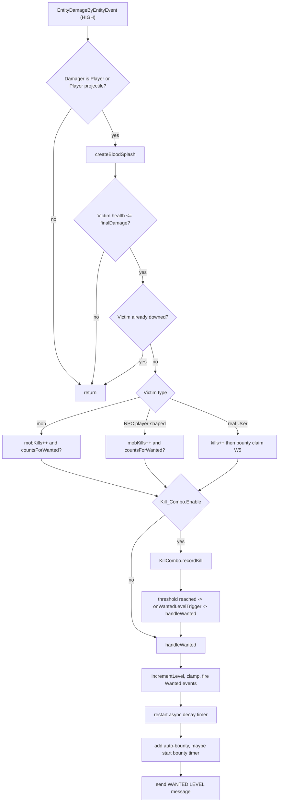

**State & persistence effects:** `User.kills` / `mobKills`, `Wanted.level`, `Wanted.wanted`, `Bounty.amount`, a new
`RepeatingTimer` on both `Wanted` and `Bounty`. `level` and `amount` reach the DB on the next autosave or on quit.

**Edge cases & guards observed:** `getFinalDamage()` is read before the damage is applied, so a victim saved by a
lower-priority cancel still hands out kill credit. `wanted.incrementLevel()` at max level is a no-op level-wise but
still adds auto-bounty (`wantedLevel` is already at max) and still restarts the decay timer. The `WantedEvent`
instance handed to the executor is created **once per kill** and reused for every subsequent tick of that timer.

### W2: Wanted decay timer

**Trigger:** `Timer.start(true)` in `EntityDamageListener.handleWanted:229` or `UserDataLoader:164`.

**Steps:**
1. `WantedExecutor.createTimer` (`.../gang/wanted/WantedExecutor.java:34`) computes
   `interval = getTimerTime() * pow(multiplierAmount, level)` seconds (default `120 * 1.1^level`), then
   `wanted.createTimer(interval, this::execute)` builds `new RepeatingTimer(plugin, interval * 20L, task)`
   (`Wanted.java:51-57`). `RepeatingTimer` uses `delay = 0` with a `justStarted` guard, so the first real tick lands
   one full period in.
2. Each tick, `WantedExecutor.execute` (l.49) runs **off the main thread**:
   - `isWanted(timer, wanted)` — if `!wanted.isWanted()` it calls `timer.stop()` and returns.
   - `moneyTaken = takeMoneyAmount * pow(takeMoneyMultiplier, level)` (default `50 * 5^level`).
   - `Bukkit.getPluginManager().callEvent(event)` on the reused `WantedEvent`; cancelled → return.
   - `context.withdraw(moneyTaken)` → `User.withdraw` → Vault-backed `EconomyHandler`, still async.
   - `newLevel` is computed **before** `decrementLevel()` (l.73) precisely because `Wanted.setLevel` bounces to the
     main thread when off-thread (comment at l.70-72).
   - `WANTED_DECREASED` with `%level%`/`%stars%` and a `-$x` money-loss line are sent through `context.sendMessage`.
   - `isWanted` is re-checked to stop the timer once the level reaches 0.
3. The timer is stopped by: reaching level 0 (next tick), `Wanted.reset()`, `Wanted.stopTimer()`,
   `Wanted.createTimer()` (implicit restart), or `RemoveAccountListener` on quit (l.57-58 async, l.72-73 sync).

**Diagram:**
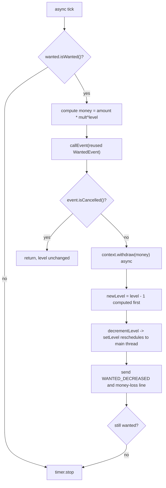

**State & persistence effects:** balance decreases, `Wanted.level` decreases (one tick late relative to the message
it prints, because the message uses the precomputed `newLevel`).

**Edge cases & guards observed:** the decay timer is only ever started from two places — the kill path and login.
`/glw wanted add`, the wanted sign, and any admin change to the level start **no** timer. `Wanted.setLevel(0)` from
detainment stops the timer only lazily, on the next tick.

### W3: Wanted level clear on arrest

**Trigger:** `JailIntakeService.admit(...)` or `BribeService` success. (corrected during verification)

**Steps:**
1. `JailIntakeService:50` snapshots `wantedClearContract.getWantedLevel(uuid)` to price the sentence
   (`Detainment.Sentence.Base_Seconds + Per_Wanted_Level_Seconds * level`) and persist `wantedAtArrest`.
2. `JailIntakeService:54` (and `BribeService:70`) calls `clearWanted(uuid)`.
3. `GanglandWantedClearContract.clearWanted` (`gangland-impl/.../data/detainment/GanglandWantedClearContract.java:29`)
   resolves the online `Player` via `Bukkit.getPlayer(uuid)` and calls `wanted.setLevel(0)`.
4. `Wanted.setLevel` fires `WantedLevelChangeEvent` then `WantedEndEvent` → `CopListener.onWantedEnd` →
   `CopManager.onWantedEnd` despawns the pursuit.

**Diagram:**
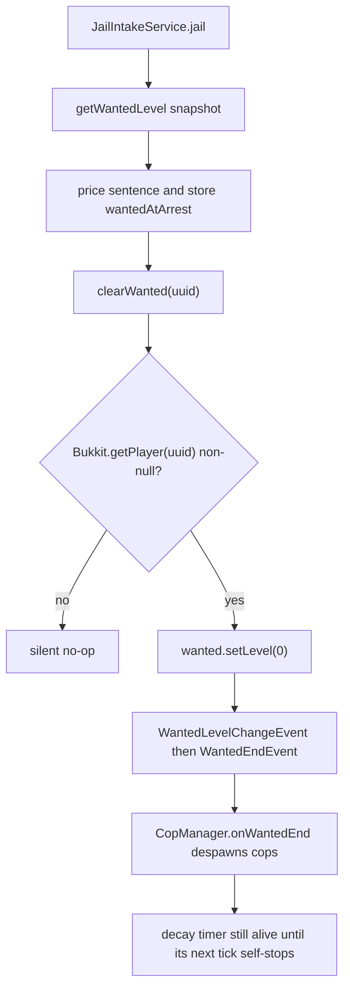

**State & persistence effects:** `Wanted.level = 0`, `wanted = false`. The bounty is untouched by arrest.

**Edge cases & guards observed:** `setLevel(0)` rather than `reset()`, so `stopTimer()` is never called explicitly.
If the player is offline at the moment of clearing, `lookup` returns null and the clear is silently skipped.

### W4: Place a bounty

**Trigger:** `/glw bounty set <player> <amount>` (permission `gangland.command.bounty.set`, OP by default).

**Steps:**
1. `BountySetCommand` chained `OptionalArgument` (`.../command/sub/bounty/BountySetCommand.java:66`) resolves the
   target with `Bukkit.getPlayer(args[2])` and parses `args[3]` with `Currency.parse`.
2. `Currency.parse` (`keystone-hooks/.../economy/Currency.java:48`) strips `_` and constructs a `BigDecimal`. There
   is no sign, minimum, or maximum validation anywhere in this command.
3. l.95: if the target's ledger is empty, the **target** receives `BOUNTY_SET` — before any payment is verified.
4. l.98-123 (player senders only): balance must be non-zero and `>= value`, then
   `userSender.getEconomy().withdrawAmount(value)` and a `WITHDRAW_MONEY_PLAYER` confirmation. A console sender
   skips this block entirely and pays nothing.
5. l.125: `UserBountyEvent(false, user, value)` is dispatched synchronously.
6. l.128 (if not cancelled): `userBounty.addBounty(sender, value, user.getLevel().getLevelValue())` →
   `Bounty.calculateLevelScaledBounty(value, targetLevel)` = `value * (1 + targetLevel * levelMultiplier / 10)`
   (`Bounty.java:81-84`), then `addBounty(sender, scaled)` which stores the **scaled** figure in
   `userSetBounty` and adds it to `amount`.

**Diagram:**
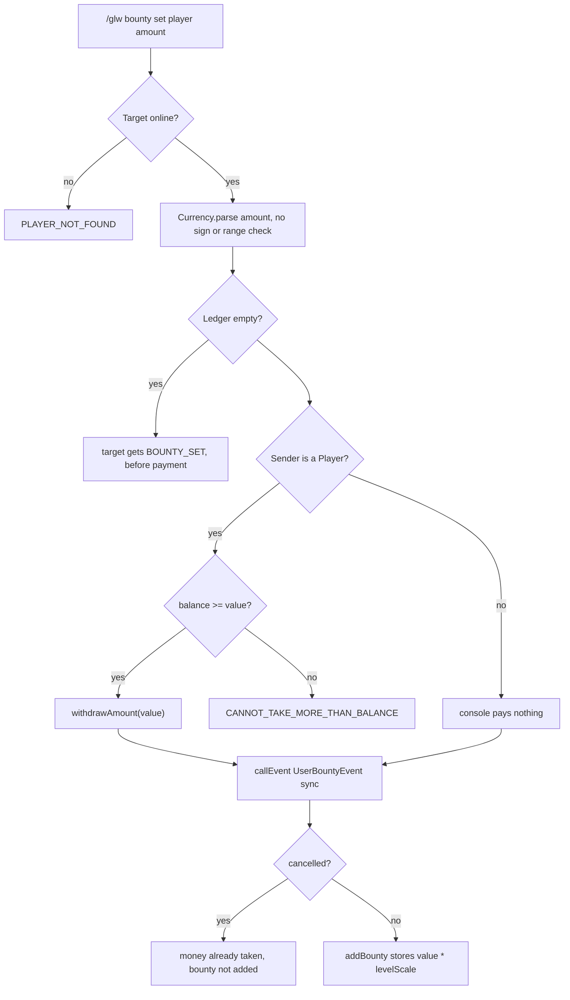

**State & persistence effects:** sender balance down by `value`; `Bounty.amount` up by `value * scale`;
`userSetBounty[senderPlayerObject] += value * scale`. Only `amount` survives a restart.

**Edge cases & guards observed:** no self-bounty check; the map key is the live `CommandSender` object, so console
and each `Player` instance are distinct keys; the event's `amountApplied` is the unscaled `value` while the applied
figure is the scaled one, so `BOUNTY_INCREMENT` understates the change.

### W5: Claim a bounty on kill

**Trigger:** the lethal `EntityDamageByEntityEvent` from W1, when the victim resolves to a real `User`.

**Steps:**
1. `EntityDamageListener.handlePlayerKills:129-146` reads `deadUser.getBounty()`.
2. `bounty.hasBounty()` is `amount.signum() != 0` (`Bounty.java:46`) — true for negatives as well as positives.
3. `damagerUser.getEconomy().depositAmount(amount)` (l.134) then `bounty.resetBounty()` (l.135), which zeroes
   `amount`, stops the growth timer and clears `userSetBounty` — the contributors are never refunded or notified.
4. `BANK_MONEY_DEPOSIT_PLAYER` with `%amount%` goes to the killer (l.137-140).
5. If combos are on, `killCombo.resetCombo(deadPlayer.getUniqueId())` (l.144).
6. If the victim had no bounty, `handleBounty(damagerUser)` runs instead (see W6).

**Diagram:**
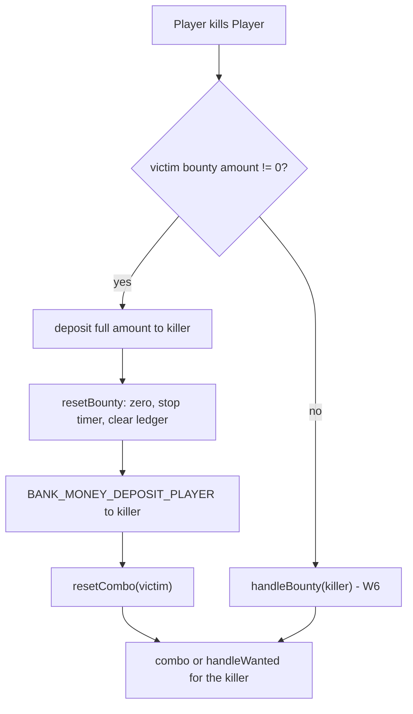

**State & persistence effects:** killer balance up, victim bounty zeroed, victim combo cleared, contributor ledger
discarded.

**Edge cases & guards observed:** there is no cooldown, no same-IP/alt check, and no check that killer != victim's
bounty placer. The claim runs on the downing blow (before `PlayerDeathEvent` and before `DownedPlayerRegistry`
membership is set at `HIGHEST`), so a downed-but-not-dead player still pays out their bounty.

### W6: Automatic bounty growth (per-kill and timer)

**Trigger:** a player kill where the victim had no bounty (`handleBounty`), or a `BountyExecutor` tick.

**Steps (per-kill, `EntityDamageListener.handleBounty:259`):**
1. `scaledBounty = calculateLevelScaledBounty(Bounty.Kill.Each, killerLevel)`.
2. If `Settings.isBountyTimerEnabled()` and the killer's bounty is below `Bounty.Repeating_Timer.Maximum`, a new
   `BountyExecutor` timer is started asynchronously (l.269-272) and the method **returns without adding anything**.
   With the default `Enable: true`, the per-kill `Each` value is therefore never applied on this branch.
3. Otherwise `amount = Each + currentBounty`; if that exceeds `Bounty.Kill.Maximum` the method returns silently
   (no clamp, l.279).
4. `bountyEvent.setAmountApplied(scaledBounty)`; the event is dispatched inside
   `Bukkit.getScheduler().runTaskAsynchronously` (l.283-285); `bountyEvent.isCancelled()` is then read on the
   **current** thread at l.287, before the scheduled task has had a chance to run.
5. `damagerUser.getBounty().setAmount(amount)` — note `amount` is the **unscaled** sum, while the event advertised
   `scaledBounty`.

**Steps (timer, `BountyExecutor.execute:41`):**
1. Stop if `!bounty.hasBounty()`.
2. `currentBounty` = the existing amount, or `EachKillValue / TimerMultiple` when the amount is zero.
3. Stop if `oldAmount >= TimerMax`.
4. `baseIncrease = currentBounty * TimerMultiple`; `scaledIncrease = calculateLevelScaledBounty(baseIncrease, userLevel)`.
5. `event.setAmountApplied(scaledIncrease - currentBounty)`, dispatch the **reused** `BountyEvent`, and on
   non-cancel `bounty.setAmount(scaledIncrease)` — a direct write that never touches `userSetBounty`.

**Diagram:**
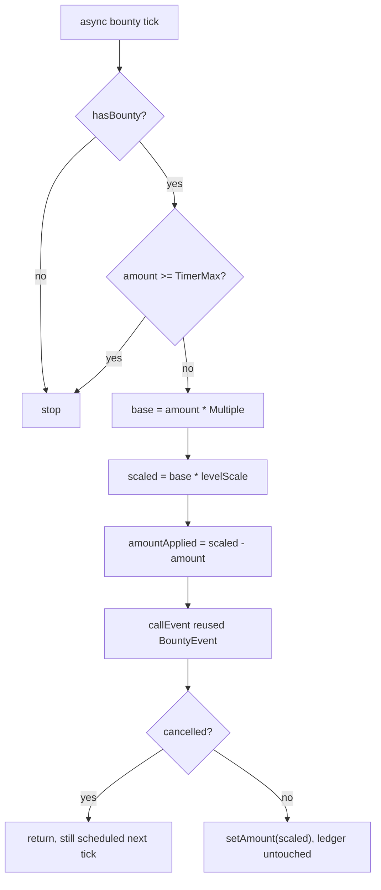

**State & persistence effects:** `Bounty.amount` grows geometrically (`x2` per 300 s by default) up to `20_000`;
`userSetBounty` diverges permanently from `amount`.

**Edge cases & guards observed:** the cap check uses `oldAmount` from the previous tick, so the final write can
exceed `TimerMax` before the timer stops on the following tick. The reused event means one cancel by any listener
permanently freezes growth for that timer instance.

### W7: Lift/refund a placed bounty

**Trigger:** `/glw bounty clear|remove|delete|del <player>`.

**Steps:**
1. `BountyClearCommand:46` resolves the target; `hasBounty()` must be true (`NO_BOUNTY` otherwise).
2. `userBounty.containsBounty(sender)` must be true (`NO_USER_SET_BOUNTY` otherwise) — a plain `Map.containsKey`
   on the live `CommandSender` object.
3. `amount = userBounty.getSetAmount(sender)` — the **scaled** figure that was stored, not what the sender paid.
4. `userBounty.removeBounty(sender)` subtracts it from `amount`, flooring at zero (`Bounty.java:92-98`).
5. `BOUNTY_PLAYER_LIFT` to the sender; if the sender is a `Player`,
   `userSender.getEconomy().depositAmount(amount)` and `DEPOSIT_MONEY_PLAYER`.
6. The target gets `BOUNTY_CLEAR` if the total is now zero, else `BOUNTY_LIFTED`.

**Diagram:**
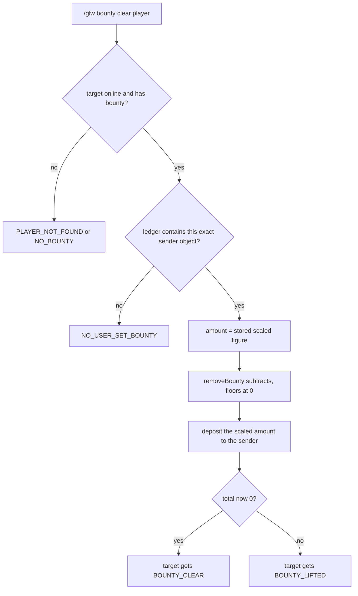

**State & persistence effects:** sender balance up by the scaled figure; target `amount` down by the same.

**Edge cases & guards observed:** the ledger is never persisted, so after any restart no placer can lift their
bounty and the money is permanently locked in the target's total.

### W8: Pay off / view bounties via signs

**Trigger:** right-clicking a `[BOUNTY]` sign parsed as `VIEW` or `CLEAR`.

**Steps:**
1. `BountyAspect.canExecute` (`gangland-impl/.../sign/aspect/BountyAspect.java:74`) requires a `User`; for `CLEAR`
   it additionally requires `hasBounty()`.
2. `VIEW` (l.48): iterates the online then the offline `UserManager` caches, builds a player-head `ItemStack` per
   user with a bounty, and opens a paginated `MultiInventory` titled `&c&lBounties`.
3. `CLEAR` (l.52): `withdrawAmount(bounty.getAmount())` — the player pays their own bounty in full — then
   `bounty.resetBounty()`. An `EconomyException` (insufficient funds) becomes an `AspectResult.failure`.

**Diagram:**
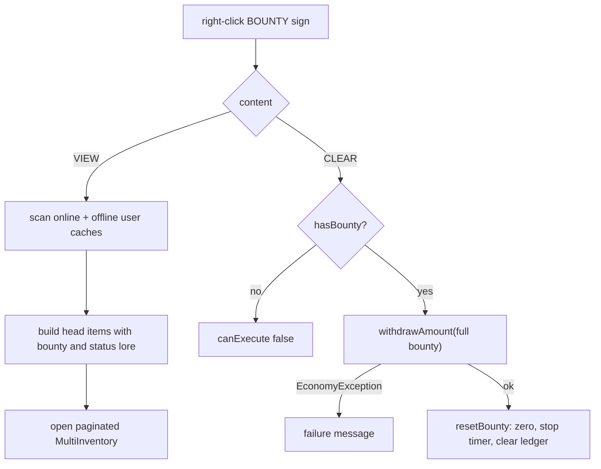

**State & persistence effects:** the payer loses the bounty amount, the bounty is zeroed, contributors get nothing
and no notification. The money is destroyed rather than returned.

**Edge cases & guards observed:** `BountySign.BountyType.valueOf(...)` is called without a try/catch in both
`execute` and `canExecute`; a malformed sign content throws `IllegalArgumentException`.

### W9: Wanted signs

**Trigger:** right-clicking a `[WANTED]` sign.

**Steps:**
1. `WantedSign.createDefinition` (`gangland-impl/.../sign/type/WantedSign.java:36-40`) composes
   `MoneyAspect(WITHDRAW)` **then** `WantedAspect`, so the price on line 4 is charged before the level changes.
2. `WantedAspect.execute` (`.../sign/aspect/WantedAspect.java:18`) switches on `INCREASE` /`REMOVE` /`CLEAR`:
   - `INCREASE`: `wanted.setLevel(currentLevel + sign.getAmount())`.
   - `REMOVE`: loops `decrementLevel()` `amount` times (each iteration fires its own `WantedLevelChangeEvent`).
   - `CLEAR`: `wanted.reset()` — the only caller in the codebase that also stops the timer.
3. `canExecute` gates `REMOVE`/`CLEAR` on `level > 0`.

**State & persistence effects:** level change plus a sign-priced withdrawal.

**Edge cases & guards observed:** `INCREASE` does not start a decay timer, so a sign-granted wanted level never
decays on its own. `WantedType.valueOf` is unguarded, same as `BountyAspect`.

### W10: Kill combo — start, increment, threshold, reset

**Trigger:** any wanted-relevant kill while `Wanted.Kill_Combo.Enable` is true.

**Steps:**
1. `KillCombo.recordKill` (`cops-n-crooks/.../combo/KillCombo.java:41`) constructs a **new** `KillComboTracker`
   unconditionally at l.44 (including a new `CountdownTimer`), then `activeTrackers.computeIfAbsent(playerId, id -> killComboTracker)`
   — the freshly built tracker is thrown away when one already exists.
2. `tracker.addKill(killed, 1)` bumps `normalKillCount` and `pointKillCount` and appends a `KillRecord`
   (`entityType`, `points`, `System.currentTimeMillis()`) to an unbounded `killHistory` list.
3. `onComboIncrement` is invoked if set — **`EntityDamageListener` never sets it**, so this callback is dead.
4. `checkWantedLevelTrigger` → `shouldTriggerWantedLevel` (l.126): thresholds are grown with
   `NumberUtil.resizeLinear` when the configured list is shorter than `maxLevel`; the index is
   `min(wanted.getLevel(), thresholds.size() - 1)`; triggers when `pointKillCount >= thresholds.get(level)`.
5. On trigger, `onWantedLevelTrigger` → `EntityDamageListener.onKillComboWantedTrigger:187` → `handleWanted` (W1
   step 9 onward). The combo counter is **not** reset by the trigger.
6. `tracker.restartTimer()` (l.63) stops the existing `CountdownTimer`, builds a new one and calls
   `timer.start(true)` — **asynchronous**.
7. `CountdownTimer` decrements `timeLeft` once per 20-tick period; `KillComboTracker.initializeTimer:81` sets
   `timeLeft = 20 * Reset_After`. With `Reset_After: 10` that is 200 real seconds, not 10.
8. Expiry → `afterTimer` → `KillCombo.handleComboReset:143` → `activeTrackers.remove(...)` (on the async thread)
   and `onComboReset` → `EntityDamageListener.onKillComboReset:197` → `"&e&lKill combo reset!"`.
9. Explicit resets: `KillCombo.resetCombo` from `EntityDamageListener:144` (victim of a bounty kill),
   `ReleasePipeline:77` (released from jail), and `handlePlayerDeath` from `WantedLevelListener` on both
   `PlayerDeathEvent` and `PlayerDownedEvent`.
10. `handlePlayerDeath` also fires `onPlayerDeath` → `EntityDamageListener.onPlayerDeathResetWanted:207`, which
    resolves the dead player via `Bukkit.getPlayer(uuid)` and calls `deadUser.getWanted().reset()` — the wanted
    level is wiped on every death, however caused.

**Diagram:**
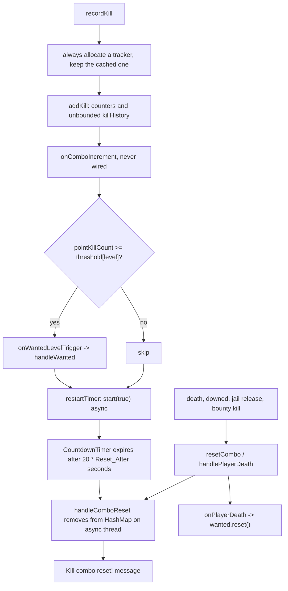

**State & persistence effects:** entirely in-memory; nothing is written to the database and nothing is cleared on
quit, reload or shutdown (`KillCombo.clearAll()` has no callers).

**Edge cases & guards observed:** the point count is never reduced after a trigger, so once past the threshold for
the current level every further kill re-triggers `handleWanted` until the level (and thus the threshold index)
catches up. `KillComboTracker` holds a hard `Player` reference for the life of the entry.

### W11: Entering the downed state

**Trigger:** any `EntityDamageEvent` on a real player that would drop health to `<= 0`, with
`Level.Death.Respawn.Enable: true`.

**Steps:**
1. `CustomPlayerDeathListener.onEntityDamage` (`gangland-impl/.../listener/player/CustomPlayerDeathListener.java:88`,
   `HIGHEST`, `ignoreCancelled = true`) returns early when respawn is disabled, the entity is not a `Player`, or
   `CitizensAPI.getNPCRegistry().isNPC(player)` (NPCs must die normally).
2. Already-downed players have the event cancelled outright (l.99-102) — no further damage lands.
3. `resultHealth = player.getHealth() - event.getFinalDamage()`; `<= 0` → cancel the damage, `setHealth(0.5)`,
   `DownedPlayerRegistry.add(uuid)` immediately, and schedule `enterDownedState` one tick later (l.104-112).
4. `enterDownedState` (l.163): bails if offline; `dropInventoryIfAllowed` walks all 41 `getContents()` slots,
   `world.dropItemNaturally` each and `inv.clear()` — unless the world's `KEEP_INVENTORY` gamerule is true;
   `jetpackService.deactivate(player)`; re-adds to the registry; saves the current `GameMode` into
   `savedGameModes`.
5. `PlayerDownedEvent` is fired (l.176) → `PlayerDeathListener.onPlayerDowned` (death counter + money penalty +
   broadcast), `WantedLevelListener.onPlayerDowned` (combo + wanted reset), `CopListener.onPlayerDowned`
   (drop cop attacker), `CivilianDamageListener`, `LoadUniqueItem`.
6. GameMode is switched to `Level.Death.Respawn.GameMode.Change_To` (default `spectator`, falling back to
   `SURVIVAL` on a parse failure) and flight enabled if configured.
7. `delay <= 0` → immediate `performRespawn`; otherwise `showTitle`, `sendRespawnButton` (clickable
   `/glw respawn`) and `startCountdown`.
8. While downed, six `LOWEST`/`ignoreCancelled` handlers cancel interact, block break, block place, item drop,
   item consume and item pickup (l.120-161).

**Diagram:**
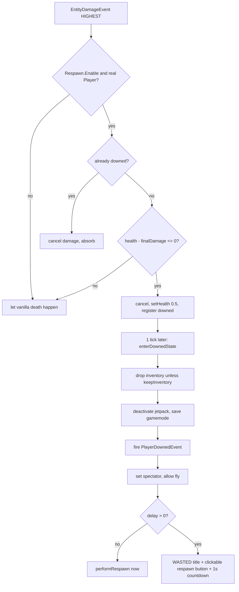

**State & persistence effects:** `DownedPlayerRegistry` membership (static, process-wide), `savedGameModes` and
`respawnTasks` entries, dropped item entities, death counter and death money penalty, wanted level reset to 0 via
the combo path, cops disengaged.

**Edge cases & guards observed:** no `PlayerDeathEvent` fires on this path, so anything keyed on `PlayerDeathEvent`
only (e.g. `CopListener.onPlayerDeath`) is mirrored by an explicit `PlayerDownedEvent` handler; anything not
mirrored silently does not run. There is no bleed-out: a downed player always respawns and never actually dies.

### W12: Respawn / undowning

**Trigger:** countdown expiry, `delay <= 0`, or `/glw respawn`.

**Steps:**
1. `RespawnCommand.onExecute` checks `DownedPlayerRegistry.isDowned` and calls the **static**
   `CustomPlayerDeathListener.triggerManualRespawn`, which forwards to a static `instance` field set in the
   listener's constructor (l.59, l.76-82).
2. `performRespawn` (l.229): bails if offline; cancels and removes the countdown task;
   `DownedPlayerRegistry.remove(uuid)`.
3. Health is `min(Respawn.Health, Attribute.MAX_HEALTH)`; food is set from `Respawn.Hunger`.
4. GameMode is restored from `savedGameModes` (defaulting to `SURVIVAL`), flight forced off.
5. If `Respawn.Teleport.Enable`, the configured waypoint's `WaypointTeleport` runs; an `IllegalTeleportException`
   (waypoint cooldown) falls back to a direct `player.teleport(waypoint.getLocation())` with a null-check on the
   location.
6. A blank title clears the WASTED screen, then `PlayerUndownedEvent` is fired.
7. `startCountdown`'s runnable calls `cleanup(uuid)` and cancels itself if the player goes offline mid-countdown;
   `onPlayerQuit` (`MONITOR`) calls `cleanup` too — removing the registry entry, cancelling the task and dropping
   the saved gamemode.

**Diagram:**
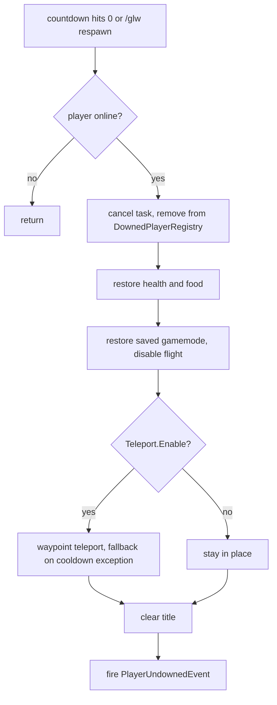

**State & persistence effects:** registry and both maps cleared for that UUID; health/food/gamemode/flight/location
mutated.

**Edge cases & guards observed:** quitting while downed calls `cleanup`, which removes the registry entry and the
saved gamemode **without restoring the gamemode, health or flight** — the player logs back in as a spectator with
0.5 health. A plugin reload or server stop while someone is downed leaves the same residue with no recovery hook.

### W13: PvP death handling (real `PlayerDeathEvent`)

**Trigger:** an actual player death (respawn disabled, or damage the interceptor did not catch such as `/kill`,
void, or a cancelled-then-reapplied path).

**Steps:**
1. `PlayerDeathListener.onPlayerDeath` (`LOWEST`, l.60): Citizens NPCs get `setDeathMessage(null)` and return.
2. A 500 ms dedup window keyed on `recentDeaths` (l.40, l.70-79) suppresses duplicate deaths (documented cause:
   vanilla `Player.attack` re-checking HP after `MeleeAction` already applied lethal damage). On a hit it also
   removes the UUID from `downedBroadcasted` and blanks the death message.
3. `user.setDeaths(deaths + 1)`.
4. `handleCommandExecution` (l.123): if the balance is `<= Level.Death.Money.Threshold` it returns `true` and no
   money is taken at all; if `Death.Money.Command.Enable` it dispatches each configured console command with
   placeholders replaced and returns `true`.
5. `handleMoney` (l.138): evaluates `Level.Death.Money.Formula` through Keystone's `ScientificCalculator` with
   `balance/level/experience/bounty/wanted` variables, applies the bank tier's `deathLossDiscount`, then withdraws
   (or deposits, when `Lose_Money: false`) and prints `"&3Death penalty: ..."`.
6. `changeDeathMessage` (l.178): if the last damage cause came from a Citizens NPC the message is suppressed;
   otherwise `buildDeathMessage` picks the throwable weapon recorded in
   `ThrowableAction.pendingKillerWeapon` (removed by UUID) or the killer's main-hand weapon, and formats a
   weapon-specific or global template with `%killer%`, `%victim%`, `%item%`.
7. `buildDeathMessage` returns null when `player.getKiller()` is null, leaving the vanilla message intact for
   environmental deaths.
8. Bounty, wanted and combo consequences are **not** handled here — they were already applied on the lethal damage
   event (W1/W5) or by `WantedLevelListener`.

**Diagram:**
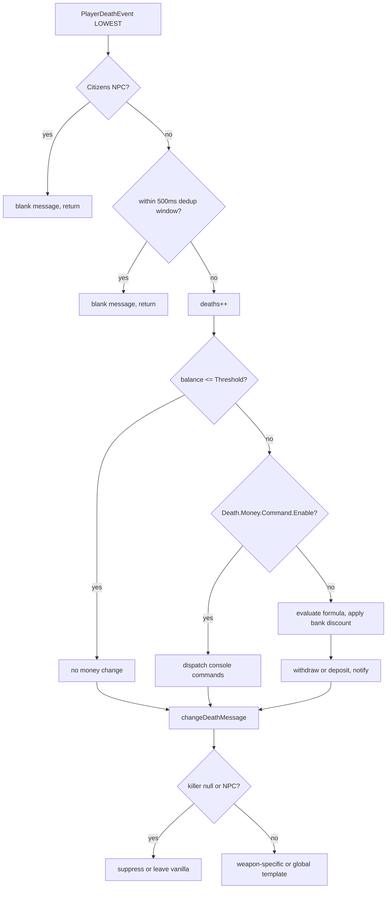

**State & persistence effects:** `User.deaths`, balance, the `recentDeaths` and `downedBroadcasted` maps,
`ThrowableAction.pendingKillerWeapon` entry consumed. Drops are vanilla on this path (the downed path does its own
manual drop in W11).

**Edge cases & guards observed:** the downed path calls the same `handleMoney`, so the penalty applies once per
downing and once more if the player later dies for real outside the 500 ms window.

### W14: Login / reload restoration of wanted and bounty

**Trigger:** `PlayerJoinEvent` (`CreateAccountListener`, `LOWEST`) or plugin startup (`PlayerBootstrapService`).

**Steps:**
1. `CreateAccountListener.onPlayerJoin:57` creates the `User` (which builds fresh `Wanted`/`Bounty` from
   `GangSettings` and sets `wanted.owner = player`), adds it to the online cache, then runs
   `Bukkit.getScheduler().runTaskAsynchronously(...)` → `userDataLoader.loadUserData(...)` (l.92-97).
2. `UserDataLoader.loadUserData` (`gangland-impl/.../data/user/UserDataLoader.java:71`) uses
   `DatabaseHelper.runQueries`, which executes on the calling thread — so on the join path everything below runs
   **async**.
3. l.99: `user.getWanted().setLevel(wanted)`. Because `owner != null` and the thread is not the primary thread,
   `Wanted.setLevel` (`Wanted.java:71-74`) reschedules itself onto the main thread and returns; the field is still
   `0` for the remainder of this method.
4. l.144-145: `userBounty.setAmount(Currency.of(bounty))` — a plain field write, so this one takes effect
   immediately.
5. l.147: `if (!user.getUser().isOnline()) return;`
6. l.149-157: the bounty growth timer is started if the amount is non-zero, timers are enabled and the amount is
   below `TimerMax`.
7. l.159-164: the wanted decay timer is started only `if (userWanted.isWanted())` — which reads the not-yet-applied
   level from step 3.
8. `PlayerBootstrapService.loadOnlinePlayers` (l.111) calls the same loader **synchronously** on the main thread, so
   the reload path does start the decay timer correctly.
9. On quit, `RemoveAccountListener.onPlayerQuit` (`LOWEST`) schedules an async `stopTimer()` on both objects, and
   `onPlayerLeave` (`HIGHEST`) stops them again synchronously, saves the `User`, and copies level/bounty into a
   fresh offline `User`.

**Diagram:**
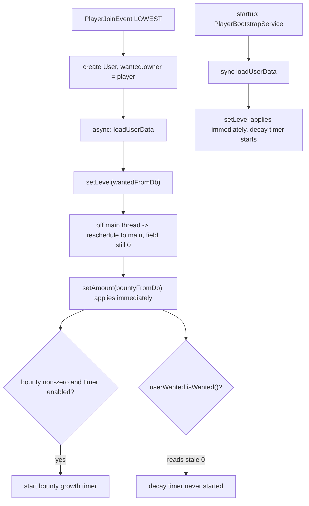

**State & persistence effects:** in-memory level and bounty restored; the decay timer's presence differs between
the join path and the reload path.

**Edge cases & guards observed:** `userSetBounty` is never restored, so post-restart nobody can lift their share.
`offlineUser.getWanted().setLevel(...)` at quit (`RemoveAccountListener:102`) can fire `WantedStartEvent` on an
offline-user copy if `getPlayer()` still resolves.

### W15: Cop targeting reads of wanted level

**Trigger:** `WantedStartEvent` / `WantedLevelChangeEvent` / `WantedEndEvent`, and the cop AI tick.

**Steps (summary — the cops agent owns the state machine):**
1. `CopListener` (`cops-n-crooks/.../listener/detainment/CopListener.java:37-60`, all `MONITOR`) forwards the three
   wanted events to `CopManager.onWantedStart` / `onWantedLevelChange` / `onWantedEnd`.
2. `WantedTargetingManager` (`.../npc/police/targeting/WantedTargetingManager.java`) keeps a
   `ConcurrentHashMap<UUID, Wanted>` of registered players. `isWanted`, `getWantedLevel` and `findBestTarget` all
   read the live `Wanted` object, so any level change is visible without a re-registration.
3. `findBestTarget` (l.44) picks the nearest registered wanted player in the same world, skipping offline and
   `isDead()` candidates — but **not** `DownedPlayerRegistry` members, unlike `CopManager` l.496/515/591.
4. `CopListener` also drops the cop-attacker entry on `PlayerQuitEvent`, `PlayerDeathEvent` and
   `PlayerDownedEvent`.
5. `Cops.Count.Base` / `Per_Level` / `Max` in `settings.yml` scale the cop count with the wanted level.

**Diagram:**
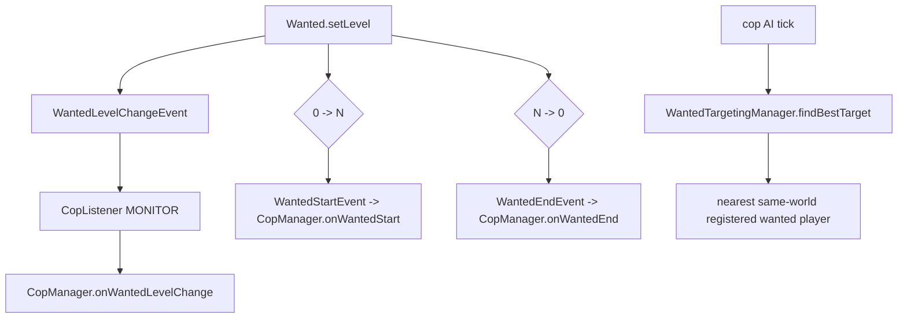

**State & persistence effects:** none in this area beyond the targeting registry.

**Edge cases & guards observed:** because `Wanted.setLevel` returns early when called off-thread, all three events
are guaranteed to fire on the main thread — the async wanted decay timer relies on that reschedule.

## Cross-feature Dependencies

- **Depends on:**
  - Keystone `keystone-common` timers (`Timer`, `RepeatingTimer`, `CountdownTimer`) for every decay/growth/combo
    countdown; `Timer.start(boolean)` decides sync vs async.
  - Keystone `keystone-hooks` economy (`Currency`, `EconomyHandler`, `Bank`) for every money movement — bounty
    stakes, bounty payouts, wanted fees, death penalties.
  - Keystone `keystone-bean` (`@ListenerHandler`, `@CommandHandler`, `@Bean`) — beans wired in
    `config/CopsAndGadgetsConfig.java` (l.126 `KillCombo`, l.200 `WantedClearContract`) and
    `config/FileConfig.java` (l.113/118 the two settings impls).
  - Keystone `keystone-command` argument tree for all `/glw wanted` and `/glw bounty` nodes.
  - `gangland-core` `Executor` base and the static `DownedPlayerRegistry`.
  - `gangland-domain` `User`, `UserManager`, `Level`, `GangSettings`.
  - `cops-n-crooks` `EntityMarkManager.countsForWanted`, `KillCombo`, `BankTierRegistry` (death insurance),
    `CopManager`.
  - `gangland-weapon` `WeaponManager` + `ThrowableAction.pendingKillerWeapon` for death messages.
  - Citizens (`CitizensAPI.getNPCRegistry().isNPC`) to keep NPCs off the downed/death paths.
  - `gangland-gadget` `JetpackService` (deactivated on downing) and `WaypointManager` (respawn teleport).
- **Depended on by:**
  - `cops-n-crooks` cop spawning/pursuit (`CopManager`, `WantedTargetingManager`) and detainment pricing
    (`JailIntakeService`, `BailService`, `BribeService`, `DetainmentCostsContract` — all `Per_Wanted_Level`).
  - `gangland-weapon` (`WeaponInteract`, `InstantReload`, `NumberedReload`) gate on `DownedPlayerRegistry`.
  - `gangland-gadget` `CarDismountListener`; `gangland-item` `MoneyProximityPickupTask`.
  - `GanglandPlaceholder` (`user_wanted`, `user_wanted-level`, `user_wanted-max-level`, `user_is-wanted`,
    `user_bounty`, `user_has-bounty`, `gang_bounty`, `gang_has-bounty`) → `scoreboard.yml`, `gang_info.yml`.
  - `PlayerDeathListener.amountDeduction` exposes `bounty` and `wanted` as death-formula variables.

## Observations & Potential Issues

| # | Location | Observation | Risk | Confidence |
| --- | --- | --- | --- | --- |
| 1 | `command/sub/bounty/BountySetCommand.java:112,128` + `BountyClearCommand.java:73,89` | `set` withdraws the raw `value` but stores `calculateLevelScaledBounty(value, targetLevel)` in the ledger; `clear` refunds the stored (scaled) figure. With the default `levelMultiplier = 2` and a level-5 target the refund is 2x the payment. | Direct money duplication: set then immediately clear for free profit | High |
| 2 | `BountySetCommand.java:79-86,107,112` | `Currency.parse` accepts negatives and there is no min/max. `senderBalance.compareTo(-100) < 0` is false, and `EconomyHandler.withdrawAmount` (`keystone-hooks/.../EconomyHandler.java:72-77`) does `setAmount(current.subtract(-100))`. | Negative amount mints money for the sender and drives the target's bounty negative | High |
| 3 | `Bounty.java:46` + `EntityDamageListener.java:131-134` | `hasBounty()` is `signum() != 0`, so a negative total is "has bounty" and the killer is paid a negative amount. | Killer is charged for a kill; every `hasBounty` consumer misbehaves | High |
| 4 | `data/user/UserDataLoader.java:99` vs `:160` | `setLevel` reschedules to the main thread when called off-thread (`Wanted.java:71-74`), so `userWanted.isWanted()` at l.160 still reads 0 on the async join path. | The wanted decay timer never starts on player join; levels persist forever until a new kill | High |
| 5 | `EntityDamageListener.java:283-289` | The `UserBountyEvent` is dispatched inside `runTaskAsynchronously` but `isCancelled()` is read synchronously on the very next line. | The cancel hook is never honoured; a race on the event's mutable state | High |
| 6 | `EntityDamageListener.java:229,248,272`; `data/user/UserDataLoader.java:155,164` | `timer.start(true)` runs `WantedExecutor.execute`/`BountyExecutor.execute` off the main thread, and those call `Bukkit.getPluginManager().callEvent`, `EconomyHandler.withdraw` (Vault) and `context.sendMessage`. Repo convention (`feedback_repeating_timer_async`) says async is only safe for flag flips. | Vault/economy calls off-thread; async event dispatch to sync-only listeners | High |
| 7 | `combo/KillComboTracker.java:81-82` + `KillCombo.java:144` | `initializeTimer` sets `timeLeft = 20 * Reset_After` but `CountdownTimer` decrements `timeLeft` once per 20-tick period, so the window is 20x the configured seconds (default 200 s instead of 10 s). The expiry callback then mutates the plain `HashMap activeTrackers` from an async thread. | Combos last far longer than configured; `HashMap` corruption under concurrent access | High |
| 8 | `combo/KillCombo.java:21,31` and `KillComboTracker.java:21` | `activeTrackers` is a plain `HashMap` mutated from `recordKill` (main) and `handleComboReset` (async), and each tracker holds a hard `Player` reference. Nothing clears it on quit; `clearAll()` has zero callers. | Memory leak, stale `Player` objects across relog, unsynchronised map | High |
| 9 | `listener/player/CustomPlayerDeathListener.java:271-276` | `cleanup(uuid)` on quit removes the registry entry, the task and the saved gamemode but never restores gamemode, health, flight or teleports. | Quitting while downed leaves the player permanently in spectator with 0.5 health on rejoin | High |
| 10 | `listener/player/CustomPlayerDeathListener.java` (whole class) | No `BeanLifecycle`/shutdown hook: on `/reload` or server stop, `DownedPlayerRegistry`, `respawnTasks` and `savedGameModes` are dropped with players still downed. | Stuck spectators after a reload; the static registry outlives the plugin instance | High |
| 11 | `gang/wanted/WantedExecutor.java:20,62` and `gang/bounty/BountyExecutor.java:20,67` | A single `WantedEvent`/`BountyEvent` instance is constructed at timer creation and re-dispatched on every tick. `Cancellable` state is never reset. | One cancel by any listener permanently freezes decay/growth for that player | High |
| 12 | `gang/bounty/Bounty.java:22` | `userSetBounty` is keyed by the live `CommandSender`. CraftBukkit's `CraftEntity.equals/hashCode` are entity-id based, so a relogged player is a different key; the map also retains strong `Player` references forever and is never persisted. | Placers cannot lift after relog or restart; unbounded leak of `Player` objects | High |
| 13 | `EntityDamageListener.java:239` and `gang/bounty/BountyExecutor.java:71` | `bounty.setAmount(...)` is called directly, bypassing `userSetBounty`. `Bounty.removeBounty` then subtracts a ledger figure from a total that grew independently. | `amount` and the ledger diverge; clears can zero out auto-accrued bounty | High |
| 14 | `EntityDamageListener.java:267-275` | With `Bounty.Repeating_Timer.Enable: true` (the default), `handleBounty` starts a timer and returns without ever applying `Bounty.Kill.Each`. | The documented per-kill bounty value is dead config on the default settings | Medium |
| 15 | `EntityDamageListener.java:279` | Over `Bounty.Kill.Maximum` the method returns instead of clamping to the cap. | Bounty silently stops growing rather than sitting at the cap | Medium |
| 16 | `gang/bounty/BountyExecutor.java:57` | The cap check uses `oldAmount` before the multiply, so the write at l.71 can land above `TimerMax`. | Bounty overshoots the configured maximum by one multiplication | Medium |
| 17 | `listener/player/PlayerDeathListener.java:46-47` | `recentDeaths` and `downedBroadcasted` are never pruned. `downedBroadcasted` is only ever removed inside the dedup branch of `onPlayerDeath`, which the downed path (no real death) never reaches. | Unbounded map growth keyed by UUID; `downedBroadcasted` is effectively write-only | Medium |
| 18 | `EntityDamageListener.java:207-211` | `Bukkit.getPlayer(deadPlayerId)` may return null; `userManager.getUser(null)` happens to be safe only because `UserManager.users` is a `HashMap` (`UserManager.java:36`). | Fragile; becomes an NPE the moment the map becomes a `ConcurrentHashMap` | Medium |
| 19 | `gang/user/UserManager.java:36,118` | `users` is a plain `HashMap` read from async timer callbacks (`onKillComboReset`, executor contexts) while `PlayerJoinEvent`/`PlayerQuitEvent` mutate it on the main thread. | Unsynchronised map: possible infinite loop / lost reads | Medium |
| 20 | `sign/aspect/WantedAspect.java:32` and `command/sub/wanted/WantedAddCommand.java:47` | Neither starts a `WantedExecutor` timer. | Wanted levels granted by signs or by `/glw wanted add` never decay | Medium |
| 21 | `sign/aspect/BountyAspect.java:45,81` and `WantedAspect.java:26,70` | Unguarded `Enum.valueOf(sign.getContent().toUpperCase())`. | A malformed or manually-edited sign throws `IllegalArgumentException` on every interaction | Medium |
| 22 | `sign/aspect/BountyAspect.java:52-66` | Paying off a bounty destroys the money and clears the ledger; the placers are neither refunded nor told. | Economy sink plus silent loss of player stakes | Medium |
| 23 | `command/sub/wanted/WantedClearCommand.java:50-77` | `/glw wanted clear <player>` uses the same `gangland.command.wanted.clear` node as clearing your own level (`OptionalArgument` carries no permission). | No admin/player separation for clearing other players | Medium |
| 24 | `command/sub/bounty/BountySetCommand.java` (whole) | No self-bounty check and no cooldown; `/glw bounty set <self> <amount>` is accepted, and an alt can claim it. | Alt-account laundering / bounty farming | Medium |
| 25 | `command/sub/bounty/BountySetCommand.java:95` | `BOUNTY_SET` is sent to the target before the sender's payment is validated. | Target is notified of a bounty that may never be applied | Low |
| 26 | `command/sub/bounty/BountySetCommand.java:93,128` | The event's `amountApplied` is the unscaled `value` while the applied figure is scaled. | `BOUNTY_INCREMENT` understates the real increase | Low |
| 27 | `combo/KillCombo.java:44-45` | A `KillComboTracker` (and its `CountdownTimer`) is allocated on every kill even when one is cached, because `computeIfAbsent`'s value is precomputed. | Wasted allocation per kill; no functional break | Low |
| 28 | `combo/KillCombo.java:25` | `onComboIncrement` is declared but never assigned by `EntityDamageListener.setupKillComboCallbacks`. | Dead extension point | Low |
| 29 | `events/combo/KillComboEvent.java` | Extends Bukkit `Event` and declares a `HandlerList`, but is never passed to `callEvent`. | Misleading API: external plugins cannot listen for combos | Low |
| 30 | `combo/KillComboTracker.java:23,55` | `killHistory` grows without bound for the life of a tracker, and with #8 trackers are immortal. | Slow memory growth on high-kill servers | Low |
| 31 | `combo/KillCombo.java:115-124` | `pointKillCount` is never reduced after a trigger, so every subsequent kill re-triggers `handleWanted` until the threshold index catches up. | Wanted level can climb faster than the configured curve intends | Medium |
| 32 | `listener/player/EntityDamageListener.java:81-83` | `isEntityDead` is true when the entity **survives** (the negation is inside the initialiser). | Inverted name invites a future regression; behaviour is currently correct | Low |
| 33 | `listener/player/EntityDamageListener.java:78` | `createBloodParticle` runs before the lethality check, so every hit spawns particles from a `HIGH`-priority handler. | Particle spam / perf on rapid-fire weapons | Low |
| 34 | `listener/player/CustomPlayerDeathListener.java:239` | `Attribute.MAX_HEALTH` (the post-1.21 enum name) is used against a declared MC 1.16 floor. Same pattern appears in three `cops-n-crooks` NPC classes, so it looks like an accepted repo-wide choice. | `NoSuchFieldError` on old servers if the 1.16 floor is real | Low |
| 35 | `file/configuration/Settings.java:501` | `wantedEnabled` (`Wanted.Enable`) is parsed but has no reader anywhere in the repo. | Documented toggle that does nothing | Medium |
| 36 | `message/message_en.yml:627,630,632` | `Wanted_Level.Wanted`, `Not_Wanted` and `Paid` have no Java references. Conversely `"&e&lKill combo reset!"`, `"&c&lWANTED LEVEL: ..."`, `"&3Death penalty: "` and `"&cYou do not have a pending respawn."` are hardcoded. | Untranslatable strings; dead message keys | Medium |
| 37 | `inventory/phone_bounty.yml` + `config/GameplayConfig.java:170` | The GUI is registered as an expected file but no code opens it or handles its slots. | Shipped dead UI; the "bounty listing GUI" workflow does not exist | Medium |
| 38 | `listener/player/CustomPlayerDeathListener.java:59,76` and `command/sub/RespawnCommand.java:29` | `instance` is a mutable static set in the constructor; a reload that rebuilds the bean leaves the old instance's maps orphaned while `RespawnCommand` targets the new one. | Stale-singleton behaviour across reloads | Medium |
| 39 | `listener/player/RemoveAccountListener.java:53-59` vs `:72-73` | `stopTimer()` runs both asynchronously (LOWEST) and synchronously (HIGHEST) on the same quit. | Redundant; the async call can null out a timer created after the sync stop | Low |
| 40 | `npc/police/targeting/WantedTargetingManager.java:53` | `findBestTarget` filters `isDead()` but not `DownedPlayerRegistry`, unlike `CopManager` l.496/515/591. | Cops can target a downed (spectator) player | Medium |
| 41 | `listener/player/PlayerDeathListener.java:125` | `handleCommandExecution` returns `true` when the balance is at or below the threshold, which also suppresses `handleMoney`. The name says "commands ran". | Confusing control flow; a future edit is likely to invert the penalty | Low |
| 42 | `listener/player/CustomPlayerDeathListener.java:104` | `player.getHealth() - event.getFinalDamage()` is evaluated at `HIGHEST`; any handler that later reduces the damage or cancels the event does not un-down the player. | False downing when a lower-priority plugin absorbs the hit | Medium |

## Test Surface

- **Pure-logic candidates (unit-testable with plain JUnit/Mockito):**
  - `Wanted.buildStars(level, maxLevel)` — negative `maxLevel`, `level > maxLevel`, `level < 0`.
  - `Wanted.setLevel` clamping and the `wanted` flag transition, with `owner == null` so no Bukkit call is reached.
  - `Bounty.calculateLevelScaledBounty`, `getAutoBountyIncrease`, `addBounty`/`removeBounty`/`resetBounty`/`size`
    — especially the ledger-vs-total divergence after a direct `setAmount` (issue #13) and the round-trip
    set→clear profit (issue #1).
  - `Bounty.hasBounty()` with a negative amount (issue #3).
  - `KillCombo.shouldTriggerWantedLevel` — empty list, list shorter than `maxLevel` (`NumberUtil.resizeLinear`
    path), level at max, `pointKillCount` far above threshold.
  - `KillComboTracker.addKill` counters and `KillRecord` contents.
  - `Currency.parse` on negative and underscore-separated input, feeding `EconomyHandler.withdrawAmount`
    (issue #2) — Keystone-side but reachable with plain JUnit.
  - `PlayerDeathListener.amountDeduction` formula evaluation with a stubbed `User` (`ScientificCalculator` is pure).
  - `GanglandWantedSettings.formatMoneyLoss` string shape.
- **Needs Bukkit/Keystone mocks (MockBukkit or Mockito over `Bukkit`/`Player`/`PluginManager`):**
  - `WantedExecutor.execute` — cancel path, zero take-amount, level reaching 0 stopping the timer, and the reused
    event staying cancelled (issue #11).
  - `BountyExecutor.execute` — the zero-amount seed branch, the `TimerMax` overshoot (issue #16).
  - `EntityDamageListener.handlePlayerKills` / `handleMobKills` / `handleBounty` / `handleWanted` with a mocked
    `UserManager`, `EntityMarkManager` and `KillCombo`; assert the async-cancel race (issue #5) and the
    `Kill.Each` no-op (issue #14).
  - `CustomPlayerDeathListener.onEntityDamage` → `enterDownedState` → `performRespawn` ordering, the quit-while-downed
    cleanup gap (issue #9), and the `KEEP_INVENTORY` branch of `dropInventoryIfAllowed`.
  - `PlayerDeathListener` dedup window with a controllable clock, and the `getKiller() == null` branch of
    `buildDeathMessage`.
  - `BountySetCommand` / `BountyClearCommand` argument actions with a mocked `CommandSender`, `UserManager` and
    `EconomyHandler`.
  - `GanglandWantedClearContract` with `Bukkit.getPlayer` stubbed to null (offline clear no-op).
  - `WantedTargetingManager.findBestTarget` with mocked worlds/locations, including a downed candidate (issue #40).
- **Integration-only (real server):**
  - Downed-state end-to-end: WASTED title, clickable `/glw respawn`, gamemode restore, waypoint teleport with and
    without the cooldown exception, quitting mid-countdown, `/reload` while downed.
  - Cop pursuit reacting to `WantedStartEvent`/`WantedEndEvent` and to arrest-time `clearWanted`.
  - Async timer behaviour under load: whether `Wanted.setLevel`'s main-thread reschedule and the async
    `EconomyHandler.withdraw` in `WantedExecutor` produce Vault warnings or lost updates (issue #6).
  - Persistence round-trip: kill → wanted+bounty → quit → rejoin → verify the decay timer state (issue #4) and the
    lost `userSetBounty` ledger (issue #12).
  - Sign interaction for `[WANTED]` and `[BOUNTY]`, including a malformed content line (issue #21).
- **Existing tests covering this area:** none. The only test sources in the repo are
  `gangland-impl/src/test/java/{datastructure,files}/*`, `GeneralTester`, `LevelTester`,
  `.../database/repositories/rank/RankRepositorySpiTest.java`, and
  `gangland-infra/gangland-item/src/test/java/.../ItemDslAdapterTest.java`; a grep for
  `wanted|bounty|combo|downed` across all `src/test` trees returns nothing.

---

[Audit index](workflow-audit) · [← Gangs & Ranks](workflow-audit-06-gangs-ranks-mail) · [Cops & Jail →](workflow-audit-08-cops-detainment-jail)
