# Cops, Detainment & Jail

<!-- preface:start -->
> **How to use this file.** This is a code-traced audit of *Cops, Detainment & Jail* in Gangland Warfare, taken on
> 2026-09-02 from branch `0.8.1` (Keystone 1.7.3). It describes what the code **does today**, workflow by workflow,
> so an agent can fix a bug, tweak behaviour, plan a feature, or write tests without re-tracing the system.
>
> - **Citations are pointers, not proof.** Every `File.java:line` was checked after writing, but the code moves.
>   Before you change anything, open the cited file and grep the symbol named in the sentence; trust the class and
>   method names over the line number. A citation ending in `:line-unverified` could not be re-located.
> - **Observations are findings, not confirmed bugs.** Each row carries the tracer's confidence. Rows prefixed
>   `WITHDRAWN:` were disproved during verification and are kept only so the numbering stays stable. Reproduce a
>   High-risk row in code (or a test) before fixing it.
> - **Sections.** *Components* names the classes; *Configuration & Data* the YAML keys, tables and message keys;
>   *Workflows* (`W1`, `W2`, …) the execution paths with trigger, steps, diagram, persistence effects and guards;
>   *Cross-feature Dependencies* what breaks elsewhere if you change this; *Test Surface* what can be unit-tested
>   with plain JUnit/Mockito versus what needs Bukkit/Keystone mocks or a live server.
> - **Conventions live elsewhere.** For *how* to add or change code in this repo, follow `CLAUDE.md` at the repo
>   root (Spigot-only APIs, method-brace style, Keystone at provided scope, the SQLite test teardown rules), the
>   `command-create` and `panel-create` skills for new commands and GUI panels, and the feedback rules in the
>   project memory (YAML key style, `SoundEffect` for sounds, `ItemRefresher` per item type, `setDataSupplier`
>   for every repository, no Paper APIs).
> - **Risk stars** on the rendered page: three stars = High (a player can hit it in normal play), two = Medium
>   (situational), one = Low (cosmetic or unlikely).

Rendered page with diagrams and a table of contents: https://claude.ai/code/artifact/7b91103f-1e4a-45b8-91eb-25e5c47775c1
<!-- preface:end -->

> Diagrams below are Mermaid source; the rendered version with drawn diagrams is the linked page above.

## Overview
The area spans three cooperating subsystems that live mostly in `gangland-features/cops-n-crooks`, with wiring, commands, persistence and config adapters in `gangland-impl`. **Police NPCs** are Citizens `EntityType.PLAYER` NPCs spawned per wanted player by `CopManager`, driven by two `BukkitTask` timers (a spawn task and an AI task) and a six-state behaviour machine (`IDLE / PURSUING / CUFFING / GUARDING / COMBAT / RETURNING`). **Detainment** is a three-value state machine (`NORMAL / HANDCUFFED / JAILED`) held in `DetainmentRegistry`, persisted to the `detainment` table, with side pipelines for transit, intake, sentence, bail, bribe, break-free and inventory seizure. **Jails** are numbered cells (`jail` table) with per-jail or global exit points (`jail_exit` table); `ReleasePipeline` is the single intended exit funnel. Shared NPC infrastructure (`AbstractNpc`, `NpcNavigationDelegate`, `NpcCombatDelegate`, `EntitySpawner`, `EntityMarkManager`) is reused verbatim by civilians, traders, bankers and turf defenders, so any change there is cross-feature. Everything is constructed as Keystone beans by `gangland-impl/src/main/java/org/luckyraven/gangland/config/CopsAndGadgetsConfig.java`.

## Components

| Class | Location | Role |
|---|---|---|
| `AbstractNpc` | `gangland-features/cops-n-crooks/src/main/java/org/luckyraven/gangland/copsncrooks/npc/AbstractNpc.java` | Base for every Gangland Citizens NPC. Owns the `NPC` handle, spawn location, difficulty, held weapon, `markedForRemoval` / `despawnTicks` / `pursuitTicks` counters. Delegates navigation and combat. `isValid()` also strips Citizens protection (`ensureDamageable`, L441). |
| `NpcNavigationDelegate` | `.../copsncrooks/npc/NpcNavigationDelegate.java` (1096 lines) | Proactive `NavStep` path planning, stuck/hopeless detection, door opening (L968), ladder climbing with `setGravity(false)` (L960), standable-location normalisation, ranged hold range. |
| `NpcCombatDelegate` | `.../copsncrooks/npc/NpcCombatDelegate.java` | Attack dispatch (gangland weapon → vanilla bow/crossbow → melee), `SelectiveFire` SINGLE/BURST/AUTO firing, reload trigger, aim error, reaction time, cooldown scaling. |
| `NpcDifficulty` | `.../copsncrooks/npc/NpcDifficulty.java` | `EASY/NORMAL/HARD/DEADLY` tuple of aim error, reaction ticks, fire-rate multiplier, melee damage multiplier. |
| `EntitySpawner<S>` | `.../copsncrooks/npc/entity/EntitySpawner.java` | Base for `CopSpawnManager` / `CivilianSpawnManager`. Persistent spawner-point registry (`Map<Integer,S>`, auto-incrementing `ID`), two-phase spawn-location search, ground validation, behind-player and visibility checks. |
| `EntitySpawnerPoint` / `CopSpawner` | `.../npc/entity/EntitySpawnerPoint.java`, `.../npc/police/spawn/CopSpawner.java` | Stored `id` + cloned `Location`. |
| `EntityMarkManager` | `.../npc/entity/EntityMarkManager.java` | `Map<UUID,EntityMark>` cache + PDC key `entity_mark`; classifies entities as `CIVILIAN` / `POLICE` / `UNSET` (used for wanted accounting and portal blocking). |
| `CopManager` | `.../npc/police/CopManager.java` | Central cop lifecycle: `groups`, `aiTasks`, `spawnTasks`, `activeCombatAlerts`, `copAttackers`; `resolveTarget` priority chain; shutdown/reload. |
| `CopGroup` | `.../npc/police/CopGroup.java` | Synchronized cop list per target player. |
| `CopSpawnManager` | `.../npc/police/spawn/CopSpawnManager.java` | `EntitySpawner<CopSpawner>` subclass; `spawnNearPlayer`, `getTargetCopCount`, `getTierForWantedLevel`; rebuilds `CopNpcFactory` + `CopBehaviorFactory` on reload. |
| `CopNpcFactory` | `.../npc/police/npc/CopNpcFactory.java` | Creates the Citizens NPC (`SHOULD_SAVE=false` at L81), marks it `POLICE`, builds a per-cop behaviour map, resolves weapon + starting ammo, equips, sets speed. |
| `CopNpc` | `.../npc/police/npc/CopNpc.java` | Cop-specific `AbstractNpc`: `currentState`, `targetPlayerId`, `targetEntity`, `combatForced`, `guardedPlayerId`, pending entity-attacker deque, `transitionTo`, `tick`, `attemptCuff`. |
| `CopBehaviorFactory` / `CopBehavior` / `CopState` | `.../npc/police/state/` | Builds a fresh `EnumMap<CopState,CopBehavior>` per cop; converts the game-tick cuff cooldown into AI-tick iterations (L46). |
| `IdleBehavior` … `ReturningBehavior` | `.../npc/police/state/behavior/` | The six behaviours; `CuffingBehavior` and `ReturningBehavior` hold per-cop mutable state (`cuffingTicks`, `claimedPlayer`, `selectedStation`). |
| `CuffLockRegistry` | `.../npc/police/state/CuffLockRegistry.java` | Global `target UUID → cop UUID` lock so only one cop cuffs a given player. |
| `TargetingManager` / `WantedTargetingManager` | `.../npc/police/targeting/` | `Map<UUID,Wanted>` registry; `findBestTarget` = nearest wanted online player in the same world as a reference player. |
| `CopConfigProvider` / `YamlCopConfigProvider` / `CopSettings` / `CopTierConfig` / `CopConfig` / `CopLoader` | `.../npc/police/config/` | Tier catalogue from `cops.yml`; behaviour knobs from `settings.yml` through the `CopSettings` contract. |
| `DetainmentState` / `DetainedPlayer` | `.../detainment/` | `NORMAL/HANDCUFFED/JAILED`; row entity with `jailId`, `transitExpiresAt`, `sentenceExpiresAt`, `wantedAtArrest`. |
| `DetainmentRegistry` | `.../detainment/DetainmentRegistry.java` | `ConcurrentHashMap<UUID,DetainedPlayer>` + repository; `setState`, `resolveJailId`, `findEmptyJail`, `save`, `reload`. |
| `DetainmentService` | `.../detainment/DetainmentService.java` | State transitions plus visuals (infinite SLOWNESS 4 + BLINDNESS 1), titles/action bars, join/quit/respawn hooks, jail teleport, bypass permission. |
| `TransitService` | `.../detainment/transit/TransitService.java` | Cuff→jail countdown; `schedule`, `cancel`, `commitNow`, `resumeOnJoin`; commit callback injected by config wiring. |
| `JailIntakeService` | `.../detainment/intake/JailIntakeService.java` | HANDCUFFED→JAILED: pick jail, snapshot+clear inventory, give paperwork, clear wanted, write the sentence expiry. |
| `SentenceService` | `.../detainment/sentence/SentenceService.java` | 20-tick repeating task; action-bar countdown; auto-release on expiry. |
| `ReleasePipeline` / `ReleaseReason` / `ReleaseExitContract` | `.../detainment/release/` | Single exit funnel: cancel transit → restore inventory → strip paperwork → clear state/visuals → reset kill combo → teleport to exit. |
| `BailService` / `BribeService` / `BreakFreeService` | `.../detainment/bail`, `/bribe`, `/breakfree` | Three paid/earned exits; the jail bribe rolls `Success_Chance` and extends the sentence on failure. |
| `SeizedInventoryService` / `SeizedInventory` / `GanglandSeizedInventoryService` | `.../detainment/inventory/`, `gangland-impl/.../data/detainment/inventory/` | Base64 `BukkitObjectOutputStream` snapshot of main+armour+offhand, cached in memory and persisted. |
| `PaperworkItem` / `PaperworkView` / `HandcuffBribeView` / `DetainmentGuiAccess` / `MoneyIconProvider` | `.../detainment/paperwork/` | The jail paperwork book (PDC-marked), its 27-slot GUI, the cop bribe GUI, and the static allowlist that lets those GUIs through the restraint blanket-cancel. |
| `DetainmentMessageContract` / `DetainmentCostsContract` / `DetainmentEconomyContract` / `DetainmentSoundContract` / `WantedClearContract` | `.../detainment/message`, `/economy`, `/sound`, `/wanted` | Decoupling contracts implemented in `gangland-impl/.../file/configuration/copsncrooks/` and `gangland-impl/.../data/detainment/`. |
| `Jail` / `JailRegistry` / `JailService` | `.../jail/` | Cell entity (id, location, capacity, occupant list), in-memory `LinkedHashMap` registry, repository-backed service with a **static** `ID` counter. |
| `JailExit` / `JailExitRegistry` / `JailExitService` | `.../jail/` | GLOBAL + per-jail release teleport targets stored in one `jail_exit` table. |
| `CopListener` | `.../listener/detainment/CopListener.java` | Wanted start/end/change → `CopManager`; cop damage/alert; friendly-fire cancel; cop-death drop cleanup. |
| `DetainmentListener` | `.../listener/police/DetainmentListener.java` | ~20 handlers that blanket-cancel interaction while restrained, plus join/quit/death/respawn hooks and paperwork right-click routing. |
| `CuffingListener` | `.../listener/police/CuffingListener.java` | `DuringCuffingEvent` title countdown; `CuffedEvent` → `handcuff` + `transit.schedule`. |
| `BreakFreeListener` / `HandcuffBribeListener` | `.../listener/police/` | Sneak → tap counter; `NPCRightClickEvent` on the lock-owning cop → bribe GUI. |
| `NpcDamageUnprotectListener` / `NpcPortalListener` | `.../listener/` | Strips Citizens protection on spawn/damage/raytrace; blocks NPC portal teleports. |

## Configuration & Data

### YAML files and notable keys

`gangland-impl/src/main/resources/npc/cops.yml` — `Cops.Tiers.<n>` with `Display_Name`, `Health`, `Damage`, `Speed`, `Cuff_Radius`, `Can_Use_Weapons`, `Skip_Cuffing`, `Difficulty`, `Weapon_Pool` (list; a `weapon:<id>` prefix routes to `WeaponService`), `Wearables.{Helmet,Chestplate,Leggings,Boots}`. Read by `YamlCopConfigProvider.loadTiers` (L340-403). Tiers 1-5 ship by default. **`Health` is parsed into `CopTierConfig.health()` but is never read anywhere** — see Observations.

`gangland-impl/src/main/resources/settings.yml`:
- `Cops.Count.{Formula_Enabled, Formula, Base, Per_Level, Max}` (L297-309) → `GanglandCopSettings.getCountForLevel` (exp4j formula, clamped to `Max`).
- `Cops.Behaviour.{Max_Per_Player, AI_Tick_Rate, Spawn_Check_Rate, Cuff_Radius, Max_Cuff_Attempts, Cuff_Cooldown_Ticks, Alert_Range, Combat_Range, Attack_Cooldown_Ticks}` (L312-330).
- `Cops.Spawn.{Min_Distance, Max_Distance, Phase1_Min_Distance, Radius_Shrink_Step, Vertical_Search_Range, Y_Offset, Min_Open_Sides, Spawner_Preference_Radius, Visibility_Check_Distance, Phase1_Attempts, Phase2_Attempts, Max_Y_Diff, Spawner_Max_Y_Diff}` (L333-365).
- `Cops.Pursuit.{Max_Distance, Max_Ticks}`, `Cops.Return.{Max_Ticks, Station_Arrival_Distance}`, `Cops.Starting_Ammo_Magazines` (L369-384).
- `NPC_Navigation.*` (L488-505) — shared with civilians.
- `Detainment.Jail.Max_Capacity`, `Detainment.Transit.{Delay_Ticks, Guard_Radius}`, `Detainment.Break_Free.{Taps_Required, Reset_Window_Ticks}`, `Detainment.Handcuff_Bribe.{Base_Cost, Per_Wanted_Level}`, `Detainment.Bail.{Base_Cost, Per_Wanted_Level}`, `Detainment.Jail_Bribe.{Base_Cost, Per_Wanted_Level, Success_Chance, Fail_Penalty_Seconds}`, `Detainment.Sentence.{Base_Seconds, Per_Wanted_Level_Seconds}`, `Detainment.Fallback_Exit_Waypoint`, `Detainment.Sounds.{Bail_Success, Bribe_Success, Bribe_Fail, Transit_Commit, Sentence_Complete}` (L389-444). Loaded in `gangland-impl/src/main/java/org/luckyraven/gangland/file/configuration/Settings.java` L622-663.
- `Cops.Behaviour.Attack_Cooldown_Ticks` reaches the provider (`getAttackCooldownTicks`) but is **never consumed** — `NpcCombatDelegate` hardcodes base cooldowns of 5 and 15.
- `Cops.Behaviour.Max_Cuff_Attempts` is plumbed into `CuffingBehavior` and both cuff events but **no attempt counting exists**.
- There is no `Detainment.Sounds.Break_Free_Success` key — `GanglandDetainmentSounds.playBreakFreeSuccess` deliberately reuses `Bribe_Success`.

### Database tables and repositories

| Table | Table class | Repository | Data supplier |
|---|---|---|---|
| `cop_spawner` (`id` PK, world, x, y, z, yaw, pitch) | `gangland-impl/.../database/tables/copsncrooks/CopSpawnerTable.java` | `CopSpawnerRepository` | `EntitySpawner` ctor: `repository.setDataSupplier(spawners::values)` |
| `jail` (`id` PK, world, x, y, z, max_capacity) | `JailTable.java` | `JailRepository` | `JailService` ctor: `jailRegistry::getCells` |
| `jail_exit` (`row_id` PK — `-1` for GLOBAL, scope, jail_id nullable, world, x, y, z, yaw, pitch) | `JailExitTable.java` | `JailExitRepository` | `JailExitService` ctor: `this::snapshotAll` |
| `detainment` (`player_uuid` PK, `jail_id` **UNIQUE** + FK→`jail.id`, state, transit_expires_at, sentence_expires_at, wanted_at_arrest) | `DetainmentTable.java` | `DetainmentRepository` | `DetainmentRegistry` ctor: `detainedPlayers::values` |
| `seized_inventory` (`player_uuid` PK, serialized_contents, seized_at) | `SeizedInventoryTable.java` | `SeizedInventoryRepository` | `GanglandSeizedInventoryService` ctor: `cache::values` |
| `civilian_spawner` | `CivilianSpawnerTable.java` | `CivilianSpawnerRepository` | civilian side (out of scope, shares `EntitySpawner`) |

Every repository declares `setDataSupplier`, so the `feedback_repository_data_supplier` rule is satisfied. A `Jail`'s occupant list is **not persisted** — only `id/world/x/y/z/max_capacity` — so cell occupancy is only ever rebuilt implicitly through `detainment.jail_id`, never restored on startup.

### Message keys / localization

All 46 `Messages.DETAINMENT_*` entries (`gangland-impl/.../file/configuration/Messages.java` L406-450) map to `Cops_N_Crooks.Detainment.*` and **all exist** in `gangland-impl/src/main/resources/message/message_en.yml` L686-777. Command keys `Commands.Jail.*` (L346-353), `Commands.Cop.*` / `Commands.Cop.Spawner.*` (L354-360), `Commands.Cuff.*` (L343), `Errors.Cuff.{Already_Cuffed,Not_Cuffed}` (L560-562), `Errors.Jail.{No_Empty,Already_Jailed,Not_Jailed,Exists_Nearby}` (L563-567), `Jail.List_Header` (L797) and `Cop.Spawner_List_Header` (L800) all exist. No missing keys were found.

Five contract methods and their backing YAML keys are **defined but never invoked** anywhere in either repo (verified by grep): `transitStartingActionBar`, `transitCommittedTitle`, `transitCommittedSubtitle`, `sentenceCompleteTitle`, `sentenceCompleteSubtitle`. The transit countdown is therefore invisible to the player and the sentence-complete title never shows (only a sound plays).

## Commands & Permissions

Permissions derive from Keystone: a root command `<label>` gets `gangland.command.<label>`, and each `SubArgument` appends `.<name>` to its parent (`Keystone/keystone-command/.../argument/SubArgument.java` L33). `CommandManager` additionally gates everything behind `gangland.command.main`.

| Command | Class | Permission | What it does |
|---|---|---|---|
| `/glw cuff <player>` | `gangland-impl/.../command/sub/cuff/CuffCommand.java` | `gangland.command.cuff` | `detainmentService.handcuff(target)` only — does **not** schedule transit. |
| `/glw uncuff [player]` | `.../command/sub/cuff/UncuffCommand.java` | `gangland.command.uncuff` | `detainmentService.release(target)` directly — **bypasses `ReleasePipeline`**. |
| `/glw jail` | `.../command/sub/jail/JailCommand.java` | `gangland.command.jail` | Parent; prints usage. |
| `/glw jail create` | `JailCreateCommand.java` | `gangland.command.jail.create` | Rejects if a jail is within 5 blocks; `jailService.setJailLocation(loc, Settings.getJailMaxCapacity())`. |
| `/glw jail remove <id>` | `JailRemoveCommand.java` | `gangland.command.jail.remove` | `jailService.removeJail(id)` — no occupant/exit/detainment-row cleanup. |
| `/glw jail throw <player>` | `JailThrowCommand.java` | `gangland.command.jail.throw` | Checks `findEmptyJail()` and `isJailed`, then `jailIntakeService.admit(target)`. |
| `/glw jail release <player>` | `JailReleaseCommand.java` | `gangland.command.jail.release` | `releasePipeline.release(target, ADMIN)`; requires `isJailed`. |
| `/glw jail list` | `JailListCommand.java` | `gangland.command.jail.list` | Clickable jail list. |
| `/glw jail info <id>` | `JailInfoCommand.java` | `gangland.command.jail.info` | Coordinates + tp button. |
| `/glw jail teleport\|tp <id>` | `JailTeleportCommand.java` | `gangland.command.jail.teleport` | Teleports the sender to a jail. |
| `/glw jail setexit [jailId]` | `JailSetExitCommand.java` | `gangland.command.jail.setexit` | No arg = global exit; with an id = per-jail exit. |
| `/glw cop\|cops` | `.../command/sub/cops/CopCommand.java` | `gangland.command.cop` | Parent; shows help. |
| `/glw cop list [player]` | `CopListCommand.java` | `gangland.command.cop.list` | Lists wanted players / a player's assigned cop NPCs. |
| `/glw cop spawner set` | `.../cops/spawner/CopSpawnerSetCommand.java` | `gangland.command.cop.spawner.set` | `copSpawnManager.setSpawnerLocation(loc)`. |
| `/glw cop spawner remove <id>` | `CopSpawnerRemoveCommand.java` | `gangland.command.cop.spawner.remove` | Deletes the spawner row. |
| `/glw cop spawner list` / `info <id>` / `teleport\|tp <id>` | `CopSpawnerListCommand`, `CopSpawnerInfoCommand`, `CopSpawnerTeleportCommand` | `gangland.command.cop.spawner.{list,info,teleport}` | Listing / details / teleport. |
| (permission only) | `DetainmentService.java:39` | `gangland.detainment.bypass.command` | Lets a restrained player still run commands; registered with `PermissionManager` in `CopsAndGadgetsConfig.detainmentService`. |

`commands.json` has entries for every command above except `cuff_help` / `uncuff_help` (both cuff commands are leaf commands with no sub-arguments).

## Events

| Event | Fired by | Handled by | Purpose |
|---|---|---|---|
| `WantedStartEvent` | `gangland-infra/gangland-domain/.../gang/wanted/Wanted.java:85` | `CopListener.onWantedStart` (MONITOR) | Starts the spawn + AI tasks for the player. |
| `WantedEndEvent` | `Wanted.java:87` | `CopListener.onWantedEnd` | Unregisters the wanted target, stops the spawn task, clears alerts; cops keep running so they can retarget. |
| `WantedLevelChangeEvent` | `Wanted.java:65` (fires **before** the level is applied) | `CopListener.onWantedChange` (MONITOR, ignoreCancelled) | Bridges 0↔N transitions; the 0→N branch no-ops because `wanted.isWanted()` is still false at that moment. |
| `DuringCuffingEvent` | `CuffingBehavior.tick` L95 | `CuffingListener.onPlayerCuffing` | Per-AI-tick wind-up; drives the "Cuffing … Ns" title. |
| `CuffedEvent` | `CuffingBehavior.tick` L106 | `CuffingListener.onPlayerSuccessfulCuffing` | Applies `handcuff` + `transitService.schedule`. |
| `PlayerDownedEvent` | `gangland-core` downed system | `CopListener.onPlayerDowned` | Removes the player from `copAttackers`. |
| `EntityDamageByEntityEvent` | Bukkit | `CopListener.onCopDamaged` (HIGH), `NpcDamageUnprotectListener.onNpcDamage` (LOW) | Alerting, cop friendly-fire cancel, Citizens protection stripping. |
| `WeaponRaytraceImpactEvent` | `gangland-weapon` raytracer | `CopListener.onWeaponRaytraceImpact` (HIGH), `NpcDamageUnprotectListener.onWeaponImpact` (NORMAL) | Canonical weapon-hit hook for cops; friendly-fire cancel. |
| `WeaponShootEvent` | `NpcCombatDelegate.fireSingleRound` and player weapons | `DetainmentListener.onWeaponShoot` | Blocks restrained players from shooting. |
| `EntityDeathEvent` | Bukkit | `CopListener.onCopDeath` (MONITOR) | Destroys the `CopNpc`, clears drops/XP, keeps inventory for PLAYER-type NPCs. |
| `NPCSpawnEvent` | Citizens | `NpcDamageUnprotectListener.onNpcSpawn` | 20-tick protection-stripping loop for non-persistent, non-trader NPCs. |
| `NPCRightClickEvent` | Citizens | `HandcuffBribeListener.onNpcRightClick` | Opens the handcuff bribe GUI on the lock-owning cop. |
| `EntityPortalEvent` | Bukkit | `NpcPortalListener` | Cancels portal teleports for `CIVILIAN`/`POLICE`-marked entities. |
| `CopDeathEvent` | — **never constructed anywhere** | — | Dead API surface (`events/npc/CopDeathEvent.java`). |
| `PlayerJoin/Quit/Death/Respawn/Move/Inventory*/Interact*/Block*/Vehicle*/Glide` | Bukkit | `DetainmentListener` | Detainment restraint blanket plus lifecycle hooks. |
| `PlayerToggleSneakEvent` | Bukkit | `BreakFreeListener` | Feeds the break-free tap counter. |

## Workflows

### W1: Cop spawn lifecycle

**Trigger:** a player's wanted level goes from 0 to ≥1 (`Wanted.setLevel`).

**Steps:**
1. `Wanted.setLevel` (`gangland-infra/gangland-domain/.../gang/wanted/Wanted.java:60`) — fires `WantedLevelChangeEvent` *before* mutating `level`, then applies the new level, then fires `WantedStartEvent`.
2. `CopListener.onWantedChange` (`listener/detainment/CopListener.java:58`) → `CopManager.onWantedLevelChange` → `onWantedStart`, which returns immediately at `CopManager.java:76` because `wanted.isWanted()` is still `false`.
3. `CopListener.onWantedStart` (`CopListener.java:38`) → `CopManager.onWantedStart` (`CopManager.java:74`) — registers the player in `WantedTargetingManager`, creates the `CopGroup`, starts both tasks.
4. `CopManager.startSpawnTask` (`CopManager.java:327`) — `runTaskTimer(plugin, …, 20L, configProvider.getSpawnCheckRate())`. Each run: offline → stop task + `despawnAllForPlayer`; `wanted.getLevel() <= 0` → stop the task only; `detainmentService.isRestrained(player)` → skip this interval; then prune `markedForRemoval`/invalid cops, keeping cops that are `isSpawned() && getEntity()==null` for one more tick (L363).
5. Spawn loop (`CopManager.java:377`) — while `currentCount < targetCount && currentCount < maxCopsPerPlayer`: `spawnManager.spawnNearPlayer(player, tier)`; the new cop gets `targetPlayerId`, `combatForced = hasCombatAlert(playerId)`, and `transitionTo(PURSUING)`.
6. `CopSpawnManager.spawnNearPlayer` (`npc/police/spawn/CopSpawnManager.java:67`) — prefers `findClosestSpawnerLocation` (Y-filtered by `Spawner_Max_Y_Diff`, then XZ-nearest within `Spawner_Preference_Radius`); otherwise `findSpawnLocation` with `validateAfterSpawn = true`.
7. `EntitySpawner.findSpawnLocation` (`npc/entity/EntitySpawner.java:176`) — phase 1: `Phase1_Attempts` tries in `[Phase1_Min_Distance, Max_Distance]` requiring "behind player"; phase 2: a shrinking ring from `Max_Distance` down to `Min_Distance` in `Radius_Shrink_Step` steps, `Phase2_Attempts` per step. Every candidate must sit in a loaded chunk, have valid ground (`isValidGround` L282: solid floor, 3 empty blocks, `Min_Open_Sides` clearance at feet and head), satisfy `|spawnY − playerY| ≤ Max_Y_Diff`, and match the player's indoor/outdoor state.
8. `CopNpcFactory.createCop` (`npc/police/npc/CopNpcFactory.java:74`) — `CitizensAPI.getNPCRegistry().createNPC(EntityType.PLAYER, plainName)`, `setProtected(false)`, **`npc.data().setPersistent(NPC.Metadata.SHOULD_SAVE, false)`** (L81), `npc.spawn(location)`; if not spawned, `destroy()` and return null.
9. Optional `scheduleDelayedSpawnValidation` (L125) — a 1-tick-later `isSafeSpawnPosition` check that destroys the NPC if it clipped into geometry.
10. `entityMarkManager.setEntityMark(entity, POLICE)` writes both the PDC and the cache. Behaviours are built fresh per cop (`behaviorFactory.createBehaviors()`, L97), the weapon is resolved from the tier pool, starting ammo goes in the off-hand, `equip()` applies armour with zero drop chances, and the navigator speed modifier is set.
11. `NpcDamageUnprotectListener.onNpcSpawn` (`listener/NpcDamageUnprotectListener.java:52`) — since `SHOULD_SAVE` is false and the NPC is not a trader, a 20-tick `BukkitRunnable` strips protection every tick.
12. `CopManager.startAITask` (`CopManager.java:410`) — `runTaskTimer(…, 0L, aiTickRate)`; per run: offline → stop; empty group and not wanted → stop + remove the group; otherwise `resolveTarget` then `cop.tick(target)` for each cop, destroying `markedForRemoval`/invalid cops along the way.
13. Despawn: `ReturningBehavior.tryDespawn` sets `markedForRemoval`; the next spawn/AI tick calls `cop.destroy(entityMarkManager)` → `heldWeapon.stopReloading()`, `removeEntityMark`, `npc.despawn()`, `cleanupTransientState()` (clears the pending-attacker deque and runs the current behaviour's `onExit`), `npc.destroy()`.
14. Shutdown/reload: `CopManager.onPreClear` / `onShutdown` → `shutdown()` cancels all spawn and AI tasks and calls `despawnAllForPlayer` for every group; `onClear` empties every map and nulls `configProvider`; `onInitialize(false)` re-reads `copLoader.getLoadedProvider()`. `CopSpawnManager.onInitialize` reloads spawner rows and rebuilds `CopNpcFactory`/`CopBehaviorFactory` — **any cop that survived would keep behaviours built from the old provider**, which is why every cop is destroyed first.

**Diagram:**
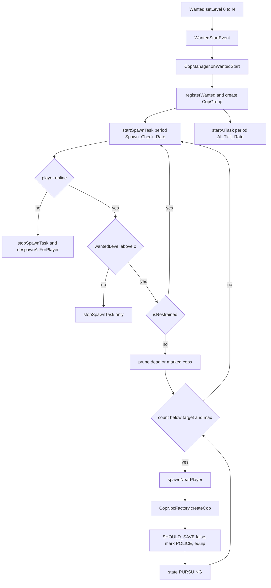

**State & persistence effects:** `groups`, `aiTasks`, `spawnTasks` in `CopManager`; non-persistent Citizens NPC registry entries; `EntityMarkManager.entityMarks` plus a PDC value on each entity. No DB writes on the cop path except `cop_spawner` rows written by the spawner commands.

**Edge cases & guards observed:** loaded-chunk check before spawning; `getEntity()==null` grace period for PLAYER NPCs in both tasks; the `maxCopsPerPlayer` hard cap; `break` out of the spawn loop when no location is found; `spawnNearPlayer` returns null and is null-checked; group emptiness plus `!isWanted` self-terminates the AI task.

### W2: Targeting

**Trigger:** every AI tick, immediately before `CopNpc.tick`.

**Steps:**
1. `CopManager.resolveTarget(cop, defaultTarget)` (`CopManager.java:478`) — if `cop.getTargetEntity()` is set and still valid/alive, keep it; otherwise clear it and `combatForced`.
2. An existing `targetPlayerId` is kept if the player is online, alive and not downed (`DownedPlayerRegistry.isDowned`) **and** either still wanted or (`combatForced` and present in `copAttackers`). Otherwise both target fields are cleared.
3. Priority 1 — `targetingManager.findBestTarget(defaultTarget)` (`WantedTargetingManager.java:44`): the nearest wanted, online, alive player **in the same world as `defaultTarget`** (the group's own player, not the cop). Sets `combatForced = false` and downgrades `COMBAT → PURSUING`.
4. Priority 2 — `findNearestCopAttacker(cop)` (L578): the nearest online, alive, non-downed UUID from `copAttackers` in the cop's world. Sets `combatForced = true` and forces `COMBAT`.
5. Priority 3 — `findNearestWantedCivilian(cop)` (L611): the nearest `CivilianNpc` that is `isHostile() && isWantedByPolice() && isValid()` in the same world. Sets `targetEntity`, `combatForced = true` and forces `PURSUING` unless already `COMBAT`/`PURSUING`.
6. Priority 4 — `cop.pollNextEntityAttacker()` (`CopNpc.java:190`): a FIFO deque of non-player `LivingEntity`s that damaged this cop, skipping dead entries. Forces `COMBAT`.
7. No target → clear everything and transition to `RETURNING` unless already `RETURNING`/`IDLE`.
8. `CopNpc.tick(target)` (`CopNpc.java:132`) re-stores the resolved target: a `Player` that is *not* a Citizens NPC → `targetPlayerId`; anything else (including PLAYER-type NPCs) → `targetEntity`.
9. Alerting: `CopListener.onCopDamaged` / `onWeaponRaytraceImpact` → `CopManager.onCopAttackedAlert` (L141) forces the hit cop into `COMBAT` on the attacker, then `findGroupContaining` and forces every other cop in that group, recording `activeCombatAlerts.add(group.getTargetPlayerId())`.
10. Line of sight goes through `AbstractNpc.hasLineOfSight` → `entity.hasLineOfSight(target)`; distance through `AbstractNpc.distanceTo`, which returns `Double.MAX_VALUE` for null, cross-world or invalid cases.

**Diagram:**
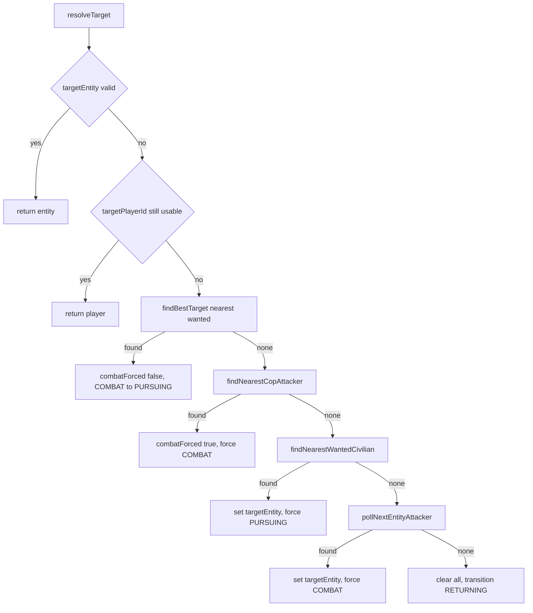

**State & persistence effects:** mutates `CopNpc.targetPlayerId`, `targetEntity`, `combatForced` and `currentState`. No persistence.

**Edge cases & guards observed:** downed players are excluded everywhere; cross-world candidates are skipped; the `CitizensAPI.getNPCRegistry().isNPC(p)` guard prevents storing an NPC's UUID as a player target; stale entity targets self-heal.

### W3: Police state machine

**Trigger:** `CopNpc.tick` dispatches to `behaviors.get(currentState).tick(this)` each AI tick. `transitionTo` (`CopNpc.java:108`) is a no-op when the state is unchanged; otherwise it runs `onExit` on the old behaviour and `onEnter` on the new one.

**Steps (per state):**
1. `IdleBehavior` — `onEnter`: `stopNavigation()`. `tick`: resolves the stored target; when `distance <= Alert_Range` **and** there is line of sight → `PURSUING`. There is no other exit.
2. `PursuingBehavior` — `onEnter`: `pursuitTicks = 0`. `tick`: null/dead target → `RETURNING`; `++pursuitTicks >= Pursuit.Max_Ticks` → `RETURNING`; `distance > Pursuit.Max_Distance` → `RETURNING`; a restrained player target → `RETURNING`; `distance <= cuffRadius && LOS` → `COMBAT` when `skipCuffing()` or `combatForced`, else `CUFFING`; ranged cops with LOS and `canAttack()` fire while closing; an entity target inside cuff range → `COMBAT`; `isNavigationHopeless()` → `RETURNING`; otherwise `navigateTo(resolvePursuitLocation(target))`. `onExit`: `stopNavigation()` and reset ticks.
3. `CuffingBehavior` — `onEnter`: no target → `PURSUING`; else `claimedPlayer = null`, `cuffingTicks = cuffingCooldown`, `stopNavigation()`. `tick`: an entity target → `COMBAT`; target offline → `RETURNING`; target already restrained → `RETURNING`; `CuffLockRegistry.tryAcquire` failure → `PURSUING`; losing ownership → `PURSUING`; leaving `cuffRadius` or losing LOS → `PURSUING`; while `cuffingTicks > 0` fire `DuringCuffingEvent` and decrement; at 0 call `attemptCuff` → success fires `CuffedEvent`, transfers the lock by nulling `claimedPlayer`, sets `guardedPlayerId` and goes `GUARDING`; failure → `PURSUING`. `onExit`: `releaseLock` and reset.
4. `GuardingBehavior` — `onEnter`: no `guardedPlayerId` → `RETURNING`; not the lock owner → clear and `RETURNING`; else `stopNavigation()`. `tick`: guarded player gone/offline → `RETURNING`; `!isHandcuffed` (released or committed to jail) → `RETURNING`; drift beyond `Guard_Radius` → `navigateTo(player)`, otherwise `stopNavigation()`. `onExit`: releases the cuff lock and clears `guardedPlayerId`.
5. `CombatBehavior` — `tick`: null/dead target → `RETURNING`; a restrained player → `RETURNING`; attack when `distance <= combatRange * 3` (weapon cops) or `combatRange` (melee) with `canAttack()` and LOS; ranged cops `pauseNavigation()` inside the hold range, hopeless navigation uses `resolveHopelessFallbackLocation`, otherwise `resolvePursuitLocation`. `onExit`: `stopNavigation()`.
6. `ReturningBehavior` — `onEnter`: `despawnTicks = 0`, `selectedStation = null`. `tick`: **if the stored target is online and not restrained, transition straight back to `COMBAT`/`PURSUING`**; otherwise `++despawnTicks`, resolve the nearest same-world station once (falling back to the cop's original spawn location), navigate; arriving within `Station_Arrival_Distance` (XZ only), crossing worlds, or `despawnTicks >= Return.Max_Ticks` → `markForRemoval()`. `onExit`: `stopNavigation()` and reset.

**Diagram:**
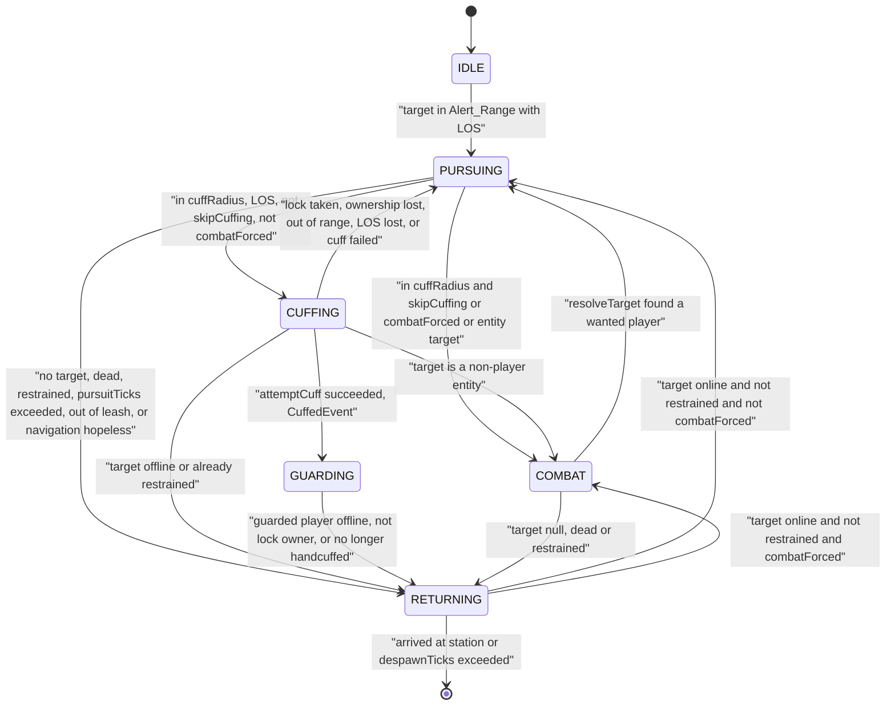

**State & persistence effects:** `CopNpc.currentState`, `pursuitTicks`, `despawnTicks`, `guardedPlayerId`, `markedForRemoval`; `CuffLockRegistry.ownerByTarget`; Citizens navigator state. No DB writes.

**Edge cases & guards observed:** the cuff lock is transferred rather than released on a successful cuff; `CopBehaviorFactory` converts `Cuff_Cooldown_Ticks` (game ticks) into AI-tick iterations with `Math.max(1, ticks / aiTickRate)`; every cop owns its own behaviour instances, so `cuffingTicks` and `selectedStation` are per-cop and not shared.

### W4: Cop attack / shooting

**Trigger:** `PursuingBehavior` (ranged cops closing distance) or `CombatBehavior` calls `cop.attack(player)` / `cop.attackEntity(target)`.

**Steps:**
1. `AbstractNpc.attack` (`npc/AbstractNpc.java:186`) — guards on `isValid()` and a non-null target, then delegates to `NpcCombatDelegate.attack`.
2. `NpcCombatDelegate.attack` (`npc/NpcCombatDelegate.java:50`) — skips dead/downed targets; `applyReactionTimeOnTargetSwitch` raises `attackCooldown` to `difficulty.reactionTimeTicks` on a fresh acquisition; `canAttack()` requires `attackCooldown == 0`, not `reloading`, and the weapon not mid-reload.
3. `faceTarget` (L119) — computes the eye-to-eye vector, applies `difficulty.aimError` jitter, and **teleports** the entity to the rotated location.
4. Dispatch order: gangland `GunWeapon` (when `Can_Use_Weapons` and LOS) → vanilla bow/crossbow ray trace → melee. Melee also requires LOS (L73) so knockback cannot leak through walls.
5. `performGanglandWeaponAttack` (L175) — reloads when broken or empty, then branches on `SelectiveFire`: `SINGLE` fires one round with cooldown `perShot*cooldown`; `AUTO` fires one round with `cooldown`; `BURST` builds a `SequenceTimer(plugin, 1L, 1L)` with `perShot` interval-task pairs and `start(false)` (synchronous, matching `feedback_repeating_timer_async`).
6. `fireSingleRound` (L310) — `consumeShot()`, fires a cancellable `WeaponShootEvent` (a cancel refunds one round), then `WeaponShooting.fire(plugin, raytracer, shooter, gun)` via the `WeaponRaytracer` service registration, plays the configured sounds through `SoundEffect.playSoundsAtLocation`, and refreshes the held-item NBT.
7. `performVanillaRangedAttack` (L200) — a 35-block `world.rayTrace` filtered to the target player, spawns `Particle.CRIT`, plays a raw `Sound.ENTITY_FIREWORK_ROCKET_BLAST`, damages on a hit, sets `attackCooldown = scaleCooldown(15)`.
8. `performMeleeAttack` (L222) — `player.damage(attackDamage * meleeDamageMultiplier, entity)`, `attackCooldown = scaleCooldown(5)`, and a 0.3 horizontal / 0.1 vertical knockback applied only when health actually dropped.
9. `decrementAttackCooldown()` runs once per **AI tick** from `CopNpc.tick`.
10. Return fire onto the cop routes through `CopListener` (W12) and `NpcDamageUnprotectListener`, which strips Citizens protection at three points.

**Diagram:**
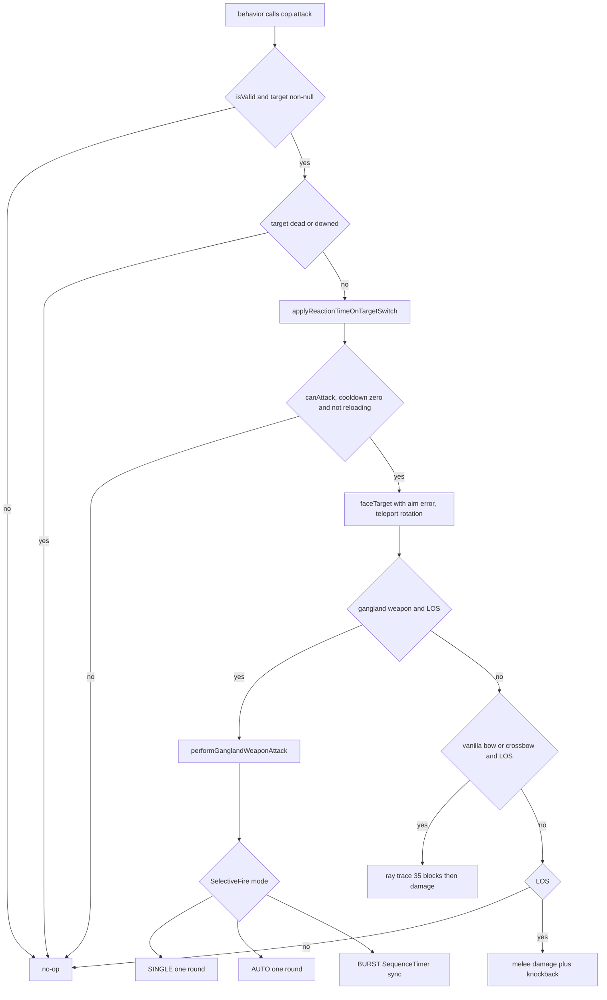

**State & persistence effects:** `attackCooldown`, weapon magazine state, `previousAttackTarget`, and an entity teleport for facing. No persistence.

**Edge cases & guards observed:** a cancelled `WeaponShootEvent` refunds the round; a missing `WeaponRaytracer` service registration silently skips the shot; entity null-checks throughout; `scaleCooldown` floors at 5.

### W5: Cuffing a player (NPC-initiated)

**Trigger:** `PursuingBehavior` transitions a cop into `CUFFING`.

**Steps:**
1. `CuffingBehavior.onEnter` resets `cuffingTicks` to `max(1, Cuff_Cooldown_Ticks / AI_Tick_Rate)` and stops navigation.
2. Each AI tick `CuffLockRegistry.tryAcquire(targetUuid, copUuid)` serialises the attempt globally (`npc/police/state/CuffLockRegistry.java:23`); losers fall back to `PURSUING`.
3. During the wind-up, `DuringCuffingEvent(cop, target, cuffRadius, maxAttempts, cuffingCooldown*aiTickRate, remainingGameTicks)` fires every AI tick.
4. `CuffingListener.onPlayerCuffing` (`listener/police/CuffingListener.java:29`) converts remaining game ticks to ceil-seconds and re-sends the "Cuffing / Restraining in Ns" title only when the second value changes, caching the last value in `Map<Player, Long> currentCuffCooldown`.
5. At `cuffingTicks == 0`, `CopNpc.attemptCuff` (`npc/police/npc/CopNpc.java:169`) requires LOS and `distance <= tierConfig.cuffRadius()`.
6. On success `CuffedEvent` fires; the lock is handed to `GUARDING` by nulling `claimedPlayer` before the transition so `onExit` cannot release it.
7. `CuffingListener.onPlayerSuccessfulCuffing` (L49) — skips dead/downed targets, clears the cooldown cache entry, calls `detainmentService.handcuff(target)` and `transitService.schedule(target)`, then sends the "Cuffed" title.
8. `DetainmentService.handcuff` (`detainment/DetainmentService.java:67`) — `setState(HANDCUFFED)` (registry insert plus repository save), `applyVisuals(player, true)` closes the inventory and applies infinite SLOWNESS 4 + BLINDNESS 1, then sends the title and action bar.
9. `TransitService.schedule` (`detainment/transit/TransitService.java:49`) — writes `transitExpiresAt = now + Delay_Ticks*50` onto the `DetainedPlayer` row (persisted immediately) and schedules `runTaskLater(fireById, delayTicks)` in the `pending` map.

**Diagram:**
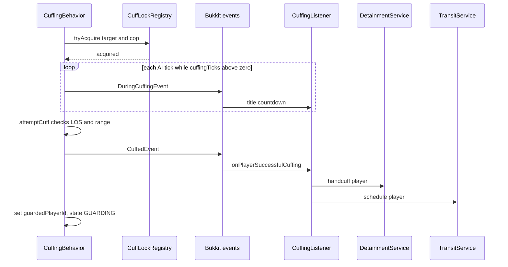

**State & persistence effects:** a `detainment` row inserted with `state=HANDCUFFED` and `transit_expires_at`; the cuff lock held by the guarding cop; potion effects applied; a `BukkitTask` in `TransitService.pending`.

**Edge cases & guards observed:** downed and dead targets are ignored by both cuff listeners; the lock prevents concurrent cuffs across groups; the wind-up restarts from scratch on every fresh `onEnter`.

### W6: Cuffing and uncuffing via command

**Trigger:** `/glw cuff <player>` or `/glw uncuff [player]`.

**Steps:**
1. `CuffCommand.getPlayerArg` (`gangland-impl/.../command/sub/cuff/CuffCommand.java:53`) — resolves the online player, rejects if already handcuffed, calls `detainmentService.handcuff(target)`, sends `Messages.CUFF_HANDCUFFED`.
2. No `TransitService.schedule` call is made, no cuff lock is taken, and no cop guards the player.
3. `UncuffCommand.releasePlayer` (`.../cuff/UncuffCommand.java:77`) calls `detainmentService.release(target)` directly: `jailRegistry.releasePlayer`, `setState(NORMAL)` (row deleted), `clearVisuals`, "Released" title.

**Diagram:**
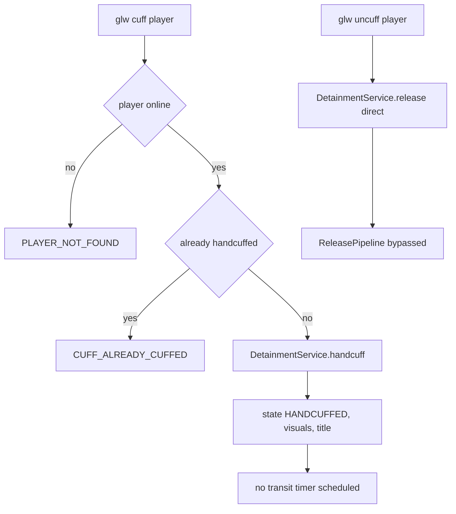

**State & persistence effects:** `detainment` row inserted or deleted; potion effects applied or cleared. **No** transit timer, **no** inventory restore, **no** paperwork strip.

**Edge cases & guards observed:** tab-completion filters by handcuff state on both commands; `/glw uncuff` with no argument self-releases the sender when they are handcuffed.

### W7: Transit → jail intake

**Trigger:** the `TransitService` task fires, the handcuffed player dies (`DetainmentListener.onDeath` → `commitNow`), or an admin runs `/glw jail throw`.

**Steps:**
1. `TransitService.fireById` (`transit/TransitService.java:112`) → `fire(player)`: returns silently unless `detainmentService.isHandcuffed(player)`; otherwise invokes the `onCommit` consumer wired to `JailIntakeService::admit` in `CopsAndGadgetsConfig.jailIntakeService`.
2. `JailIntakeService.admit` (`detainment/intake/JailIntakeService.java:40`) — offline → false; `pickJail` (L73) selects the closest non-full jail, preferring the player's own world; **when no jail is available it calls `detainmentService.release(player)` and returns false**.
3. `wantedClearContract.getWantedLevel(uuid)` snapshots the level (via `GanglandWantedClearContract` → `UserManager` → `Wanted.getLevel()`).
4. `seizedInventoryService.snapshot(player)` — `GanglandSeizedInventoryService.snapshot` serialises main + armour + offhand into Base64 with `BukkitObjectOutputStream`, caches it and writes the `seized_inventory` row.
5. `clearInventory(player)` wipes contents, armour and offhand; `giveItem` places the paperwork book in slot 0.
6. `wantedClearContract.clearWanted(uuid)` → `Wanted.setLevel(0)` → fires `WantedLevelChangeEvent` and `WantedEndEvent` → `CopManager.onWantedEnd` unregisters targeting and stops the spawn task.
7. `jailService.detainPlayer(jailId, uuid)` adds the player to the cell and saves the jail row; `detainmentService.jail(player, jailId)` then calls `jailService.detainPlayer` **again**, sets state `JAILED` (row updated with `jail_id`), applies visuals, teleports to the jail location and sends the title plus action bar.
8. The `DetainedPlayer` row is updated with `transitExpiresAt = null`, `wantedAtArrest = <snapshot>` and `sentenceExpiresAt = now + computeSentenceSeconds(wanted)*1000`, then persisted through `detainmentRegistry.save`.
9. `sounds.playTransitCommit(player)`.
10. On its next tick the guarding cop sees `!isHandcuffed` and transitions `GUARDING → RETURNING`, releasing the cuff lock in `onExit`.

**Diagram:**
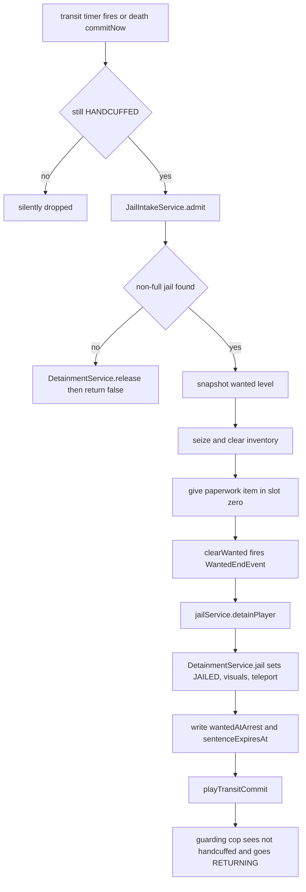

**State & persistence effects:** the `detainment` row is updated (`state`, `jail_id`, `sentence_expires_at`, `wanted_at_arrest`, `transit_expires_at=null`); a `seized_inventory` row is inserted; the `jail` row is re-saved; the wanted level is zeroed; the player is teleported.

**Edge cases & guards observed:** an offline guard; a no-jail fallback that releases rather than strands; `pickJail` skips full cells and prefers the same world; the transit task is removed from `pending` before firing.

### W8: Serving the sentence and automatic release

**Trigger:** the `SentenceService` repeating task, started in `onInitialize` and cancelled in `onClear`.

**Steps:**
1. `SentenceService.tickAll` (`detainment/sentence/SentenceService.java:91`) runs every 20 ticks, iterating `detainmentRegistry.getDetainedPlayers().values()` and skipping non-`JAILED` and offline entries.
2. `tick(player)` (L59) — no row or no `sentenceExpiresAt` → return; remaining above 0 → `ActionBarManager.send(messages.sentenceTickActionBar(seconds), 25L)`; remaining at or below 0 → `sounds.playSentenceComplete` then `releasePipeline.release(player, SENTENCE_COMPLETE)`.
3. `ReleasePipeline.release` (`detainment/release/ReleasePipeline.java:53`) — captures `jailId` before mutating; `transitService.cancel(player)`; restores the seized inventory (always when the prior state was `JAILED`, defensively otherwise); `stripPaperwork` scans the whole inventory for PDC-marked books; `detainmentService.release(player)` clears jail occupancy, deletes the row, clears visuals and sends the "Released" title; `killCombo.resetCombo(uuid)`; `teleportToExit(player, jailId)`.
4. `GanglandReleaseExitContract.resolveExit` (`gangland-impl/.../data/detainment/GanglandReleaseExitContract.java`) — per-jail exit → global exit → the `Detainment.Fallback_Exit_Waypoint` waypoint → any waypoint → `null` (released on the spot).
5. `GanglandSeizedInventoryService.restore` removes the cache entry, deletes the DB row, then deserialises and applies the contents.

**Diagram:**
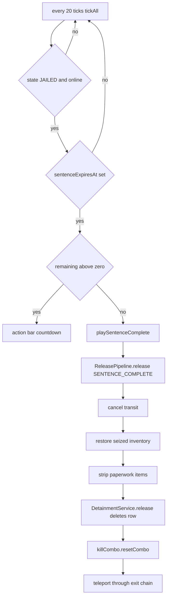

**State & persistence effects:** the `detainment` row is deleted, the `seized_inventory` row is deleted, the jail occupant list is updated and every jail row is re-saved (`JailService.releasePlayer` does a `saveAll`), potion effects are removed and the player is teleported.

**Edge cases & guards observed:** offline jailed players are skipped, but because the expiry is an absolute timestamp their sentence still elapses in wall-clock time; `teleportToExit` no-ops when `jailId` is null or no exit resolves.

### W9: Bail

**Trigger:** clicking the "Pay Bail" slot (11) in `PaperworkView`.

**Steps:**
1. `PaperworkView.open` (`detainment/paperwork/PaperworkView.java:53`) builds the 27-slot menu, calls `DetainmentGuiAccess.authorize(uuid)` and then `handler.open(player)`.
2. The click handler closes the inventory and calls `BailService.tryPayBail`.
3. `BailService.tryPayBail` (`detainment/bail/BailService.java:37`) — `!isJailed` → `NOT_JAILED`; cost = `computeBailCost(wantedAtArrest)` = `Base_Cost + wantedAtArrest * Per_Wanted_Level`.
4. `DetainmentEconomyContract.tryCharge` → `GanglandDetainmentEconomyContract.tryCharge`: a null `User` → `ECONOMY_ERROR`; balance below cost → `INSUFFICIENT_FUNDS`; otherwise `economy.withdrawAmount(charge)` with `EconomyException` mapped to `ECONOMY_ERROR`.
5. On success: `sounds.playBailSuccess`, `releasePipeline.release(player, BAIL)`, result `SUCCESS`.
6. `PaperworkView.handleBailResult` sends `bailSuccess()` or `bailInsufficient()` (the same message covers `ECONOMY_ERROR`).

**Diagram:**
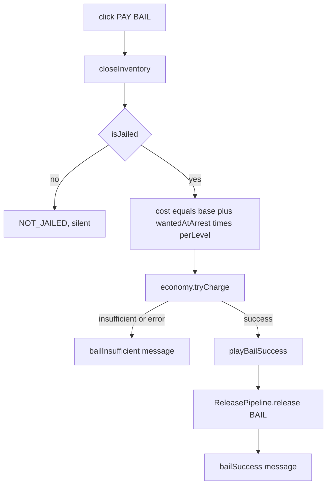

**State & persistence effects:** money withdrawn plus the full release side effects from W8.

**Edge cases & guards observed:** the cost uses the *snapshot* `wantedAtArrest` (0 when the row or field is missing), so it stays stable after the intake wanted-clear.

### W10: Bribe (handcuff and jail variants)

**Trigger (handcuff):** a HANDCUFFED player right-clicks the cop holding their cuff lock.
**Trigger (jail):** clicking the "Bribe Officer" slot (13) in `PaperworkView`.

**Steps:**
1. `HandcuffBribeListener.onNpcRightClick` (`listener/police/HandcuffBribeListener.java:31`) requires `isHandcuffed`, a non-null NPC entity, `copManager.findCopByEntity` resolving a managed cop, and `cuffLockRegistry.isOwner(playerUuid, copUuid)`.
2. `HandcuffBribeView.open` builds a one-button GUI, authorises it through `DetainmentGuiAccess`, and on click calls `BribeService.tryHandcuffBribe(player, cop)`.
3. `BribeService.tryHandcuffBribe` (`detainment/bribe/BribeService.java:49`) — `NOT_HANDCUFFED` / `WRONG_COP` guards; cost = `Handcuff_Bribe.Base_Cost + liveWantedLevel * Per_Wanted_Level` (the live level, since wanted has not been cleared yet); charge; then `clearWanted`, `playBribeSuccess`, `releasePipeline.release(HANDCUFF_BRIBE)` and `cop.transitionTo(RETURNING)`.
4. `BribeService.tryJailBribe` (L87) — `NOT_JAILED` guard; cost from `wantedAtArrest`; charge first; roll `ThreadLocalRandom.nextDouble()`; `roll > Success_Chance` → `extendSentence` (adds `Fail_Penalty_Seconds` to `max(now, currentExpiry)` and saves) plus `playBribeFail` and result `FAIL` (money is kept); otherwise `playBribeSuccess` and `releasePipeline.release(JAIL_BRIBE)`.

**Diagram:**
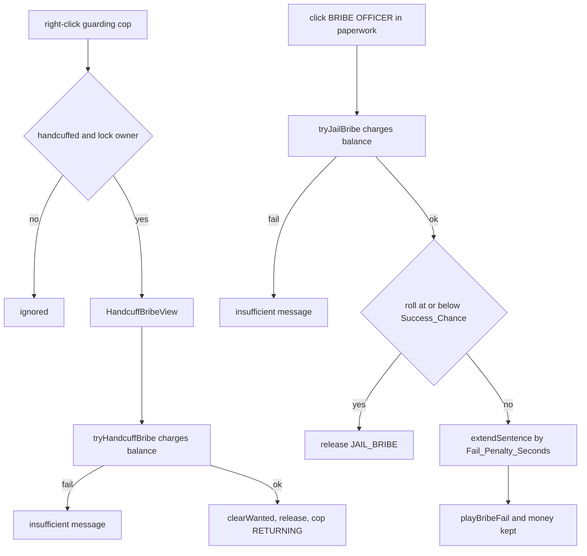

**State & persistence effects:** money is withdrawn on both paths; the handcuff bribe zeroes wanted (firing `WantedEndEvent`); a failed jail bribe writes a new `sentence_expires_at`.

**Edge cases & guards observed:** the handcuff bribe is scoped to the lock-owning cop only; the jail bribe charges before rolling, which is the documented design.

### W11: Break-free minigame

**Trigger:** `PlayerToggleSneakEvent` with `isSneaking() == true` while HANDCUFFED.

**Steps:**
1. `BreakFreeListener.onSneak` → `BreakFreeService.registerTap` (`detainment/breakfree/BreakFreeService.java:43`).
2. The only guard is `isHandcuffed` — jailed players cannot break free.
3. A per-player `Counter` is created on demand; when `now - lastTapMs > Reset_Window_Ticks*50` the count resets to 0; then `taps++`.
4. At `taps >= Taps_Required`: remove the counter, send the success title, `playBreakFreeSuccess`, `releasePipeline.release(player, BREAK_FREE)` — **the wanted level is deliberately not cleared**, so cops re-engage on the next AI tick.
5. Below the threshold the progress action bar is sent.
6. A separate `promptTask` (20-tick period, started in `onInitialize`, cancelled in `onClear`) pushes the prompt to every handcuffed online player even before they start tapping.

**Diagram:**
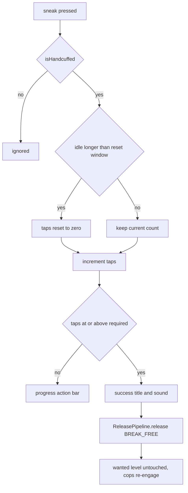

**State & persistence effects:** only the in-memory `counters` map, plus the usual release persistence. Because the player was HANDCUFFED, `ReleasePipeline` takes the defensive `has(uuid)` branch and normally finds no seized inventory.

**Edge cases & guards observed:** `Math.max(1, …)` floors both config values; the prompt task and the tap path share the same window arithmetic.

### W12: Attacking a cop, alert escalation and cop death

**Trigger:** any damage to a cop entity.

**Steps:**
1. `CopListener.onCopDamaged` (`listener/detainment/CopListener.java:102`, HIGH, ignoreCancelled) — skips when `WeaponRaytracer.isRaytraceDamageInProgress()` so weapon shots are processed exactly once.
2. `copManager.isCopNpc(victim)` scans every group; non-cop victims return early.
3. A player damager (direct or via a player-shot projectile) that is not itself an NPC → `copManager.onCopAttackedAlert(cop, attacker)`: forces the hit cop into `COMBAT` on the attacker, adds the attacker to `copAttackers`, forces every other cop in the same group, and records `activeCombatAlerts`.
4. Cop-on-cop damage (direct or projectile) → `event.setCancelled(true)` (friendly fire).
5. Any other `LivingEntity` damager → `attackedCop.addEntityAttacker(entityAttacker)` (deduplicated FIFO deque).
6. `CopListener.onWeaponRaytraceImpact` mirrors the same branches on `WeaponRaytraceImpactEvent`.
7. `CopListener.onCopDeath` (L195, MONITOR on `EntityDeathEvent`) resolves the cop, calls `cop.destroy()` (with no `EntityMarkManager`), clears drops and XP, and for PLAYER-type NPC deaths sets `setKeepInventory(true)`.
8. `NpcDamageUnprotectListener` strips Citizens protection at spawn (a 20-tick loop), at LOW damage priority, and on raytrace impact; traders and `SHOULD_SAVE=true` NPCs are exempt.

**Diagram:**
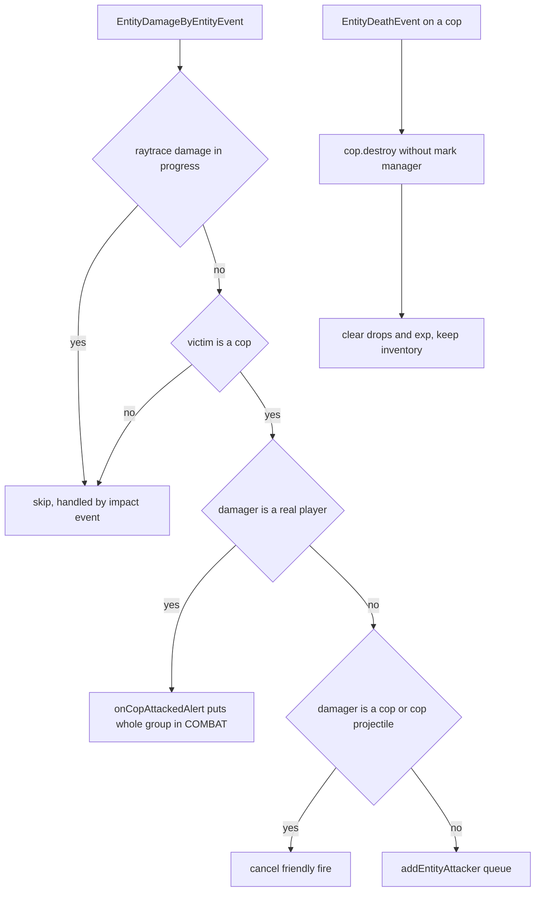

**State & persistence effects:** `copAttackers`, `activeCombatAlerts`, the per-cop attacker deque and cop state; Citizens protection flags cleared on the entity.

**Edge cases & guards observed:** a double-processing guard between the legacy damage path and the raytrace path; NPC-versus-player disambiguation through `CitizensAPI.getNPCRegistry().isNPC`.

### W13: Quit, rejoin, death and respawn while detained

**Trigger:** `PlayerQuitEvent`, `PlayerJoinEvent`, `PlayerDeathEvent`, `PlayerRespawnEvent`.

**Steps:**
1. **Quit** — `DetainmentListener.onQuit` (MONITOR) → `DetainmentService.handleQuit` (`DetainmentService.java:116`): when the player is HANDCUFFED it calls `detainmentRegistry.setState(uuid, JAILED)` directly. `DetainmentGuiAccess.revoke(uuid)` also runs. Separately, `CopListener.onPlayerQuit` removes the player from `copAttackers` and calls `CopManager.onWantedEnd`.
2. `DetainmentRegistry.setState(JAILED)` (`DetainmentRegistry.java:47`) resolves a `jailId` through `jailRegistry.getJailIdForPlayer` and then `findEmptyJail()`, updates the row and saves. It does **not** add the player to the cell, seize the inventory, clear wanted, give paperwork or set `sentenceExpiresAt`.
3. **Rejoin** — `DetainmentListener.onJoin` (MONITOR) → `DetainmentService.handleJoin` (L101): `NORMAL` → clear visuals; otherwise apply visuals and, when `JAILED`, `runTask(() -> teleportToJail(player))` using the row's `jailId`.
4. `TransitService.resumeOnJoin` (`transit/TransitService.java:80`) — when `transitExpiresAt` is set: already expired → `runTask(fire)` on the next tick; otherwise reschedule with the remaining ticks.
5. **Death while handcuffed** — `DetainmentListener.onDeath` (MONITOR) → `transitService.commitNow(player)`: cancels the pending task and fires the commit immediately, so intake runs while the player is dead (their inventory has already dropped).
6. **Respawn** — `DetainmentListener.onRespawn` (MONITOR): when `isJailed`, sets the respawn location from `jailRegistry.getJailLocation(uuid)` (which searches cell occupant lists) and calls `DetainmentService.handleRespawn`, which re-applies visuals and teleports to jail on the next tick.
7. **Restraint blanket** — while restrained, `DetainmentListener` cancels weapon shooting, inventory open (unless authorised through `DetainmentGuiAccess`), inventory click/drag (own inventory allowed while jailed), crafting, interact, entity interact, armour-stand manipulation, drops, pickups, block break/place, off-hand swap and hotbar changes (both allowed while jailed), commands (unless the player has `gangland.detainment.bypass.command`), vehicle enter/exit and elytra gliding. Every cancel also calls `tickVisuals`, which re-applies the potion effects and re-sends the state action bar.

**Diagram:**
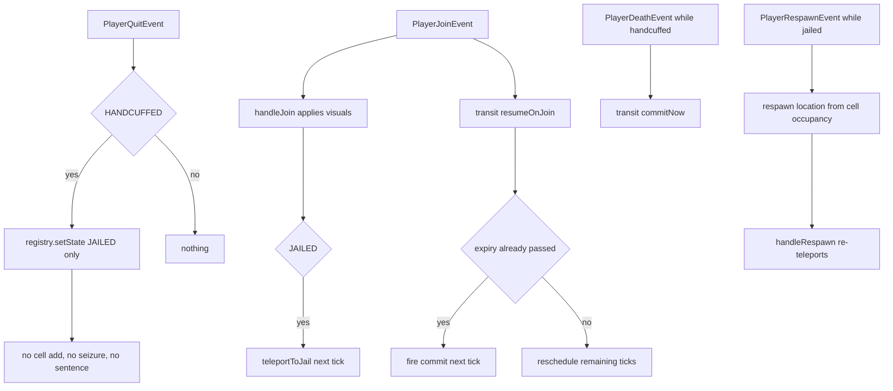

**State & persistence effects:** `detainment.state` flipped to `JAILED` on quit; the transit task rescheduled or fired on join; teleports on join and respawn.

**Edge cases & guards observed:** `teleportToJail` no-ops when the row or `jailId` is null; `handleQuit` only touches HANDCUFFED players; `resumeOnJoin` handles the already-expired case.

### W14: Jail creation, deletion and cell management

**Trigger:** `/glw jail create|remove|setexit|throw|release|list|info|teleport`.

**Steps:**
1. `JailCreateCommand` (`gangland-impl/.../command/sub/jail/JailCreateCommand.java:32`) — player-only; rejects when any existing jail in the same world is within 5 blocks (`distanceSquared < 25`); then `jailService.setJailLocation(location, Settings.getJailMaxCapacity())`.
2. `JailService.setJailLocation` (`jail/JailService.java:26`) — increments the **static** `ID`, calls `jailRegistry.setJailLocation(ID, location, maxCapacity)` (which creates a cell or *moves* an existing one with that id), then `jailRepository.save(jail)`.
3. `JailRepository.doLoadAll` assigns `JailService.ID = id` for each loaded row (last row wins, not `Math.max`).
4. `JailRemoveCommand` → `JailService.removeJail(id)` removes the cell from the registry and deletes the row. Occupants, their `detainment` rows and any `jail_exit` row for that id are left untouched.
5. `JailSetExitCommand` — with no argument it sets the GLOBAL exit (`JailExitService.setGlobalExit`, stored at `row_id = -1`); with a jail id it validates the cell exists and stores a SPECIFIC row keyed by the jail id.
6. `JailThrowCommand` checks `detainmentRegistry.findEmptyJail()` (the first non-full cell) and `!isJailed`, then delegates to `jailIntakeService.admit(target)`, which independently picks the closest same-world cell.
7. `JailReleaseCommand` requires `isJailed` and routes through `releasePipeline.release(target, ADMIN)`.
8. Occupancy: `JailRegistry.detainPlayer` first calls `releasePlayer(uuid)` across all cells, then `jail.addPlayer(uuid)` (deduplicated). `JailService.releasePlayer` re-saves every jail row.

**Diagram:**
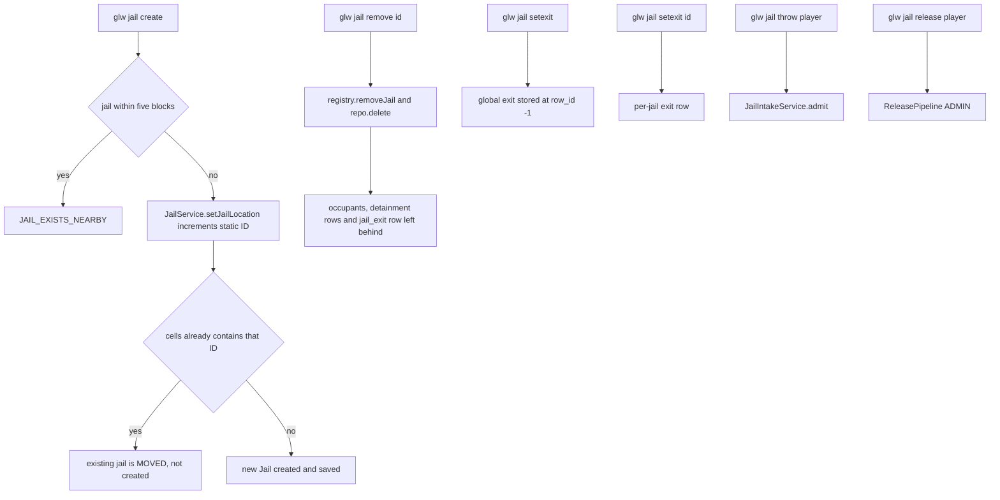

**State & persistence effects:** `jail` and `jail_exit` rows; `JailRegistry.cells`; the `JailExitRegistry` maps; the static `JailService.ID`.

**Edge cases & guards observed:** the 5-block proximity check is world-aware and null-safe; `JailRegistry.detainPlayer` throws `IllegalArgumentException` for an unknown id; `JailExitRepository.doLoadAll` skips rows whose world is not loaded.

### W15: Cop spawner management

**Trigger:** `/glw cop spawner set|remove|list|info|teleport`.

**Steps:**
1. `CopSpawnerSetCommand` → `EntitySpawner.setSpawnerLocation` (`npc/entity/EntitySpawner.java:67`): `ID++`, `computeIfAbsent(ID, …)`, `setLocation`, `repository.save`.
2. `CopSpawnerRemoveCommand` → `EntitySpawner.removeSpawner(id)` removes the entry and deletes the row.
3. `EntitySpawner.onInitialize` / `reloadSpawners` → `loadStoredSpawners` (L214) clears the map, reloads every row and restores `ID` to the **maximum** loaded id.
4. `CopSpawnManager.findClosestSpawnerLocation` uses these points to place cops near a registered station; `ReturningBehavior.findNearestStation` uses them as despawn destinations.

**Diagram:**
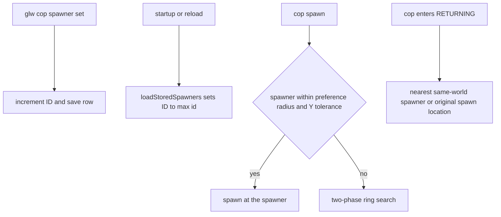

**State & persistence effects:** `cop_spawner` rows and the in-memory `spawners` map.

**Edge cases & guards observed:** `getSpawnerLocation(id)` is null-checked by every command; all locations are cloned on the way in and out.

### W16: Config reload and how live NPCs react

**Trigger:** `/glw reload` → `GanglandContext.reloadBeans()` → per-bean `onPreClear` → `onClear` → `onInitialize(false)`.

**Steps:**
1. `CopManager.onPreClear` → `shutdown()` cancels every spawn and AI task and destroys every cop in every group; `onClear` empties all maps and nulls `configProvider`.
2. `CopLoader.clear()` drops `loadedConfig` and `loadedProvider`; `loadData` re-reads `cops.yml` and builds a new `YamlCopConfigProvider`, which pulls behaviour knobs from the freshly reloaded `Settings`.
3. `CopManager.onInitialize(false)` re-reads `copLoader.getLoadedProvider()`; `CopSpawnManager.onInitialize` reloads spawner rows and `rebuildFactories()` creates a new `CopNpcFactory` and `CopBehaviorFactory` bound to the new provider.
4. `EntityMarkManager.onClear` clears the mark cache (PDC values survive on the entities); `onInitialize(false)` re-reads the civilian default entity lists.
5. `JailService.onClear` clears the registry and `onInitialize` reloads jails (with `JailRepository` re-assigning the static `ID`). `DetainmentRegistry.onClear`/`onInitialize` reload the detainment rows. `JailExitService.onClear` is intentionally a no-op.
6. `SentenceService` and `BreakFreeService` cancel and restart their repeating tasks across the clear/initialize pair.
7. `TransitService` implements no `BeanLifecycle` hooks: its `pending` tasks are **not** cancelled on reload, but they still fire against the reloaded registry. Its `onCommit` consumer was set once in `CopsAndGadgetsConfig.jailIntakeService` and is not re-wired — beans are singletons, so this is fine.
8. `CuffLockRegistry` and `DetainmentGuiAccess` have no clear hook; the former is normally emptied indirectly because destroying a cop runs `cleanupTransientState()` → the current behaviour's `onExit` → `releaseLock`.
9. Live cops are destroyed before the new config is read, so there is no in-place re-tuning path — every cop is recreated on the next spawn tick with the new provider.

**Diagram:**
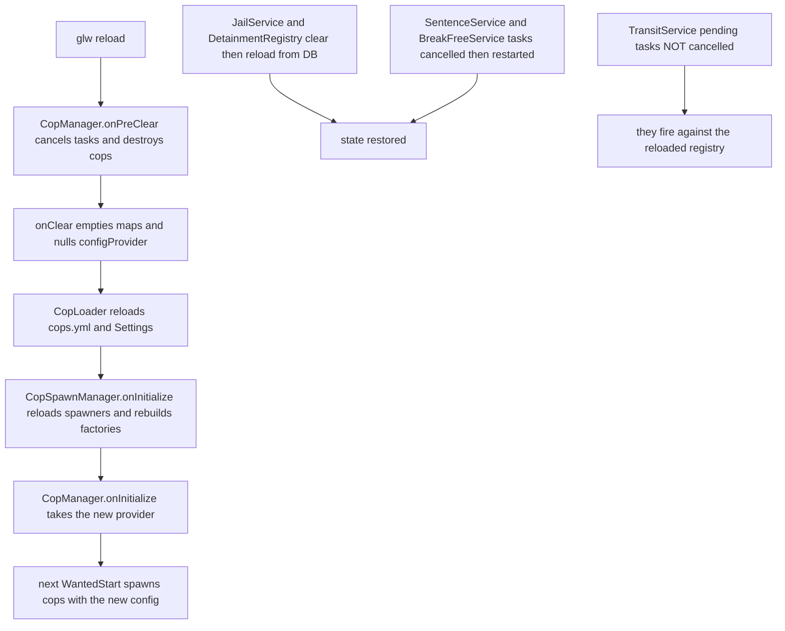

**State & persistence effects:** all cop NPCs destroyed; in-memory registries reloaded from the database; scheduled transit tasks survive.

**Edge cases & guards observed:** the `onInitialize(firstLoad)` guards avoid duplicate work on first boot for `CopManager` and `EntityMarkManager`; `SentenceService` and `BreakFreeService` guard on `task != null`.

## Cross-feature Dependencies

- **Depends on:**
  - Keystone: `BeanLifecycle` / `@Bean` / `@Qualifier`, `IRepository` + `AbstractRepository` + `Table`/`Attribute`, `Command`/`SubArgument`/`OptionalArgument`/`Tree`, `FileLoader`/`FileManager`/`NodeReader`/`ConfigReport`, `ItemBuilder`, `SoundEffect`, `ChatUtil`, `ActionBarManager`, `SequenceTimer`, `PermissionManager`, `DatabaseHandler`/`DatabaseBackend`.
  - Citizens (`net.citizensnpcs.api`): the NPC registry, navigator, `NPCSpawnEvent`, `NPCRightClickEvent`, `NPC.Metadata.SHOULD_SAVE`.
  - `gangland-features/gangland-weapon`: `Weapon`, `GunWeapon`, `WeaponService`/`WeaponManager`, `Ammunition`, `SelectiveFire`, `WeaponShootEvent`, `WeaponRaytracer`, `WeaponRaytraceImpactEvent`, `WeaponShooting`.
  - `gangland-infra/gangland-domain`: `Wanted` plus the three wanted events, `User`/`UserManager`, `EconomyHandler`/`Currency`, `Waypoint`/`WaypointManager`.
  - `gangland-core`: `DownedPlayerRegistry`, `PlayerDownedEvent`.
  - `gangland-ui/inventory-api`: `InventoryHandler`, `InventoryUtil`, `Fill` for both detainment GUIs.
  - `gangland-infra/gangland-item`: `ItemParser` for tier armour and weapon-pool entries.
  - `gangland-impl`: `Settings`, `Messages`, `MoneyAddon`, `KillCombo`, and every contract implementation.
  - XSeries through Keystone: `XPotion`, `XMaterial`.
- **Depended on by:**
  - Civilians (`npc/civilian/**`) extend `AbstractNpc` and `EntitySpawner` and share `EntityMarkManager`, `NpcNavigationDelegate`, `NpcCombatDelegate`, `NpcDifficulty`, `NpcNavigationConfig` and the shared `NPC_Navigation` settings block.
  - Traders, bankers and turf power-up/defender NPCs share `AbstractNpc`, the mark manager, `NpcDamageUnprotectListener` and `NpcPortalListener`.
  - `GanglandMoneyDropClassifier` (money drops) is constructed from `CopManager` plus `CivilianNpcRegistry`.
  - `CopManager` consumes `CivilianNpcRegistry` for the "hostile wanted civilian" target priority, making the cop↔civilian coupling bidirectional.
  - `KillCombo` is reset by `ReleasePipeline`.
  - The scoreboard and placeholder layers surface wanted state that this area zeroes on intake and on the handcuff bribe.

## Observations & Potential Issues

| # | Location | Observation | Risk | Confidence |
|---|---|---|---|---|
| 1 | `gangland-impl/src/main/java/org/luckyraven/gangland/database/tables/copsncrooks/DetainmentTable.java` (`jailId.setUnique(true)`) | `detainment.jail_id` is declared UNIQUE, so a second player detained in the same cell writes a duplicate `jail_id`. | The insert/upsert fails with a unique-constraint violation and the second inmate's row is never persisted — `Jail.Max_Capacity` above 1 is effectively unusable across restarts. | High |
| 2 | `.../copsncrooks/jail/JailService.java:12,29` and `gangland-impl/.../database/repositories/copsncrooks/JailRepository.java` (`JailService.ID = id`) | `JailService.ID` is a mutable static restored by plain assignment per loaded row (last row wins, not `max`). `EntitySpawner.loadStoredSpawners` does track the max, so the two are inconsistent. | If rows come back unordered, or a middle id was deleted, `/glw jail create` reuses an existing id and `JailRegistry.setJailLocation` silently *moves* that jail instead of creating a new one, relocating its inmates. | High |
| 3 | `.../npc/police/config/CopTierConfig.java` (`health`) versus `CopNpcFactory.createCop` | `Health` is parsed for every tier in `cops.yml` but never applied — a repo-wide grep finds no `.health()` call on the cop path (only `CivilianNpcFactory.applyHealthBonus` for civilians). | Every cop tier spawns with the vanilla PLAYER 20 HP, so the documented 20→60 HP tier progression does nothing. | High |
| 4 | `.../detainment/DetainmentService.java:116` `handleQuit` | The HANDCUFFED→JAILED promotion on quit writes only the registry state. It bypasses `JailIntakeService` entirely: no cell occupancy, no inventory seizure, no wanted clear, no paperwork item and **no `sentenceExpiresAt`**. | On rejoin the player is JAILED with a null sentence expiry, so `SentenceService.tick` returns early and they are never auto-released; without the paperwork item they cannot open the bail/bribe GUI either. Only an admin `/glw jail release` frees them. | High |
| 5 | `.../npc/police/state/behavior/ReturningBehavior.java:44-49` with `PursuingBehavior.java:40-52` | `PursuingBehavior` gives up (leash, max ticks, or hopeless navigation) while `targetPlayerId` is still set and the target is online and unrestrained; `ReturningBehavior.tick` sees exactly that condition and transitions straight back to `PURSUING`, whose `onEnter` resets `pursuitTicks` to 0. | The pursuit leash and `Return.Max_Ticks` never retire a cop chasing a live, unrestrained, wanted player — a PURSUING↔RETURNING ping-pong that keeps the per-player cop cap permanently full and prevents despawn. | High |
| 6 | `gangland-impl/.../data/detainment/inventory/GanglandSeizedInventoryService.java` `restore` | The cache entry is removed and the DB row deleted **before** `applyInventory` deserialises; a `ClassNotFoundException` or version mismatch only logs an error and returns false. | The player's entire seized inventory is permanently lost with no recovery path. | High |
| 7 | `gangland-impl/.../command/sub/jail/JailRemoveCommand.java` → `JailService.removeJail` | Deleting a jail does not release its inmates, delete their `detainment` rows, or remove the matching `jail_exit` row, and `detainment.jail_id` carries an FK to `jail.id`. | Inmates stay JAILED pointing at a nonexistent cell (`teleportToJail`, the respawn hook and `ReleasePipeline.teleportToExit` all silently no-op), and the FK can also reject the delete on MySQL. | High |
| 8 | `.../npc/NpcCombatDelegate.java` (`decrementAttackCooldown` invoked from `CopNpc.tick`) versus `scaleCooldown(15)` / `scaleCooldown(5)`, plus `Cops.Behaviour.Attack_Cooldown_Ticks` | Cooldowns are expressed in game ticks but decremented once per **AI** tick (default `AI_Tick_Rate: 10`). `Attack_Cooldown_Ticks` reaches the provider and is never read at all. | The effective fire rate is roughly 10× slower than the numbers suggest, and the documented attack-cooldown knob is dead. | Medium |
| 9 | `.../npc/entity/EntitySpawner.java:307` `isSpawnBehindPlayer` and `:117` `isVisibleToOtherPlayers` | `Math.toRadians(playerLoc.getYaw())` is compared directly against `Math.atan2(dz, dx)`. Minecraft yaw is measured from +Z and increases clockwise, while `atan2(dz,dx)` is measured from +X and increases counter-clockwise — the frames differ by 90° and a sign. | The "spawn behind the player" and "visible to other players" checks pick the wrong hemisphere, so phase-1 spawns appear in front of the player as often as behind. | Medium |
| 10 | `.../listener/police/CuffingListener.java:23` | `private final Map<Player, Long> currentCuffCooldown = new ConcurrentHashMap<>();` is keyed by the `Player` object and cleaned only in `onPlayerSuccessfulCuffing`. | Every failed cuff attempt leaks a strong reference to a `Player` (and its whole entity graph) for the plugin's lifetime. | High |
| 11 | `.../detainment/transit/TransitService.java:101` `cancelInternal` | Clears `transitExpiresAt` in memory but never calls `detainmentRegistry.save(detained)`. | If the server crashes before the next auto-save sweep, a cancelled transit can resurrect through `resumeOnJoin` on the player's next login. | Medium |
| 12 | `gangland-impl/.../database/repositories/copsncrooks/DetainmentRepository.java` (state parse) | `String.valueOf(result[v++])` already increments `v`, and the `catch (IllegalArgumentException) { v++; }` increments it a second time. | One unrecognised `state` string shifts every subsequent column read by one, so `transit_expires_at` is parsed as `sentence_expires_at` and so on. | High |
| 13 | `gangland-impl/.../database/repositories/copsncrooks/CopSpawnerRepository.java` (`double yaw = (double) result[v++]`) | Yaw and pitch are declared `Attribute<Float>` but read with a `(double)` cast on the raw JDBC object. | On a backend whose driver returns `Float` for those columns (MySQL `FLOAT`), `doLoadAll` throws `ClassCastException` and every cop spawner fails to load. | Medium |
| 14 | `.../detainment/DetainmentService.java:175` (`PotionEffect.INFINITE_DURATION`) | `INFINITE_DURATION` is a Bukkit 1.19.4+ constant compiled to `-1`, while the project's declared floor is MC 1.16. | On 1.16–1.19.3 servers a `-1` duration is not treated as infinite, so the restraint effects can expire or behave unpredictably. | Medium |
| 15 | `.../npc/police/CopManager.java:90-116` `onWantedEnd` and `:327` spawn task | When `wanted.getLevel() <= 0` the spawn task stops **without** despawning; the AI task only self-terminates when the group is empty *and* the player is not wanted. If the player then quits, `startAITask` stops on the offline check but nothing calls `despawnAllForPlayer`. | The `groups` entry and its live Citizens NPCs leak until `shutdown()` — orphan cops with no AI ticking them. | Medium |
| 16 | `.../listener/detainment/CopListener.java:200` `cop.destroy()` | Called without the `EntityMarkManager`, so `removeEntityMark` never runs on cop death. | `EntityMarkManager.entityMarks` grows unbounded across a session and the PDC mark is left on the corpse entity. | Medium |
| 17 | `gangland-impl/.../command/sub/cuff/CuffCommand.java` and `UncuffCommand.java` | `/glw cuff` never calls `TransitService.schedule`; `/glw uncuff` calls `DetainmentService.release` directly instead of `ReleasePipeline`. | An admin-cuffed player is stuck HANDCUFFED indefinitely (only break-free, `/glw uncuff` or a quit changes it), and `/glw uncuff` skips inventory restore, paperwork stripping, transit cancellation, kill-combo reset and the exit teleport — contradicting the `ReleasePipeline` javadoc that says all release paths must funnel through it. | High |
| 18 | `.../detainment/DetainmentRegistry.java:131` `resolveJailId` | Returns `null` when no jail is registered or all are full, and `setState(JAILED)` still writes the row. | A player can end up JAILED with `jailId == null`: never teleported, `ReleasePipeline.teleportToExit` no-ops, and (combined with #4) never auto-released. | Medium |
| 19 | `.../detainment/intake/JailIntakeService.java:56-57` | `jailService.detainPlayer(jail.getId(), uuid)` is immediately followed by `detainmentService.jail(player, jailId)`, which calls `jailService.detainPlayer` again. | A redundant second `releasePlayer`-across-all-cells plus a full jail-row save on every intake; functionally harmless but doubles the write cost. | High |
| 20 | `.../detainment/paperwork/DetainmentGuiAccess.java` | A `private static final Set<UUID>` allowlist with no bean lifecycle. `authorize` is called by both views; `revoke` fires only on `InventoryCloseEvent` and `PlayerQuitEvent`. | If a GUI open is cancelled by another plugin (so no close event fires), the player keeps a standing bypass and can open chests and other inventories while jailed. The static state also survives `/glw reload`. | Medium |
| 21 | `.../listener/police/DetainmentListener.java:179` `onInteractEntity` (HIGHEST) versus `HandcuffBribeListener` on `NPCRightClickEvent` | The restraint blanket cancels `PlayerInteractEntityEvent` for restrained players; whether Citizens still emits `NPCRightClickEvent` depends on Citizens' own handler priority relative to `HIGHEST`. | The handcuff-bribe GUI may be unreachable in practice. Unverified — needs a live-server check. | Low |
| 22 | `DetainmentMessageContract` methods `transitStartingActionBar`, `transitCommittedTitle/Subtitle`, `sentenceCompleteTitle/Subtitle` | Implemented and backed by `message_en.yml` keys but never invoked anywhere (verified by repo-wide grep). | The transit countdown ("Jail transit — Ns remaining") and the sentence-complete title never reach the player, so the 20-second transit window has no UI feedback at all. | High |
| 23 | `Cops.Behaviour.Max_Cuff_Attempts` → `CuffingBehavior` | The value is stored and forwarded into `DuringCuffingEvent` and `CuffedEvent`, but no code counts attempts or escalates after N failures despite the javadoc and the settings comment. | The documented behaviour ("escalates to combat after N attempts") does not exist. | High |
| 24 | `.../npc/police/state/CuffLockRegistry.java` `releaseByCop` / `forceRelease` | Neither is called anywhere, and the registry has no `BeanLifecycle` clear hook. | Dead API. A stale lock — from a cop destroyed on a path that skips `onExit` — permanently blocks cuffing of that player until a restart. | Medium |
| 25 | `.../npc/police/config/CopConfig.java` | `CopConfig.fromProvider` omits `maxSpawnYDiff`, `spawnerMaxYDiff`, `minRepathAfterLossTicks` and `guardRadius`, and the object is only used for a debug log line (`CopLoader.java:72`) — everything at runtime reads `CopConfigProvider`. | A dead snapshot class that will drift further from the provider; a maintainer editing `CopConfig` will see no behaviour change at all. | High |
| 26 | `gangland-impl/.../data/detainment/GanglandMoneyIconProvider.java` `pickVariation` | The `if (cost within [min,max]) return defaultVariation;` branch and the fallback both return `defaultVariation`. | The money-denomination matching promised by the javadoc and the settings comments never happens; every bail/bribe button shows the same icon. | High |
| 27 | `gangland-infra/gangland-domain/.../gang/wanted/Wanted.java:65-88` with `CopListener` | `WantedLevelChangeEvent` fires *before* `this.level` is updated, so `CopManager.onWantedStart` invoked from `onWantedLevelChange` bails at the `!wanted.isWanted()` guard and the real start comes from the later `WantedStartEvent`. | Works today only by accident of ordering; any reordering inside `Wanted.setLevel` silently breaks cop spawning, and a maintainer reading `onWantedLevelChange` will believe it is the active path. | Medium |
| 28 | `.../npc/NpcCombatDelegate.java:212-213` and `.../npc/NpcNavigationDelegate.java:971-985` | Raw `Sound.ENTITY_FIREWORK_ROCKET_BLAST`, `Sound.BLOCK_IRON_DOOR_OPEN/CLOSE`, `Sound.BLOCK_WOODEN_DOOR_OPEN/CLOSE` and `Particle.CRIT` are used directly. | Violates the project's `SoundEffect`/XSeries conventions and is version-fragile across the supported 1.16→1.21 range. | High |
| 29 | `.../npc/NpcCombatDelegate.java:119-139` `faceTarget` | Rotation is applied with `entity.teleport(rotatedLocation)` on every single attack. | Teleporting a Citizens NPC every attack can cancel or disturb the navigator and is packet-heavy with many cops; a rotation-only approach would be cheaper. | Medium |
| 30 | `.../detainment/DetainedPlayer.java` javadoc for `sentenceExpiresAt` versus `JailIntakeService.admit` and `PaperworkView.java:96` | The field is documented as "null … when the player has not opted into serving yet", but intake always writes an expiry and the GUI's "Serve Sentence" button only closes the inventory. | The sentence always runs from intake, so the "opt in" concept is not implemented and the button is purely cosmetic. | High |
| 31 | `.../detainment/breakfree/BreakFreeService.java` `counters` | Entries are removed only on success or an explicit `reset(uuid)`, and `reset` has no call site anywhere. | A small unbounded `Map<UUID,Counter>` leak, and a rejoining player resumes their old tap count when they are still inside the reset window. | Medium |
| 32 | `.../listener/police/DetainmentListener.java:79` `onRespawn` | The respawn location comes from `jailRegistry.getJailLocation(uuid)`, which searches cell occupant lists rather than `DetainedPlayer.jailId`. Occupancy is never restored from the database at startup and is skipped entirely by the quit-promotion path (#4). | After a restart, or after a quit-promotion, a jailed player respawns at world spawn instead of the cell; `handleRespawn`'s follow-up teleport then uses `jailId` and yanks them, producing a visible double teleport. | Medium |
| 33 | `.../npc/police/CopManager.java:44,169` `copAttackers` | Entries are removed only on death, downed, quit and shutdown, so a player who hits a cop and simply walks away stays a permanent combat target. | Cops re-engage indefinitely, and the set grows across a session for players who never die or leave. | Medium |
| 34 | `.../npc/entity/EntityMarkManager.java:125` `processEntityTypes` | `EntityType.valueOf(name.toUpperCase())` runs on every `getDefaultMarkForType` call with no try/catch, and the lists are rebuilt each time. | A typo in `civilians.yml`'s default entity lists throws `IllegalArgumentException` inside a damage or portal listener; it is also an avoidable allocation on a hot path. | Medium |
| 35 | `.../npc/entity/EntityMark.java:9-15` | `isCivilian()` returns true for `POLICE` as well as `CIVILIAN`, and `countForWanted()` is identical to it. | A misleading name that `NpcPortalListener` currently relies on to cover cops; any future "civilians only" caller will silently include police. | High |
| 36 | `gangland-impl/.../data/detainment/inventory/GanglandSeizedInventoryService.java` `snapshot` | Unconditionally overwrites any existing snapshot for that UUID. | A second intake before a release — for example #4's quit-promotion followed by an admin `/glw jail throw` — discards the first, older inventory. | Medium |
| 37 | `.../npc/police/CopManager.java:317` `validateEntityCop` | `cop.isValid()` has a side effect (`ensureDamageable` writes `setProtected`/`setInvulnerable`) and is called for every cop in every group on every `EntityDamageByEntityEvent` and `WeaponRaytraceImpactEvent`. | O(cops) entity-flag writes per damage event server-wide, and `isCopNpc` becomes a mutating query. | Medium |
| 38 | `.../npc/NpcNavigationDelegate.java:216` `stopNavigation` | Returns early while `ladderClimbActive`, so a behaviour `onExit` that "stops navigation" is silently a no-op mid-climb; gravity is only restored in `resetNavigationTracking` and the climb-completion paths, not in `AbstractNpc.destroy`. | State transitions taken during a ladder climb do not actually stop movement, and a cop destroyed mid-climb skips navigation cleanup. | Medium |
| 39 | `.../events/npc/CopDeathEvent.java` | Never constructed anywhere in either repo. | Dead public API that advertises an extension point which never fires. | High |
| 40 | `.../detainment/bail/BailService.java` and `.../detainment/bribe/BribeService.java` | Neither re-checks the detainment state between `tryCharge` and `release`. `PaperworkView` closes the inventory before calling, which mitigates but does not eliminate a double-click race. | A rapid double click, or a second click delivered before the close is processed, can charge twice for one release. | Low |
| 41 | `gangland-impl/src/main/resources/commands.json` | No `cuff_help` / `uncuff_help` entries, while `jail_help` and `cop_help` exist. | Cosmetic inconsistency in the generated help pages. | High |
| 42 | `.../detainment/transit/TransitService.java:119` `fire` | `if (!detainmentService.isHandcuffed(player)) return;` silently drops the commit with no logging. | A player released between scheduling and firing produces no diagnostic; combined with #17 (`/glw uncuff` leaves the task scheduled) this is the normal path, so a genuine bug here would be invisible. | High |

## Test Surface

- **Pure-logic candidates (unit-testable with plain JUnit/Mockito):**
  - `DetainmentCostsContract` default methods — `computeHandcuffBribeCost`, `computeBailCost`, `computeJailBribeCost`, `computeSentenceSeconds`, including zero and negative wanted levels.
  - `GanglandCopSettings.getCountForLevel` — linear versus exp4j formula mode, clamping to `Max`, malformed-formula fallback.
  - `YamlCopConfigProvider.getTierConfig` clamping, `getMaxTier`, and `buildCopsPerWantedLevel` against a stub `NodeReader` and `CopSettings`.
  - `CuffLockRegistry` — acquire / isOwner / release / forceRelease / releaseByCop semantics, including a concurrent-acquire race.
  - `Jail` and `JailRegistry` — add/remove/dedupe, `getJailIdForPlayer`, `findAvailableJailId`, capacity checks, and the `JailService.ID` collision scenario from issue #2.
  - `JailExitRegistry` plus `JailExitService.snapshotAll` — GLOBAL versus SPECIFIC round trip and the `row_id = -1` mapping.
  - `DetainmentRegistry.setState` transitions (NORMAL delete, JAILED jail-id resolution, HANDCUFFED with no jail) against a mock `IRepository` and a real `JailRegistry`.
  - `BreakFreeService.registerTap` window/reset arithmetic — needs a clock seam, since it currently calls `System.currentTimeMillis` directly.
  - `BribeService.extendSentence` arithmetic for an already-expired versus a future expiry.
  - `EntitySpawner.normalizeAngle` and `isSpawnBehindPlayer` geometry (issue #9), testable with fake `Location`/`Player` objects.
  - `DetainmentRepository.doLoadAll` column mapping including the bad-state-string skew (#12) with a stubbed `TableBackend`.
- **Needs Bukkit/Keystone mocks:**
  - The whole `CopState` machine — each behaviour's `tick`/`onEnter`/`onExit` with a mocked `CopNpc`, `DetainmentService` and `CuffLockRegistry`; in particular the PURSUING↔RETURNING loop (#5) and the cuff-lock handoff into GUARDING.
  - `CopManager.resolveTarget`'s priority chain with mocked `Bukkit.getPlayer`, `TargetingManager` and `CivilianNpcRegistry`.
  - `TransitService` schedule / cancel / commit / resume with a mocked `BukkitScheduler` and registry.
  - `SentenceService.tick` action-bar versus auto-release branches.
  - `ReleasePipeline.release` step ordering and `stripPaperwork` (needs `ItemMeta`/PDC mocks).
  - `JailIntakeService.admit` — jail-selection preference, the no-jail release path, and the field writes onto `DetainedPlayer`.
  - `GanglandSeizedInventoryService` serialize/deserialize round trip (needs `BukkitObjectOutputStream`, so a MockBukkit-style harness) plus the failure path from #6.
  - `DetainmentListener`'s cancel matrix — verify each handler cancels for HANDCUFFED and permits the documented exceptions for JAILED.
  - `CopNpcFactory.createCop` — assert `SHOULD_SAVE=false`, the `POLICE` mark, and (once fixed) max-health application; needs a Citizens API mock.
- **Integration-only (real server):**
  - End-to-end arrest: become wanted → cops spawn → cuff wind-up → transit → intake → sentence → release, verifying the inventory round trip and every teleport.
  - Citizens interaction: `NPCRightClickEvent` reaching `HandcuffBribeListener` through the restraint blanket (#21); protection stripping actually letting damage land; navigation, door opening and ladder climbing.
  - Chunk-unload and world-unload behaviour of live cops — no explicit handling exists; it relies on Citizens despawning plus the `isValid()` sweep.
  - Reload while cops are mid-CUFFING/GUARDING, and reload with players mid-transit.
  - MySQL versus SQLite parity for the `detainment.jail_id` UNIQUE constraint (#1), the `jail` FK on delete (#7) and the `cop_spawner` yaw/pitch cast (#13).
  - Multi-player capacity: two players in one cell, two cops racing for a single cuff lock, and alert propagation across a group.
- **Existing tests covering this area:** none. The only test sources in the reactor are `gangland-impl/src/test/java/{datastructure,files}/*`, `GeneralTester`, `LevelTester`, `gangland-impl/src/test/java/org/luckyraven/gangland/database/repositories/rank/RankRepositorySpiTest.java` and `gangland-infra/gangland-item/src/test/java/org/luckyraven/gangland/item/dsl/ItemDslAdapterTest.java` — nothing touches cops, detainment or jails.

---

[Audit index](workflow-audit) · [← Wanted & Bounty](workflow-audit-07-wanted-bounty-combat) · [Civilians & Traders →](workflow-audit-09-civilians-traders-shops)
