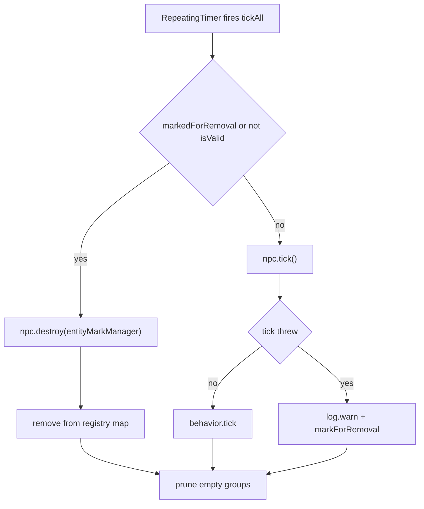
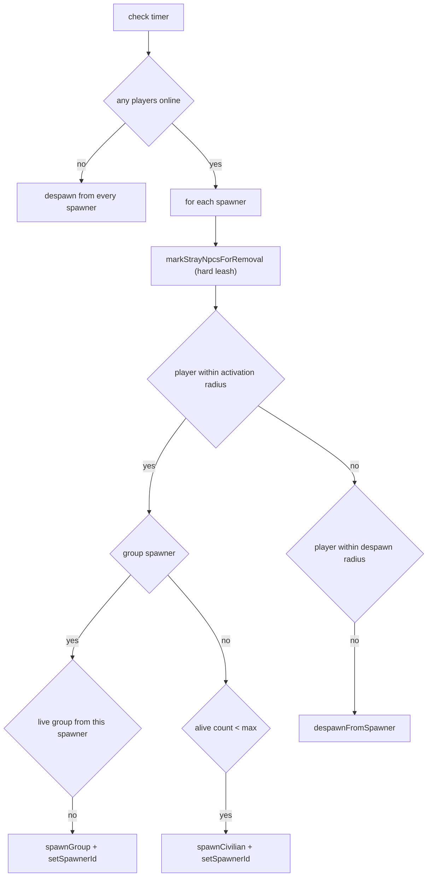
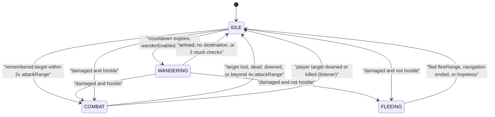
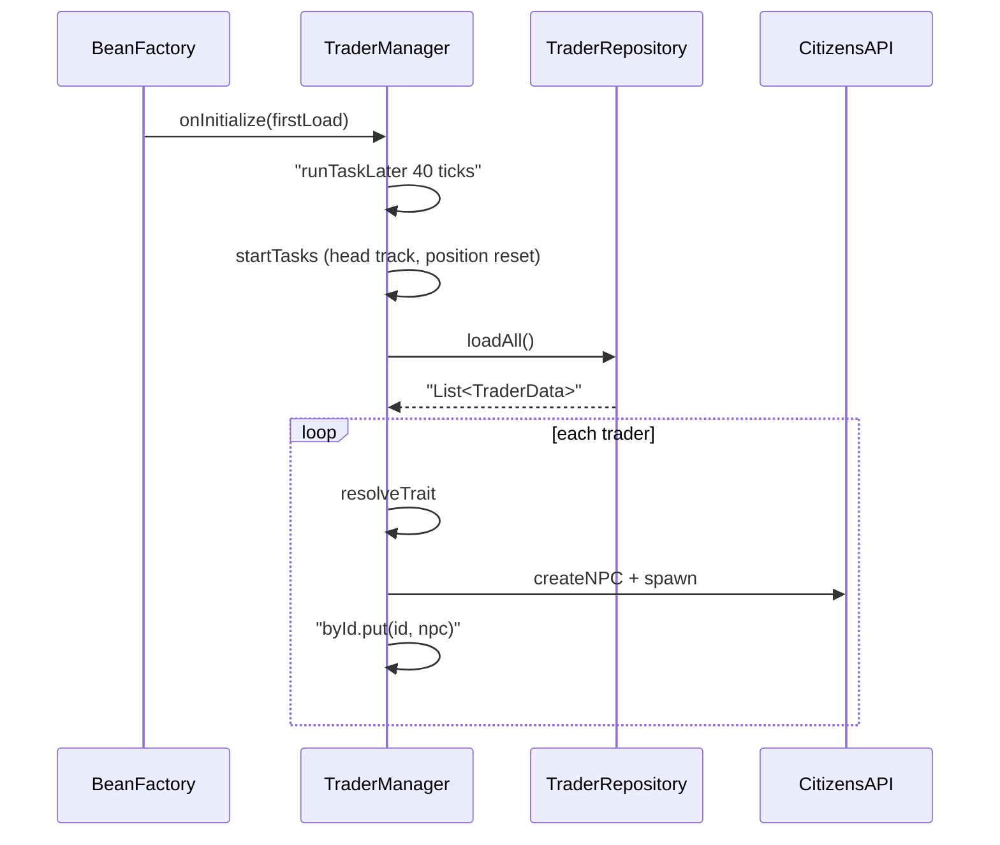
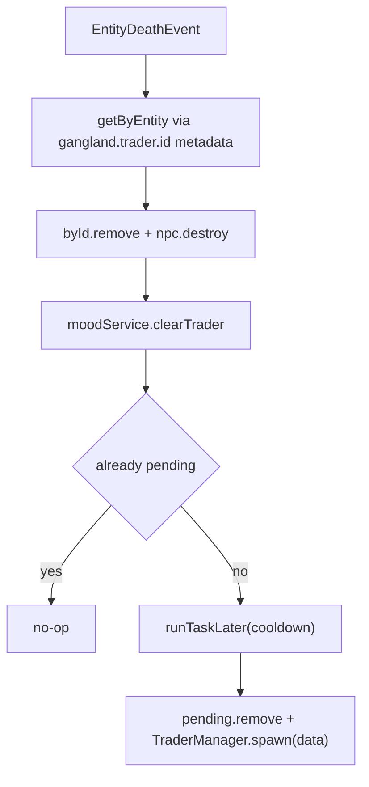
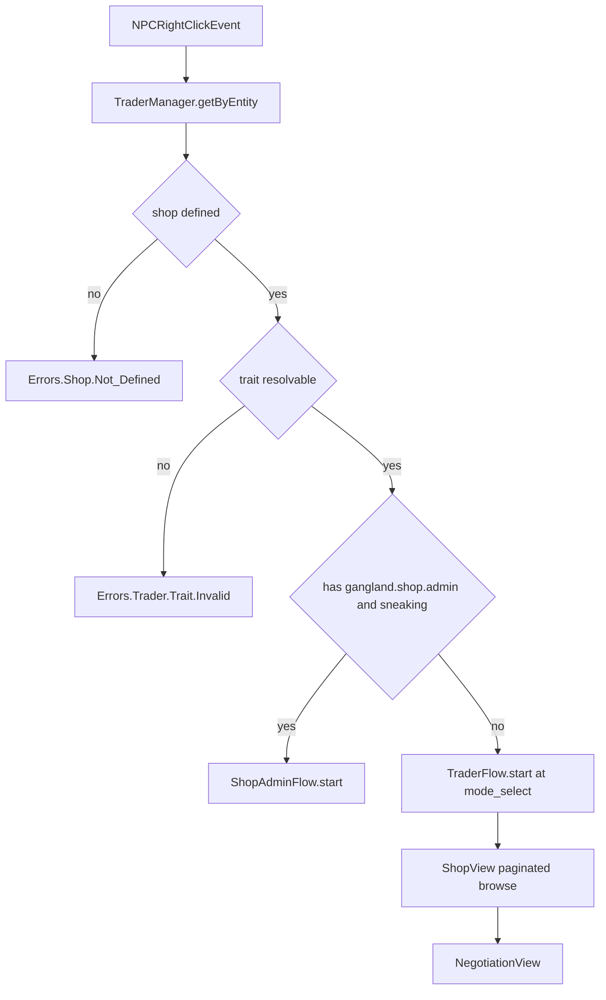
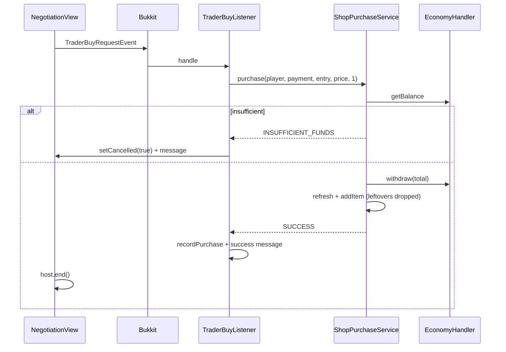
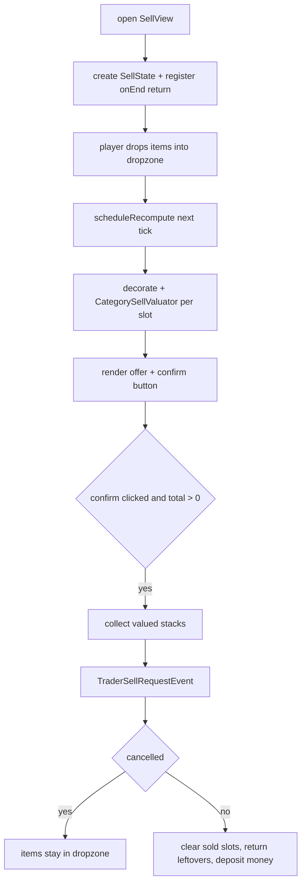
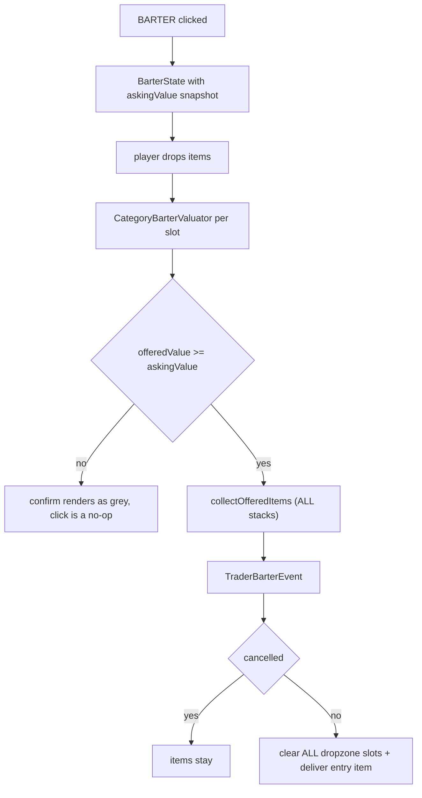
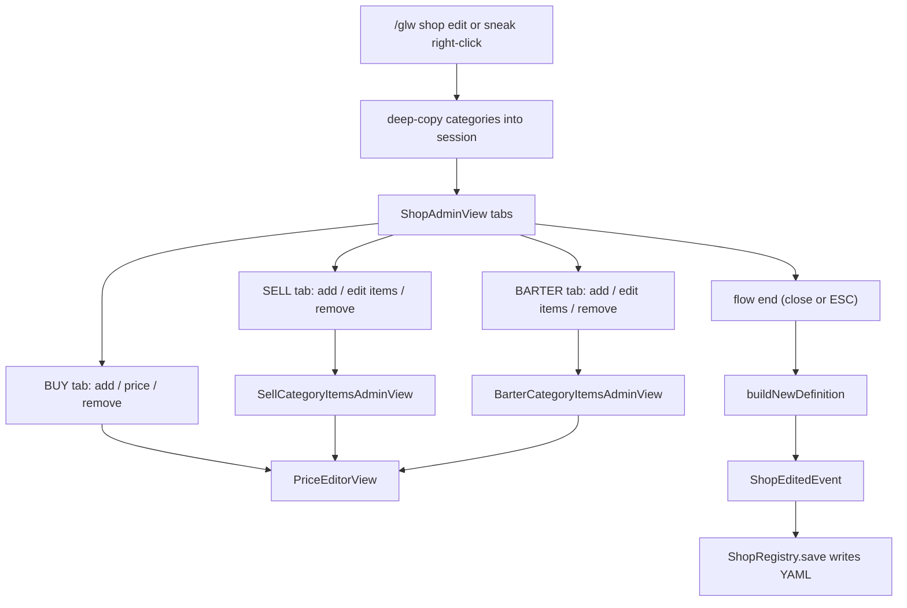

# Civilians, Traders & Shops

<!-- preface:start -->
> **How to use this file.** This is a code-traced audit of *Civilians, Traders & Shops* in Gangland Warfare, taken on
> 2026-09-02 from branch `0.8.1` (Keystone 1.7.3). It describes what the code **does today**, workflow by workflow,
> so an agent can fix a bug, tweak behaviour, plan a feature, or write tests without re-tracing the system.
>
> - **Citations are pointers, not proof.** Every `File.java:line` was checked after writing, but the code moves.
>   Before you change anything, open the cited file and grep the symbol named in the sentence; trust the class and
>   method names over the line number. A citation ending in `:line-unverified` could not be re-located.
> - **Observations are findings, not confirmed bugs.** Each row carries the tracer's confidence. Rows prefixed
>   `WITHDRAWN:` were disproved during verification and are kept only so the numbering stays stable. Reproduce a
>   High-risk row in code (or a test) before fixing it.
> - **Sections.** *Components* names the classes; *Configuration & Data* the YAML keys, tables and message keys;
>   *Workflows* (`W1`, `W2`, …) the execution paths with trigger, steps, diagram, persistence effects and guards;
>   *Cross-feature Dependencies* what breaks elsewhere if you change this; *Test Surface* what can be unit-tested
>   with plain JUnit/Mockito versus what needs Bukkit/Keystone mocks or a live server.
> - **Conventions live elsewhere.** For *how* to add or change code in this repo, follow `CLAUDE.md` at the repo
>   root (Spigot-only APIs, method-brace style, Keystone at provided scope, the SQLite test teardown rules), the
>   `command-create` and `panel-create` skills for new commands and GUI panels, and the feedback rules in the
>   project memory (YAML key style, `SoundEffect` for sounds, `ItemRefresher` per item type, `setDataSupplier`
>   for every repository, no Paper APIs).
> - **Risk stars** on the rendered page: three stars = High (a player can hit it in normal play), two = Medium
>   (situational), one = Low (cosmetic or unlikely).

Rendered page with diagrams and a table of contents: https://claude.ai/code/artifact/dad8da79-b977-4cdc-9712-e080406cb0b5
<!-- preface:end -->

> Diagrams below are Mermaid source; the rendered version with drawn diagrams is the linked page above.

## Overview

Civilians are Citizens-backed ambient NPCs defined in `npc/civilians.yml` (types + groups), spawned either manually via
`/glw civilian spawn` or automatically by persisted proximity spawners, and driven by a four-state AI machine
(IDLE / WANDERING / FLEEING / COMBAT) ticked from a single `RepeatingTimer` in `CivilianService`. Traders are a
completely separate NPC kind: one Citizens PLAYER NPC per row in the `trader` database table, each carrying a shop key
and a trait id; they head-track players, reset position, and respawn on a timer after being killed. Shops are per-shop
YAML files under `plugins/<plugin>/shop/`, loaded by `ShopRegistry` (a Keystone `FolderLoader`) into `ShopDefinition`
objects holding buy entries, sell categories and barter categories. Right-clicking a trader opens a
`MultiPanelInventory` flow (mode select → shop browser → negotiation → quantity / sell / barter), while a sneaking
admin with `gangland.shop.admin` gets the shop-admin flow instead. Money always moves through the `PaymentHandler`
adapter implemented in `gangland-impl`; every user-facing string routes through `ShopMessageContract` /
`TraderMessageContract`. Barter is a pure item-for-item swap with no economy involvement, and trader mood is
positive-only (0.0 … 1.0) and never persisted.

## Components

| Class | Location | Role |
| --- | --- | --- |
| `CivilianService` | `gangland-features/cops-n-crooks/src/main/java/org/luckyraven/gangland/copsncrooks/npc/civilian/CivilianService.java` | Owns the AI tick timer + proximity-spawner timer; group spawning; shutdown |
| `CivilianNpcRegistry` | `…/npc/civilian/CivilianNpcRegistry.java` | Dependency-free store of active NPCs (by entity UUID) and groups |
| `CivilianNpc` | `…/npc/civilian/npc/CivilianNpc.java` | Per-NPC state machine host, entity target queue, equipment |
| `CivilianNpcFactory` | `…/npc/civilian/npc/CivilianNpcFactory.java` | Creates the Citizens NPC, applies health/speed bonuses, weapons, ammo |
| `CivilianGroup` | `…/npc/civilian/CivilianGroup.java` | Group membership, group center, stray detection |
| `CivilianSpawnManager` | `…/npc/civilian/spawn/CivilianSpawnManager.java` | `EntitySpawner<CivilianSpawner>` subclass — spawner CRUD + spawn calls |
| `CivilianSpawner` | `…/npc/civilian/spawn/CivilianSpawner.java` | Persisted spawn point (`typeId` xor `groupId`, both may be null) |
| `CivilianIdle/Wander/Flee/CombatBehavior` | `…/npc/civilian/state/behavior/*.java` | The four AI states |
| `CivilianLookController` | `…/npc/civilian/state/behavior/CivilianLookController.java` | Ambient head-turning via `entity.teleport(rotated)` |
| `CiviliansLoader` / `YamlCiviliansConfigProvider` | `…/npc/civilian/config/` | Parse `civilians.yml` into `CiviliansConfig` |
| `CivilianDamageListener` / `CivilianDeathListener` | `…/listener/civilian/` | Damage → flee/combat; death → drops + `CivilianDeathEvent` |
| `CivilianDeathRewardListener` | `gangland-impl/src/main/java/org/luckyraven/gangland/listener/npc/CivilianDeathRewardListener.java` | XP reward + wanted-level increment |
| `TraderManager` | `…/npc/trader/TraderManager.java` | Trader registry, spawn/remove/retarget, head-track + position-reset tasks |
| `TraderNpc` / `TraderData` | `…/npc/trader/` | Citizens wrapper + persisted row model |
| `TraderTraitRegistry` / `TraderTraitsLoader` | `…/npc/trader/trait/` | `trader_traits.yml` → `TraderTraitDefinition` map (atomic swap) |
| `MoodService` / `MoodState` | `…/npc/trader/mood/` | In-memory per-(trader, player) mood 0..1 and price multiplier |
| `TraderRespawnService` | `…/npc/trader/respawn/TraderRespawnService.java` | Delayed respawn after a trader is killed |
| `ShopViewOpenerImpl` | `…/npc/trader/ShopViewOpenerImpl.java` | Resolves shop + trait, routes to admin flow or trader flow |
| `TraderFlow` / `TraderFlowSession` | `…/npc/trader/view/` | Panel host + shared mutable session for the player flow |
| `ModeSelectView`, `ShopView`, `NegotiationView`, `QuantitySelectorView`, `SellView`, `BarterView` | `…/npc/trader/view/` | The six player-facing panels |
| `TraderInteractListener` / `TraderDamageListener` | `…/listener/trader/` | `NPCRightClickEvent` → open flow; `EntityDeathEvent` → kill handling |
| `TraderSellSessionListener` / `BarterSessionListener` | `…/listener/trader/` | Global click/drag bridges into the drop-zone panels |
| `ShopRegistry` | `gangland-ui/shop-api/src/main/java/org/luckyraven/gangland/shop/ShopRegistry.java` | Folder scan, in-memory shop map, create/save/delete |
| `ShopYamlReader` / `ShopYamlWriter` | `…/shop/io/` | On-disk format |
| `ShopDefinition`, `ShopItemEntry`, `SellCategory`, `BarterCategory`, `EntryKind` | `…/shop/` | Model |
| `ShopPurchaseService`, `ShopSellService`, `ShopBarterService` | `…/shop/transaction/` | Money + delivery mutations, outcome records |
| `PaymentHandler` / `PaymentException` | `…/shop/transaction/` | Economy abstraction (implemented anonymously in the impl listeners) |
| `CategorySellValuator` / `CategoryBarterValuator` | `…/shop/valuation/` | Item → `ItemValuation` using category templates + `sell_price` NBT |
| `ShopAdminFlow` / `ShopAdminFlowSession` | `…/shop/view/` | Admin panel host, working copies, persist-on-end |
| `ShopAdminView`, `PriceEditorView`, `SellCategoryItemsAdminView`, `BarterCategoryItemsAdminView` | `…/shop/view/` | The four admin panels |
| `ShopEditPersistenceHandler` | `…/shop/handler/` | `ShopEditedEvent` → `ShopRegistry.save` |
| `ShopConfig` | `gangland-impl/src/main/java/org/luckyraven/gangland/config/ShopConfig.java` | All shop/trader bean wiring (CONFIG phase) |
| `TraderSettingsImpl`, `GanglandShopMessages`, `GanglandTraderMessages`, `GanglandTraderEconomy`, `GanglandShopDisplayResolver` | `gangland-impl/…/file/configuration/{shop,copsncrooks}/` | Contract implementations |
| `TraderRepository` / `TraderTable` | `gangland-impl/…/database/{repositories,tables}/trader/` | Persistence for traders |
| `CivilianSpawnerRepository` / `CivilianSpawnerTable` | `gangland-impl/…/database/{repositories,tables}/copsncrooks/` | Persistence for civilian spawners |

## Configuration & Data

### YAML files and notable keys

**`gangland-impl/src/main/resources/npc/civilians.yml`** (loaded by `CiviliansLoader` → `YamlCiviliansConfigProvider`):

- `Default_Entities.Civilian` / `.Police` — entity-type name lists used for wanted classification.
- `Types.<id>`: `Display_Name`, `Entity_Type` (falls back to `VILLAGER` on an unknown name,
  `YamlCiviliansConfigProvider.java:260`), `Health`, `Hostile`, `Wearables.{Helmet,Chestplate,Leggings,Boots}`,
  `Item_Pool`, `Weapon_Pool`, `Drops.{Experience,Items}`, `AI.Wander.{Enabled,Range}`,
  `AI.Flee_On_Damage.{Enabled,Flee_Range}`, `AI.Combat.{Enabled,Attack_Damage,Attack_Range,Attack_Interval_Ticks,Difficulty}`.
- Drop entries support a trailing `@<chance>` suffix parsed at `YamlCiviliansConfigProvider.java:177-191`
  (clamped to 0..1; unparseable suffix → whole string kept as the entry with chance 1.0).
- `Weapon_Pool` entries prefixed `weapon:` go to `weaponNamePool`; **any other entry is added to BOTH
  `weaponNamePool` and `weaponPool`** (`YamlCiviliansConfigProvider.java:83-89`).
- `Groups.<id>`: `Display_Name`, `Hostile`, `Health_Bonus`, `Speed_Bonus`, `Stay_Together_Range`,
  `Members.<typeId>: <count>`.
- **`Item_Pool` is parsed into `CivilianTypeConfig.itemPool()` but never read anywhere in the codebase** (grep for
  `itemPool()` returns nothing) — dead config despite being documented in the file header.

**`gangland-impl/src/main/resources/npc/trader_traits.yml`** (loaded by `TraderTraitsLoader`): one top-level key per
trait id with `Display_Name`, `Mood_Per_Tip_Currency`, `Mood_Per_Purchase`, `Min_Friend_Discount` (clamped 0..1),
`Allows_Barter`, `Sell_Price_Ratio`, `Barter_Price_Ratio` (defaults to `Sell_Price_Ratio`), `Max_Health`,
`Invulnerable` (default `true`). Ships 6 traits; `stubborn` is the only killable one.

**`settings.yml`** — every key below is read in `Settings.java`:

- `Civilians.Behaviour.{Enabled, AI_Tick_Rate}` (`Settings.java:540-541`)
- `Civilians.Spawner_Proximity.{Activation_Radius, Despawn_Radius, Max_Npcs_Per_Spawner, Npc_Soft_Leash_Radius,
  Npc_Hard_Leash_Radius, Check_Interval, Default_Type_Id}` (`Settings.java:543-549`)
- `Civilians.Spawn.*` — 13 keys consumed by the shared `EntitySpawner` location search (`Settings.java:551-563`)
- `NPC_Navigation.*` — shared with cops, surfaced to civilians through `CivilianNavigationConfig.from(...)`
- `Trader.{Respawn_Cooldown, Head_Track_Radius, Fallback_Trait_Id, Max_Mode_Multiplier, Tip_Amount}` and
  `Trader.Sell.{Max_Offer_Slots, Mood_Per_Sale}` (`Settings.java:710-717`)
- Shop UI reuses the global `Inventory_Fill_Name` / `Inventory_Fill_Item` through `ShopUiSettings`.

**Shop files** — `plugins/<plugin>/shop/<key>.yml`, one per shop. No shop file ships in the jar; the folder starts
empty and `/glw shop create <key>` writes the first one. Format written by `ShopYamlWriter.write`:
`Title`, `Size`, `Buy_Entries` (list of `{Slot, Item, Price}`), `Sell_Entries` (same shape), `Sell_Categories` and
`Barter_Categories` (lists of `{Id, Display_Name, Base_Price, Items}` where `Items` is a list of Bukkit-serialized
`ItemStack`s). `Price` and `Base_Price` are written as plain strings; the reader accepts Number, BigDecimal or String
(`ShopYamlReader.java:44-53`). `ShopYamlWriter.clearRoot` nulls every root key before writing, so **comments and any
foreign keys in a shop file are destroyed on every save**.

Reader validation: `Size` must be a positive multiple of 9 ≤ 54 else it silently becomes 54
(`ShopYamlReader.java:71-74`); an entry is skipped if the item is null, the slot is `< 0`, or the price is absent
(`ShopYamlReader.java:272-290`). **There is no upper bound check on `Slot` versus `Size`.**

### Database tables and repositories

| Table | Class | Columns | Repository | Data supplier |
| --- | --- | --- | --- | --- |
| `trader` | `TraderTable` | `id` (PK, String), `shop_key`, `world`, `x`, `y`, `z`, `yaw`, `pitch`, `display_name` (nullable), `trait_id` | `TraderRepository` (`@Repository(TraderData.class)`) | `TraderManager` constructor calls `repository.setDataSupplier(this::snapshotData)` (`TraderManager.java:57`) |
| `civilian_spawner` | `CivilianSpawnerTable` | id, world/x/y/z, `typeId`, `groupId` | `CivilianSpawnerRepository` | `EntitySpawner` constructor calls `repository.setDataSupplier(spawners::values)` (`EntitySpawner.java:40`) |

`TraderRepository.doLoadAll` (`TraderRepository.java:34-60`) rebuilds a `Location` from `Bukkit.getWorld(worldName)`
without a null check, so a trader stored in an unloaded/renamed world produces a `Location` with a `null` world.

Civilian NPCs themselves are **not persisted** — only their spawn points are. Shops are not in the DB at all.

### Message keys / localization

All keys referenced by `GanglandShopMessages` / `GanglandTraderMessages` and the commands exist in
`gangland-impl/src/main/resources/message/message_en.yml` (verified for `Commands.Shop.*`, `Errors.Shop.*`,
`Commands.Trader.*`, `Errors.Trader.*`, `Commands.Civilian.*`, `Civilian.Spawner_List_Header`).

`Messages.SHOP_PURCHASE_INVENTORY_FULL` (`Errors.Shop.Purchase.Inventory_Full`, `message_en.yml:512`) exists in both
the enum and the YAML but **is never sent** — `PurchaseOutcome.INVENTORY_FULL` is never produced by
`ShopPurchaseService`, and `TraderBuyListener.java:97-99` handles the branch with an empty body.

Hard-coded English strings that bypass the Messages layer live in the anvil callbacks
(`QuantitySelectorView.java:277/283/288`, `PriceEditorView.java:249/255/282/287`, `ShopAdminView.java:410/416/447/453`)
and in `ShopListCommand.java:30`.

## Commands & Permissions

Permissions are derived by Keystone as `gangland.command.<label>` (`Keystone Command.java:49`). The `user` flag
(3rd ctor arg) means "player-only".

| Command | Class | Permission | What it does |
| --- | --- | --- | --- |
| `/glw civilian` | `CivilianCommand` (`user=false`) | `gangland.command.civilian` | Help page |
| `/glw civilian list` | `CivilianListCommand` | same | Lists active civilian NPCs |
| `/glw civilian groups` | `CivilianGroupsCommand` | same | Lists active civilian groups |
| `/glw civilian spawn <typeId>` | `CivilianSpawnCommand` | same | `spawnNearLocation(player, typeId)` — uses the shared surface search |
| `/glw civilian spawngroup <groupId>` | `CivilianSpawnGroupCommand` | same | `CivilianService.spawnGroup` at the sender's location |
| `/glw civilian spawner set` | `CivilianSpawnerSetCommand` | same | Registers a spawner (with optional pinned type) |
| `/glw civilian spawner setgroup <groupId>` | `CivilianSpawnerSetGroupCommand` | same | Registers a group spawner |
| `/glw civilian spawner remove <id>` | `CivilianSpawnerRemoveCommand` | same | `EntitySpawner.removeSpawner` + repo delete |
| `/glw civilian spawner list` | `CivilianSpawnerListCommand` | same | Lists spawner ids/locations |
| `/glw civilian spawner info <id>` | `CivilianSpawnerInfoCommand` | same | Shows typeId/groupId/location |
| `/glw civilian spawner teleport <id>` | `CivilianSpawnerTeleportCommand` | same | Teleports to the spawner |
| `/glw shop` (alias `shops`) | `ShopCommand` (`user=true`) | `gangland.command.shop` | Help page |
| `/glw shop create <key>` | `ShopCreateCommand` | same | Validates `[a-z0-9_]+`, `ShopRegistry.createEmpty` |
| `/glw shop edit <key>` | `ShopEditCommand` | same | Opens `ShopAdminFlow` |
| `/glw shop list` | `ShopListCommand` | same | Lists keys |
| `/glw shop remove <key>` | `ShopRemoveCommand` | same | `ShopRegistry.delete` (deletes the file) |
| `/glw shop title <key>` | `ShopTitleCommand` | same | AnvilGUI rename → `save(def.withTitle(...))` |
| `/glw trader` (alias `traders`) | `TraderCommand` (`user=true`) | `gangland.command.trader` | Help page |
| `/glw trader create <shopKey> <traitId> [displayName]` | `TraderCreateCommand` | same | Validates shop + trait, `TraderManager.create` at the player's location |
| `/glw trader edit shop <shopKey>` | `TraderEditShopCommand` | same | Ray-traced trader → `retargetShop` (clears mood) |
| `/glw trader edit trait <traitId>` | `TraderEditTraitCommand` | same | → `retargetTrait` (clears mood) |
| `/glw trader edit name` | `TraderEditNameCommand` | same | AnvilGUI → `rename` |
| `/glw trader remove` | `TraderRemoveCommand` | same | Ray-traced trader → `TraderManager.remove` |
| (GUI gate) sneak + right-click trader | `ShopViewOpenerImpl.java:41` | `gangland.shop.admin` | Opens the admin editor instead of the buy flow; registered with `PermissionManager` in `ShopConfig.registerPermissions` |

`commands.json` has entries for every leaf listed above, plus root entries `shop` and `trader`, but **no root
`civilian` entry** (only `civilian_help`) — `commands.json:702` onwards.

## Events

| Event | Fired by | Handled by | Purpose |
| --- | --- | --- | --- |
| `CivilianDeathEvent` (not `Cancellable`) | `CivilianDeathListener.java:67` | `CivilianDeathRewardListener` (gangland-impl) | XP reward + wanted-level increment |
| `PlayerDownedEvent`, `PlayerDeathEvent` | gangland-core / Bukkit | `CivilianDamageListener.java:96-104` | Clears civilian combat targets |
| `EntityDamageByEntityEvent` | Bukkit | `CivilianDamageListener.java:38` | Triggers FLEEING / COMBAT |
| `EntityDeathEvent` | Bukkit | `CivilianDeathListener.java:36`, `TraderDamageListener.java:21` | Civilian drops; trader kill → respawn schedule |
| `NPCRightClickEvent` (Citizens) | Citizens | `TraderInteractListener.java:22` | Opens the trader flow |
| `TraderBuyRequestEvent` (Cancellable) | `NegotiationView.java:136`, `QuantitySelectorView.java:248` | `TraderBuyListener` | Payment + delivery + mood |
| `TraderSellRequestEvent` (Cancellable) | `SellView.java:353` | `TraderSellListener` | Deposit + mood |
| `TraderBarterEvent` (Cancellable) | `BarterView.java:365` | `TraderBarterListener` | Item swap + mood |
| `ShopEditedEvent` (not Cancellable) | `ShopAdminFlow.java:49` (on flow end) | `ShopEditPersistenceHandler` | Persists the edited definition |
| `InventoryClickEvent` / `InventoryDragEvent` | Bukkit | `TraderSellSessionListener`, `BarterSessionListener`, `ShopAdminListener`, `SellCategoryAdminListener`, `BarterCategoryAdminListener` | Drop-zone and template-add bridges |

## Workflows

### W1: Civilian AI tick loop

**Trigger:** `RepeatingTimer` started at bean initialize, period = `Civilians.Behaviour.AI_Tick_Rate` (default 20 ticks).

**Steps:**
1. `CivilianService.onInitialize` (`…/CivilianService.java:59`) — reads `civiliansLoader.getLoadedConfig()`; if
   `isCivilianAiEnabled()` is false it returns immediately and **neither timer is started** (so proximity spawning is
   also disabled by the AI toggle).
2. `new RepeatingTimer(plugin, tickRate, 0, timer -> tickAll()); tickTimer.start(false)` (`CivilianService.java:68-69`)
   — synchronous, as required for Bukkit entity APIs.
3. `CivilianService.tickAll` (`CivilianService.java:309`) iterates `registry.npcMap().entrySet().removeIf(...)`:
   marked-for-removal or invalid NPCs get `npc.destroy(entityMarkManager)` and are dropped from the map; otherwise
   `npc.tick()` runs inside a try/catch that marks the NPC for removal on exception.
4. `CivilianNpc.tick` (`…/npc/CivilianNpc.java:153`) — `isValid()` gate, cross-world check against
   `spawnLocation.getWorld()`, `decrementAttackCooldown()`, `updateNavigationProgress()`, then delegates to
   `behaviors.get(currentState).tick(this)`.
5. Empty groups are pruned at `CivilianService.java:331-335`.

**Diagram:**

**State & persistence effects:** in-memory only (registry map, per-NPC behavior counters, Citizens navigation).
No DB or file writes.

**Edge cases & guards observed:** exceptions in one NPC never abort the loop; a civilian teleported to another world
is removed rather than leaked; `destroy` is wrapped in try/catch on both the tick and shutdown paths.

### W2: Civilian proximity spawner tick

**Trigger:** second `RepeatingTimer`, period = `Civilians.Spawner_Proximity.Check_Interval` (default 100 ticks).

**Steps:**
1. `CivilianService.tickProximitySpawners` (`CivilianService.java:192`). If **no players are online** every spawner is
   passed to `despawnFromSpawner` and the method returns (`CivilianService.java:194-197`).
2. Radii are squared once per cycle from `CivilianSettings`.
3. Per spawner: `markStrayNpcsForRemoval(id, spawnerLoc, hardLeashSq)` (`CivilianService.java:268`) marks any NPC in a
   different world or beyond `Npc_Hard_Leash_Radius` for removal so its cap slot frees.
4. Player scan: the loop `break`s on the first player inside `Activation_Radius`; otherwise it records whether anyone
   is inside `Despawn_Radius`.
5. Activation branch:
   - group spawner (`getGroupId() != null`): spawn one group only if no live group carries this `spawnerId`
     (`CivilianService.java:230-239`), then `group.setSpawnerId(...)`.
   - type spawner: count live NPCs with this `spawnerId`, and if `< Max_Npcs_Per_Spawner`, spawn one of
     `spawner.getTypeId()` or `Default_Type_Id`; a blank id skips the spawner (`CivilianService.java:248-256`).
6. Else if nobody is within `Despawn_Radius`: `despawnFromSpawner(id)` marks both individual NPCs and group members
   for removal — actual destruction happens on the next `tickAll`.

**Diagram:**

**State & persistence effects:** registry mutation only; spawner rows themselves are untouched.

**Edge cases & guards observed:** spawners whose world is unloaded are skipped (`spawnerLoc.getWorld() == null`);
manually spawned civilians have a `null` `spawnerId` and are therefore never despawned by this loop;
`markStrayNpcsForRemoval` dereferences `Objects.requireNonNull(npcLoc.getWorld())` (`CivilianService.java:276`).

### W3: Civilian group spawn & cohesion

**Trigger:** `/glw civilian spawngroup <id>` or a group spawner activating.

**Steps:**
1. `CivilianService.spawnGroup` (`CivilianService.java:128`) resolves `CivilianGroupConfig`; unknown group → warn + null.
2. For every `Members` entry it resolves the type config (unknown type logs and is skipped) and calls
   `npcFactory.createCivilian(location, typeConfig, groupId, groupConfig)` `count` times; each NPC gets
   `setGroup(group)` and is added to the group.
3. If at least one member spawned: `registry.registerGroup(group)` (key = `groupId + "_" + System.nanoTime()`), and
   **registration of the individual NPCs is deferred one tick** via `runTaskLater(..., 1L)` so Citizens finishes entity
   init (`CivilianService.java:162`).
4. `CivilianNpcFactory.createCivilian` (`…/npc/CivilianNpcFactory.java:83`): creates the Citizens NPC with
   `setProtected(false)`, `SHOULD_SAVE=false`, `USE_MINECRAFT_AI=false`, spawns it, destroys it and returns null if
   `!npc.isSpawned()`, tags it `EntityMark.CIVILIAN`, builds a fresh behavior map, applies
   `health + groupConfig.healthBonus` via `Attribute.MAX_HEALTH`, picks a gangland weapon from `weaponNamePool`
   (`resolveGanglandWeapon`, random start index with wrap-around), gives 3 magazines of ammo in the off-hand with all
   drop chances zeroed, calls `equip()`, and sets `speedModifier = 1 + speedBonus`.
5. Cohesion: while WANDERING, `CivilianWanderBehavior.navigateToDestination` (`…/behavior/CivilianWanderBehavior.java:96`)
   first checks `group.isMemberStraying(npc)` and navigates to `group.getGroupCenter()` if so.

**State & persistence effects:** registry + Citizens NPC registry (non-persistent). No DB writes.

**Edge cases & guards observed:** members spawned but not yet registered (1-tick window) do not tick and are invisible
to `getActiveNpcs()`; `getGroupCenter` returns null when no member is valid; `isMemberStraying` returns false across
worlds.

### W4: Civilian state machine

**Trigger:** `CivilianNpc.transitionTo` from behaviors, listeners, or the tick loop.

**Steps:**
1. `transitionTo` (`CivilianNpc.java:129`) logs, returns if the state is unchanged, updates `wantedByPolice` for
   hostile NPCs (`true` only while in COMBAT), calls `oldBehavior.onExit`, swaps state, calls `newBehavior.onEnter`.
2. **IDLE** (`CivilianIdleBehavior`): random 40–100 tick idle countdown and 15–35 tick look countdown. Each tick it
   re-engages a remembered player target within `attackRange * 2` (clearing it if the player is offline), then a
   remembered entity target within the same range, then does ambient look-around, then on countdown expiry rolls
   70% → WANDERING when `wanderEnabled`, else re-rolls the countdown.
3. **WANDERING** (`CivilianWanderBehavior`): `onEnter` resets counters and navigates. Each tick: ambient look;
   re-navigate when the navigator is idle; a 60–120 tick redirect countdown picks a new destination mid-path; when
   `isNavigationStuck()` fires 3 times it stops navigation and returns to IDLE. Destination priority is
   group-center → spawn point (when beyond `Npc_Soft_Leash_Radius`) → `findForwardWanderDestination(min 3, max 8)`;
   a null destination transitions to IDLE. `onExit` stops navigation.
4. **FLEEING** (`CivilianFleeBehavior`): `onEnter` captures `lastAttackerLocation` and navigates to a point
   `fleeRange` blocks directly away (arbitrary +X direction if the attacker is on top of it), snapped to
   `world.getHighestBlockYAt`. Every 20 ticks it returns to IDLE if navigation ended or is hopeless, or if it has
   travelled `fleeRange` from the origin. `onExit` clears `lastAttackerLocation`.
5. **COMBAT** (`CivilianCombatBehavior`): resolves target as entity-queue-head first, then remembered player (skipping
   dead/downed players via `DownedPlayerRegistry`). No target → IDLE. Beyond `attackRange * 4` → clear targets + IDLE.
   Otherwise pursue (`resolvePursuitLocation`, or `resolveHopelessFallbackLocation` when navigation is hopeless) or
   `pauseNavigation()` when holding position, and attack only when in range, off cooldown, **and** line-of-sight holds.
   `onExit` stops navigation but deliberately preserves targets so IDLE can re-engage.

**Diagram:**

**State & persistence effects:** none outside the NPC instance.

**Edge cases & guards observed:** `cleanupTransientState` (`CivilianNpc.java:218`) clears the entity queue, resets
`wantedByPolice` and calls `onExit` on the current behavior when the NPC is destroyed. `transitionTo` logs *before*
the no-op equality check, so repeated same-state transitions still emit debug lines.

### W5: Civilian damage → flee / combat

**Trigger:** `EntityDamageByEntityEvent` (MONITOR, `ignoreCancelled = true`).

**Steps:**
1. `CivilianDamageListener.onCivilianDamage` (`…/listener/civilian/CivilianDamageListener.java:38`) — looks the
   damaged entity up in the registry by UUID; non-civilians return.
2. Player attacker (direct or via projectile, excluding Citizens NPCs disguised as players):
   hostile + `combatEnabled` → `setTargetPlayerId` + COMBAT; non-hostile + `fleeEnabled` → capture the attacker
   location and FLEEING.
3. Non-player `LivingEntity` attacker (cop, another civilian, or its projectile): hostile → `addEntityTargetToFront`
   (attacker jumps the queue) + COMBAT; non-hostile → FLEEING.
4. `PlayerDownedEvent` / `PlayerDeathEvent` → `clearCivilianTargets(uuid)` transitions every civilian targeting that
   player to IDLE (`CivilianDamageListener.java:106-112`).

**State & persistence effects:** none persisted.

**Edge cases & guards observed:** a hostile civilian with `combatEnabled=false` and a non-hostile with
`fleeEnabled=false` silently ignore damage. `clearCivilianTargets` transitions to IDLE but **does not clear
`targetPlayerId`**, so IDLE's re-engage check will immediately re-enter COMBAT once the respawned player comes within
`attackRange * 2`.

### W6: Civilian death → drops, XP, wanted level

**Trigger:** `EntityDeathEvent` (MONITOR, `ignoreCancelled = true`).

**Steps:**
1. `CivilianDeathListener.onCivilianDeath` (`…/listener/civilian/CivilianDeathListener.java:36`) — registry lookup;
   non-civilians return.
2. Vanilla drops and XP are cleared; for PLAYER-type NPCs the event is also a `PlayerDeathEvent` and
   `setKeepInventory(true)` suppresses the NMS inventory dump (`CivilianDeathListener.java:48-50`).
3. Each configured drop is rolled independently (`chance < 1.0 && random.nextDouble() >= chance` skips) and resolved
   through `ItemParser`; resolved stacks are added to `event.getDrops()`.
4. `CivilianDeathEvent(npc, killer, dropConfig.experience())` is fired.
5. `npc.markForRemoval()` — the tick loop destroys the Citizens NPC on the next pass.
6. `CivilianDeathRewardListener` (gangland-impl) adds level XP when `experience > 0`, then **increments the killer's
   wanted level unless the victim was hostile *and* currently in COMBAT** (`CivilianDeathRewardListener.java:47-49`).

**State & persistence effects:** user level/XP and wanted level mutate through `UserManager` (persisted by the user
repository autosave).

**Edge cases & guards observed:** `itemParser` may be null in the listener, in which case every configured drop
resolves to null and nothing drops. `CivilianDeathEvent` is not `Cancellable`, so the listener's
`ignoreCancelled = true` has no effect.

### W7: Trader startup spawn and creation

**Trigger:** bean initialize, or `/glw trader create`.

**Steps:**
1. `TraderManager.onInitialize` (`TraderManager.java:67`) schedules `spawnAllFromRepository` **40 ticks later** and
   starts the head-track (period 2) and position-reset (period 20) tasks.
2. `spawnAllFromRepository` walks `repository.loadAll()` and calls `spawn(data)` per row.
3. `TraderManager.spawn` (`TraderManager.java:90`) resolves the trait (see W8); a null trait logs a warning and
   aborts. An already-alive trader with the same id is returned unchanged.
4. `TraderNpc.spawn` (`TraderNpc.java:28`) creates a Citizens PLAYER NPC named from `displayName` (or `"Trader"`),
   sets `SHOULD_SAVE=false` and the `gangland.trader.id` metadata key, applies `setProtected(trait.invulnerable())`,
   spawns, then on the living entity sets `setInvulnerable`, `setGravity(false)`, `Attribute.MAX_HEALTH` and health
   from `trait.maxHealth()` (floored at 1).
5. `/glw trader create <shop> <trait> [name]` (`TraderCreateCommand.java:69-89`) validates the shop key against
   `ShopRegistry.exists` and the trait against `TraderTraitRegistry.exists`, then builds a `TraderData` with a random
   UUID at the player's exact location and calls `TraderManager.create` → `repository.save(data)` + `spawn(data)`.

**Diagram:**

**State & persistence effects:** `trader` table row on create; `byId` map; Citizens registry (non-persistent).

**Edge cases & guards observed:** `SHOULD_SAVE=false` is honoured on both trader and civilian NPCs.
`ShopConfig.traderManager` resolves the repository with `repositoryRegistry.getRepository(TraderData.class)` and passes
it straight into the constructor, which immediately calls `setDataSupplier` — a missing repository registration would
NPE at bean construction.

### W8: Trait resolution and trait reload

**Steps:**
1. `TraderTraitsLoader.onInitialize` → `load()` (`TraderTraitsLoader.java:49`) parses every top-level key except
   `Config_Version`; if the parse yields zero traits it **keeps the previous registry** rather than blanking it.
2. `TraderTraitRegistry.replaceAll` swaps an immutable map inside an `AtomicReference` — readers never see a partial
   map.
3. `TraderManager.resolveTrait` (`TraderManager.java:197`) returns the stored trait; otherwise the trait named by
   `Trader.Fallback_Trait_Id` (logging a warning); otherwise `null`, which aborts spawning or shows
   `Errors.Trader.Trait.Invalid` when opening the GUI.
4. `TraderTraitsLoader.onClear` empties the registry during a reload; `onInitialize` refills it.

**Edge cases & guards observed:** `Min_Friend_Discount` is `required()` but defaults to **0.0** when missing
(`TraderTraitsLoader.java:82`), which makes `priceMultiplier` fall to `1 - mood`, i.e. up to a 100% discount at max
mood.

### W9: Trader death and respawn

**Trigger:** `EntityDeathEvent` on a trader entity (only reachable when the trait sets `Invulnerable: false`).

**Steps:**
1. `TraderDamageListener.onTraderDeath` (`…/listener/trader/TraderDamageListener.java:21`) resolves the trader through
   `TraderManager.getByEntity` (Citizens metadata lookup) and calls `onTraderKilled(id)`.
2. `TraderManager.onTraderKilled` (`TraderManager.java:153`) removes the NPC from `byId`, destroys the Citizens NPC,
   **clears all mood state for that trader**, and calls `respawnService.schedule(data, this::spawn)`.
3. `TraderRespawnService.schedule` (`TraderRespawnService.java:25`) guards against duplicate schedules with a
   `pending` set, then `runTaskLater(plugin, …, Respawn_Cooldown * 20)`; the task removes the id from `pending` and
   invokes the callback inside a try/catch.

**Diagram:**

**State & persistence effects:** the trader row is untouched (the trader is only removed from memory), so a restart
before the respawn window elapses re-spawns it anyway. Nothing suppresses the trader's own death drops.

**Edge cases & guards observed:** `TraderRespawnService.cancelAll()` (called from `onClear`) only clears the
`pending` set — the scheduled `BukkitTask` is **not** cancelled and will still run its callback after a reload.

### W10: Trader head-track and position reset

**Steps:**
1. `tickHeadTrack` every 2 ticks (`TraderManager.java:241`): for each alive trader, finds the closest player within
   `Trader.Head_Track_Radius` via `findClosestPlayer(entity.getLocation(), radiusSq)` and calls
   `trader.faceLocation(player.getLocation())` (feet, deliberately, per the comment at `TraderManager.java:252-254`).
2. `tickPositionReset` every 20 ticks: `TraderNpc.resetPosition` teleports the entity back to `spawnLocation` when it
   has drifted more than 0.25 blocks squared.

**Edge cases & guards observed:** `findClosestPlayer` calls `location.getWorld().getPlayers()` without a null check
(`TraderManager.java:280`).

### W11: Mood and price multipliers

**Steps:**
1. `MoodService` keeps `Map<traderId, Map<playerId, MoodState>>` with mood clamped to `[0.0, 1.0]` — there is no
   negative mood by design.
2. `recordTip(amount * trait.moodPerTipCurrency())`, `recordPurchase(trait.moodPerPurchase())`,
   `recordSale(Trader.Sell.Mood_Per_Sale)`.
3. `priceMultiplier = 1.0 + (trait.minFriendDiscount() - 1.0) * mood` (`MoodService.java:38-41`) — 1.0 at mood 0 and
   `minFriendDiscount` at mood 1, so buy prices only ever go down.
4. Sell and barter invert it: `sellMood = 2.0 - buyMultiplier` (`SellView.java:109`, `BarterView.java:104`), so those
   multipliers are always `>= 1.0`.
5. `clearTrader` wipes a trader's whole mood map on kill, shop retarget and trait retarget.

**Edge cases & guards observed:** mood is **never persisted** — a restart resets every relationship.
`BarterView.moodLabel` has `Wary`/`Hostile` branches (`BarterView.java:340-341`) that are unreachable because
`barterMoodMultiplier >= 1.0` always.

### W12: Opening the trader GUI

**Trigger:** `NPCRightClickEvent`.

**Steps:**
1. `TraderInteractListener.onNpcRightClick` (`…/listener/trader/TraderInteractListener.java:22`) → `getByEntity` →
   `viewOpener.openFor(player, trader)`.
2. `ShopViewOpenerImpl.openFor` (`…/npc/trader/ShopViewOpenerImpl.java:28`): `shopRegistry.get(shopKey)`; missing →
   `Errors.Shop.Not_Defined`. `traderManager.resolveTrait`; missing → `Errors.Trader.Trait.Invalid`.
3. If the clicker has `gangland.shop.admin` **and** is sneaking → `adminFlow.start(player, def)` (W18).
4. Otherwise `traderFlow.start(player, trader, def, trait)` (`TraderFlow.java:28`) builds a fresh
   `TraderFlowSession` and a fresh `MultiPanelInventory`, registers the six panels, and opens at `mode_select`.
5. `ModeSelectView` offers BUY (`switchTo shop`), SELL (`switchTo sell`) and Close (`host.end()`).
6. `ShopView.render` (`…/view/ShopView.java:67`) paginates `definition.getBuyEntries()` **28 per page into fixed
   interior slots**, computing `finalPrice = entry.price * moodMultiplier` per entry; clicking an entry stashes
   `selectedEntry`, `basePrice`, `moodMultiplier` on the session and switches to `negotiation`.

**Diagram:**

**Edge cases & guards observed:** `ShopView` ignores each entry's persisted `Slot` and lays entries out sequentially in
`INTERIOR_SLOTS`, so the admin-visible index and the shopper-visible position are the same but the on-disk `Slot`
value is decorative.

### W13: Buy a single copy

**Trigger:** clicking `BUY` in `NegotiationView`.

**Steps:**
1. `NegotiationView.onBuy` (`…/view/NegotiationView.java:132`) plays a sound, recomputes
   `finalPrice = basePrice * moodMultiplier`, fires `TraderBuyRequestEvent(player, trader, entry, finalPrice)`.
2. `TraderBuyListener.onBuyRequest` (`gangland-impl/…/listener/trader/TraderBuyListener.java:53`) resolves the
   `User`, wraps `user.getEconomy()` in an anonymous `PaymentHandler`, and calls
   `purchaseService.purchase(player, payment, entry, price, 1)`.
3. `ShopPurchaseService.purchase` (`…/shop/transaction/ShopPurchaseService.java:32`):
   balance check → `INSUFFICIENT_FUNDS`; `payment.withdraw` failure → `ECONOMY_ERROR`; otherwise, per copy, build
   `refresherRegistry.refresh(entry.getItem(), player)` and `player.getInventory().addItem(delivery)`, dropping any
   leftover **naturally at the player's feet**.
4. Back in the listener: SUCCESS → `moodService.recordPurchase` + `Commands.Shop.Purchase.Success`;
   failures cancel the event and message the player.
5. `NegotiationView.onBuy` closes the flow (`host.end()`) unless the event was cancelled.

**Diagram:**

**State & persistence effects:** economy balance (persisted by the user repository), player inventory, mood map.

**Edge cases & guards observed:** money is debited **before** delivery and the inventory-full case is handled by
dropping items on the ground rather than refunding, so `PurchaseOutcome.INVENTORY_FULL` never occurs.
`finalPrice` is not rounded or scaled — `BigDecimal.valueOf(double multiplier)` can produce long decimal tails that are
charged verbatim.

### W14: Buy N copies (quantity picker)

**Trigger:** `BUY AMOUNT` in `NegotiationView`, only rendered when `entry.getItem().getMaxStackSize() > 1`.

**Steps:**
1. `NegotiationView.onBuyAmount` (`NegotiationView.java:169`) resets `quantityStaged = 1`, `quantityMode = 1` and
   switches to `PANEL_QUANTITY`.
2. `QuantitySelectorView.render` (`…/view/QuantitySelectorView.java:76`) returns to the previous panel when
   `selectedEntry` is null, clamps `quantityStaged` to `[1, 999]` and `quantityMode` to `[1, 8]`, then renders four
   green `+ (i+1)*mode` slots, four mirrored red `- (4-i)*mode` slots, an anvil copies button, a mode row, and
   confirm/cancel.
3. Copies count **copies of the template stack**, not items — the lore repeats `itemsPerCopy = template.getAmount()`
   and `totalItems = itemsPerCopy * copies` throughout.
4. `confirm` (`QuantitySelectorView.java:244`) computes `total = unitPrice * copies` and fires
   `TraderBuyRequestEvent(..., total, copies)`; a cancelled event returns to the previous panel, success resets the
   picker and ends the flow.
5. The anvil detours use `host.suspend()` → `AnvilGUI` → `onClose` → `runTask(host.resume(); host.switchTo(PANEL_QUANTITY))`.

**Edge cases & guards observed:** `MAX_MODE_CYCLE = 8` is hard-coded here, ignoring `ShopUiSettings.getMaxModeMultiplier()`
(which only `PriceEditorView` honours). Non-numeric anvil input is rejected with a hard-coded English message and the
anvil stays open. `ShopPurchaseService` clamps `copies < 1` to 1 defensively.

### W15: Tip

**Steps:**
1. `NegotiationView.onTip` (`NegotiationView.java:146`) calls `economy.tryTip(viewer, settings.getTipAmount())`.
2. `GanglandTraderEconomy.tryTip` (`gangland-impl/…/GanglandTraderEconomy.java:23`): missing user → `ECONOMY_ERROR`;
   balance below the amount → `INSUFFICIENT_FUNDS`; otherwise `withdrawAmount` and `SUCCESS`.
3. On SUCCESS the view plays a sound, calls `moodService.recordTip`, messages `Commands.Trader.Tip.Success`,
   recomputes `session.moodMultiplier` and re-renders so the new price is visible immediately.
4. `ECONOMY_ERROR` only plays a "no" sound — **no message is sent** (`NegotiationView.java:160`).

**State & persistence effects:** economy withdrawal with no counterpart deposit (money is destroyed), mood increase.

### W16: Sell flow (drop zone)

**Trigger:** `SELL` in `ModeSelectView`.

**Steps:**
1. `SellView.render` (`…/view/SellView.java:101`) creates a `SellState` on first entry: `sellMood = 2 - buyMultiplier`,
   drop-zone slots = first `Trader.Sell.Max_Offer_Slots` of a fixed 20-slot list, registers the drop-zone slots as
   free-placement with `handler.setItem(slot, null, true)`, and registers a `host.onEnd` callback that returns any
   uncommitted items.
2. Clicks and drags arrive through the singleton `TraderSellSessionListener` (HIGH priority) which forwards to
   `SellView.handleClick` / `handleDrag`. Clicks inside the drop zone are allowed and schedule a recompute; shift-click
   from the player inventory is intercepted and manually distributed by `tryPlaceInDropzone`; anything else in the top
   inventory is cancelled.
3. `recomputeOffer` (`SellView.java:290`) walks the drop zone, `decorate`s each stack (preserving runtime state) and
   asks `CategorySellValuator.value(definition, stack, trait.sellPriceRatio(), sellMood)`.
   `CategorySellValuator` (`…/valuation/CategorySellValuator.java:24`) finds the first sell category whose template
   matches by `ItemSerializerRegistry.serialize` identity, reads the template's `sell_price` NBT tag (falling back to
   the category `Base_Price`), divides by the template amount to get a per-item price, multiplies by
   `sellPriceRatio * moodMultiplier`, and rounds to 2 dp HALF_UP.
4. `onConfirm` (`SellView.java:334`) collects **only the valued stacks**, fires `TraderSellRequestEvent`, and on a
   non-cancelled event clears exactly those slots, hands back the unvalued leftovers, removes the state and goes back.
5. `TraderSellListener` (`gangland-impl/…/listener/trader/TraderSellListener.java:52`) calls
   `ShopSellService.sell`, which rejects empty/zero-value offers with `NOTHING_VALUED` and otherwise deposits
   `offeredTotal` and reports the item count.

**Diagram:**

**State & persistence effects:** economy deposit, mood increase (`Trader.Sell.Mood_Per_Sale`), player inventory.

**Edge cases & guards observed:** `onBack`, `onClear`, `onConfirm`, the `onEnd` hook and `onShutdown` all route items
back through `returnItemsToPlayer`, which drops overflow at the player's feet. `scheduleRecompute` re-checks
`active.get(viewer) == state` before touching the inventory.

### W17: Barter flow (pure item swap)

**Trigger:** `BARTER` in `NegotiationView` — only rendered when the shop has barter categories **and**
`trait.allowsBarter()`.

**Steps:**
1. `BarterView.render` (`…/view/BarterView.java:97`) mirrors `SellView`: per-player `BarterState`, drop-zone slots,
   `barterMood = 2 - buyMultiplier`, and `askingValue = session.basePrice * session.moodMultiplier` captured once at
   entry.
2. `recomputeOffer` values each stack through `CategoryBarterValuator` using `trait.barterPriceRatio()`; unmatched
   stacks are listed as "not accepted" and contribute 0.
3. `onConfirm` (`BarterView.java:360`) requires `offeredValue >= askingValue`, collects **every** non-air stack in the
   drop zone via `collectOfferedItems`, fires `TraderBarterEvent`, and on a non-cancelled event clears **all**
   drop-zone slots, removes the state and goes back.
4. `TraderBarterListener` calls `ShopBarterService.barter` (`…/shop/transaction/ShopBarterService.java:30`), which
   re-checks the value threshold, clones the offered list into `consumed`, refreshes the entry item and adds it to the
   player's inventory (leftovers dropped at the feet). No money moves at any point.
5. Success records `moodService.recordPurchase` and sends `Commands.Shop.Barter.Success`.

**Diagram:**

**State & persistence effects:** player inventory only. Excess value is explicitly forfeited (the offer lore says so).

**Edge cases & guards observed:** unlike `SellView`, the confirm path does **not** distinguish accepted from
unaccepted stacks — anything sitting in the drop zone is destroyed on confirm.

### W18: Shop definition load and reload

**Trigger:** CONFIG-phase bean creation and every managed reload.

**Steps:**
1. `ShopConfig.shopRegistry` (`gangland-impl/…/config/ShopConfig.java:151`) constructs `ShopRegistry` and immediately
   calls `initialize()`.
2. `ShopRegistry.initialize` (`…/shop/ShopRegistry.java:40`) clears both maps and calls the `FolderLoader`
   `load(true, this::acceptFile, fileManager)` scan of `plugins/<plugin>/shop/`.
3. `acceptFile` parses each file through `ShopYamlReader.parse` and stores the definition plus its `FileHandler`;
   any exception is logged per-file and the rest of the folder still loads (`ShopRegistry.java:110-120`).
4. `onInitialize(firstLoad)` re-runs `initialize()` on reloads only.
5. `ShopRegistry.save(definition)` writes through the cached `FileHandler` and replaces the in-memory entry; a shop
   with no handler logs "no file handler found" and silently does not persist.

**Edge cases & guards observed:** reload replaces the shop map wholesale — any `MultiPanelInventory` flow currently
open still holds the **old** `ShopDefinition` reference, so an in-flight admin edit will be written back over the
reloaded file when the flow ends.

### W19: Shop admin commands

- `/glw shop create <key>` — lowercases and validates `[a-z0-9_]+`, refuses duplicates, `createEmpty` writes a 54-slot
  shop titled `&6<Key>` (`ShopRegistry.java:66-81`).
- `/glw shop list` — prints the key set.
- `/glw shop edit <key>` — opens `ShopAdminFlow` for the definition (player-only).
- `/glw shop remove <key>` — `ShopRegistry.delete` removes the map entries and deletes the file; a key present in
  `shopsByKey` but with no handler reports `Errors.Shop.Untracked`.
- `/glw shop title <key>` — AnvilGUI capture, then `save(def.withTitle(newTitle))`.

**Edge cases & guards observed:** removing a shop does **not** touch traders pointing at it; those traders then fail
with `Errors.Shop.Not_Defined` on every interaction.

### W20: Shop admin editor flow

**Trigger:** `/glw shop edit <key>` or sneak + right-click a trader with `gangland.shop.admin`.

**Steps:**
1. `ShopAdminFlow.start` (`…/shop/view/ShopAdminFlow.java:32`) deep-copies the sell and barter category lists
   (new `SellCategory` / `BarterCategory` objects, whose constructors copy the item lists), copies the buy-entry list,
   builds a `ShopAdminFlowSession`, registers the four admin panels and installs an `onEnd` hook that fires
   `ShopEditedEvent(admin, session.buildNewDefinition())`.
2. `ShopAdminView.render` (`…/shop/view/ShopAdminView.java:88`) records the viewer in a `WeakHashMap`, clears the
   inventory, renders one of three tabs (BUY entries / SELL categories / BARTER categories) 28-per-page, plus tab
   buttons, an "add category" button on the category tabs, and pagination.
3. Adding a BUY entry: shift-click from the player inventory or drop an item on an interior slot →
   `ShopAdminView.handleClick` cancels the event and calls `appendEntryAndNavigate`, which refreshes the source item,
   appends a `ShopItemEntry` with `DEFAULT_NEW_ENTRY_PRICE = 100`, jumps to the entry's page, re-renders and messages
   `Commands.Shop.Admin.Entry_Added`. The admin keeps their original item.
4. Left-click a BUY entry → populate the price-edit context and `switchTo(PANEL_PRICE_EDITOR)`; right-click removes it.
5. Left-click a category → `switchTo` the matching category-items panel; right-click removes the category.
6. "Add category" opens an AnvilGUI, sanitises the id to `[a-z0-9_]`, rejects ids already present in either the working
   copy or the original definition, appends `SellCategory.empty(id)` / `BarterCategory.empty(id)`.
7. On flow end (close button, ESC, or `host.end()`), `buildNewDefinition` (`ShopAdminFlowSession.java:75`) rebuilds
   the buy entries with **sequential slots `0..n-1`**, refreshes each item with a `null` player context, substitutes
   price 100 for any null price, and keeps `original.getSellEntries()` untouched.
8. `ShopEditPersistenceHandler.onShopEdited` calls `shopRegistry.save(...)`, messages `Commands.Shop.Saved` and logs.

**Diagram:**

**State & persistence effects:** the shop YAML file is rewritten in full on every flow end.

**Edge cases & guards observed:** the event fires unconditionally, so simply opening and closing the editor rewrites
the file (dropping comments and renumbering slots).

### W21: Price editor panel

**Steps:**
1. `PriceEditorView.render` (`…/shop/view/PriceEditorView.java:74`) renders a stub with a BACK button when
   `priceEditItem` or `priceEditCommit` is missing, and defaults `priceEditStaged` from `priceEditOriginal`.
2. Four green `+` and four mirrored red `-` slots scale by `priceEditMode`; `adjustPrice` floors the staged value at 0.
3. The anvil price entry rejects negatives and non-numeric input; the anvil multiplier entry clamps to
   `ShopUiSettings.getMaxModeMultiplier()` (`Trader.Max_Mode_Multiplier`, default 1 000 000).
4. SAVE calls `priceEditCommit.accept(staged)` then `clearEditContext` and `host.back()`; CANCEL clears the context
   without committing.
5. Commit targets: a BUY entry replaced in place (`ShopAdminView.java:328-333`), a category base price
   (`SellCategoryItemsAdminView.java:265`), or a per-item `sell_price` NBT tag written with
   `new ItemBuilder(existing).addTag(SELL_PRICE_NBT_KEY, value.toPlainString()).build()`
   (`SellCategoryItemsAdminView.java:242-248`).

### W22: Category item editing

**Steps:**
1. `SellCategoryItemsAdminView.render` (`…/shop/view/SellCategoryItemsAdminView.java:72`) bails back if
   `sellCategoryInEdit` is null, records an `ActiveContext` in a `WeakHashMap`, renders 36 item slots plus chrome
   (back / info / base-price button).
2. Adding: shift-click from the player inventory or drop on an item slot → `appendItem` refreshes the source (falling
   back to `source.clone()` if the refresher returns air) and appends it to the category's item list, capped at 36.
   The admin keeps the original item.
3. Left-click an item → per-item price editor (reads any existing `sell_price` NBT, else the category base price);
   right-click removes it.
4. `BarterCategoryItemsAdminView` is the same code shape against `barterCategoryInEdit`, and shares the same
   `sell_price` NBT key so a single admin-set per-item value applies to both flows
   (`CategoryBarterValuator.java:54`).

**State & persistence effects:** mutates the working-copy category objects; persisted when the whole flow ends (W20).

### W23: Closing the GUI mid-transaction, disconnecting, or plugin shutdown

**Steps:**
1. Normal close / ESC / `host.end()` — the framework runs the `onEnd` hooks. `SellView` and `BarterView` remove their
   per-player state and, unless `committed` was set, call `returnItemsToPlayer`, which adds each drop-zone stack back
   to the player inventory and drops overflow at their feet (`SellView.java:374`, `BarterView.java:388`).
   `ShopAdminView` and the category panels simply drop their `ActiveContext`; `ShopAdminFlow` fires
   `ShopEditedEvent`.
2. Plugin shutdown — `SellView.onShutdown` and `BarterView.onShutdown` (`SellView.java:177`, `BarterView.java:171`)
   iterate their `active` maps, mark each state committed, return items and force-close the inventory.
3. Anvil detours (`suspend()` / `resume()`) keep the flow session alive across the AnvilGUI round trip; the
   `onClose` handler always re-enters the owning panel on the next tick.
4. Inventory-full on return — overflow is dropped as world items, never deleted.

**Edge cases & guards observed:** there is **no `PlayerQuitEvent` handler** anywhere in this area. Item return on
disconnect depends entirely on Bukkit firing `InventoryCloseEvent` during logout and on the flow framework wiring
`onEnd` to it; if that does not happen the drop-zone contents and the `WeakHashMap` entry both survive until shutdown.

### W24: Trader edit and removal commands

**Steps:**
1. `/glw trader remove` (`TraderRemoveCommand.java:36`) requires the admin to look at the trader
   (`TraderManager.findTargetedTrader` ray-traces up to a fixed distance and resolves the entity through Citizens
   metadata). `TraderManager.remove` (`TraderManager.java:111`) removes from `byId`, destroys the NPC, clears mood, and
   deletes the matching row by scanning `repository.loadAll()`.
2. `/glw trader edit shop <key>` validates the key against `ShopRegistry`, then `retargetShop` mutates `TraderData`,
   saves the row and clears mood.
3. `/glw trader edit trait <id>` validates against `TraderTraitRegistry`, then `retargetTrait` + save + clear mood.
   The already-spawned NPC keeps its **old health/invulnerability** — the trait profile is only applied at spawn time.
4. `/glw trader edit name` opens an AnvilGUI, rejects an empty name, then `rename` updates the data, the Citizens NPC
   name and the DB row.

**Edge cases & guards observed:** all three edit commands operate on the ray-traced trader, so a mis-aimed click
reports `Errors.Trader.Look_At` / `Errors.Trader.Not_Trader` rather than silently editing the wrong NPC.

## Cross-feature Dependencies

- **Depends on:**
  - Keystone: `BeanLifecycle`/`@Bean`/`@Configuration`, `RepeatingTimer`, `FileLoader`/`FolderLoader`/`FileManager`/
    `FileHandler`, `NodeReader`/`ConfigReport`, `AbstractRepository`/`Table`/`RepositoryRegistry`, `EconomyHandler`,
    `ItemBuilder`, `SoundEffect`, `ChatUtil`/`NumberUtil`, the command argument tree and `PermissionManager`.
  - Citizens API — NPC creation, `NPCRightClickEvent`, NPC metadata (`gangland.trader.id`), navigation.
  - AnvilGUI (`net.wesjd.anvilgui`) — every custom numeric/text input in the shop and trader panels.
  - XSeries `XMaterial` for every GUI icon fallback.
  - `gangland-ui/inventory-api` — `MultiPanelInventory`, `Panel`, `FlowSession`, `InventoryHandler`, `InventoryUtil`,
    `Fill`.
  - `gangland-infra/gangland-item` — `ItemParser`, `ItemRefresherRegistry` (refresh/decorate), `ItemSerializerRegistry`
    (the identity key behind category matching).
  - `gangland-features/gangland-weapon` — `WeaponService`, `Weapon`, `Ammunition` for hostile civilian loadouts and
    for `GanglandShopDisplayResolver`.
  - `gangland-core` — `DownedPlayerRegistry` (combat target filtering).
  - cops-n-crooks shared NPC layer — `AbstractNpc`, `EntitySpawner`, `EntitySpawnerPoint`, `EntityMarkManager`,
    `NpcNavigationConfig`, `NpcDifficulty`.
  - gangland-impl — `Settings`, `Messages`, `UserManager`/`User`, the four contract implementations.
- **Depended on by:**
  - `CopManager` reads `CivilianNpcRegistry` (constructor-injected in `CopsAndGadgetsConfig.java:365`) to find
    wanted hostile civilians.
  - `TurfNpcsConfig` reuses `CivilianService` / `CivilianNpcFactory` for turf defenders (`turf_defender` civilian type).
  - The money-drop classifier and wanted-level logic consume `Default_Entities` and `CivilianDeathEvent`.
  - `shop-api` is generic: any future shop integration can reuse `ShopRegistry`, the transaction services and
    `ShopAdminFlow` without touching the trader code.

## Observations & Potential Issues

| # | Location | Observation | Risk | Confidence |
| --- | --- | --- | --- | --- |
| 1 | `gangland-features/cops-n-crooks/…/npc/trader/view/BarterView.java:363,371` | `collectOfferedItems` grabs **every** non-air stack in the drop zone and `onConfirm` then clears every drop-zone slot. Items the barter valuator rejected ("not accepted", value 0) are consumed with the accepted ones. `SellView.onConfirm` explicitly avoids this by collecting only valued stacks. | Silent item destruction — a player who drops one wrong stack loses it on an otherwise successful barter | High |
| 2 | `…/npc/trader/respawn/TraderRespawnService.java:44-51` | `cancelAll()` (called from `onClear` during a managed reload) only clears the `pending` set; the `BukkitTask` scheduled by `schedule` is never cancelled and still fires `TraderManager.spawn(staleData)` after the reload. | Duplicate/ghost trader NPCs after a reload that lands inside a respawn window; the callback also targets a `TraderManager` whose `byId` map was cleared | High |
| 3 | `…/npc/trader/TraderManager.java:68` | `onInitialize` schedules `spawnAllFromRepository` 40 ticks later. A reload (or shutdown) inside that window runs `onPreClear`→`despawnAll` first, then the pending task spawns every trader again into a map that may no longer be the live one. | Orphaned Citizens NPCs that no listener can resolve (their `byId` entry is gone), plus duplicate visible traders | Medium |
| 4 | `gangland-ui/shop-api/…/view/ShopAdminFlow.java:49` + `…/io/ShopYamlWriter.java:53-57` | `ShopEditedEvent` fires on **every** flow end, and the writer nulls every root key before writing. Opening `/glw shop edit` and pressing ESC rewrites the file, stripping comments and any hand-written keys. | Loss of admin annotations; churn in version control; also see #5 | High |
| 5 | `…/view/ShopAdminFlowSession.java:76-83` | `buildNewDefinition` renumbers every buy entry's slot to its list index, so the persisted `Slot` values are rewritten on every save. The player-facing `ShopView` ignores `Slot` entirely (lays out sequentially into `INTERIOR_SLOTS`). | Hand-authored slot layouts are silently discarded; the `Slot` field is effectively dead but still written and validated | High |
| 6 | `…/io/ShopYamlReader.java:279-282` | Entry slots are validated as `>= 0` but never against `Size` (or against 54). A hand-edited shop with `Slot: 60` loads fine. | Currently harmless because `ShopView`/`ShopAdminView` ignore `Slot`, but any future slot-respecting renderer gets an `ArrayIndexOutOfBoundsException` | Medium |
| 7 | `…/transaction/ShopPurchaseService.java:42-55` | Money is withdrawn before delivery; delivery overflow is dropped on the ground with `dropItemNaturally`. `PurchaseOutcome.INVENTORY_FULL` is therefore never returned, `Messages.SHOP_PURCHASE_INVENTORY_FULL` is never sent, and `TraderBuyListener.java:97-99` handles the branch with an empty body. | A player buying 999 copies with a full inventory scatters hundreds of ground items that can despawn or be stolen | Medium |
| 8 | `…/npc/trader/view/SellView.java:79` + `…/view/BarterView.java:73` | `Map<Player, SellState>` is a `WeakHashMap`, but `SellState`/`BarterState` hold a strong `final Player viewer` reference (and a `MultiPanelInventory` that also references the viewer). The value strongly references the key, defeating weak collection. Entries are only freed by the explicit `active.remove` paths. | If any exit path is missed (e.g. logout without an `InventoryCloseEvent`), the `Player` object and the drop-zone contents leak for the server's lifetime | High |
| 9 | `…/npc/civilian/config/YamlCiviliansConfigProvider.java:83-89` | A `Weapon_Pool` entry that is not `weapon:`-prefixed is added to **both** `weaponNamePool` and `weaponPool`. `resolveGanglandWeapon` then calls `weaponService.getWeapon("IRON_SWORD")` and iterates the whole pool looking for a match that cannot exist. | Wasted lookups plus `canUseWeapons()` returning true for a purely vanilla loadout; the ammo path is skipped so the NPC holds a vanilla item it may not use as intended | Medium |
| 10 | `…/npc/civilian/config/YamlCiviliansConfigProvider.java:75` | `Item_Pool` is parsed into `CivilianTypeConfig.itemPool()` but there is no reader anywhere in the repo (`grep itemPool()` → no hits), despite `civilians.yml:40-41` documenting the key as functional. | Config key that silently does nothing; server owners will assume items are being given | High |
| 11 | `…/listener/civilian/CivilianDamageListener.java:106-112` | `clearCivilianTargets` transitions to IDLE but leaves `targetPlayerId` set; `CivilianIdleBehavior.tick` re-engages any remembered player within `attackRange * 2`. | A player who dies to a hostile civilian is re-targeted the moment they walk back within ~2× attack range, defeating the "clear on death" intent | Medium |
| 12 | `…/npc/trader/trait/TraderTraitsLoader.java:82` | `Min_Friend_Discount` defaults to `0.0` when the key is missing, and `MoodService.priceMultiplier` becomes `1 - mood` — a 100% discount at max mood. | A trait file missing one key hands out free items once a player has tipped enough | Medium |
| 13 | `…/npc/trader/TraderManager.java:280` | `findClosestPlayer` calls `location.getWorld().getPlayers()` with no null check; `TraderRepository.doLoadAll:53-54` can produce a `Location` with a null world when `Bukkit.getWorld(name)` misses. | NPE inside the 2-tick head-track task, which then stops running for every trader | Medium |
| 14 | `…/npc/civilian/CivilianService.java:276` and `…/state/behavior/CivilianWanderBehavior.java:116` | `Objects.requireNonNull(npcLoc.getWorld())` / `Objects.requireNonNull(world)` on values Bukkit declares nullable. | NPE aborts the whole proximity-spawner cycle or the NPC tick (the tick is caught and the NPC is removed; the spawner loop is not) | Low |
| 15 | `…/npc/civilian/npc/CivilianNpcFactory.java:140` and `…/npc/trader/TraderNpc.java:46` | Both use `Attribute.MAX_HEALTH`, the 1.21.3+ registry name, while `CLAUDE.md` states the MC floor is 1.16. | If the modules are compiled against a newer Spigot API than the runtime, health application throws `NoSuchFieldError` on older servers | Medium |
| 16 | `…/npc/trader/view/NegotiationView.java:160` | `TipResult.ECONOMY_ERROR` only plays a sound; no message is sent. | Silent failure — the player sees nothing after clicking TIP | Low |
| 17 | `…/npc/trader/view/ShopView.java:82-85` and `NegotiationView.java:129` | `price.multiply(BigDecimal.valueOf(multiplier))` is never scaled or rounded; the charged amount can carry a long decimal tail (the sell/barter valuators do scale to 2 dp). | Charged price differs from the formatted price shown; inconsistent with the sell side | Medium |
| 18 | `…/npc/trader/view/QuantitySelectorView.java:46` | `MAX_MODE_CYCLE = 8` is hard-coded, ignoring `ShopUiSettings.getMaxModeMultiplier()` which `PriceEditorView.java:268` does honour. | `Trader.Max_Mode_Multiplier` only affects half the UI it claims to govern | Low |
| 19 | `…/npc/trader/mood/MoodService.java:15` | Mood is a plain in-memory map, never persisted and never pruned when a player logs out. | All trader relationships reset on restart (a design decision, but undocumented in `trader_traits.yml`); the map grows with the unique-player set | Low |
| 20 | `…/npc/trader/TraderManager.java:117-121` | `remove()` calls `repository.loadAll()` and streams it to find the row to delete instead of holding the already-known `TraderData`. | Depending on `AbstractRepository` caching this may re-read the whole table on every removal; also fails to delete if the row was never flushed | Low |
| 21 | `…/listener/trader/TraderDamageListener.java` | Nothing suppresses a killed trader's death drops or XP (contrast `CivilianDeathListener` which clears both). A killable trader (`stubborn`) is a PLAYER-type Citizens NPC. | Killing a trader may drop its equipment; the NPC's `PlayerDeathEvent` path is not neutralised | Medium |
| 22 | `…/view/SellCategoryItemsAdminView.java:245-247` | `new ItemBuilder(existing).addTag(...).build()` — if `ItemBuilder` mutates the wrapped stack in place, the tag lands on the shared `ItemStack` instance the original (non-copied) definition still references, so a CANCEL in the price editor would not undo it. `ShopAdminFlow.deepCopySell` copies the *list* but not the individual `ItemStack`s. | Price edits could leak into the live definition even when cancelled | Low (unverified — depends on Keystone `ItemBuilder` semantics) |
| 23 | `…/ShopRegistry.java:83-92` | `save` is not synchronized and `FileHandler.save()` is a plain write. Two admins ending edit flows on the same shop in the same tick sequence both write full files from their own working copies. | Last-writer-wins; the first admin's changes vanish with no warning | Low |
| 24 | `gangland-impl/src/main/resources/commands.json` | Root entry `"civilian"` is absent (only `civilian_help`), while `shop` and `trader` both have root entries. | Help listing for `/glw civilian` has no description entry | Low |
| 25 | `…/npc/civilian/CivilianService.java:62-65` | `Civilians.Behaviour.Enabled: false` skips starting **both** timers, including the proximity spawner. | Disabling "AI" silently also disables all automatic civilian spawning — not what the comment in `settings.yml:515` implies | Medium |
| 26 | `…/npc/civilian/CivilianNpcRegistry.java:36` | `registerGroup` keys the map by `groupId + "_" + System.nanoTime()`, so the group map is append-only until `tickAll` prunes empties. | Fine in practice, but the key is not addressable — `getActiveGroups()` streams are the only lookup path | Low |
| 27 | `…/listener/npc/CivilianDeathRewardListener.java:31` | `ignoreCancelled = true` on `CivilianDeathEvent`, which does not implement `Cancellable`. | No functional effect; misleading | Low |

## Test Surface

**Pure-logic candidates (plain JUnit/Mockito, no server):**
- `MoodService` — clamping at 0 and 1, `priceMultiplier` at mood 0 / 0.5 / 1, `recordTip` scaling by
  `moodPerTipCurrency`, `clearTrader` isolation between traders and players, and the `minFriendDiscount = 0.0`
  free-item case (issue #12).
- `CategorySellValuator` / `CategoryBarterValuator` — template matching by serializer key, `sell_price` NBT override
  vs `Base_Price` fallback, per-item division by template amount, 2-dp HALF_UP rounding, negative-value clamping,
  unknown item → `ItemValuation.UNKNOWN` (needs a mocked `ItemSerializerRegistry` and `ItemBuilder`).
- `ShopPurchaseService` — insufficient funds short-circuit (no withdrawal), `PaymentException` → `ECONOMY_ERROR`,
  `copies < 1` clamping, one `refresh` call per copy, leftovers routed to `dropItemNaturally`.
- `ShopSellService` — empty list / null total / zero-signum total → `NOTHING_VALUED`, item counting across stacks,
  deposit failure → `ECONOMY_ERROR`.
- `ShopBarterService` — `NOT_BARTERABLE` on an empty offer, `INSUFFICIENT_VALUE` below the threshold, `consumed`
  cloning, no economy interaction at all.
- `ShopYamlReader` — size normalisation, entry skipping (null item / negative slot / missing price), price parsing
  from Number vs String vs garbage, `ConfigurationSection` and `Map` element shapes, category id validation.
- `ShopAdminFlowSession.buildNewDefinition` — slot renumbering, null-price substitution, category pass-through.
- `ShopDefinition` — `entriesOf`, `getSellCategoryById` case-insensitivity, `removeSellCategory`, `withTitle`.
- `YamlCiviliansConfigProvider.parseDropEntry` — `@chance` suffix parsing, clamping, malformed suffix behaviour
  (currently the only fully pure method in that class).
- `TraderTraitsLoader.parseDefinition` defaults — especially `Barter_Price_Ratio` falling back to `Sell_Price_Ratio`
  and the `Min_Friend_Discount` default.
- `CivilianGroup` — `getGroupCenter` averaging, `isMemberStraying` across worlds, `pruneDeadMembers`.
- `SellView.dropzoneSlots` / `BarterView.dropzoneSlots` cap clamping (extract or use reflection).

**Needs Bukkit/Keystone mocks (MockBukkit or heavy Mockito):**
- `CivilianService.tickProximitySpawners` — the no-players-online branch, activation/despawn hysteresis, per-spawner
  cap enforcement, hard-leash marking, blank `Default_Type_Id` skip.
- `CivilianService.tickAll` — removal of marked/invalid NPCs, exception isolation, empty-group pruning.
- The four civilian behaviours — each transition edge in the W4 diagram, driven by a mocked `CivilianNpc`.
- `CivilianDamageListener` / `CivilianDeathListener` — attacker classification (player / projectile / NPC),
  drop rolling with a seeded random, `setKeepInventory` on PLAYER-type deaths.
- `TraderManager` — `resolveTrait` fallback chain, `spawn` idempotence for a live trader, `remove`/`retarget*`
  mood clearing, `snapshotData` contents.
- `TraderRespawnService` — the duplicate-schedule guard and the "task survives cancelAll" behaviour in issue #2.
- `ShopRegistry` — folder scan with a temp directory, `createEmpty` duplicate rejection, `save` without a handler,
  `delete` return values. (Follow the `@TempDir(cleanup = CleanupMode.NEVER)` rule from `CLAUDE.md` if a real
  `FileHandler` touches disk.)
- `SellView.handleClick` / `handleDrag` and the Barter equivalents — drop-zone slot gating, shift-click distribution,
  and specifically a regression test that a *rejected* stack survives `onConfirm` (issue #1).
- `ShopAdminView.handleClick` — shift-click and cursor-drop append paths, index bounds after removals.

**Integration-only (real server):**
- Citizens NPC lifecycle: `SHOULD_SAVE=false` actually keeping traders and civilians out of `saves.yml`; NPC
  destruction on reload and shutdown leaving no orphans.
- The `MultiPanelInventory` transitions themselves (same-handle re-render vs rebuild) and the AnvilGUI
  suspend/resume detours in `QuantitySelectorView`, `PriceEditorView`, `ShopAdminView`, `ShopTitleCommand`,
  `TraderEditNameCommand`.
- Item return on `PlayerQuitEvent` while a sell/barter drop zone holds items (issue #8) — needs a real logout.
- Concurrent shop saves from two admins (issue #23).
- Navigation-dependent behaviour: stuck detection, hopeless re-pathing, group cohesion, soft/hard leash in a live world.
- `Attribute.MAX_HEALTH` on a 1.16–1.20 server (issue #15).

**Existing tests covering this area:** none. The repository contains exactly two test classes
(`gangland-impl/src/test/java/org/luckyraven/gangland/database/repositories/rank/RankRepositorySpiTest.java` and
`gangland-infra/gangland-item/src/test/java/org/luckyraven/gangland/item/dsl/ItemDslAdapterTest.java`), neither of
which touches civilians, traders or shops.

---

[Audit index](workflow-audit) · [← Cops & Jail](workflow-audit-08-cops-detainment-jail) · [Turf Wars →](workflow-audit-10-turf)
