# Turf Wars

<!-- preface:start -->
> **How to use this file.** This is a code-traced audit of *Turf Wars* in Gangland Warfare, taken on
> 2026-09-02 from branch `0.8.1` (Keystone 1.7.3). It describes what the code **does today**, workflow by workflow,
> so an agent can fix a bug, tweak behaviour, plan a feature, or write tests without re-tracing the system.
>
> - **Citations are pointers, not proof.** Every `File.java:line` was checked after writing, but the code moves.
>   Before you change anything, open the cited file and grep the symbol named in the sentence; trust the class and
>   method names over the line number. A citation ending in `:line-unverified` could not be re-located.
> - **Observations are findings, not confirmed bugs.** Each row carries the tracer's confidence. Rows prefixed
>   `WITHDRAWN:` were disproved during verification and are kept only so the numbering stays stable. Reproduce a
>   High-risk row in code (or a test) before fixing it.
> - **Sections.** *Components* names the classes; *Configuration & Data* the YAML keys, tables and message keys;
>   *Workflows* (`W1`, `W2`, …) the execution paths with trigger, steps, diagram, persistence effects and guards;
>   *Cross-feature Dependencies* what breaks elsewhere if you change this; *Test Surface* what can be unit-tested
>   with plain JUnit/Mockito versus what needs Bukkit/Keystone mocks or a live server.
> - **Conventions live elsewhere.** For *how* to add or change code in this repo, follow `CLAUDE.md` at the repo
>   root (Spigot-only APIs, method-brace style, Keystone at provided scope, the SQLite test teardown rules), the
>   `command-create` and `panel-create` skills for new commands and GUI panels, and the feedback rules in the
>   project memory (YAML key style, `SoundEffect` for sounds, `ItemRefresher` per item type, `setDataSupplier`
>   for every repository, no Paper APIs).
> - **Risk stars** on the rendered page: three stars = High (a player can hit it in normal play), two = Medium
>   (situational), one = Low (cosmetic or unlikely).

Rendered page with diagrams and a table of contents: https://claude.ai/code/artifact/7a132f36-b2ce-48a2-8263-4eff270282ed
<!-- preface:end -->

> Diagrams below are Mermaid source; the rendered version with drawn diagrams is the linked page above.

## Overview

Turf Wars lets gangs own X/Z rectangular regions ("turfs") that pay passive income and can be taken by force. The
feature module is `gangland-features/gangland-turf` (51 files, ~3.5k LOC), wired by `gangland-impl` through
`config/TurfConfig.java` and `config/TurfNpcsConfig.java`; the NPC bodies (Quartermaster + garrison defenders) live in
`gangland-features/cops-n-crooks` under `npc/turf/**` and `listener/turf/**` and are reached through the
`TurfNpcContract` seam. A single 1-Hz `TurfLocationTracker` task builds a `player → turf` snapshot, fires
`TurfEnterEvent` / `TurfExitEvent` on transitions, and hands the snapshot to `CaptureService`, which runs the whole
capture state machine (IDLE / CONTESTING / COOLDOWN, with a CLAIM / CONSOLIDATE sub-phase for unclaimed turfs).
Persisted state is deliberately minimal — only owner, bounds, income and `last_capture_timestamp` survive a restart;
capture progress does not. Around that core sit boss bars, action bars, contribution points, timed powerup buffs, a
per-turf garrison, income distribution, inactivity auto-release and an 18-class `/glw turf` admin command tree.

## Components

| Class | Location | Role |
|---|---|---|
| `Turf` | `gangland-turf/.../turf/data/Turf.java` | Persisted definition: id, displayName, region, ownerGangId (nullable), incomeAmount, createdAt, lastCaptureTimestamp |
| `CuboidRegion` | `.../turf/data/CuboidRegion.java` | X/Z rectangle, Y ignored; normalized on construction; `contains` + `overlaps` (both inclusive) |
| `Region` | `.../turf/data/Region.java` | Shape interface (`contains`, `getWorld`) |
| `TurfRuntimeState` | `.../turf/data/TurfRuntimeState.java` | Non-persisted live state: state, phase, captureProgress, challengerGangId, lastChallengerSeenAt |
| `TurfState` / `CapturePhase` | `.../turf/state/` | `IDLE, CONTESTING, COOLDOWN` / `CLAIM, CONSOLIDATE` |
| `TurfManager` | `.../turf/manager/TurfManager.java` | Registry: by-id map, by-world index, runtime states, `allocateId`, `findAt`, `findConflict`, create/delete/persist |
| `CaptureService` | `.../turf/capture/CaptureService.java` (449 LOC) | The capture state machine; `tick(playerTurfCache)` runs once per second |
| `CaptureSettings` | `.../turf/capture/CaptureSettings.java` | Immutable snapshot of the `Turf.Capture.*` knobs |
| `TurfLocationTracker` | `.../turf/task/TurfLocationTracker.java` | 1-Hz presence scan; owns `playerTurfCache`; drives `CaptureService.tick` |
| `GangPresenceTracker` | `.../turf/task/GangPresenceTracker.java` | 1-min heartbeat of `Gang.lastMemberOnlineAt` + 24 h inactivity-release tick |
| `GangPresenceListener` | `.../turf/task/GangPresenceListener.java` | `@ListenerHandler`; stamps `lastMemberOnlineAt` on join and on last-member quit |
| `InactivityReleaseTask` | `.../turf/task/InactivityReleaseTask.java` | Daily sweep freeing turfs of long-offline / missing gangs |
| `TurfIncomeDistributor` | `.../turf/task/TurfIncomeDistributor.java` | Periodic payout into the owning gang's `EconomyHandler`; auto-releases orphan turfs |
| `TurfVisualization` | `.../turf/task/TurfVisualization.java` | Static particle wire-frame renderer for `/glw turf show` |
| `WandSelectionManager` / `Selection` | `.../turf/selection/` | Per-admin pos1/pos2 + `activeTurfId`; NBT key `gangturf_wand`, permission `gangland.turf.admin` |
| `WandListener` | `.../turf/listener/WandListener.java` | `@ListenerHandler`; left/right-click block with the wand sets pos1/pos2 |
| `TurfBossBarListener` | `.../turf/listener/TurfBossBarListener.java` (331 LOC) | Dual capture boss bars + 1-Hz progress refresh + tick sound |
| `TurfPresenceBarListener` | `.../turf/listener/TurfPresenceBarListener.java` | Persistent "you are inside X" boss bar, per-viewer colour |
| `TurfActionBarListener` | `.../turf/listener/TurfActionBarListener.java` | Enter title/subtitle + action bar, exit action bar |
| `TurfCaptureFeedbackListener` | `.../turf/listener/TurfCaptureFeedbackListener.java` | "why can't I capture" chat on enter (cooldown / protected) |
| `TurfCaptureNotifier` | `.../turf/listener/TurfCaptureNotifier.java` | Defender warnings on start + 50%; global capture broadcast |
| `TurfOwnerSoundListener` | `.../turf/listener/TurfOwnerSoundListener.java` | Plays "owner cleared" SFX on `TurfOwnerChangedEvent` with null new owner |
| `GangDisplayNameResolver` | `.../turf/listener/GangDisplayNameResolver.java` | Null/blank-safe gang label helper |
| `TurfContributionTickTask` | `.../turf/contribution/TurfContributionTickTask.java` | 1-Hz contribution points to attackers/defenders inside a contested turf |
| `TurfContributionListener` | `.../turf/listener/contribution/TurfContributionListener.java` | One-shot capture/defence bonuses |
| `TurfContributionSettings` | `.../turf/contribution/TurfContributionSettings.java` | Record of the four point values |
| `PowerupRegistry` / `PowerupDefinition` / `PowerupRegistryLoader` | `.../turf/powerups/` | Catalogue of purchasable timed buffs from `turf_powerups.yml`; loader is the only `BeanLifecycle` in the module |
| `ActiveTurfBuff` / `ActiveBuffManager` | `.../turf/powerups/` | Live buff rows per turf + 1-Hz prune; aggregation via `effectiveMultiplier` |
| `Garrison` / `GarrisonManager` | `.../turf/powerups/` | Per-turf defender stock (`add`, `consume`, `count`) |
| `GarrisonDeployListener` | `.../turf/listener/powerups/GarrisonDeployListener.java` | Deploys garrison + engages Quartermaster on contest start; recalls on end |
| `EffectType` | `.../turf/powerups/EffectType.java` | `INCOME_MULTIPLIER`, `CAPTURE_DEFENSE_BONUS`, `GARRISON_DISCOUNT` |
| Contracts | `.../turf/contract/`, `.../turf/powerups/*Contract`, `.../turf/turfnpcs/TurfNpcContract` | `TurfRepositoryContract`, `TurfMessageContract`, `TurfSoundContract`, `TurfDisplayContract`, `ActiveBuffRepositoryContract`, `GarrisonRepositoryContract`, `TurfNpcContract` |
| `TurfPowerupManager` / `TurfPowerupNpc` / `TurfPowerupData` | `cops-n-crooks/.../npc/turf/` | Per-turf Quartermaster lifecycle (`BeanLifecycle`), Citizens metadata tag, engage/disengage |
| `TurfDefenderDeployer` / `TurfDefenderConfig` | `cops-n-crooks/.../npc/turf/defender/` | Garrison spawn/retarget/recall, 5-tick AI loop |
| `TurfPowerupFlow` + 3 `Panel`s + `TurfPowerupFlowSession` | `cops-n-crooks/.../npc/turf/view/` | Quartermaster GUI: menu, buff catalogue, garrison |
| `TurfPowerupInteractListener` / `TurfPowerupChunkLoadListener` / `TurfFriendlyFireListener` | `cops-n-crooks/.../listener/turf/` | Right-click routing, deferred chunk spawn, friendly-fire cancel |
| `TurfConfig` / `TurfNpcsConfig` | `gangland-impl/.../config/` | Bean wiring for the whole feature |
| `GanglandTurfMessages` / `GanglandTurfSounds` / `TurfNpcContractImpl` / `TurfPowerupOpenContractImpl` / `TurfNpcsConfigLoader` | `gangland-impl/.../file/configuration/turf/` | Contract implementations + `turf_npcs.yml` loader |
| 4 repositories + 4 tables | `gangland-impl/.../database/{repositories,tables}/turf/` | Persistence |
| 18 command classes | `gangland-impl/.../command/sub/turf/` | `/glw turf …` tree |

## Configuration & Data

### YAML files and notable keys

**`gangland-impl/src/main/resources/settings.yml` → `Turf:` (line 700)** — read by
`Settings.java:727-783`. Every key below is present in the YAML and read by the loader (cross-checked; no dead or
missing keys).

| Key | Default | Consumer |
|---|---|---|
| `Turf.Income_Interval_Minutes` | 10 | `TurfConfig.turfIncomeDistributor` (→ ticks), `/glw turf info`, `/glw turf income` |
| `Turf.Default_Income_Amount` | 100.0 | `TurfCreateCommand` |
| `Turf.Wand_Item_Type` | `CARROT_ON_A_STICK` (Java default `BLAZE_ROD`) | `TurfWandCommand` via `XMaterial` |
| `Turf.Visualization_Duration_Seconds` / `Visualization_Particle` | 30 / `FLAME` | `TurfShowCommand` → `TurfVisualization` |
| `Turf.Show_Enter_Title` | true | `TurfDisplayContract` (lambda `Settings::isTurfShowEnterTitle`, `TurfConfig:92`) |
| `Turf.Capture.Duration_Seconds` | 180 | owned-turf fill rate |
| `Turf.Capture.Unclaimed_Phase1_Seconds` / `Phase2_Seconds` | 90 / 90 | unclaimed CLAIM / CONSOLIDATE fill rate |
| `Turf.Capture.Cooldown_Minutes` | 15 | `isCapturable`, `tickCooldown`, `/glw turf status` |
| `Turf.Capture.Abandon_Grace_Seconds` | 15 | **unclaimed path only** (see Observation #14) |
| `Turf.Capture.Post_Logoff_Protection_Minutes` | 10 | `isCapturable`, feedback listener |
| `Turf.Capture.Inactivity_Auto_Release_Days` | 10 | `InactivityReleaseTask` |
| `Turf.Capture.Enable_Sound` | true | `GanglandTurfSounds` (all five SFX) |
| `Turf.Capture.Broadcast_Globally` | true | `TurfCaptureNotifier.onCaptured` |
| `Turf.Capture.Progress_Milestones` | `[25, 50, 75]` | `CaptureService` milestone events |
| `Turf.Capture.Sounds.{Start,Complete,Failed,Tick,Unclaimed}.{Name,Volume,Pitch}` | see YAML | `GanglandTurfSounds` → Keystone `SoundEffect` (VANILLA type) |
| `Turf.Contribution.Points.{Defender_Presence_Tick,Attacker_Presence_Tick,Capture_Complete_Bonus,Defense_Success_Bonus}` | 0.5 / 1.0 / 50.0 / 25.0 | contribution task + listener |

**`gangland-impl/src/main/resources/turf/turf_powerups.yml`** — `Powerups:` map of lowercase id →
`Display_Name`, `Cost`, `Effect_Type`, `Magnitude`, `Duration_Seconds`. Four entries ship:
`small_income_boost` (1.25×, 3600 s, 5000), `large_income_boost` (1.75×, 3600 s, 15000),
`reinforced_defense` (`CAPTURE_DEFENSE_BONUS` 1.0, 1800 s, 8000), `garrison_discount`
(`GARRISON_DISCOUNT` 0.8, 1800 s, 2500). Parsed by `PowerupRegistryLoader:92-116`; unknown `Effect_Type` or
unparseable `Cost` skips the entry, and a zero-entry parse keeps the previous catalogue.

**`gangland-impl/src/main/resources/turf/turf_npcs.yml`** — `Powerup_Npc.Type_Id: quartermaster` and
`Defender.{Type_Id: turf_defender, Targeting_Radius: 32.0, Lifespan_Seconds: 600}`. Both type ids exist in
`npc/civilians.yml` (lines 177 and 147). Loaded by `TurfNpcsConfigLoader` **in its constructor only** — `load()`
is never called again.

### Database tables and repositories

| Table | Table class | Repository | PK | Columns |
|---|---|---|---|---|
| `turf` | `database/tables/turf/TurfTable.java` | `TurfRepository` (`@Repository(Turf.class)`) | `id` (Integer) | `display_name, world, min_x, max_x, min_z, max_z, owner_gang_id` (nullable), `income_amount` (Double), `created_at`, `last_capture_timestamp` |
| `turf_active_buff` | `ActiveTurfBuffTable.java` | `ActiveTurfBuffRepository` | `id` (Long) | `turf_id, powerup_id(64), effect_type(32), magnitude, expires_at` |
| `turf_garrison` | `TurfGarrisonTable.java` | `TurfGarrisonRepository` | `turf_id` | `count` |
| `turf_powerup_npc` | `TurfPowerupNpcTable.java` | `TurfPowerupNpcRepository` | `turf_id` | `world, x, y, z, yaw, pitch, display_name` (nullable) |

Data suppliers (required by `feedback_repository_data_supplier`) are wired: `TurfManager.initialize():61`,
`ActiveBuffManager.initialize():55`, `GarrisonManager.initialize():29`, `TurfPowerupManager` constructor line 51.
All four therefore participate in `PeriodicalUpdates` autosave and the `onDisable` force-flush.

### Message keys / localization

All 59 `TURF_*` constants in `gangland-impl/.../file/configuration/Messages.java` (lines ~597 onward) resolve to
paths under `Commands.Turf.*`, `Errors.Turf.*` and `Information.Turf.*`. Verified programmatically:
**all 59 paths exist in `message/message_en.yml`; none of the 59 exist in `message/message_es.yml`.**
Five enum constants are declared but never referenced from code: `TURF_COOLDOWN_ACTIONBAR`,
`TURF_CREATE_FAIL_ID_TAKEN`, `TURF_PRESENCE_UNCLAIMED`, plus `TURF_POS_SET` and `TURF_WAND_GIVEN`
(these last two are used via `Messages.X.toString()` rather than the contract, so they are live).

User-facing strings that bypass the Messages layer entirely: `WandListener:49-52` (pos1/pos2 chat),
`TurfWandCommand:38-39` (wand name/lore), `TurfStatusCommand:72-74` (`" &8(Phase 1 — Claim)"`),
`TurfPowerupOpenContractImpl:36-60` (four deny messages), and every string in the three Quartermaster panels.

## Commands & Permissions

Root: `TurfCommand extends Command` with label `turf`, `user = false` (console allowed). Keystone derives
`gangland.command.turf` for the root and `gangland.command.turf.` for each `SubArgument`
(`SubArgument.java:33`). The wand item uses a *separate* permission, `gangland.turf.admin`
(`WandSelectionManager.ADMIN_PERMISSION`, registered in `TurfConfig:105`). All 17 commands have entries in
`commands.json`.

| Command | Class | Permission | What it does |
|---|---|---|---|
| `/glw turf` | `TurfCommand` | `gangland.command.turf` | Inside a turf → sets it as the active selection and prints `renderInfo`; otherwise lists the sender's gang's turfs (or `TURF_NO_GANG`). Console → help page. |
| `/glw turf wand` | `TurfWandCommand` | `…turf.wand` | Gives an NBT-tagged (`gangturf_wand`) `Turf.Wand_Item_Type` item |
| `/glw turf pos1` | `TurfPos1Command` | `…turf.pos1` | Sets corner 1 to the player's current location |
| `/glw turf pos2` | `TurfPos2Command` | `…turf.pos2` | Sets corner 2 |
| `/glw turf create <displayName>` | `TurfCreateCommand` | `…turf.create` | Validates selection + same world + no overlap, allocates id, persists, auto-selects |
| `/glw turf delete` | `TurfDeleteCommand` | `…turf.delete` | Deletes the resolved turf, clears the active selection |
| `/glw turf setowner <gang\|none>` | `TurfSetOwnerCommand` | `…turf.setowner` | Sets/clears owner, resets runtime state and `lastCaptureTimestamp`, fires `TurfOwnerChangedEvent` |
| `/glw turf list` | `TurfListCommand` | `…turf.list` | Lists all turfs with a clickable `(tp)` component |
| `/glw turf info` | `TurfInfoCommand` | `…turf.info` | Owner / bounds / income / state |
| `/glw turf show` | `TurfShowCommand` | `…turf.show` | Particle wire-frame of the active turf, the turf you stand in, or the pending pos1/pos2 selection |
| `/glw turf status` | `TurfStatusCommand` | `…turf.status` | IDLE / CONTESTING (+phase, integer progress) / COOLDOWN (+remaining) |
| `/glw turf select [id]` | `TurfSelectCommand` | `…turf.select` | Sets the active selection (standing-in, or by id) |
| `/glw turf tp [id]` | `TurfTpCommand` | `…turf.tp` | Teleports to region centre at `getHighestBlockYAt + 1`; sets active selection |
| `/glw turf income <amount>` | `TurfIncomeCommand` | `…turf.income` | Sets `incomeAmount` (rejects negatives), persists immediately |
| `/glw turf powerupnpc <set\|remove>` | `TurfPowerupNpcCommand` | `…turf.powerupnpc` | Places the Quartermaster at the sender's location (players only) / removes it |
| `/glw turf garrison [count]` | `TurfGarrisonCommand` | `…turf.garrison` | Prints stock; with a count, adds or consumes the delta to reach that exact number |
| `/glw turf buff [powerup_id]` | `TurfBuffCommand` | `…turf.buff` | Lists active buffs; with an id, **activates it free of charge** (staff tool) |
| *(helper)* | `TurfSelectionResolver` | — | activeTurfId → standing-in → `TURF_NO_ACTIVE`; clears stale ids |

No `/glw turf rename` command exists — `Turf.setDisplayName` has no caller.

## Events

| Event | Fired by | Handled by | Purpose |
|---|---|---|---|
| `TurfEnterEvent` | `TurfLocationTracker.tick:91` | `TurfBossBarListener.onEnter`, `TurfPresenceBarListener.onEnter`, `TurfActionBarListener.onEnter`, `TurfCaptureFeedbackListener.onEnter` | Player crossed into a turf |
| `TurfExitEvent` | `TurfLocationTracker.tick:75,87` | `TurfBossBarListener.onExit`, `TurfPresenceBarListener.onExit`, `TurfActionBarListener.onExit` | Player left a turf (also fired when the world has no turfs) |
| `TurfCaptureStartEvent(turf, challengerGang)` | `CaptureService.startContest:385` and the CLAIM→CONSOLIDATE transition `:343` | `TurfBossBarListener.onCaptureStart` (tears down and rebuilds bars), `TurfCaptureNotifier.onCaptureStart`, `GarrisonDeployListener.onCaptureStart` | Contest begun / challenger changed |
| `TurfCaptureProgressEvent(turf, progress, phase, claim, consolidate)` | `CaptureService` on upward milestone crossings `:246, :319` | `TurfCaptureNotifier.onCaptureProgress` (only the 50–75 bracket) | Defender half-way warning |
| `TurfCapturedEvent(turf, oldOwner, newOwner)` | `CaptureService.complete:407` — **only when `newOwner != null`** | `TurfBossBarListener.onCaptured`, `TurfPresenceBarListener.onCaptured`, `TurfCaptureNotifier.onCaptured`, `TurfContributionListener.onCaptured`, `GarrisonDeployListener.onCaptured` | Ownership changed by capture |
| `TurfCaptureFailedEvent(turf, reason)` | `CaptureService.cancel:417`; reasons `ABANDONED` / `DEFENDED` (`CANCELLED` is declared but never fired) | `TurfBossBarListener.onFailed`, `TurfContributionListener.onFailed`, `GarrisonDeployListener.onFailed` | Contest ended without a capture |
| `TurfOwnerChangedEvent(turf, oldId, newId)` | `TurfSetOwnerCommand:75,87` **only** | `TurfPresenceBarListener.onOwnerChanged`, `TurfOwnerSoundListener.onOwnerChanged` | Admin ownership change |

## Workflows

### W1: Turf definition — wand and pos1/pos2 selection

**Trigger:** `/glw turf wand`, then left/right-clicking blocks; or `/glw turf pos1` / `pos2`.

**Steps:**
1. `TurfWandCommand.action` (`command/sub/turf/TurfWandCommand.java:32-45`) — resolves
   `Settings.getTurfWandItemType()` through `XMaterial` (fallback `BLAZE_ROD`), builds an `ItemBuilder` with the NBT
   tag `gangturf_wand = true`, hardcoded `&6Turf Wand` name/lore, adds it to the inventory, sends
   `Messages.TURF_WAND_GIVEN`, and touches `selections.get(player)` to materialise an empty `Selection`.
2. `WandListener.onInteract` (`turf/listener/WandListener.java:25-53`) — only `LEFT_CLICK_BLOCK` /
   `RIGHT_CLICK_BLOCK`; requires a non-null clicked block, an item carrying the NBT tag, and
   `gangland.turf.admin`. Cancels the event (so the wand never breaks/places blocks).
3. `Selection.set(location, first)` (`turf/selection/Selection.java:29-46`) — ignores null world; if the stored
   `world` differs from the new location's world it **wipes both corners** before storing the new one; always clears
   `activeTurfId`.
4. Confirmation chat is built inline with `ChatUtil.color` — not routed through `Messages`.
5. `/glw turf pos1|pos2` do the same via the player's own location and reply with `Messages.TURF_POS_SET`.
6. `WandListener.onQuit` clears the whole `Selection` on disconnect (`WandSelectionManager.clear`).

**Diagram:**
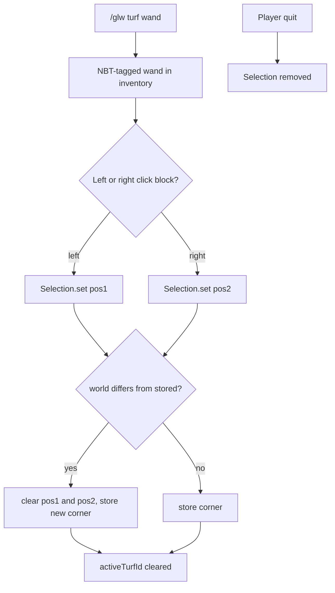
```mermaid
flowchart TD
  A["/glw turf wand"] --> B["NBT-tagged wand in inventory"]
  B --> C{"Left or right click block?"}
  C -->|"left"| D["Selection.set pos1"]
  C -->|"right"| E["Selection.set pos2"]
  D --> F{"world differs from stored?"}
  E --> F
  F -->|"yes"| G["clear pos1 and pos2, store new corner"]
  F -->|"no"| H["store corner"]
  G --> I["activeTurfId cleared"]
  H --> I
  J["Player quit"] --> K["Selection removed"]
```

**State & persistence effects:** In-memory only (`ConcurrentHashMap<UUID, Selection>`); nothing is written to disk.

**Edge cases & guards observed:** Permission is checked *after* the wand-item check, so a non-admin holding the wand
gets no message and the event is not cancelled. `Action.LEFT_CLICK_AIR` / `RIGHT_CLICK_AIR` are ignored, so a corner
can only be set on a block. Because `Selection.set` wipes both corners on a world change, the
`TURF_CREATE_FAIL_CROSS_WORLD` branch in create is effectively unreachable through the wand path.

### W2: Turf creation

**Trigger:** `/glw turf create <displayName…>`.

**Steps:**
1. `TurfCreateCommand.displayNameArgument` (`TurfCreateCommand.java:67-118`) — an `OptionalArgument`; players only;
   `args.length < 3` → `ARGUMENTS_MISSING`. The name is `joinFrom(args, 2)`, i.e. everything after `create`.
2. `selection.isComplete()` (both corners non-null) else `TURF_CREATE_FAIL_NO_SELECTION`.
3. Both corner worlds non-null and equal, else `TURF_CREATE_FAIL_CROSS_WORLD`.
4. `new CuboidRegion(world, pos1.getBlockX(), pos1.getBlockZ(), pos2.getBlockX(), pos2.getBlockZ())` — Y is
   discarded; min/max normalised.
5. `turfs.findConflict(region)` scans only the same world's list and uses inclusive `overlaps` → any shared block
   (including a shared edge) rejects with `TURF_CREATE_FAIL_OVERLAP`.
6. `turfs.allocateId()` (`AtomicInteger`, seeded to `max(existing)+1` at boot), then
   `new Turf(id, name, region, null /*unclaimed*/, Settings.getTurfDefaultIncomeAmount(), now, 0L)`.
7. `TurfManager.create` → `register` (by-id map, by-world list, fresh IDLE `TurfRuntimeState`) → `repository.save`
   (immediate write-through to `turf`).
8. `selection.setActiveTurfId(id)`; `TURF_CREATE_SUCCESS` with min/max/world placeholders.

**Diagram:**
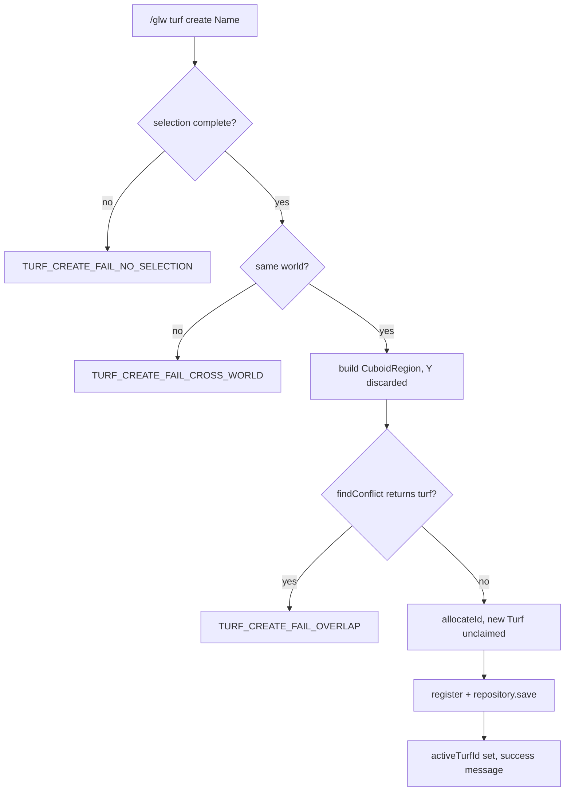
```mermaid
flowchart TD
  A["/glw turf create Name"] --> B{"selection complete?"}
  B -->|"no"| C["TURF_CREATE_FAIL_NO_SELECTION"]
  B -->|"yes"| D{"same world?"}
  D -->|"no"| E["TURF_CREATE_FAIL_CROSS_WORLD"]
  D -->|"yes"| F["build CuboidRegion, Y discarded"]
  F --> G{"findConflict returns turf?"}
  G -->|"yes"| H["TURF_CREATE_FAIL_OVERLAP"]
  G -->|"no"| I["allocateId, new Turf unclaimed"]
  I --> J["register + repository.save"]
  J --> K["activeTurfId set, success message"]
```

**State & persistence effects:** One new row in `turf`; runtime state IDLE; admin's active selection updated.

**Edge cases & guards observed:** No minimum or maximum region size is enforced — a 10,000×10,000 selection is
accepted and will make `TurfVisualization` and `findAt` expensive. No duplicate-name check (the
`TURF_CREATE_FAIL_ID_TAKEN` message exists but is never sent). Ids are allocated per-process from
`max(existing)+1`, so deleting the highest-id turf and restarting **re-uses that id** (see Observation #7).

### W3: Turf deletion

**Trigger:** `/glw turf delete`.

**Steps:**
1. `TurfSelectionResolver.resolve` → `activeTurfId` (dropped if stale) → standing-in → `TURF_NO_ACTIVE`.
2. `TurfManager.delete` (`manager/TurfManager.java:118-126`) — removes from `turfsById`, from the world list, drops
   the `TurfRuntimeState`, and calls `repository.delete(turf)` (`DELETE FROM turf WHERE id = ?`).
3. The command clears the caller's `activeTurfId` and sends `TURF_DELETE_SUCCESS`.

**Diagram:**
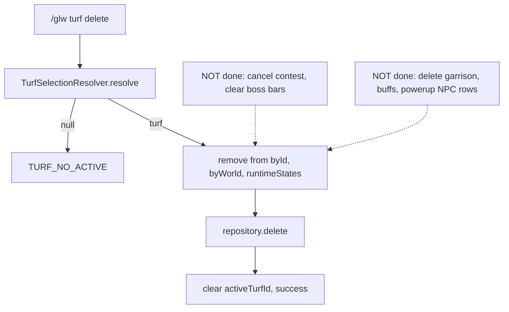
```mermaid
flowchart TD
  A["/glw turf delete"] --> B["TurfSelectionResolver.resolve"]
  B -->|"null"| C["TURF_NO_ACTIVE"]
  B -->|"turf"| D["remove from byId, byWorld, runtimeStates"]
  D --> E["repository.delete"]
  E --> F["clear activeTurfId, success"]
  G["NOT done: cancel contest, clear boss bars"] -.-> D
  H["NOT done: delete garrison, buffs, powerup NPC rows"] -.-> D
```

**State & persistence effects:** `turf` row deleted. Rows in `turf_garrison`, `turf_active_buff` and
`turf_powerup_npc` keyed by the same `turf_id` are **left behind**, and the in-memory `GarrisonManager.byTurf` /
`ActiveBuffManager.byTurf` / `TurfPowerupManager.byTurfId` entries survive.

**Edge cases & guards observed:** Deleting a turf mid-contest fires no `TurfCaptureFailedEvent`, so
`TurfBossBarListener.barsByTurf` keeps its entry forever (`refreshProgress` only `continue`s when
`turfs.get(turfId) == null`) and the viewers' boss bars never disappear. Deployed defenders are not recalled and the
Quartermaster NPC stays spawned and engaged.

### W4: Turf state model

**Trigger:** every `CaptureService.tick` (1 Hz) plus admin commands.

**Steps:**
1. `TurfRuntimeState` is created IDLE / phase CLAIM / progress 0 for every turf at `TurfManager.register` — i.e. at
   boot and at create. It is never persisted.
2. `CaptureService.tick:98-108` dispatches on `state.getState()`: IDLE → `tickIdle`, CONTESTING →
   `tickContestingUnclaimed` or `tickContestingOwned` (chosen by `turf.isUnclaimed()` **each tick**), COOLDOWN →
   `tickCooldown`.
3. `tickCooldown:367-372` flips back to IDLE once `now >= lastCaptureTimestamp + Cooldown_Minutes`.
4. `state.reset()` (IDLE / CLAIM / 0 / null challenger) is called by `cancel` and by `/glw turf setowner`.

**Diagram:**
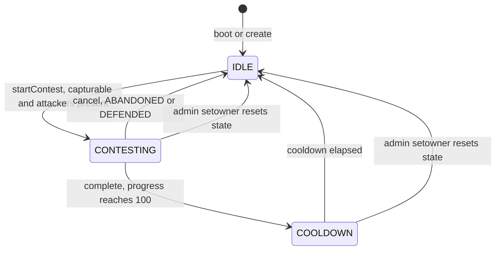
```mermaid
stateDiagram-v2
  [*] --> IDLE : boot or create
  IDLE --> CONTESTING : startContest, capturable and attackers present
  CONTESTING --> COOLDOWN : complete, progress reaches 100
  CONTESTING --> IDLE : cancel, ABANDONED or DEFENDED
  CONTESTING --> IDLE : admin setowner resets state
  COOLDOWN --> IDLE : cooldown elapsed
  COOLDOWN --> IDLE : admin setowner resets state
```

Sub-phase machine for **unclaimed** turfs while CONTESTING:

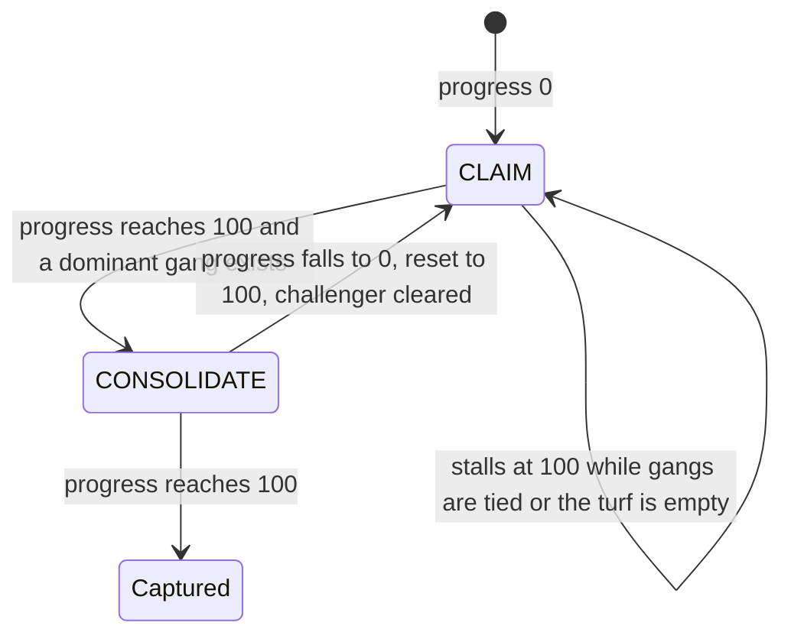
```mermaid
stateDiagram-v2
  [*] --> CLAIM : progress 0
  CLAIM --> CONSOLIDATE : progress reaches 100 and a dominant gang exists
  CONSOLIDATE --> CLAIM : progress falls to 0, reset to 100, challenger cleared
  CONSOLIDATE --> Captured : progress reaches 100
  CLAIM --> CLAIM : stalls at 100 while gangs are tied or the turf is empty
```

**State & persistence effects:** None of the state enum, phase, progress or challenger is persisted; only
`lastCaptureTimestamp` (and the owner) are.

**Edge cases & guards observed:** After a restart a turf that was in COOLDOWN comes back as IDLE, yet
`isCapturable` still rejects it until the cooldown window elapses — `/glw turf status` will print IDLE while capture
attempts silently do nothing (the feedback listener does report the remaining cooldown on entry). There is exactly
one `TurfRuntimeState` per turf, so two simultaneous captures of the same turf are structurally impossible.

### W5: Presence tracking and enter/exit events

**Trigger:** 1-Hz `BukkitTask` started from `TurfConfig.turfLocationTracker` (`TurfConfig:138-142`).

**Steps:**
1. `TurfLocationTracker.tick:68-101` iterates `Bukkit.getOnlinePlayers()`.
2. Worlds with no turfs short-circuit: any cached turf for that player is removed and a `TurfExitEvent` fires.
3. `turfs.findAt(player.getLocation())` walks the world's turf list and returns the first `region.contains(loc)`
   match (X/Z inclusive, Y ignored, world name compared by string).
4. Reference comparison `current == previous` (stable `Turf` instances) skips no-ops; otherwise exit fires for the
   old turf and enter for the new, and the cache is updated.
5. `capture.tick(playerTurfCache)` runs last, so `CaptureService` sees the freshly-updated snapshot.

**Diagram:**
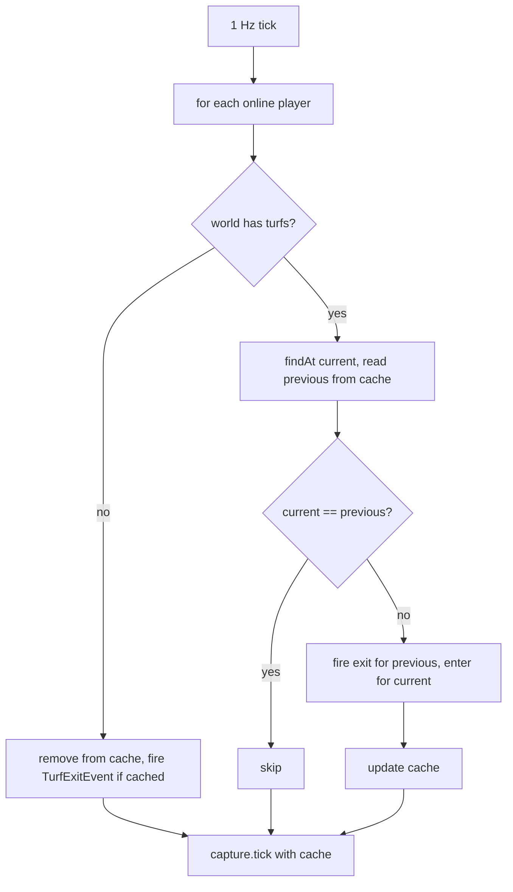
```mermaid
flowchart TD
  A["1 Hz tick"] --> B["for each online player"]
  B --> C{"world has turfs?"}
  C -->|"no"| D["remove from cache, fire TurfExitEvent if cached"]
  C -->|"yes"| E["findAt current, read previous from cache"]
  E --> F{"current == previous?"}
  F -->|"yes"| G["skip"]
  F -->|"no"| H["fire exit for previous, enter for current"]
  H --> I["update cache"]
  D --> J["capture.tick with cache"]
  G --> J
  I --> J
```

**State & persistence effects:** `playerTurfCache` (a `ConcurrentHashMap<UUID, Turf>`) only.

**Edge cases & guards observed:** The class implements `Listener` and declares `onQuit(PlayerQuitEvent)`, but it is
created as a `@Bean` **without `@ListenerHandler`**, and Keystone only registers `@ListenerHandler` classes
(`ListenerService.scanAndRegisterListeners:151`) — so the quit handler never runs and the cache retains entries for
offline players. `CaptureService.indexPlayersByTurf:132` skips them (`Bukkit.getPlayer` returns null), so counting
stays correct, but the map grows for the life of the server. A player who teleports directly from turf A to turf B
gets both an exit and an enter in the same tick, in that order.

### W6: Capture start

**Trigger:** `CaptureService.tickIdle` on a turf whose runtime state is IDLE.

**Steps:**
1. `isCapturable(turf, now)` (`CaptureService.java:112-127`): false while
   `now < lastCaptureTimestamp + Cooldown_Minutes`; true for unclaimed turfs; true if the owner gang record is
   missing; otherwise requires `now - owner.getLastMemberOnlineAt() > Post_Logoff_Protection_Minutes`.
2. `classify(turf, playersInside)` (`:141-167`): skips dead players; skips players with no `User` or no gang; folds
   owner-gang members **and members of gangs allied to the owner** into `defenders`; everyone else is counted per
   gang in `challengersByGang`.
3. **Unclaimed turf:** any gang member present is enough. The initial challenger is `dominantGang(...)`, or the
   lowest gang id on a tie (`:190-199`). `startContest(..., CLAIM, 0.0, ...)`.
4. **Owned turf:** requires `defenders == 0` **and** exactly one distinct challenger gang (`:209-211`); otherwise
   nothing happens. `startContest(..., CLAIM, 0.0, ...)`.
5. `startContest:374-386` sets CONTESTING / phase / challenger / progress / `lastChallengerSeenAt`, plays the start
   SFX to everyone inside, and fires `TurfCaptureStartEvent`.

**Diagram:**
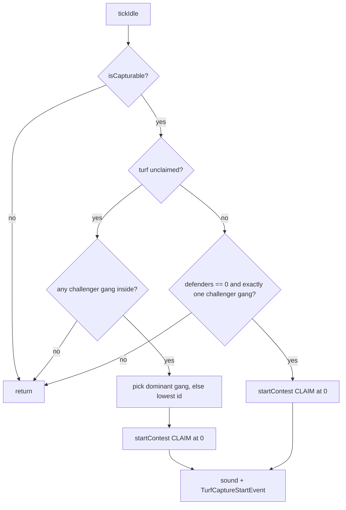
```mermaid
flowchart TD
  A["tickIdle"] --> B{"isCapturable?"}
  B -->|"no"| C["return"]
  B -->|"yes"| D{"turf unclaimed?"}
  D -->|"yes"| E{"any challenger gang inside?"}
  E -->|"no"| C
  E -->|"yes"| F["pick dominant gang, else lowest id"]
  F --> G["startContest CLAIM at 0"]
  D -->|"no"| H{"defenders == 0 and exactly one challenger gang?"}
  H -->|"no"| C
  H -->|"yes"| I["startContest CLAIM at 0"]
  G --> J["sound + TurfCaptureStartEvent"]
  I --> J
```

**State & persistence effects:** Runtime only; nothing hits the DB at start.

**Edge cases & guards observed:** There is **no minimum-member requirement and no monetary cost** to start a
capture — a single player is enough. `gangs.findById(challengerGangId) == null` aborts the start silently. Allies of
the owner cannot start or help a contest against the owner (they are defenders). A gangless player is invisible to
the whole system.

### W7: Capture progress — owned turf (single phase)

**Trigger:** `CaptureService.tickContestingOwned` once per second while CONTESTING and `!turf.isUnclaimed()`.

**Steps:**
1. `challengers = challengersByGang.getOrDefault(state.challengerGangId, 0)` — **only the registered challenger
   gang counts**; a third gang inside is ignored entirely.
2. If `challengers > 0`, refresh `lastChallengerSeenAt` (written but never read on this path).
3. `base = 100.0 / max(1, Duration_Seconds)`; `net = (challengers == 0 && defenders == 0) ? -1 :
   challengers - defenders`; `progress = clamp(progress + net*base, 0, 100)`.
4. For each configured milestone crossed upward, fire `TurfCaptureProgressEvent(turf, after, CLAIM, after, 0.0)`.
5. `after >= 100` → `complete` (W9). `after <= 0 && challengers == 0` → `cancel(ABANDONED)`.
   `after <= 0 && defenders > challengers` → `cancel(DEFENDED)`.

**Diagram:**
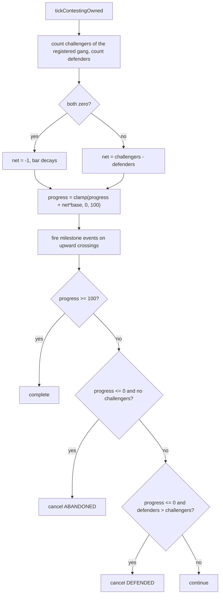
```mermaid
flowchart TD
  A["tickContestingOwned"] --> B["count challengers of the registered gang, count defenders"]
  B --> C{"both zero?"}
  C -->|"yes"| D["net = -1, bar decays"]
  C -->|"no"| E["net = challengers - defenders"]
  D --> F["progress = clamp(progress + net*base, 0, 100)"]
  E --> F
  F --> G["fire milestone events on upward crossings"]
  G --> H{"progress >= 100?"}
  H -->|"yes"| I["complete"]
  H -->|"no"| J{"progress <= 0 and no challengers?"}
  J -->|"yes"| K["cancel ABANDONED"]
  J -->|"no"| L{"progress <= 0 and defenders > challengers?"}
  L -->|"yes"| M["cancel DEFENDED"]
  L -->|"no"| N["continue"]
```

**State & persistence effects:** Runtime progress only, until `complete`.

**Edge cases & guards observed:** `Abandon_Grace_Seconds` is not consulted here — an emptied turf decays at the 1v0
rate and cancels when the bar hits zero, which for `Duration_Seconds = 180` means up to 180 s, not 15 s. Dead
players are excluded by `classify`, so a downed lone attacker pauses (then reverses) the capture. `isCapturable` is
not re-evaluated while contesting, so an owner logging back in mid-contest does not stop it.

### W8: Capture progress — unclaimed turf (two phases)

**Trigger:** `CaptureService.tickContestingUnclaimed` while CONTESTING and `turf.isUnclaimed()`.

**Steps:**
1. `totalInside` = sum of all `challengersByGang` values. If > 0 refresh `lastChallengerSeenAt`; else, once
   `now - lastChallengerSeenAt > Abandon_Grace_Seconds`, `cancel(ABANDONED)`.
2. `base = 100 / max(1, Unclaimed_Phase1_Seconds | Unclaimed_Phase2_Seconds)` depending on the phase.
3. **CLAIM:** `delta = totalInside > 0 ? base : 0` — global and non-decrementing; rival gangs help fill it.
4. **CONSOLIDATE:** `capturing = count(challengerGangId)`, `opposers = everyone else`;
   `net = (capturing == 0 && opposers == 0) ? -1 : capturing - opposers`; `delta = net * base`.
5. Milestones fire with a split claim/consolidate pair for the dual-bar UI.
6. Transitions (`:324-364`): CLAIM at 100 → pick `dominantGang` (null on a tie or empty room → stall at 100), set
   CONSOLIDATE/0/new challenger, replay the start SFX and **re-fire `TurfCaptureStartEvent`**. CONSOLIDATE at 100 →
   `complete`. CONSOLIDATE at 0 → back to CLAIM at progress 100 with `challengerGangId = null`. CLAIM at 0 →
   `cancel(ABANDONED)` (unreachable in practice since CLAIM never decrements).

**Diagram:**
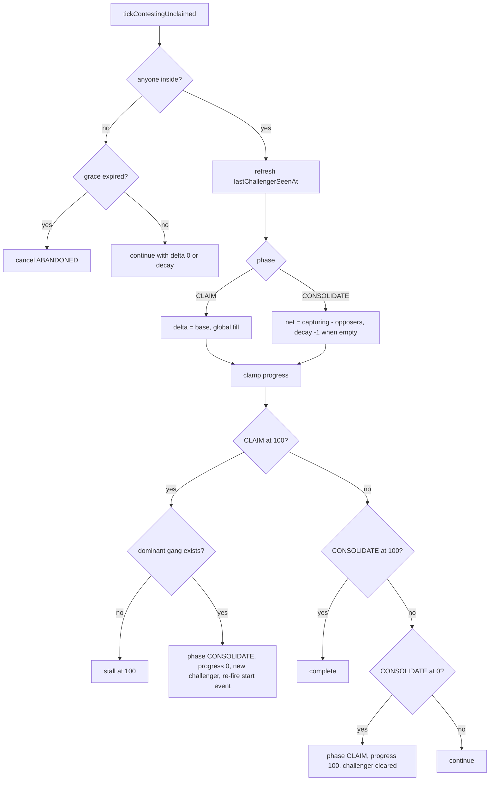
```mermaid
flowchart TD
  A["tickContestingUnclaimed"] --> B{"anyone inside?"}
  B -->|"no"| C{"grace expired?"}
  C -->|"yes"| D["cancel ABANDONED"]
  C -->|"no"| E["continue with delta 0 or decay"]
  B -->|"yes"| F["refresh lastChallengerSeenAt"]
  F --> G{"phase"}
  G -->|"CLAIM"| H["delta = base, global fill"]
  G -->|"CONSOLIDATE"| I["net = capturing - opposers, decay -1 when empty"]
  H --> J["clamp progress"]
  I --> J
  J --> K{"CLAIM at 100?"}
  K -->|"yes"| L{"dominant gang exists?"}
  L -->|"no"| M["stall at 100"]
  L -->|"yes"| N["phase CONSOLIDATE, progress 0, new challenger, re-fire start event"]
  K -->|"no"| O{"CONSOLIDATE at 100?"}
  O -->|"yes"| P["complete"]
  O -->|"no"| Q{"CONSOLIDATE at 0?"}
  Q -->|"yes"| R["phase CLAIM, progress 100, challenger cleared"]
  Q -->|"no"| S["continue"]
```

**State & persistence effects:** Runtime only until `complete`.

**Edge cases & guards observed:** `dominantGang` returns null on any tie at the top, so two evenly-matched gangs
freeze Phase 1 at 100 indefinitely (the abandon grace still applies if everyone leaves). While the state is parked
at CLAIM/100 with `challengerGangId = null`, the boss bar title resolves the gang name to `"Unknown"` and the
contribution task awards nobody. The `dominantGang(counts, exclude)` `exclude` parameter is dead — both call sites
pass `null`, so the "Phase 1 rolled to zero transfers the contest to the dominant opposer" behaviour described in
the `CapturePhase` and `CaptureService` javadocs is **not implemented**.

### W9: Capture completion and ownership transfer

**Trigger:** progress reaches 100 in `tickContestingOwned` or in CONSOLIDATE.

**Steps:**
1. `CaptureService.complete:388-409` reads `oldOwnerId` and unboxes `int newOwnerId = state.getChallengerGangId()`.
2. Looks up both gangs (`gangs.findById`).
3. Mutates the turf: `setOwnerGangId(newOwnerId)`, `setLastCaptureTimestamp(now)`.
4. Mutates runtime state: COOLDOWN, phase CLAIM, progress 0, challenger null.
5. `turfs.persist(turf)` → immediate `repository.save` (bypasses the autosave cadence).
6. Plays the complete SFX to everyone inside.
7. Fires `TurfCapturedEvent(turf, oldOwner, newOwner)` **only if `newOwner != null`**.
8. Downstream: boss bars torn down, presence bars refreshed for everyone inside, global broadcast (if
   `Broadcast_Globally`), `Capture_Complete_Bonus` contribution, defenders recalled, Quartermaster disengaged.

**Diagram:**
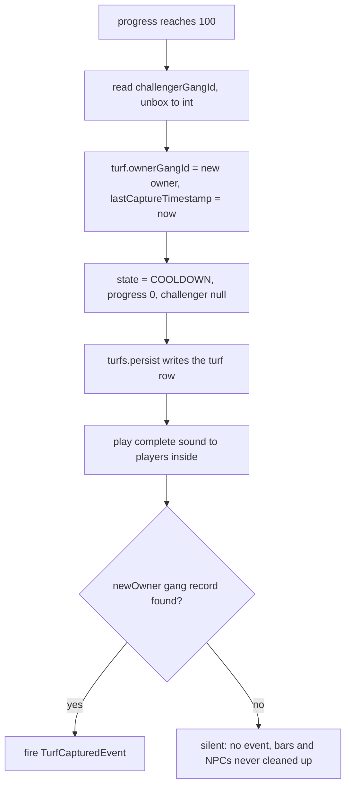
```mermaid
flowchart TD
  A["progress reaches 100"] --> B["read challengerGangId, unbox to int"]
  B --> C["turf.ownerGangId = new owner, lastCaptureTimestamp = now"]
  C --> D["state = COOLDOWN, progress 0, challenger null"]
  D --> E["turfs.persist writes the turf row"]
  E --> F["play complete sound to players inside"]
  F --> G{"newOwner gang record found?"}
  G -->|"yes"| H["fire TurfCapturedEvent"]
  G -->|"no"| I["silent: no event, bars and NPCs never cleaned up"]
```

**State & persistence effects:** `turf.owner_gang_id` and `turf.last_capture_timestamp` written immediately.

**Edge cases & guards observed:** The ownership write happens **before** the null check on `newOwner`, so a turf can
be handed to a gang id that no longer exists; nothing then fires `TurfCapturedEvent`, leaving stale boss bars,
un-recalled defenders and an engaged Quartermaster until the income distributor's next pass auto-releases the turf.
The unboxing at line 390 would NPE if a completion path ever ran with a null challenger.

### W10: Capture cancellation

**Trigger:** `cancel(turf, state, playersInside, reason)` from the abandon/defended branches.

**Steps:**
1. `state.reset()` — IDLE / CLAIM / 0 / null challenger / `lastChallengerSeenAt = 0`.
2. Failed SFX to every player currently inside.
3. `TurfCaptureFailedEvent(turf, reason)` → boss bars cleared, `Defense_Success_Bonus` paid on `DEFENDED`,
   defenders recalled, Quartermaster disengaged.

**Diagram:**
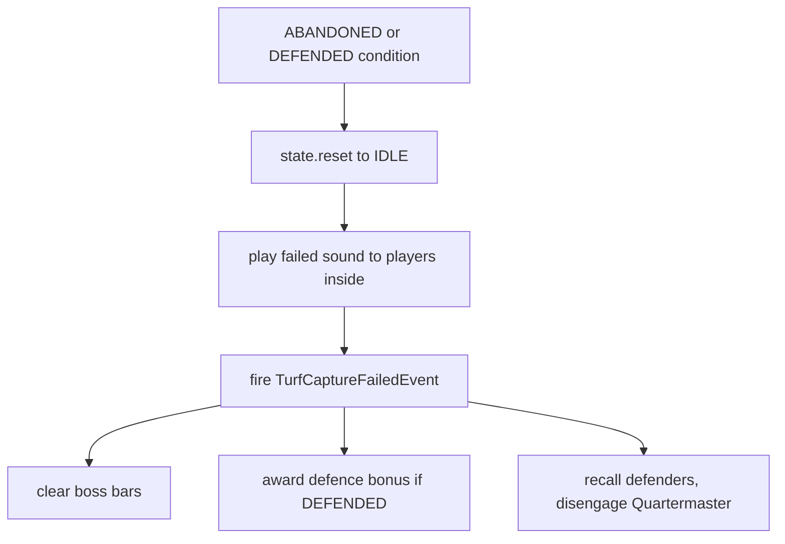
```mermaid
flowchart TD
  A["ABANDONED or DEFENDED condition"] --> B["state.reset to IDLE"]
  B --> C["play failed sound to players inside"]
  C --> D["fire TurfCaptureFailedEvent"]
  D --> E["clear boss bars"]
  D --> F["award defence bonus if DEFENDED"]
  D --> G["recall defenders, disengage Quartermaster"]
```

**State & persistence effects:** Runtime only — `lastCaptureTimestamp` is untouched, so no cooldown is applied to a
failed attempt and the same gang can restart on the next tick.

**Edge cases & guards observed:** Because a cancel immediately allows a restart, an attacker who steps out and back
in produces `failed → start` pairs; each `start` re-runs the garrison deploy, which consumes the remaining stock
(W12). `Reason.CANCELLED` exists in the enum but is never used.

### W11: Contribution points

**Trigger:** a 1-Hz task plus the capture lifecycle events.

**Steps:**
1. `TurfContributionTickTask.tick` (`contribution/TurfContributionTickTask.java:65-90`) iterates online players,
   resolves their turf with `turfs.findAt` (a second scan, independent of the tracker cache), requires CONTESTING,
   requires a gang, then awards `defenderPresenceTick` if the player's gang is the owner or `attackerPresenceTick`
   if it is the current `challengerGangId`; anything else gets nothing.
2. `award` walks `gang.getMembers()` for the matching UUID and calls `member.increaseContribution(points)`.
3. `TurfContributionListener.onCaptured` pays `captureCompleteBonus` to the new owner's members physically inside
   the region; `onFailed` pays `defenseSuccessBonus` to the owner's members inside, **only** for reason `DEFENDED`.
4. `awardPresent` re-derives "inside" from raw block coordinates plus a hardcoded `y < 0 || y > 319` filter
   (`listener/contribution/TurfContributionListener.java:64`).

**Diagram:**
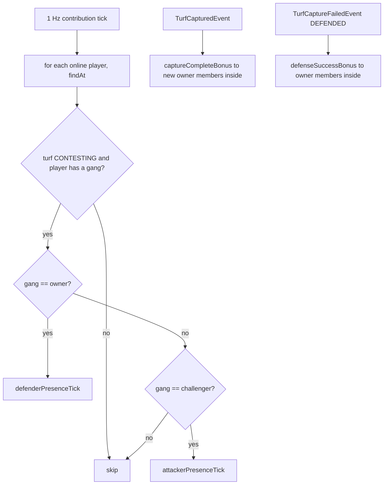
```mermaid
flowchart TD
  A["1 Hz contribution tick"] --> B["for each online player, findAt"]
  B --> C{"turf CONTESTING and player has a gang?"}
  C -->|"no"| D["skip"]
  C -->|"yes"| E{"gang == owner?"}
  E -->|"yes"| F["defenderPresenceTick"]
  E -->|"no"| G{"gang == challenger?"}
  G -->|"yes"| H["attackerPresenceTick"]
  G -->|"no"| D
  I["TurfCapturedEvent"] --> J["captureCompleteBonus to new owner members inside"]
  K["TurfCaptureFailedEvent DEFENDED"] --> L["defenseSuccessBonus to owner members inside"]
```

**State & persistence effects:** `Member.contribution` is mutated; persistence is owned by the gang module's
autosave, not by the turf feature.

**Edge cases & guards observed:** Allies of the owner earn nothing (they are neither the owner gang nor the
challenger). During unclaimed Phase 1 only the cosmetically-elected challenger gang earns attacker points even
though every gang is filling the bar. The `y < 0` clamp silently excludes players standing below y=0 in 1.18+
worlds, contradicting `CuboidRegion`'s Y-agnostic containment. Dead players still earn presence points here (unlike
in `classify`).

### W12: Garrison deploy and Quartermaster engagement

**Trigger:** `TurfCaptureStartEvent`.

**Steps:**
1. `GarrisonDeployListener.onCaptureStart` (`listener/powerups/GarrisonDeployListener.java:36-58`) returns
   immediately for unclaimed turfs.
2. `npcs.engageQuartermaster(turfId, challengerGangId)` — always, even with zero stock.
3. `garrisons.count(turfId)`; zero → stop.
4. `regionCentreSurface` — `Bukkit.getWorld(region.world)`, centre X/Z, `world.getHighestBlockYAt(...) + 1`; null
   world → stop.
5. `garrisons.consume(turfId, stock)` returns the actual amount taken (write-through to `turf_garrison`).
6. `npcs.deployDefenders(turfId, spawn, challengerGangId, consumed)`.
7. `TurfNpcContractImpl.deployDefenders` (`gangland-impl/.../turf/TurfNpcContractImpl.java:40-44`) passes a
   `Supplier<Set<UUID>>` that re-reads `gang.getMembers()` on every targeting tick, plus the configured type id,
   radius and lifespan.
8. `TurfDefenderDeployer.deploy` (`cops-n-crooks/.../defender/TurfDefenderDeployer.java:77-100`) groups by turf id,
   spawns `count` civilians through `CivilianSpawnManager.spawnCivilian`, and stamps an expiry of
   `now + Lifespan_Seconds`.
9. A 5-tick task reaps invalid/expired defenders (`markForRemoval`), then retargets each survivor at the closest
   live challenger within `Targeting_Radius`, forcing `CivilianState.COMBAT`.
10. `TurfPowerupNpc.engage` starts its own 5-tick retarget loop at radius 32 (hardcoded in
    `TurfPowerupManager.engage:130`).
11. On `TurfCapturedEvent` or `TurfCaptureFailedEvent`, `recallDefenders` + `disengageQuartermaster` run regardless
    of who won.

**Diagram:**
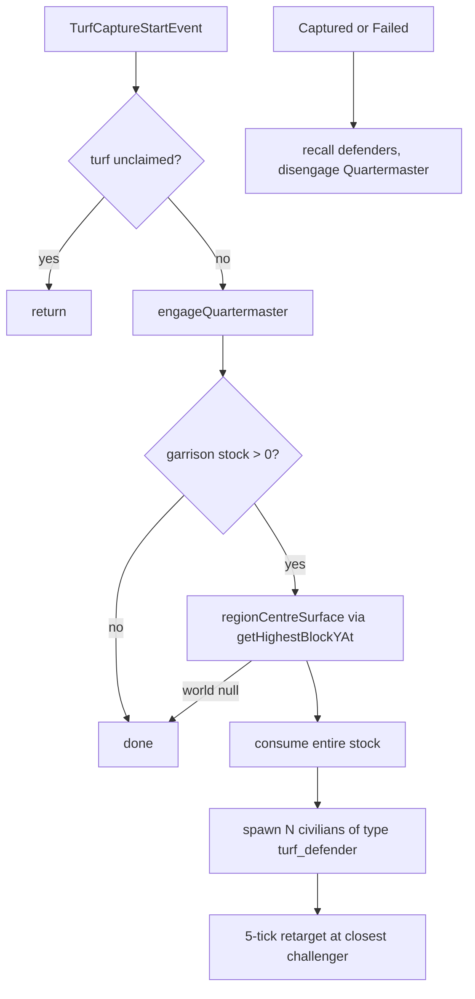
```mermaid
flowchart TD
  A["TurfCaptureStartEvent"] --> B{"turf unclaimed?"}
  B -->|"yes"| C["return"]
  B -->|"no"| D["engageQuartermaster"]
  D --> E{"garrison stock > 0?"}
  E -->|"no"| F["done"]
  E -->|"yes"| G["regionCentreSurface via getHighestBlockYAt"]
  G -->|"world null"| F
  G --> H["consume entire stock"]
  H --> I["spawn N civilians of type turf_defender"]
  I --> J["5-tick retarget at closest challenger"]
  K["Captured or Failed"] --> L["recall defenders, disengage Quartermaster"]
```

**State & persistence effects:** `turf_garrison.count` is written to zero on deploy. Defender NPCs are ephemeral
(`CivilianNpcFactory` sets `NPC.Metadata.SHOULD_SAVE = false`) and are never persisted.

**Edge cases & guards observed:** All defenders spawn at the exact same surface column, which may be far from the
actual fight or on a roof. The whole stock is consumed by the first start event, so a contest that starts and
cancels within one second still burns everything. For unclaimed turfs the CLAIM→CONSOLIDATE transition re-fires
`TurfCaptureStartEvent`, but the `isUnclaimed()` guard makes that a no-op. `TurfDefenderDeployer.stop()` is never
called by any code path.

### W13: Buying garrison stock and powerup buffs (Quartermaster panel)

**Trigger:** right-clicking the per-turf Quartermaster NPC.

**Steps:**
1. `TurfPowerupInteractListener.onNpcRightClick` resolves the entity via
   `TurfPowerupManager.getByEntity` (Citizens metadata `gangland.turfpowerup.turfid`) and calls
   `TurfPowerupOpenContract.open(player, turfId)`.
2. `TurfPowerupOpenContractImpl.open` (`gangland-impl/.../turf/TurfPowerupOpenContractImpl.java:33-70`) gates on:
   turf exists, turf has an owner, viewer has a gang, both gang records resolve, and viewer's gang is the owner
   **or an ally**. All four denials are hardcoded English chat.
3. `TurfPowerupFlow.start` builds a `TurfPowerupFlowSession` (caching the `Turf`, owner gang, viewer gang and NPC
   name) and registers three panels on a `MultiPanelInventory`.
4. `TurfPowerupMenuView` shows owner, garrison stock, active-buff count and the viewer gang's bank; two buttons
   switch panels.
5. `TurfPowerupGarrisonView.attemptBuy` withdraws a **hardcoded** `PER_DEFENDER_COST = 1500` from the viewer gang's
   `EconomyHandler`; on `EconomyException` it messages and returns; otherwise `garrisons.add(turfId, 1)` (immediate
   `repository.save`) and re-renders.
6. `TurfPowerupBuffCatalogueView.attemptBuy` withdraws `def.cost()` then `buffs.activate(turfId, def)`.
7. `ActiveBuffManager.activate` (`powerups/ActiveBuffManager.java:75-87`) allocates an id from a local
   `AtomicLong`, computes `expiresAt = now + durationSeconds*1000`, adds to `byTurf` and saves the row immediately.

**Diagram:**
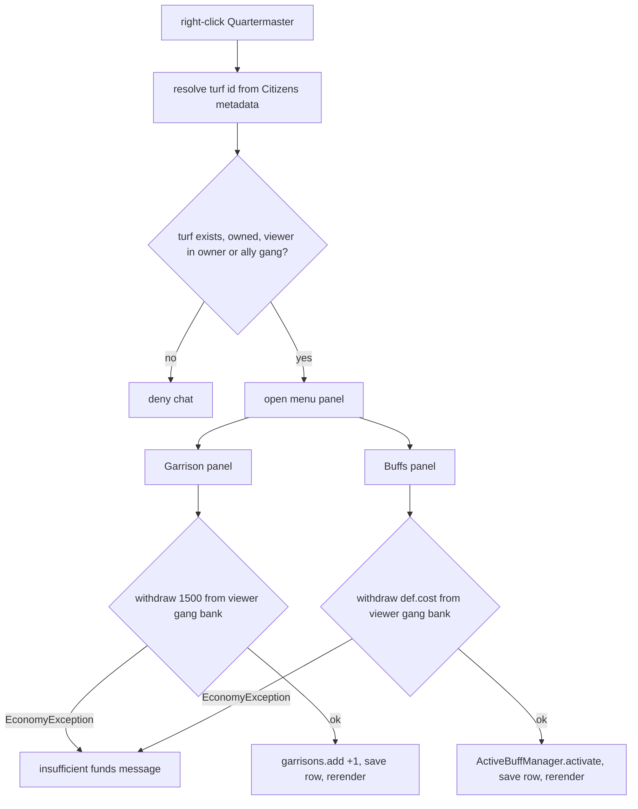
```mermaid
flowchart TD
  A["right-click Quartermaster"] --> B["resolve turf id from Citizens metadata"]
  B --> C{"turf exists, owned, viewer in owner or ally gang?"}
  C -->|"no"| D["deny chat"]
  C -->|"yes"| E["open menu panel"]
  E --> F["Garrison panel"]
  E --> G["Buffs panel"]
  F --> H{"withdraw 1500 from viewer gang bank"}
  H -->|"EconomyException"| I["insufficient funds message"]
  H -->|"ok"| J["garrisons.add +1, save row, rerender"]
  G --> K{"withdraw def.cost from viewer gang bank"}
  K -->|"EconomyException"| I
  K -->|"ok"| L["ActiveBuffManager.activate, save row, rerender"]
```

**State & persistence effects:** `turf_garrison` and `turf_active_buff` rows written immediately on purchase.

**Edge cases & guards observed:** The economy is debited before the effect is applied and there is no rollback if
the subsequent step fails. Nothing re-validates ownership at click time, so if the turf is captured while the panel
is open the buyer pays and the buff/stock lands on the enemy's turf. The buff catalogue renders at most 9 entries
(`BUFF_START = 9`, `BUFF_END = 18`); a tenth powerup is silently unbuyable. Buff stacking is unrestricted —
buying `small_income_boost` twice multiplies to 1.5625×.

### W14: Buff lifetime, expiry and persistence

**Trigger:** `ActiveBuffManager.initialize()` (bean creation) and a 1-Hz prune task.

**Steps:**
1. `initialize:37-62` clears the cache, loads every row, **deletes already-expired rows**, indexes the rest by turf
   id, seeds `nextId` to `max(id)+1`, wires the data supplier, and starts the prune task.
2. `prune:126-143` removes expired buffs from the cache and issues a `repository.delete` per buff, dropping empty
   turf entries.
3. `effectiveMultiplier(turfId, type)` (`:95-111`) returns 1.0 (multiplicative types) or 0.0
   (`CAPTURE_DEFENSE_BONUS`) when no matching live buff exists, multiplying or summing otherwise.
4. `shutdown()` cancels the prune task — but is never called.

**Diagram:**
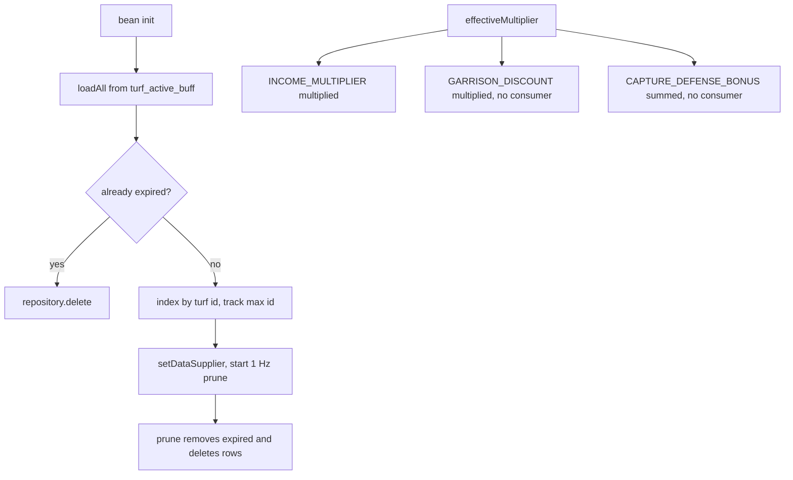
```mermaid
flowchart TD
  A["bean init"] --> B["loadAll from turf_active_buff"]
  B --> C{"already expired?"}
  C -->|"yes"| D["repository.delete"]
  C -->|"no"| E["index by turf id, track max id"]
  E --> F["setDataSupplier, start 1 Hz prune"]
  F --> G["prune removes expired and deletes rows"]
  H["effectiveMultiplier"] --> I["INCOME_MULTIPLIER multiplied"]
  H --> J["GARRISON_DISCOUNT multiplied, no consumer"]
  H --> K["CAPTURE_DEFENSE_BONUS summed, no consumer"]
```

**State & persistence effects:** Buffs survive restart with the correct remaining wall-clock duration because
`expires_at` is an absolute epoch-ms value. Buffs whose window elapsed while the server was down are deleted at
boot.

**Edge cases & guards observed:** Only `INCOME_MULTIPLIER` has a consumer;
`CAPTURE_DEFENSE_BONUS` and `GARRISON_DISCOUNT` are dead (grep-verified across the whole repo). Buff rows are keyed
by turf id with no foreign key, so deleting a turf orphans its buffs. Ids are process-local, not DB-generated,
despite `ActiveTurfBuff.UNASSIGNED_ID` existing for that purpose (it is never used).

### W15: Turf income distribution

**Trigger:** repeating task started in `TurfConfig.turfIncomeDistributor`, period
`Income_Interval_Minutes * 60 * 20` ticks (default 10 min).

**Steps:**
1. `TurfIncomeDistributor.distribute:58-75` skips unclaimed turfs.
2. `gangs.findById(ownerGangId) == null` → logs, nulls the owner, `turfs.persist(turf)`, continues (silent
   auto-release; no event, no sound, no NPC cleanup).
3. `multiplier = BigDecimal.valueOf(buffs.effectiveMultiplier(turfId, INCOME_MULTIPLIER))`.
4. `payout = incomeAmount * multiplier` rounded `HALF_UP` to 2 dp, then `gang.getEconomy().depositAmount(payout)`.

**Diagram:**
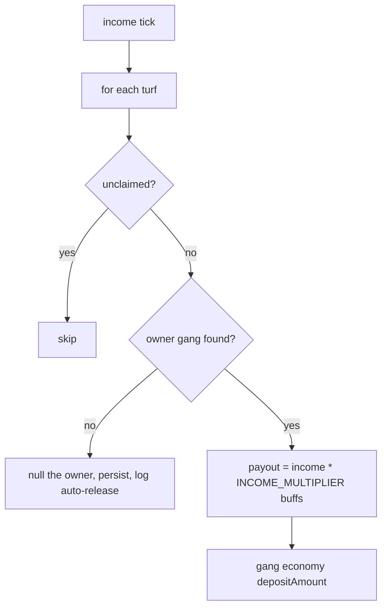
```mermaid
flowchart TD
  A["income tick"] --> B["for each turf"]
  B --> C{"unclaimed?"}
  C -->|"yes"| D["skip"]
  C -->|"no"| E{"owner gang found?"}
  E -->|"no"| F["null the owner, persist, log auto-release"]
  E -->|"yes"| G["payout = income * INCOME_MULTIPLIER buffs"]
  G --> H["gang economy depositAmount"]
```

**State & persistence effects:** Gang bank balance mutated (persisted by the gang module's own autosave);
`turf.owner_gang_id` written on orphan release.

**Edge cases & guards observed:** There is no upkeep/cost side and no requirement that any member be online — an
offline gang keeps earning until the inactivity release fires. There is no cap on the aggregated multiplier.
`income_amount` is stored as a SQL `Double` even though `Turf.incomeAmount` is a `BigDecimal`, so the value makes a
lossy round-trip on every restart.

### W16: Gang presence heartbeat and inactivity auto-release

**Trigger:** two repeating tasks from `GangPresenceTracker.start()` plus the join/quit listener.

**Steps:**
1. `heartbeat` every 60 s stamps `gang.setLastMemberOnlineAt(now)` for every online gang member's gang.
2. `GangPresenceListener.onJoin` stamps immediately; `onQuit` stamps **only if no other member of that gang is
   online** (`hasOtherOnlineMember` scans online players).
3. `releaseTask` runs `InactivityReleaseTask` every 24 h — with an initial delay of 24 h.
4. `InactivityReleaseTask.run` frees turfs whose gang record is missing, or whose
   `lastMemberOnlineAt > 0 && now - lastMemberOnlineAt > Inactivity_Auto_Release_Days`, persisting each.
5. `CaptureService.isCapturable` reads the same timestamp for the `Post_Logoff_Protection_Minutes` window.

**Diagram:**
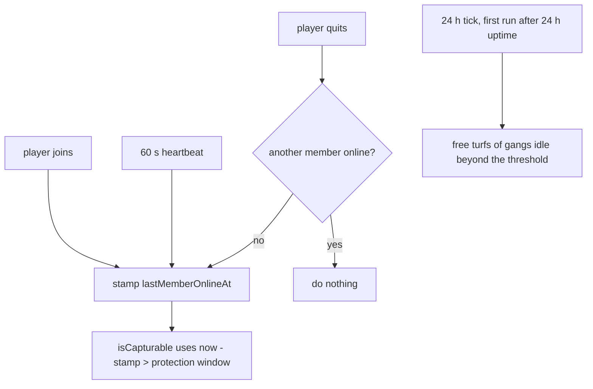
```mermaid
flowchart TD
  A["player joins"] --> B["stamp lastMemberOnlineAt"]
  C["60 s heartbeat"] --> B
  D["player quits"] --> E{"another member online?"}
  E -->|"yes"| F["do nothing"]
  E -->|"no"| B
  B --> G["isCapturable uses now - stamp > protection window"]
  H["24 h tick, first run after 24 h uptime"] --> I["free turfs of gangs idle beyond the threshold"]
```

**State & persistence effects:** `gang.last_member_online_at` is a persisted column
(`GangTable.java:25`), so protection survives restarts. Released turfs are persisted immediately.

**Edge cases & guards observed:** The release task's initial delay equals its period, so a server restarted more
often than daily never runs the inactivity sweep. Released turfs get no `TurfOwnerChangedEvent` — the presence boss
bar and the "owner cleared" sound never fire, even though `TurfSoundContract.playOwnerCleared`'s javadoc names
inactivity auto-release as a trigger. `lastCaptureTimestamp` is left intact, so a released turf can still be in
cooldown.

### W17: Admin ownership change

**Trigger:** `/glw turf setowner <gang|none>`.

**Steps:**
1. Resolve the turf via `TurfSelectionResolver`.
2. `none` → `setOwnerGangId(null)`; otherwise a case-insensitive linear scan of `gangs.getAll()` by name, with
   `TURF_GANG_NOT_FOUND` on a miss.
3. `resetCaptureState` (`TurfSetOwnerCommand.java:116-122`) — `state.reset()` plus `lastCaptureTimestamp = 0`, so
   the turf is immediately capturable again.
4. `turfs.persist(turf)`; `TurfOwnerChangedEvent(turf, oldId, newId)`.
5. `TurfPresenceBarListener.onOwnerChanged` re-renders bars for everyone inside;
   `TurfOwnerSoundListener` plays the "unclaimed" SFX **only** when the new owner is null, scanning all online
   players and re-running `turfs.findAt` for each.

**Diagram:**
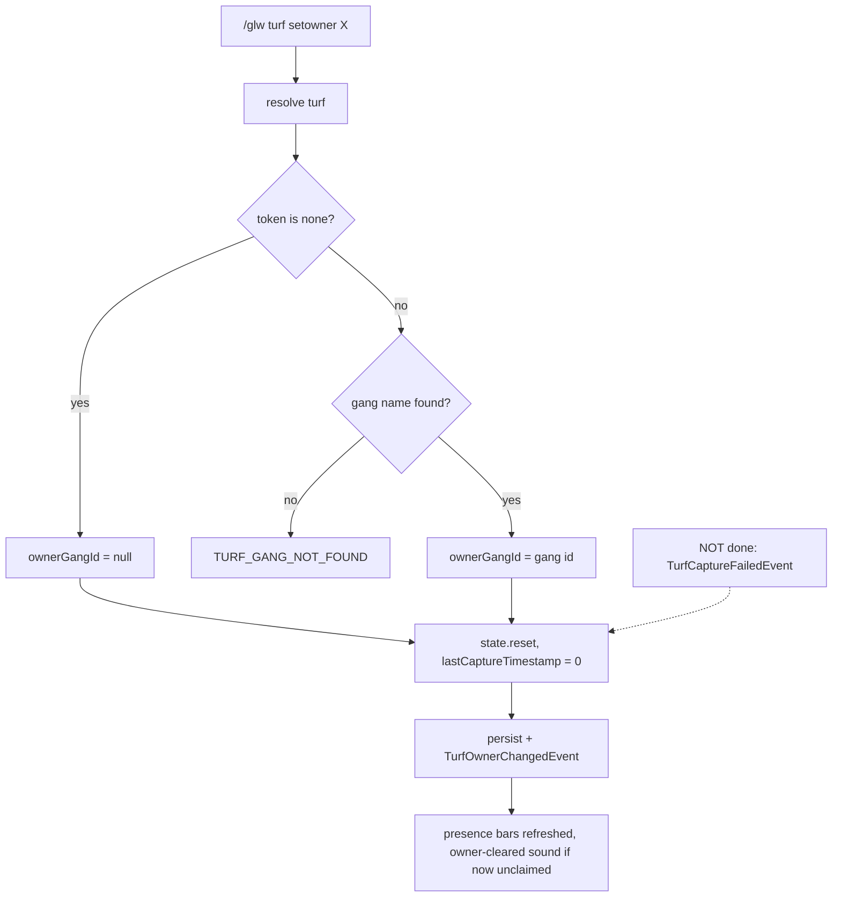
```mermaid
flowchart TD
  A["/glw turf setowner X"] --> B["resolve turf"]
  B --> C{"token is none?"}
  C -->|"yes"| D["ownerGangId = null"]
  C -->|"no"| E{"gang name found?"}
  E -->|"no"| F["TURF_GANG_NOT_FOUND"]
  E -->|"yes"| G["ownerGangId = gang id"]
  D --> H["state.reset, lastCaptureTimestamp = 0"]
  G --> H
  H --> I["persist + TurfOwnerChangedEvent"]
  I --> J["presence bars refreshed, owner-cleared sound if now unclaimed"]
  K["NOT done: TurfCaptureFailedEvent"] -.-> H
```

**State & persistence effects:** `turf.owner_gang_id` and `turf.last_capture_timestamp` written immediately.

**Edge cases & guards observed:** Running this during an active contest silently kills the contest without firing
`TurfCaptureFailedEvent`, so capture boss bars stay on screen indefinitely, deployed defenders are never recalled
and the Quartermaster stays in COMBAT. Gang lookup is by raw `name`, not the decorated display name.

### W18: Turf visualisation

**Trigger:** `/glw turf show`.

**Steps:**
1. `TurfShowCommand` resolves, in order: `activeTurfId` (cleared if stale) → standing-in turf → the pending
   pos1/pos2 selection → `TURF_NOT_INSIDE`.
2. `TurfVisualization.show` (`turf/task/TurfVisualization.java:32-54`) resolves the world (warn + return if
   unloaded) and the particle through `XParticle` (falls back to `FLAME`), then starts a self-cancelling
   `BukkitRunnable` at 20-tick intervals that stops when the viewer goes offline or
   `ticks >= durationSeconds * 20`.
3. `renderEdges` draws 4 vertical pillars over `viewer.getY() ± 10` and two full rectangles at the band's top and
   bottom, stepping 0.5 blocks, with `viewer.spawnParticle` (viewer-only).

**Diagram:**
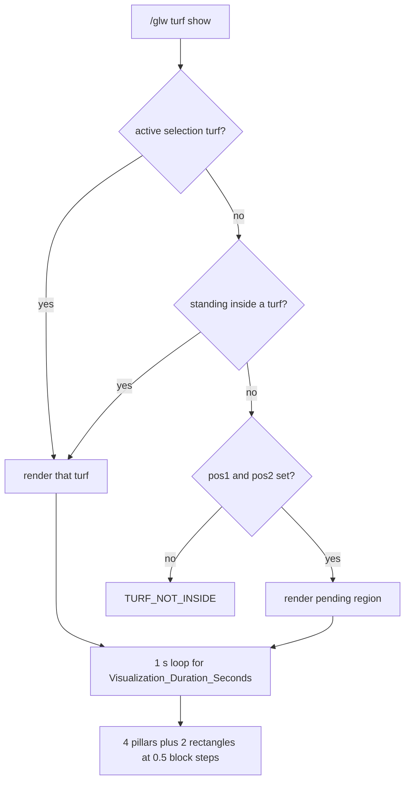
```mermaid
flowchart TD
  A["/glw turf show"] --> B{"active selection turf?"}
  B -->|"yes"| C["render that turf"]
  B -->|"no"| D{"standing inside a turf?"}
  D -->|"yes"| C
  D -->|"no"| E{"pos1 and pos2 set?"}
  E -->|"yes"| F["render pending region"]
  E -->|"no"| G["TURF_NOT_INSIDE"]
  C --> H["1 s loop for Visualization_Duration_Seconds"]
  F --> H
  H --> I["4 pillars plus 2 rectangles at 0.5 block steps"]
```

**State & persistence effects:** None.

**Edge cases & guards observed:** Particle count scales with the region perimeter: a 200×200 turf emits roughly
3,200 particles per refresh per viewer, every second, for 30 s by default. Nothing limits region size at creation,
and each viewer gets an independent task.

### W19: Boss bars and action bars

**Trigger:** `TurfEnterEvent` / `TurfExitEvent` / capture lifecycle events / player join & quit / a 1-Hz refresh.

**Steps:**
1. `TurfBossBarListener` (constructor line 81) schedules `refreshProgress` at 1 Hz **with no stored task handle**.
2. `showFor` builds a `BarPair`: an always-present consolidate bar titled `TURF_BOSSBAR_TITLE`, plus, for unclaimed
   turfs, a white claim bar titled `TURF_BOSSBAR_TITLE_UNCLAIMED`. Colour: RED for the defender gang, GREEN for the
   challenger gang, WHITE otherwise.
3. Viewers are: anyone inside, every online challenger-gang member, every online defender-gang member. `onExit`
   keeps bars for challenger/defender members and only tears them down for bystanders. `onJoin` rebuilds bars for
   in-flight contests the joiner's gang is involved in.
4. `refreshProgress` maps runtime progress onto the two bars and, when either advanced by more than 0.0005, plays
   `playCaptureTick` to every viewer of the consolidate bar.
5. `clearTurf` (on `TurfCapturedEvent` / `TurfCaptureFailedEvent`) removes the per-turf map entry and all bars.
6. `TurfPresenceBarListener` maintains a separate one-bar-per-viewer "Territory of X" bar for **owned** turfs only,
   refreshed on capture and on `TurfOwnerChangedEvent`.
7. `TurfActionBarListener.onEnter` picks one of six message variants (contesting CLAIM / contesting CONSOLIDATE /
   owned / unclaimed), sends a title when `Show_Enter_Title` is on, and always sends the action bar via
   `ActionBarManager`; `onExit` sends `TURF_EXIT`.

**Diagram:**
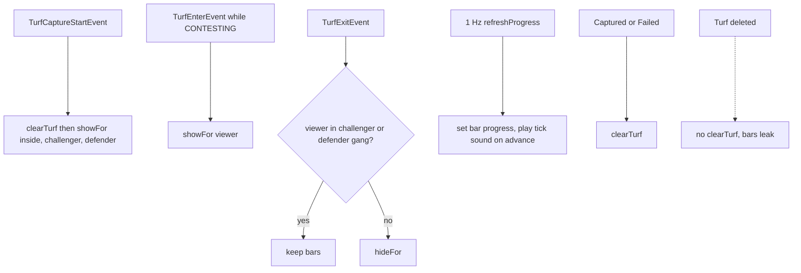
```mermaid
flowchart TD
  A["TurfCaptureStartEvent"] --> B["clearTurf then showFor inside, challenger, defender"]
  C["TurfEnterEvent while CONTESTING"] --> D["showFor viewer"]
  E["TurfExitEvent"] --> F{"viewer in challenger or defender gang?"}
  F -->|"yes"| G["keep bars"]
  F -->|"no"| H["hideFor"]
  I["1 Hz refreshProgress"] --> J["set bar progress, play tick sound on advance"]
  K["Captured or Failed"] --> L["clearTurf"]
  M["Turf deleted"] -.-> N["no clearTurf, bars leak"]
```

**State & persistence effects:** None persisted; all boss bars are in-memory `HashMap`s.

**Edge cases & guards observed:** `barsByTurf` is only cleaned by capture completion, cancel, `hideFor` and quit —
never by turf deletion or by an admin `setowner`. `refreshProgress` iterates `barsByTurf` while handlers can mutate
it, but everything runs on the main thread. The 1-Hz refresh task has no cancel path.

### W20: Quartermaster NPC lifecycle

**Trigger:** `/glw turf powerupnpc set|remove`, server boot, chunk load.

**Steps:**
1. `TurfPowerupNpcCommand` resolves the turf then calls `powerupNpcs.place(turfId, sender.getLocation(), null)` or
   `remove(turfId)`.
2. `TurfPowerupManager.place:89-94` removes any existing NPC for the turf, saves a `TurfPowerupData` row, and
   spawns.
3. `spawn:158-174` queues the data into `pending` when the target chunk is not loaded (Citizens' `spawn()` silently
   no-ops there) instead of force-loading; otherwise `TurfPowerupNpc.spawn` creates a `CivilianNpc` of the
   configured type and tags the Citizens NPC with `gangland.turfpowerup.turfid`.
4. `TurfPowerupChunkLoadListener` drains `pending` as chunks load.
5. `onInitialize(firstLoad)` (it is a `BeanLifecycle`) defers `spawnAllFromRepository` by 60 ticks; `onPreClear` and
   `onShutdown` despawn everything.
6. `remove:96-105` destroys the NPC and then calls `repository.loadAll()` to find and delete the matching row.

**Diagram:**
```mermaid
flowchart TD
  A["/glw turf powerupnpc set"] --> B["remove existing NPC for turf"]
  B --> C["save TurfPowerupData row"]
  C --> D{"target chunk loaded?"}
  D -->|"no"| E["queue in pending"]
  D -->|"yes"| F["spawn CivilianNpc, tag turf id metadata"]
  G["ChunkLoadEvent"] --> H["drain matching pending entries"]
  I["boot, 60 ticks after init"] --> J["spawnAllFromRepository"]
  K["reload or shutdown"] --> L["despawnAll"]
```

**State & persistence effects:** One `turf_powerup_npc` row per turf. `CivilianNpcFactory` sets
`NPC.Metadata.SHOULD_SAVE = false`, so Citizens does not double-persist the NPC.

**Edge cases & guards observed:** `remove` triggers a full table read for a single-row delete. The `pending` queue
is never bounded or retried on any trigger other than `ChunkLoadEvent`. The `TurfPowerupData.displayName` column is
always written null by the command (it passes `null`), so the panel title falls back to the literal
`"Quartermaster"`.

### W21: Friendly-fire protection for turf NPCs

**Trigger:** `EntityDamageByEntityEvent` and `WeaponRaytraceImpactEvent`, both at `HIGH`, `ignoreCancelled = true`.

**Steps:**
1. `TurfFriendlyFireListener.resolveTurfId` checks `TurfPowerupManager.getByEntity` then
   `TurfDefenderDeployer.findOwningTurfId` (a linear scan over every tracked defender).
2. Requires the turf to exist and be owned; resolves the attacker (direct player or projectile shooter).
3. `isFriendly` = same gang, or `attackerGang.isAlly(ownerGang)`.
4. Cancels the event so `CivilianDamageListener`'s MONITOR-priority self-defence never triggers against an ally.

**Diagram:**
```mermaid
flowchart TD
  A["damage event"] --> B{"victim is Quartermaster or tracked defender?"}
  B -->|"no"| C["ignore"]
  B -->|"yes"| D{"turf exists and is owned?"}
  D -->|"no"| C
  D -->|"yes"| E{"attacker is a player or their projectile?"}
  E -->|"no"| C
  E -->|"yes"| F{"same gang or ally?"}
  F -->|"no"| G["let damage through"]
  F -->|"yes"| H["cancel event"]
```

**State & persistence effects:** None.

**Edge cases & guards observed:** `findOwningTurfId` is O(turfs × defenders) per damage event. `isAlly` is checked
in one direction only (`attackerGang.isAlly(ownerGang)`), so a one-sided alliance record yields asymmetric
protection.

### W22: Persistence and restart behaviour

**Trigger:** server boot (`TurfConfig` bean creation) and shutdown.

**Steps:**
1. `TurfManager.initialize` (called from the `@Bean` method) clears the caches, `repository.loadAll()`, registers
   each turf (fresh IDLE runtime state), seeds `nextId = max(id)+1`, and wires the data supplier.
2. `TurfRepository.doLoadAll` reads positionally from `tableBackend().selectAll()` using hard casts:
   `(int) result[v++]` for the four bounds, `(double)` for income, `(long)` for the two timestamps; a null
   `owner_gang_id` maps to `null`.
3. `ActiveBuffManager.initialize` and `GarrisonManager.initialize` do the same for their tables.
4. `TurfPowerupManager.onInitialize` re-spawns Quartermasters 60 ticks later (chunk-deferred as needed).
5. On shutdown, `context.shutdownBeans()` runs `BeanLifecycle` beans (`TurfPowerupManager` despawns NPCs,
   `PowerupRegistryLoader` empties the registry), then `PeriodicalUpdates.forceUpdate()` flushes every repository
   through its data supplier, then connections close.

**Diagram:**
```mermaid
flowchart TD
  A["boot"] --> B["TurfManager.initialize loads turf rows"]
  B --> C["fresh IDLE runtime state per turf"]
  C --> D["ActiveBuffManager drops expired buffs, loads the rest"]
  D --> E["GarrisonManager loads stock"]
  E --> F["TurfPowerupManager respawns NPCs after 60 ticks"]
  G["shutdown"] --> H["shutdownBeans despawns NPCs"]
  H --> I["PeriodicalUpdates.forceUpdate flushes all suppliers"]
  I --> J["connections closed"]
```

**State & persistence effects:** Survives restart: owner, bounds, income, `lastCaptureTimestamp`, active buffs with
absolute expiry, garrison stock, Quartermaster placement. Lost on restart (by design): capture state, phase,
progress, challenger, presence cache, wand selections.

**Edge cases & guards observed:** An in-flight capture is silently dropped — no message to the attackers, no
refund, and the boss bars simply never come back. `nextId` reuse after deleting the highest-id turf can attach
orphaned `turf_garrison` / `turf_active_buff` / `turf_powerup_npc` rows to a brand-new turf.

### W23: Reload behaviour

**Trigger:** `GanglandContext.reloadBeans()` → `beanFactory.reloadLifecycleBeans()`.

**Steps:**
1. Only beans implementing `BeanLifecycle` participate. In the whole turf surface that is
   `PowerupRegistryLoader` (turf module) and `TurfPowerupManager` (cops-n-crooks).
2. `PowerupRegistryLoader.onClear` empties the catalogue; `onInitialize` re-reads `turf_powerups.yml`, keeping the
   previous catalogue if the file parses to zero entries.
3. `TurfPowerupManager.onPreClear`/`onClear` despawn and clear; `onInitialize` re-spawns after 60 ticks.
4. Everything else — `CaptureSettings`, `TurfContributionSettings`, `TurfLocationTracker`,
   `TurfIncomeDistributor`, `GangPresenceTracker`, `TurfContributionTickTask`, `ActiveBuffManager`,
   `GarrisonManager`, `TurfManager`, `TurfNpcsConfigLoader`, `TurfDefenderDeployer` — is a plain bean that is not
   recreated and whose `stop()` / `shutdown()` is never invoked (grep-verified: no callers).

**Diagram:**
```mermaid
flowchart TD
  A["/glw reload"] --> B["reloadLifecycleBeans"]
  B --> C["PowerupRegistryLoader reloads turf_powerups.yml"]
  B --> D["TurfPowerupManager despawns then respawns Quartermasters"]
  E["CaptureSettings, contribution settings, turf_npcs.yml"] --> F["unchanged until a full restart"]
  G["running capture tasks and in-flight contests"] --> H["keep running untouched"]
```

**State & persistence effects:** In-flight captures continue across a reload unaffected (their tasks are not
cancelled). Turfs are not re-read from the database.

**Edge cases & guards observed:** Editing any `Turf.*` key in `settings.yml` and reloading has no effect;
`turf_npcs.yml` is only read in `TurfNpcsConfigLoader`'s constructor. Because `TurfDefenderDeployer.stop()` never
runs, defenders deployed before a reload stay tracked and continue to be retargeted by a task that survived.

## Cross-feature Dependencies

- **Depends on:**
  - Gang domain (`gangland-infra/gangland-domain`): `Gang` (id, name, displayName, allies, `EconomyHandler`,
    `members`, `lastMemberOnlineAt`), `Member.increaseContribution`, `User`, and the
    `GangLookupContract` / `UserLookupContract` seams.
  - Keystone: `BeanFactory` / `@Bean` / `@Configuration` / `BeanLifecycle`, `AbstractRepository` + `Table` +
    `DatabaseBackend`, the command argument tree (`Command`, `SubArgument`, `OptionalArgument`),
    `FileManager` + the config `NodeReader` DSL, `SoundEffect`, `ChatUtil`, `ActionBarManager`, `ItemBuilder`,
    `NumberUtil`, `TimeUtil`, `PermissionManager`, `Currency` / `EconomyException`.
  - cops-n-crooks NPC infrastructure: `CivilianService`, `CivilianSpawnManager`, `CivilianNpc`, `CivilianState`,
    `civilians.yml` types `quartermaster` and `turf_defender`.
  - `gangland-impl` UI framework: `MultiPanelInventory`, `Panel`, `InventoryHandler`, `InventoryUtil`, `Fill`.
  - `gangland-weapon`: `WeaponRaytraceImpactEvent` (friendly-fire listener only).
  - XSeries: `XMaterial` (wand), `XParticle` (visualisation).
- **Depended on by:**
  - cops-n-crooks `npc/turf/**` (views and the friendly-fire listener import `Turf`, `TurfManager`,
    `GarrisonManager`, `ActiveBuffManager`, `PowerupRegistry`).
  - `gangland-impl` command tree and bean configuration.
  - Nothing in the gang, bank, cop, weapon or shop features reads turf state — the dependency is one-way.

## Observations & Potential Issues

| # | Location | Observation | Risk | Confidence |
|---|---|---|---|---|
| 1 | `CaptureService.java:395-408` | `turf.setOwnerGangId(newOwnerId)` + `turfs.persist(turf)` run **before** the `newOwner != null` check, so a capture completing against a disbanded gang writes a dangling owner id and fires no `TurfCapturedEvent` — boss bars, defenders and the engaged Quartermaster are never cleaned up until the income task auto-releases the turf. | High | High |
| 2 | `ActiveBuffManager` vs. `CaptureService` / `TurfPowerupGarrisonView` | `EffectType.CAPTURE_DEFENSE_BONUS` and `GARRISON_DISCOUNT` have **no consumer anywhere in the repo** (`effectiveMultiplier` is called only by `TurfIncomeDistributor:70` with `INCOME_MULTIPLIER`). `reinforced_defense` (8000) and `garrison_discount` (2500) in `turf_powerups.yml` are purchasable and do nothing. | High | High |
| 3 | `TurfManager.java:118-126` | `delete` does not cancel an in-flight contest, fire `TurfCaptureFailedEvent`, clear boss bars, delete `turf_garrison` / `turf_active_buff` / `turf_powerup_npc` rows, or despawn the Quartermaster. `TurfBossBarListener.barsByTurf` keeps the entry forever (`refreshProgress` just `continue`s). | High | High |
| 4 | `TurfSetOwnerCommand.java:71-87` | Admin ownership change resets the runtime state but fires no `TurfCaptureFailedEvent`, so capture boss bars persist, defenders are not recalled and the Quartermaster stays in COMBAT against the (now irrelevant) challenger. | High | High |
| 5 | `TurfManager.java:56` + `TurfCreateCommand.java:103` | `nextId` is seeded to `max(existingId)+1`, so deleting the highest-id turf and restarting **re-uses that id**; the new turf then inherits the deleted turf's orphaned garrison stock, active buffs and Quartermaster row (all keyed by `turf_id` with no FK). | High | High |
| 6 | `TurfLocationTracker.java:31,63-66` + `TurfConfig.java:138` | The class implements `Listener` and declares `onQuit`, but has no `@ListenerHandler` and is created as a `@Bean`; Keystone registers only `@ListenerHandler` classes (`ListenerService:151`), so the handler never fires and `playerTurfCache` grows unbounded for the server's lifetime. | Medium | High |
| 7 | `TurfConfig.java` (whole file) + grep for `stop()` | No turf bean implements `BeanLifecycle`. `TurfLocationTracker.stop`, `TurfIncomeDistributor.stop`, `GangPresenceTracker.stop`, `TurfContributionTickTask.stop`, `ActiveBuffManager.shutdown` and `TurfDefenderDeployer.stop` have **zero callers**. A `/glw reload` therefore re-reads no `Turf.*` setting and cancels no task. | Medium | High |
| 8 | `TurfBossBarListener.java:81` | The 1-Hz refresh task is scheduled inside the constructor with no stored handle and no cancel path. | Medium | High |
| 9 | `GangPresenceTracker.java:52-53` | The inactivity-release task is scheduled with an initial delay equal to its 24 h period, so a server restarted daily never runs `InactivityReleaseTask`. | Medium | High |
| 10 | `InactivityReleaseTask.java:37-46` and `TurfIncomeDistributor.java:65-68` | Auto-release nulls the owner and persists, but fires no `TurfOwnerChangedEvent` — the presence boss bar stays stale and the "owner cleared" sound never plays, contradicting `TurfSoundContract.playOwnerCleared`'s javadoc. Defenders/Quartermaster are not touched. | Medium | High |
| 11 | `CaptureService.java:425-443` | `dominantGang`'s `exclude` parameter is dead (both call sites pass `null`) and the CLAIM≤0 branch (`:360-364`) is documented as unreachable — the "push Phase 1 to zero and steal the contest" reward described in `CapturePhase`'s javadoc and in `settings.yml`'s comment (lines 724-728) is **not implemented**. | Medium | High |
| 12 | `CaptureService.java:221-261` | `Abandon_Grace_Seconds` is never consulted on the owned-turf path; abandonment is handled by a `-1` decay instead, so an emptied contest lingers for up to `Duration_Seconds` rather than the configured grace. `lastChallengerSeenAt` is written but never read there. | Medium | High |
| 13 | `CaptureService.java:390` | `int newOwnerId = state.getChallengerGangId();` auto-unboxes a `@Nullable Integer`. Currently unreachable with a null challenger, but a single new completion path would turn it into an NPE inside a 1-Hz task. | Medium | Medium |
| 14 | `TurfRepository.java:42-49` | Hard casts `(int) result[v++]` / `(long) result[v]` where the sibling repositories use `((Number) x).intValue()`. If the SQLite/MySQL backend hands back a `Long` for an INTEGER column, turf loading dies with a `ClassCastException`. | Medium | Medium |
| 15 | `TurfTable.java:23` + `TurfRepository.java:58` | `income_amount` is persisted as a SQL `Double` while `Turf.incomeAmount` is a `BigDecimal` — lossy round-trip on every restart. | Low | High |
| 16 | `TurfContributionListener.java:64` | Hardcoded `if (y < 0 || y > 319) continue;` excludes players below y=0 in 1.18+ worlds from capture/defence bonuses, contradicting `CuboidRegion`'s Y-agnostic containment. | Medium | High |
| 17 | `TurfPowerupGarrisonView.java:39` | `PER_DEFENDER_COST = BigDecimal.valueOf(1500)` is hardcoded (the class javadoc admits it should be in `turf_powerups.yml`), and the `GARRISON_DISCOUNT` buff that is supposed to modify it is never applied. | Medium | High |
| 18 | `TurfPowerupBuffCatalogueView.java:31-34,57-63` | Only slots 9-17 render buffs, so a catalogue with more than 9 entries silently hides the rest with no pagination. | Medium | High |
| 19 | `TurfPowerupFlowSession` + both `attemptBuy` methods | The session caches the `Turf` and gangs at open time and nothing re-validates ownership on click, so a capture that lands while the panel is open lets the previous owner (or an ally) pay for a buff/defender on the enemy's turf. | Medium | High |
| 20 | `GarrisonDeployListener.java:48-57` | The whole garrison stock is consumed by the first `TurfCaptureStartEvent`; a contest that starts and cancels in one tick burns everything. All defenders also spawn at one surface column derived from `getHighestBlockYAt`, which can be a roof or far from the fight. | Medium | High |
| 21 | `TurfVisualization.java:83-93` + `TurfCreateCommand` | No minimum/maximum region size is validated at creation, and `/glw turf show` emits particles along the entire perimeter at 0.5-block steps every second per viewer — a large turf is a visible TPS cost. | Medium | High |
| 22 | `message/message_es.yml` | None of the 59 `TURF_*` message paths present in `message_en.yml` exist in the Spanish file (verified by path diff) — the whole feature is untranslated for that locale. | Medium | High |
| 23 | `TurfPowerupMenuView`, `TurfPowerupGarrisonView`, `TurfPowerupBuffCatalogueView`, `TurfPowerupOpenContractImpl:36-60`, `WandListener:49-52`, `TurfWandCommand:38-39`, `TurfStatusCommand:72-74` | User-facing strings are hardcoded English (and `$` is hardcoded instead of `Settings.getMoneySymbol()`), bypassing the `TurfMessageContract` convention used everywhere else in the feature. | Medium | High |
| 24 | `CaptureService.java:169-175` and `TurfFriendlyFireListener.java:102-107` | Ally checks use a single direction (`other.isAlly(ownerGang)` / `attackerGang.isAlly(ownerGang)`); if `GangAlliance` records are not written on both gangs, defender-folding and friendly-fire protection are asymmetric. | Medium | Low |
| 25 | `GangManager.remove` (gangland-domain:49) | Disbanding a gang does not release its turfs; cleanup only happens on the 10-minute income pass or the daily inactivity sweep. In between, `findById` returns null and a running contest can still complete into the dead id (see #1). | Medium | High |
| 26 | `CaptureService.java:224` | On an owned turf only the registered challenger gang's members count; members of any other gang inside are ignored entirely (they neither help nor hinder and cannot start their own contest). Intentional per the javadoc, but it means a rival gang can body-block nothing. | Low | High |
| 27 | `TurfStatusCommand.java:56-93` and `TurfRuntimeState` | After a restart a turf still inside its cooldown window reports `IDLE`, because the COOLDOWN enum value is not persisted while `lastCaptureTimestamp` is. | Low | High |
| 28 | `TurfCaptureFailedEvent.Reason.CANCELLED` | Declared but never fired anywhere. | Low | High |
| 29 | `Selection.java:34-37` | A cross-world corner wipes both corners, so `TURF_CREATE_FAIL_CROSS_WORLD` is effectively unreachable through the wand and `/glw turf pos1|pos2` paths. `TURF_CREATE_FAIL_ID_TAKEN` is never sent at all (no duplicate-name check). | Low | High |
| 30 | `WandSelectionManager.ADMIN_PERMISSION` vs. `SubArgument` permissions | The wand uses `gangland.turf.admin` while every subcommand uses `gangland.command.turf.` — two disjoint namespaces for the same admin surface. | Low | High |
| 31 | `TurfBuffCommand.java:93` | `/glw turf buff <id>` activates any catalogue buff **free of charge** on the selected turf. Intentional (staff tool) but the only gate is the `gangland.command.turf.buff` permission. | Low | High |
| 32 | `ActiveBuffManager.java:126-142` | `prune` issues one synchronous `repository.delete` per expired buff from a 1-Hz main-thread task. | Low | High |
| 33 | `TurfPowerupManager.java:100-104` | `remove(turfId)` calls `repository.loadAll()` (a full table read) to find one row to delete. | Low | High |
| 34 | `TurfManager.java:79-81,138` | `getTurfsInWorld` returns the live `ArrayList` (not a copy) held inside a `ConcurrentHashMap`, and `delete` mutates it. Safe today only because everything runs on the main thread. | Low | Medium |
| 35 | `TurfDefenderDeployer.findOwningTurfId:115-125` | Linear scan over every group × defender on **every** `EntityDamageByEntityEvent` and `WeaponRaytraceImpactEvent`. | Low | High |
| 36 | `TurfNpcsConfigLoader.java:47` | `load()` is only called from the constructor, so `turf_npcs.yml` is never re-read; `TurfDefenderConfig` / `TurfPowerupSettings` are boot-time snapshots. | Low | High |
| 37 | `TurfIncomeDistributor.distribute` | Income is paid with no online-member requirement, no upkeep, and no cap on the aggregated `INCOME_MULTIPLIER` product (stacking is multiplicative and unbounded). | Low | High |
| 38 | `TurfPowerupNpcCommand.java:70` | Always passes `null` for the display name, so `TurfPowerupData.display_name` is always null and the panel title falls back to the literal `"Quartermaster"`. | Low | High |
| 39 | `Turf.setDisplayName` | No `/glw turf rename` command exists; the setter has no caller, so a turf's name is fixed at creation. | Low | High |

## Test Surface

**Pure-logic candidates (plain JUnit, no Bukkit):**
- `CuboidRegion` normalisation, `overlaps` (shared-edge, shared-corner, disjoint, different world) and the
  world-name comparison in `contains` (a `Location` mock is the only Bukkit touch; a thin fake works).
- `TurfManager.allocateId` seeding (`max+1`), id **re-use** after deleting the highest-id turf and re-initialising,
  `findConflict` per-world scoping, `delete` index consistency (`turfsById`, `turfsByWorld`, `runtimeStates`).
- `CaptureService` maths, driven through a fake `TurfManager` / `GangLookupContract` / `UserLookupContract` /
  `TurfSoundContract`: owned-turf `net` arithmetic (1v0, 2v0, 2v2, 2v3), clamping at 0/100, milestone events firing
  only on upward crossings, the empty-turf `-1` decay, `ABANDONED` vs `DEFENDED` selection, CLAIM global fill,
  CLAIM→CONSOLIDATE election, the CONSOLIDATE→CLAIM(100, null challenger) rollback, and abandon-grace expiry.
  These need `Bukkit.getPluginManager().callEvent` and `Bukkit.getPlayer` stubbed (MockBukkit or a static mock).
- `CaptureService.dominantGang` tie/empty/single-entry behaviour, plus a regression test asserting whether the
  `exclude` parameter is meant to be live (Observation #11).
- `CaptureService.isCapturable` cooldown / unclaimed / missing-owner / post-logoff-grace branches.
- `ActiveBuffManager.effectiveMultiplier` identity values, multiplicative vs additive aggregation, expired-buff
  exclusion; `ActiveTurfBuff.isExpired` / `remainingMillis` boundaries.
- `GarrisonManager.add` / `consume` clamping (`consume` more than stock, non-positive deltas, missing rows).
- `PowerupRegistryLoader.parseDefinition` — unknown `Effect_Type`, unparseable `Cost`, underscore-separated numbers,
  zero-entry catalogue keeping the previous state, and `PowerupRegistry.replaceAll` atomicity/defensive copying.
- `Selection.set` world-mismatch reset and `activeTurfId` invalidation; `TurfSelectionResolver` fallback order and
  stale-id clearing.
- `GangDisplayNameResolver` blank/colour-only/null inputs.

**Needs Bukkit/Keystone mocks:**
- `TurfLocationTracker.tick` enter/exit transition matrix (no turf → turf, turf → turf, turf → no turf, world with
  no turfs) and the missing quit handler (Observation #6).
- All five listeners: boss-bar show/hide/clear bookkeeping (especially `barsByTurf` leaking after turf delete and
  after `setowner`), presence-bar colour matrix, action-bar message selection across the six branches, feedback
  listener cooldown/protection maths.
- `GarrisonDeployListener` deploy/consume/recall sequencing, including the start→cancel→start stock-burn case.
- `TurfContributionListener.awardPresent` boundary coordinates (min/max X and Z inclusive, y = -1 and y = 320).
- `TurfSetOwnerCommand.resetCaptureState`, `TurfCreateCommand` validation branches, `TurfGarrisonCommand` delta
  logic — all need a `CommandSender` and the Keystone argument tree.
- Repository round-trips against an in-memory SQLite backend (follow `RankRepositorySpiTest` and the CLAUDE.md
  `@TempDir(cleanup = NEVER)` + `MockPluginFactory.releaseDbFiles` rules): `TurfRepository.doLoadAll` cast safety,
  null `owner_gang_id`, `BigDecimal` income precision, and expired-buff pruning at load.

**Integration-only (real server):**
- Citizens-backed Quartermaster placement, chunk-deferred spawn, right-click routing, engage/disengage state flips,
  and `SHOULD_SAVE = false` behaviour across restarts.
- `TurfDefenderDeployer` spawn/retarget/recall against live `CivilianNpc` AI and the friendly-fire cancel path
  (including `WeaponRaytraceImpactEvent`).
- Boss bar / title / action bar rendering and the 1-Hz tick sound.
- Particle visualisation cost on a large region.
- Full restart persistence matrix and `/glw reload` behaviour (Observations #7 and #36).
- Economy debits through Vault for the two purchase flows.

**Existing tests covering this area:** none. There are no `*Test*.java` files anywhere under
`gangland-features/gangland-turf`, `cops-n-crooks/npc/turf`, or the turf packages of `gangland-impl`, and
`documentation/tests/features/` has no `turf.md` checklist.

---

[Audit index](workflow-audit) · [← Civilians & Traders](workflow-audit-09-civilians-traders-shops) · [Weapons →](workflow-audit-11-weapons)
