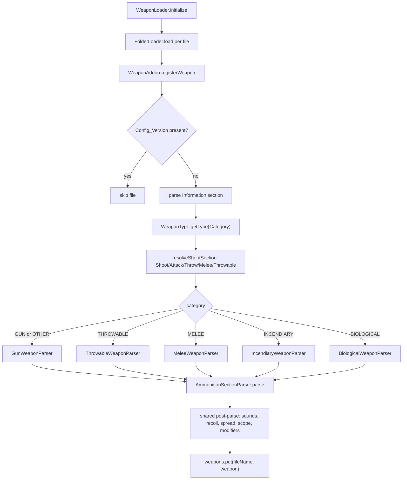
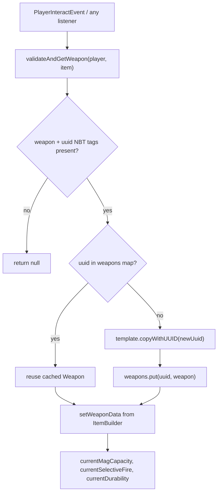
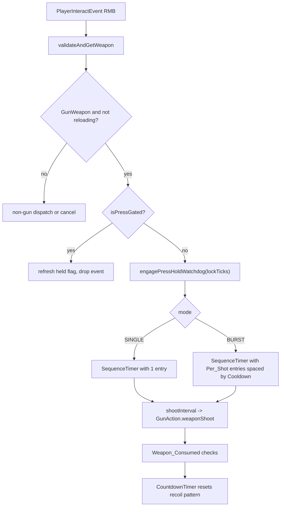
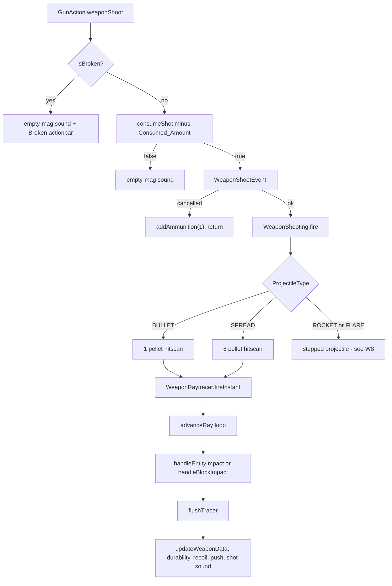
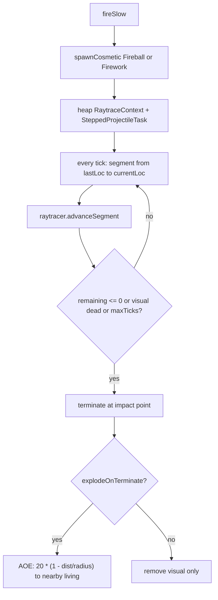
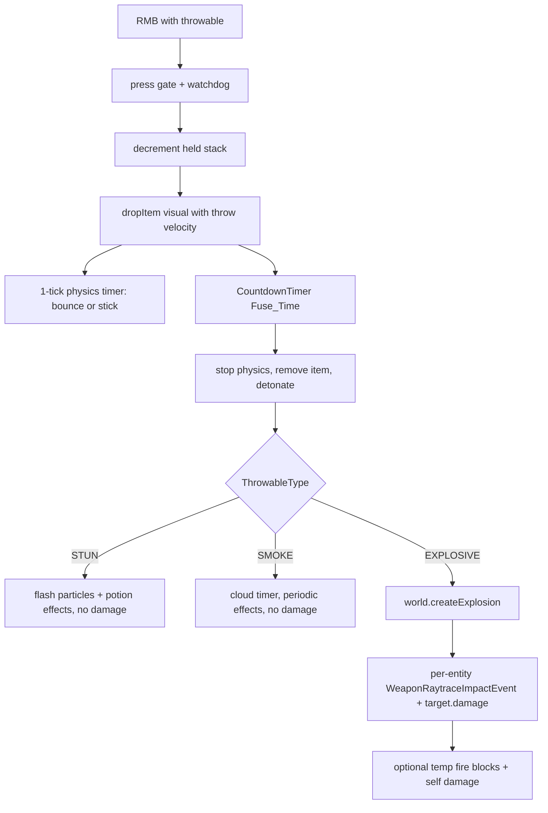
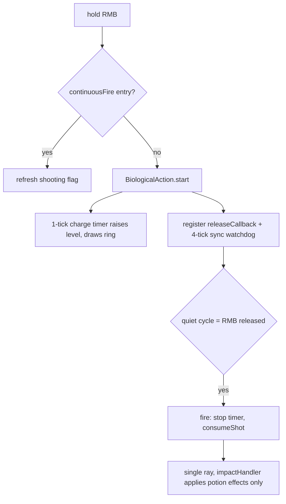
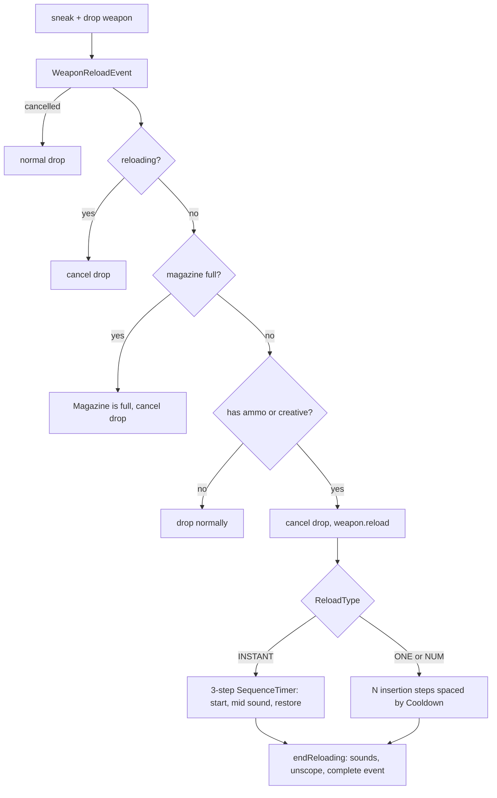

# Weapons, Ammunition & Projectiles

<!-- preface:start -->
> **How to use this file.** This is a code-traced audit of *Weapons, Ammunition & Projectiles* in Gangland Warfare, taken on
> 2026-09-02 from branch `0.8.1` (Keystone 1.7.3). It describes what the code **does today**, workflow by workflow,
> so an agent can fix a bug, tweak behaviour, plan a feature, or write tests without re-tracing the system.
>
> - **Citations are pointers, not proof.** Every `File.java:line` was checked after writing, but the code moves.
>   Before you change anything, open the cited file and grep the symbol named in the sentence; trust the class and
>   method names over the line number. A citation ending in `:line-unverified` could not be re-located.
> - **Observations are findings, not confirmed bugs.** Each row carries the tracer's confidence. Rows prefixed
>   `WITHDRAWN:` were disproved during verification and are kept only so the numbering stays stable. Reproduce a
>   High-risk row in code (or a test) before fixing it.
> - **Sections.** *Components* names the classes; *Configuration & Data* the YAML keys, tables and message keys;
>   *Workflows* (`W1`, `W2`, …) the execution paths with trigger, steps, diagram, persistence effects and guards;
>   *Cross-feature Dependencies* what breaks elsewhere if you change this; *Test Surface* what can be unit-tested
>   with plain JUnit/Mockito versus what needs Bukkit/Keystone mocks or a live server.
> - **Conventions live elsewhere.** For *how* to add or change code in this repo, follow `CLAUDE.md` at the repo
>   root (Spigot-only APIs, method-brace style, Keystone at provided scope, the SQLite test teardown rules), the
>   `command-create` and `panel-create` skills for new commands and GUI panels, and the feedback rules in the
>   project memory (YAML key style, `SoundEffect` for sounds, `ItemRefresher` per item type, `setDataSupplier`
>   for every repository, no Paper APIs).
> - **Risk stars** on the rendered page: three stars = High (a player can hit it in normal play), two = Medium
>   (situational), one = Low (cosmetic or unlikely).

Rendered page with diagrams and a table of contents: https://claude.ai/code/artifact/48a0fd29-5ad2-43ea-b05f-5d9c38e82196
<!-- preface:end -->

> Diagrams below are Mermaid source; the rendered version with drawn diagrams is the linked page above.

## Overview

The weapon system lives almost entirely in `gangland-features/gangland-weapon` (package `org.luckyraven.gangland.weapon`), with thin wiring, commands, persistence and item-conversion adapters in `gangland-impl`. Weapon definitions are one YAML file per weapon under `gangland-impl/src/main/resources/weapon/`; `WeaponAddon` parses them through Keystone's `NodeReader`/`ConfigReport` chain and dispatches to one of five type parsers (gun, throwable, melee, incendiary, biological), producing a `Weapon` template registered by file name. At runtime `WeaponService`/`WeaponManager` mint per-item `Weapon` instances keyed by a UUID stamped in item NBT; only `uuid` + `type` are persisted to the `weapon` table — magazine, durability and fire mode live in the ItemStack's NBT tags and are re-read on every interaction.

All five action types converge on one server-side hit-detection engine, `WeaponRaytracer`, which fires a `WeaponRaytraceImpactEvent` per impact and either runs a default damage pipeline (guns) or hands off to a per-request `impactHandler` (melee/incendiary/biological). Firing is triggered from a single `PlayerInteractEvent` handler in `WeaponInteract`, which implements one-shot-per-press for SINGLE/BURST with a wall-clock cooldown gate plus a release-detection watchdog, and hold-to-fire for AUTO via `FullAutoTask`. Reloading is a `SequenceTimer`-driven state machine (`InstantReload` / `NumberedReload`) that consumes ammunition ItemStacks matched from `items/ammunition.yml`.

Behaviour diverges sharply between action types: only guns consume magazine ammo on the shot path, only guns and incendiary write updated NBT back to the held item, only guns/rockets use `ProjectileData`, and only guns get the default damage pipeline. A refactor scoped to `GunAction` would miss four other action classes with materially different semantics (see W9–W12 and the divergence table in **Observations**).

## Components

| Class | Location | Role |
|---|---|---|
| `Weapon` | `gangland-features/gangland-weapon/.../weapon/Weapon.java` | Abstract base: identity, mag/durability/selective-fire runtime state, NBT tag writing, item build, scope, push, clone |
| `WeaponType` | `.../weapon/types/WeaponType.java` | GUN / MELEE / THROWABLE / INCENDIARY / BIOLOGICAL / OTHER; `getType(String)` with aliases |
| `WeaponTag` | `.../weapon/WeaponTag.java` | NBT tag enum: `uuid`, `weapon`, `selective-fire`, `ammo-left` |
| `SelectiveFire` | `.../weapon/SelectiveFire.java` | AUTO/BURST/SINGLE + `getNextState(Set)` restricted cycle |
| `WeaponService` | `.../weapon/WeaponService.java` | Runtime registry `Map<UUID,Weapon>`, NBT read/write sync, `validateAndGetWeapon` |
| `WeaponManager` | `gangland-impl/.../weapon/WeaponManager.java` | `WeaponService` + `BeanLifecycle`; loads/persists via `WeaponRepository` |
| `WeaponAddon` | `.../weapon/configuration/WeaponAddon.java` | YAML → `Weapon` template registry keyed by file name |
| `AmmunitionAddon` | `.../weapon/configuration/AmmunitionAddon.java` | Parses `items/ammunition.yml` (raw Bukkit `FileConfiguration`, not `NodeReader`) |
| `AmmunitionManager` / `Ammunition` | `.../weapon/ammo/` | Ammo registry; ammo ItemStack build + `ammo` NBT tag |
| `WeaponLoader` | `gangland-impl/.../file/configuration/weapon/WeaponLoader.java` | Keystone `FolderLoader` over `plugins/.../weapon/` |
| `*WeaponParser` (5) | `.../weapon/configuration/parser/` | Per-category `Shoot:` parsing |
| `AmmunitionSectionParser`, `SelectiveFireSectionParser`, `ModifiersSectionParser` | same package | Shared sub-section parsers |
| `WeaponBaseData` | same package | Record of the shared `Information:` fields |
| 15 DTOs | `.../weapon/dto/` | `AmmunitionData`, `BiologicalData`, `DamageData`, `DurabilityData`, `IncendiaryData`, `MeleeData`, `ModifiersData`, `ProjectileData`, `RecoilData`, `ReloadActionBarData`, `ReloadData`, `ScopeData`, `SoundData`, `SpreadData`, `ThrowableData` |
| `WeaponInteract` | `.../weapon/listener/WeaponInteract.java` (723 lines) | The single firing entry point; press gates, watchdogs, per-type dispatch |
| `GunAction` / `FullAutoTask` / `GunWeapon` | `.../weapon/types/gun/` | Gun shot pipeline; WeaponMechanics-derived shots-per-second table |
| `MeleeAction` / `MeleeWeapon` | `.../weapon/types/melee/` | 5-ray cone swing, per-swing dedup, AP damage split |
| `ThrowableAction` / `ThrowableWeapon` / `ThrowableType` | `.../weapon/types/throwable/` | Item-entity grenade physics, fuse, EXPLOSIVE/SMOKE/STUN detonation |
| `IncendiaryAction` / `IncendiaryWeapon` | `.../weapon/types/incendiary/` | Random-cone flame rays, fire-block placement |
| `BiologicalAction` / `BiologicalWeapon` | `.../weapon/types/biological/` | Charge-on-hold, fire-on-release, potion effects |
| `WeaponRaytracer` | `.../weapon/raytrace/WeaponRaytracer.java` (589 lines) | Unified hit detection, damage, penetration/ricochet, tracer particles |
| `RaytraceRequest` / `RaytraceContext` / `ProjectileState` | `.../weapon/raytrace/`, `.../weapon/projectile/` | Immutable request, mutable per-shot state, damage multipliers/counters |
| `WeaponShooting` | `.../weapon/raytrace/WeaponShooting.java` | Dispatch: BULLET/SPREAD → hitscan, ROCKET/FLARE → stepped |
| `SteppedProjectileTask` | `.../weapon/raytrace/` | Per-tick segment scan behind a cosmetic Bukkit projectile; terminal explosion |
| `WeaponVisualSpawner` | `.../weapon/raytrace/` | Spawns + registers cosmetic projectiles so legacy listeners ignore them |
| `WeaponMuzzle` | `.../weapon/raytrace/` | Right-hand muzzle offset helper |
| `Reload` / `InstantReload` / `NumberedReload` / `ReloadType` | `.../weapon/reload/` | Reload state machine + `SequenceTimer` sequencing |
| `RecoilManager` / `SpreadManager` | `.../weapon/projectile/recoil,spread/` | Recoil pattern index, spread accumulation |
| `DurabilityCalculator` | `.../weapon/durability/` | Weapon durability ⇄ item damage-bar conversion |
| `ModifierHandler`, `BlockDamageManager`, `BreakMode`, 6 modifier records | `.../weapon/modifiers/` | AP/flat damage math, penetration gates, block crack/regen |
| `WearableService` | `.../weapon/wearable/` | Armor-based damage/crit/fire-tick reduction (extended by `WearableAddon` in impl) |
| `PluginFireRegistry` + `PluginFireProtectionListener` | `.../weapon/fire/`, `.../listener/fire/` | Makes plugin-placed FIRE blocks non-spreading |
| `EmptyMagSoundGate` | `.../weapon/util/` | Static gate throttling empty-mag click to once per press |
| `BlockGroupResolver`, `PotionEffectParser` | `.../weapon/util/` | Block-group DSL; `EFFECT-duration[-amplifier]` tokens |
| 5 listeners | `.../weapon/listener/**` | `ScopeJumpListener`, `WeaponReloadListener`, `WeaponDroppedListener`, `WeaponItemSpawnListener`, `WeaponSelectiveFireChangeListener`, `ProjectileDamageListener`, `PluginFireProtectionListener` |
| `WeaponRepository` / `WeaponTable` | `gangland-impl/.../database/` | Persists `uuid`, `type` only |
| `WeaponConverter` / `WeaponRefresher` / `WeaponItemSerializer` | `gangland-impl/.../item/` | `weapon:<name>` item-ref conversion, shop refresh, NBT extraction |
| `AmmunitionConverter` / `AmmunitionItemRefresher` / `AmmunitionItemSerializer` | `gangland-impl/.../item/` | Same for `ammo:`/`ammunition:` refs |
| `CompatibilityWorker` / `RecoilCompatibility` / `Recoil_1_21_R7` | `gangland-compatibility/` | Per-revision camera-rotation packet for recoil |

## Configuration & Data

### YAML files and notable keys

**`gangland-impl/src/main/resources/weapon/*.yml`** — 22 files: `awp`, `crowbar`, `flamethrower`, `flashbang`, `golden_ak47`, `grenade`, `knife`, `machete`, `minigun`, `molotov`, `mp5`, `pistol`, `ray_gun`, `revolver`, `rifle`, `rocket_launcher`, `sawn_off`, `shotgun`, `smoke_grenade`, `steyr_aug`, `syringe_gun`, `tomahawk`. The **file name (lowercased) is the registry key** (`WeaponAddon.registerWeapon`, `WeaponAddon.java:44`), not any key inside the file.

Shared schema (`WeaponAddon.java:53-126`):
- `Config_Version` — if present, the file is **skipped entirely** (`WeaponAddon.java:48-51`). Used to short-circuit non-weapon files in the folder.
- `Information:` (required) — `Name` (required), `Category` (required), `Material` (required, via `XMaterial`, falls back to `FEATHER`), `Custom_Model_Data` (≥0, def 0), `Durability.Base` (required), `Durability.Change.On_Shot` (def 0), `Lore`, `Drop_Hologram` (def false).
- `Death_Messages:` — list; empty → null, falls back to global `Messages.DEAD_USING_WEAPON`.
- Shoot-section resolution order (`resolveShootSection`, `WeaponAddon.java:154-164`): `Shoot:` → `Attack:` → `Throw:` → `Melee:` → `Throwable:`.
- Post-parse shared sections applied to **all** categories: `Shoot.Selective_Fire`, `Shoot.Weapon_Consumed.Time`, `Shoot.Recoil.{Amount,Push,Power_Up,Pattern}` (pattern entries are `yaw;pitch` strings), `Shoot.Spread.{Starting_Spread,Time,Change.Base,Change.Bounds.{Reset_On_Bound,Min,Max}}`, `Shoot.Sound.*`, `Reload.Sound.*`, `Reload.Action_Bar.{Reloading,Opening}`, `Scope.{Level,Sound.*}`, `Modifiers.*`.
- Sound sub-keys (`applyShootSounds`, `WeaponAddon.java:242-268`): `Default_Sound`, `Custom_Sound`, `Empty_Default_Sound`, `Empty_Custom_Sound`, `Flyby_Range`, `Flyby_Default_Sound`, `Flyby_Custom_Sound`, `Impact_Default_Sound`, `Impact_Custom_Sound`. Each sound node is `{Sound, Volume(def 1.0), Pitch(def 1.0)}`.

Per-category `Shoot:` keys:
- **GUN** (`GunWeaponParser.java:28-123`): `Selective_Fire` (**required** — throws if absent), `Allowed_Modes` (optional list; defaults to `{Selective_Fire}`), `Projectile.{Speed,Type,Consumed_Amount,Per_Shot,Cooldown,Distance,Particle,Gravity}`, `Projectile.Damage.{Base,Explosion_Damage,Fire_Ticks,Head}`, `Projectile.Damage.Critical_Hit.{Chance(0-100),Amount}`, `Weapon_Consumed.Consume_On_Shot`. `Ammunition:` is **mandatory** for guns.
- **THROWABLE** (`ThrowableWeaponParser.java:34-82`): `Type` (EXPLOSIVE/SMOKE/STUN), `Fuse_Time` (def 60), `Explosion_Radius` (def 3.0), `Explosion_Damage` (def 6), `Fire_Ticks`, `Bounces`, `Max_Bounces` (def 5), `Sticky`, `Entity_Type` (def SNOWBALL), `Effects`, `Cloud_Duration`, `Cloud_Radius`, `Display_Item.{Material,Name,Lore,Custom_Model_Data}`. Validations: `Bounces`+`Sticky` together throws; `SMOKE` needs `Cloud_Duration>0`; `STUN` needs non-empty `Effects`.
- **MELEE** (`MeleeWeaponParser.java:24-43`): `Damage` (req), `Range` (req), `Cooldown` (def 10 ticks), `Knockback` (def 0.5).
- **INCENDIARY** (`IncendiaryWeaponParser.java:27-60`): `Cone_Angle` (def 30), `Range` (def 5), `Rate` (def 2), `Fire_Duration` (def 60), `Consume_Rate` (def 1).
- **BIOLOGICAL** (`BiologicalWeaponParser.java:28-62`): `Charge_Time_Per_Level` (def 20), `Max_Charge_Level` (def 3), `Range` (def 30), `Base_Damage` (def 4), `Effects_Per_Level` (list of `EFFECT-dur[-amp][,…]`).

`Ammunition:` / `Reload:` (`AmmunitionSectionParser.java:28-76`): `Ammunition.{Ammo_Type(req),Capacity,Consume(def 1),Restore(def=Capacity)}`; `Reload.{Cooldown,Type}` where `Type` is `instant` | `one` | `num-<n>` (the `-<n>` suffix sets the enum's shared `amount`).

`Modifiers:` custom DSLs (`ModifiersSectionParser.java`): `Break_Blocks` list of `<group>-<hits>[-RESTORE|CRACK_ONLY|DESTROY]`, `Penetration` `<blocks>-<entities>-<damageDrop>`, `Ricochet` list of `<maxBounces>-<mat[,mat]>-<damageMult>`, `Tracer` `<RRGGBB>-<fullLine>-<thickness>`, `Armor_Piercing` double, `Flat_Damage` double.

**`gangland-impl/src/main/resources/items/ammunition.yml`** — keys `9mm`, `7,62`, `5,56`, `flare`, `rocket`, `50_bmg`, `slugs`, `fuel_canister`, `pathogen_vial`; each with `Material`, `Custom_Model_Data`, `Name`, `Lore`. Parsed with raw Bukkit `ConfigurationSection` calls (no `NodeReader`, no `ConfigReport`), so bad keys are silently ignored. `flare` is registered but no shipped weapon references it (dead ammo entry).

**`settings.yml`** — the only weapon-facing block is `Block_Regeneration:` (line 647): `Restore_Delay_Ticks: 100`, `Regeneration_Delay_Ticks: 100`, `Regeneration_Step_Ticks: 4`, surfaced via `GanglandBlockRegenerationSettings` → `Settings.getBlock*Ticks()`.

### Database tables and repositories

`WeaponTable` (`gangland-impl/.../database/tables/weapon/WeaponTable.java`) declares table `weapon` with exactly two columns: `uuid` (unique, `UUID`) and `type` (`String`). `getData` writes `{uuid.toString(), weapon.getName()}`.

`WeaponRepository` (`@Repository(Weapon.class)`) loads all rows in `doLoadAll` and rebuilds each row as `weaponAddon.getWeapon(type).copyWithUUID(uuid)` (`WeaponRepository.java:44-63`); rows whose `type` no longer resolves are skipped silently. `WeaponManager.initialize()` injects the `WeaponAddon` into the repository, populates `WeaponService.weapons`, and wires `setDataSupplier(() -> getWeapons().values())` so `PeriodicalUpdates` upserts the whole registry.

**No magazine, durability, or fire-mode state is persisted** — those live in item NBT and are re-read by `WeaponService.setWeaponData` (`WeaponService.java:228-241`) on every `validateAndGetWeapon` call.

### Message keys / localization

`message/message_en.yml`:
- `Command.Weapons.Ammo.{Received,Gave}`, `Command.Weapons.Weapon.{Received,Gave,List_Header}` (lines 94-102).
- `Weapons.{Not_Valid_Ammo,Not_Valid_Weapon,Not_Valid_Amount,Killed_Player,Gun_Not_In_Inventory,Gun_Bought,Gun_Sold,Ammo_Not_In_Inventory,Ammo_Bought,Ammo_Sold,Not_Enough_Ammo}` (lines 634-645).
- `Death.Weapon` list — the global fallback used by `PlayerDeathListener.buildDeathMessage`.

**Hardcoded user-facing strings that bypass `Messages` entirely** (violates `feedback_settings_contract`): `"&cBroken"` (`GunAction.java:44`), `"&cMagazine is full!"` (`WeaponDroppedListener.java:66`), `"&6Selective Fire > "` (`WeaponSelectiveFireChangeListener.java:61`), `"§6Charging... §e[…]"` and `"&aReleased at charge level "` (`BiologicalAction.java:74,127` — the first also emits a literal `§`, violating `feedback_chat_color_codes`).

## Commands & Permissions

All weapon commands hang off the single `/glw` dispatcher. Keystone's `Command` derives the root node as `<prefix>.command.<label>` (`Keystone/keystone-command/.../command/Command.java:50`) with Gangland's prefix `gangland`, and `SubArgument` appends its own token (`SubArgument.java:33`), so the nodes are `gangland.command.weapon[.give|.info|.list]` and `gangland.command.ammo[...]`. The `true` flag in `super(gangland, "weapon", true)` marks the command player-only.

| Command | Class | Permission | What it does |
|---|---|---|---|
| `/glw weapon` | `WeaponCommand` (`@CommandHandler`, `gangland-impl/.../command/sub/weapon/WeaponCommand.java`) | `gangland.command.weapon` (player-only) | Shows the weapon help page |
| `/glw weapon give <name> [amount]` | `WeaponGiveCommand` | `gangland.command.weapon.give` | Builds `amount` copies via `weaponManager.getWeapon(player,null,name,true)` + `buildItem(player)`; overflow is dropped at the player's feet |
| `/glw weapon info [name]` | `WeaponInfoCommand` | `gangland.command.weapon.info` | With no arg: inspects the held item; with arg: reads the template from `WeaponAddon`. Prints name, category, material, CMD, durability, magazine, ammo type, reload type, selective fire |
| `/glw weapon list` | `WeaponListCommand` | `gangland.command.weapon.list` | Lists `weaponAddon.getWeaponKeys()` |
| `/glw ammo` (alias `ammunition`) | `AmmunitionCommand` | `gangland.command.ammo` (player-only) | Ammo help page |
| `/glw ammo give <name> [amount]` | `AmmunitionGiveCommand` | `gangland.command.ammo.give` | Splits into max-stack ItemStacks, `inventory.addItem`, drops overflow |
| `/glw ammo info [name]` | `AmmunitionInfoCommand` | `gangland.command.ammo.info` | Held-item or named ammo details |
| `/glw ammo list` | `AmmunitionListCommand` | `gangland.command.ammo.list` | Comma-joined ammo keys, header from `Messages.AMMO_LIST_HEADER` |

`commands.json` registers `weapon_help`, `weapon_list`, `weapon_give`, `weapon_info` and the matching `ammunition_*` entries (lines 466-497).

Tab completion for `weapon give` comes from `weaponLoader.getFiles()` (file names on disk), while `weapon info` completes from `weaponAddon.getWeaponKeys()` (successfully parsed weapons) — the two lists diverge when a file fails to parse.

## Events

| Event | Fired by | Handled by | Purpose |
|---|---|---|---|
| `WeaponShootEvent` (cancellable) | `GunAction.weaponShoot` (`GunAction.java:61-62`), `NpcCombatDelegate` (cops-n-crooks, line 324) | `DetainmentListener.onWeaponShoot` (cops-n-crooks) | Veto a shot / raise wanted level. Cancelling refunds `addAmmunition(1)` |
| `WeaponRaytraceImpactEvent` (cancellable) | `WeaponRaytracer.handleEntityImpact` (:420) and `handleBlockImpact` (:487); also synthesised by `ThrowableAction.detonate` (:234) | `NpcDamageUnprotectListener`, `CopListener.onWeaponRaytraceImpact`, `TurfFriendlyFireListener.onWeaponImpact`, `CarDamageListener.onWeaponRaytraceImpact`, `GangMembersDamageListener.onGangMemberWeaponImpact` | Canonical "weapon X hit Y" hook. Friendly-fire and NPC-protection all key off this |
| `WeaponReloadStartEvent` | `Reload.startReloading` (:98) | `WeaponReloadListener.onReloadStart` | Marks the player as reloading |
| `WeaponReloadCompleteEvent` | `Reload.endReloading` (:115) | `WeaponReloadListener.onReloadEnd` | Clears the reloading marker |
| `WeaponReloadEvent` (cancellable) | `WeaponDroppedListener.onPlayerDrop` (:41-42) | none in-tree | Lets other plugins veto the drop-to-reload gesture |
| `WeaponChangeSelectiveFireEvent` (cancellable) | `WeaponSelectiveFireChangeListener.onSwapHand` (:42-43) | none in-tree | Veto fire-mode cycling |
| `WeaponEntityDamageEvent` | **never fired anywhere in the repo** | `CarDamageListener.onWeaponEntityDamage` (:166) | Dead event — the vehicle handler bound to it can never run |
| `WeaponKillEntityEvent` (cancellable) | **never fired, never handled** | — | Fully dead |

Bukkit events consumed by this area: `PlayerInteractEvent`, `PlayerInteractEntityEvent`, `EntityDamageByEntityEvent`, `PlayerItemHeldEvent`, `PlayerDropItemEvent`, `ItemSpawnEvent`, `PlayerSwapHandItemsEvent`, `PlayerMoveEvent`, `BlockPlaceEvent`, `BlockBreakEvent`, `ProjectileHitEvent`, `BlockBurnEvent`, `BlockSpreadEvent`, `BlockIgniteEvent`, `PlayerQuitEvent`.

## Workflows

### W1: Weapon YAML parse → template registry

**Trigger:** FILE-phase bean init — `WeaponLoader.initialize()` (a Keystone `FolderLoader` over the `weapon` folder), and again on `context.reloadBeans()`.

**Steps:**
1. `WeaponLoader.initialize` (`gangland-impl/.../file/configuration/weapon/WeaponLoader.java:29-37`) — `load(true, handler -> weaponAddon.registerWeapon(ammunitionManager, handler), fileManager)`; an `InvalidConfigurationException` is caught and logged as `log.info("There was a problem loading the weapon: {}")` — the weapon is then simply absent from the registry, with no error-level signal.
2. `WeaponAddon.registerWeapon` (`WeaponAddon.java:42`) — `fileName = handler.getName().toLowerCase()`; creates a `ConfigReport`; `FileHandlerReader.read(handler, report)` produces the root `NodeReader`.
3. `Config_Version` probe (`:48-51`) — if the key exists the method **returns immediately**, silently skipping the file.
4. `Information:` read (`:54-89`) — missing section throws. `Category` string → `WeaponType.getType` (unknown strings fall through to `OTHER`, which is parsed as a **gun**, `:102`). `Material` unresolvable → silently becomes `FEATHER`.
5. `WeaponBaseData` record built (`:94`).
6. Shoot section resolved (`:98`) then dispatched by category to one of the five parsers (`:101-107`).
7. Each parser calls `AmmunitionSectionParser.parse` (`AmmunitionSectionParser.java:28`). It reads `Ammo_Type/Capacity/Consume/Restore` and the whole `Reload:` block **before** resolving the ammo type, deliberately so unresolvable ammo types don't produce spurious unknown-key warnings. Unknown ammo → `report.add(Severity.ERROR, …, "ammo.unknown_type")` and returns `null`; for guns that null becomes `InvalidConfigurationException("Ammunition section not found or invalid")`.
8. `ReloadType.getType(typeStr)` + `reloadType.setAmount(typeAmount)` — this **mutates the shared enum constant** (`ReloadType.java:17-18`).
9. Shared post-parse: `setDurabilityData(new DurabilityData())`, `setSoundData(new SoundData())`, `applyShootSounds`, `applyReloadSoundsAndActionBar`, `applyOptionalShootConfig`, `applyScope`, `ModifiersSectionParser.apply` (`:110-117`). Note `ModifiersData` is **only** created when a `Modifiers:` section exists.
10. `weapon.setPlaceholder(placeholder)` (`:121`), `report.log(log)` if non-empty (`:123`), `weapons.put(fileName, weapon)` (`:125`).
11. Inside `Weapon`'s constructor (`Weapon.java:91-118`): `currentMagCapacity = ammunitionData.getMaxMagCapacity()`, `RecoilManager`/`SpreadManager`/`DurabilityCalculator` created, and `reload = reloadData.getType().createInstance(this, ammoType)` when both ammo and reload data exist.

**Diagram:**

**State & persistence effects:** in-memory `WeaponAddon.weapons` map only. No DB write. `ReloadType.ONE/NUM.amount` static fields mutated as a side effect.

**Edge cases & guards observed:** missing `Information`, missing `Shoot`, missing `Projectile`, missing `Damage`, missing `Selective_Fire` (guns only), empty `Allowed_Modes`, `Selective_Fire` not in `Allowed_Modes`, `Bounces`+`Sticky`, `SMOKE` without `Cloud_Duration`, `STUN` without `Effects` — all throw `InvalidConfigurationException` and are downgraded to an `info` log line by the loader. `Cooldown` is read as a double then cast to int (`GunWeaponParser.java:79`) preserving the legacy truncation, so `Cooldown: 0.3` becomes `0`. Malformed `Modifiers` entries are silently `continue`d/`ignored`.

---

### W2: Ammunition YAML parse → `AmmunitionManager`

**Trigger:** FILE-phase `AmmunitionAddon` (a Keystone `FileInitializer`).

**Steps:**
1. Constructor (`AmmunitionAddon.java:38-52`) — `fileManager.checkFileLoaded("ammunition")`, `Objects.requireNonNull(fileManager.getFile(...))`; `IOException` is rethrown as `PluginException`.
2. `initialize()` → `registerAmmunition` (`:64-92`) — iterates top-level keys, reads `Name`, `Material` (skip if blank), `Custom_Model_Data`, `Lore`.
3. `XMaterial.matchXMaterial(materialString).orElse(XMaterial.IRON_PICKAXE)` — unknown material silently becomes an iron pickaxe.
4. `new Ammunition(key, name, material, cmd, lore)`, `setPlaceholder`, `manager.register(key, ammo)`.
5. `Ammunition.buildItem(player, amount)` (`Ammunition.java:93-106`) stamps NBT `ammo` = key; `Ammunition.isAmmunition(item)` tests for that tag.

**State & persistence effects:** `AmmunitionManager.ammunition` map. No persistence — ammo is a plain stackable item.

**Edge cases & guards observed:** this parser does **not** use `NodeReader`/`ConfigReport`, so it produces no key-level diagnostics; `Name` may be null (then `ItemBuilder.setDisplayName(null)`). Keys containing `.` are documented in the YAML header as unsupported (commas are used instead: `7,62`, `5,56`).

---

### W3: Runtime weapon instance resolution and NBT ⇄ object sync

**Trigger:** every interaction — `WeaponService.validateAndGetWeapon(player, itemStack)`.

**Steps:**
1. `validateAndGetWeapon` (`WeaponService.java:188-207`) — null/AIR/amount-0 guard; reads the `weapon` NBT tag for the name and the `uuid` tag; both must be present or it returns null.
2. `getWeapon(player, uuid, name, true)` (`:143-185`) — if the UUID is already in the `weapons` map it is returned as-is; otherwise the template is fetched from `WeaponAddon`.
3. UUID allocation (`:163-169`) — **throwables** get a deterministic `UUID.nameUUIDFromBytes("throwable:"+type)` so identical grenades stack; every other category gets a fresh `UUID.randomUUID()` (retried while colliding).
4. `weaponAddon.copyWithUUID(finalUuid)` clones the template (`Weapon.clone` → `initClone`, `Weapon.java:297-425`), then `weapons.put(finalUuid, finalWeapon)` **registers it before** any data sync (comment at `:175-177` explains this is required for `isWeapon` to succeed).
5. Back in `validateAndGetWeapon`, `setWeaponData(weapon, new ItemBuilder(heldItem))` (`:204`) copies **from NBT into the object**: `ammo-left` → `currentMagCapacity`, `selective-fire` → `currentSelectiveFire`, item damage bar → `currentDurability` via `DurabilityCalculator.calculateWeaponDurabilityFromItem`.
6. The reverse direction is `Weapon.updateWeaponData(ItemBuilder[, Player])` (`Weapon.java:225-250`) — rebuilds the display name (`«mag/max»`), then adds or refreshes each `WeaponTag`. `Weapon.updateWeapon(player, builder, slot)` writes the stack back with `inventory.setItem(slot, …)`.

**Diagram:**

**State & persistence effects:** `WeaponService.weapons` grows monotonically; `WeaponManager` exposes it as the repository's data supplier, so **every entry becomes a `weapon` table row on autosave**. `clear()` is only called from `WeaponManager.onClear()` (bean reload/shutdown).

**Edge cases & guards observed:** `getWeaponUUID` calls `UUID.fromString(value)` without a try/catch (`WeaponService.java:45`) — a hand-edited/corrupt tag throws `IllegalArgumentException` out of the listener. `setWeaponData(weapon, player)` (the 2-arg private overload) re-fetches from the **main/off hand**, so a weapon resolved from a dropped item or a chest slot would read the wrong stack; `validateAndGetWeapon` deliberately passes `newInstance=true` to skip that path. `getIntegerTagData` returning 0 for a missing `ammo-left` tag silently empties the magazine.

---

### W4: Giving a weapon (command, converter, refresher)

**Trigger:** `/glw weapon give`, an `ItemParser` `weapon:<name>` reference (shops, loot chests, kits), or an `ItemRefresher` pass on delivery.

**Steps:**
1. `WeaponGiveCommand.giveWeapon` (`gangland-impl/.../command/sub/weapon/WeaponGiveCommand.java:109-143`) — `weaponManager.getWeapon(player, null, name, true)`; a null result produces `Messages.INVALID_WEAPON`.
2. Splits `amount` into `ceil(amount / maxStackSize)` stacks, calling `weapon.buildItem(player)` per stack, then `inventory.addItem(items)`; leftovers are `dropItemNaturally`.
3. `Weapon.buildItem` (`Weapon.java:202-218`) — `ItemBuilder(material)`, display name and lore resolved through the injected `Placeholder`, damage bar scaled from `(durability - currentDurability) * itemMax / durability`, optional `Custom_Model_Data`, then `initializeTags` writes all four `WeaponTag`s and `HIDE_ATTRIBUTES` is added.
4. `WeaponConverter.convert` (`gangland-impl/.../item/converter/WeaponConverter.java:17-35`) — resolves the weapon by `modifier` (the name after `weapon:`), calls `weapon.clone()`, `buildItem()` (no player → no placeholder resolution), and applies generic item attributes.
5. `WeaponRefresher.refresh` (`gangland-impl/.../item/refresher/WeaponRefresher.java:31-46`) — reads the `weapon` NBT tag, fetches the weapon by name, clones, rebuilds a **factory-fresh** item (full magazine, default fire mode, undamaged), preserving only `source.getAmount()`.
6. `WeaponItemSerializer.extract` reads the `weapon` tag for the reverse direction (item → `weapon:<name>` ref).

**State & persistence effects:** each of steps 1/4/5 goes through `WeaponService.getWeapon(..., type)` with a null UUID, which **mints and registers a brand-new `Weapon` + UUID on every call** — one new registry entry and one new DB row per item created or refreshed.

**Edge cases & guards observed:** all stacks produced by one `give` share a single `Weapon` object and UUID, so if the material stacks (`FEATHER`, `LIME_DYE`, …) the whole stack shares one magazine. Throwables intentionally exploit this via the deterministic per-type UUID. `WeaponConverter` passes no `Player`, so `%gangland_*%` placeholders in shop-delivered weapon names are left unresolved, unlike command-given ones.

---

### W5: Firing a GUN — SINGLE and BURST (one shot per press)

**Trigger:** `PlayerInteractEvent` with `RIGHT_CLICK_AIR`/`RIGHT_CLICK_BLOCK`, or `PlayerInteractEntityEvent`.

**Steps:**
1. `WeaponInteract.onPlayerInteract` (`.../listener/WeaponInteract.java:141`) — resolve the weapon; return if the player is dead or in `DownedPlayerRegistry`.
2. Scope branch (`:161-171`) — on **left** click while not sneaking, and `validateScope`, and not reloading: deny block/item use, toggle scope, play scope sounds, `return`.
3. Non-gun weapons are handed to `handleNonGunInteract` and the method returns (`:174-177`).
4. `gunWeapon.isReloading()` → `event.setCancelled(true)`; return (`:180-183`).
5. Non-right-clicks return; right-clicks deny block/item use (`:185-189`).
6. `SelectiveFire.AUTO` → `shootFullAuto` (W6); otherwise `shootOtherModes` (`:194-200`).
7. `shootOtherModes` (`:587-605`) — `isPressGated(uuid)` returns true (dropping the event) if a `pressHoldState` entry exists (refreshing the held flag and `EmptyMagSoundGate`) **or** `System.currentTimeMillis() < pressLockUntilTick`.
8. `lockTicks = max(perShot * cooldown, MIN_PRESS_LOCK_TICKS=4)`; `engagePressHoldWatchdog(uuid, lockTicks)` (`:547-573`) records `pressLockUntilTick = now + lockTicks*50ms`, inserts a `pressHoldState` entry, and starts a `RepeatingTimer(plugin, 4L, …).start(true)` (async) that clears the entry after one quiet cycle.
9. `shoot(player, weapon)` (`:662-679`) — `numberOfShots = 1`, or `projectileData.getPerShot()` for BURST. A `SequenceTimer(plugin, 1L, 1L)` schedules shot *i* with interval `i==0 ? 0 : cooldown`, started synchronously.
10. Each entry calls `shootInterval` (`:681-701`) → `new GunAction(...).weaponShoot(player)`; then the `Weapon_Consumed` checks: if `weaponConsumedOnShot > 0 && currentMagCapacity == weaponConsumedOnShot` the item is deleted from the held slot; if `consumeOnTime > -1` a `CountdownTimer` is scheduled that deletes the held slot after `consumeOnTime` ticks.
11. A `CountdownTimer` resets the recoil pattern when the lock window expires (`:603-604`).

**Diagram:**

**State & persistence effects:** `pressLockUntilTick`, `pressHoldState` keyed by weapon UUID; NBT ammo/durability rewritten by `GunAction`.

**Edge cases & guards observed:** the press gate is per **weapon UUID**, not per player, so two players holding the same shared-UUID weapon instance would gate each other. `onWeaponHeld` (`:296-335`) clears `pressLockUntilTick`, `pressHoldState`, `lastMeleeSwingMs`, `continuousFire`, `releaseCallbacks` and stops any auto/incendiary/biological task for the **previous** slot's weapon. Nothing clears these maps on `PlayerQuitEvent` or on server reload.

---

### W6: Firing a GUN — AUTO (hold to fire)

**Trigger:** held RMB with `currentSelectiveFire == AUTO`.

**Steps:**
1. `shootFullAuto` (`WeaponInteract.java:607-660`) — if no `FullAutoTask` is registered for the UUID: build one with an `onCancel` runnable that removes the UUID from `autoTasks` and `continuousFire`; insert a `WeaponData{shooting=true}` into `continuousFire`; `autoTask.start(false)` (sync).
2. Start the release watchdog: `RepeatingTimer(plugin, cooldown + 2L, …).start(true)` (**async**) which, on a quiet cycle, calls `task.cancel()`, removes the `continuousFire` entry, and resets the recoil pattern.
3. If a task already exists, only the `shooting` flag and `EmptyMagSoundGate` are refreshed (`:652-659`).
4. `FullAutoTask.run` (`.../types/gun/FullAutoTask.java:85-103`) runs every tick: aborts if `!itemStack.hasItemMeta()` or the weapon is reloading; computes `shotsPerSecond = clamp(20 / max(1, cooldown), 1, 20)`; consults the precomputed `AUTO[shotsPerSecond][tickIndex]` boolean table (ported from WeaponMechanics) to decide whether this tick fires; advances `tickIndex` modulo 20.
5. On a firing tick it constructs a fresh `GunAction` and calls `weaponShoot` (W7 entry).
6. `cancel()` and `stop()` both invoke `onCancel.run()` before delegating to `Timer` (`:105-115`).

**State & persistence effects:** `autoTasks`, `continuousFire` maps; per-shot NBT writes.

**Edge cases & guards observed:** `FullAutoTask` captures the `ItemStack` from the event, not the live inventory slot, so `hasItemMeta()` is a weak liveness check. The task is constructed with `super(plugin, cooldown, 1L)` where a config `Cooldown: 0.05` truncates to `0`, so the minigun's task starts with zero delay and fires the 20-shots-per-second pattern. The watchdog runs `.start(true)` (async) but only flips flags and calls `Timer.cancel()`/`stop()`, which in turn calls `onCancel` (map mutations) — no Bukkit world API is touched there.

---

### W7: Gun shot pipeline and hitscan raytrace

**Trigger:** `GunAction.weaponShoot(shooter)` from W5/W6, or `WeaponShooting.fire` from the cops-n-crooks NPC path.

**Steps:**
1. `GunAction.weaponShoot` (`.../types/gun/GunAction.java:33-89`) — `weaponService.getHeldWeaponItem(shooter)`; null → return.
2. Broken check: `weapon.isBroken()` (`currentDurability <= 0`) → `EmptyMagSoundGate.play(...)`, `ActionBarManager.send(shooter, "&cBroken")`, return.
3. `weapon.consumeShot()` — `GunWeapon` override (`GunWeapon.java:46-51`) subtracts `projectileData.getConsumed()` (the `Consumed_Amount` key) clamped at 0; returns false only when `isMagazineEmpty()`. Failure → `EmptyMagSoundGate.play`, return.
4. `WeaponShootEvent` fired; if cancelled, `weapon.addAmmunition(1)` (a **fixed** refund of 1) and return.
5. `WeaponShooting.fire` (`.../raytrace/WeaponShooting.java:38-46`) dispatches on `ProjectileType`: BULLET/SPREAD → `fireHitscan`, ROCKET/FLARE → `fireSlow` (W8).
6. `fireHitscan` (`:48-72`) — pellet count is 8 for SPREAD (`SPREAD_PELLET_COUNT`), else 1. Each pellet: `weapon.getSpread().applySpread(aimDir.clone()).normalize()`, then a `RaytraceRequest` with `origin = shooter.getEyeLocation()` (note: **not** `WeaponMuzzle.compute`), `maxDistance = Distance`, `baseDamage = Projectile.Damage.Base`, `gravity`, `projectileSpeed`.
7. `WeaponRaytracer.fireInstant` (`.../raytrace/WeaponRaytracer.java:173-188`) — builds a `ProjectileState`, loops `advanceRay` until it returns false, then, if `gravity > 0` and the range is exhausted, `extendWithGravity`, then `flushTracer`.
8. `advanceRay` (`:269-379`) — per iteration: iteration cap (`maxIterations`, default 8) and remaining-distance guard; `world.rayTraceBlocks(origin, dir, scanDist, FluidCollisionMode.NEVER, true)` and `world.rayTraceEntities(origin, dir, scanDist, hitboxExpansion=0.3, filter)` where the filter excludes the shooter, `ItemFrame` and `ArmorStand`; entity hits behind the origin (`dot <= 0`) are discarded; the nearer of the two wins with entities winning ties.
9. Entity branch → `handleEntityImpact`, tracer point recorded, then `ModifierHandler.handleEntityPenetration` decides whether to advance past the entity's bounding box and continue.
10. Block branch → `applyBlockBreak` (block-break modifier / `BlockDamageManager`), `handleBlockImpact` (block-only event), then penetration, then ricochet (reflect about the face normal, increment bounce count, apply the retention multiplier, offset the origin 0.05 along the normal).
11. `handleEntityImpact` (`:389-479`) — damage starts at `state.getCurrentDamage()` (= `baseDamage * currentDamageMultiplier`). For living targets and a `GunWeapon`: crit roll against `criticalHitChance/100`, crit bonus reduced via `wearableService.reduceCritBonus`; `ModifierHandler.calculateArmorPiercingDamage`; `wearableService.applyWearableReduction(damage, living, true)`; `ModifierHandler.applyFlatDamage`; then `+ headDamage` when `weaponService.isHeadPosition(impactPt, living.getLocation())` (`|Δy| > 1.4`). Non-living targets get flat damage only.
12. `WeaponRaytraceImpactEvent` fired; cancelled → return. If the request carries an `impactHandler`, it runs inside the `RAYTRACE_DAMAGE_IN_PROGRESS` ThreadLocal window and the default pipeline is skipped.
13. Default application: `living.setNoDamageTicks(0)`, `living.setInvulnerable(false)`, capture `healthBefore`, `living.damage(event.getDamage(), shooter)` inside the ThreadLocal window; if health did not decrease the hit is treated as blocked and all post-effects are skipped; otherwise fire ticks (`reduceFireTicks`), impact sounds at the target, and a shield-break crit sound for player shooters.
14. Back in `GunAction`: `weapon.updateWeaponData(heldWeapon)` (rewrites `ammo-left`/`selective-fire` NBT), `decreaseDurability` when `On_Shot > 0`, `updateWeapon(shooter, heldWeapon, heldItemSlot)`, then recoil + push, then `SoundEffect.playSoundsAtLocation(shooter.getLocation(), shotCustom, shotDefault)`.
15. `flushTracer` (`:540-562`) draws a gray dust line for every `GunWeapon` (point count = `ProjectileData.getDistance()` per leg) and, when a `TracerModifier` exists, a second colored line. The first leg starts at `WeaponMuzzle.compute(...)`, subsequent legs follow the ray.

**Diagram:**

**State & persistence effects:** magazine and durability written into the held ItemStack NBT; block damage states in `BlockDamageManager.damagedBlocks`; entity `noDamageTicks`/`invulnerable`/`fireTicks` mutated.

**Edge cases & guards observed:** `applyBlockBreak` (`:502`) and `flushTracer` (`:556`) dereference `weapon.getModifiersData()` unconditionally — null for any weapon file without a `Modifiers:` section (all 22 shipped files have one, so this is latent). `ProjectileState.canPenetrate*/canRicochet` (`ProjectileState.java:67,76,85`) do the same. `setNoDamageTicks(0)` means each of the 8 shotgun pellets deals full damage with no i-frame merging.

---

### W8: Slow projectile (ROCKET / FLARE) flight and explosion

**Trigger:** `WeaponShooting.fireSlow` for `ProjectileType.ROCKET` or `FLARE`.

**Steps:**
1. `fireSlow` (`.../raytrace/WeaponShooting.java:74-108`) — muzzle from `WeaponMuzzle.compute`, spread applied, launch velocity `spreadDir * Speed`.
2. `visualSpawner.spawnCosmetic(Fireball.class | Firework.class, shooter, muzzle, velocity)` (`WeaponVisualSpawner.java:49-64`) — spawns the entity, sets silent, gravity-free, shooter-owned, and registers its entity id so `ProjectileDamageListener` suppresses vanilla damage/hit handling for it. Returns null (and the shot is dropped) if the world is null.
3. A `RaytraceRequest` is built with `origin = shooter.getEyeLocation()`, a heap `RaytraceContext` (so penetration/ricochet counters survive across ticks), `maxTicks = ceil(distance/speed)*2 + 20`.
4. `explosionRadius = explode ? weapon.getDamageData().getExplosionDamage() : 0` — the configured explosion **damage** is passed as the **radius** (`WeaponShooting.java:104`).
5. `SteppedProjectileTask.start` (`.../raytrace/SteppedProjectileTask.java:62-109`) — a 1-tick `RepeatingTimer` started synchronously. Each tick: bail if finished; terminate at `maxTicks`; if the visual is dead/invalid, terminate at `lastLoc`; skip ticks with no movement; otherwise `raytracer.advanceSegment(ctx, lastLoc, currentLoc)`.
6. `advanceSegment` (`WeaponRaytracer.java:195-208`) resets the context's origin/direction/remaining to exactly this tick's segment and runs the same `advanceRay` loop.
7. When `ctx.getRemaining() <= 0` the last tracer point is used as the impact site and `terminate` runs.
8. `terminate` (`:119-133`) — unregisters the cosmetic id, removes the entity, and calls `fireExplosion` when `explodeOnTerminate`.
9. `fireExplosion` (`:139-161`) — `world.getNearbyEntities(loc, r, r, r)`, skipping the shooter and non-living entities; `damage = 20 * (1 - distance/explosionRadius)`; `target.damage(damage, shooter)` for positive values; then EXPLOSION/SMOKE/FLAME particles and `world.playSound(loc, Sound.ENTITY_GENERIC_EXPLODE, 2.0f, 1.0f)` (raw Bukkit enum).

**Diagram:**

**State & persistence effects:** one cosmetic entity per shot, registered in `WeaponVisualSpawner.cosmeticEntityIds`; explosion damage applied directly with the shooter as damager.

**Edge cases & guards observed:** the explosion **ignores the configured `Explosion_Damage` for its damage value** (hardcoded 20) while using it as the radius — `rocket_launcher.yml`'s `Explosion_Damage: 50` therefore produces a 50-block-radius blast. `explosionRadius == 0` gives `-Infinity` damage, which fails the `damage > 0` guard, so a `FLARE` never explodes but also never crashes. `unregisterCosmetic` happens in `ProjectileHitEvent` too, so a fireball that hits a block before the task terminates loses its cosmetic registration and any subsequent vanilla damage event for it is no longer suppressed.

---

### W9: Melee swing

**Trigger:** left-click while sneaking (via `PlayerInteractEvent` → `handleNonGunInteract`) **or** attacking an entity (via `EntityDamageByEntityEvent`).

**Steps:**
1. `WeaponInteract.onEntityDamage` (`:249-293`, `EventPriority.LOWEST`) — drains `MeleeAction.pendingDamage`, `ThrowableAction.pendingDamage`, `IncendiaryAction.pendingDamage` for the target UUID *first*; returns early when `WeaponRaytracer.isRaytraceDamageInProgress()` or when one of the drains hit. Otherwise, if the main-hand item is a weapon: for `MeleeWeapon` it cancels the vanilla hit, calls `tryClaimMeleeSwing(uuid)` (150 ms dedup window) and, on success, runs `MeleeAction.activate`; for every other weapon type it just cancels the vanilla attack.
2. `handleNonGunInteract` (`:353-386`) — denies block/item use, returns while reloading, then dispatches by type; `MeleeWeapon` requires `leftClick`.
3. `MeleeAction.activate` (`.../types/melee/MeleeAction.java:48-132`) — empty-mag guard only when `reloadData != null`; cooldown check against the shared `meleeCooldowns` map using `Cooldown * 50 ms`.
4. Damage base = `MeleeData.damage + flatDamage bonus`; the `ArmorPiercingModifier` is captured for the split application.
5. Five rays are built around the look direction (centre plus ±0.3 on two perpendiculars), each a `RaytraceRequest` with `origin = eye`, `maxDistance = Range`, `hitboxExpansion = 0.5`, `maxIterations = 1`, and a custom `impactHandler`.
6. `applyMeleeImpact` (`:139-165`) — living-only, skips dead targets, dedups per swing via a `Set<UUID>`. With AP: `target.damage(baseDmg * (1-bypass), player)` then, if still alive, `target.damage(baseDmg * bypass)` **with no damager**. Without AP: one `target.damage(baseDmg, player)`. Knockback is `lookDir * Knockback` added to the target velocity.
7. After all rays: slash-arc particles, shot sound, recoil + push, and `activate` returns whether anything was hit; the caller then applies `applyOnHitDurability(player, heldItemSlot)`.

**State & persistence effects:** `meleeCooldowns` and `lastMeleeSwingMs` (both keyed by weapon UUID, never cleaned on quit); static `MeleeAction.pendingDamage` set; target health/velocity; durability written by `applyOnHitDurability`.

**Edge cases & guards observed:** melee **never calls `consumeShot()`**, so a melee weapon with an `Ammunition:` section can be swung forever at whatever magazine value its NBT holds (only the empty-mag *sound* gate reacts). The scope branch at `WeaponInteract.java:161` swallows non-sneaking left-clicks for any weapon whose `scopeData` is null (`validateScope` stays `true`), so left-click-air melee only reaches `handleNonGunInteract` while sneaking; melee against entities still works through the `EntityDamageByEntityEvent` path. The AP pierce half has no damager, so it grants no kill credit and no `getKiller()`.

---

### W10: Throwable throw, flight and detonation

**Trigger:** right-click with a `ThrowableWeapon`.

**Steps:**
1. `handleThrowablePress` (`WeaponInteract.java:440-448`) — `isPressGated` then `engagePressHoldWatchdog(uuid, MIN_PRESS_LOCK_TICKS)`; throwables have no configured per-shot cooldown so the window is always 4 ticks.
2. `ThrowableAction.activate` (`.../types/throwable/ThrowableAction.java:60-157`) — outside creative, `decrementHeldStack` removes one from the main hand.
3. `world.dropItem(eyeLoc, displayItem or weapon material)` with `pickupDelay = Integer.MAX_VALUE`; velocity `eyeDir * 1.2 + (0, 0.2, 0)`. Shot sound, recoil and push are applied.
4. A 1-tick `RepeatingTimer` (sync) implements physics: sticky grenades freeze on the first surface contact (`setGravity(false)`, zero velocity); bouncing grenades get a decaying vertical impulse capped by `Max_Bounces`, with a 3-tick bounce cooldown; a smoke trail is emitted each tick. Wall contact is inferred from a velocity-magnitude collapse.
5. A `CountdownTimer` of `Fuse_Time` ticks stops the physics timer, captures the grenade location, removes the item entity, and calls `detonate`.
6. `detonate` (`:171-262`) branches on `ThrowableType`:
   - `STUN` → `detonateStun`: flashbang particles, `Sound.ENTITY_GENERIC_EXPLODE` at pitch 1.8, and the parsed potion effects applied to every living entity within `Explosion_Radius` (including the thrower). No damage.
   - `SMOKE` → `spawnSmokeCloud`: an initial burst plus a 1-tick `RepeatingTimer` that renders a fading cloud for `Cloud_Duration` ticks and re-applies the effects every 10 ticks. No damage.
   - `EXPLOSIVE` → falls through to the legacy path.
7. Explosive path: explosion + optional fire particles; `totalDmg = Explosion_Damage + flatDamage bonus`; non-living entities in range are pre-registered in `pendingVehicleExplosionDamage` (drained one tick later); `world.createExplosion(x, y, z, (float) Explosion_Radius, false, false, player)` — **vanilla explosion damage happens here**; optional `placeTempFire`; then a second pass over nearby living entities fires a synthetic `WeaponRaytraceImpactEvent` and calls `target.damage(impactEvent.getDamage(), player)` plus `setFireTicks`, recording `pendingKillerWeapon[victim] = weapon name`.
8. Self-damage: `getNearbyEntities` excludes the caller, so the thrower is handled explicitly with `player.damage(totalDmg)` (no damager) plus a blast-direction velocity impulse.
9. `placeTempFire` (`:269-302`) scatters `Material.FIRE` in a sphere on top of solid blocks, tracks each in `PluginFireRegistry`, and schedules removal after `Fire_Ticks`.

**Diagram:**

**State & persistence effects:** static `ThrowableAction.pendingDamage`, `pendingKillerWeapon`, `pendingVehicleExplosionDamage`; `PluginFireRegistry` entries; world blocks set to FIRE.

**Edge cases & guards observed:** `createExplosion` already damages living entities, and the explicit loop damages them **again** — living targets inside the radius take vanilla explosion damage plus `Explosion_Damage`. `pendingKillerWeapon` is only drained by `PlayerDeathListener.buildDeathMessage`, so entries for survivors leak. Throwables never call `consumeShot()` or touch durability. If the item entity is destroyed (lava, void, despawn) before the fuse, the physics timer stops but the fuse timer still detonates at the entity's last reported location.

---

### W11: Incendiary spray

**Trigger:** right-click with an `IncendiaryWeapon`; AUTO holds, SINGLE is one cone per press.

**Steps:**
1. `handleNonGunInteract` builds a fresh `IncendiaryAction` per event and dispatches to `handleIncendiaryAuto` or `handleIncendiaryPress` (`WeaponInteract.java:371-382`).
2. `handleIncendiaryPress` (`:455-464`) — press gate, then `engagePressHoldWatchdog(uuid, max(tickRate, 4))`, then `action.fireOnce(player)`.
3. `handleIncendiaryAuto` (`:473-517`) — refresh `EmptyMagSoundGate`; if a `continuousFire` entry exists just refresh the flag; otherwise register the entry, start a `RepeatingTimer(plugin, tickRate, …).start(false)` that calls `fireOnce` and stops itself when `fireOnce` returns false, store it in `activeTasks`, and start a release watchdog `RepeatingTimer(plugin, tickRate + 3, …).start(true)`.
4. `IncendiaryAction.fireOnce` (`.../types/incendiary/IncendiaryAction.java:64-84`) — broken check, magazine check (only when `ammunitionData != null`), shot sound, `sprayFire`.
5. `sprayFire` (`:88-127`) — fetch the held item; `weapon.consumeShot()` (the `IncendiaryWeapon` override at `IncendiaryWeapon.java:33-37` subtracts `Consume_Rate`) (corrected during verification); `updateWeaponData`; durability decrement; `updateWeapon` back into the slot; recoil + push; flame-cone particles from `WeaponMuzzle.compute`; then `fireCone`.
6. `fireCone` (`:134-170`) — `rays = max(4, coneAngle / 8)`; each ray is a random direction inside the half-angle; each `RaytraceRequest` uses `origin = eye`, `hitboxExpansion = 0.3`, `maxIterations = 1`, `baseDamage = flatBonus > 0 ? flatBonus : 0.001`, and a custom `impactHandler`.
7. `applyIncendiaryImpact` (`:172-208`) — block hits place a `Material.FIRE` block on the hit face when the space is air, track it in `PluginFireRegistry`, and schedule removal after `Fire_Duration`. Living hits get `setFireTicks(Fire_Duration)`, `setNoDamageTicks(0)`, and a token `target.damage(flatBonus or 0.001, shooter)` purely to register combat attribution. Non-living entities are left to the `WeaponRaytraceImpactEvent` consumers.

**State & persistence effects:** `activeTasks`, `continuousFire`; magazine and durability NBT rewritten each fire tick; FIRE blocks tracked and scheduled for removal.

**Edge cases & guards observed:** `IncendiaryData.consumeRate` (`Consume_Rate` in YAML) is read by the `IncendiaryWeapon.consumeShot()` override, so it is a live key (corrected during verification). Direct damage is essentially zero by design; all lethality comes from fire ticks, which means kills are attributed via the token damage call. The AUTO release watchdog runs async and calls `RepeatingTimer.stop()` on the spray loop.

---

### W12: Biological charge and release

**Trigger:** hold right-click with a `BiologicalWeapon`; the shot fires when RMB is released.

**Steps:**
1. `handleBiologicalCharge` (`WeaponInteract.java:394-431`) — if a `continuousFire` entry exists just refresh the flag; otherwise create a `BiologicalAction` and call `action.start(player)`.
2. `BiologicalAction.start` (`.../types/biological/BiologicalAction.java:57-84`) — refuses if a task is already registered for this UUID or the magazine is empty; creates a `int[] charge = {0}` in the instance's `chargeLevels` map; starts a 1-tick `RepeatingTimer` (sync) that increments the charge every `Charge_Time_Per_Level` ticks up to `Max_Charge_Level`, sends an action-bar charge meter and draws a growing particle ring; registers the timer in the shared `activeTasks` map.
3. Back in the listener: a `continuousFire` entry is inserted, `releaseCallbacks[uuid] = action.getReleaseCallback(player)`, and a 4-tick **synchronous** watchdog (`.start(false)` — deliberately sync because the callback raytraces) fires the callback once a quiet cycle is observed.
4. `BiologicalAction.fire` (`:94-128`) — stops and removes the charge timer, reads and removes the charge level; returns when the level is 0; `weapon.consumeShot()` must succeed; release sound, recoil, push.
5. Effects are picked as `effectsPerLevel.get(min(level, effectsPerLevel.size()) - 1)` and parsed by `PotionEffectParser.parseList`.
6. `damage = Base_Damage * level + flatDamage bonus`, then `fireRay` (`:135-155`) submits a single `RaytraceRequest` with `origin = eye`, `maxDistance = Range`, `hitboxExpansion = 0.3`, `maxIterations = 1`, `baseDamage = damage`, and an `impactHandler` that **only applies potion effects**.
7. An action-bar "Released at charge level N" message is sent.

**Diagram:**

**State & persistence effects:** `activeTasks`, `continuousFire`, `releaseCallbacks`, plus the per-instance `chargeLevels`; potion effects on the target.

**Edge cases & guards observed:** because the request supplies an `impactHandler`, `WeaponRaytracer.handleEntityImpact` **short-circuits before the default damage application** (`WeaponRaytracer.java:428-438`) — the computed `damage` is fired in the event but never dealt, so a biological weapon deals no health damage at all. `effectsPerLevel.get(...)` throws `IndexOutOfBoundsException` when `Effects_Per_Level` is empty (index `-1`). `consumeShot` mutates only the in-memory object — nothing calls `updateWeaponData`/`updateWeapon` here, so the `ammo-left` NBT is never rewritten and the next `validateAndGetWeapon` restores the pre-shot magazine.

---

### W13: Reloading

**Trigger:** sneak + drop (`Q`) while holding a weapon with a `Reload:` section (`WeaponDroppedListener`); the reload can also be driven by the NPC path with `player == null`.

**Steps:**
1. `WeaponDroppedListener.onPlayerDrop` (`.../listener/reload/WeaponDroppedListener.java:33-82`) — resolve the weapon, fire the cancellable `WeaponReloadEvent`; cancel the drop while reloading; attach the drop hologram when `Drop_Hologram`; return when `reloadData == null` or the player is not sneaking; if the magazine is full, send `"&cMagazine is full!"` and cancel the drop; otherwise require `hasAmmunition` or creative, cancel the drop, and call `weapon.reload(plugin, player, !creative)`.
2. `Reload.reload` (`.../reload/Reload.java:41-54`) — sends the `Action_Bar.Reloading` message for `cooldown` ticks, then `executeReload`.
3. `InstantReload.executeReload` (`.../reload/type/InstantReload.java:44-119`) builds a `SequenceTimer` with three entries: `startReloading` at 0; a mid-point sound at `cooldown/2`; and the completion step at `cooldown - cooldown/2`.
   - Completion: abort if the player died/was downed; abort if `removeAmmunition` and the inventory no longer holds `consumeRate` ammo; `inventory.removeItem(ammunition.buildItem(player, consumeRate))`; `weapon.addAmmunition(restore)`; locate the weapon slot by UUID via `findWeaponSlot`; `updateWeaponData` + `updateWeapon`; `endReloading`.
4. `NumberedReload.executeReload` (`.../reload/type/NumberedReload.java:49-141`) — `leftToInsert = maxMag - currentMag`; `numberOfInsertions = leftToInsert / restore`; when an inventory is present, the count is clamped by `carriedAmmo / amount` (carried ammo is counted by scanning every slot and comparing `item.equals(ammo.buildItem(item.getAmount()))`). One `SequenceTimer` entry per insertion, each spaced by `Reload.Cooldown`, each re-checking `isReloading()`, death/downed state, and ammo availability, removing `amount` ammo, calling `addAmmunition(restore)`, and rewriting the item. A final entry calls `endReloading`.
5. `startReloading` (`Reload.java:77-99`) sets the flag, sends the `Opening` action bar, plays the start sounds, **scopes the player** (slowness), and fires `WeaponReloadStartEvent`.
6. `endReloading` (`:101-116`) clears the flag, plays the end sounds, un-scopes, and fires `WeaponReloadCompleteEvent`.
7. `WeaponReloadListener` tracks reloading players and, on `PlayerItemHeldEvent` (HIGHEST, ignoreCancelled), calls `weapon.stopReloading()` on the newly held weapon. `PlayerQuitEvent` only removes the marker.
8. While reloading, `WeaponInteract` cancels gun interaction entirely (`:180-183`), `handleNonGunInteract` returns early, and `ScopeJumpListener` deliberately does not block jumps.

**Diagram:**

**State & persistence effects:** ammunition ItemStacks removed from the inventory; magazine written back into the weapon's NBT; `WeaponReloadListener.reloadingPlayers` set; slowness potion effect applied/removed.

**Edge cases & guards observed:** `NumberedReload` divides by `ammunitionData.getRestore()` and by `amount` with no zero guard — `Capacity: 0` or `Type: num-0` throws `ArithmeticException`. Neither reload type is cancelled on `PlayerQuitEvent`, on death (only checked when a timer step runs), or on plugin shutdown; a reload in flight keeps a `Player` reference and rewrites an inventory slot. `stopReloading()` is a no-op when the timer is null/already cancelled, so an interrupted reload that already fired `startReloading` but has no live timer leaves `reloading == true` forever. `InstantReload` sets `midSound = cooldown/2` in ticks; for `Cooldown: 2` this is 1 tick. `Reload` is never rebound to a new player, so `currentPlayer` can be stale.

---

### W14: Selective-fire switching

**Trigger:** `PlayerSwapHandItemsEvent` (F key) while sneaking.

**Steps:**
1. `WeaponSelectiveFireChangeListener.onSwapHand` (`.../listener/selective/WeaponSelectiveFireChangeListener.java:29-63`) — require sneaking; resolve the main-hand weapon; require a non-null `currentSelectiveFire`.
2. Fire the cancellable `WeaponChangeSelectiveFireEvent`; cancel the swap; `setCurrentSelectiveFire(current.getNextState(allowedSelectiveFires))`.
3. `SelectiveFire.getNextState(Set)` (`SelectiveFire.java:41-50`) walks the fixed AUTO→BURST→SINGLE cycle, skipping modes outside the allowed set; a null/empty set means the unrestricted 3-mode cycle; a single-element set returns `this`.
4. `updateWeaponData` + `updateWeapon` write the new `selective-fire` NBT value; an action bar reports the new mode.

**State & persistence effects:** `selective-fire` NBT tag on the held item, read back by `WeaponService.setWeaponData`.

**Edge cases & guards observed:** `allowedSelectiveFires` is only set by `GunWeaponParser`, `IncendiaryWeaponParser` and `BiologicalWeaponParser`; melee and throwable weapons keep it `null`, so a melee weapon with `Selective_Fire: single` in its YAML (e.g. `knife.yml:19`) cycles through all three meaningless modes. `SelectiveFire.getType` maps any unrecognised string to `AUTO`, including a missing/empty NBT tag read back as `"null"`.

---

### W15: Scope toggle and scoped-jump suppression

**Trigger:** left-click with a scoped weapon while not sneaking; also implicitly at reload start.

**Steps:**
1. `WeaponInteract.onPlayerInteract` (`:155-171`) computes `validateScope` (`true` when `scopeData == null`, else `level > 0`), then on a non-sneaking left click that is not a reload: denies block/item use, toggles `scope`/`unScope`, plays the scope sounds, and returns.
2. `Weapon.scope` (`Weapon.java:135-142`) sets `scopeData.scoped = true` and applies an infinite `SLOWNESS` at `Level`. `unScope` removes it.
3. `ScopeJumpListener.onPlayerMove` (`.../listener/ScopeJumpListener.java:34-56`) snaps `to.y` back to `from.y` for any upward movement while a scoped, non-reloading weapon is held.
4. `Weapon.applyPush` and `RecoilManager` both halve/quarter their effect while sneaking, with a milder reduction when scoped.
5. `onWeaponHeld` un-scopes on slot change; `Weapon.initClone` resets `scoped = false` on every clone.

**Edge cases & guards observed:** `scopeData` is per-`Weapon`-instance, not per-player, so two players holding items that resolve to the same `Weapon` object share one scope state. Because `validateScope` defaults to `true` for weapons without a `Scope:` section, the branch consumes every non-sneaking left click for those weapons (see W9).

---

### W16: Durability loss and breakage

**Trigger:** a shot (guns, incendiary) or a landed melee hit.

**Steps:**
1. Guns: `GunAction.weaponShoot` calls `weapon.decreaseDurability(heldWeapon, onShot)` when `Durability.Change.On_Shot > 0`, then `updateWeapon` writes the stack back.
2. Incendiary: identical logic inside `sprayFire`.
3. Melee: `WeaponInteract` calls `melee.applyOnHitDurability(player, heldItemSlot)` (`Weapon.java:276-285`) only when the swing actually hit.
4. `DurabilityCalculator.setDurability` (`.../durability/DurabilityCalculator.java:14-33`) clamps at 0, then converts to an item damage-bar value via `floor(weaponLost * itemMax / weaponMax)` in `getWeaponDurability`.
5. `calculateWeaponDurabilityFromItem` (`:43-63`) is the inverse used when reading an item back; materials with `itemMaxDurability == 0` are treated as undamaged.
6. `Weapon.isBroken()` is `currentDurability <= 0`; `GunAction` and `IncendiaryAction` both refuse to fire and play the empty-mag sound. Nothing removes or replaces a broken weapon.

**Edge cases & guards observed:** melee, throwable and biological weapons never lose durability on the throw/release path (only melee, and only on a hit). The item-damage round-trip is lossy for weapons whose `Durability.Base` exceeds the material's vanilla max: `floor` on the way out plus integer scaling on the way in can shift the value by a point each cycle. `Durability.Base: 0` would make `scale` a division by zero (`Infinity`), producing a `(short)` cast of `Infinity`.

---

### W17: Modifiers — penetration, ricochet, block break, tracer, AP, flat damage

**Trigger:** any raytrace impact.

**Steps:**
1. **Penetration** (`ModifierHandler.handleEntityPenetration` / `handleBlockPenetration`, `.../modifiers/ModifierHandler.java:91-135`) — gated by `ProjectileState.canPenetrate*`; block penetration additionally requires `isPenetrableBlock` (a name-substring whitelist of GLASS/PANE/LEAVES/FENCE/BARS/CHAIN/CARPET/BANNER/SIGN/CANDLE/FLOWER/PLANT/GRASS/VINE/MOSS plus a small enum switch). Each penetration increments the counter and multiplies the damage by `(1 - damageReduction)`.
2. On a successful penetration `WeaponRaytracer.advancePastBox` (`:122-154`) uses the slab method to move the origin just past the target's bounding box, and the travelled distance is deducted from `remaining`.
3. **Ricochet** (`matchingRicochet`, `:512-522`) — the first modifier whose material set matches (an empty set matches everything) and whose `maxBounces` is not yet reached; the direction is reflected about the block-face normal, `bounceCount` incremented, and the damage multiplied by `damageRetention`.
4. **Block break** (`applyBlockBreak`, `:501-509`) — the first matching `BlockBreakModifier` is handed to `BlockDamageManager.applyDamage` and the loop breaks.
5. `BlockDamageManager.applyDamage` (`.../modifiers/BlockDamageManager.java:47-109`) — ignores locations mid-restore; increments the hit count; computes a 0-9 crack stage; pushes `player.sendBlockDamage` to players within 64 blocks; on reaching `hitsRequired` dispatches on `BreakMode` (`DESTROY` → set to AIR permanently; `RESTORE` → break, then restore after `Restore_Delay_Ticks` at max crack and reverse-decay; `CRACK_ONLY` → never breaks); otherwise schedules reverse-decay regeneration.
6. **Tracer** — `flushTracer` draws the configured colored dust line in addition to the default gray gun line.
7. **Armor piercing** (`calculateArmorPiercingDamage`, `:31-64`) — reads the target's `ARMOR` attribute through `XAttribute`, computes vanilla vs. pierced reduction, and returns `baseDamage + (piercingDamage - normalDamage)` to pre-compensate for Minecraft's own reduction.
8. **Flat damage** — a simple additive bonus applied last in the raytracer, and read directly by `MeleeAction`, `IncendiaryAction`, `BiologicalAction` and `ThrowableAction`.

**State & persistence effects:** `BlockDamageManager.damagedBlocks` (a `ConcurrentHashMap<Location, BlockDamageState>` with per-entry `BukkitTask`s); world blocks mutated; `clearAll()` restores mid-restore blocks and is expected to run on disable.

**Edge cases & guards observed:** the entire modifier pipeline dereferences `weapon.getModifiersData()` without null checks in at least six places, and `ModifiersData` is only created when the `Modifiers:` YAML section exists. `PenetrationModifier.calculateDamage` is defined but never called (the raytracer uses `applyPenetrationReduction` instead). `TracerModifier.glowing` is parsed but never used. `handleEntityPenetration` returns `canPenetrateEntity() || canPenetrateBlock()`, so a bullet that has used up its entity budget still continues when it has block budget left.

---

### W18: Wearable (armor) damage reduction

**Trigger:** `WeaponRaytracer.handleEntityImpact` on a living target.

**Steps:**
1. `wearableService.reduceCritBonus(critAmount, living)` (`.../wearable/WearableService.java:139-154`) — multiplies the crit bonus by `(1 - critBonusReduction)` per worn piece.
2. `applyWearableReduction(damage, living, true)` (`:98-128`) — iterates HEAD/CHEST/LEGS/FEET; `resolveWearable` prefers the registered `wearable` NBT key, falling back to `Wearable.fromItemStack`; a `REACTIVE` proc returns 0 damage immediately; otherwise each slot contributes `min(reduction + enchantmentBonus, 0.90)` multiplicatively.
3. `reduceFireTicks(fireTicks, living)` (`:165-190`) — additive reduction across slots plus the vanilla `FIRE_PROTECTION` bonus, capped at 90%.

**Edge cases & guards observed:** only the gun default pipeline consults `WearableService`. Melee, throwable, incendiary and biological all bypass it entirely because they supply custom impact handlers or call `target.damage` directly — armor only affects them through Minecraft's own damage reduction. The `isProjectile` flag is hardcoded `true` at the single call site, so `getGenericDamageReduction` is never exercised by the weapon system.

---

### W19: Kill attribution and death messages

**Trigger:** `PlayerDeathEvent` / the downed-player broadcast.

**Steps:**
1. `PlayerDeathListener.buildDeathMessage` (`gangland-impl/.../listener/player/PlayerDeathListener.java:200-236`) — requires `player.getKiller()`.
2. `ThrowableAction.pendingKillerWeapon.remove(victimUuid)` is consulted first, because a grenade kill can land after the thrower switched items; a hit resolves the weapon by name via `weaponManager.getWeapon(name)`.
3. Otherwise the killer's main-hand item is resolved with `validateAndGetWeapon`.
4. `weapon.pickDeathMessage()` picks a random entry from the weapon's `Death_Messages`, falling back to the global `Messages.DEAD_USING_WEAPON` list; `%killer%`, `%victim%`, `%item%` are substituted and coloured.
5. NPC killers short-circuit earlier with `event.setDeathMessage(null)`.

**Edge cases & guards observed:** `getKiller()` is only set when the damage carried a player damager, so the melee AP pierce half, the throwable self-damage, and any `target.damage(x)` without a damager contribute no attribution. `weaponManager.getWeapon(throwableName)` mints another registry entry per death. If the killer swapped weapons between the shot and the death, the message names the currently held weapon.

---

### W20: Recoil and spread

**Trigger:** every shot that reaches the recoil block (`GunAction`, `MeleeAction`, `ThrowableAction`, `IncendiaryAction` per fire tick, `BiologicalAction` on release).

**Steps:**
1. `RecoilManager.applyRecoil` (`.../projectile/recoil/RecoilManager.java:26-71`) — with an empty pattern it falls back to `applyDefaultRecoil` using `Recoil.Amount`; otherwise it reads `pattern[playerPatternIndex]` as `yaw;pitch`, halves/quarters the values while sneaking (halved only when also scoped), applies the rotation, and advances the index modulo the pattern length. Parse failures fall back to the default.
2. `recoilCompatibility.modifyCameraRotation(player, yaw, pitch, true)` — see W22.
3. `Weapon.applyPush` (`Weapon.java:324-339`) — refuses when the player is not grounded (`isPlayerGrounded` checks flying, gliding, swimming, in water, climbing, a solid block below, and |vY| ≤ 0.1); pushes with `Push`/`Power_Up` clamped to ±0.5 and a final velocity magnitude clamp of 1.0; while sneaking, push is only applied when scoped and at half strength.
4. `SpreadManager.applySpread` (`.../projectile/spread/SpreadManager.java:37-50`) — `checkSpreadReset` resets `currentSpread` to `Starting_Spread` when `System.currentTimeMillis() - lastShotTime >= SpreadData.resetTime`, then offsets each axis by `(rand - 0.5) * currentSpread`, then `updateSpread` adds `Change.Base` and clamps against `Bounds.Min`/`Bounds.Max` (resetting to `Starting_Spread` when `Reset_On_Bound`).
5. The recoil pattern index is reset by `onWeaponHeld`, the SINGLE/BURST lock-expiry `CountdownTimer`, and the AUTO watchdog.

**Edge cases & guards observed:** `SpreadData.resetTime` is authored in ticks (`Time: 5`) but compared against **milliseconds**, so the reset fires on essentially every shot and spread accumulation never persists between shots. `RecoilManager` and `SpreadManager` are per-`Weapon`-instance, so two players sharing a weapon instance share the pattern index and spread state. `RecoilManager.clone()` calls `super.clone()` on a class that does not implement `Cloneable` — it would throw, but nothing calls it (`Weapon.initClone` constructs a fresh manager instead).

---

### W21: Plugin fire lifecycle

**Trigger:** incendiary block impacts and explosive throwables with `Fire_Ticks > 0`.

**Steps:**
1. `IncendiaryAction.applyIncendiaryImpact` / `ThrowableAction.placeTempFire` set `Material.FIRE` and call `fireRegistry.track(block)`.
2. `PluginFireRegistry` (`.../fire/PluginFireRegistry.java`) stores `BlockVector` keys grouped by world UUID (deliberately not `Location`, whose `equals` includes yaw/pitch).
3. `PluginFireProtectionListener` (`.../listener/fire/PluginFireProtectionListener.java`) cancels `BlockBurnEvent`, `BlockSpreadEvent` and SPREAD-cause `BlockIgniteEvent` when the source (or a face neighbour, as a Spigot null-`getIgnitingBlock` fallback) is tracked.
4. A `runTaskLater` reverts the block to AIR and untracks it after `Fire_Duration` / `Fire_Ticks`.
5. `PluginFireRegistry.onShutdown()` clears the map — but does **not** revert placed fire blocks.

**Edge cases & guards observed:** if the server stops between placement and the scheduled removal, the fire blocks persist untracked and then behave like natural fire on the next start. Natural fire the player set on the same coordinate would be untracked by the plugin's removal task.

---

### W22: NMS recoil adapter selection

**Trigger:** `CompatibilityWorker` construction during bootstrap.

**Steps:**
1. `CompatibilityWorker` (`gangland-compatibility/version-impl/.../CompatibilityWorker.java:27-42`) calls Keystone's `VersionedAdapterLoader.loadOrFallback(Compatibility.class, "org.luckyraven.gangland.compatibility.version", () -> null)`; Keystone owns CraftBukkit revision detection (package parse plus the release→revision table) and the reflective load, and reports faults through Diagnostics.
2. A matching adapter class is named after the revision, e.g. `version.v1_21_R7` (`gangland-compatibility/version-1_21_R7/.../version/v1_21_R7.java`), which returns a `Recoil_1_21_R7`.
3. When no adapter matches, the Bukkit-API `RecoilCompatibility` fallback is used with the ViaVersion supplier wired in; it logs `"Using default recoil (limited functionality)."` and rotates via `player.setRotation`, gated on the client protocol being ≥ 1.13 when ViaVersion is present.
4. `Recoil_1_21_R7.modifyCameraRotation` (`.../version/recoil/Recoil_1_21_R7.java:17-37`) builds a `PositionMoveRotation(Vec3.ZERO, Vec3.ZERO, -yaw+1, pitch-1)` with all five `Relative` flags set and sends a `ClientboundPlayerPositionPacket(0, moveRotation, relativeFlags)` down `CraftPlayer.getHandle().connection`.
5. `WeaponInteract` receives the resolved `RecoilCompatibility` by constructor injection and passes it into every action class.

**Edge cases & guards observed:** 21 adapter modules exist (`version-1_16_R1` … `version-1_21_R7`), each containing only the `vX_Y_RZ` class plus its `Recoil_*`. The `position` boolean parameter on `modifyCameraRotation` is ignored by both the fallback and the 1.21_R7 adapter.

## Cross-feature Dependencies

- **Depends on:**
  - Keystone `keystone-persistence` (`FileHandler`, `FolderLoader`, `FileManager`, `NodeReader`/`MappingNode`/`ConfigReport`/`Severity`, `AbstractRepository`, `Table`, `Attribute`, `DatabaseBackend`), `keystone-bean` (`@ListenerHandler`, `@CommandHandler`, `@AutowireTarget`, `BeanLifecycle`), `keystone-item` (`ItemBuilder` and its NBT tag API), `keystone-command` (`Argument`, `SubArgument`, `OptionalArgument`, `Tree`), `keystone-util` (`ActionBarManager`, `ChatUtil`, `ParticleUtil`, `Placeholder`, `TriConsumer`, `JsonFormatter`), `keystone.sound.SoundEffect`, `keystone.timer.{Timer, RepeatingTimer, CountdownTimer, SequenceTimer}`, `keystone.nms.VersionedAdapterLoader`, `keystone.exception.PluginException`.
  - `gangland-core` — `DownedPlayerRegistry` (dead/downed guards in `WeaponInteract`, `InstantReload`, `NumberedReload`).
  - `gangland-infra/gangland-item` — `Wearable`, `WearableTrait`, `WearableEquipService` (consumed by `WearableService`).
  - `gangland-compatibility/version-impl` — `RecoilCompatibility` (injected into every action class).
  - XSeries (`XMaterial`, `XParticle`, `XPotion`, `XSound`, `XAttribute`) via Keystone.
  - Citizens (indirectly, through `PlayerDeathListener`'s NPC check).
- **Depended on by:**
  - `gangland-features/cops-n-crooks` — `NpcCombatDelegate` fires `WeaponShootEvent` and calls `WeaponShooting.fire` for NPC gunfire; `CopListener`, `NpcDamageUnprotectListener`, `DetainmentListener`, `TurfFriendlyFireListener` all consume weapon events.
  - `gangland-features/gangland-gadget` — `CarDamageListener` consumes `WeaponRaytraceImpactEvent` (and the dead `WeaponEntityDamageEvent`), and reads `ThrowableAction.pendingVehicleExplosionDamage`.
  - `gangland-impl` — `GangMembersDamageListener` (friendly fire), `PlayerDeathListener` (death messages), `ItemParser`/`ItemRefresherRegistry` (shops, loot chests, kits), `GameplayConfig`/`ItemConfig` (bean wiring). `WeaponRaytracer` is additionally published to `Bukkit.getServicesManager()` (`GameplayConfig.java:208`) for cross-module lookup.

## Observations & Potential Issues

| # | Location | Observation | Risk | Confidence |
|---|---|---|---|---|
| 1 | `WeaponShooting.java:104` | `explosionRadius = weapon.getDamageData().getExplosionDamage()` — the configured **damage** is used as the explosion **radius**. `rocket_launcher.yml` has `Explosion_Damage: 50`, producing a 50-block-radius AOE. | Rocket kills everything within 50 blocks; `getNearbyEntities` over a 100-block cube every rocket | High |
| 2 | `SteppedProjectileTask.java:151` | Explosion damage is hardcoded `20 * (1 - distance/radius)`; the configured `Explosion_Damage` is never used as damage. | Rocket damage is unconfigurable and unrelated to YAML | High |
| 3 | `BiologicalAction.java:145-151` | The `impactHandler` applies potion effects only. `WeaponRaytracer.handleEntityImpact:428-438` returns before the default damage pipeline whenever an impact handler is present, so the computed `Base_Damage * level` is fired in the event but never dealt. | Biological weapons deal zero health damage | High |
| 4 | `ThrowableAction.java:210` + `:224-247` | `world.createExplosion(..., player)` damages living entities, then the loop below damages the same entities again with `Explosion_Damage`. | Grenades deal roughly double the configured damage | High |
| 5 | `WeaponInteract.java:155-171` | `validateScope` stays `true` when `scopeData == null`, so the scope branch consumes and `return`s on **every** non-sneaking left click for weapons with no `Scope:` section — including all melee weapons. | Left-click-air melee only works while sneaking; entity swings still work via `EntityDamageByEntityEvent` | Medium |
| 6 | `WeaponService.java:143-185`, `WeaponConverter.java:22`, `WeaponRefresher.java:37`, `PlayerDeathListener.java:210` | Every `getWeapon(type)` call with a null UUID mints a fresh `Weapon` + random UUID and puts it in the registry. Converters, refreshers, `/glw weapon give` and every throwable death message hit this path. | Unbounded growth of `WeaponService.weapons` and of the `weapon` DB table (one row per item ever created); autosave cost grows without bound | High |
| 7 | `WeaponRaytracer.java:502,556`; `ProjectileState.java:67,76,85`; `ModifierHandler.java:32,75`; `MeleeAction.java:71,75`; `IncendiaryAction.java:120`; `BiologicalAction.java:120`; `ThrowableAction.java:191` | `weapon.getModifiersData()` is dereferenced without a null check; `ModifiersData` is only created when a `Modifiers:` YAML section exists (`ModifiersSectionParser.java:42-47`). | NPE on the first block/entity hit for any admin-authored weapon lacking `Modifiers:`; all 22 shipped files happen to have one | High |
| 8 | `SpreadManager.java:66-75` | `spreadData.getResetTime()` is authored in ticks (`Time: 5`) but compared against a millisecond delta. | Spread resets on virtually every shot; `Change.Base`/`Bounds` accumulation never takes effect | High |
| 9 | `WeaponInteract.java:92-121` | `pressLockUntilTick`, `pressHoldState`, `releaseCallbacks`, `autoTasks`, `activeTasks`, `meleeCooldowns`, `lastMeleeSwingMs` are keyed by weapon UUID and only cleared by `onWeaponHeld` for the previous slot. No `PlayerQuitEvent`, death or shutdown cleanup. | Map growth over server uptime; charge/fire tasks survive a quit and keep touching a stale `Player` | High |
| 10 | `Reload.java`, `InstantReload.java`, `NumberedReload.java` | No reload timer is cancelled on `PlayerQuitEvent`, on death outside a timer step, or on plugin shutdown. `WeaponReloadListener.onPlayerQuit` only removes a marker. | Reload timers keep a `Player` reference and write to the inventory after quit; `reloading` can stay true forever if the timer is null when `stopReloading` is called | High |
| 11 | `NumberedReload.java:65` and `:78` | `leftToInsert / ammunitionData.getRestore()` and `numberOfAmmunition / amount` with no zero guard. | `ArithmeticException` for `Capacity: 0` or `Type: num-0` | Medium |
| 12 | `GunAction.java:64-67` | On a cancelled `WeaponShootEvent` the refund is a fixed `addAmmunition(1)`, while `GunWeapon.consumeShot` subtracted `projectileData.getConsumed()`. | Magazine drift when `Consumed_Amount != 1` | Medium |
| 13 | `GunWeaponParser.java:75` | `Consumed_Amount` defaults to `0` (`min(0).orDefault(0)`), and `GunWeapon.consumeShot` subtracts that value. | A gun YAML omitting `Consumed_Amount` has an infinite magazine; all shipped files set it to 1 | Medium |
| 14 | `BiologicalAction.java:104`; `MeleeAction`, `ThrowableAction` | `consumeShot()` mutates only the in-memory object with no `updateWeaponData`/`updateWeapon`, so the `ammo-left` NBT is never rewritten; melee and throwable never call `consumeShot` at all. | Biological ammo is restored on the next interaction; melee/throwable "ammunition" is decorative | High |
| 15 | `BiologicalAction.java:117-118` | `effectsPerLevel.get(min(level, size) - 1)` yields index `-1` when `Effects_Per_Level` is empty. | `IndexOutOfBoundsException` on release | Medium |
| 16 | `ReloadType.java:17-18`, `AmmunitionSectionParser.java:60-61` | `amount` is a mutable field on the enum constant, shared by every weapon using that reload type. It is read at weapon-construction time, so today's configs work, but any later read of `ReloadType.NUM.getAmount()` returns whichever file loaded last. | Fragile shared global state; two `num-N` weapons with different N would collide on any later read | Medium |
| 17 | `IncendiaryData.consumeRate` / `flamethrower.yml:24` | WITHDRAWN: `Consume_Rate` *is* read — `IncendiaryWeapon.consumeShot()` (`IncendiaryWeapon.java:33-37`) overrides the base method and subtracts `incendiaryData.getConsumeRate()`, so the key is live and `IncendiaryAction.sprayFire:97` consumes `Consume_Rate` per fire tick (gated on `tracksAmmo`). | Dead config key; the documented knob has no effect | High |
| 18 | `WeaponEntityDamageEvent`, `WeaponKillEntityEvent` | Neither event is ever fired anywhere in the repo. `CarDamageListener.onWeaponEntityDamage` (`:166`) is bound to one of them. | Dead code path; the vehicle handler is unreachable | High |
| 19 | `MeleeAction.java:155` | The armor-piercing half is applied via `target.damage(pierceDmg)` with no damager. | No kill credit, no `getKiller()`, no death message for AP finishing blows | Medium |
| 20 | `ThrowableAction.java:251` | Thrower self-damage is `player.damage(totalDmg)` with no damager, on top of the vanilla explosion self-damage. | Suicide by own grenade is unattributed and double-counted | Medium |
| 21 | `ThrowableAction.java:38` | `pendingKillerWeapon` is only drained by `PlayerDeathListener`; entries for entities that survive the blast are never removed. | Slow map leak keyed by every entity ever caught in a blast | Medium |
| 22 | `WeaponRaytracer.java:443` | `living.setInvulnerable(false)` permanently clears the flag on the target. | A deliberately invulnerable entity (another plugin, a scripted NPC) stays vulnerable after being shot once | Medium |
| 23 | `WeaponRaytracer.java:442` | `setNoDamageTicks(0)` before every hit removes i-frames. | 8 shotgun pellets each deal full damage in one tick; intentional but easy to mis-tune | Medium |
| 24 | `WeaponService.java:44-46` | `UUID.fromString(value)` on raw NBT with no try/catch. | A corrupt or hand-crafted `uuid` tag throws out of `PlayerInteractEvent` | Medium |
| 25 | `WeaponInteract.java:516`, `:557-572`, `:651`; `EmptyMagSoundGate.java:57-71` | Several watchdogs use `RepeatingTimer.start(true)` (async). They only flip flags, mutate `ConcurrentHashMap`s, and call `Timer.stop()`/`cancel()` — but `FullAutoTask.cancel()` runs `onCancel` and `handleIncendiaryAuto`'s watchdog calls `running.stop()` on a Bukkit-scheduled task from an async thread. | Borderline against `feedback_repeating_timer_async`; verify Keystone's `Timer.stop` is thread-safe | Medium |
| 26 | `WeaponShooting.java:51-52` vs `WeaponMuzzle` javadoc | Hitscan uses `shooter.getEyeLocation()` as the ray origin, not `WeaponMuzzle.compute`, while `WeaponMuzzle`'s javadoc claims every action uses it and `drawTracerLine` renders the first leg from the muzzle. | Tracer visual does not match the actual ray; melee/incendiary/biological also use the eye | Low |
| 27 | `GunAction.java:44`, `WeaponDroppedListener.java:66`, `WeaponSelectiveFireChangeListener.java:61`, `BiologicalAction.java:74,127` | Hardcoded English user-facing strings bypass `Messages`; `BiologicalAction.java:74` emits a literal `§`. | Violates `feedback_settings_contract` and `feedback_chat_color_codes`; unlocalizable | High |
| 28 | `SteppedProjectileTask.java:160`, `ThrowableAction.java:312` | Raw `Sound.ENTITY_GENERIC_EXPLODE` via `world.playSound`. | Violates `feedback_sound_via_configuration` / `feedback_xseries_required` | High |
| 29 | `WeaponInteract.java:688-698` | `shootInterval` schedules a **new** `CountdownTimer` per shot whenever `consumeOnTime > -1`, each of which clears the held slot when it fires. Also `weaponConsumedOnShot > 0 && currentMagCapacity == weaponConsumedOnShot` compares a magazine count against a consume count. | Timer pile-up and a semantically odd condition; both branches are dormant because every shipped YAML sets `Time: -1` and `Consume_On_Shot: 0` | Medium |
| 30 | `WeaponAddon.java:64`, `WeaponType.getType` | An unrecognised `Category` silently becomes `OTHER`, which is parsed by `GunWeaponParser` — a typo produces a gun that then fails on the missing `Projectile` section. Likewise an unresolvable `Material` silently becomes `FEATHER` and an unresolvable ammo material becomes `IRON_PICKAXE`. | Confusing failure modes for admins; only an `info`-level log line | Medium |
| 31 | `WeaponLoader.java:33-35` | Parse failures are logged at `info` and the weapon is simply missing from the registry; `/glw weapon give` still tab-completes it from the file list. | Silent partial config loss | Medium |
| 32 | `WeaponInteract.java:81-121` (all state maps) | Every gate is keyed by **weapon UUID**, and throwables deliberately share one UUID per type. `ScopeData`, `SpreadManager` and `RecoilManager` are likewise per-`Weapon`-instance. | Two players holding the same throwable type share the press gate, scope state, spread and recoil index | Medium |
| 33 | `DurabilityCalculator.java:28,53` | `scale = itemMax / weaponMax` with no guard for `weaponMax == 0` (`Durability.Base: 0` is accepted by the parser via `min(0)`). | Division by zero → `Infinity` → undefined `(short)` cast | Low |
| 34 | `RecoilManager.java:73-80` | `clone()` calls `super.clone()` but the class does not implement `Cloneable`. | Dead code that would throw `PluginException` if ever called | Low |
| 35 | `shotgun.yml` `Per_Shot: 2` with `Allowed_Modes: [single]` | `Per_Shot` is only consulted for BURST (`WeaponInteract.shoot:666`), but it *is* used to compute the SINGLE press-lock window (`:593`). | Confusing semantics; the shotgun's press lock is 6 ticks rather than 3 | Low |
| 36 | `GunWeaponParser.java:79`, `minigun.yml` `Cooldown: 0.05`, `pistol.yml` `Cooldown: 0.3` | `Cooldown` is read as a double and cast to `int`, so sub-1 values become 0. `FullAutoTask` then clamps to 1 tick internally, but `shootOtherModes` computes `lockTicks = max(perShot*0, 4) = 4`. | Fractional cooldowns are silently meaningless; the intent behind `0.3` is lost | Medium |
| 37 | `ProjectileDamageListener.java:43-49` | `onProjectileHit` unregisters the cosmetic id, but `SteppedProjectileTask` may still be running for a few more ticks. | Post-hit vanilla damage events for that entity are no longer suppressed | Low |
| 38 | `PluginFireRegistry.onShutdown` | Clears the tracking map without reverting the placed FIRE blocks; scheduled removal tasks die with the plugin. | Plugin fire left in the world becomes normal spreading fire after a restart | Medium |
| 39 | `WeaponAddon.java:48-51` | `Config_Version` presence silently skips the whole file with no log line. | An admin adding a version stamp to a weapon file loses that weapon with no diagnostic | Low |
| 40 | `NumberedReload.java:74` | Carried-ammo counting uses `item.equals(ammo.buildItem(item.getAmount()))` — a full `ItemStack` equality including display name and lore. `buildItem` here resolves placeholders with `player = null` while the ammo the player holds may have been built with a player. | Placeholder-bearing ammo names would make the count come out as 0 and block shell-by-shell reloads | Medium |
| 41 | `items/ammunition.yml` | The `flare` entry is registered but no shipped weapon references it (`FLARE` projectile weapons use other ammo). | Dead config entry | Low |
| 42 | Action-type divergence | Only `GunAction` consumes magazine ammo correctly, writes NBT back, honours `Durability.Change.On_Shot` on every shot, fires `WeaponShootEvent`, and gets the default damage pipeline (crit, headshot, wearable reduction, fire ticks, impact sound). `MeleeAction` skips ammo and `WeaponShootEvent`; `ThrowableAction` skips ammo, durability, `WeaponShootEvent` and the raytracer; `IncendiaryAction` writes NBT and honours `Consume_Rate` (via `IncendiaryWeapon.consumeShot`) but deals no real damage; `BiologicalAction` skips NBT writes and deals no damage (corrected during verification). | Any refactor of `GunAction` alone leaves four divergent code paths (per `feedback_unify_across_weapon_types`) | High |

## Test Surface

**Pure-logic candidates (plain JUnit / Mockito, no Bukkit server):**
- `SelectiveFire.getType` / `getNextState()` / `getNextState(Set)` — including the empty-set, single-element, and "starting mode not in set" cases.
- `WeaponType.getType`, `ProjectileType.getType`, `ThrowableType.getType`, `ReloadType.getType` (including the `num-N` split in `AmmunitionSectionParser`).
- `ProjectileState` — `getCurrentDamage`, `applyPenetrationReduction`, `applyRicochetReduction`, and the three `canX` gates (with a mocked `ModifiersData`, plus the null-`ModifiersData` NPE case).
- `ModifierHandler.calculateArmorPiercingDamage`, `applyFlatDamage`, `handleEntityPenetration`, `handleBlockPenetration`, `isPenetrableBlock` (needs a `Material` enum, so Bukkit classes on the classpath but no server).
- `ArmorPiercingModifier.calculateEffectiveArmor`, `PenetrationModifier.calculateDamage`, `RicochetModifier.canBounceOff`, `BlockBreakModifier.appliesTo`.
- `DurabilityCalculator` round-trip: `setDurability` → `calculateWeaponDurabilityFromItem` for several `Durability.Base` / item-max combinations, plus the `itemMax == 0` and `weaponMax == 0` cases.
- `SpreadManager.applySpread` / `updateSpread` bounds logic (inject a deterministic `Random`); a test asserting that `resetTime` is honoured in **ticks** would pin issue #8.
- `RecoilManager.applyRecoil` pattern index advance and the `NumberFormatException` fallback (mock `RecoilCompatibility`).
- `PotionEffectParser.parseList`, `BlockGroupResolver.resolve`.
- `WeaponRaytracer.advancePastBox` and `reflect` (both `private static`, pure vector math — worth promoting to package-private for testability).
- `FullAutoTask`'s static `AUTO` table: assert row *n* contains exactly *n* `true` entries and starts with `true`.
- `Weapon.consumeShot` / `GunWeapon.consumeShot` / `addAmmunition` / `isMagazineFull` / `isMagazineEmpty` / `requiresReload` boundary behaviour (including `Consumed_Amount == 0`).
- `Weapon.clone` / `initClone` / `copyWithUUID` — verify every mutable DTO is deep-copied and `scoped` is reset.
- `Ammunition.equals` / `compareTo`; `Weapon.compareTo` / `GunWeapon.compareTo`.

**Needs Bukkit/Keystone mocks (MockBukkit or hand-rolled fakes):**
- The whole parser chain: feed a `FileHandler` backed by an in-memory YAML string to `WeaponAddon.registerWeapon` and assert the resulting `Weapon` graph, plus one test per `InvalidConfigurationException` branch (missing `Information`, missing `Shoot`, missing `Projectile`, missing `Damage`, missing `Selective_Fire`, empty/inconsistent `Allowed_Modes`, `Bounces`+`Sticky`, SMOKE without `Cloud_Duration`, STUN without `Effects`, unknown ammo type). Assert `ConfigReport` severities.
- `ModifiersSectionParser` DSL parsing for all six families, including malformed entries.
- `WeaponService` NBT round-trip with a fake `ItemBuilder`: `buildItem` → `validateAndGetWeapon` → assert magazine/fire-mode/durability; the "same type asked twice" case pins issue #6.
- `WeaponRepository.doLoadAll` with a stubbed `TableBackend` (unresolvable type skipped, null `weaponAddon` skipped) and `WeaponTable.getData`/`searchCriteria`.
- `EmptyMagSoundGate` gate/refresh/release cycle with a fake `RepeatingTimer`.
- `WearableService.applyWearableReduction` / `reduceCritBonus` / `reduceFireTicks` with mocked `EntityEquipment` — including the 0.90 per-slot cap and the `REACTIVE` short-circuit.
- `WeaponInteract`'s press-gate logic (`isPressGated` / `engagePressHoldWatchdog`) driven by a fake clock — the cleanest way to pin SINGLE/BURST "one shot per press" and the AUTO hold semantics.
- Reload state machines with a fake `SequenceTimer` that runs steps synchronously: assert ammo removal amounts, `addAmmunition(restore)` calls, insertion counts for `one` vs `num-2`, mid-reload abort on death/downed/ammo-loss, and the divide-by-zero cases in issue #11.
- `SelectiveFire` cycling through `WeaponSelectiveFireChangeListener` with a mocked `PlayerSwapHandItemsEvent`.

**Integration-only (real server):**
- End-to-end firing for all five action types, including the SINGLE/BURST-vs-AUTO trigger semantics, which depend on Spigot's actual held-RMB `PlayerInteractEvent` stream.
- Raytrace hit detection against real block and entity hitboxes, headshot detection, penetration through glass, ricochet off configured materials, and the gravity drop phase.
- Rocket/flare stepped projectiles and the terminal explosion (issues #1 and #2 are best demonstrated live).
- Throwable physics (bounce vs. sticky, wall detection), `createExplosion` double-damage (issue #4), and temp-fire placement/cleanup.
- Block crack animation, `RESTORE`/`CRACK_ONLY`/`DESTROY` modes and regeneration timing.
- Recoil packets per server revision (`Recoil_1_21_R7` vs. the Bukkit fallback), and the ViaVersion protocol gate.
- Cross-feature interactions: cops-n-crooks NPC protection and detainment, turf friendly fire, gang friendly fire, car damage.
- Leak verification: shoot/give/refresh in a loop and watch `WeaponService.weapons` and the `weapon` table row count (issue #6), and the `WeaponInteract` state maps across player quits (issue #9).

**Existing tests covering this area:** none. A repo-wide scan of `src/test` finds only `gangland-infra/gangland-item/src/test/java/org/luckyraven/gangland/item/dsl/ItemDslAdapterTest.java`, which touches item DSL parsing rather than the weapon system. `gangland-features/gangland-weapon` has no `src/test` directory at all.

---

[Audit index](workflow-audit) · [← Turf Wars](workflow-audit-10-turf) · [Gadgets & Cars →](workflow-audit-12-gadgets-cars-fuel-jetpack)
