# Gadgets: Cars, Fuel, Jetpacks & Wearables

<!-- preface:start -->
> **How to use this file.** This is a code-traced audit of *Gadgets: Cars, Fuel, Jetpacks & Wearables* in Gangland Warfare, taken on
> 2026-09-02 from branch `0.8.1` (Keystone 1.7.3). It describes what the code **does today**, workflow by workflow,
> so an agent can fix a bug, tweak behaviour, plan a feature, or write tests without re-tracing the system.
>
> - **Citations are pointers, not proof.** Every `File.java:line` was checked after writing, but the code moves.
>   Before you change anything, open the cited file and grep the symbol named in the sentence; trust the class and
>   method names over the line number. A citation ending in `:line-unverified` could not be re-located.
> - **Observations are findings, not confirmed bugs.** Each row carries the tracer's confidence. Rows prefixed
>   `WITHDRAWN:` were disproved during verification and are kept only so the numbering stays stable. Reproduce a
>   High-risk row in code (or a test) before fixing it.
> - **Sections.** *Components* names the classes; *Configuration & Data* the YAML keys, tables and message keys;
>   *Workflows* (`W1`, `W2`, …) the execution paths with trigger, steps, diagram, persistence effects and guards;
>   *Cross-feature Dependencies* what breaks elsewhere if you change this; *Test Surface* what can be unit-tested
>   with plain JUnit/Mockito versus what needs Bukkit/Keystone mocks or a live server.
> - **Conventions live elsewhere.** For *how* to add or change code in this repo, follow `CLAUDE.md` at the repo
>   root (Spigot-only APIs, method-brace style, Keystone at provided scope, the SQLite test teardown rules), the
>   `command-create` and `panel-create` skills for new commands and GUI panels, and the feedback rules in the
>   project memory (YAML key style, `SoundEffect` for sounds, `ItemRefresher` per item type, `setDataSupplier`
>   for every repository, no Paper APIs).
> - **Risk stars** on the rendered page: three stars = High (a player can hit it in normal play), two = Medium
>   (situational), one = Low (cosmetic or unlikely).

Rendered page with diagrams and a table of contents: https://claude.ai/code/artifact/a3c799ae-5752-467c-b9b2-26e7e29e7882
<!-- preface:end -->

> Diagrams below are Mermaid source; the rendered version with drawn diagrams is the linked page above.

## Overview

The gadget area spans three co-operating subsystems. **Cars** are Bukkit `Minecart` entities (no armour stands, no
custom packets for the model — the visual is purely `Custom_Model_Data` on the inventory item) driven by a per-tick
`BukkitRunnable` that overrides minecart physics with `setVelocity` every tick; steering input arrives through a Netty
`ChannelInboundHandler` that parses `ServerboundPlayerInputPacket` (Keystone `PlayerInputInterceptor`). **Fuel** is a
generic NBT component (`fuel`, `fuel_current`, `fuel_max` tags) stamped onto unique items, car items and jetpack
chestplates alike; `FuelService` (gangland-gadget) is the registry plus inventory/chestplate read-write API, and
`FuelBar` renders the action-bar gauge. **Jetpacks** are a special case of **wearables**: a `Wearable` parsed from
`wearables.yml` that carries a `Jetpack:` section; wearing it in the chestplate slot starts a `JetpackTask` that
rewrites the player's velocity each tick and drains fuel from the chestplate's own NBT. Wearables otherwise have no
runtime state at all — `WearableService` (gangland-weapon) resolves them lazily at damage time and applies
multiplicative per-slot reduction plus trait bonuses.

Car state is persisted in the `parked_car` table through Keystone's `AbstractRepository`/`DatabaseBackend` SPI and
mirrored into the minecart's `PersistentDataContainer`, with a deliberate anti-duplication design (`car_db_id` PDC key,
chunk survivor reclaim on enable, two-pass eject on shutdown) that exists to defeat Minecraft's `RootVehicle` player
serialization. Several of those guards interact badly with `CarDismountListener`'s blanket dismount cancel (see
Observations).

## Components

| Class | Location | Role |
|---|---|---|
| `GadgetType` | `gangland-features/gangland-gadget/src/main/java/org/luckyraven/gangland/gadget/GadgetType.java` | Enum `CAR/WEARABLE/JETPACK`; not referenced by any logic found in scope |
| `Car` | `.../gadget/car/Car.java` | Immutable car definition (identity, physics, fuel, durability) + static NBT helpers + `buildItem` |
| `CarKey` | `.../gadget/car/CarKey.java` | NBT tag names: `car`, `car_owner`, `car_durability`, `car_max_durability`, `car_exhaust_side` |
| `CarManager` | `.../gadget/car/CarManager.java` | Lower-cased map of car id → `Car`; `clear()` doubles as the `FileInitializer.clear()` hook |
| `CarAddon` | `.../gadget/car/config/CarAddon.java` | `extends CarManager implements FileInitializer`; parses `cars.yml`, registers `gangland.cars.<id>` permissions |
| `CarService` | `.../gadget/car/CarService.java` | 786-line orchestration: place / mount / park / forcePark / pickup / destroy / destroyAll / reload / refuel / damage; `BeanLifecycle` |
| `ParkedVehicle` | `.../gadget/car/vehicle/ParkedVehicle.java` | In-memory record for a placed-but-undriven car (entity + fuel + durability) |
| `ParkedCar` | `.../gadget/car/ParkedCar.java` | DB row DTO; `dbId` is a stable random UUID string |
| `VehicleSession` | `.../gadget/car/vehicle/VehicleSession.java` | Active driving session: driver, boss bar, fuel/durability, volatile WASD flags, `lastKnownLocation` |
| `VehicleRegistry` | `.../gadget/car/vehicle/VehicleRegistry.java` | `ConcurrentHashMap` index by entity UUID and player UUID |
| `VehicleMovementTask` | `.../gadget/car/vehicle/VehicleMovementTask.java` | Per-tick physics, fuel burn, particles, HUD, guard checks |
| `VehicleEntity` / `MinecartVehicle` | `.../gadget/car/vehicle/entity/` | Entity abstraction; the only implementation wraps a `Minecart` (velocity-driven, step-up probe, wobble animation) |
| `VehicleInputInterceptor` | `.../gadget/car/vehicle/packet/VehicleInputInterceptor.java` | Netty handler `gangland_vehicle_input`, writes WASD into the session |
| `ExhaustSide` | `.../gadget/car/ExhaustSide.java` | LEFT/RIGHT/BOTH, randomly assigned, persisted in item NBT / entity PDC / DB |
| `CarMessageContract` / `GanglandCarMessages` | `.../gadget/car/message/`, `gangland-impl/.../file/configuration/gadget/` | 5-method message seam routed to `Messages` enum |
| `CarInteractListener` | `.../gadget/listener/car/CarInteractListener.java` | Right-click block with a car item → place |
| `CarEntityInteractListener` | `.../gadget/listener/car/CarEntityInteractListener.java` | Right-click parked car → refuel with can, else mount |
| `CarDismountListener` | `.../gadget/listener/car/CarDismountListener.java` | Cancels non-sneak dismounts; parks + safe-exit teleport on a real dismount |
| `CarQuitListener` | `.../gadget/listener/car/CarQuitListener.java` | Eject + park on `PlayerQuitEvent` (RootVehicle race fix) |
| `CarDamageListener` | `.../gadget/listener/car/CarDamageListener.java` | 5 handlers: right-click guard, `VehicleDamageEvent`, `EntityDamageEvent`, `WeaponEntityDamageEvent`, `WeaponRaytraceImpactEvent` |
| `FuelService` | `.../gadget/fuel/FuelService.java` | Fuel registry + inventory slot cache + chestplate (wearable) fuel API; implements `FuelContract` |
| `Fuel` | `gangland-infra/gangland-item/.../item/fuel/Fuel.java` | Fuel definition + all static NBT read/write helpers (`setCurrentFuel`, `writeFuelCurrent`, `setMaxFuel`, …) |
| `FuelKey` | `.../item/fuel/FuelKey.java` | `fuel`, `fuel_current`, `fuel_max` |
| `FuelBar` | `.../item/fuel/FuelBar.java` | 20-segment action-bar gauge string |
| `FuelContract` | `.../item/fuel/FuelContract.java` | Narrow seam (`getFuel`, `clearCache`) so item listeners don't import gangland-gadget |
| `FuelRefuelListener` | `.../item/listener/fuel/FuelRefuelListener.java` | Coal→fuel-item refuel (world right-click + inventory click) and can→wearable transfer |
| `FuelHoldDisplayListener` | `.../item/listener/fuel/FuelHoldDisplayListener.java` | Repeating action-bar gauge while a fuel item is held |
| `Wearable` | `.../item/wearable/Wearable.java` | Armour definition, trait maths, enchantment bonuses, `buildItem`, jetpack fields |
| `WearableTrait` | `.../item/wearable/WearableTrait.java` | 8 traits with max level + per-level effect |
| `WearableEquipService` | `.../item/contract/WearableEquipService.java` | Seam for the equip listener |
| `WearableEquipListener` | `.../item/listener/wearable/WearableEquipListener.java` | Blocks equipping a registered wearable without permission (inventory clicks only) |
| `WearableService` | `gangland-features/gangland-weapon/.../weapon/wearable/WearableService.java` | Registry + `resolveWearable` + `applyWearableReduction` / `reduceCritBonus` / `reduceFireTicks` |
| `WearableAddon` | `.../gadget/wearable/WearableAddon.java` | `extends WearableService implements FileInitializer`; parses `wearables.yml` incl. `Jetpack:` section |
| `JetpackService` | `.../gadget/jetpack/JetpackService.java` | Session map, activate/deactivate/refresh/deactivateAll, `BeanLifecycle` |
| `JetpackSession` | `.../gadget/jetpack/JetpackSession.java` | Player + wearable + volatile input flags + thrust/glide state |
| `JetpackTask` | `.../gadget/jetpack/JetpackTask.java` | Per-tick vertical/horizontal physics, fuel burn, sounds, action bar |
| `JetpackInputInterceptor` | `.../gadget/jetpack/packet/JetpackInputInterceptor.java` | Netty handler `gangland_jetpack_input` |
| `JetpackActivateListener` | `.../gadget/listener/jetpack/JetpackActivateListener.java` | Join → chestplate check; quit → deactivate |
| `JetpackEquipListener` | `.../gadget/listener/jetpack/JetpackEquipListener.java` | Chestplate-slot clicks / right-click equip → chestplate check; blocks `PlayerToggleFlightEvent` |
| `JetpackFallDamageListener` | `.../gadget/listener/jetpack/JetpackFallDamageListener.java` | Cancels FALL damage while a session exists |
| `JetpackKickSuppressor` | `.../gadget/listener/jetpack/JetpackKickSuppressor.java` | Cancels "flying" kicks by reason-string match |
| `JetpackSessionLifecycleListener` | `.../gadget/listener/jetpack/JetpackSessionLifecycleListener.java` | Mount → deactivate; dismount / undowned → chestplate check |
| `GadgetPhysicsConfig` / `GadgetPhysicsConfigImpl` | `.../gadget/config/`, `gangland-impl/.../file/configuration/` | 8 physics knobs read from `Settings` statics |
| `ParkedCarRepository` / `ParkedCarTable` | `gangland-impl/.../database/repositories/car/`, `.../database/tables/car/` | `@Repository(ParkedCar.class)`, 12-column `parked_car` table |
| `CarConverter` / `CarItemSerializer` / `CarItemRefresher` | `gangland-impl/.../item/{converter,serializer,refresher}/` | `car:<key>` item DSL, `ItemKind.CAR` extraction, factory-fresh rebuild on delivery |
| `WearableRefresher` / `WearableItemSerializer` | `gangland-impl/.../item/{refresher,serializer}/` | Same for wearables/jetpacks |
| `CarCommand` + 3 subs, `FuelCommand` + 5 subs | `gangland-impl/.../command/sub/{car,fuel}/` | `/glw car …`, `/glw fuel …` |

## Configuration & Data

### YAML files and notable keys

**`gangland-impl/src/main/resources/items/cars.yml`** — parsed by `CarAddon.loadCars` (CarAddon.java:62-151). Top-level
key = car id (also the permission suffix). Keys read: `Material` (XMaterial, falls back to `MINECART`),
`Display_Name`, `Custom_Model_Data` (0), `Lore`, `Vehicle.{Max_Speed 0.8, Acceleration 0.04, Deceleration 0.02,
Turn_Speed 4.0, Max_Health 100.0}`, `Fuel.{Enabled false, Fuel_Key "", Max_Fuel 0}`, `Repair.Max_Durability 500`.
Shipped entries: `sports_car` (fuel disabled but `Max_Fuel: 3200` present), `pickup_truck` (fuel enabled, `gasoline`,
`Max_Fuel: 10600`, `Max_Durability: 800`).
`Max_Health` is parsed and stored on `Car` but **never read anywhere** — durability (`Max_Durability`) is the only
health model used.

**`items/wearables.yml`** — parsed by `WearableAddon.loadWearables` (WearableAddon.java:93-205). Keys: `Material`
(must satisfy `Wearable.isArmorMaterial`, else skipped), `Name`, `Custom_Model_Data`, `Base_Damage_Reduction`
(clamped 0..1), `Leather_Color` (`#RRGGBB`), `Lore`, `Traits.<TRAIT_KEY>: level` (capped to `WearableTrait.maxLevel`,
unknown keys warn), and optionally `Jetpack.{Fuel_Key "", Fuel_Consumption_Rate 2, Ascend_Power 0.35,
Glide_Descent_Rate -0.05, Max_Speed_Y 0.8, Max_Fuel 3600, Sound.{Thrust,Glide}.{Default_Sound,Custom_Sound}.{Sound,
Volume,Pitch}}`. The shipped `jetpack` entry (wearables.yml:184-210) omits `Max_Fuel` (so 3600 is used) and
`Glide_Descent_Rate: -0.05` is parsed into `Wearable.glideDescentRate` which is **never read** — `JetpackTask` uses
`GadgetPhysicsConfig.getJetpackDescentAccel()`/`getJetpackMaxDescentSpeed()` instead (JetpackTask.java:140-141).

**`items/unique_items.yml`** — the `gasoline` entry (lines 105-124) defines the only fuel: `Fuel.{Fuel_Key gasoline,
Max_Fuel 6000, Fuel_Material COAL, Fuel_Per_Item 1200}`, parsed by
`gangland-impl/.../item/configuration/UniqueItemAddon.java:123-141` which calls `fuelService.registerFuel(fuel)`.

**`settings.yml`** lines 618-638 — `Gadgets.Jetpack.{Thrust_Ramp_Ticks 20, Descent_Accel 0.022, Max_Descent_Speed
-0.5, Horiz_Influence 0.03, Max_Horiz_Speed 0.25}` and `Gadgets.Car.{Reverse_Speed_Ratio 0.5,
Hard_Brake_Multiplier 3.0, Fuel_Consume_Per_Tick 1}`, read in `Settings.java:689-701` into static fields and exposed
via `GadgetPhysicsConfigImpl`. All keys present in both YAML and loader — no drift found.

### Database tables and repositories

`parked_car` (`ParkedCarTable.java`): `id` (PK, String = `ParkedCar.dbId`), `car_id`, `world`, `x`,`y`,`z` (Double),
`yaw` (declared `Float.class` but `getData` writes a `Double`, and `doLoadAll` reads `(float)(double) result[6]`),
`fuel`, `max_fuel`, `durability` (Integer), `placer_uuid` (nullable), `exhaust_side` (nullable).
`ParkedCarRepository` is `@Repository(ParkedCar.class)`, discovered by `RepositoryRegistry.scanAndRegisterRepositories`
and resolved in `CopsAndGadgetsConfig.carService` (line 406). `CarService`'s constructor wires
`parkedCarRepository.setDataSupplier(() -> new ArrayList<>(parkedCarRecords.values()))` (CarService.java:104) so
`PeriodicalUpdates` autosave upserts every live record. `doDelete` deletes on `id = ?`.

The `car_owner` NBT tag and the `placer_uuid` column are written but **never read for any authorization decision** —
there is no per-owner car limit and no ownership check on mount, refuel, pickup or damage.

### Message keys / localization

Enum entries (`gangland-impl/.../file/configuration/Messages.java`): `CAR_NO_PERMISSION`, `CAR_ALREADY_DRIVING`,
`CAR_FUEL_CAN_EMPTY`, `CAR_FUEL_TANK_FULL`, `CAR_REFUEL_FAILED`, `CAR_GAVE`, `CAR_LIST_HEADER`, `CAR_INVALID`,
`CAR_NOT_A_CAR`, `CAR_NOT_REGISTERED`, `FUEL_CAPACITY_INCREASED/DECREASED`, `FUEL_REFUELED_FULL/AMOUNT`,
`FUEL_DEFUELED_FULL/AMOUNT`, `FUEL_NO_CAPACITY`, `FUEL_AMOUNT_INVALID`. Every one resolves to a key present in
`resources/message/message_en.yml` (`Gadgets.Car.*` block at line 782, `Fuel.*` at 793, `Commands.Fuel.*` at 336,
`Commands.Car.*` at 361) — no missing keys found.

Hardcoded, non-localized user-facing strings exist in: `FuelRefuelListener` (`"&cFuel is already full!"` ×2,
`"&cNo fuel in container!"`, lines 135/162/167/194), `WearableEquipListener:54`
(`"&cYou are not authorized to equip this armor."`), `JetpackTask:202-204` (`"&b✈ Gliding"`,
`"&c⚠ No fuel — refuel the jetpack!"`), `FuelBar` (`"&6⛽ Fuel …"`, `"Unlimited"`, `"Empty"`), and
`VehicleSession.buildHealthTitle` (boss-bar title).

## Commands & Permissions

| Command | Class | Permission | What it does |
|---|---|---|---|
| `/glw car` (alias `cars`) | `CarCommand` | `gangland.command.car` | Prints the car help page |
| `/glw car give <name> [amount]` | `CarGiveCommand` | inherited from parent argument | Builds `amount` car items (stack-split, leftovers dropped on the ground) into the sender's inventory |
| `/glw car info` | `CarInfoCommand` | inherited | Dumps id/name/material/max speed/max health/max durability/fuel enabled/fuel key for the held car item |
| `/glw car list` | `CarListCommand` | inherited | Comma-joined display names of all registered cars |
| `/glw fuel` (alias `fuels`) | `FuelCommand` | `gangland.command.fuel` | Fuel help page |
| `/glw fuel add <amount>` | `FuelAddCommand` | inherited | `Fuel.setMaxFuel(held, currentMax + amount)` — raises capacity only |
| `/glw fuel remove <amount>` | `FuelRemoveCommand` | inherited | Lowers capacity (floored at 0); `setMaxFuel` clamps current down |
| `/glw fuel refuel [amount]` | `FuelRefuelCommand` | inherited | No arg = fill to max; with arg = `min(current+amount, max)` |
| `/glw fuel defuel [amount]` | `FuelDefuelCommand` | inherited | No arg = drain to 0; with arg = `max(0, current-amount)` |
| `/glw fuel info` | `FuelInfoCommand` | inherited | Fuel key / current / max / rendered bar |

Permission derivation is Keystone's `<prefix>.command.<label>` with prefix `Gangland.FULL_PREFIX`
(`keystone-command/.../Command.java:50`); the gangland override in `gangland-impl/.../command/Command.java:56-58`
replaces the failure message with `Messages.COMMAND_NO_PERM`. Both commands are constructed with `user = true`, so
console is rejected with `Messages.NOT_PLAYER`.

Content permissions: `gangland.cars.<carId>` (`Car.getPermission`, registered by `CarAddon:145`) — checked only in
`CarInteractListener:59`. `gangland.wearables.<key>` (`Wearable.getPermission`, registered by `WearableAddon:199`) —
checked only in `WearableEquipListener:52`.

`commands.json` contains entries for `car`, `car_help`, `car_give`, `car_info`, `car_list`, `fuel`, `fuel_help`,
`fuel_add`, `fuel_info`, `fuel_refuel`, `fuel_remove`, `fuel_defuel`, `fuel_defuel_amount`. There is **no**
`fuel_refuel_amount` entry even though `FuelRefuelCommand.refuelAmount()` registers that positional argument.

## Events

| Event | Fired by | Handled by | Purpose |
|---|---|---|---|
| `PlayerInteractEvent` | Bukkit | `CarInteractListener.onPlayerInteract` (NORMAL, ignoreCancelled) | RIGHT_CLICK_BLOCK + main hand + car item → place car |
| `PlayerInteractEvent` | Bukkit | `FuelRefuelListener.onInteract` (HIGH) | main/off-hand fuel item + fuel material → refuel |
| `PlayerInteractEvent` | Bukkit | `JetpackEquipListener.onInteract` (MONITOR) | right-click with a `*_CHESTPLATE` → schedule chestplate check |
| `PlayerInteractEntityEvent` | Bukkit | `CarDamageListener.onCarRightClick` (LOWEST) | flag the player for one tick to suppress pickup / raytrace damage |
| `PlayerInteractEntityEvent` | Bukkit | `CarEntityInteractListener.onInteractEntity` (NORMAL) | refuel with a can, else mount |
| `VehicleDamageEvent` | Bukkit | `CarDamageListener.onVehicleDamage` (NORMAL) | melee damage / shift+left-click pickup |
| `EntityDamageEvent` | Bukkit | `CarDamageListener.onEntityDamage` (NORMAL) | explosion / fire / environmental damage on a car |
| `EntityDamageEvent` | Bukkit | `JetpackFallDamageListener.onFallDamage` (HIGH) | cancel FALL damage while a jetpack session exists |
| `WeaponEntityDamageEvent` | gangland-weapon | `CarDamageListener.onWeaponEntityDamage` | incendiary / biological damage on a car |
| `WeaponRaytraceImpactEvent` | gangland-weapon | `CarDamageListener.onWeaponRaytraceImpact` | gun / projectile damage on a car |
| `EntityDismountEvent` | Bukkit | `CarDismountListener.onDismount` (NORMAL) | cancel non-sneak dismounts; park + teleport otherwise |
| `EntityDismountEvent` | Bukkit | `JetpackSessionLifecycleListener.onDismount` (MONITOR) | re-check chestplate after leaving a vehicle |
| `EntityMountEvent` | Bukkit | `JetpackSessionLifecycleListener.onMount` (MONITOR) | deactivate jetpack when entering a vehicle |
| `PlayerQuitEvent` | Bukkit | `CarQuitListener.onQuit` | eject + park before the player save |
| `PlayerQuitEvent` | Bukkit | `JetpackActivateListener.onQuit` | deactivate the jetpack session |
| `PlayerQuitEvent` | Bukkit | `FuelHoldDisplayListener.onQuit` | stop the display task, clear the slot cache |
| `PlayerJoinEvent` | Bukkit | `JetpackActivateListener.onJoin` | schedule chestplate check |
| `PlayerToggleFlightEvent` | Bukkit | `JetpackEquipListener.onToggleFly` (HIGH) | cancel creative-style flight toggling while jetpacking |
| `PlayerKickEvent` | Bukkit | `JetpackKickSuppressor.onKick` (HIGHEST) | cancel kicks whose reason contains "flying" |
| `InventoryClickEvent` | Bukkit | `WearableEquipListener.onArmorEquip` (LOW) | permission gate on equipping registered wearables |
| `InventoryClickEvent` | Bukkit | `JetpackEquipListener.onInventoryClick` (MONITOR) | chestplate slot / shift-move → chestplate check |
| `InventoryClickEvent` | Bukkit | `FuelRefuelListener.onInventoryClick` (HIGH) | cursor/slot fuel transfers |
| `PlayerItemHeldEvent`, `EntityPickupItemEvent`, `PlayerDropItemEvent` | Bukkit | `FuelHoldDisplayListener` | start/stop the fuel gauge task |
| `PlayerUndownedEvent` | gangland-core downed system | `JetpackSessionLifecycleListener.onUndowned` | re-check chestplate after GTA-style revive |
| `PlayerDownedEvent` path | `CustomPlayerDeathListener.enterDownedState:170` | direct call | `jetpackService.deactivate(player)` on downing |

No events are *fired* by this area — it is entirely a consumer.

## Workflows

### W1: Load car and wearable definitions from YAML (and reload)

**Trigger:** Plugin enable (FILE bean phase) or `/glw reload`.

**Steps:**
1. `FileConfig.carAddon` / `FileConfig.wearableAddon` (`gangland-impl/.../config/FileConfig.java:198-212`) — construct
   the addon and `fileManager.registerInitializer(addon)`.
2. `CarAddon` constructor (CarAddon.java:36-50) — `fileManager.checkFileLoaded("cars")`, then
   `Objects.requireNonNull(fileManager.getFile("cars"))`; an `IOException` is rethrown as `PluginException`.
3. `FileManager.initializeAll()` → `runInitializer` → `CarAddon.initialize()` → `loadCars(config)`.
4. `loadCars` iterates top-level keys, skips entries missing `Material`/`Display_Name` (warn), resolves the material
   through `XMaterial.matchXMaterial(...).orElse(MINECART)`, reads the `Vehicle`/`Fuel`/`Repair` sub-sections with
   defaults, builds the `Car` with the injected `Placeholder`, then `register(key, car)` and
   `permissionRegistrar.accept("gangland.cars." + key)`.
5. `WearableAddon.loadWearables` is structurally identical but additionally rejects non-armour materials
   (`Wearable.isArmorMaterial`), caps trait levels, parses `Leather_Color`, and parses the four `SoundEffect`s.
6. On `/glw reload`: `FileManager.onClear()` calls `FileInitializer.clear()` on each initializer. `CarAddon` inherits
   `CarManager.clear()` and `WearableAddon` inherits `WearableService.clear()` — same signature as the interface
   default — so the registries *are* wiped. `FileManager.onInitialize(false)` then re-reads the files and re-runs
   `initialize()`.
7. `CarService.onInitialize(false)` → `refreshCarDefinitions()` re-points every `ParkedVehicle`/`VehicleSession` at the
   fresh `Car` instance. `JetpackService.onInitialize(false)` → `refreshSessions()` re-resolves each session's
   `Wearable` or deactivates it.

**Diagram:**
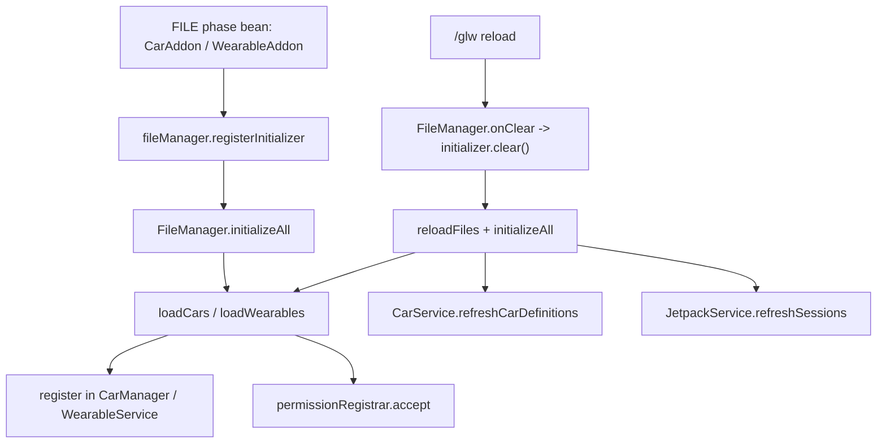
```mermaid
flowchart TD
  A["FILE phase bean: CarAddon / WearableAddon"] --> B["fileManager.registerInitializer"]
  B --> C["FileManager.initializeAll"]
  C --> D["loadCars / loadWearables"]
  D --> E["register in CarManager / WearableService"]
  D --> F["permissionRegistrar.accept"]
  G["/glw reload"] --> H["FileManager.onClear -> initializer.clear()"]
  H --> I["reloadFiles + initializeAll"]
  I --> D
  I --> J["CarService.refreshCarDefinitions"]
  I --> K["JetpackService.refreshSessions"]
```

**State & persistence effects:** in-memory registries only; permissions registered with Keystone's
`PermissionManager`. No DB writes.

**Edge cases & guards observed:** malformed entries are skipped with a warning rather than aborting load;
`runInitializer` regenerates the YAML from the jar and retries once on exception
(`keystone-persistence/.../FileManager.java:236-264`). `XMaterial.orElse(MINECART)`/`orElse(BARRIER)` means a typo'd
material silently becomes a minecart (cars) or is rejected as non-armour (wearables). `Fuel_Key` defaults to `""`,
which for wearables makes `Wearable.isJetpack()` return `true` (non-null empty string) while `buildItem` skips the
fuel NBT stamp — see Observations #12.

### W2: Build / obtain a car item

**Trigger:** `/glw car give`, the `car:<key>` item DSL, a shop or trader delivery, or a sign.

**Steps:**
1. `Car.buildItem(player)` (Car.java:86-110) — `ItemBuilder(itemMaterial)`, placeholder-resolved display name and
   lore, optional `Custom_Model_Data`, then NBT `car=<carId>`, `car_durability=maxDurability`,
   `car_max_durability=maxDurability`; when `fuelEnabled && fuelKey non-empty && maxFuel > 0` it also stamps
   `fuel=<fuelKey>`, `fuel_current=maxFuel`, `fuel_max=maxFuel`.
2. `/glw car give` (`CarGiveCommand.giveCarItem:99-129`) splits `amount` across `maxStackSize` slots, `addItem`s them
   and drops the leftover map with `dropItemNaturally`.
3. `CarConverter.convert` (`gangland-impl/.../item/converter/CarConverter.java:29-45`) resolves `car:<key>` strings and
   applies `ItemAttributes` (name/lore/color).
4. `CarItemSerializer.extract` reads the `car` tag back for `ItemKind.CAR` round-trips.
5. On any shop / trader delivery `ItemRefresherRegistry.refresh(source, player)` walks refreshers in registration
   order — `weaponRefresher, wearableRefresher, uniqueItemRefresher, ammunitionItemRefresher, carItemRefresher`
   (`ItemConfig.java:183-191`) — and `CarItemRefresher.refresh` rebuilds a factory-fresh car item (full fuel, full
   durability, current config lore) preserving only the stack amount. `car_owner` is deliberately not touched.

**Diagram:**
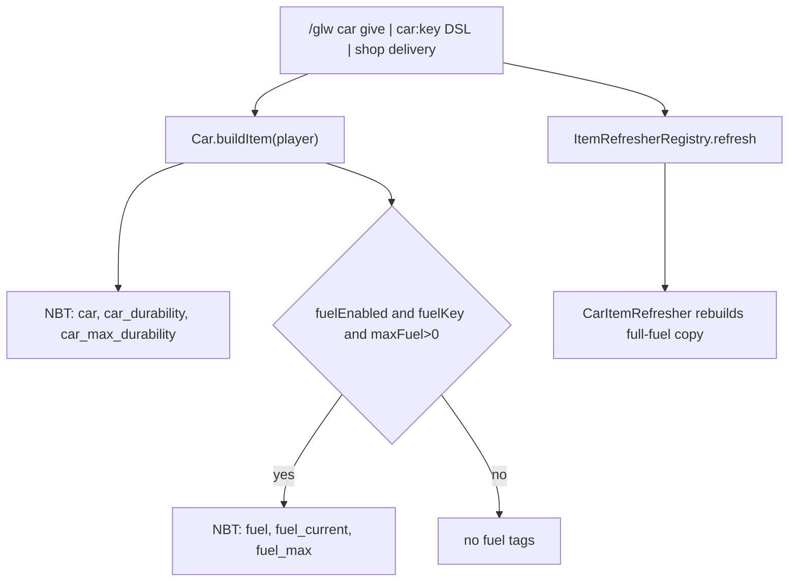
```mermaid
flowchart TD
  A["/glw car give | car:key DSL | shop delivery"] --> B["Car.buildItem(player)"]
  B --> C["NBT: car, car_durability, car_max_durability"]
  B --> D{"fuelEnabled and fuelKey and maxFuel>0"}
  D -->|yes| E["NBT: fuel, fuel_current, fuel_max"]
  D -->|no| F["no fuel tags"]
  A --> G["ItemRefresherRegistry.refresh"]
  G --> H["CarItemRefresher rebuilds full-fuel copy"]
```

**State & persistence effects:** none beyond the ItemStack.

**Edge cases & guards observed:** a car item stamped with a fuel key also satisfies `Fuel.isFuelItem`, so it is treated
as a fuel container by `FuelHoldDisplayListener`, `FuelRefuelListener` and `CarEntityInteractListener` (Observations
#9, #10). `CarItemRefresher` returns `null` when the car id is unknown, in which case the registry falls back to
`source.clone()`.

### W3: Place a car in the world

**Trigger:** Right-click a block while holding a car item.

**Steps:**
1. `CarInteractListener.onPlayerInteract` (CarInteractListener.java:43) — requires `RIGHT_CLICK_BLOCK` and
   `EquipmentSlot.HAND`; `Car.getCarId(mainHand)` must be non-null and resolvable in `CarManager`.
2. `event.setCancelled(true)`, then the `gangland.cars.<id>` permission check (`messages.noPermission()` on failure).
3. Spawn location = clicked block `.getRelative(UP).getLocation().add(0.5, 0, 0.5)` (no Y centring, no occupancy
   check).
4. Fuel/durability/exhaust are read from the item NBT with fallbacks: `fuel_current` → else the registered `Fuel`
   definition's `maxFuel` → else 0; `fuel_max` → else `car.getMaxFuel()`; `car_durability` → else
   `car.getMaxDurability()`; `car_exhaust_side` → else `null`.
5. `CarService.placeCar` (CarService.java:121-148) — `new MinecartVehicle(car)`, `spawnLoc.setYaw(player yaw)`,
   `entity.spawn(spawnLoc)` which does `world.spawn(loc, Minecart.class, cart -> {setMaxSpeed(10.0);
   setSlowWhenEmpty(false);})`.
6. `storePdc(...)` writes `car_id`, `car_fuel`, `car_fuel_max`, `car_durability`, `car_placer` into the entity PDC;
   `storePdcExhaustSide` adds `car_exhaust_side` when non-null.
7. A `ParkedVehicle` goes into `parkedVehicles[entityUUID]`; `buildRecord` mints a `ParkedCar` with a fresh
   `UUID.randomUUID().toString()` dbId, `storePdcDbId` writes it to the entity, the record enters
   `parkedCarRecords[entityUUID]`, and `parkedCarRepository.save(record)` persists it immediately.
8. Back in the listener, the item stack is decremented by one (or the hand cleared).

**Diagram:**
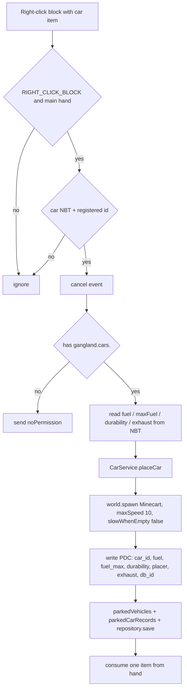
```mermaid
flowchart TD
  A["Right-click block with car item"] --> B{"RIGHT_CLICK_BLOCK and main hand"}
  B -->|no| Z["ignore"]
  B -->|yes| C{"car NBT + registered id"}
  C -->|no| Z
  C -->|yes| D["cancel event"]
  D --> E{"has gangland.cars.<id>"}
  E -->|no| F["send noPermission"]
  E -->|yes| G["read fuel / maxFuel / durability / exhaust from NBT"]
  G --> H["CarService.placeCar"]
  H --> I["world.spawn Minecart, maxSpeed 10, slowWhenEmpty false"]
  I --> J["write PDC: car_id, fuel, fuel_max, durability, placer, exhaust, db_id"]
  J --> K["parkedVehicles + parkedCarRecords + repository.save"]
  K --> L["consume one item from hand"]
```

**State & persistence effects:** one new minecart entity, one map entry in each of `parkedVehicles` /
`parkedCarRecords`, one immediate `parked_car` row, entity PDC written, one item consumed.

**Edge cases & guards observed:** `placeCar` returns `false` when the car id is unknown or `getEntityUUID()` is null —
in the latter case the entity has already been spawned and is leaked. There is no check that the target block is
passable, that the player owns the location, or that the player has not already placed N cars.

### W4: Mount a parked car

**Trigger:** Right-click a parked car entity without sneaking and without a matching fuel can in hand.

**Steps:**
1. `CarEntityInteractListener.onInteractEntity:41` — main hand only; `carService.isParkedVehicle(uuid)` gate;
   `event.setCancelled(true)`; sneaking players return early.
2. The fuel-can branch (W12) is skipped when the held item is not a fuel item or the keys differ.
3. `vehicleRegistry.isPlayerDriving` → `messages.alreadyDriving()` if already in a car.
4. `CarService.mountCar` (CarService.java:161-230) removes the `ParkedVehicle` from `parkedVehicles`, re-checks
   `isPlayerDriving` (restoring the entry if true).
5. Dead-entity recovery: if `getBukkitEntity() == null || isDead()`, the DB record is used to `despawn()` + `spawn()` a
   replacement at the persisted location, PDC and dbId are re-stamped, and `parkedCarRecords` is re-keyed to the new
   entity UUID. Deliberately not triggered for `isValid() == false` (chunk-unloaded) to avoid duplicates.
6. A `VehicleSession` is created (boss bar created and shown here, `Bukkit.createBossBar` +
   `healthBar.addPlayer(driver)`), a `VehicleMovementTask` is attached, and the session is registered in
   `VehicleRegistry` **before** `entity.mount(player)` so an immediate physics ejection still finds the session.
7. `PlayerInputInterceptor.getChannel(player)` (reflection through `ServerPlayer.connection.connection.channel`); when
   non-null a `VehicleInputInterceptor` is inserted `addBefore("packet_handler", "gangland_vehicle_input", …)`.
8. `task.runTaskTimer(plugin, 1L, 1L)` — synchronous, every tick.

**Diagram:**
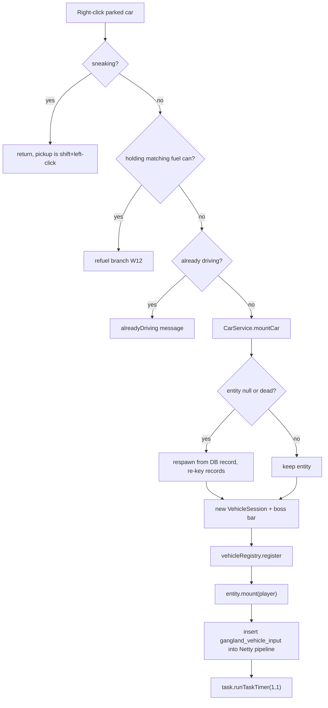
```mermaid
flowchart TD
  A["Right-click parked car"] --> B{"sneaking?"}
  B -->|yes| Z["return, pickup is shift+left-click"]
  B -->|no| C{"holding matching fuel can?"}
  C -->|yes| D["refuel branch W12"]
  C -->|no| E{"already driving?"}
  E -->|yes| F["alreadyDriving message"]
  E -->|no| G["CarService.mountCar"]
  G --> H{"entity null or dead?"}
  H -->|yes| I["respawn from DB record, re-key records"]
  H -->|no| J["keep entity"]
  I --> K["new VehicleSession + boss bar"]
  J --> K
  K --> L["vehicleRegistry.register"]
  L --> M["entity.mount(player)"]
  M --> N["insert gangland_vehicle_input into Netty pipeline"]
  N --> O["task.runTaskTimer(1,1)"]
```

**State & persistence effects:** `parkedVehicles` entry removed, `VehicleRegistry` entry added, boss bar shown, Netty
handler installed, repeating task started. No DB write on mount (the record is intentionally retained so the same
`dbId` is reused at park time).

**Edge cases & guards observed:** when the respawn path cannot find the world or the DB record it restores the parked
state and returns `false`. If `getChannel` returns `null` (unsupported NMS / reflection failure) the car is mountable
but completely unsteerable — no message is shown.

### W5: Drive — the per-tick movement loop

**Trigger:** `VehicleMovementTask.run()` every tick while mounted.

**Steps:**
1. `checkGuards` (VehicleMovementTask.java:77-92): if `!entity.isAlive()` → `carService.forcePark(uuid, driver
   location if online)` + `cancel()`; if the driver is offline or `driver.getVehicle() != entity.getBukkitEntity()` →
   `carService.parkCar(uuid)` + `cancel()`.
2. Read the four volatile input flags written by the Netty interceptor.
3. If fuel is disabled or `session.hasFuel()`:
   - `forward && backward` → `tickBurnout` (hard-brake decel, A/D spins `currentYaw`, `updateMovement` +
     `setFacing`, `ParticleUtil.spawnBurnoutSmoke`, `world.playSound(Sound.ENTITY_GENERIC_EXPLODE, 0.3f, 1.5f)`,
     one tick of fuel burn, `lastKnownLocation` refresh, HUD update) and `return`.
   - otherwise `updateSteering` (W pressed from standstill snaps the heading to the driver's yaw; A/D rotate by
     `Car.turnSpeed` only while `|speed| > 0.001`) then `updateSpeed` (W accelerates to `maxSpeed`; S hard-brakes
     while moving forward then reverses to `-maxSpeed * reverseSpeedRatio`; no key decelerates by
     `Car.deceleration`).
4. Else (`fuelEnabled && currentFuel == 0`) → `coastToStop` decelerates by `deceleration * hardBrakeMultiplier` and
   steering is frozen.
5. `finalizeTick`: `entity.updateMovement(currentSpeed, currentYaw)` → `MinecartVehicle.updateMovement` converts speed
   and yaw into `dx = -sin(yaw)*speed`, `dz = cos(yaw)*speed`, preserves the current Y unless `canStepUp` finds a
   ≤0.6-block rise with clearance (then `y = 0.42`), and calls `setVelocity` — every tick, overriding minecart drag.
   When `|speed| > 0.001` it also spawns exhaust particles on the configured side(s) and burns
   `getCarFuelConsumePerTick()` fuel.
6. `session.setLastKnownLocation(live.clone())` and `session.updateDisplays(FuelBar.render(...))` — the boss bar
   progress/title are refreshed and the fuel gauge is sent through `ActionBarManager.sendBackground(driver, …, 10)`.

**Diagram:**
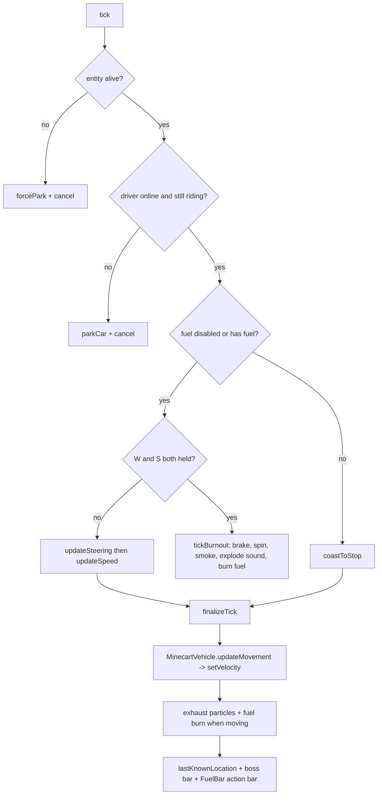
```mermaid
flowchart TD
  A["tick"] --> B{"entity alive?"}
  B -->|no| C["forcePark + cancel"]
  B -->|yes| D{"driver online and still riding?"}
  D -->|no| E["parkCar + cancel"]
  D -->|yes| F{"fuel disabled or has fuel?"}
  F -->|no| G["coastToStop"]
  F -->|yes| H{"W and S both held?"}
  H -->|yes| I["tickBurnout: brake, spin, smoke, explode sound, burn fuel"]
  H -->|no| J["updateSteering then updateSpeed"]
  J --> K["finalizeTick"]
  G --> K
  K --> L["MinecartVehicle.updateMovement -> setVelocity"]
  L --> M["exhaust particles + fuel burn when moving"]
  M --> N["lastKnownLocation + boss bar + FuelBar action bar"]
```

**State & persistence effects:** entity velocity/rotation each tick, `currentFuel`/`currentDurability` in the session
only — **nothing is persisted while driving**; fuel and durability reach the DB only via `parkCar`, `forcePark` or
`destroyAll`.

**Edge cases & guards observed:** `session.consumeFuel` floors at 0; `VehicleSession.addFuel` caps at `maxFuel`.
`decelerate` never overshoots zero. Burnout returns early so `finalizeTick` (and its second fuel burn) is skipped —
burnout burns exactly one unit per tick, driving burns one per moving tick. `Sound.ENTITY_GENERIC_EXPLODE` is a raw
Bukkit enum, contrary to the project's `SoundEffect`/XSeries rule.

### W6: Voluntary dismount (park)

**Trigger:** Player presses shift while driving, or dies / is downed while mounted.

**Steps:**
1. `CarDismountListener.onDismount:35` — only for `Player` dismounts where `VehicleRegistry.getByEntity` finds a live
   session.
2. If the player is not sneaking, not dead and not in the downed registry, the event is **cancelled** and nothing
   else happens (this is what keeps minecart physics from ejecting the driver).
3. Otherwise `findSafeExitLocation` scans up to 5 blocks up from the vehicle location for two passable blocks
   (fallback: `base + (0,1,0)`), then `carService.parkCar(vehicle uuid)`.
4. `CarService.parkCar` (CarService.java:241-292): `removeDisplays()` (boss bar), remove the Netty handler, cancel the
   task, snapshot durability/fuel/maxFuel/driver UUID, re-write the entity PDC (including exhaust side), create a new
   `ParkedVehicle`, `vehicleRegistry.unregister(uuid)`, resolve the location (prefer `lastKnownLocation`, else the
   live entity location), rebuild the `ParkedCar` reusing the existing `dbId` (or minting a new one) and
   `repository.save(record)`, and finally `entity.eject()` to clear any leftover passenger.
5. One tick later the listener teleports the player to the safe exit if still online.

**Diagram:**
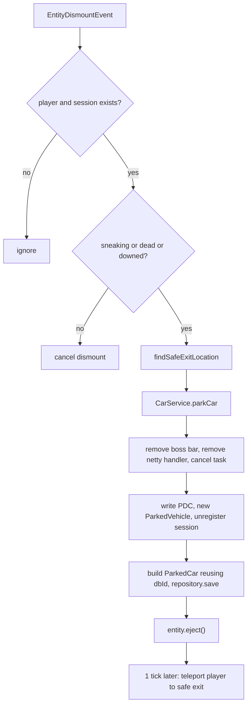
```mermaid
flowchart TD
  A["EntityDismountEvent"] --> B{"player and session exists?"}
  B -->|no| Z["ignore"]
  B -->|yes| C{"sneaking or dead or downed?"}
  C -->|no| D["cancel dismount"]
  C -->|yes| E["findSafeExitLocation"]
  E --> F["CarService.parkCar"]
  F --> G["remove boss bar, remove netty handler, cancel task"]
  G --> H["write PDC, new ParkedVehicle, unregister session"]
  H --> I["build ParkedCar reusing dbId, repository.save"]
  I --> J["entity.eject()"]
  J --> K["1 tick later: teleport player to safe exit"]
```

**State & persistence effects:** session torn down, `parkedVehicles` re-populated, one `parked_car` upsert, player
teleported.

**Edge cases & guards observed:** the location fallback chain explicitly null-checks `getWorld()`; if both are null no
record is written at all (the car silently stops being persisted). `parkCar` returns immediately when no session is
registered, which is what makes the trailing `entity.eject()` safe (the dismount listener no longer sees a session).

### W7: Force-park (entity destroyed mid-drive)

**Trigger:** `checkGuards` finds `!entity.isAlive()` — another plugin removed the minecart, it fell out of the world,
or its chunk unloaded.

**Steps:**
1. `CarService.forcePark(uuid, fallbackLoc)` (CarService.java:305-367) — same teardown as `parkCar` (displays, Netty
   handler, task) but **no** new `ParkedVehicle` is created.
2. `vehicleRegistry.unregister(uuid)`.
3. Location resolution order: `session.lastKnownLocation` → live entity location if valid → `fallbackLoc` (driver's
   location) → the existing DB record's coordinates → return without saving.
4. A new `ParkedCar` (reusing the `dbId`) is stored in `parkedCarRecords` and saved.
5. `session.getEntity().despawn()` removes any orphaned remnant so a re-loading chunk cannot resurrect a duplicate.

**Diagram:**
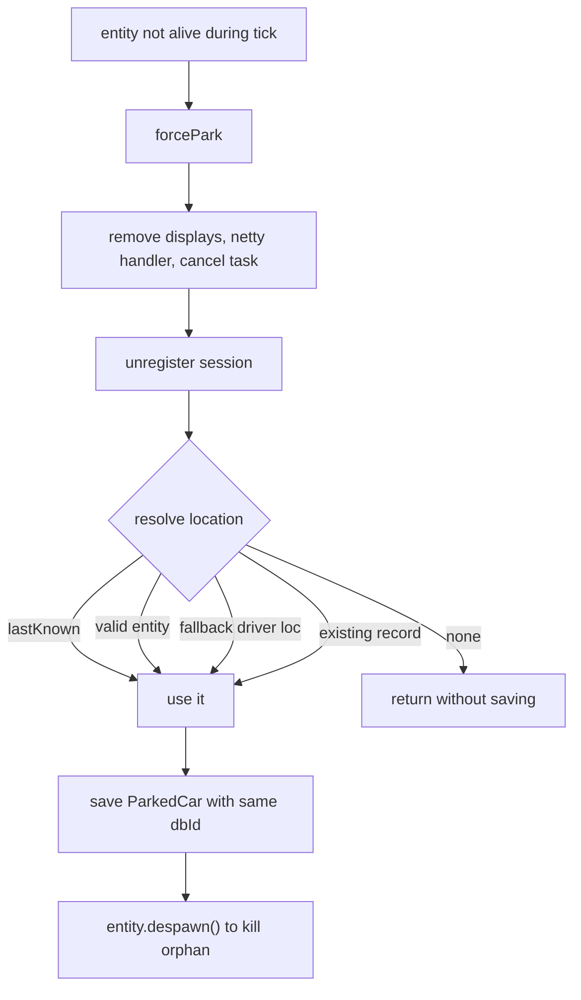
```mermaid
flowchart TD
  A["entity not alive during tick"] --> B["forcePark"]
  B --> C["remove displays, netty handler, cancel task"]
  C --> D["unregister session"]
  D --> E{"resolve location"}
  E -->|lastKnown| F["use it"]
  E -->|valid entity| F
  E -->|fallback driver loc| F
  E -->|existing record| F
  E -->|none| G["return without saving"]
  F --> H["save ParkedCar with same dbId"]
  H --> I["entity.despawn() to kill orphan"]
```

**State & persistence effects:** one `parked_car` upsert; the entity is removed; the car will be re-spawned by
`reloadParkedVehicles` on the next enable but is **not** present in `parkedVehicles` for the rest of this session, so
the player cannot re-mount it until a restart.

**Edge cases & guards observed:** `entity.getEntityUUID()` is passed straight into `forcePark`, and
`VehicleRegistry.getByEntity` delegates to `ConcurrentHashMap.get` which throws on `null` — only reachable if the
wrapped minecart reference were null.

### W8: Player quits while driving (RootVehicle guard)

**Trigger:** `PlayerQuitEvent`.

**Steps:**
1. `CarQuitListener.onQuit:30` looks the session up by player UUID; returns if none.
2. `live.eject()` — at this point the session is *still registered*, so `CarDismountListener` sees a non-sneaking,
   non-dead player and **cancels** the dismount; this first eject is a no-op.
3. `carService.parkCar(entityUUID)` runs the full park sequence; because `parkCar` unregisters the session before its
   own trailing `entity.eject()`, that second eject succeeds and the passenger is genuinely cleared before Spigot's
   `PlayerList.remove` serializes the player.
4. `VehicleMovementTask.checkGuards` would also catch the offline driver on the next tick, but only after the save.

**Diagram:**
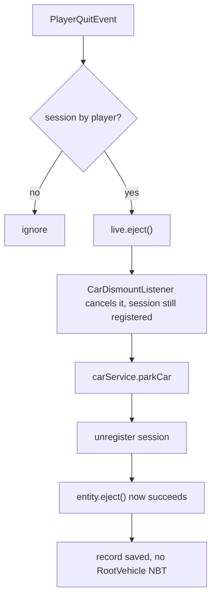
```mermaid
flowchart TD
  A["PlayerQuitEvent"] --> B{"session by player?"}
  B -->|no| Z["ignore"]
  B -->|yes| C["live.eject()"]
  C --> D["CarDismountListener cancels it, session still registered"]
  D --> E["carService.parkCar"]
  E --> F["unregister session"]
  F --> G["entity.eject() now succeeds"]
  G --> H["record saved, no RootVehicle NBT"]
```

**State & persistence effects:** same as W6 minus the teleport.

**Edge cases & guards observed:** the outcome is correct but only by accident of ordering inside `parkCar`; the
listener's own eject is dead code.

### W9: Plugin shutdown — `destroyAll` two-pass

**Trigger:** `Gangland.onDisable` → `context.shutdownBeans()` → `CarService.onShutdown()`.

**Steps:**
1. Snapshot `vehicleRegistry.getAllSessions()` into a list.
2. **Pass 1** (CarService.java:466-479) for every session: `removeDisplays()`, remove the Netty handler, cancel the
   task, and `live.eject()` while the registry still holds the session — so `CarDismountListener` cancels each of
   those ejects (see Observations #1).
3. **Pass 2** (lines 483-519): for each session build a `ParkedVehicle`, resolve the location (`lastKnownLocation`
   first), rebuild the `ParkedCar` with the existing `dbId`, put it in `parkedCarRecords` and
   `parkedCarRepository.save(record)` inline (deliberately not relying on `PeriodicalUpdates.forceUpdate`).
4. `vehicleRegistry.clear()`.
5. Every `ParkedVehicle` is despawned — `MinecartVehicle.despawn()` does `eject()` then `remove()`; because the
   registry is now empty the dismount listener no longer cancels, so this is where the passenger actually gets
   removed.
6. `parkedVehicles.clear()`, `parkedCarRecords.clear()`.
7. Back in `Gangland.onDisable`, `PeriodicalUpdates.forceUpdate()` runs after bean shutdown — but the car data
   supplier now returns an empty list, which is why pass 2 saves inline.

**Diagram:**
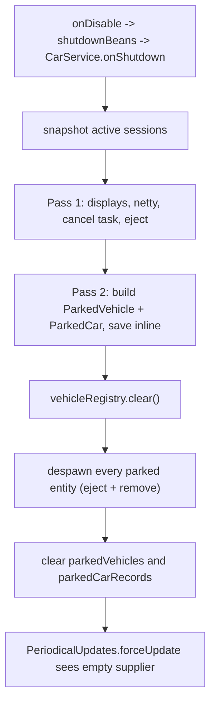
```mermaid
flowchart TD
  A["onDisable -> shutdownBeans -> CarService.onShutdown"] --> B["snapshot active sessions"]
  B --> C["Pass 1: displays, netty, cancel task, eject"]
  C --> D["Pass 2: build ParkedVehicle + ParkedCar, save inline"]
  D --> E["vehicleRegistry.clear()"]
  E --> F["despawn every parked entity (eject + remove)"]
  F --> G["clear parkedVehicles and parkedCarRecords"]
  G --> H["PeriodicalUpdates.forceUpdate sees empty supplier"]
```

**State & persistence effects:** every driven car becomes a persisted parked row; every minecart is removed from the
world; all in-memory maps emptied.

**Edge cases & guards observed:** sessions whose `getEntityUUID()` is null are skipped in pass 2 (so they are neither
saved nor despawned). `parkedVehicles.put` in pass 2 can overwrite an entry keyed by the same UUID.

### W10: Startup — re-spawn parked cars

**Trigger:** `CopsAndGadgetsConfig.carService` bean creation calls `carService.reloadParkedVehicles()` (line 409).

**Steps:**
1. `parkedCarRepository.loadAll()` → `ParkedCarRepository.doLoadAll` reads every `parked_car` row positionally from
   `tableBackend().selectAll()`, tolerating null/blank `placer_uuid` and `exhaust_side`.
2. For each record: skip unknown car ids and unloaded worlds.
3. `spawnLoc.getChunk().load()` force-loads the chunk so any survivor entity is present.
4. `findSurvivor(chunk, dbId)` scans that one chunk for a live `Minecart` whose `car_db_id` PDC matches; if found the
   existing entity is wrapped (`new MinecartVehicle(car, survivor)`) instead of spawning a duplicate.
5. Otherwise a fresh minecart is spawned at the stored location/yaw.
6. `maxFuel` = record value, or `car.getMaxFuel()` when the row is a legacy 0.
7. PDC and `car_db_id` are re-stamped; `parkedVehicles` and `parkedCarRecords` are populated.

**Diagram:**
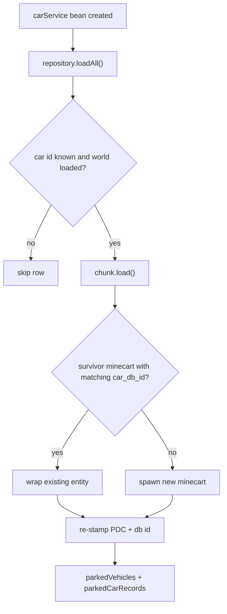
```mermaid
flowchart TD
  A["carService bean created"] --> B["repository.loadAll()"]
  B --> C{"car id known and world loaded?"}
  C -->|no| Z["skip row"]
  C -->|yes| D["chunk.load()"]
  D --> E{"survivor minecart with matching car_db_id?"}
  E -->|yes| F["wrap existing entity"]
  E -->|no| G["spawn new minecart"]
  F --> H["re-stamp PDC + db id"]
  G --> H
  H --> I["parkedVehicles + parkedCarRecords"]
```

**State & persistence effects:** entities spawned / reclaimed; no writes.

**Edge cases & guards observed:** the survivor scan only covers the chunk at the *stored* location — a minecart that
drifted into an adjacent chunk before the save is not reclaimed and becomes a duplicate. The docstring claims orphans
"that no longer have a matching database record" are removed, but no such removal code exists.

### W11: Pick a parked car back up

**Trigger:** Shift + left-click a parked car while not holding a weapon.

**Steps:**
1. Bukkit fires `VehicleDamageEvent` (not `EntityDamageEvent`) for a punched minecart.
   `CarDamageListener.onVehicleDamage:97` requires a `Minecart` vehicle and a `Player` attacker, and a known
   session-or-parked entity; it then cancels the event.
2. If the car is parked, the player is sneaking and `weaponService.isWeapon(mainHand)` is false, the
   `pendingRightClickInteract` flag (set at `LOWEST` by `onCarRightClick` and cleared a tick later) is consumed — if
   it was set the pickup is suppressed (Paper's cancelled-interact→attack fallback).
3. `CarService.pickupCar` (CarService.java:377-398): remove from `parkedVehicles`, `despawn()` the entity, remove the
   `ParkedCar` from `parkedCarRecords` and `repository.delete(record)`, build a fresh item via
   `car.buildItem(player)`, overwrite `car_durability`, `fuel_current`, `fuel_max`, `car_owner` and
   `car_exhaust_side`, then `player.getInventory().addItem(...)`.

**Diagram:**
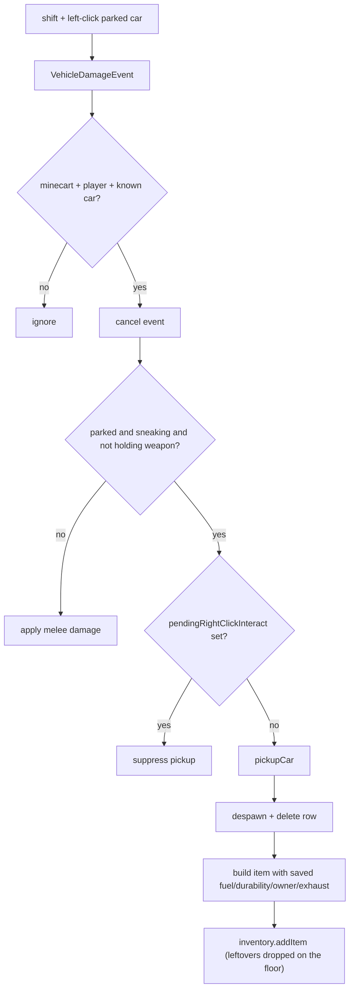
```mermaid
flowchart TD
  A["shift + left-click parked car"] --> B["VehicleDamageEvent"]
  B --> C{"minecart + player + known car?"}
  C -->|no| Z["ignore"]
  C -->|yes| D["cancel event"]
  D --> E{"parked and sneaking and not holding weapon?"}
  E -->|no| F["apply melee damage"]
  E -->|yes| G{"pendingRightClickInteract set?"}
  G -->|yes| H["suppress pickup"]
  G -->|no| I["pickupCar"]
  I --> J["despawn + delete row"]
  J --> K["build item with saved fuel/durability/owner/exhaust"]
  K --> L["inventory.addItem (leftovers dropped on the floor)"]
```

**State & persistence effects:** entity removed, `parked_car` row deleted, item created.

**Edge cases & guards observed:** **no ownership or permission check** — any player can pick up any parked car.
`addItem`'s leftover map is discarded, so a full inventory silently destroys the car.

### W12: Refuel a parked car with a fuel can

**Trigger:** Right-click a parked car while holding an item whose `fuel` NBT key equals the car's `Fuel_Key`.

**Steps:**
1. `CarEntityInteractListener.onInteractEntity:56-93` — `Fuel.isFuelItem(held)`, key equality, `car.isFuelEnabled()`.
2. `Fuel.getCurrentFuel(held) <= 0` → `messages.fuelCanEmpty()` on the action bar.
3. `spaceInCar = parked.getMaxFuel() - parked.getFuel()`; `<= 0` → `messages.fuelTankFull()`.
4. `toTransfer = min(canFuel, spaceInCar)`; `CarService.refuelParkedCar` re-clamps, calls `ParkedVehicle.addFuel`,
   re-writes the entity PDC, updates `record.setFuel(...)` and `repository.save(record)`; `false` →
   `messages.refuelFailed()`.
5. The held stack is written back with `Fuel.setCurrentFuel(held, canFuel - actualAdded)`, a raw
   `Sound.ENTITY_EXPERIENCE_ORB_PICKUP` is played, and the new gauge is sent to the action bar.

**Diagram:**
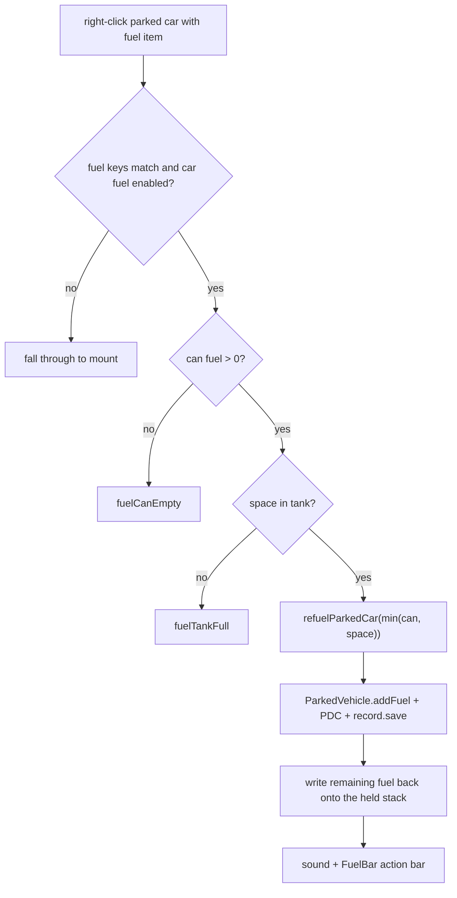
```mermaid
flowchart TD
  A["right-click parked car with fuel item"] --> B{"fuel keys match and car fuel enabled?"}
  B -->|no| C["fall through to mount"]
  B -->|yes| D{"can fuel > 0?"}
  D -->|no| E["fuelCanEmpty"]
  D -->|yes| F{"space in tank?"}
  F -->|no| G["fuelTankFull"]
  F -->|yes| H["refuelParkedCar(min(can, space))"]
  H --> I["ParkedVehicle.addFuel + PDC + record.save"]
  I --> J["write remaining fuel back onto the held stack"]
  J --> K["sound + FuelBar action bar"]
```

**State & persistence effects:** parked fuel raised, PDC updated, `parked_car` row upserted, held item NBT reduced.

**Edge cases & guards observed:** `refuelParkedCar` also refuses when `car.getFuelKey()` is null. `ParkedVehicle.addFuel`
itself only floors at 0 — the cap comes from the caller's `min(amount, max - fuel)`, so a direct call with a large
amount would exceed capacity. Active (driven) cars cannot be refuelled this way at all — the entity is not in
`parkedVehicles`, so `isParkedVehicle` fails and the listener does nothing.

### W13: Refuel a fuel item with its fuel material

**Trigger:** Right-click in the world with a fuel item in one hand and the fuel material (COAL) in the other, or an
inventory click pairing the two.

**Steps (world path):** `FuelRefuelListener.onInteract:38` matches either hand ordering, resolves the `Fuel`
definition through `FuelContract.getFuel(key)`, compares `fuel.getFuelMaterial().get()` to the material item's type,
refuses when `current >= max` (`"&cFuel is already full!"`), decrements the material stack by one, writes
`min(max, current + fuelPerItem)` back with `Fuel.setCurrentFuel`, plays a sound, renders the bar, and cancels the
event.

**Steps (inventory path):** `onInventoryClick:73-118` has three branches — (a) fuel container on the cursor onto a
fuel-carrying **registered wearable** (jetpack) → `tryTransferFuelToWearable` moves
`min(containerFuel, wearableMax - wearableFuel)` and rewrites both stacks; (b) cursor = material, clicked = fuel item;
(c) cursor = fuel item, clicked = material. Branches (b)/(c) call `tryRefuelInInventory`, identical to the world path.

**Diagram:**
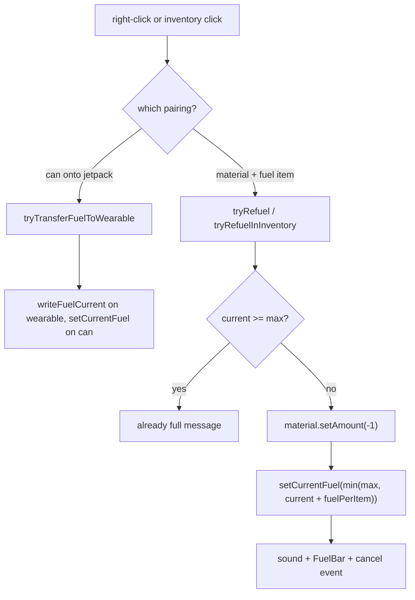
```mermaid
flowchart TD
  A["right-click or inventory click"] --> B{"which pairing?"}
  B -->|"can onto jetpack"| C["tryTransferFuelToWearable"]
  B -->|"material + fuel item"| D["tryRefuel / tryRefuelInInventory"]
  C --> E["writeFuelCurrent on wearable, setCurrentFuel on can"]
  D --> F{"current >= max?"}
  F -->|yes| G["already full message"]
  F -->|no| H["material.setAmount(-1)"]
  H --> I["setCurrentFuel(min(max, current + fuelPerItem))"]
  I --> J["sound + FuelBar + cancel event"]
```

**State & persistence effects:** item NBT only.

**Edge cases & guards observed:** `Fuel.setCurrentFuel` clamps to `[0, getMaxFuel(item)]`, and `writeFuelCurrent`
clamps to `[0, readFuelMax]` (or just `>= 0` when no max tag exists). `ItemBuilder` wraps the *same* `ItemStack`
instance (`keystone-item/.../ItemBuilder.java:48-50, 226-228`), so all these "return the updated stack" helpers mutate
in place — which is why a stack of N identical fuel cans all gain `fuelPerItem` for one consumed coal (Observations
#9).

### W14: Fuel hold display

**Trigger:** `PlayerItemHeldEvent`, `EntityPickupItemEvent` (deferred one tick), `PlayerDropItemEvent` (deferred).

**Steps:** `FuelHoldDisplayListener.startDisplay` registers one `runTaskTimer(…, 0L, 10L)` per player in
`displayTasks`; each run re-checks `player.isOnline()` and `Fuel.isFuelItem(mainHand)`, self-cancelling otherwise, and
otherwise pushes `FuelBar.render(current, max)` through `ActionBarManager.sendBackground`. `onQuit` stops the task and
calls `FuelContract.clearCache(uuid)` to drop `FuelService.slotCache`.

**Diagram:**
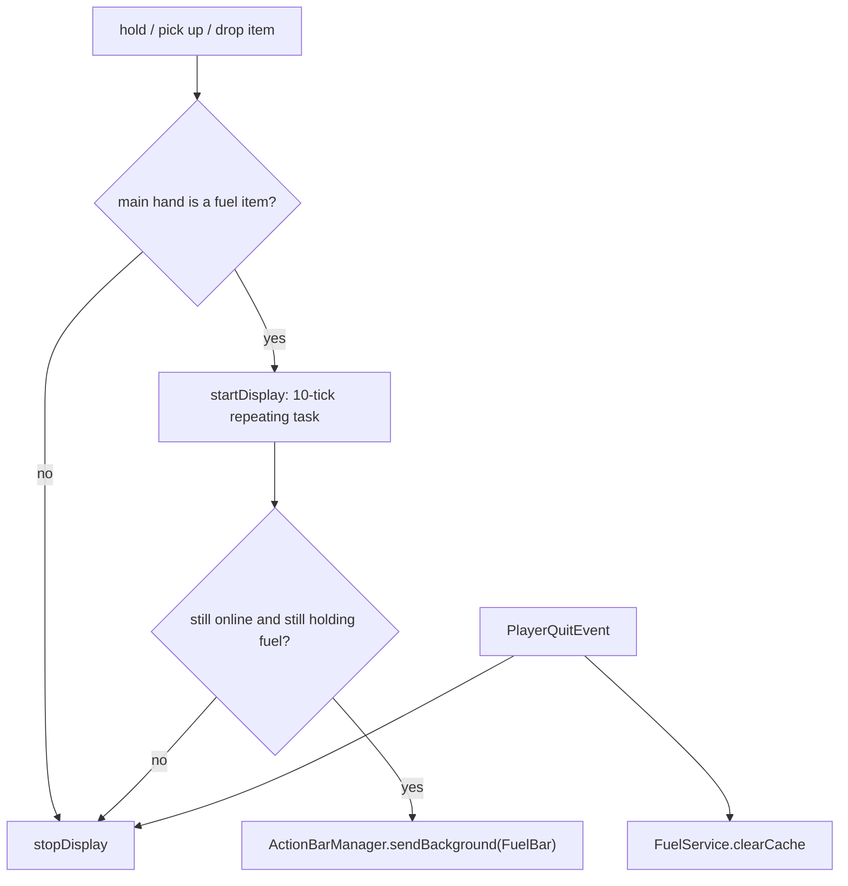
```mermaid
flowchart TD
  A["hold / pick up / drop item"] --> B{"main hand is a fuel item?"}
  B -->|yes| C["startDisplay: 10-tick repeating task"]
  B -->|no| D["stopDisplay"]
  C --> E{"still online and still holding fuel?"}
  E -->|no| D
  E -->|yes| F["ActionBarManager.sendBackground(FuelBar)"]
  G["PlayerQuitEvent"] --> D
  G --> H["FuelService.clearCache"]
```

**State & persistence effects:** one Bukkit task per holding player; `FuelService.slotCache` entry per player.

**Edge cases & guards observed:** because car items and jetpacks carry a `fuel` tag they also trigger this gauge.
Tasks are keyed by player UUID and guarded by `containsKey`, so no duplicates.

### W15: Fuel maintenance commands

**Trigger:** `/glw fuel add|remove|refuel|defuel|info`.

**Steps:** every leaf resolves the online `User`, reads `player.getInventory().getItemInMainHand()`, requires
`Fuel.hasFuelCapacity(held)` (i.e. a `fuel_current` tag — no `fuel` id needed, so jetpacks and car items qualify),
parses the optional integer positional argument (`Messages.MUST_BE_NUMBERS` on failure, `FUEL_AMOUNT_INVALID` when
`<= 0`), mutates via `Fuel.setMaxFuel` / `Fuel.writeFuelCurrent`, writes the stack back into the main hand and reports
through the localized message.

**Diagram:**
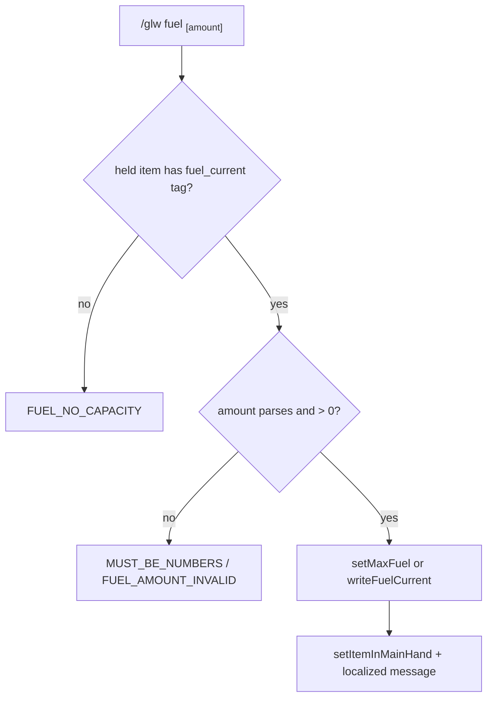
```mermaid
flowchart TD
  A["/glw fuel <sub> [amount]"] --> B{"held item has fuel_current tag?"}
  B -->|no| C["FUEL_NO_CAPACITY"]
  B -->|yes| D{"amount parses and > 0?"}
  D -->|no| E["MUST_BE_NUMBERS / FUEL_AMOUNT_INVALID"]
  D -->|yes| F["setMaxFuel or writeFuelCurrent"]
  F --> G["setItemInMainHand + localized message"]
```

**State & persistence effects:** item NBT only.

**Edge cases & guards observed:** `add` has no upper bound on capacity; `remove` floors at 0 and `setMaxFuel` clamps
`current` down to the new max. Because the helpers mutate in place, running these on a stack changes every item in it.

### W16: Car damage and destruction

**Trigger:** four independent damage sources.

**Steps:**
1. `onVehicleDamage` (melee): damage = the melee weapon's configured damage when
   `weaponService.validateAndGetWeapon` yields a `MeleeWeapon`, otherwise `max(1, ceil(event.getDamage()))`.
2. `onEntityDamage` (explosions/fire/etc., `PROJECTILE` cause explicitly skipped): for explosion causes it first tries
   `ThrowableAction.pendingVehicleExplosionDamage.remove(entityUUID)` to use the grenade's configured damage.
3. `onWeaponEntityDamage` (incendiary/biological) and `onWeaponRaytraceImpact` (guns/projectiles) route the weapon's
   damage; the raytrace handler skips the vehicle the shooter is riding and skips shots fired within one tick of the
   shooter right-clicking a car.
4. `applyDamage` (CarDamageListener.java:215-241): for an active session `session.damage(n)` + `wobble` and, when
   `isDestroyed()`, `ParticleUtil.spawnExplosionBurst` + `carService.destroyCar(uuid, false)`. For a parked car it
   pre-computes the explosion location, calls `carService.damageParkedCar` (which persists the new durability or
   destroys) and then wobbles the entity.
5. `CarService.destroyCar` cancels the task, unregisters the session **before** despawning (so the dismount listener
   lets the player out), despawns, optionally returns the item, and deletes the DB row.

**Diagram:**
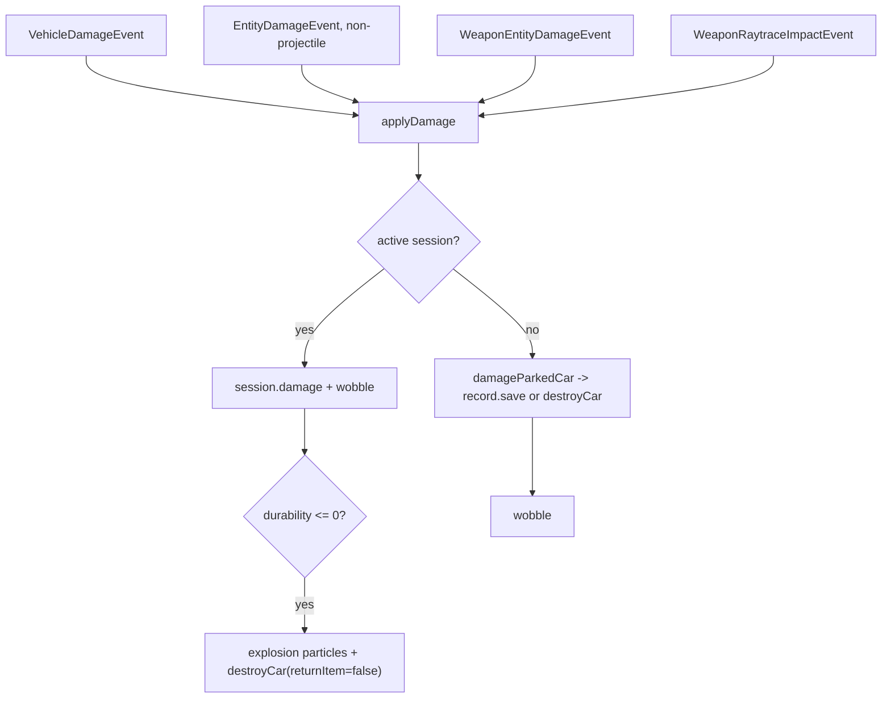
```mermaid
flowchart TD
  A["VehicleDamageEvent"] --> E["applyDamage"]
  B["EntityDamageEvent, non-projectile"] --> E
  C["WeaponEntityDamageEvent"] --> E
  D["WeaponRaytraceImpactEvent"] --> E
  E --> F{"active session?"}
  F -->|yes| G["session.damage + wobble"]
  G --> H{"durability <= 0?"}
  H -->|yes| I["explosion particles + destroyCar(returnItem=false)"]
  F -->|no| J["damageParkedCar -> record.save or destroyCar"]
  J --> K["wobble"]
```

**State & persistence effects:** durability changes persisted for parked cars on every hit (`repository.save`);
destruction deletes the row and removes the entity. A destroyed car is **not** returned as an item.

**Edge cases & guards observed:** `destroyCar` returns early (leaking the session and entity) if `session.getTask()`
is null. `MinecartVehicle.wobble` no-ops when the cart has a passenger, so wobble only shows on parked cars.
`ThrowableAction.pendingVehicleExplosionDamage` is a static cross-module map consumed here.

### W17: Wearable configuration → item → equip gate

**Trigger:** obtaining and equipping a registered wearable.

**Steps:**
1. `Wearable.buildItem(player)` stamps `wearable=<key>`, `wr_base=<baseDamageReduction>`, one `wt_<traitKey>` tag per
   trait, optional leather dye, and — for jetpacks — the three fuel tags.
2. `WearableRefresher` rebuilds the item from config on shop/trader delivery (registered ahead of `CarItemRefresher`
   in `ItemRefresherRegistry`).
3. `WearableEquipListener.onArmorEquip` (LOW, ignoreCancelled) resolves the stack being equipped — cursor placement
   into an `ARMOR` slot (`PLACE_ALL/ONE/SOME`, `SWAP_WITH_CURSOR`) or any shift-click of an armour item — looks the key
   up through `WearableEquipService`, and cancels with a hardcoded message when the player lacks
   `gangland.wearables.<key>`.

**Diagram:**
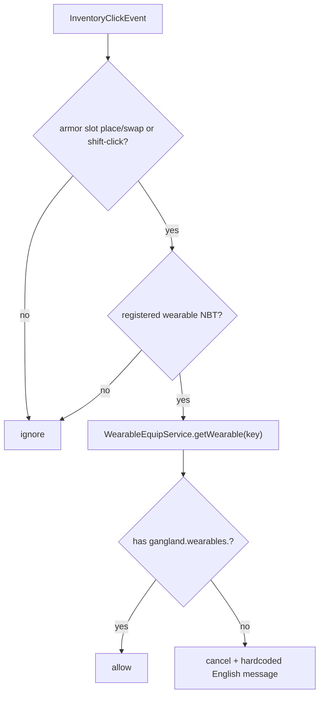
```mermaid
flowchart TD
  A["InventoryClickEvent"] --> B{"armor slot place/swap or shift-click?"}
  B -->|no| Z["ignore"]
  B -->|yes| C{"registered wearable NBT?"}
  C -->|no| Z
  C -->|yes| D["WearableEquipService.getWearable(key)"]
  D --> E{"has gangland.wearables.<key>?"}
  E -->|yes| F["allow"]
  E -->|no| G["cancel + hardcoded English message"]
```

**State & persistence effects:** none.

**Edge cases & guards observed:** the gate only covers inventory clicks. Right-click-to-equip, dispenser equip,
`/glw` item grants and drag-equip are unchecked (Observations #7). An item whose key is no longer registered passes
through unchecked.

### W18: Wearable damage reduction (weapon pipeline)

**Trigger:** any weapon damage calculation in gangland-weapon.

**Steps:** `WearableService.applyWearableReduction(damage, target, isProjectile)` iterates HEAD/CHEST/LEGS/FEET,
`resolveWearable` (registry hit → registered instance; NBT key present but unregistered, or plain vanilla armour →
`Wearable.fromItemStack` temporary with a material-tier base reduction of 0.03–0.15), rolls `REACTIVE`
(`level * 0.02` per piece, returns 0 damage on a proc), computes
`min(slotReduction + enchantmentBonus, 0.90)` and multiplies the damage. `reduceCritBonus` multiplies by
`1 - TOUGHENED*0.10` per piece; `reduceFireTicks` sums `FIRE_RESISTANT*0.25` plus vanilla `FIRE_PROTECTION*0.02`
additively across pieces, capped at 90 %.

**Diagram:**
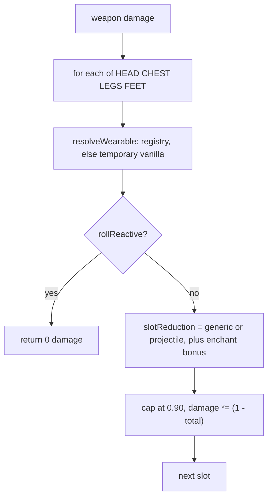
```mermaid
flowchart TD
  A["weapon damage"] --> B["for each of HEAD CHEST LEGS FEET"]
  B --> C["resolveWearable: registry, else temporary vanilla"]
  C --> D{"rollReactive?"}
  D -->|yes| E["return 0 damage"]
  D -->|no| F["slotReduction = generic or projectile, plus enchant bonus"]
  F --> G["cap at 0.90, damage *= (1 - total)"]
  G --> H["next slot"]
```

**State & persistence effects:** none — resolution is stateless and per-hit, so there is nothing to remove on unequip.
There are **no** potion effects anywhere in the wearable system.

**Edge cases & guards observed:** per-piece caps are 0.80 generic / 0.90 projectile / 0.90 explosion; four pieces still
stack multiplicatively and can approach total immunity (0.9^4 ⇒ ~0.01 of the original damage). `LIGHTWEIGHT` has no
effect anywhere; `FUEL_EFFICIENT` is only consumed by `JetpackTask.getEffectiveConsumptionRate`.

### W19: Jetpack activation

**Trigger:** join, chestplate-slot inventory click, right-click while holding a chestplate, dismount, or
`PlayerUndownedEvent`.

**Steps:**
1. Each trigger calls `JetpackService.scheduleChestplateCheck(player)`, which defers one tick and then
   `wearableService.resolveWearable(chestplate)`; `wearable.isJetpack()` (i.e. `fuelKey != null`) → `activate`,
   otherwise `deactivate` when a session exists.
2. `activate` (JetpackService.java:46-66): no-op if already active; create `JetpackSession` + `JetpackTask`; put in
   `activeSessions`; `task.runTaskTimer(plugin, 1L, 1L)`; `player.setAllowFlight(true)` (explicitly **not**
   `setFlying(true)`); insert `gangland_jetpack_input` into the Netty pipeline before `packet_handler`.
3. `JetpackEquipListener.onToggleFly` cancels `PlayerToggleFlightEvent` and forces `setFlying(false)` while a session
   exists; `JetpackKickSuppressor` cancels any kick whose reason contains "flying".

**Diagram:**
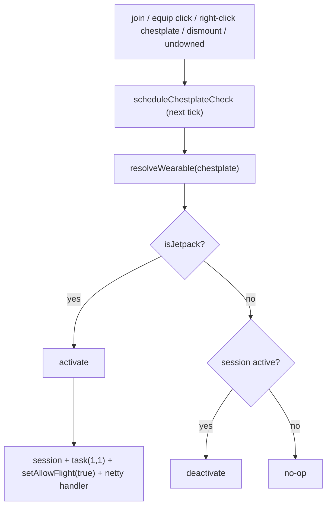
```mermaid
flowchart TD
  A["join / equip click / right-click chestplate / dismount / undowned"] --> B["scheduleChestplateCheck (next tick)"]
  B --> C["resolveWearable(chestplate)"]
  C --> D{"isJetpack?"}
  D -->|yes| E["activate"]
  D -->|no| F{"session active?"}
  F -->|yes| G["deactivate"]
  F -->|no| H["no-op"]
  E --> I["session + task(1,1) + setAllowFlight(true) + netty handler"]
```

**State & persistence effects:** one session, one repeating task and one Netty handler per player; `allowFlight` is
mutated.

**Edge cases & guards observed:** `JetpackEquipListener` skips CREATIVE/SPECTATOR, but `JetpackActivateListener.onJoin`
and `JetpackSessionLifecycleListener` do not — a creative player wearing a jetpack still gets a session, and the
eventual `deactivate` calls `setAllowFlight(false)`. Fuel is not a precondition for activation.

### W20: Jetpack flight tick

**Trigger:** `JetpackTask.run()` every tick.

**Steps:**
1. `checkGuards`: offline → `deactivate` + `cancel`; chestplate no longer carries the same wearable key →
   `deactivate` + `cancel`.
2. Read `inputJump`/`inputSneak` from the session. If jump is held while the held weapon is scoped
   (`ScopeData.isScoped()`), jump is forced to `false` so no fuel is burned for a movement `ScopeJumpListener` will
   block anyway.
3. `hasFuel = fuelService.hasFuelOnWearable(player)` (chestplate `fuel_current > 0`);
   `onGround = PlayerUtil.isOnGround(player)`.
4. `handleGlideToggle`: sneak+jump rising edge while airborne toggles `glideModeActive`; ground contact or jump alone
   clears it.
5. `applyVerticalPhysics`:
   - glide mode + fuel → burn `getEffectiveConsumptionRate` (base rate reduced 10 %/level of `FUEL_EFFICIENT`,
     floored at 1), glide particles, `return 0.0` (hover).
   - jump + fuel + airborne → burn fuel, `thrustTicks++`, `ramp = min(thrustTicks / thrustRampTicks, 1)`, flame
     particles, `return min(currentY + ascendPower * (0.1 + 0.9*ramp), maxSpeedY)`.
   - airborne otherwise → glide particles and `return max(currentY - descentAccel, maxDescentSpeed)`.
   - on ground → return the current Y unchanged.
6. `applyHorizontalPhysics`: skipped entirely when on ground without thrust; otherwise WASD builds a normalized
   look-relative vector, adds `horizInfluence` per tick, clamps the horizontal magnitude to `maxHorizSpeed`, and calls
   `player.setVelocity(new Vector(newX, newY, newZ))` — note this runs (and sets velocity) **even with no directional
   input** whenever the player is airborne.
7. `updateActionBar` sends "Gliding", "No fuel" or the fuel bar every tick.
8. `playFlightSounds` fires `SoundEffect.playSounds(...)` every 10th tick for the thrust or glide sound.

**Diagram:**
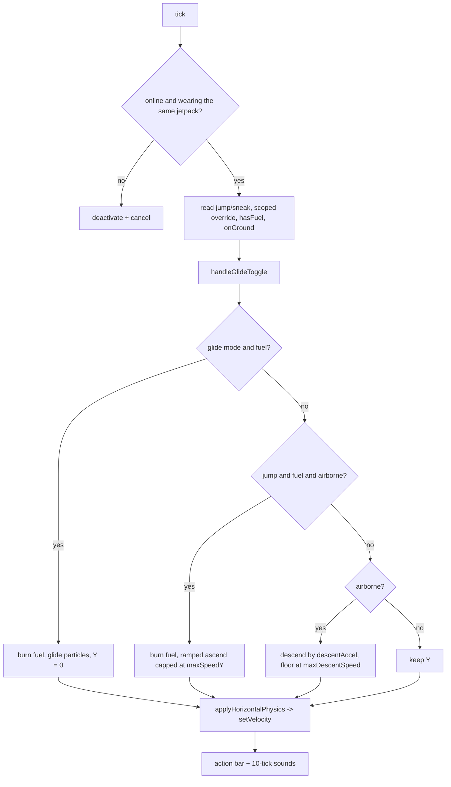
```mermaid
flowchart TD
  A["tick"] --> B{"online and wearing the same jetpack?"}
  B -->|no| C["deactivate + cancel"]
  B -->|yes| D["read jump/sneak, scoped override, hasFuel, onGround"]
  D --> E["handleGlideToggle"]
  E --> F{"glide mode and fuel?"}
  F -->|yes| G["burn fuel, glide particles, Y = 0"]
  F -->|no| H{"jump and fuel and airborne?"}
  H -->|yes| I["burn fuel, ramped ascend capped at maxSpeedY"]
  H -->|no| J{"airborne?"}
  J -->|yes| K["descend by descentAccel, floor at maxDescentSpeed"]
  J -->|no| L["keep Y"]
  G --> M["applyHorizontalPhysics -> setVelocity"]
  I --> M
  K --> M
  L --> M
  M --> N["action bar + 10-tick sounds"]
```

**State & persistence effects:** chestplate NBT rewritten via `player.getInventory().setChestplate(updated)` on every
fuel-burning tick; player velocity overwritten each airborne tick.

**Edge cases & guards observed:** `consumeFuelFromWearable` clamps at 0 through `Fuel.writeFuelCurrent`. Running out of
fuel does **not** end the session — the player keeps the slow controlled descent, the horizontal control and the
fall-damage immunity (Observations #4, #5). `Wearable.glideDescentRate` and `Wearable.maxSpeedY`'s config default of
0.8 are only partially used (`maxSpeedY` yes, `glideDescentRate` never).

### W21: Jetpack deactivation

**Trigger:** quit, death/downed, mounting a vehicle, unequipping the chestplate, `/glw reload`, plugin disable.

**Steps:**
1. `JetpackService.deactivate` removes the session, cancels the task, and — only if the player is online — calls
   `setFlying(false)`, `setAllowFlight(false)` and removes the Netty handler.
2. `JetpackActivateListener.onQuit` covers disconnects; `CustomPlayerDeathListener.enterDownedState:170` covers the
   downed/death path; `JetpackSessionLifecycleListener.onMount` covers entering any vehicle.
3. `refreshSessions` (on reload) deactivates offline players and anyone no longer wearing a jetpack, and re-points the
   rest at the fresh `Wearable`.
4. `deactivateAll` (on `onShutdown`) cancels every task, resets flight, removes every handler, and clears the map.

**Diagram:**
```mermaid
flowchart TD
  A["quit / downed / mount / unequip / reload / disable"] --> B["JetpackService.deactivate or deactivateAll"]
  B --> C["remove session from map"]
  C --> D["cancel JetpackTask"]
  D --> E{"player online?"}
  E -->|yes| F["setFlying(false), setAllowFlight(false), remove netty handler"]
  E -->|no| G["skip cleanup, handler dies with the connection"]
```

**State & persistence effects:** session map entry removed; `allowFlight` forced off.

**Edge cases & guards observed:** `setAllowFlight(false)` is unconditional for online players, clobbering flight
granted by anything else (creative mode, the downed-respawn `Settings.isRespawnGameModeAllowFly()` path in
`CustomPlayerDeathListener`, other plugins).

### W22: Autosave of parked-car state

**Trigger:** `PeriodicalUpdates` repeating timer (`Settings.isAutoSave()`, interval in minutes) and the explicit
`forceUpdate()` in `Gangland.onDisable`.

**Steps:** the timer calls the repository layer, which pulls rows from the data supplier registered in the
`CarService` constructor (`() -> new ArrayList<>(parkedCarRecords.values())`) and upserts them through
`TableBackend.upsertAll`. Every mutating car path (`placeCar`, `parkCar`, `forcePark`, `refuelParkedCar`,
`damageParkedCar`, `destroyAll`) additionally saves inline, and `pickupCar`/`destroyCar` delete.

**Diagram:**
```mermaid
flowchart TD
  A["PeriodicalUpdates timer"] --> B["repository data supplier"]
  B --> C["parkedCarRecords.values()"]
  C --> D["TableBackend.upsertAll"]
  E["onDisable forceUpdate"] --> B
  F["destroyAll cleared the map first"] --> G["forceUpdate sees nothing, hence inline saves"]
```

**State & persistence effects:** `parked_car` rows kept in sync with in-memory records.

**Edge cases & guards observed:** the data supplier is correctly wired (satisfying the project's
`setDataSupplier` rule). Fuel/durability of a *driven* car are never in `parkedCarRecords` until the session ends, so
a server crash mid-drive restores the pre-mount values.

## Cross-feature Dependencies

- **Depends on:**
  - Keystone `keystone-bean` (`BeanLifecycle`, `@ListenerHandler`, `@AutowireTarget`, `@Bean`), `keystone-persistence`
    (`FileManager`, `FileInitializer`, `FileHandler`, `AbstractRepository`, `Table`, `Attribute`, `DatabaseBackend`),
    `keystone-item` (`ItemBuilder` + the NBT bridge), `keystone-command` (`Command`, `SubArgument`,
    `OptionalArgument`, `Tree`), `keystone-common` (`ParticleUtil`, `ActionBarManager`, `ChatUtil`, `PlayerUtil`,
    `Placeholder`, `SoundEffect`, `PlayerInputInterceptor`).
  - `gangland-infra/gangland-item` — `Fuel`, `FuelKey`, `FuelBar`, `FuelContract`, `Wearable`, `WearableTrait`,
    `WearableEquipService`, `ItemRefresher(Registry)`.
  - `gangland-features/gangland-weapon` — `WearableService` (base class of `WearableAddon`), `WeaponService`
    (melee damage + scope check + `isWeapon`), `WeaponEntityDamageEvent`, `WeaponRaytraceImpactEvent`,
    `ThrowableAction.pendingVehicleExplosionDamage`, `MeleeWeapon`, `ScopeData`.
  - `gangland-core` — `DownedPlayerRegistry` (dismount allowance), `PlayerUndownedEvent`.
  - `gangland-impl` — `Settings`, `Messages`, `PermissionManager`, `PlaceholderService`, `RepositoryRegistry`,
    `UserManager`, `PeriodicalUpdates`, `SignManager` (takes `CarAddon`/`WearableAddon` for sign-driven item grants).
  - XSeries `XMaterial` for config material resolution.
- **Depended on by:**
  - `gangland-impl` `CustomPlayerDeathListener` (jetpack deactivate on downing).
  - `gangland-ui/shop-api` + cops-n-crooks trader views, through `ItemRefresherRegistry` (`CarItemRefresher`,
    `WearableRefresher`) and `ItemSerializerRegistry` (`ItemKind.CAR`).
  - `SignManager` (car/wearable item dispensing signs).
  - The weapon damage pipeline consumes `WearableService` for every hit.

## Observations & Potential Issues

| # | Location | Observation | Risk | Confidence |
|---|---|---|---|---|
| 1 | `CarService.destroyAll` pass 1 (`gangland-features/gangland-gadget/.../car/CarService.java:466-479`) vs `CarDismountListener.onDismount` (`.../listener/car/CarDismountListener.java:46-49`) | Pass 1 calls `live.eject()` while the sessions are still in `VehicleRegistry`, so the dismount listener sees a non-sneaking, non-dead player and cancels every one of those ejects. The stated purpose of the two-pass design (unmount everyone before persisting, to avoid `RootVehicle` NBT) is therefore not achieved by pass 1; the passenger is only really removed later by `MinecartVehicle.despawn()` after `vehicleRegistry.clear()`. | Fragile ordering: any future change that persists or returns before the despawn loop reintroduces the rogue-duplicate-minecart bug the code was written to fix. | High |
| 2 | `CarQuitListener.onQuit:35-40` | Same cause — the first `live.eject()` is cancelled by the dismount listener; only `parkCar`'s trailing eject (after `unregister`) works. The listener's own eject is dead code. | Misleading; masks issue #1. | High |
| 3 | `CarService.pickupCar:397` and `destroyCar:429` | `player.getInventory().addItem(...)` return value (the leftover map) is discarded — with a full inventory the car item is destroyed. `CarGiveCommand.giveCarItem:122-126` does handle leftovers by dropping them, showing the intended pattern. | Item loss. | High |
| 4 | `JetpackFallDamageListener:32` + `JetpackTask.checkGuards:88-99` | A jetpack session exists for as long as the chestplate is worn, regardless of fuel. All FALL damage is cancelled, so simply wearing an empty jetpack grants permanent fall immunity. | Gameplay exploit. | High |
| 5 | `JetpackTask.applyVerticalPhysics:135-142` + `applyHorizontalPhysics:149-195` | With zero fuel the player still gets a capped slow descent (`maxDescentSpeed`, default −0.5 vs vanilla terminal ≈ −3.9) and full WASD air control, because those branches never check `hasFuel`. | Fuel becomes almost irrelevant; free glider. | High |
| 6 | `CarEntityInteractListener` (mount), `CarDamageListener.onVehicleDamage:112-116` (pickup), `CarService.refuelParkedCar` | No ownership/permission check on mount, pickup or refuel. `car_owner` NBT and `placer_uuid` are stored but never read. `gangland.cars.<id>` is only checked at placement. | Any player can steal/drive/pick up any placed car. | High |
| 7 | `WearableEquipListener.resolveArmorBeingEquipped:69-88` | The permission gate only covers `InventoryClickEvent` (cursor→armour slot and shift-click). Right-click-to-equip, drag-equip, dispensers and command/shop grants bypass `gangland.wearables.<key>` entirely. | Permission bypass. | High |
| 8 | `PlayerInputInterceptor.ensureReflectionReady` (`Keystone/keystone-common/.../nms/input/PlayerInputInterceptor.java:96-105`) resolves `net.minecraft.network.protocol.game.ServerboundPlayerInputPacket` | On 1.16 (the declared support floor) that class does not exist under Mojang mappings, so `packetClass` is null and **no** car steering or jetpack input is ever parsed. On 1.17–1.21.1 the packet exists but vanilla clients only send it while riding a vehicle — so cars work, jetpack jump/sneak/WASD do not. `activate`/`mountCar` fail silently when `getChannel` returns null too. | Cars unsteerable and jetpacks inert on a large part of the declared supported range; no diagnostic is emitted. | Medium-High |
| 9 | `Fuel.setCurrentFuel` / `writeFuelCurrent` + `FuelRefuelListener.tryRefuel:140-144` and `tryRefuelInInventory:199-203` | `ItemBuilder` mutates the underlying `ItemStack` and NBT is per-stack, so refuelling a stack of N fuel cans consumes one coal and grants `fuelPerItem` to all N cans. `CarEntityInteractListener:87` has the mirror problem (a stack of cans loses fuel as if it were one). | Fuel duplication (and, in the transfer direction, loss). | Medium-High |
| 10 | `Car.buildItem:103-107` stamps `FuelKey.FUEL_ID`, and `Fuel.isFuelItem` only checks that tag | A fuel-enabled car *item* is indistinguishable from a fuel can: `CarEntityInteractListener:57` will happily pump fuel from a spare car item into a parked car of the same type, `FuelRefuelListener` will refuel car items with coal, and `FuelHoldDisplayListener` shows a gauge for them. | Unintended fuel-economy paths; possible exploit combined with #9. | Medium-High |
| 11 | `ParkedCarTable:21` declares `yaw` as `Attribute<Float>` but `getData:55` writes `(double) data.getYaw()` and `ParkedCarRepository.doLoadAll:43` reads `(float)(double) result[6]` | The column type and the value type disagree. On SQLite everything is REAL so it works; on a MySQL backend where the driver returns a `Float`, the `(double)` cast throws `ClassCastException` and **all** parked cars fail to load. | Backend-specific startup failure. | Medium |
| 12 | `WearableAddon.loadWearables:155` (`Fuel_Key` defaults to `""`) vs `Wearable.isJetpack():228` (`fuelKey != null`) | A `Jetpack:` section without `Fuel_Key` yields an empty-string key, so `isJetpack()` is true, a session starts and `setAllowFlight(true)` is granted, but `buildItem` skips the fuel tags (it requires a non-empty key), so the wearable can never hold fuel. | Config foot-gun: a jetpack that grants flight state and fall immunity but never flies. | Medium |
| 13 | `CarService.reloadParkedVehicles:587` — `findSurvivor` scans only `spawnLoc.getChunk()` | A minecart that drifted into a neighbouring chunk before the last save is not reclaimed, so a second car is spawned at the DB location. The javadoc also promises removal of orphans without a matching record; no such code exists. | Duplicate cars after a crash. | Medium |
| 14 | `CarService.destroyCar:416` | `if (task == null) return;` happens *before* `vehicleRegistry.unregister` and `despawn`, so a session with a null task leaks both the registry entry and the world entity. | Entity/registry leak (only reachable via an unusual construction path). | Low-Medium |
| 15 | `JetpackService.deactivate:81` and `deactivateAll:158` | `setAllowFlight(false)` is unconditional. A creative-mode player (who can reach `activate` through `JetpackActivateListener.onJoin`, which has no gamemode filter) or a downed player whose respawn config sets `allowFlight(true)` loses flight when the jetpack ends. | Breaks other systems' flight state. | Medium |
| 16 | `VehicleMovementTask:110` (`Sound.ENTITY_GENERIC_EXPLODE`), `CarEntityInteractListener:89` and `FuelRefuelListener:147/174/206` (`Sound.ENTITY_EXPERIENCE_ORB_PICKUP`) | Raw Bukkit `Sound` enum constants are used instead of Keystone `SoundEffect`/XSeries, contrary to the project's stated convention, and are not configurable. | Version-drift risk on enum renames; no config surface. | High |
| 17 | `FuelRefuelListener:135/162/167/194`, `WearableEquipListener:54`, `JetpackTask:202-204`, `FuelBar`, `VehicleSession.buildHealthTitle` | Hardcoded English user-facing strings that bypass the `Messages` enum, unlike the car listeners which route through `CarMessageContract`. | Untranslatable UI. | High |
| 18 | `CarService.placeCar` | No limit on how many cars a player may place, no spawn-location validity check (block occupancy, world guard, distance), and no cooldown. | Entity spam / grief vector. | Medium |
| 19 | `VehicleMovementTask.checkGuards:80/86` | `entity.getEntityUUID()` is passed to `forcePark`/`parkCar`, which do `ConcurrentHashMap.get(uuid)` — a null UUID (possible only if the wrapped minecart reference were null) would throw NPE inside the tick task. | Tick-task exception storm. | Low |
| 20 | `Car.maxHealth` (parsed at `CarAddon:101`) and `Wearable.glideDescentRate` (parsed at `WearableAddon:158`) | Both are read from YAML, documented in the file headers, stored on the model, and never consumed by any code path. | Dead config keys that mislead server owners. | High |
| 21 | `commands.json` | No `fuel_refuel_amount` entry although `FuelRefuelCommand.refuelAmount()` registers the positional argument; the help layer therefore omits it. | Missing help entry (violates the project's commands.json rule). | High |
| 22 | `JetpackTask` fuel burn → `FuelService.consumeFuelFromWearable:229` | `player.getInventory().setChestplate(updated)` runs on every fuel-burning tick, forcing a full armour-slot resync packet per player per tick. | Performance / packet churn with many jetpack users. | Medium |
| 23 | `CarService.reloadParkedVehicles:585` | `spawnLoc.getChunk().load()` force-loads one chunk per persisted car synchronously during bean construction. | Startup stall proportional to the number of parked cars. | Medium |
| 24 | `CarDismountListener:46` | Non-sneak dismounts are cancelled for *any* cause — including plugin-initiated ejects, teleports and vehicle transfers. Combined with #1/#2 this makes "get the player out of the car" require unregistering the session first, which is an undocumented precondition. | Interoperability with other plugins; hard-to-diagnose stuck players. | Medium |
| 25 | `CarService` fuel/durability during a session | Nothing is persisted while driving; a crash restores the values from the last park/place. Conversely `refuelParkedCar` and `damageParkedCar` save on every single event (per-hit DB write). | Data loss on crash; write amplification on damage. | Medium |
| 26 | `MinecartVehicle.getLocation():102` returns `null` when the minecart is null | Callers such as `VehicleMovementTask.tickBurnout:106/108` dereference it (`entity.getLocation().getWorld()`), relying entirely on the `isAlive()` guard earlier in the tick. | Latent NPE if the guard order ever changes. | Low |
| 27 | `CarDamageListener.pendingRightClickInteract` | Entries are added on every right-click of a car and removed by a 1-tick scheduled task; `onWeaponRaytraceImpact` only *reads* the flag while `onVehicleDamage` *removes* it, so the two consumers race for the same one-tick token. | Occasional missed suppression (a shot damaging the car the player is entering). | Low-Medium |
| 28 | `FuelService.slotCache` | Cleared only by `FuelHoldDisplayListener.onQuit`. If that listener is ever removed or fails to fire, per-player entries accumulate. Stale slot hints are validated on read, so correctness is fine. | Minor memory growth. | Low |

## Test Surface

- **Pure-logic candidates (plain JUnit, no Bukkit):**
  - `FuelBar.render` — 0/max, `maxFuel <= 0` ("Unlimited"), `currentFuel <= 0` ("Empty"), rounding at the segment
    boundaries, `filled + empty == 20` invariant.
  - `WearableTrait.fromKey` (case-insensitivity, unknown key → null) and `Wearable.traitBonus` capping at `maxLevel`.
  - `Wearable.getGenericDamageReduction` / `getProjectileDamageReduction` / `getExplosionDamageReduction` /
    `getCritBonusReduction` / `getFireTickReduction` — cap enforcement (0.80 / 0.90 / 0.90 / 1.0 / 1.0).
  - `Wearable.isArmorMaterial` / `isLeatherArmor` / `vanillaMaterialReduction` tier table (needs only the `Material`
    enum).
  - `WearableAddon.parseHexColor` (private — extract or test through `loadWearables`).
  - `ExhaustSide.fromString` fallback to `random()`.
  - `VehicleMovementTask.decelerate` / `updateSpeed` / `updateSteering` — currently private and coupled to
    `VehicleSession`; extracting a pure `CarPhysics` helper would make the accelerate/brake/reverse/burnout state
    machine directly testable (recommended before touching the physics).
  - `JetpackTask.getEffectiveConsumptionRate` — `FUEL_EFFICIENT` levels 0/1/2/overflow, floor of 1.
  - `ParkedVehicle.damage` / `addFuel` / `isDestroyed`, `VehicleSession.damage` / `consumeFuel` / `addFuel` clamping.
- **Needs Bukkit/Keystone mocks (Mockito):**
  - `Fuel` static NBT helpers — require a mocked `ItemBuilder`/`NbtBridge` accessor; worth it to pin the clamping
    contract of `setCurrentFuel` / `writeFuelCurrent` / `setMaxFuel` and the in-place mutation semantics behind
    Observation #9.
  - `FuelService` inventory operations — mock `Player`/`PlayerInventory`: slot-cache hit, stale-cache invalidation,
    `consumeFuel` on an empty can, `addFuel` on a full can, chestplate variants.
  - `WearableService.applyWearableReduction` / `reduceCritBonus` / `reduceFireTicks` — mock `LivingEntity` +
    `EntityEquipment`; assert multiplicative stacking, the REACTIVE short-circuit, and the per-slot 0.90 cap.
  - `CarService` map/record bookkeeping — mock `VehicleEntity`, `IRepository`, `JavaPlugin`: `dbId` reuse across
    place → mount → park, `parkedCarRecords` re-keying on the dead-entity respawn path, delete-on-pickup, and the
    `destroyAll` two-pass ordering (a mock that records call order would pin Observation #1).
  - `ParkedCarRepository.doLoadAll` with a stubbed `TableBackend.selectAll` returning `Object[]` rows — covers the
    `yaw` cast (Observation #11) and null placer/exhaust handling.
  - `CarInteractListener` NBT-fallback matrix (item with/without `fuel_current`, `fuel_max`, `car_durability`,
    `car_exhaust_side`).
  - `WearableEquipListener.resolveArmorBeingEquipped` — an `InventoryClickEvent` mock per `InventoryAction`.
- **Integration-only (real server):**
  - Steering-packet interception on each target NMS revision (Observation #8) — the single highest-value manual check.
  - Mount → drive → quit → rejoin, verifying exactly one minecart exists and the player has no `RootVehicle` tag.
  - Full-restart round-trip: park several cars, `stop`, restart, confirm counts, locations, fuel and durability, plus
    the crash variant (kill -9) to exercise `findSurvivor`.
  - Dismount cancellation behaviour against other plugins' ejects and against death/downed dismounts.
  - Jetpack flight feel, kick suppression under sustained hovering, fall damage after fuel exhaustion, and the
    creative-mode `allowFlight` interaction.
  - Chunk-unload while a car is parked or being driven (`forcePark` path).
  - `/glw reload` with a car currently being driven and a jetpack currently in flight.
- **Existing tests covering this area:** none. The repository has 12 test classes
  (`gangland-impl/src/test/java/**` — datastructure/files/general helpers plus `RankRepositorySpiTest`, and
  `gangland-infra/gangland-item/src/test/java/.../ItemDslAdapterTest.java`); not one touches cars, fuel, jetpacks or
  wearables.

---

[Audit index](workflow-audit) · [← Weapons](workflow-audit-11-weapons) · [Loot, Signs & Waypoints →](workflow-audit-13-lootchests-signs-waypoints)
